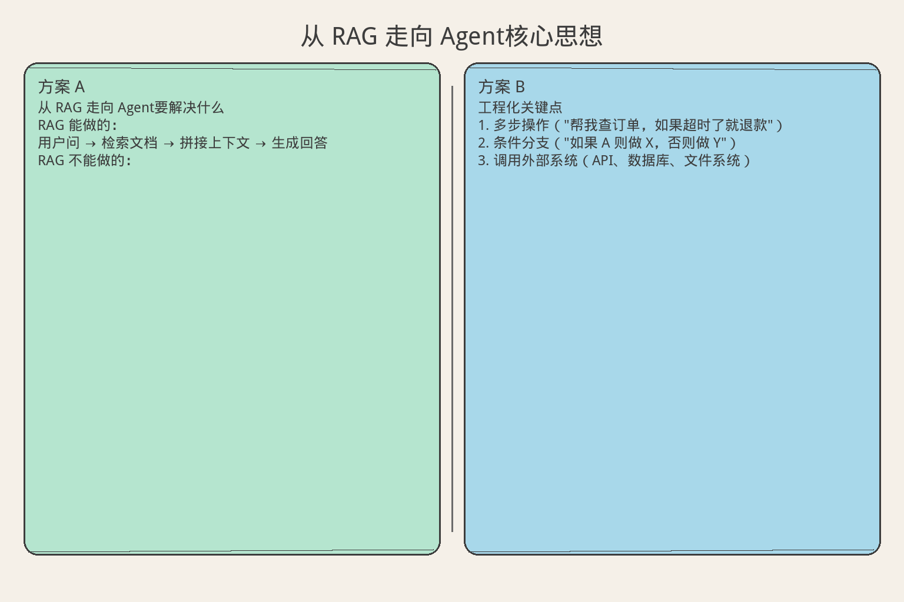
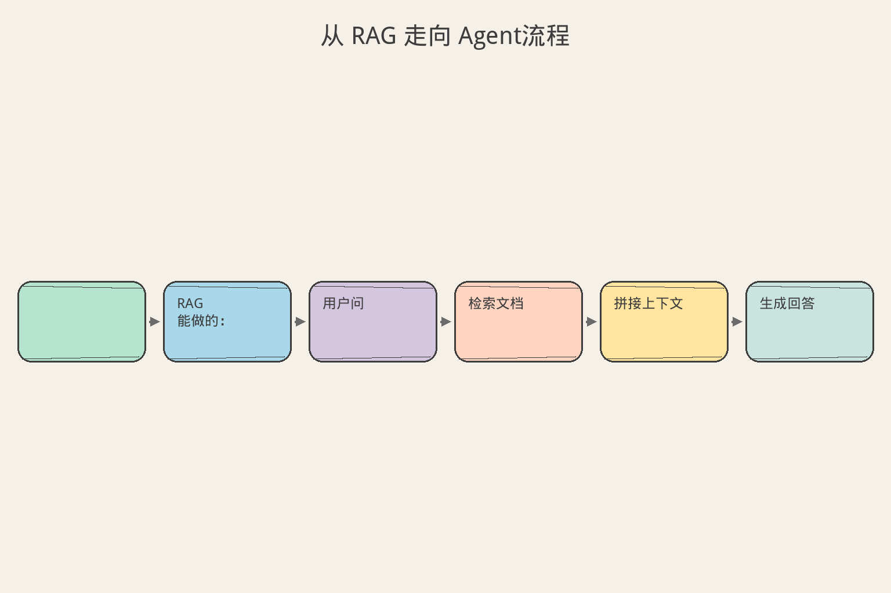
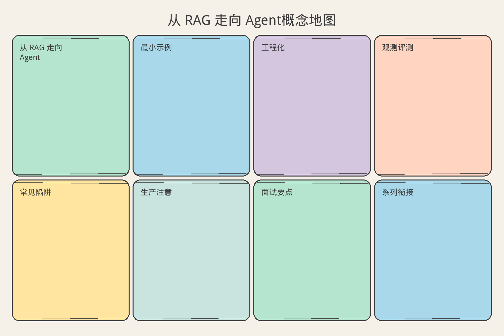

# AI Agent 工程（一）：从 RAG 走向 Agent

> [201 Agentic RAG](201.agentic-rag-tutorial.md) 已经介绍了"检索 + 工具 + 决策循环"的基本概念。这篇正式开启 AI Agent 工程系列，重点回答一个更基础的问题：现有 RAG 系统要增加哪些能力，才会成为一个可控的任务执行系统？

**阅读建议：** 建议先完成 RAG 系列（100–213）中的检索、生成和 Agentic RAG 相关章节。如果你已经理解"检索 → 拼接 → 生成"的基本链路，就可以开始这篇。

**环境要求：**
- Python **3.10+**（示例使用 `match` 和 `X | Y` 类型语法）
- 无需安装第三方库，所有示例使用标准库

---

## 目录

1. [你会学到什么](#你会学到什么)
2. [它解决什么问题](#它解决什么问题)
3. [核心概念：RAG 和 Agent 的本质区别](#核心概念rag-和-agent-的本质区别)
4. [最小示例](#最小示例)
5. [工程化版本](#工程化版本)
6. [常见失败模式](#常见失败模式)
7. [什么时候不要这么做](#什么时候不要这么做)
8. [生产环境注意事项](#生产环境注意事项)
9. [如何观测和评测](#如何观测和评测)
10. [和 RAG 后端前端的关系](#和-rag--后端--前端的关系)
11. [面试怎么讲](#面试怎么讲)
12. [下一步](#下一步)

## 你会学到什么

学完这篇，你应该能：

- 说清楚 RAG 和 Agent 的本质区别（不是"有没有工具"）。
- 判断一个需求该用 RAG 还是 Agent。
- 在现有 RAG 系统上增加 Agent 能力（最小改动路径）。
- 理解 Agent 的三个核心组件：感知、决策、执行。
- 设计第一个"观察→思考→行动"循环。
- 避免 Agent 失控的基本策略。

## 它解决什么问题


读下图时，先看「从 RAG 走向 Agent核心思想」建立直觉。


### RAG 的天花板

```text
RAG 能做的：
  用户问 → 检索文档 → 拼接上下文 → 生成回答

RAG 不能做的：
  1. 多步操作（"帮我查订单，如果超时了就退款"）
  2. 条件分支（"如果 A 则做 X，否则做 Y"）
  3. 调用外部系统（API、数据库、文件系统）
  4. 自我纠错（回答不对时重新检索）
  5. 持续执行（不是一问一答，而是持续工作）

这些"不能做"就是 Agent 要解决的。
```

### 从 RAG 到 Agent 的跨越

```text
RAG 是一个函数：
  answer = generate(retrieve(query))
  输入 → 输出，一次完成

Agent 是一个循环：
  while not done:
      observation = perceive(environment)
      decision = think(observation, memory)
      action = act(decision)
      environment = execute(action)
  持续感知、思考、行动，直到任务完成

关键区别：
  RAG：被动响应（用户问才答）
  Agent：主动执行（给个目标，自己规划步骤）
```

## 核心概念：RAG 和 Agent 的本质区别

### 对比表

```text
维度          RAG                  Agent
──────────────────────────────────────────────────
执行模式      单次（一问一答）      循环（多步执行）
控制流        固定管道              动态决策
外部交互      只读（检索）          读写（调用工具）
错误处理      无（或简单重试）      自我纠错
状态          无状态                有状态（记忆）
目标          回答问题              完成任务
复杂度        低                    中-高
适用场景      知识问答              任务执行
```

### Agent 的三个核心组件

```text
1. 感知（Perception）
   从环境获取信息
   - 用户输入
   - 工具返回结果
   - 系统状态变化

2. 决策（Decision）
   根据当前状态选择下一步
   - LLM 推理
   - 规则引擎
   - 历史经验

3. 执行（Action）
   对环境产生影响
   - 调用工具
   - 返回回答
   - 更新状态
```

### 最小 Agent 循环

```text
while True:
    # 感知
    observation = get_observation()

    # 决策
    if should_stop(observation):
        break
    action = decide(observation)

    # 执行
    result = execute(action)

    # 反馈（下一轮的感知）
    feed_back(result)
```

## 最小示例


读下图时，先看「从 RAG 走向 Agent流程」建立直觉。


### 从 RAG 到 Agent 的渐进演化

```python
# === Level 0: 纯 RAG ===

def rag_answer(query: str, documents: list[str]) -> str:
    """最简单的 RAG：检索 + 生成。"""
    # 检索（简化：关键词匹配）
    relevant = [d for d in documents if query.lower() in d.lower()]
    context = "\n".join(relevant[:3])
    # 生成（简化：拼接）
    return f"根据文档：\n{context}\n\n回答：这是关于「{query}」的信息。"


# === Level 1: 带路由的 RAG ===

def routed_rag(query: str, documents: list[str]) -> str:
    """增加路由：判断是否需要检索。"""
    # 简单意图判断
    if query.startswith("计算") or query.startswith("转换"):
        return f"这是一个操作请求，RAG 无法处理：{query}"
    return rag_answer(query, documents)


# === Level 2: 最小 Agent ===

from dataclasses import dataclass, field
from typing import Any


@dataclass
class AgentState:
    """Agent 状态。"""
    goal: str
    steps_taken: list[str] = field(default_factory=list)
    observations: list[str] = field(default_factory=list)
    done: bool = False
    result: str = ""


class MinimalAgent:
    """最小 Agent：观察→思考→行动循环。"""

    def __init__(self, documents: list[str]):
        self.documents = documents
        self.tools = {
            "search": self._tool_search,
            "calculate": self._tool_calculate,
            "answer": self._tool_answer,
        }

    def run(self, goal: str, max_steps: int = 5) -> AgentState:
        """执行 Agent 循环。"""
        state = AgentState(goal=goal)

        for step in range(max_steps):
            # 感知：当前状态
            observation = self._observe(state)
            state.observations.append(observation)

            # 决策：选择动作
            action, params = self._decide(state)
            state.steps_taken.append(f"{action}({params})")

            # 执行
            result = self._execute(action, params)

            # 判断是否完成
            if action == "answer":
                state.done = True
                state.result = result
                break

        if not state.done:
            state.result = "达到最大步数，未能完成"

        return state

    def _observe(self, state: AgentState) -> str:
        """感知当前状态。"""
        if not state.steps_taken:
            return f"新任务：{state.goal}"
        return f"已执行 {len(state.steps_taken)} 步，最后结果：{state.observations[-1] if state.observations else '无'}"

    def _decide(self, state: AgentState) -> tuple[str, str]:
        """决策（简化：规则引擎）。"""
        goal = state.goal.lower()

        # 第一次：判断类型
        if not state.steps_taken:
            if "计算" in goal or "+" in goal or "*" in goal:
                return "calculate", goal
            elif any(kw in goal for kw in ["什么", "怎么", "如何", "为什么"]):
                return "search", goal
            else:
                return "answer", f"我不确定如何处理：{state.goal}"

        # 后续：给出答案
        return "answer", f"基于之前的步骤，结果是：{state.observations[-1]}"

    def _execute(self, action: str, params: str) -> str:
        """执行动作。"""
        tool = self.tools.get(action)
        if tool:
            return tool(params)
        return f"未知动作：{action}"

    def _tool_search(self, query: str) -> str:
        relevant = [d for d in self.documents if any(w in d.lower() for w in query.lower().split())]
        return "\n".join(relevant[:2]) if relevant else "未找到相关文档"

    def _tool_calculate(self, expr: str) -> str:
        # 安全计算（简化）
        import re
        numbers = re.findall(r"\d+", expr)
        if "+" in expr and len(numbers) >= 2:
            return str(sum(int(n) for n in numbers))
        if "*" in expr and len(numbers) >= 2:
            result = 1
            for n in numbers:
                result *= int(n)
            return str(result)
        return "无法解析表达式"

    def _tool_answer(self, text: str) -> str:
        return text


# 演示
def demo_transition():
    docs = [
        "Python 是一种解释型编程语言",
        "RAG 是检索增强生成技术",
        "Agent 是能自主决策的系统",
    ]

    # Level 0: 纯 RAG
    print("=== Level 0: 纯 RAG ===")
    print(f"  {rag_answer('Python', docs)}")

    # Level 2: Agent
    print("\n=== Level 2: Agent ===")
    agent = MinimalAgent(docs)

    # 任务 1：知识问答
    state = agent.run("什么是 Agent？")
    print(f"  任务: {state.goal}")
    print(f"  步骤: {state.steps_taken}")
    print(f"  结果: {state.result}")

    # 任务 2：计算
    state = agent.run("计算 15 + 27")
    print(f"\n  任务: {state.goal}")
    print(f"  步骤: {state.steps_taken}")
    print(f"  结果: {state.result}")
```

## 工程化版本

### 带工具注册的 Agent 框架

```python
from dataclasses import dataclass, field
from typing import Callable
from enum import Enum


class ActionType(str, Enum):
    TOOL_CALL = "tool_call"
    FINAL_ANSWER = "final_answer"
    ASK_USER = "ask_user"
    STOP = "stop"


@dataclass
class Tool:
    """工具定义。"""
    name: str
    description: str
    fn: Callable
    parameters: dict = field(default_factory=dict)


@dataclass
class AgentConfig:
    """Agent 配置。"""
    max_steps: int = 10
    max_retries: int = 2
    timeout_seconds: float = 30.0
    stop_on_error: bool = False


class ToolRegistry:
    """工具注册表。"""

    def __init__(self):
        self._tools: dict[str, Tool] = {}

    def register(self, name: str, description: str, fn: Callable, parameters: dict | None = None):
        self._tools[name] = Tool(
            name=name,
            description=description,
            fn=fn,
            parameters=parameters or {},
        )

    def get(self, name: str) -> Tool | None:
        return self._tools.get(name)

    def list_tools(self) -> list[dict]:
        return [
            {"name": t.name, "description": t.description}
            for t in self._tools.values()
        ]

    def execute(self, name: str, **kwargs) -> dict:
        tool = self._tools.get(name)
        if not tool:
            return {"success": False, "error": f"工具不存在: {name}"}
        try:
            result = tool.fn(**kwargs)
            return {"success": True, "result": result}
        except Exception as e:
            return {"success": False, "error": str(e)}


class EngineeredAgent:
    """工程化 Agent。"""

    def __init__(self, config: AgentConfig | None = None):
        self.config = config or AgentConfig()
        self.registry = ToolRegistry()
        self._history: list[dict] = []

    def run(self, goal: str) -> dict:
        """执行任务。"""
        self._history = []
        state = {"goal": goal, "step": 0, "done": False, "result": None}

        while not state["done"] and state["step"] < self.config.max_steps:
            state["step"] += 1

            # 决策
            action_type, action_data = self._think(state)

            # 记录
            self._history.append({
                "step": state["step"],
                "action_type": action_type.value,
                "action_data": action_data,
            })

            # 执行
            match action_type:
                case ActionType.TOOL_CALL:
                    result = self.registry.execute(
                        action_data["tool"], **action_data.get("params", {})
                    )
                    state["last_result"] = result
                case ActionType.FINAL_ANSWER:
                    state["done"] = True
                    state["result"] = action_data["answer"]
                case ActionType.STOP:
                    state["done"] = True
                    state["result"] = action_data.get("reason", "停止")

        if not state["done"]:
            state["result"] = "达到最大步数限制"

        return {
            "goal": goal,
            "steps": state["step"],
            "result": state["result"],
            "history": self._history,
        }

    def _think(self, state: dict) -> tuple[ActionType, dict]:
        """决策逻辑（实际中由 LLM 驱动）。"""
        goal = state["goal"].lower()

        if state["step"] == 1:
            # 第一步：判断是否需要工具
            if "搜索" in goal or "查" in goal:
                return ActionType.TOOL_CALL, {"tool": "search", "params": {"query": goal}}
            elif "计算" in goal:
                return ActionType.TOOL_CALL, {"tool": "calculate", "params": {"expr": goal}}

        # 给出最终答案
        last = state.get("last_result", {})
        if last.get("success"):
            return ActionType.FINAL_ANSWER, {"answer": str(last["result"])}
        return ActionType.FINAL_ANSWER, {"answer": f"无法完成：{goal}"}


# 使用
def demo_engineered_agent():
    agent = EngineeredAgent(AgentConfig(max_steps=5))

    # 注册工具
    agent.registry.register("search", "搜索文档", lambda query="": f"搜索结果: {query}")
    agent.registry.register("calculate", "数学计算", lambda expr="": "42")

    result = agent.run("搜索 Agent 架构设计")
    print(f"  目标: {result['goal']}")
    print(f"  步数: {result['steps']}")
    print(f"  结果: {result['result']}")
```

### 迁移检查清单

```text
从 RAG 迁移到 Agent 的检查清单：

□ 1. 识别需要多步操作的场景
     哪些用户请求不是一问一答？

□ 2. 定义工具集
     Agent 需要调用哪些外部系统？
     每个工具的输入/输出是什么？

□ 3. 设计停止条件
     什么时候算"完成"？
     最多执行几步？

□ 4. 设计错误处理
     工具调用失败怎么办？
     重试还是降级？

□ 5. 设计安全边界
     哪些操作需要人工确认？
     哪些操作绝对禁止？

□ 6. 保留 RAG 作为工具
     检索仍然是 Agent 的一个工具
     不是替换，是包含
```

## 常见失败模式

### 1. 无限循环

```text
场景：
  Agent 反复搜索同一个关键词，每次都不满意

原因：
  没有明确的停止条件
  没有"已经尝试过"的记忆

解决：
  1. 硬性步数限制（max_steps）
  2. 记录已尝试的动作
  3. 相同动作不重复执行
```

### 2. 工具滥用

```text
场景：
  简单问题也调用工具（"你好" → 搜索知识库）

原因：
  决策逻辑太简单，总是选择工具

解决：
  1. 先判断是否需要工具
  2. 简单问候直接回答
  3. 工具调用有成本意识
```

### 3. 状态丢失

```text
场景：
  多步执行中间崩溃，之前的工作全丢

原因：
  没有持久化中间状态

解决：
  1. 每步执行后保存 checkpoint
  2. 支持从 checkpoint 恢复
  3. 参考 246 checkpoint-resume
```

### 4. 过度自主

```text
场景：
  Agent 自己决定删除数据、发送邮件

原因：
  没有权限边界

解决：
  1. 工具分级（只读/写入/危险）
  2. 危险操作需人工确认
  3. 参考 225 permission-boundary
```

## 什么时候不要这么做

```text
不需要 Agent 的场景：

1. 纯知识问答
   "什么是 RAG？" → 直接 RAG 即可
   不需要多步、不需要工具

2. 固定流程
   "上传文件 → 解析 → 索引"
   这是 workflow，不是 Agent
   用 Celery / 队列即可

3. 实时性要求极高
   Agent 循环需要多次 LLM 调用
   延迟 > 3 秒的场景不适合

4. 结果必须确定性
   Agent 有随机性
   金融计算、法律判断不适合

判断标准：
  需要"动态决策" → Agent
  固定步骤 → Workflow
  一问一答 → RAG
```

## 生产环境注意事项

### 渐进式迁移

```text
不要一步到位：

Phase 1：RAG + 路由
  保持 RAG 不变
  加一个路由层：判断是否需要 Agent
  90% 的请求仍走 RAG

Phase 2：单工具 Agent
  只加一个工具（如：查订单）
  验证 Agent 循环的可靠性

Phase 3：多工具 Agent
  逐步增加工具
  每次增加后充分测试

Phase 4：自主 Agent
  允许 Agent 自己选择工具
  加入人工确认环节
  完善监控和回滚
```

### 成本控制

```text
Agent 的成本比 RAG 高很多：

RAG：1 次 LLM 调用（生成回答）
Agent：N 次 LLM 调用（每步决策）+ 工具调用

控制策略：
  1. 步数限制（max_steps = 10）
  2. 简单任务走快速路径（不调 LLM）
  3. 缓存决策结果
  4. 小模型做路由，大模型做推理
```

## 如何观测和评测

### 关键指标

```text
Agent 特有指标：

1. 任务完成率
   成功完成 / 总任务数
   目标：> 80%

2. 平均步数
   完成任务的平均步骤数
   目标：< 5

3. 工具调用成功率
   工具成功 / 工具总调用
   目标：> 95%

4. 超时率
   达到 max_steps 的比例
   目标：< 10%

5. 人工升级率
   需要人工介入的比例
   目标：< 20%
```

### 评测方法

```python
class AgentEvaluator:
    """Agent 评测。"""

    def __init__(self, agent):
        self.agent = agent

    def run_test_suite(self, test_cases: list[dict]) -> dict:
        """运行测试套件。"""
        results = []
        for case in test_cases:
            output = self.agent.run(case["goal"])
            passed = case["expected"] in str(output.get("result", ""))
            results.append({
                "goal": case["goal"],
                "passed": passed,
                "steps": output.get("steps", 0),
            })

        total = len(results)
        passed = sum(1 for r in results if r["passed"])
        avg_steps = sum(r["steps"] for r in results) / max(total, 1)

        return {
            "pass_rate": round(passed / max(total, 1), 4),
            "avg_steps": round(avg_steps, 1),
            "total": total,
        }
```

## 和 RAG 后端前端的关系

```text
与 RAG 的关系：
  RAG 是 Agent 的一个工具（检索工具）
  Agent 包含 RAG，不是替代 RAG
  简单问题仍走 RAG 快速路径

与后端的关系：
  Agent 运行在后端（长时间任务用后台 worker）
  工具调用走后端 API
  状态持久化用数据库

与前端的关系：
  展示 Agent 执行进度（步骤列表）
  人工确认弹窗
  最终结果展示
```

## 面试怎么讲

```text
问：RAG 和 Agent 有什么区别？

答（30 秒版）：
  RAG 是"一问一答"：检索文档，生成回答，一次完成。
  Agent 是"多步执行"：感知→决策→行动循环，直到任务完成。
  核心区别是：RAG 无状态、被动响应；Agent 有状态、主动规划。
  RAG 是 Agent 的一个工具，不是替代关系。

追问 1：什么时候用 Agent？
  → 需要多步操作、条件分支、调用外部系统时用 Agent。
    简单问答用 RAG，固定流程用 Workflow。

追问 2：怎么防止 Agent 失控？
  → 三道防线：步数限制、工具权限、人工确认。
    超过 max_steps 强制停止。
    危险操作必须人工批准。

追问 3：怎么从 RAG 迁移到 Agent？
  → 渐进式：先加路由层，再加单工具，再扩展。
    不要一步到位，每步充分验证。
```

## 完整示例：渐进式迁移演示

```python
def demo_full_migration():
    """完整演示：从 RAG 到 Agent 的渐进迁移。"""

    docs = [
        "RAG 系统由检索器和生成器组成",
        "向量数据库用于存储文档嵌入",
        "Agent 能自主决策和执行多步任务",
        "工具是 Agent 与外部世界交互的接口",
        "状态机用于管理 Agent 的生命周期",
    ]

    print("=" * 50)
    print("Phase 1: 纯 RAG")
    print("=" * 50)
    answer = rag_answer("向量数据库", docs)
    print(f"  问: 向量数据库是什么？")
    print(f"  答: {answer[:80]}...")

    print("\n" + "=" * 50)
    print("Phase 2: 带路由的 RAG")
    print("=" * 50)
    # 知识问题 → RAG
    answer = routed_rag("什么是 Agent", docs)
    print(f"  问: 什么是 Agent？")
    print(f"  答: {answer[:80]}...")
    # 操作请求 → 拒绝
    answer = routed_rag("计算 100 * 3", docs)
    print(f"  问: 计算 100 * 3")
    print(f"  答: {answer}")

    print("\n" + "=" * 50)
    print("Phase 3: 最小 Agent")
    print("=" * 50)
    agent = MinimalAgent(docs)

    # 任务 1：知识检索
    state = agent.run("什么是状态机？")
    print(f"  任务: {state.goal}")
    print(f"  步骤: {state.steps_taken}")
    print(f"  结果: {state.result[:60]}...")

    # 任务 2：计算
    state = agent.run("计算 12 * 8")
    print(f"\n  任务: {state.goal}")
    print(f"  步骤: {state.steps_taken}")
    print(f"  结果: {state.result}")

    print("\n" + "=" * 50)
    print("Phase 4: 工程化 Agent")
    print("=" * 50)
    eng_agent = EngineeredAgent(AgentConfig(max_steps=5))
    eng_agent.registry.register("search", "搜索文档", lambda query="": f"找到: {query} 相关内容")
    eng_agent.registry.register("calculate", "数学计算", lambda expr="": "96")

    result = eng_agent.run("搜索 Agent 工具设计")
    print(f"  目标: {result['goal']}")
    print(f"  步数: {result['steps']}")
    print(f"  结果: {result['result']}")
    print(f"  历史: {len(result['history'])} 步")


# demo_full_migration()
```

### 决策路由器

```python
class RequestRouter:
    """请求路由器：决定用 RAG 还是 Agent。"""

    def __init__(self):
        self._agent_keywords = [
            "帮我", "执行", "操作", "修改", "删除", "创建",
            "如果", "然后", "并且", "先", "再",
            "计算", "转换", "发送", "通知",
        ]
        self._rag_keywords = [
            "什么", "怎么", "如何", "为什么", "哪些",
            "解释", "介绍", "区别", "原理",
        ]

    def route(self, query: str) -> str:
        """路由决策。"""
        agent_score = sum(1 for kw in self._agent_keywords if kw in query)
        rag_score = sum(1 for kw in self._rag_keywords if kw in query)

        if agent_score > rag_score:
            return "agent"
        elif rag_score > 0:
            return "rag"
        else:
            return "rag"  # 默认走 RAG

    def route_with_confidence(self, query: str) -> dict:
        """带置信度的路由。"""
        agent_score = sum(1 for kw in self._agent_keywords if kw in query)
        rag_score = sum(1 for kw in self._rag_keywords if kw in query)
        total = agent_score + rag_score

        if total == 0:
            return {"target": "rag", "confidence": 0.5}

        if agent_score > rag_score:
            return {"target": "agent", "confidence": agent_score / total}
        else:
            return {"target": "rag", "confidence": rag_score / total}


# 演示
def demo_router():
    router = RequestRouter()
    queries = [
        "什么是向量数据库？",
        "帮我查询订单状态，如果超时就退款",
        "如何设计 RAG 系统？",
        "计算 100 个用户的平均消费",
        "解释 Transformer 架构",
    ]
    for q in queries:
        result = router.route_with_confidence(q)
        print(f"  '{q[:20]}...' → {result['target']} ({result['confidence']:.0%})")
```

### Agent 与 RAG 的协作模式

```python
class HybridSystem:
    """混合系统：RAG + Agent 协作。"""

    def __init__(self, documents: list[str]):
        self.documents = documents
        self.router = RequestRouter()
        self.agent = MinimalAgent(documents)

    def handle(self, query: str) -> dict:
        """统一入口。"""
        route = self.router.route(query)

        if route == "rag":
            answer = rag_answer(query, self.documents)
            return {
                "mode": "rag",
                "answer": answer,
                "latency": "fast",  # < 1s
            }
        else:
            state = self.agent.run(query)
            return {
                "mode": "agent",
                "answer": state.result,
                "steps": len(state.steps_taken),
                "latency": "slow",  # 3-10s
            }

    def get_stats(self) -> dict:
        """系统统计。"""
        return {
            "documents": len(self.documents),
            "tools": list(self.agent.tools.keys()),
        }


# 演示
def demo_hybrid():
    docs = [
        "RAG 是检索增强生成",
        "Agent 能自主执行任务",
        "向量库用于语义检索",
    ]
    system = HybridSystem(docs)

    queries = [
        "什么是 RAG？",
        "计算 5 * 8",
        "向量库怎么用？",
    ]

    for q in queries:
        result = system.handle(q)
        print(f"  [{result['mode']}] {q} → {result['answer'][:50]}...")
```

### 迁移路线图

```text
完整的迁移路线图：

第 1 周：评估
  - 列出所有用户请求类型
  - 分类：纯问答 / 多步操作 / 固定流程
  - 统计各类型占比

第 2 周：路由层
  - 实现 RequestRouter
  - 90% 流量仍走 RAG
  - 收集“应该走 Agent”的请求

第 3-4 周：单工具 Agent
  - 选一个高频场景
  - 实现单工具 Agent
  - 充分测试

第 5-6 周：多工具 Agent
  - 增加 2-3 个工具
  - 加入人工确认
  - 监控指标

第 7-8 周：优化
  - 根据数据调优路由
  - 减少不必要的 Agent 调用
  - 完善错误处理

持续：
  - 每周回顾失败案例
  - 逐步扩大 Agent 覆盖范围
  - 保持 RAG 作为快速路径
```

### 常见迁移问题 FAQ

```text
Q1：Agent 比 RAG 慢很多，怎么办？

A：分层处理。
  简单问题（80%）→ RAG 快速路径（< 1s）
  复杂问题（20%）→ Agent 多步执行（3-10s）
  用户看到的是：大部分情况秒回，偶尔需要等待。

Q2：Agent 结果不稳定怎么办？

A：三层保障。
  1. 确定性工具：计算、查询用确定性代码
  2. LLM 只做决策：不让 LLM 生成最终数据
  3. 结果验证：执行后检查是否符合预期

Q3：怎么向老板解释为什么要做 Agent？

A：用业务语言。
  不要说："我们要做 Agent"
  要说："现在用户问'帮我查订单并退款'，系统做不到，
         需要人工处理，平均耗时 10 分钟。
         做了之后，3 分钟自动完成，人工成本降低 60%。"

Q4：现有 RAG 代码要全部重写吗？

A：不需要。
  RAG 代码保留，作为 Agent 的一个工具。
  新增：路由层 + Agent 循环 + 工具注册。
  改动量：新增 30%，修改 10%，删除 0%。

Q5：团队没有 Agent 经验怎么开始？

A：从最小示例开始。
  1. 先跑通本文的 MinimalAgent
  2. 加一个真实工具（如查数据库）
  3. 在测试环境跑 1 周
  4. 收集问题，逐步完善
  不要一上来就搞复杂架构。

Q6：Agent 和聊天机器人有什么区别？

A：聊天机器人是对话界面，Agent 是执行能力。
  聊天机器人：用户说一句话，回一句话。
  Agent：用户给一个目标，Agent 自己规划步骤并执行。
  聊天机器人可以是 Agent 的前端，但 Agent 的核心是"自主执行"。

Q7：小团队值得做 Agent 吗？

A：看场景。
  如果有大量重复性多步操作（如客服工单处理），值得。
  如果只是简单的知识问答，不值得。
  判断标准：人工处理一个任务需要 > 3 步操作？→ 值得。
```

## 下一步


读下图时，先看「从 RAG 走向 Agent概念地图」建立直觉。


下一篇 [215 Agent vs RAG vs Workflow](215.agent-vs-rag-vs-workflow-tutorial.md) 会深入对比三种架构的适用场景和选型标准。

---

**本篇核心要点回顾：**

1. RAG 是函数（输入→输出），Agent 是循环（感知→决策→执行）。
2. RAG 是 Agent 的一个工具，不是替代关系。
3. 迁移要渐进：路由层 → 单工具 → 多工具 → 自主。
4. 三道安全防线：步数限制、工具权限、人工确认。
5. 不是所有场景都需要 Agent，简单问答用 RAG 就够了。
