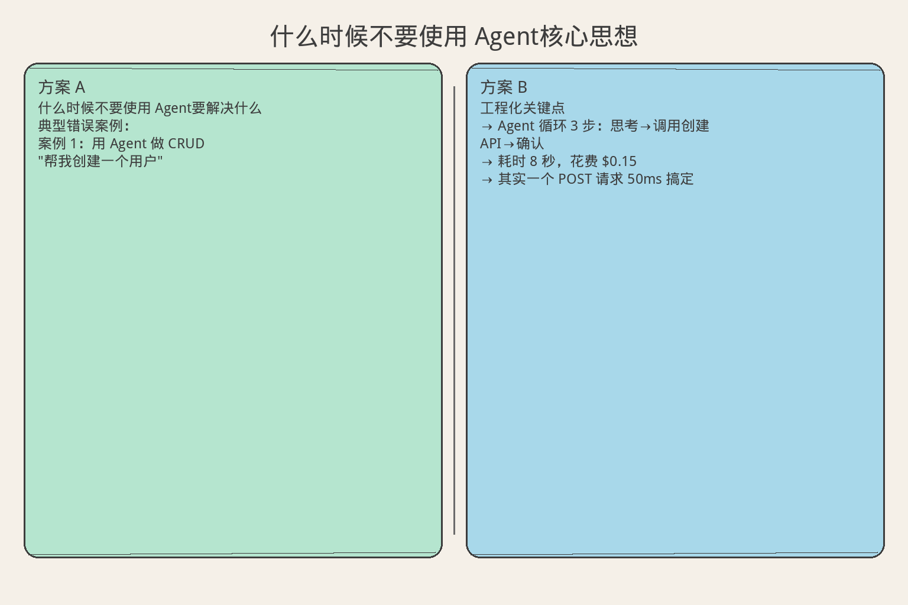
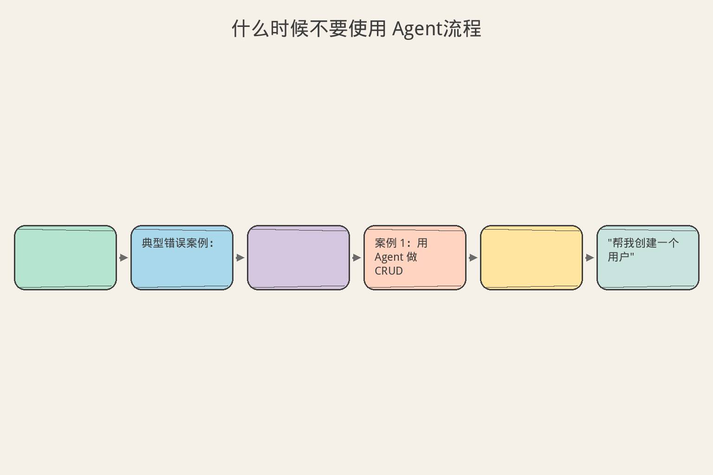
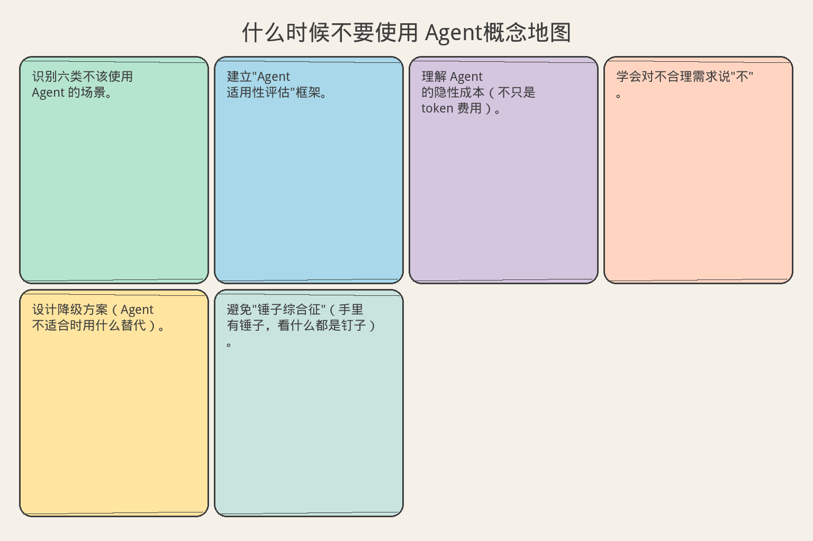

# AI Agent 工程（三）：什么时候不要使用 Agent

> Agent 的能力越强，失败空间也越大。一个成熟的 Agent 工程师不仅会实现 Agent，也会在不合适的需求中明确拒绝 Agent 方案。

**阅读建议：** 先阅读 [215 Agent、RAG 与 Workflow 怎么选](215.agent-vs-rag-vs-workflow-tutorial.md)，理解四种形态的定位。

**环境要求：**
- Python **3.10+**
- 无需安装第三方库

---

## 目录

1. [你会学到什么](#你会学到什么)
2. [它解决什么问题](#它解决什么问题)
3. [不该使用 Agent 的六类场景](#不该使用-agent-的六类场景)
4. [最小示例](#最小示例)
5. [工程化版本：适用性评估](#工程化版本适用性评估)
6. [常见失败模式](#常见失败模式)
7. [什么时候不要这么做](#什么时候不要这么做)
8. [生产环境注意事项](#生产环境注意事项)
9. [如何观测和评测](#如何观测和评测)
10. [和 RAG / 后端 / 前端的关系](#和-rag--后端--前端的关系)
11. [面试怎么讲](#面试怎么讲)
12. [下一步](#下一步)

## 你会学到什么

- 识别六类不该使用 Agent 的场景。
- 建立"Agent 适用性评估"框架。
- 理解 Agent 的隐性成本（不只是 token 费用）。
- 学会对不合理需求说"不"。
- 设计降级方案（Agent 不适合时用什么替代）。
- 避免"锤子综合征"（手里有锤子，看什么都是钉子）。

## 它解决什么问题


读下图时，先看「什么时候不要使用 Agent核心思想」建立直觉。


### Agent 滥用的现状

```text
典型错误案例：

案例 1：用 Agent 做 CRUD
  "帮我创建一个用户"
  → Agent 循环 3 步：思考→调用创建 API→确认
  → 耗时 8 秒，花费 $0.15
  → 其实一个 POST 请求 50ms 搞定

案例 2：用 Agent 做固定报表
  "每天生成销售日报"
  → Agent 每次都要"想"怎么生成
  → 有时格式不一样（不确定性！）
  → 其实一个 cron + 模板 5 分钟搞定

案例 3：用 Agent 做实时响应
  "用户输入时实时补全"
  → Agent 延迟 3-10 秒
  → 用户早就走了
  → 其实一个轻量模型 100ms 搞定

这些案例的共同点：
  用了最复杂的方案解决最简单的问题。
```

### 为什么要学"不用 Agent"

```text
1. 节省成本
   Agent 每次 $0.1-0.5，API 每次 $0
   1000 次/天 × 30 天 = 节省 $3000-15000/月

2. 提高可靠性
   Agent 成功率 ~70-80%
   API/Workflow 成功率 ~99.9%

3. 降低延迟
   Agent 3-60 秒
   API 50ms，RAG 2 秒

4. 减少维护
   Agent 需要持续调优 prompt、工具、评测
   API 写完就不用管了

5. 团队信任
   如果 Agent 频繁失败，团队会失去信心
   不如一开始就用合适的方案
```

## 不该使用 Agent 的六类场景

### 场景 1：确定性操作

```text
特征：
  - 输入 → 输出是确定的
  - 不需要"理解"或"判断"
  - 有明确的 API 可以调用

例子：
  - 查询用户信息
  - 创建/更新/删除记录
  - 格式转换（JSON → CSV）
  - 数学计算

为什么不用 Agent：
  Agent 引入不确定性（LLM 可能"想多"）
  增加延迟（3 秒 vs 50ms）
  增加成本（$0.1 vs $0）

正确方案：普通 API
```

### 场景 2：固定流程

```text
特征：
  - 步骤是预先确定的
  - 不需要中间决策
  - 每次执行路径相同

例子：
  - 文件上传 → 解析 → 存储
  - 数据 ETL（抽取→转换→加载）
  - 定时备份
  - 邮件发送流程

为什么不用 Agent：
  固定流程不需要"思考"
  Agent 可能每次走不同路径（不确定性）
  Workflow 更可靠、更便宜、更快

正确方案：Workflow（Celery / Airflow / 简单脚本）
```

### 场景 3：实时性要求高

```text
特征：
  - 延迟预算 < 1 秒
  - 用户在等待（同步交互）
  - 高频调用

例子：
  - 搜索自动补全
  - 实时推荐
  - 输入验证
  - 游戏内 AI 决策

为什么不用 Agent：
  Agent 最少 3 秒（多次 LLM 调用）
  用户等不了
  高频调用成本爆炸

正确方案：轻量模型 / 规则引擎 / 缓存
```

### 场景 4：强合规要求

```text
特征：
  - 结果必须 100% 可预测
  - 需要审计追踪
  - 不允许随机性

例子：
  - 金融交易决策
  - 医疗诊断
  - 法律判断
  - 安全审计

为什么不用 Agent：
  LLM 有随机性（同样输入可能不同输出）
  无法保证 100% 一致性
  审计困难（为什么做了这个决策？）

正确方案：规则引擎 + 人工审批
```

### 场景 5：数据量极大

```text
特征：
  - 需要处理百万级记录
  - 批量操作
  - 吞吐量优先

例子：
  - 批量数据清洗
  - 全量索引重建
  - 日志分析（TB 级）
  - 批量图片处理

为什么不用 Agent：
  Agent 是"逐条思考"的
  100 万条 × $0.1 = $100,000（不现实）
  速度太慢

正确方案：分布式计算（Spark / Flink / 批处理脚本）
```

### 场景 6：团队不具备维护能力

```text
特征：
  - 团队 1-2 人
  - 没有 LLM 经验
  - 没有评测体系
  - 没有监控能力

为什么不用 Agent：
  Agent 需要持续维护（prompt 调优、工具更新、评测）
  出问题难以排查（多步循环，哪步错了？）
  没有评测就不知道效果好不好

正确方案：先用 RAG / Workflow，等团队成熟后再考虑 Agent
```

## 最小示例


读下图时，先看「什么时候不要使用 Agent流程」建立直觉。


### Agent 适用性检查器

```python
from dataclasses import dataclass
from enum import Enum


class Verdict(str, Enum):
    USE_AGENT = "use_agent"
    USE_WORKFLOW = "use_workflow"
    USE_RAG = "use_rag"
    USE_API = "use_api"
    NOT_SUITABLE = "not_suitable"


@dataclass
class RequirementProfile:
    """需求画像。"""
    name: str
    needs_llm: bool = False
    multi_step: bool = False
    fixed_steps: bool = False
    needs_dynamic_decision: bool = False
    latency_budget_ms: float = 5000
    daily_volume: int = 100
    requires_determinism: bool = False
    team_size: int = 3
    has_eval_system: bool = False


class AgentSuitabilityChecker:
    """Agent 适用性检查器。"""

    def check(self, profile: RequirementProfile) -> dict:
        """评估是否适合用 Agent。"""
        reasons_against = []
        reasons_for = []

        # 检查反对理由
        if not profile.needs_llm:
            reasons_against.append("不需要 LLM → 用 API")
        if not profile.multi_step:
            reasons_against.append("单步操作 → 用 RAG 或 API")
        if profile.fixed_steps and not profile.needs_dynamic_decision:
            reasons_against.append("固定流程 → 用 Workflow")
        if profile.latency_budget_ms < 2000:
            reasons_against.append(f"延迟预算 {profile.latency_budget_ms}ms → Agent 太慢")
        if profile.requires_determinism:
            reasons_against.append("需要确定性 → Agent 有随机性")
        if profile.daily_volume > 10000:
            reasons_against.append(f"日调用量 {profile.daily_volume} → 成本过高")
        if profile.team_size < 2:
            reasons_against.append("团队太小 → 维护困难")
        if not profile.has_eval_system:
            reasons_against.append("没有评测体系 → 无法保证质量")

        # 检查支持理由
        if profile.needs_dynamic_decision:
            reasons_for.append("需要动态决策")
        if profile.multi_step and not profile.fixed_steps:
            reasons_for.append("多步且步骤不固定")
        if profile.needs_llm and profile.multi_step:
            reasons_for.append("需要 LLM + 多步")

        # 最终判断
        if len(reasons_against) >= 3:
            verdict = Verdict.NOT_SUITABLE
        elif not profile.needs_llm:
            verdict = Verdict.USE_API
        elif not profile.multi_step:
            verdict = Verdict.USE_RAG
        elif profile.fixed_steps:
            verdict = Verdict.USE_WORKFLOW
        elif reasons_for:
            verdict = Verdict.USE_AGENT
        else:
            verdict = Verdict.USE_WORKFLOW

        return {
            "verdict": verdict.value,
            "reasons_for": reasons_for,
            "reasons_against": reasons_against,
            "confidence": self._confidence(reasons_for, reasons_against),
        }

    def _confidence(self, for_reasons: list, against_reasons: list) -> float:
        total = len(for_reasons) + len(against_reasons)
        if total == 0:
            return 0.5
        return len(for_reasons) / total


# 演示
def demo_suitability_check():
    checker = AgentSuitabilityChecker()

    scenarios = [
        RequirementProfile(
            name="查询用户信息",
            needs_llm=False,
            multi_step=False,
            latency_budget_ms=100,
            daily_volume=5000,
        ),
        RequirementProfile(
            name="知识问答",
            needs_llm=True,
            multi_step=False,
            latency_budget_ms=3000,
        ),
        RequirementProfile(
            name="文档索引管道",
            needs_llm=True,
            multi_step=True,
            fixed_steps=True,
            latency_budget_ms=30000,
        ),
        RequirementProfile(
            name="智能客服",
            needs_llm=True,
            multi_step=True,
            needs_dynamic_decision=True,
            latency_budget_ms=10000,
            team_size=5,
            has_eval_system=True,
        ),
        RequirementProfile(
            name="金融风控决策",
            needs_llm=True,
            multi_step=True,
            requires_determinism=True,
            daily_volume=100000,
        ),
    ]

    for profile in scenarios:
        result = checker.check(profile)
        print(f"  {profile.name}:")
        print(f"    判定: {result['verdict']}")
        print(f"    置信度: {result['confidence']:.0%}")
        if result['reasons_against']:
            print(f"    反对: {result['reasons_against'][0]}")
        print()
```

## 工程化版本：适用性评估

### 成本模型

```python
@dataclass
class CostModel:
    """Agent 成本模型。"""
    llm_cost_per_call: float = 0.01  # 每次 LLM 调用成本
    avg_steps: int = 5               # 平均步数
    daily_requests: int = 1000       # 日请求量
    tool_cost_per_call: float = 0.001  # 工具调用成本

    @property
    def cost_per_request(self) -> float:
        return self.llm_cost_per_call * self.avg_steps + self.tool_cost_per_call * self.avg_steps

    @property
    def daily_cost(self) -> float:
        return self.cost_per_request * self.daily_requests

    @property
    def monthly_cost(self) -> float:
        return self.daily_cost * 30

    def compare_with_alternatives(self) -> dict:
        """与替代方案对比。"""
        return {
            "agent": {"monthly": self.monthly_cost, "latency": "3-60s", "reliability": "70-80%"},
            "workflow": {"monthly": self.monthly_cost * 0.3, "latency": "1-10s", "reliability": "95%"},
            "rag": {"monthly": self.monthly_cost * 0.15, "latency": "1-3s", "reliability": "90%"},
            "api": {"monthly": 0, "latency": "<100ms", "reliability": "99.9%"},
        }


# 演示
def demo_cost_model():
    model = CostModel(
        llm_cost_per_call=0.02,
        avg_steps=4,
        daily_requests=500,
    )
    print(f"  每次请求成本: ${model.cost_per_request:.3f}")
    print(f"  日成本: ${model.daily_cost:.2f}")
    print(f"  月成本: ${model.monthly_cost:.2f}")
    print(f"\n  替代方案对比:")
    for name, info in model.compare_with_alternatives().items():
        print(f"    {name}: ${info['monthly']:.2f}/月, {info['latency']}, {info['reliability']}")
```

### 隐性成本清单

```text
Agent 的隐性成本（常被忽略）：

1. Prompt 工程时间
   初始设计：2-4 周
   持续调优：每周 2-4 小时
   成本：工程师时间 × 时薪

2. 评测体系
   构建测试集：1-2 周
   运行评测：每次 $10-50
   分析结果：每周 2 小时

3. 监控和告警
   搭建监控：1 周
   处理告警：每周 1-3 小时
   排查问题：每次 2-8 小时

4. 工具维护
   外部 API 变更 → 更新工具
   新增能力 → 新增工具
   每次 2-8 小时

5. 模型升级
   新模型发布 → 重新测试
   行为变化 → 调整 prompt
   每次 1-2 周

总隐性成本 ≈ 0.5-1 个工程师的持续投入
```

### 决策矩阵

```python
class DecisionMatrix:
    """多维度决策矩阵。"""

    WEIGHTS = {
        "complexity_fit": 0.3,    # 复杂度匹配
        "cost_efficiency": 0.25,  # 成本效率
        "reliability": 0.2,       # 可靠性
        "team_capability": 0.15,  # 团队能力
        "latency": 0.1,           # 延迟
    }

    def score(self, profile: RequirementProfile) -> dict[str, float]:
        """为每种方案打分（0-1）。"""
        scores = {}

        # API 得分
        scores["api"] = self._score_api(profile)
        # RAG 得分
        scores["rag"] = self._score_rag(profile)
        # Workflow 得分
        scores["workflow"] = self._score_workflow(profile)
        # Agent 得分
        scores["agent"] = self._score_agent(profile)

        return scores

    def _score_api(self, p: RequirementProfile) -> float:
        score = 0.5
        if not p.needs_llm:
            score += 0.3
        if p.latency_budget_ms < 500:
            score += 0.2
        if p.requires_determinism:
            score += 0.2
        if p.multi_step:
            score -= 0.3
        return max(0, min(1, score))

    def _score_rag(self, p: RequirementProfile) -> float:
        score = 0.4
        if p.needs_llm and not p.multi_step:
            score += 0.4
        if p.latency_budget_ms >= 2000:
            score += 0.1
        if p.multi_step:
            score -= 0.2
        return max(0, min(1, score))

    def _score_workflow(self, p: RequirementProfile) -> float:
        score = 0.4
        if p.multi_step and p.fixed_steps:
            score += 0.4
        if not p.needs_dynamic_decision:
            score += 0.1
        if p.requires_determinism:
            score += 0.1
        return max(0, min(1, score))

    def _score_agent(self, p: RequirementProfile) -> float:
        score = 0.3
        if p.needs_dynamic_decision:
            score += 0.3
        if p.multi_step and not p.fixed_steps:
            score += 0.2
        if p.team_size >= 3 and p.has_eval_system:
            score += 0.1
        if p.requires_determinism:
            score -= 0.3
        if p.latency_budget_ms < 2000:
            score -= 0.2
        if p.daily_volume > 10000:
            score -= 0.2
        return max(0, min(1, score))

    def recommend(self, profile: RequirementProfile) -> str:
        """给出推荐。"""
        scores = self.score(profile)
        return max(scores, key=scores.get)
```

## 常见失败模式

### 1. 锤子综合征

```text
症状：
  "我们做了 Agent，所有需求都用 Agent"

后果：
  简单操作变慢、变贵、变不可靠

治疗：
  每个需求都过一遍适用性检查
  默认用简单方案，除非有充分理由
```

### 2. 技术驱动而非业务驱动

```text
症状：
  "Agent 很酷，我们要用"
  而不是"这个问题需要 Agent"

后果：
  做了很炫的 demo，但没人用

治疗：
  先量化问题（人工处理耗时、错误率）
  再评估 Agent 能否改善
  如果改善 < 20%，不值得
```

### 3. 忽略运维成本

```text
症状：
  "做完 Agent 就完事了"

后果：
  3 个月后 prompt 失效、工具过期、没人维护

治疗：
  做之前先算运维成本
  确保有人持续负责
  建立评测和监控
```

### 4. 一步到位

```text
症状：
  第一天就搞完整 Agent 系统

后果：
  3 个月还没上线，需求已经变了

治疗：
  渐进式：API → RAG → Workflow → Agent
  每步验证价值
  不急着上最复杂的
```

## 什么时候不要这么做

```text
这篇文档本身的适用边界：

不要教条化：
  不是说"固定流程一定不能用 Agent"
  如果固定流程中有一步需要"理解"，可以混合

不要过度简化：
  不是说"Agent 一定不好"
  复杂任务确实需要 Agent

核心原则：
  匹配 > 先进
  简单 > 复杂
  可靠 > 炫酷
```

## 生产环境注意事项

### 降级设计

```text
即使决定用 Agent，也要有降级方案：

Level 1 降级：Agent → Workflow
  触发：Agent 连续失败 3 次
  行为：切换到预定义流程

Level 2 降级：Workflow → RAG
  触发：Workflow 也失败
  行为：至少给出一个回答

Level 3 降级：RAG → 模板
  触发：RAG 不可用
  行为：返回预设模板回答

Level 4 降级：模板 → 人工
  触发：全部失败
  行为：转人工处理
```

### 灰度发布

```text
Agent 上线策略：

第 1 周：影子模式
  Agent 运行但不返回结果
  只记录"Agent 会怎么做"
  对比人工结果

第 2 周：5% 流量
  5% 的请求走 Agent
  监控成功率和用户反馈

第 3 周：20% 流量
  扩大范围
  收集更多数据

第 4 周：50% → 100%
  逐步放量
  保持降级开关
```

## 如何观测和评测

### 适用性回顾

```text
每月回顾：

1. Agent 处理了多少请求？
   如果 < 总请求的 10%，可能不需要 Agent

2. Agent 成功率多少？
   如果 < 60%，说明场景不适合

3. 用户满意度？
   如果比 RAG 低，说明 Agent 没带来价值

4. 成本对比？
   如果 Agent 成本 > 人工成本，不值得

5. 有多少请求被降级了？
   如果 > 30%，说明 Agent 不够可靠
```

### 关键指标

```text
Agent 健康度指标：

- 任务完成率 > 70%（否则考虑降级）
- 平均步数 < 8（否则太复杂）
- 超时率 < 10%（否则需要优化）
- 用户主动转人工率 < 20%（否则体验差）
- 月度成本 < 人工成本的 50%（否则不值得）
```

## 和 RAG / 后端 / 前端的关系

```text
与 RAG 的关系：
  RAG 是 Agent 的"降级方案"
  80% 的请求应该由 RAG 处理
  Agent 只处理 RAG 搞不定的

与后端的关系：
  适用性检查是后端路由的一部分
  成本模型影响架构决策
  降级链在后端实现

与前端的关系：
  前端不感知后端用了什么形态
  但需要展示"处理中"（Agent 慢）
  需要提供"转人工"按钮（降级入口）
```

## 面试怎么讲

```text
问：什么时候不该用 Agent？

答（30 秒版）：
  六类场景不用 Agent：
  确定性操作（用 API）、固定流程（用 Workflow）、
  实时性要求高（用轻量模型）、强合规（用规则引擎）、
  数据量极大（用批处理）、团队没能力维护。
  核心原则：用最简单的能解决问题的方案。
  Agent 是最后的选择，不是第一选择。

追问 1：怎么说服团队不用 Agent？
  → 用数据：成本对比、延迟对比、可靠性对比。
    如果 API 能 50ms 搞定，为什么要用 Agent 等 10 秒？

追问 2：如果老板坚持要用 Agent 呢？
  → 混合方案：路由层判断，简单的走 API/RAG，
    只有真正需要动态决策的才走 Agent。
    这样既满足了"用 Agent"的要求，又不浪费。

追问 3：怎么判断一个需求是否需要 Agent？
  → 四个问题：需要 LLM 吗？需要多步吗？步骤固定吗？
    需要动态决策吗？四个"是"才用 Agent。
```

## 完整示例：适用性评估流程

```python
def demo_full_assessment():
    """完整演示：需求适用性评估流程。"""

    checker = AgentSuitabilityChecker()
    matrix = DecisionMatrix()
    cost_model = CostModel(llm_cost_per_call=0.02, avg_steps=5, daily_requests=1000)

    # 待评估需求
    requirements = [
        RequirementProfile(
            name="用户注册",
            needs_llm=False,
            multi_step=False,
            latency_budget_ms=200,
            daily_volume=5000,
            requires_determinism=True,
        ),
        RequirementProfile(
            name="智能客服",
            needs_llm=True,
            multi_step=True,
            needs_dynamic_decision=True,
            latency_budget_ms=10000,
            daily_volume=500,
            team_size=5,
            has_eval_system=True,
        ),
        RequirementProfile(
            name="数据报表",
            needs_llm=True,
            multi_step=True,
            fixed_steps=True,
            latency_budget_ms=60000,
            daily_volume=10,
        ),
        RequirementProfile(
            name="实时推荐",
            needs_llm=True,
            multi_step=False,
            latency_budget_ms=100,
            daily_volume=100000,
        ),
    ]

    print("=" * 60)
    print("需求适用性评估报告")
    print("=" * 60)

    for req in requirements:
        # 适用性检查
        check_result = checker.check(req)
        # 多维度评分
        scores = matrix.score(req)
        # 推荐
        recommendation = matrix.recommend(req)

        print(f"\n--- {req.name} ---")
        print(f"  适用性判定: {check_result['verdict']}")
        print(f"  置信度: {check_result['confidence']:.0%}")
        print(f"  评分: API={scores['api']:.2f} RAG={scores['rag']:.2f} "
              f"Workflow={scores['workflow']:.2f} Agent={scores['agent']:.2f}")
        print(f"  推荐: {recommendation.upper()}")
        if check_result['reasons_against']:
            print(f"  反对理由: {check_result['reasons_against'][0]}")

    # 成本分析
    print(f"\n--- 成本分析（如果全部用 Agent）---")
    print(f"  每次请求: ${cost_model.cost_per_request:.3f}")
    print(f"  日成本: ${cost_model.daily_cost:.2f}")
    print(f"  月成本: ${cost_model.monthly_cost:.2f}")
    print(f"  年成本: ${cost_model.monthly_cost * 12:.2f}")

    comparison = cost_model.compare_with_alternatives()
    print(f"\n  替代方案月成本:")
    for name, info in comparison.items():
        print(f"    {name}: ${info['monthly']:.2f}/月")


# demo_full_assessment()
```

### 拒绝 Agent 的沟通模板

```text
当有人提出“用 Agent 做 X”时，你可以这样回应：

模板 1：用数据说话
  "我评估了一下，这个需求用 API 就能解决：
   - 延迟：50ms vs Agent 的 10s
   - 成本：$0 vs $0.1/次
   - 可靠性：99.9% vs 70%
   我建议用 API，除非有我没考虑到的因素。"

模板 2：提供替代方案
  "这个场景用 Workflow 更合适：
   步骤是固定的，不需要动态决策。
   Workflow 更可靠、更便宜、更容易测试。
   我可以 2 天做完，Agent 需要 2 周。"

模板 3：渐进式建议
  "我们可以分两步：
   第一步：先用 RAG 解决 80% 的场景（1 周）
   第二步：剩下 20% 确实需要 Agent 的，再加（2 周）
   这样风险更低，价值更快交付。"

模板 4：条件性同意
  "可以用 Agent，但需要满足这些前提：
   1. 有评测体系（否则不知道效果好不好）
   2. 有降级方案（否则失败时用户体验差）
   3. 有人持续维护（否则 3 个月后就废了）
   这些都能满足的话，我支持。"
```

### 本篇核心要点

```text
1. Agent 是最后的选择，不是第一选择。
2. 六类场景不用 Agent：确定性、固定流程、实时、合规、批量、团队小。
3. 隐性成本常被忽略：prompt 工程、评测、监控、维护。
4. 即使用 Agent，也要有降级方案。
5. 用数据说话，不用感觉做决策。
6. 匹配 > 先进，简单 > 复杂，可靠 > 炫酷。
```

### 真实案例分析

```text
案例 A：电商客服系统

背景：
  日均 5000 个客服请求
  80% 是简单查询（订单状态、物流信息）
  15% 是固定流程（退货、换货）
  5% 是复杂问题（投诉、特殊需求）

错误做法：
  全部用 Agent 处理
  结果：月成本 $15,000，平均响应 8 秒，成功率 75%

正确做法：
  80% 简单查询 → API（直接查数据库）
  15% 固定流程 → Workflow（预定义步骤）
  5% 复杂问题 → Agent（动态决策）
  结果：月成本 $2,000，平均响应 1 秒，成功率 95%

教训：
  不是所有请求都需要 Agent。
  分层处理才是最优解。

---

案例 B：内部工具平台

背景：
  团队 2 人
  想做一个“智能运维助手”
  能自动诊断和修复故障

错误做法：
  直接做完整 Agent（诊断 + 修复 + 报告）
  结果：3 个月没上线，bug 不断，没人维护

正确做法：
  第 1 步：先做告警聚合 + 分类（规则引擎，1 周）
  第 2 步：加 RAG 检索历史事故（1 周）
  第 3 步：加自动诊断建议（只读，不执行，2 周）
  第 4 步：确认有价值后，再加自动修复（1 月）
  结果：每步都有价值交付，团队信心逐步建立

教训：
  渐进式 > 一步到位。
  小团队不要一上来就搞复杂架构。

---

案例 C：金融风控

背景：
  需要实时判断交易是否欺诈
  延迟要求 < 200ms
  必须 100% 可解释

错误做法：
  用 Agent 做风控决策
  结果：延迟 5 秒，无法解释为什么拒绝，合规不通过

正确做法：
  规则引擎（确定性规则）+ ML 模型（异常检测）
  结果：延迟 50ms，每个决策都有明确理由

教训：
  强合规 + 实时性 = 不适合 Agent。
  不是所有“智能”都需要 LLM。
```

### 快速参考：该不该用 Agent

```text
╔════════════════════════════════════════════╗
║       该不该用 Agent？快速检查        ║
╠════════════════════════════════════════════╣
║                                            ║
║  □ 需要 LLM 理解/生成？              ║
║    否 → 不用 Agent                      ║
║                                            ║
║  □ 需要多步操作？                    ║
║    否 → 不用 Agent                      ║
║                                            ║
║  □ 步骤是固定的？                    ║
║    是 → 用 Workflow，不用 Agent          ║
║                                            ║
║  □ 延迟要求 < 2秒？                   ║
║    是 → 不用 Agent                      ║
║                                            ║
║  □ 需要 100% 确定性？                ║
║    是 → 不用 Agent                      ║
║                                            ║
║  □ 团队能持续维护？                  ║
║    否 → 不用 Agent                      ║
║                                            ║
║  所有答案都是“是” → 可以用 Agent    ║
║  任何一个“否” → 考虑替代方案      ║
║                                            ║
╚════════════════════════════════════════════╝
```

---

> **核心要点：** 不用 Agent 不是“落后”，而是“务实”。最好的架构是用最简单的方案解决问题。

## 替代方案速查表

```text
┌────────────────────┬──────────────────────────┐
│ 场景               │ 替代方案                 │
├────────────────────┼──────────────────────────┤
│ 固定流程           │ Workflow / DAG            │
│ 知识问答           │ RAG                      │
│ 单次转换           │ 函数调用                 │
│ 规则判断           │ if-else / 决策树          │
│ 数据查询           │ SQL API                  │
│ 表单填写           │ 结构化输出               │
│ 批量处理           │ 脚本 / 队列              │
└────────────────────┴──────────────────────────┘

记住：Agent 是工具，不是目的。
用户要的是“问题解决”，不是“用了 Agent”。

判断流程：
1. 能用 RAG 解决吗？→ 用 RAG
2. 能用 Workflow 解决吗？→ 用 Workflow
3. 能用函数调用解决吗？→ 用函数
4. 都不行？→ 考虑 Agent
```

## 下一步


读下图时，先看「什么时候不要使用 Agent概念地图」建立直觉。


下一篇 [217 企业级 Agent 架构总览](217.enterprise-agent-architecture-overview-tutorial.md) 会从全局视角看企业级 Agent 系统的分层设计。
