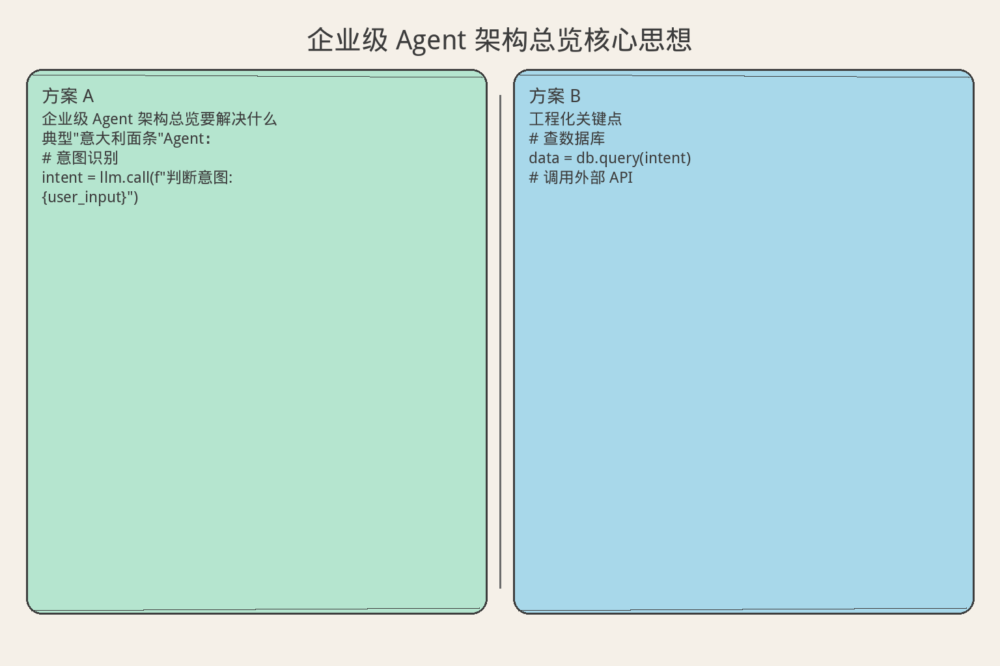
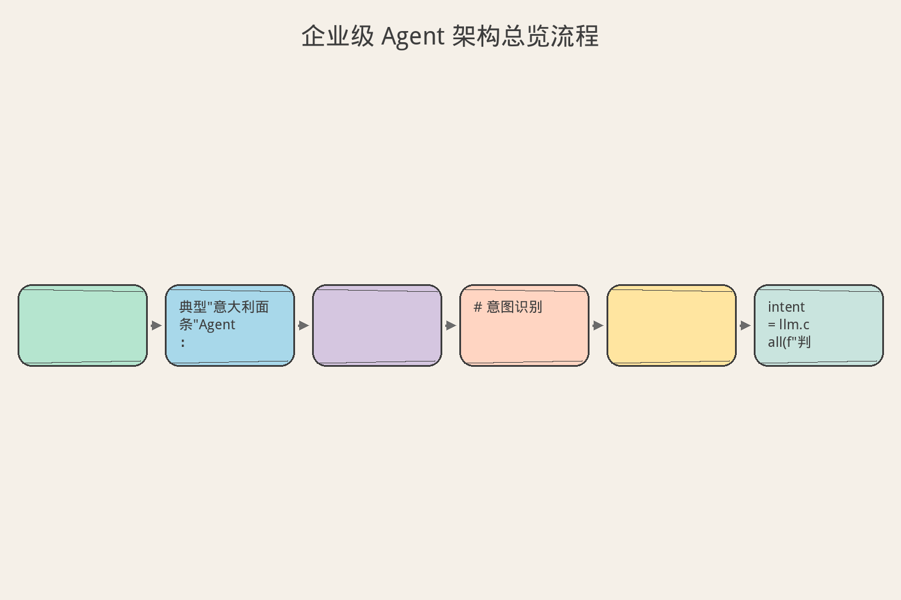
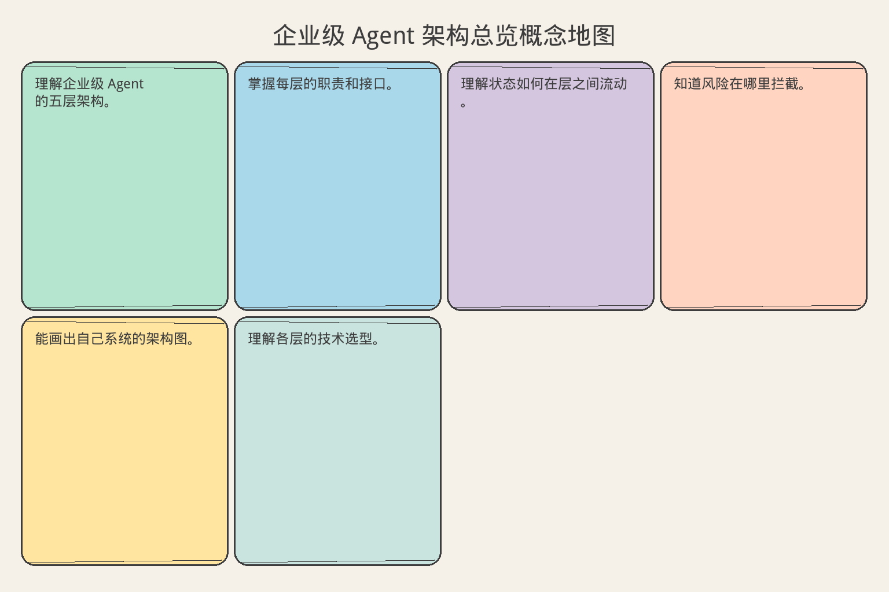

# AI Agent 工程（四）：企业级 Agent 架构总览

> 前三篇解决了 Agent 的定位和使用边界。这篇建立后续系列共同使用的参考架构：每个模块做什么、状态如何流动、风险在哪里拦截。

**阅读建议：** 先阅读 [214](214.rag-to-agent-transition-tutorial.md)–[216](216.when-not-to-use-agent-tutorial.md)，理解 Agent 的定位和选型。

**环境要求：**
- Python **3.10+**
- 无需安装第三方库

---

## 目录

1. [你会学到什么](#你会学到什么)
2. [它解决什么问题](#它解决什么问题)
3. [核心概念：五层架构](#核心概念五层架构)
4. [最小示例](#最小示例)
5. [工程化版本](#工程化版本)
6. [常见失败模式](#常见失败模式)
7. [什么时候不要这么做](#什么时候不要这么做)
8. [生产环境注意事项](#生产环境注意事项)
9. [如何观测和评测](#如何观测和评测)
10. [和 RAG / 后端 / 前端的关系](#和-rag--后端--前端的关系)
11. [面试怎么讲](#面试怎么讲)
12. [下一步](#下一步)

## 你会学到什么

- 理解企业级 Agent 的五层架构。
- 掌握每层的职责和接口。
- 理解状态如何在层之间流动。
- 知道风险在哪里拦截。
- 能画出自己系统的架构图。
- 理解各层的技术选型。

## 它解决什么问题


读下图时，先看「企业级 Agent 架构总览核心思想」建立直觉。


### 没有架构的 Agent

```text
典型"意大利面条"Agent：

def handle(user_input):
    # 意图识别
    intent = llm.call(f"判断意图: {user_input}")
    # 查数据库
    data = db.query(intent)
    # 调用外部 API
    result = requests.post(api_url, json=data)
    # 生成回答
    answer = llm.call(f"根据 {result} 回答")
    # 直接返回
    return answer

问题：
  1. 所有逻辑耦合在一起
  2. 没有错误处理
  3. 没有权限控制
  4. 没有审计
  5. 无法测试单个组件
  6. 无法扩展
```

### 分层架构的价值

```text
分层后：
  接入层：处理协议、认证、限流
  编排层：管理 Agent 循环、状态
  工具层：封装外部调用、权限
  模型层：管理 LLM 调用、路由
  基础设施层：日志、监控、存储

价值：
  1. 每层独立可测试
  2. 替换某层不影响其他层
  3. 权限在工具层统一拦截
  4. 审计在基础设施层统一记录
  5. 新人看架构图就能理解系统
```

## 核心概念：五层架构

### 架构全景

```text
┌─────────────────────────────────────────┐
│           接入层 (Gateway)               │
│  HTTP/WebSocket · 认证 · 限流 · 路由    │
├─────────────────────────────────────────┤
│           编排层 (Orchestrator)          │
│  Agent 循环 · 状态管理 · 任务调度       │
├─────────────────────────────────────────┤
│           工具层 (Tool Layer)            │
│  工具注册 · 权限检查 · 结果标准化       │
├─────────────────────────────────────────┤
│           模型层 (Model Layer)           │
│  LLM 路由 · Prompt 管理 · 缓存         │
├─────────────────────────────────────────┤
│         基础设施层 (Infrastructure)       │
│  日志 · 监控 · 存储 · 事件总线          │
└─────────────────────────────────────────┘
```

### 各层职责

```text
接入层（Gateway）：
  - 接收请求（HTTP / WebSocket / gRPC）
  - 认证鉴权（JWT / API Key）
  - 速率限制（每用户 10 次/分钟）
  - 请求路由（同步 / 异步）
  - 协议转换

编排层（Orchestrator）：
  - 管理 Agent 循环（观察→思考→行动）
  - 状态机管理
  - 任务分解和调度
  - 超时和取消
  - 错误恢复

工具层（Tool Layer）：
  - 工具注册和发现
  - 参数验证
  - 权限检查（白名单 / 审批）
  - 执行和超时
  - 结果标准化
  - 幂等保证

模型层（Model Layer）：
  - 多模型路由（大模型 / 小模型）
  - Prompt 模板管理
  - 响应缓存
  - Token 计量
  - 降级（主模型不可用时切备用）

基础设施层（Infrastructure）：
  - 结构化日志
  - 指标采集（Prometheus）
  - 分布式追踪（OpenTelemetry）
  - 事件总线
  - 持久化存储
```

### 状态流动

```text
请求生命周期：

用户请求
  → 接入层（认证、限流）
  → 编排层（创建任务、启动循环）
  → 模型层（LLM 决策）
  → 工具层（执行动作）
  → 编排层（更新状态、判断是否继续）
  → ... 循环 ...
  → 编排层（完成）
  → 接入层（返回响应）
  → 用户

每一步都经过基础设施层：
  记录日志、采集指标、写入追踪
```

## 最小示例


读下图时，先看「企业级 Agent 架构总览流程」建立直觉。


### 五层架构骨架

```python
from dataclasses import dataclass, field
from typing import Any, Callable
from enum import Enum
from datetime import datetime, timezone
import uuid


# === 接入层 ===

@dataclass
class Request:
    """入站请求。"""
    request_id: str
    user_id: str
    payload: dict
    auth_token: str = ""
    timestamp: str = field(default_factory=lambda: datetime.now(timezone.utc).isoformat())


@dataclass
class Response:
    """出站响应。"""
    request_id: str
    status: int
    data: Any
    error: str | None = None


class Gateway:
    """接入层：认证、限流、路由。"""

    def __init__(self, rate_limit: int = 10):
        self.rate_limit = rate_limit
        self._request_counts: dict[str, int] = {}
        self._orchestrator: "Orchestrator | None" = None

    def set_orchestrator(self, orch: "Orchestrator"):
        self._orchestrator = orch

    def handle(self, request: Request) -> Response:
        """处理入站请求。"""
        # 认证
        if not self._authenticate(request):
            return Response(request.request_id, 401, None, "认证失败")

        # 限流
        if not self._rate_limit_check(request.user_id):
            return Response(request.request_id, 429, None, "请求过于频繁")

        # 路由到编排层
        if self._orchestrator:
            result = self._orchestrator.execute(request)
            return Response(request.request_id, 200, result)

        return Response(request.request_id, 503, None, "服务不可用")

    def _authenticate(self, request: Request) -> bool:
        return bool(request.auth_token) or request.user_id == "anonymous"

    def _rate_limit_check(self, user_id: str) -> bool:
        count = self._request_counts.get(user_id, 0)
        if count >= self.rate_limit:
            return False
        self._request_counts[user_id] = count + 1
        return True


# === 编排层 ===

class AgentPhase(str, Enum):
    THINKING = "thinking"
    ACTING = "acting"
    OBSERVING = "observing"
    DONE = "done"
    ERROR = "error"


@dataclass
class AgentState:
    """Agent 执行状态。"""
    task_id: str
    goal: str
    phase: AgentPhase = AgentPhase.THINKING
    steps: list[dict] = field(default_factory=list)
    result: Any = None
    error: str | None = None


class Orchestrator:
    """编排层：管理 Agent 循环。"""

    def __init__(self, max_steps: int = 10):
        self.max_steps = max_steps
        self._tool_layer: "ToolLayer | None" = None
        self._model_layer: "ModelLayer | None" = None
        self._infra: "Infrastructure | None" = None

    def set_layers(self, tool_layer: "ToolLayer", model_layer: "ModelLayer", infra: "Infrastructure"):
        self._tool_layer = tool_layer
        self._model_layer = model_layer
        self._infra = infra

    def execute(self, request: Request) -> dict:
        """执行 Agent 任务。"""
        state = AgentState(
            task_id=f"TASK-{uuid.uuid4().hex[:8]}",
            goal=request.payload.get("query", ""),
        )

        if self._infra:
            self._infra.log("task_started", {"task_id": state.task_id, "goal": state.goal})

        for step in range(self.max_steps):
            # 思考（模型层）
            state.phase = AgentPhase.THINKING
            decision = self._think(state)

            if decision["action"] == "finish":
                state.phase = AgentPhase.DONE
                state.result = decision["answer"]
                break

            # 行动（工具层）
            state.phase = AgentPhase.ACTING
            tool_result = self._act(decision)
            state.steps.append({"step": step + 1, "decision": decision, "result": tool_result})

            # 观察
            state.phase = AgentPhase.OBSERVING

        if state.phase != AgentPhase.DONE:
            state.error = "达到最大步数"

        if self._infra:
            self._infra.log("task_completed", {"task_id": state.task_id, "steps": len(state.steps)})

        return {"task_id": state.task_id, "result": state.result, "steps": len(state.steps)}

    def _think(self, state: AgentState) -> dict:
        """调用模型层做决策。"""
        if self._model_layer:
            return self._model_layer.decide(state.goal, state.steps)
        return {"action": "finish", "answer": "无模型层"}

    def _act(self, decision: dict) -> dict:
        """调用工具层执行。"""
        if self._tool_layer:
            return self._tool_layer.execute(decision.get("tool", ""), decision.get("params", {}))
        return {"success": False, "error": "无工具层"}


# === 工具层 ===

class ToolLayer:
    """工具层：注册、权限、执行。"""

    def __init__(self):
        self._tools: dict[str, Callable] = {}
        self._permissions: dict[str, str] = {}  # tool → required_level

    def register(self, name: str, fn: Callable, permission: str = "auto"):
        self._tools[name] = fn
        self._permissions[name] = permission

    def execute(self, tool_name: str, params: dict) -> dict:
        """执行工具（带权限检查）。"""
        if tool_name not in self._tools:
            return {"success": False, "error": f"工具不存在: {tool_name}"}

        # 权限检查
        perm = self._permissions.get(tool_name, "auto")
        if perm == "forbidden":
            return {"success": False, "error": "此工具禁止调用"}

        try:
            result = self._tools[tool_name](**params)
            return {"success": True, "result": result}
        except Exception as e:
            return {"success": False, "error": str(e)}


# === 模型层 ===

class ModelLayer:
    """模型层：LLM 调用管理。"""

    def __init__(self):
        self._call_count = 0
        self._cache: dict[str, dict] = {}

    def decide(self, goal: str, history: list) -> dict:
        """做决策（模拟 LLM）。"""
        self._call_count += 1

        # 简化：第一次搜索，第二次回答
        if not history:
            return {"action": "tool", "tool": "search", "params": {"query": goal}}
        return {"action": "finish", "answer": f"基于 {len(history)} 步的结果：已完成"}

    @property
    def total_calls(self) -> int:
        return self._call_count


# === 基础设施层 ===

class Infrastructure:
    """基础设施层：日志、指标。"""

    def __init__(self):
        self._logs: list[dict] = []
        self._metrics: dict[str, int] = {}

    def log(self, event: str, data: dict):
        self._logs.append({
            "event": event,
            "data": data,
            "timestamp": datetime.now(timezone.utc).isoformat(),
        })

    def increment_metric(self, name: str):
        self._metrics[name] = self._metrics.get(name, 0) + 1

    @property
    def logs(self) -> list[dict]:
        return list(self._logs)

    @property
    def metrics(self) -> dict:
        return dict(self._metrics)


# 组装并演示
def demo_five_layers():
    # 创建各层
    infra = Infrastructure()
    model = ModelLayer()
    tools = ToolLayer()
    tools.register("search", lambda query="": f"搜索结果: {query}")
    tools.register("calculate", lambda expr="": "42")

    orchestrator = Orchestrator(max_steps=5)
    orchestrator.set_layers(tools, model, infra)

    gateway = Gateway(rate_limit=10)
    gateway.set_orchestrator(orchestrator)

    # 发送请求
    request = Request(
        request_id="REQ-001",
        user_id="user-123",
        payload={"query": "搜索 Agent 架构"},
        auth_token="valid-token",
    )

    response = gateway.handle(request)
    print(f"  状态: {response.status}")
    print(f"  结果: {response.data}")
    print(f"  LLM 调用: {model.total_calls} 次")
    print(f"  日志: {len(infra.logs)} 条")
```

## 工程化版本

### 层间接口定义

```python
from abc import ABC, abstractmethod


class IGateway(ABC):
    @abstractmethod
    def handle(self, request: Request) -> Response: ...


class IOrchestrator(ABC):
    @abstractmethod
    def execute(self, request: Request) -> dict: ...


class IToolLayer(ABC):
    @abstractmethod
    def execute(self, tool_name: str, params: dict) -> dict: ...

    @abstractmethod
    def list_tools(self) -> list[dict]: ...


class IModelLayer(ABC):
    @abstractmethod
    def decide(self, goal: str, history: list) -> dict: ...

    @abstractmethod
    def generate(self, prompt: str) -> str: ...


class IInfrastructure(ABC):
    @abstractmethod
    def log(self, event: str, data: dict): ...

    @abstractmethod
    def trace(self, trace_id: str, span: str, data: dict): ...
```

### 依赖注入容器

```python
class Container:
    """依赖注入容器：组装各层。"""

    def __init__(self, config: dict | None = None):
        self.config = config or {}
        self._infra = Infrastructure()
        self._model = ModelLayer()
        self._tools = ToolLayer()
        self._orchestrator = Orchestrator(
            max_steps=self.config.get("max_steps", 10)
        )
        self._gateway = Gateway(
            rate_limit=self.config.get("rate_limit", 10)
        )

        # 组装
        self._orchestrator.set_layers(self._tools, self._model, self._infra)
        self._gateway.set_orchestrator(self._orchestrator)

    @property
    def gateway(self) -> Gateway:
        return self._gateway

    @property
    def tools(self) -> ToolLayer:
        return self._tools

    def register_tool(self, name: str, fn: Callable, permission: str = "auto"):
        self._tools.register(name, fn, permission)


# 使用
def demo_container():
    container = Container({"max_steps": 5, "rate_limit": 20})
    container.register_tool("search", lambda query="": f"结果: {query}")
    container.register_tool("db_query", lambda sql="": f"数据: {sql}", permission="approval")

    request = Request(
        request_id="REQ-002",
        user_id="user-456",
        payload={"query": "查询销售数据"},
        auth_token="token-abc",
    )

    response = container.gateway.handle(request)
    print(f"  响应: {response.status} - {response.data}")
```

## 常见失败模式

### 1. 层间耦合

```text
症状：
  编排层直接调用数据库（跳过工具层）
  工具层直接调用 LLM（跳过模型层）

后果：
  替换一层时其他层也要改

解决：
  严格通过接口通信
  依赖注入，不直接 new
```

### 2. 基础设施层被忽略

```text
症状：
  "先不做日志和监控，等功能做完再说"

后果：
  出问题无法排查
  不知道系统运行状态

解决：
  基础设施层第一天就搭
  每层都必须经过日志和追踪
```

### 3. 权限分散

```text
症状：
  每个工具自己做权限检查
  有的检查了有的没检查

后果：
  安全漏洞

解决：
  权限统一在工具层拦截
  工具实现不管权限（单一职责）
```

### 4. 模型层没有降级

```text
症状：
  只用一个 LLM 提供商
  挂了整个系统就挂

后果：
  可用性差

解决：
  主模型 + 备用模型
  自动切换
  降级到规则引擎
```

## 什么时候不要这么做

```text
不需要五层架构的场景：

1. 原型验证
   先跑通再说，不需要分层
   一个文件搞定

2. 极简单场景
   只有一个工具、一个模型
   分层反而增加复杂度

3. 个人项目
   自己用，不需要企业级

判断标准：
  团队 > 3 人 → 需要分层
  工具 > 5 个 → 需要工具层
  模型 > 1 个 → 需要模型层
  需要审计 → 需要基础设施层
```

## 生产环境注意事项

### 部署拓扑

```text
单体部署（小团队）：
  所有层在一个进程中
  适合：日请求 < 1000

微服务部署（大团队）：
  接入层：API Gateway（Nginx / Kong）
  编排层：独立服务（Python / Go）
  工具层：独立服务（可以多个）
  模型层：独立服务（代理多个 LLM）
  基础设施：Prometheus + Grafana + Loki

Serverless 部署：
  接入层：API Gateway（云服务商）
  编排层：Lambda / Cloud Function
  工具层：独立微服务
  模型层：LLM API（直接用）
```

### 安全设计

```text
每层的安全职责：

接入层：
  - TLS 终止
  - JWT 验证
  - IP 白名单
  - DDoS 防护

编排层：
  - 任务隔离（不同用户不共享状态）
  - 超时强制终止
  - 资源配额

工具层：
  - 最小权限原则
  - 参数注入防护
  - 敏感操作审批

模型层：
  - Prompt 注入防护
  - 输出过滤
  - Token 配额

基础设施层：
  - 审计日志不可篡改
  - 敏感数据脱敏
  - 访问控制
```

## 如何观测和评测

### 分层监控

```text
接入层指标：
  - QPS、延迟 P99、错误率
  - 认证失败率
  - 限流触发次数

编排层指标：
  - 任务完成率
  - 平均步数
  - 超时率
  - 循环检测触发次数

工具层指标：
  - 各工具调用量
  - 各工具成功率
  - 权限拒绝次数
  - 平均执行时间

模型层指标：
  - Token 消耗
  - 各模型调用比例
  - 缓存命中率
  - 降级触发次数

基础设施层：
  - 日志量
  - 存储使用
  - 事件积压
```

### 端到端追踪

```text
每个请求一个 trace_id：

trace_id: abc-123
├── span: gateway.receive (0ms)
├── span: gateway.auth (2ms)
├── span: orchestrator.start (5ms)
│   ├── span: model.decide (800ms)
│   ├── span: tool.execute.search (200ms)
│   ├── span: model.decide (600ms)
│   └── span: orchestrator.finish (1ms)
└── span: gateway.respond (1ms)

总耗时: 1609ms
```

## 和 RAG / 后端 / 前端的关系

```text
与 RAG 的关系：
  RAG 是工具层的一个工具（检索工具）
  模型层管理 RAG 用的 LLM
  编排层决定"什么时候用 RAG"

与后端的关系：
  五层架构就是后端的分层设计
  可以嵌入现有后端系统
  工具层调用现有微服务

与前端的关系：
  接入层对前端暴露统一 API
  前端不感知内部分层
  WebSocket 用于实时进度推送
```

## 面试怎么讲

```text
问：你怎么设计企业级 Agent 架构？

答（30 秒版）：
  五层架构：接入层、编排层、工具层、模型层、基础设施层。
  接入层做认证限流，编排层管 Agent 循环，
  工具层统一权限和执行，模型层管 LLM 路由和降级，
  基础设施层做日志监控审计。
  层间通过接口通信，依赖注入组装。

追问 1：为什么分五层？
  → 单一职责。每层只管一件事。
    替换模型不影响工具，替换工具不影响编排。
    权限在工具层统一拦截，不用每个工具自己做。

追问 2：和传统后端分层有什么区别？
  → 多了编排层（Agent 循环）和模型层（LLM 管理）。
    传统后端没有"多步决策循环"的概念。
    模型层要处理不确定性（降级、缓存、路由）。

追问 3：小团队也要这么分吗？
  → 不需要。3 人以下可以合并为 2-3 层。
    但权限和审计不能省。
    等团队大了再逐步拆分。
```

## 完整示例：组装与运行

```python
def demo_full_assembly():
    """完整演示：五层架构组装与运行。"""

    # 1. 创建容器（自动组装各层）
    container = Container({
        "max_steps": 8,
        "rate_limit": 20,
    })

    # 2. 注册工具
    container.register_tool("search", lambda query="": f"找到 3 条结果: {query}")
    container.register_tool("get_order", lambda order_id="": f"订单 {order_id}: 已发货")
    container.register_tool("refund", lambda amount=0: f"退款 {amount} 元", permission="approval")
    container.register_tool("delete_data", lambda table="": "", permission="forbidden")

    # 3. 发送请求
    requests = [
        Request("REQ-A", "user-1", {"query": "搜索 Agent 架构"}, "token-1"),
        Request("REQ-B", "user-2", {"query": "查询订单 ORD-001"}, "token-2"),
        Request("REQ-C", "", {"query": "无认证请求"}, ""),  # 认证失败
    ]

    print("=== 五层架构演示 ===")
    for req in requests:
        resp = container.gateway.handle(req)
        status_icon = "✓" if resp.status == 200 else "✗"
        print(f"  {status_icon} [{resp.status}] {req.request_id}: {resp.data or resp.error}")

    # 4. 查看基础设施层数据
    print(f"\n  日志条数: {len(container._infra.logs)}")
    print(f"  指标: {container._infra.metrics}")


# demo_full_assembly()
```

### 架构演进路线

```text
从简单到复杂的演进：

Phase 1：单文件（原型）
  一个 Python 文件包含所有逻辑
  适合：验证想法、demo
  时间：1-2 天

Phase 2：分层（MVP）
  拆分为 3 个模块：gateway + orchestrator + tools
  适合：小团队、早期产品
  时间：1-2 周

Phase 3：完整五层（生产）
  加入模型层和基础设施层
  适合：正式产品、多用户
  时间：1-2 月

Phase 4：微服务（规模化）
  各层独立部署
  适合：大团队、高并发
  时间：3-6 月

关键原则：
  不要跳步！
  每个 Phase 稳定后再进入下一个。
  过早微服务化是灾难。
```

### 技术选型参考

```text
各层的技术选型：

接入层：
  Python: FastAPI / Starlette
  Go: Gin / Echo
  云: API Gateway / CloudFlare Workers
  协议: HTTP/REST, WebSocket, gRPC

编排层：
  Python: 自研 / LangGraph / Temporal
  状态机: transitions / 自研
  任务队列: Celery / ARQ / Bull

工具层：
  注册: 自研 Registry / MCP
  权限: OPA / Casbin / 自研
  执行: subprocess / HTTP client / SDK

模型层：
  路由: LiteLLM / 自研
  缓存: Redis / 内存
  Prompt: Jinja2 / 自研模板

基础设施：
  日志: structlog / loguru
  监控: Prometheus + Grafana
  追踪: OpenTelemetry + Jaeger
  存储: PostgreSQL / Redis
  事件: Kafka / Redis Stream
```

### 本篇核心要点

```text
1. 五层架构：接入、编排、工具、模型、基础设施。
2. 每层单一职责，层间接口通信。
3. 权限在工具层统一拦截。
4. 模型层要有降级方案。
5. 基础设施第一天就搭。
6. 演进式：单文件 → 分层 → 微服务。
7. 不要过早微服务化。
```

### 架构决策记录（ADR）模板

```text
当你做架构决策时，用这个模板记录：

ADR-001: 选择五层架构

状态：已决定

背景：
  团队 5 人，产品进入生产阶段。
  之前是单文件，维护困难。

决策：
  采用五层架构（接入、编排、工具、模型、基础设施）。

理由：
  1. 每层可独立测试
  2. 权限统一拦截
  3. 新人看架构图就能理解
  4. 替换某层不影响其他

后果：
  - 初始开发时间增加 30%
  - 但长期维护成本降低 50%
  - 需要团队理解分层原则

替代方案：
  - 三层（合并模型层到编排层）→ 拒绝，因为模型管理复杂
  - 微服务 → 拒绝，团队太小

---

ADR-002: 工具层权限设计

状态：已决定

背景：
  工具越来越多，权限管理混乱。

决策：
  权限统一在工具层拦截，工具实现不管权限。

理由：
  1. 单一职责
  2. 不会遗漏
  3. 审计方便

后果：
  - 工具层复杂度增加
  - 但工具实现更简单
```

### 常见问题 FAQ

```text
Q1：五层会不会太重？

A：看团队规模。
  1-2 人：合并为 2-3 层（gateway+orchestrator / tools+model / infra）
  3-5 人：完整五层，但每层可以是同一个进程内的模块
  5+ 人：考虑独立服务

Q2：编排层用什么框架？

A：看复杂度。
  简单循环：自研（100 行代码）
  复杂状态机：LangGraph / Temporal
  分布式任务：Celery + 自研编排
  不要为了用框架而用框架。

Q3：模型层有必要单独抽吗？

A：如果你只用一个模型，可以合并到编排层。
  如果你需要：多模型路由、缓存、降级、计量，
  那就值得单独抽出来。
  判断标准：模型相关代码 > 200 行 → 抽出来。

Q4：基础设施层包括什么？

A：最小集：
  - 结构化日志（每次 LLM 调用、工具调用都记录）
  - 指标（成功率、延迟、token 消耗）
  - 审计（谁在什么时候做了什么）
  进阶：
  - 分布式追踪
  - 事件总线
  - 告警

Q5：怎么向团队推广这个架构？

A：不要一次性推广。
  第 1 步：先抽出工具层（最明显的需求）
  第 2 步：加基础设施层（日志和监控）
  第 3 步：抽出模型层（当模型管理变复杂时）
  第 4 步：正式定义接入层和编排层
  每步都有即时价值，团队容易接受。
```

---

> **核心要点：** 企业级架构不是一步到位的，而是随业务复杂度渐进演化。先跑通核心链路，再逐层加基础设施。

## 架构成熟度模型

```text
Level 1: 单体原型（一个文件搞定）
Level 2: 分层解耦（接入/编排/工具/模型分离）
Level 3: 可观测（日志/指标/追踪）
Level 4: 多租户（隔离/配额/计费）
Level 5: 平台化（自助接入/插件市场）

建议：大多数团队在 Level 2-3 就能满足业务需求。
不要为了架构而架构。
```

## 下一步


读下图时，先看「企业级 Agent 架构总览概念地图」建立直觉。


下一篇 [218 工具调用基础](218.tool-calling-basics-tutorial.md) 会深入工具层，设计工具调用的完整生命周期。
