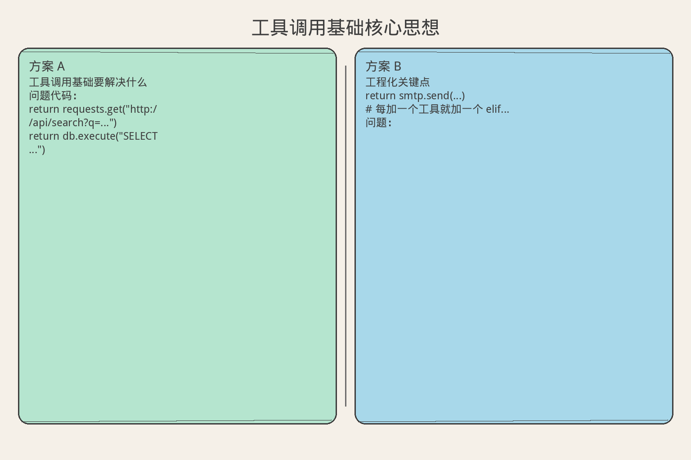
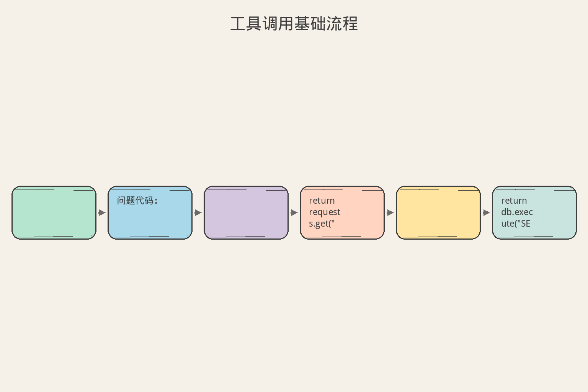
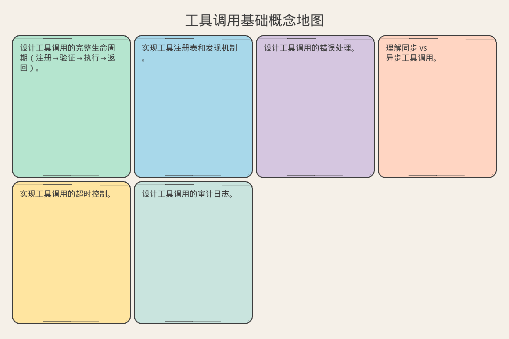

# AI Agent 工程（五）：工具调用基础

> Agent 的能力边界由工具决定。工具设计得好，Agent 就强；工具设计得差，Agent 再聪明也白搭。这篇讲工具调用的完整生命周期。

**阅读建议：** 先阅读 [217 企业级 Agent 架构总览](217.enterprise-agent-architecture-overview-tutorial.md)，理解工具层在架构中的位置。

**环境要求：**
- Python **3.10+**
- 无需安装第三方库

---

## 目录

1. [你会学到什么](#你会学到什么)
2. [它解决什么问题](#它解决什么问题)
3. [核心概念：工具调用的生命周期](#核心概念工具调用的生命周期)
4. [最小示例](#最小示例)
5. [工程化版本](#工程化版本)
6. [常见失败模式](#常见失败模式)
7. [什么时候不要这么做](#什么时候不要这么做)
8. [生产环境注意事项](#生产环境注意事项)
9. [如何观测和评测](#如何观测和评测)
10. [和 RAG / 后端 / 前端的关系](#和-rag--后端--前端的关系)
11. [面试怎么讲](#面试怎么讲)
12. [下一步](#下一步)

## 你会学到什么

- 设计工具调用的完整生命周期（注册→验证→执行→返回）。
- 实现工具注册表和发现机制。
- 设计工具调用的错误处理。
- 理解同步 vs 异步工具调用。
- 实现工具调用的超时控制。
- 设计工具调用的审计日志。

## 它解决什么问题


读下图时，先看「工具调用基础核心思想」建立直觉。


### 没有工具层的 Agent

```text
问题代码：

def agent_step(action):
    if action == "search":
        return requests.get("http://api/search?q=...")
    elif action == "query_db":
        return db.execute("SELECT ...")
    elif action == "send_email":
        return smtp.send(...)
    # 每加一个工具就加一个 elif...

问题：
  1. 没有统一的参数验证
  2. 没有统一的错误处理
  3. 没有超时控制
  4. 没有权限检查
  5. 没有审计日志
  6. 新增工具要改核心代码
  7. 无法测试单个工具
```

### 有工具层的 Agent

```text
工具层解决：
  1. 统一注册：新工具只需 register()
  2. 统一验证：参数 Schema 自动检查
  3. 统一错误：异常捕获 + 标准化返回
  4. 统一超时：每个工具有超时配置
  5. 统一权限：执行前自动检查
  6. 统一审计：每次调用自动记录
  7. 可测试：每个工具独立测试
```

## 核心概念：工具调用的生命周期

### 六步生命周期

```text
1. 注册（Register）
   工具启动时注册到 Registry
   包含：名称、描述、参数 Schema、权限级别

2. 发现（Discover）
   Agent 决策时查看可用工具列表
   LLM 根据描述选择工具

3. 验证（Validate）
   检查参数是否符合 Schema
   检查权限是否满足
   检查前置条件

4. 执行（Execute）
   调用工具函数
   超时控制
   错误捕获

5. 标准化（Normalize）
   统一返回格式
   错误信息标准化
   敏感信息脱敏

6. 记录（Log）
   写入审计日志
   更新指标
   触发事件
```

### 工具定义结构

```text
一个完整的工具定义：

{
  "name": "search_documents",
  "description": "在知识库中搜索相关文档",
  "parameters": {
    "query": {"type": "string", "required": true, "description": "搜索关键词"},
    "top_k": {"type": "integer", "required": false, "default": 5, "description": "返回数量"},
    "filter": {"type": "object", "required": false, "description": "过滤条件"}
  },
  "returns": {
    "type": "array",
    "items": {"type": "object", "properties": {"title": ..., "content": ..., "score": ...}}
  },
  "permission": "auto",
  "timeout_ms": 5000,
  "retry": {"max_attempts": 2, "backoff_ms": 1000},
  "idempotent": true
}
```

## 最小示例


读下图时，先看「工具调用基础流程」建立直觉。


### 工具注册表

```python
from dataclasses import dataclass, field
from typing import Any, Callable
from enum import Enum
from datetime import datetime, timezone
import uuid
import time


class ToolPermission(str, Enum):
    AUTO = "auto"           # 自动执行
    CONFIRM = "confirm"     # 需用户确认
    APPROVAL = "approval"   # 需管理员审批
    FORBIDDEN = "forbidden" # 禁止


@dataclass
class ToolParameter:
    """工具参数定义。"""
    name: str
    type: str  # string, integer, float, boolean, object, array
    required: bool = True
    default: Any = None
    description: str = ""


@dataclass
class ToolDefinition:
    """工具完整定义。"""
    name: str
    description: str
    fn: Callable
    parameters: list[ToolParameter] = field(default_factory=list)
    permission: ToolPermission = ToolPermission.AUTO
    timeout_ms: int = 5000
    idempotent: bool = False
    tags: list[str] = field(default_factory=list)


@dataclass
class ToolCallResult:
    """工具调用结果（标准化）。"""
    success: bool
    data: Any = None
    error: str | None = None
    error_code: str | None = None
    duration_ms: float = 0
    tool_name: str = ""
    call_id: str = ""


class ToolRegistry:
    """工具注册表。"""

    def __init__(self):
        self._tools: dict[str, ToolDefinition] = {}
        self._call_log: list[dict] = []

    def register(self, tool: ToolDefinition):
        """注册工具。"""
        if tool.name in self._tools:
            raise ValueError(f"工具已存在: {tool.name}")
        self._tools[tool.name] = tool

    def unregister(self, name: str):
        """注销工具。"""
        self._tools.pop(name, None)

    def get(self, name: str) -> ToolDefinition | None:
        return self._tools.get(name)

    def list_tools(self) -> list[dict]:
        """列出所有工具（给 LLM 看）。"""
        return [
            {
                "name": t.name,
                "description": t.description,
                "parameters": {
                    p.name: {"type": p.type, "required": p.required, "description": p.description}
                    for p in t.parameters
                },
            }
            for t in self._tools.values()
            if t.permission != ToolPermission.FORBIDDEN
        ]

    def validate_params(self, tool_name: str, params: dict) -> tuple[bool, str]:
        """验证参数。"""
        tool = self._tools.get(tool_name)
        if not tool:
            return False, f"工具不存在: {tool_name}"

        for param in tool.parameters:
            if param.required and param.name not in params:
                return False, f"缺少必需参数: {param.name}"
            if param.name in params:
                value = params[param.name]
                if not self._type_check(value, param.type):
                    return False, f"参数 {param.name} 类型错误: 期望 {param.type}"

        return True, "ok"

    def _type_check(self, value: Any, expected_type: str) -> bool:
        type_map = {
            "string": str,
            "integer": int,
            "float": (int, float),
            "boolean": bool,
            "object": dict,
            "array": list,
        }
        expected = type_map.get(expected_type)
        if expected is None:
            return True
        return isinstance(value, expected)

    @property
    def call_log(self) -> list[dict]:
        return list(self._call_log)


# 演示
def demo_registry():
    registry = ToolRegistry()

    # 注册工具
    registry.register(ToolDefinition(
        name="search",
        description="搜索文档",
        fn=lambda query="", top_k=5: [f"结果{i}: {query}" for i in range(top_k)],
        parameters=[
            ToolParameter("query", "string", required=True, description="搜索关键词"),
            ToolParameter("top_k", "integer", required=False, default=5, description="返回数量"),
        ],
        permission=ToolPermission.AUTO,
        timeout_ms=3000,
    ))

    registry.register(ToolDefinition(
        name="delete_record",
        description="删除数据库记录",
        fn=lambda record_id="": f"已删除 {record_id}",
        parameters=[
            ToolParameter("record_id", "string", required=True, description="记录 ID"),
        ],
        permission=ToolPermission.APPROVAL,
    ))

    # 列出工具
    print("  可用工具:")
    for tool in registry.list_tools():
        print(f"    - {tool['name']}: {tool['description']}")

    # 验证参数
    valid, msg = registry.validate_params("search", {"query": "test"})
    print(f"\n  验证 search(query='test'): {valid} - {msg}")

    valid, msg = registry.validate_params("search", {})
    print(f"  验证 search({{}}): {valid} - {msg}")

    valid, msg = registry.validate_params("search", {"query": 123})
    print(f"  验证 search(query=123): {valid} - {msg}")
```

### 工具执行器

```python
class ToolExecutor:
    """工具执行器：带超时、错误处理、审计。"""

    def __init__(self, registry: ToolRegistry):
        self.registry = registry

    def execute(self, tool_name: str, params: dict, user_id: str = "") -> ToolCallResult:
        """执行工具调用。"""
        call_id = f"CALL-{uuid.uuid4().hex[:8]}"
        start_time = time.perf_counter()

        # 1. 查找工具
        tool = self.registry.get(tool_name)
        if not tool:
            return ToolCallResult(
                success=False,
                error=f"工具不存在: {tool_name}",
                error_code="TOOL_NOT_FOUND",
                tool_name=tool_name,
                call_id=call_id,
            )

        # 2. 权限检查
        if tool.permission == ToolPermission.FORBIDDEN:
            return ToolCallResult(
                success=False,
                error="此工具已被禁用",
                error_code="FORBIDDEN",
                tool_name=tool_name,
                call_id=call_id,
            )

        # 3. 参数验证
        valid, msg = self.registry.validate_params(tool_name, params)
        if not valid:
            return ToolCallResult(
                success=False,
                error=msg,
                error_code="VALIDATION_ERROR",
                tool_name=tool_name,
                call_id=call_id,
            )

        # 4. 执行（带超时）
        try:
            result = tool.fn(**params)
            duration = (time.perf_counter() - start_time) * 1000

            # 5. 记录
            self._log_call(call_id, tool_name, params, True, duration, user_id)

            return ToolCallResult(
                success=True,
                data=result,
                duration_ms=round(duration, 2),
                tool_name=tool_name,
                call_id=call_id,
            )

        except TimeoutError:
            duration = (time.perf_counter() - start_time) * 1000
            self._log_call(call_id, tool_name, params, False, duration, user_id)
            return ToolCallResult(
                success=False,
                error=f"工具执行超时 ({tool.timeout_ms}ms)",
                error_code="TIMEOUT",
                duration_ms=round(duration, 2),
                tool_name=tool_name,
                call_id=call_id,
            )

        except Exception as e:
            duration = (time.perf_counter() - start_time) * 1000
            self._log_call(call_id, tool_name, params, False, duration, user_id)
            return ToolCallResult(
                success=False,
                error=str(e),
                error_code="EXECUTION_ERROR",
                duration_ms=round(duration, 2),
                tool_name=tool_name,
                call_id=call_id,
            )

    def _log_call(self, call_id: str, tool_name: str, params: dict,
                  success: bool, duration: float, user_id: str):
        """记录审计日志。"""
        self.registry._call_log.append({
            "call_id": call_id,
            "tool_name": tool_name,
            "params": {k: str(v)[:50] for k, v in params.items()},  # 截断
            "success": success,
            "duration_ms": round(duration, 2),
            "user_id": user_id,
            "timestamp": datetime.now(timezone.utc).isoformat(),
        })


# 演示
def demo_executor():
    registry = ToolRegistry()
    registry.register(ToolDefinition(
        name="calculate",
        description="数学计算",
        fn=lambda expr="": str(eval(expr)) if expr.isalnum() or expr.replace("+","").replace("*","").isdigit() else "invalid",
        parameters=[ToolParameter("expr", "string", required=True)],
        timeout_ms=1000,
    ))

    executor = ToolExecutor(registry)

    # 正常调用
    result = executor.execute("calculate", {"expr": "2+3"}, user_id="user-1")
    print(f"  计算 2+3: success={result.success}, data={result.data}, time={result.duration_ms}ms")

    # 参数错误
    result = executor.execute("calculate", {}, user_id="user-1")
    print(f"  缺少参数: success={result.success}, error={result.error}")

    # 工具不存在
    result = executor.execute("unknown_tool", {}, user_id="user-1")
    print(f"  未知工具: success={result.success}, error={result.error}")

    # 审计日志
    print(f"\n  审计日志: {len(registry.call_log)} 条")
```

## 工程化版本

### 异步工具执行

```python
import asyncio


class AsyncToolExecutor:
    """异步工具执行器。"""

    def __init__(self, registry: ToolRegistry):
        self.registry = registry

    async def execute(self, tool_name: str, params: dict, user_id: str = "") -> ToolCallResult:
        """异步执行工具。"""
        call_id = f"CALL-{uuid.uuid4().hex[:8]}"
        tool = self.registry.get(tool_name)

        if not tool:
            return ToolCallResult(success=False, error="工具不存在", tool_name=tool_name, call_id=call_id)

        # 参数验证
        valid, msg = self.registry.validate_params(tool_name, params)
        if not valid:
            return ToolCallResult(success=False, error=msg, error_code="VALIDATION_ERROR",
                                  tool_name=tool_name, call_id=call_id)

        # 带超时执行
        start = time.perf_counter()
        try:
            timeout_sec = tool.timeout_ms / 1000
            if asyncio.iscoroutinefunction(tool.fn):
                result = await asyncio.wait_for(tool.fn(**params), timeout=timeout_sec)
            else:
                # 同步函数放到线程池
                loop = asyncio.get_event_loop()
                result = await asyncio.wait_for(
                    loop.run_in_executor(None, lambda: tool.fn(**params)),
                    timeout=timeout_sec,
                )
            duration = (time.perf_counter() - start) * 1000
            return ToolCallResult(success=True, data=result, duration_ms=round(duration, 2),
                                  tool_name=tool_name, call_id=call_id)

        except asyncio.TimeoutError:
            duration = (time.perf_counter() - start) * 1000
            return ToolCallResult(success=False, error="超时", error_code="TIMEOUT",
                                  duration_ms=round(duration, 2), tool_name=tool_name, call_id=call_id)

        except Exception as e:
            duration = (time.perf_counter() - start) * 1000
            return ToolCallResult(success=False, error=str(e), error_code="EXECUTION_ERROR",
                                  duration_ms=round(duration, 2), tool_name=tool_name, call_id=call_id)

    async def execute_parallel(self, calls: list[tuple[str, dict]]) -> list[ToolCallResult]:
        """并行执行多个工具调用。"""
        tasks = [self.execute(name, params) for name, params in calls]
        return await asyncio.gather(*tasks)
```

### 工具调用链

```python
class ToolChain:
    """工具调用链：多个工具按顺序执行。"""

    def __init__(self, executor: ToolExecutor):
        self.executor = executor
        self._steps: list[tuple[str, dict]] = []

    def add_step(self, tool_name: str, params: dict):
        self._steps.append((tool_name, params))
        return self  # 链式调用

    def execute(self, stop_on_error: bool = True) -> dict:
        """执行调用链。"""
        results = []
        for i, (tool_name, params) in enumerate(self._steps):
            result = self.executor.execute(tool_name, params)
            results.append({
                "step": i + 1,
                "tool": tool_name,
                "success": result.success,
                "data": result.data,
                "error": result.error,
            })
            if not result.success and stop_on_error:
                return {"success": False, "failed_at": i + 1, "results": results}

        all_success = all(r["success"] for r in results)
        return {"success": all_success, "results": results}
```

### 工具装饰器

```python
def tool(name: str, description: str, permission: str = "auto", timeout_ms: int = 5000):
    """工具装饰器：简化注册。"""
    def decorator(fn: Callable) -> ToolDefinition:
        # 从类型注解推断参数
        import inspect
        sig = inspect.signature(fn)
        params = []
        for param_name, param in sig.parameters.items():
            param_type = "string"
            if param.annotation == int:
                param_type = "integer"
            elif param.annotation == float:
                param_type = "float"
            elif param.annotation == bool:
                param_type = "boolean"

            params.append(ToolParameter(
                name=param_name,
                type=param_type,
                required=(param.default is inspect.Parameter.empty),
                default=param.default if param.default is not inspect.Parameter.empty else None,
            ))

        return ToolDefinition(
            name=name,
            description=description,
            fn=fn,
            parameters=params,
            permission=ToolPermission(permission),
            timeout_ms=timeout_ms,
        )
    return decorator


# 使用
@tool("get_weather", "获取天气信息", timeout_ms=3000)
def get_weather(city: str, unit: str = "celsius") -> str:
    """获取指定城市的天气。"""
    return f"{city}: 25°C, 晴天"


@tool("send_notification", "发送通知", permission="confirm")
def send_notification(user_id: str, message: str) -> str:
    """发送通知给用户。"""
    return f"已通知 {user_id}: {message}"


def demo_decorator():
    registry = ToolRegistry()
    registry.register(get_weather)
    registry.register(send_notification)

    print("  注册的工具:")
    for t in registry.list_tools():
        print(f"    {t['name']}: {t['description']}")
        for pname, pinfo in t['parameters'].items():
            print(f"      - {pname}: {pinfo}")
```

## 常见失败模式

### 1. 工具描述不清

```text
症状：
  LLM 选错工具（该搜索时选了计算）

原因：
  描述太简短："搜索" vs "在知识库中按语义相似度搜索文档"

解决：
  描述要具体：做什么、输入什么、返回什么、什么时候用
  给 LLM 足够的信息做选择
```

### 2. 参数验证遗漏

```text
症状：
  工具收到非法参数，内部报错

原因：
  只验证了"有没有"，没验证"对不对"

解决：
  验证类型、范围、格式
  例：top_k 必须是 1-100 的正整数
```

### 3. 错误信息不友好

```text
症状：
  返回 "Internal Server Error" 给 LLM

原因：
  直接抛出原始异常

解决：
  标准化错误码 + 人类可读描述
  LLM 能根据错误信息决定下一步
```

### 4. 没有超时

```text
症状：
  一个工具卡住，整个 Agent 循环阻塞

原因：
  外部 API 无响应

解决：
  每个工具必须有超时
  超时后返回错误，Agent 可以重试或换方案
```

## 什么时候不要这么做

```text
不需要完整工具层的场景：

1. 只有 1-2 个工具
   直接 if/else 即可
   不需要注册表

2. 原型阶段
   先跑通再说
   不需要审计和权限

3. 工具都是内部函数
   不需要超时（不会卡住）
   不需要权限（都是只读）
```

## 生产环境注意事项

### 工具版本管理

```text
工具会演进：
  v1: search(query) → 基础搜索
  v2: search(query, filters) → 加过滤
  v3: search(query, filters, sort) → 加排序

兼容策略：
  1. 新参数设默认值（向后兼容）
  2. 不删除旧参数（标记 deprecated）
  3. 大版本用新工具名（search_v2）
  4. 旧版本保留一段时间后下线
```

### 工具健康检查

```python
class ToolHealthChecker:
    """工具健康检查。"""

    def __init__(self, registry: ToolRegistry):
        self.registry = registry

    def check_all(self) -> dict:
        """检查所有工具健康状态。"""
        results = {}
        for name, tool in self.registry._tools.items():
            try:
                # 尝试用空参数调用（只检查是否可达）
                start = time.perf_counter()
                # 实际中用 health_check 函数
                duration = (time.perf_counter() - start) * 1000
                results[name] = {"healthy": True, "latency_ms": round(duration, 2)}
            except Exception as e:
                results[name] = {"healthy": False, "error": str(e)}
        return results
```

## 如何观测和评测

### 关键指标

```text
工具层监控指标：

1. 调用量（按工具分）
   哪些工具最常用？

2. 成功率（按工具分）
   哪个工具经常失败？

3. 延迟 P95（按工具分）
   哪个工具最慢？

4. 超时率
   目标：< 1%

5. 权限拒绝次数
   是否有异常访问？

6. 参数验证失败率
   LLM 是否经常传错参数？
```

### 评测方法

```python
class ToolEvalSuite:
    """工具层评测。"""

    def __init__(self, executor: ToolExecutor):
        self.executor = executor

    def run_tests(self, test_cases: list[dict]) -> dict:
        """运行工具测试。"""
        passed = 0
        for case in test_cases:
            result = self.executor.execute(case["tool"], case["params"])
            if case.get("expect_success", True) == result.success:
                passed += 1

        return {"pass_rate": round(passed / max(len(test_cases), 1), 4), "total": len(test_cases)}
```

## 和 RAG / 后端 / 前端的关系

```text
与 RAG 的关系：
  检索是 Agent 的一个工具
  工具层管理检索工具的注册、超时、错误处理

与后端的关系：
  工具层是后端的一部分
  工具调用走后端 API
  权限检查在后端做

与前端的关系：
  前端展示工具调用进度
  需要确认的工具弹出确认框
  展示工具调用结果
```

## 面试怎么讲

```text
问：你怎么设计 Agent 的工具调用？

答（30 秒版）：
  工具调用有六步生命周期：注册、发现、验证、执行、标准化、记录。
  用注册表管理所有工具，每个工具有 Schema、权限、超时配置。
  执行前做参数验证和权限检查。
  执行时有超时控制。
  返回结果标准化（成功/失败 + 错误码）。
  每次调用写审计日志。

追问 1：LLM 怎么选工具？
  → 把所有工具的 name + description + parameters 给 LLM。
    LLM 根据描述选择。描述要具体，否则选错。

追问 2：工具调用失败怎么办？
  → 标准化错误返回给 Agent。
    Agent 根据错误码决定：重试、换工具、还是报告用户。

追问 3：怎么防止工具被滥用？
  → 权限分级（auto/confirm/approval/forbidden）。
    危险操作需审批。所有调用写审计日志。
```

## 工具调用的测试策略

### 单元测试：Mock 外部依赖

```python
import unittest
from unittest.mock import AsyncMock, patch


class TestToolExecutor(unittest.IsolatedAsyncioTestCase):
    """工具执行器的单元测试"""

    def setUp(self):
        self.registry = ToolRegistry()
        self.executor = AsyncToolExecutor(self.registry)

    async def test_successful_execution(self):
        """正常执行返回标准结果"""
        async def mock_search(query: str) -> str:
            return f"Results for: {query}"

        self.registry.register(ToolDefinition(
            name="search",
            description="Search the web",
            parameters={"query": {"type": "string"}},
            handler=mock_search,
        ))

        result = await self.executor.execute("search", {"query": "python"})
        self.assertTrue(result.success)
        self.assertIn("python", result.data)

    async def test_missing_tool_returns_error(self):
        """工具不存在时返回错误而非异常"""
        result = await self.executor.execute("nonexistent", {})
        self.assertFalse(result.success)
        self.assertEqual(result.error_code, "TOOL_NOT_FOUND")

    async def test_timeout_returns_error(self):
        """超时返回标准错误"""
        import asyncio

        async def slow_tool() -> str:
            await asyncio.sleep(10)
            return "done"

        self.registry.register(ToolDefinition(
            name="slow",
            description="Slow tool",
            parameters={},
            handler=slow_tool,
            timeout=0.1,
        ))

        result = await self.executor.execute("slow", {})
        self.assertFalse(result.success)
        self.assertEqual(result.error_code, "TIMEOUT")

    async def test_exception_is_caught(self):
        """工具内部异常被捕获，不向上传播"""
        async def broken_tool() -> str:
            raise ValueError("Something went wrong")

        self.registry.register(ToolDefinition(
            name="broken",
            description="Broken tool",
            parameters={},
            handler=broken_tool,
        ))

        result = await self.executor.execute("broken", {})
        self.assertFalse(result.success)
        self.assertEqual(result.error_code, "EXECUTION_ERROR")
```

### 集成测试：真实工具 + 沙箱

```python
class TestToolIntegration(unittest.IsolatedAsyncioTestCase):
    """集成测试：验证工具与真实服务的交互"""

    async def test_http_tool_with_mock_server(self):
        """用本地 mock server 测试 HTTP 工具"""
        from aiohttp import web
        import aiohttp

        # 启动 mock server
        async def handle(request):
            return web.json_response({"status": "ok", "data": [1, 2, 3]})

        app = web.Application()
        app.router.add_get("/api/data", handle)
        runner = web.AppRunner(app)
        await runner.setup()
        site = web.TCPSite(runner, "localhost", 18080)
        await site.start()

        try:
            # 注册 HTTP 工具
            async def http_tool(url: str) -> str:
                async with aiohttp.ClientSession() as session:
                    async with session.get(url) as resp:
                        data = await resp.json()
                        return str(data)

            registry = ToolRegistry()
            registry.register(ToolDefinition(
                name="http_get",
                description="GET request",
                parameters={"url": {"type": "string"}},
                handler=http_tool,
            ))

            executor = AsyncToolExecutor(registry)
            result = await executor.execute(
                "http_get",
                {"url": "http://localhost:18080/api/data"}
            )
            self.assertTrue(result.success)
            self.assertIn("ok", result.data)
        finally:
            await runner.cleanup()
```

## 工具调用的监控与可观测性

### 指标收集

```python
from dataclasses import dataclass, field
from collections import defaultdict
import time


@dataclass
class ToolMetrics:
    """工具调用指标收集器"""
    call_count: dict[str, int] = field(default_factory=lambda: defaultdict(int))
    error_count: dict[str, int] = field(default_factory=lambda: defaultdict(int))
    total_latency: dict[str, float] = field(default_factory=lambda: defaultdict(float))
    max_latency: dict[str, float] = field(default_factory=lambda: defaultdict(float))

    def record(self, tool_name: str, success: bool, latency_ms: float):
        self.call_count[tool_name] += 1
        self.total_latency[tool_name] += latency_ms
        self.max_latency[tool_name] = max(
            self.max_latency[tool_name], latency_ms
        )
        if not success:
            self.error_count[tool_name] += 1

    def summary(self) -> dict:
        """生成指标摘要"""
        result = {}
        for name in self.call_count:
            count = self.call_count[name]
            errors = self.error_count[name]
            avg_latency = self.total_latency[name] / count if count > 0 else 0
            result[name] = {
                "calls": count,
                "errors": errors,
                "error_rate": errors / count if count > 0 else 0,
                "avg_latency_ms": round(avg_latency, 2),
                "max_latency_ms": round(self.max_latency[name], 2),
            }
        return result


class MonitoredToolExecutor(AsyncToolExecutor):
    """带监控的工具执行器"""

    def __init__(self, registry: ToolRegistry):
        super().__init__(registry)
        self.metrics = ToolMetrics()

    async def execute(self, tool_name: str, arguments: dict) -> ToolResult:
        start = time.perf_counter()
        result = await super().execute(tool_name, arguments)
        latency_ms = (time.perf_counter() - start) * 1000
        self.metrics.record(tool_name, result.success, latency_ms)
        return result
```

### 告警规则

```text
生产环境建议的告警规则：

1. 错误率告警：
   - 单个工具 5 分钟内错误率 > 20% → P2 告警
   - 单个工具 5 分钟内错误率 > 50% → P1 告警
   - 所有工具整体错误率 > 10% → P1 告警

2. 延迟告警：
   - P99 延迟 > 5s → P3 告警
   - P99 延迟 > 15s → P2 告警
   - 连续 3 次超时 → P2 告警

3. 调用量告警：
   - 调用量突增 5 倍 → P3 告警（可能被滥用）
   - 调用量降为 0 超过 10 分钟 → P2 告警（可能服务异常）
```

## 工具调用的安全最佳实践

### 输入清洗

```python
import re


class InputSanitizer:
    """工具输入清洗器"""

    # 危险模式
    DANGEROUS_PATTERNS = [
        re.compile(r";\s*(rm|del|format|shutdown)"),
        re.compile(r"\$\(.*\)"),  # 命令替换
        re.compile(r"`.*`"),      # 反引号执行
        re.compile(r"\|\s*(bash|sh|cmd)"),  # 管道到 shell
    ]

    @classmethod
    def sanitize_string(cls, value: str) -> str:
        """清洗字符串输入"""
        # 检查危险模式
        for pattern in cls.DANGEROUS_PATTERNS:
            if pattern.search(value):
                raise ValueError(
                    f"Input contains dangerous pattern: {pattern.pattern}"
                )
        # 限制长度
        if len(value) > 10000:
            raise ValueError("Input too long (max 10000 chars)")
        return value.strip()

    @classmethod
    def sanitize_dict(cls, data: dict, schema: dict) -> dict:
        """根据 schema 清洗整个参数字典"""
        cleaned = {}
        for key, spec in schema.items():
            if key not in data:
                continue
            value = data[key]
            if spec.get("type") == "string":
                cleaned[key] = cls.sanitize_string(str(value))
            elif spec.get("type") == "integer":
                cleaned[key] = int(value)
            elif spec.get("type") == "number":
                cleaned[key] = float(value)
            elif spec.get("type") == "boolean":
                cleaned[key] = bool(value)
            else:
                cleaned[key] = value
        return cleaned
```

### 速率限制

```python
from collections import deque


class ToolRateLimiter:
    """工具级别的速率限制"""

    def __init__(self):
        # tool_name -> (max_calls, window_seconds, call_timestamps)
        self._limits: dict[str, tuple[int, float, deque]] = {}

    def set_limit(self, tool_name: str, max_calls: int, window_seconds: float):
        """设置工具的速率限制"""
        self._limits[tool_name] = (max_calls, window_seconds, deque())

    def check(self, tool_name: str) -> bool:
        """检查是否允许调用"""
        if tool_name not in self._limits:
            return True  # 无限制

        max_calls, window, timestamps = self._limits[tool_name]
        now = time.time()

        # 清除窗口外的记录
        while timestamps and timestamps[0] < now - window:
            timestamps.popleft()

        if len(timestamps) >= max_calls:
            return False  # 超限

        timestamps.append(now)
        return True

    def remaining(self, tool_name: str) -> int:
        """剩余可用次数"""
        if tool_name not in self._limits:
            return -1  # 无限制
        max_calls, window, timestamps = self._limits[tool_name]
        now = time.time()
        while timestamps and timestamps[0] < now - window:
            timestamps.popleft()
        return max(0, max_calls - len(timestamps))
```

## 完整工程化示例：带监控和安全的执行器

```python
class ProductionToolExecutor:
    """生产级工具执行器：集成注册、验证、限流、监控、审计"""

    def __init__(self):
        self.registry = ToolRegistry()
        self.metrics = ToolMetrics()
        self.rate_limiter = ToolRateLimiter()
        self.audit_log: list[dict] = []

    async def execute(
        self, tool_name: str, arguments: dict, caller: str = "agent"
    ) -> ToolResult:
        # 1. 速率限制检查
        if not self.rate_limiter.check(tool_name):
            return ToolResult(
                success=False,
                data=None,
                error_code="RATE_LIMITED",
                error_message=f"Tool '{tool_name}' rate limit exceeded",
            )

        # 2. 输入清洗
        tool_def = self.registry.get(tool_name)
        if tool_def and tool_def.parameters:
            try:
                arguments = InputSanitizer.sanitize_dict(
                    arguments, tool_def.parameters
                )
            except ValueError as e:
                return ToolResult(
                    success=False,
                    data=None,
                    error_code="INVALID_INPUT",
                    error_message=str(e),
                )

        # 3. 执行 + 计时
        start = time.perf_counter()
        executor = AsyncToolExecutor(self.registry)
        result = await executor.execute(tool_name, arguments)
        latency_ms = (time.perf_counter() - start) * 1000

        # 4. 记录指标
        self.metrics.record(tool_name, result.success, latency_ms)

        # 5. 审计日志
        self.audit_log.append({
            "tool": tool_name,
            "caller": caller,
            "success": result.success,
            "latency_ms": round(latency_ms, 2),
            "timestamp": time.time(),
        })

        return result
```

## 下一步


读下图时，先看「工具调用基础概念地图」建立直觉。


下一篇 [219 工具 Schema 设计](219.tool-schema-design-tutorial.md) 会深入工具参数设计，让 LLM 更准确地调用工具。
