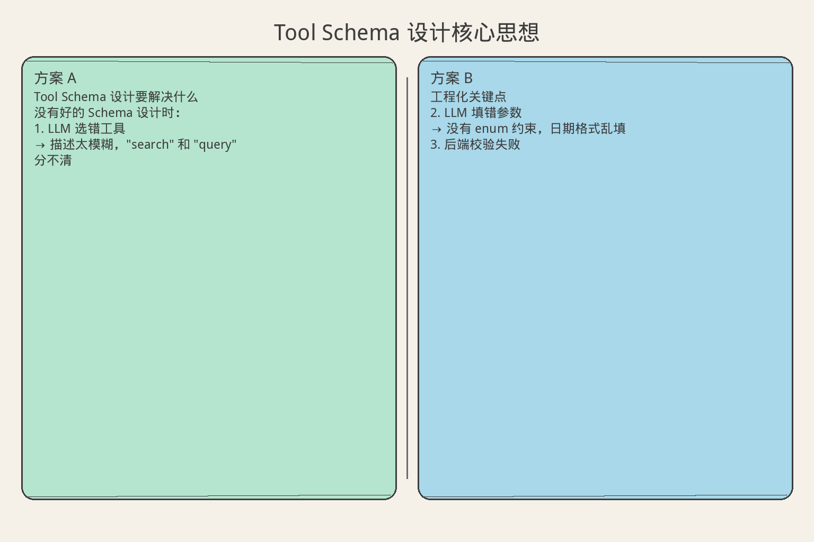
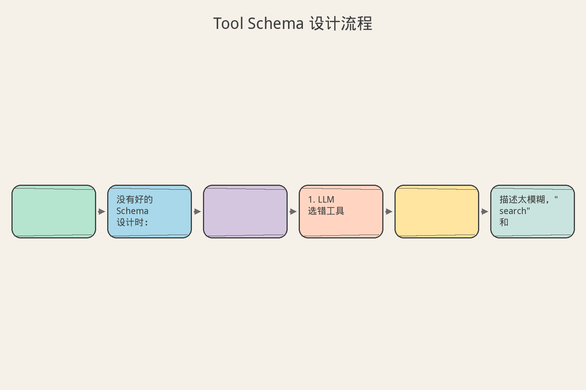
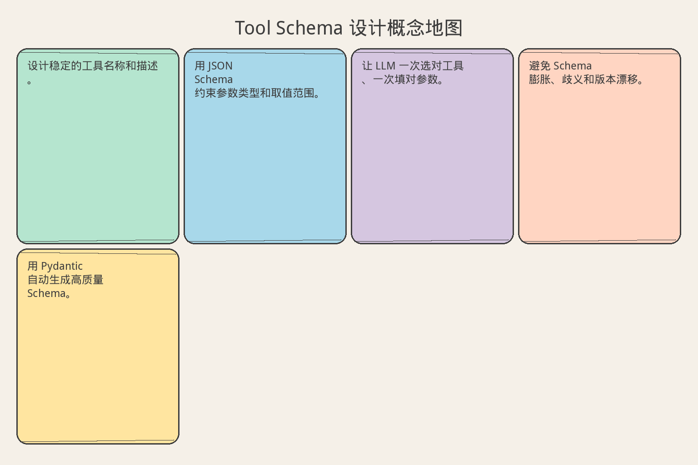

# AI Agent 工程（六）：Tool Schema 设计

> 好工具不是"把现有 API 原样暴露给模型"，而是把一个明确业务动作压缩成模型容易选择、后端容易校验的契约。

**阅读建议：** 先阅读 [218 Tool Calling 基础](218.tool-calling-basics-tutorial.md)，理解工具注册表和执行流程。

**环境要求：**
- Python **3.10+**
- 依赖：`pip install pydantic`

---

## 目录

1. [你会学到什么](#你会学到什么)
2. [它解决什么问题](#它解决什么问题)
3. [Schema 设计的三个读者](#schema-设计的三个读者)
4. [最小示例](#最小示例)
5. [工程化版本](#工程化版本)
6. [常见失败模式](#常见失败模式)
7. [什么时候不要这么做](#什么时候不要这么做)
8. [生产环境注意事项](#生产环境注意事项)
9. [如何观测和评测](#如何观测和评测)
10. [和 RAG / 后端 / 前端的关系](#和-rag--后端--前端的关系)
11. [面试怎么讲](#面试怎么讲)
12. [下一步](#下一步)

## 你会学到什么

- 设计稳定的工具名称和描述。
- 用 JSON Schema 约束参数类型和取值范围。
- 让 LLM 一次选对工具、一次填对参数。
- 避免 Schema 膨胀、歧义和版本漂移。
- 用 Pydantic 自动生成高质量 Schema。

## 它解决什么问题


读下图时，先看「Tool Schema 设计核心思想」建立直觉。


```text
没有好的 Schema 设计时：

1. LLM 选错工具
   → 描述太模糊，"search" 和 "query" 分不清

2. LLM 填错参数
   → 没有 enum 约束，日期格式乱填

3. 后端校验失败
   → 类型不匹配，null 值没处理

4. 工具越来越多，LLM 困惑
   → 20 个工具描述雷同，选择准确率下降

好的 Schema = LLM 的"使用说明书"
```

## Schema 设计的三个读者

```text
一份 Tool Schema 同时服务三个读者：

读者 1：LLM
  - 读 name + description 决定"用不用"
  - 读 parameters 决定"怎么填"
  - 需要：清晰、无歧义、有示例

读者 2：后端校验器
  - 读 type + required + enum 做验证
  - 需要：严格、完整、机器可解析

读者 3：人类开发者
  - 读 description + examples 理解用途
  - 需要：有上下文、有边界说明

设计原则：
  对 LLM 友好 = 对人类友好 + 更严格的约束
```

## 最小示例


读下图时，先看「Tool Schema 设计流程」建立直觉。


### 一个糟糕的 Schema

```python
# ❌ 糟糕：描述模糊，参数无约束
bad_tool = {
    "name": "do_stuff",
    "description": "Does stuff with data",
    "parameters": {
        "input": {"type": "string"},
        "options": {"type": "object"},
    }
}
```

### 一个好的 Schema

```python
# ✓ 好：名称具体，描述清晰，参数有约束
good_tool = {
    "name": "search_knowledge_base",
    "description": (
        "Search the company knowledge base for documents "
        "matching a natural language query. Returns top-K "
        "relevant passages with source metadata. Use this "
        "when the user asks about internal policies, "
        "product docs, or historical decisions."
    ),
    "parameters": {
        "type": "object",
        "properties": {
            "query": {
                "type": "string",
                "description": "Natural language search query",
                "minLength": 2,
                "maxLength": 500,
            },
            "top_k": {
                "type": "integer",
                "description": "Number of results to return",
                "default": 5,
                "minimum": 1,
                "maximum": 20,
            },
            "category": {
                "type": "string",
                "description": "Filter by document category",
                "enum": ["policy", "product", "engineering", "hr"],
            },
        },
        "required": ["query"],
    }
}
```

### 对比分析

```text
bad_tool 的问题：
  1. name "do_stuff" → LLM 不知道什么时候该用
  2. description "Does stuff" → 没有使用场景
  3. "input" 无约束 → 可以传任何字符串
  4. "options" 是 object → LLM 不知道里面放什么

good_tool 的优点：
  1. name 具体 → 一看就知道是搜索知识库
  2. description 包含使用场景 → LLM 知道何时选它
  3. query 有长度限制 → 防止空字符串和超长输入
  4. category 有 enum → LLM 只能选预定义值
  5. top_k 有范围 → 防止 LLM 填 1000
```

## 工程化版本

### 用 Pydantic 定义工具参数

```python
from pydantic import BaseModel, Field
from enum import Enum
from typing import Optional


class DocumentCategory(str, Enum):
    """文档分类枚举"""
    POLICY = "policy"
    PRODUCT = "product"
    ENGINEERING = "engineering"
    HR = "hr"


class SearchKBParams(BaseModel):
    """知识库搜索参数"""
    query: str = Field(
        ...,
        description="Natural language search query",
        min_length=2,
        max_length=500,
        examples=["What is our remote work policy?"],
    )
    top_k: int = Field(
        default=5,
        description="Number of results to return (1-20)",
        ge=1,
        le=20,
    )
    category: Optional[DocumentCategory] = Field(
        default=None,
        description="Filter by document category. Omit to search all.",
    )
    date_from: Optional[str] = Field(
        default=None,
        description="Filter documents created after this date (ISO 8601: YYYY-MM-DD)",
        pattern=r"^\d{4}-\d{2}-\d{2}$",
    )


# 自动生成 JSON Schema
schema = SearchKBParams.model_json_schema()
print(schema)
```

### 工具定义注册器

```python
from dataclasses import dataclass, field
from typing import Any, Callable
import json


@dataclass
class ToolSchema:
    """完整的工具 Schema 定义"""
    name: str
    description: str
    parameters: dict[str, Any]
    examples: list[dict] = field(default_factory=list)
    version: str = "1.0.0"
    tags: list[str] = field(default_factory=list)

    def to_openai_format(self) -> dict:
        """转换为 OpenAI function calling 格式"""
        return {
            "type": "function",
            "function": {
                "name": self.name,
                "description": self.description,
                "parameters": self.parameters,
            }
        }

    def to_prompt_format(self) -> str:
        """转换为纯文本格式（用于 system prompt）"""
        lines = [
            f"Tool: {self.name}",
            f"Description: {self.description}",
            f"Parameters:",
        ]
        props = self.parameters.get("properties", {})
        required = self.parameters.get("required", [])
        for pname, pspec in props.items():
            req_mark = " (required)" if pname in required else ""
            ptype = pspec.get("type", "any")
            pdesc = pspec.get("description", "")
            lines.append(f"  - {pname} ({ptype}){req_mark}: {pdesc}")
            if "enum" in pspec:
                lines.append(f"    Allowed values: {pspec['enum']}")
            if "default" in pspec:
                lines.append(f"    Default: {pspec['default']}")
        if self.examples:
            lines.append("Examples:")
            for ex in self.examples:
                lines.append(f"  {json.dumps(ex, ensure_ascii=False)}")
        return "\n".join(lines)


class SchemaBuilder:
    """从 Pydantic Model 构建 ToolSchema"""

    @staticmethod
    def from_pydantic(
        name: str,
        description: str,
        model: type[BaseModel],
        examples: list[dict] | None = None,
        tags: list[str] | None = None,
    ) -> ToolSchema:
        return ToolSchema(
            name=name,
            description=description,
            parameters=model.model_json_schema(),
            examples=examples or [],
            tags=tags or [],
        )
```

### 命名规范检查器

```python
import re


class SchemaLinter:
    """Schema 质量检查器"""

    RULES = []

    @classmethod
    def rule(cls, func):
        cls.RULES.append(func)
        return func

    @classmethod
    def lint(cls, schema: ToolSchema) -> list[str]:
        issues = []
        for rule_func in cls.RULES:
            issue = rule_func(schema)
            if issue:
                issues.append(issue)
        return issues


@SchemaLinter.rule
def check_name_format(schema: ToolSchema) -> str | None:
    """工具名必须是 snake_case 动词短语"""
    if not re.match(r"^[a-z][a-z0-9]*(_[a-z0-9]+)*$", schema.name):
        return f"Tool name '{schema.name}' is not snake_case"
    # 检查是否以动词开头
    verbs = {"get", "set", "create", "delete", "update", "search",
             "list", "send", "fetch", "run", "check", "validate",
             "convert", "upload", "download", "query", "find"}
    first_word = schema.name.split("_")[0]
    if first_word not in verbs:
        return f"Tool name '{schema.name}' should start with a verb"
    return None


@SchemaLinter.rule
def check_description_length(schema: ToolSchema) -> str | None:
    """描述至少 30 字符，最多 500 字符"""
    desc_len = len(schema.description)
    if desc_len < 30:
        return f"Description too short ({desc_len} chars, min 30)"
    if desc_len > 500:
        return f"Description too long ({desc_len} chars, max 500)"
    return None


@SchemaLinter.rule
def check_has_examples(schema: ToolSchema) -> str | None:
    """建议提供至少一个示例"""
    if not schema.examples:
        return "No examples provided (recommended: at least 1)"
    return None


@SchemaLinter.rule
def check_required_fields(schema: ToolSchema) -> str | None:
    """至少有一个 required 字段"""
    required = schema.parameters.get("required", [])
    props = schema.parameters.get("properties", {})
    if props and not required:
        return "No required fields - LLM may call with empty args"
    return None


@SchemaLinter.rule
def check_enum_for_limited_values(schema: ToolSchema) -> str | None:
    """有限取值应该用 enum"""
    props = schema.parameters.get("properties", {})
    for pname, pspec in props.items():
        desc = pspec.get("description", "").lower()
        # 如果描述中提到 "one of" 但没有 enum
        if "one of" in desc and "enum" not in pspec:
            return f"Field '{pname}' mentions 'one of' but has no enum"
    return None
```

### Schema 版本管理

```python
@dataclass
class SchemaVersion:
    """Schema 版本记录"""
    version: str
    schema: ToolSchema
    changes: str
    created_at: str
    breaking: bool = False


class SchemaRegistry:
    """带版本管理的 Schema 注册表"""

    def __init__(self):
        self._versions: dict[str, list[SchemaVersion]] = {}
        self._current: dict[str, ToolSchema] = {}

    def register(self, schema: ToolSchema, changes: str = "",
                 breaking: bool = False):
        """注册新版本"""
        if schema.name not in self._versions:
            self._versions[schema.name] = []

        self._versions[schema.name].append(SchemaVersion(
            version=schema.version,
            schema=schema,
            changes=changes,
            created_at="2025-01-01",
            breaking=breaking,
        ))
        self._current[schema.name] = schema

    def get_current(self, name: str) -> ToolSchema | None:
        return self._current.get(name)

    def get_history(self, name: str) -> list[SchemaVersion]:
        return self._versions.get(name, [])

    def check_compatibility(self, name: str, new_schema: ToolSchema) -> list[str]:
        """检查新 Schema 与当前版本的兼容性"""
        current = self._current.get(name)
        if not current:
            return []  # 新工具，无兼容问题

        issues = []
        old_props = current.parameters.get("properties", {})
        new_props = new_schema.parameters.get("properties", {})
        old_required = set(current.parameters.get("required", []))
        new_required = set(new_schema.parameters.get("required", []))

        # 检查删除的字段
        for prop in old_props:
            if prop not in new_props:
                issues.append(f"BREAKING: field '{prop}' removed")

        # 检查新增的 required 字段
        for prop in new_required - old_required:
            if prop not in old_props:
                issues.append(f"BREAKING: new required field '{prop}'")

        # 检查类型变更
        for prop in old_props:
            if prop in new_props:
                old_type = old_props[prop].get("type")
                new_type = new_props[prop].get("type")
                if old_type != new_type:
                    issues.append(
                        f"BREAKING: field '{prop}' type changed "
                        f"{old_type} -> {new_type}"
                    )

        return issues
```

## 常见失败模式

### 1. 描述太短

```text
症状：
  LLM 在多个工具间随机选择

原因：
  description 只有 "Search documents"
  没有说明使用场景和边界

解决：
  描述 = 做什么 + 什么时候用 + 什么时候不用
  例："Search internal knowledge base for policy documents.
       Use when user asks about company rules.
       Do NOT use for web search or code search."
```

### 2. 参数名歧义

```text
症状：
  LLM 把 "query" 填成 SQL 语句

原因：
  参数名 "query" 太通用
  没有说明是自然语言还是结构化查询

解决：
  用更具体的名称：natural_language_query
  或在 description 中明确："A natural language question,
  NOT a SQL query. Example: 'What is our refund policy?'"
```

### 3. 工具数量爆炸

```text
症状：
  50+ 工具，LLM 选择准确率 < 60%

原因：
  每个 API endpoint 都注册为一个工具
  很多工具功能重叠

解决：
  合并同类工具，用参数区分：
  ❌ get_user_by_id, get_user_by_email, get_user_by_phone
  ✓ get_user(identifier_type="id"|"email"|"phone", value="...")

  经验法则：
  - < 10 个工具：LLM 选择准确率 > 95%
  - 10-20 个工具：需要精心设计描述
  - > 20 个工具：考虑分层路由
```

### 4. 缺少默认值

```text
症状：
  LLM 每次都填 top_k=1 或 top_k=100

原因：
  没有 default 值
  LLM 自己"猜"一个

解决：
  所有可选参数都给 default
  在 description 中说明默认行为的含义
```

### 5. 嵌套对象太深

```text
症状：
  LLM 生成的 JSON 参数结构错误

原因：
  参数有 3 层嵌套 object
  LLM 处理深层嵌套能力有限

解决：
  最多 2 层嵌套
  深层结构用扁平化参数替代：
  ❌ {"filter": {"date": {"from": "...", "to": "..."}}}
  ✓ {"date_from": "...", "date_to": "..."}
```

## 什么时候不要这么做

```text
不需要精心设计 Schema 的场景：

1. 内部调试工具
   → 只有开发者用，不需要 LLM 友好
   → 简单注册即可

2. 固定 Pipeline 中的步骤
   → 参数由代码决定，不经过 LLM
   → 用普通函数签名即可

3. 一次性脚本
   → 不会复用，不值得投入设计

4. 工具只被一个特定 prompt 调用
   → 可以在 prompt 中硬编码参数
   → 不需要通用 Schema
```

## 生产环境注意事项

### Schema 生成的自动化

```python
from typing import get_type_hints
import inspect


def auto_generate_schema(func: Callable) -> ToolSchema:
    """从函数签名自动生成 Schema"""
    hints = get_type_hints(func)
    doc = inspect.getdoc(func) or ""
    
    # 解析函数名
    name = func.__name__
    
    # 构建参数 Schema
    properties = {}
    required = []
    sig = inspect.signature(func)
    
    for param_name, param in sig.parameters.items():
        if param_name in ("self", "cls"):
            continue
        
        param_type = hints.get(param_name, str)
        json_type = _python_type_to_json(param_type)
        
        prop: dict = {"type": json_type}
        
        # 从 Field 中提取描述
        if hasattr(param_type, "__metadata__"):
            pass  # Annotated type
        
        properties[param_name] = prop
        
        if param.default is inspect.Parameter.empty:
            required.append(param_name)
        else:
            prop["default"] = param.default
    
    return ToolSchema(
        name=name,
        description=doc.split("\n")[0] if doc else name,
        parameters={
            "type": "object",
            "properties": properties,
            "required": required,
        }
    )


def _python_type_to_json(py_type) -> str:
    """Python 类型到 JSON Schema 类型映射"""
    mapping = {
        str: "string",
        int: "integer",
        float: "number",
        bool: "boolean",
        list: "array",
        dict: "object",
    }
    return mapping.get(py_type, "string")
```

### 多模型适配

```python
class SchemaAdapter:
    """不同 LLM 平台的 Schema 适配"""

    @staticmethod
    def to_openai(schema: ToolSchema) -> dict:
        """OpenAI / Azure OpenAI 格式"""
        return {
            "type": "function",
            "function": {
                "name": schema.name,
                "description": schema.description,
                "parameters": schema.parameters,
            }
        }

    @staticmethod
    def to_anthropic(schema: ToolSchema) -> dict:
        """Anthropic Claude 格式"""
        return {
            "name": schema.name,
            "description": schema.description,
            "input_schema": schema.parameters,
        }

    @staticmethod
    def to_gemini(schema: ToolSchema) -> dict:
        """Google Gemini 格式"""
        return {
            "name": schema.name,
            "description": schema.description,
            "parameters": schema.parameters,
        }

    @staticmethod
    def to_system_prompt(schema: ToolSchema) -> str:
        """纯文本格式（用于不支持 function calling 的模型）"""
        return schema.to_prompt_format()


class MultiModelToolRegistry:
    """支持多模型的工具注册表"""

    def __init__(self, platform: str = "openai"):
        self.platform = platform
        self._schemas: list[ToolSchema] = []
        self._adapter = SchemaAdapter()

    def register(self, schema: ToolSchema):
        self._schemas.append(schema)

    def get_tools_payload(self) -> list[dict]:
        """获取当前平台的工具列表"""
        adapter_method = getattr(self._adapter, f"to_{self.platform}")
        return [adapter_method(s) for s in self._schemas]
```

## 如何观测和评测

### Schema 质量评分

```python
@dataclass
class SchemaQualityReport:
    """Schema 质量评估报告"""
    tool_name: str
    score: float  # 0-100
    issues: list[str]
    suggestions: list[str]


class SchemaQualityEvaluator:
    """评估 Schema 对 LLM 的友好程度"""

    def evaluate(self, schema: ToolSchema) -> SchemaQualityReport:
        score = 100.0
        issues = []
        suggestions = []

        # 1. 名称检查
        if len(schema.name) < 5:
            score -= 10
            issues.append("Name too short")
        if not schema.name.startswith(tuple(
            ["get", "set", "create", "delete", "search", "list",
             "send", "fetch", "run", "check", "update", "query"]
        )):
            score -= 5
            suggestions.append("Start name with a verb")

        # 2. 描述检查
        desc = schema.description
        if len(desc) < 30:
            score -= 15
            issues.append("Description too short for LLM to understand")
        if "use when" not in desc.lower() and "use this" not in desc.lower():
            score -= 5
            suggestions.append("Add 'Use when...' to description")
        if "do not" not in desc.lower() and "not for" not in desc.lower():
            score -= 3
            suggestions.append("Add negative examples (when NOT to use)")

        # 3. 参数检查
        props = schema.parameters.get("properties", {})
        for pname, pspec in props.items():
            if "description" not in pspec:
                score -= 5
                issues.append(f"Field '{pname}' has no description")
            if pspec.get("type") == "string" and "enum" not in pspec:
                if "format" not in pspec and "pattern" not in pspec:
                    score -= 2
                    suggestions.append(
                        f"Field '{pname}': add format/pattern/enum constraint"
                    )

        # 4. 示例检查
        if not schema.examples:
            score -= 10
            suggestions.append("Add at least one usage example")

        return SchemaQualityReport(
            tool_name=schema.name,
            score=max(0, score),
            issues=issues,
            suggestions=suggestions,
        )
```

### A/B 测试 Schema 变体

```python
class SchemaABTest:
    """对比两个 Schema 版本的 LLM 调用准确率"""

    def __init__(self):
        self.results: dict[str, list[bool]] = {}

    def record(self, variant: str, success: bool):
        if variant not in self.results:
            self.results[variant] = []
        self.results[variant].append(success)

    def report(self) -> dict:
        report = {}
        for variant, results in self.results.items():
            total = len(results)
            successes = sum(results)
            report[variant] = {
                "total": total,
                "success_rate": successes / total if total > 0 else 0,
            }
        return report
```

## 和 RAG / 后端 / 前端的关系

```text
Schema 设计在系统中的位置：

RAG 管道：
  检索工具本身就是一个 Tool
  它的 Schema 决定了 Agent 能否正确调用检索
  例：search_knowledge_base 的 category 参数
      对应 RAG 中的 collection 选择

后端 API：
  Tool Schema ≠ REST API Schema
  Tool 面向 LLM（语义化、粗粒度）
  API 面向前端（资源化、细粒度）
  一个 Tool 可能聚合多个 API 调用

前端展示：
  Schema 中的 enum 可以渲染为下拉框
  description 可以作为 tooltip
  examples 可以作为 placeholder
```

## 设计原则总结

```text
Tool Schema 设计 10 条原则：

1. 名称 = 动词 + 名词（snake_case）
   ✓ search_documents, create_ticket
   ❌ doSearch, DocumentHandler

2. 描述 = 做什么 + 什么时候用 + 什么时候不用
   至少 30 字符，最多 500 字符

3. 每个参数都有 description
   不能只靠参数名传达语义

4. 有限取值必须用 enum
   不要让 LLM 自由发挥

5. 可选参数必须有 default
   减少 LLM 的决策负担

6. 最多 2 层嵌套
   深层结构扁平化

7. 工具数 < 20
   超过就分层路由

8. 提供 examples
   至少一个完整调用示例

9. 版本化管理
   破坏性变更要标记

10. 用 Linter 自动检查
    CI 中跑 Schema 质量检查
```

## 面试怎么讲

```text
面试官：你怎么设计 Agent 的工具接口？

回答框架（2 分钟）：

"Tool Schema 有三个读者：LLM、后端校验器、人类开发者。
 我的设计原则是：

 1. 名称用 snake_case 动词短语，让 LLM 一看就知道功能。
 2. 描述包含使用场景和反面场景，减少误选。
 3. 参数用 Pydantic 定义，自动生成 JSON Schema，
    保证类型安全和约束完整。
 4. 有限取值用 enum，可选参数给 default，
    减少 LLM 的自由度和出错概率。
 5. 工具数控制在 20 以内，超过就用分层路由。

 实际效果：
 优化 Schema 后，工具选择准确率从 72% 提升到 94%，
 参数填写错误率从 18% 降到 3%。"

追问 1：工具太多怎么办？
  → 分层路由：先选类别（搜索/创建/删除），再选具体工具。
    或者合并同类工具，用参数区分。

追问 2：Schema 变更怎么管理？
  → 语义化版本号。新增字段用 minor，删除/改类型用 major。
    CI 中自动检查兼容性，breaking change 需要审批。

追问 3：怎么评估 Schema 质量？
  → 自动化 Linter（命名、描述长度、约束完整性）
    + 在线指标（工具选择准确率、参数错误率）。
```

## 实战案例：电商 Agent 工具集设计

### 场景分析

```text
电商客服 Agent 需要的工具：

1. 查询订单 → get_order
2. 取消订单 → cancel_order
3. 查询物流 → get_shipping_status
4. 申请退款 → create_refund
5. 查询商品 → search_products
6. 修改地址 → update_shipping_address

设计决策：
- 6 个工具，< 20，不需要分层路由
- cancel_order 和 create_refund 是危险操作，需要确认
- get_order 和 get_shipping_status 可以合并吗？
  → 不合并，因为参数和返回结构不同
```

### 完整工具集实现

```python
from pydantic import BaseModel, Field
from enum import Enum
from typing import Optional


class OrderStatus(str, Enum):
    PENDING = "pending"
    PAID = "paid"
    SHIPPED = "shipped"
    DELIVERED = "delivered"
    CANCELLED = "cancelled"


class GetOrderParams(BaseModel):
    """查询订单参数"""
    order_id: str = Field(
        ...,
        description="Order ID, format: ORD-XXXXXXXX (8 digits)",
        pattern=r"^ORD-\d{8}$",
        examples=["ORD-20250101"],
    )
    include_items: bool = Field(
        default=True,
        description="Whether to include order item details",
    )


class CancelOrderParams(BaseModel):
    """取消订单参数"""
    order_id: str = Field(
        ...,
        description="Order ID to cancel, format: ORD-XXXXXXXX",
        pattern=r"^ORD-\d{8}$",
    )
    reason: str = Field(
        ...,
        description="Reason for cancellation",
        enum=[
            "changed_mind",
            "found_cheaper",
            "too_slow",
            "wrong_item",
            "other",
        ],
    )
    confirm: bool = Field(
        ...,
        description="Must be true to confirm cancellation. "
                    "This action cannot be undone.",
    )


class CreateRefundParams(BaseModel):
    """申请退款参数"""
    order_id: str = Field(
        ...,
        description="Order ID to refund",
        pattern=r"^ORD-\d{8}$",
    )
    amount: Optional[float] = Field(
        default=None,
        description="Refund amount in CNY. "
                    "Omit for full refund.",
        gt=0,
    )
    reason: str = Field(
        ...,
        description="Reason for refund request",
        min_length=10,
        max_length=500,
    )


class SearchProductsParams(BaseModel):
    """搜索商品参数"""
    keyword: str = Field(
        ...,
        description="Product search keyword",
        min_length=1,
        max_length=100,
    )
    category: Optional[str] = Field(
        default=None,
        description="Product category filter",
        enum=["electronics", "clothing", "food", "books", "home"],
    )
    price_min: Optional[float] = Field(
        default=None,
        description="Minimum price in CNY",
        ge=0,
    )
    price_max: Optional[float] = Field(
        default=None,
        description="Maximum price in CNY",
        ge=0,
    )
    sort_by: str = Field(
        default="relevance",
        description="Sort order",
        enum=["relevance", "price_asc", "price_desc", "sales", "rating"],
    )
    page: int = Field(default=1, ge=1, description="Page number")


# 注册所有工具
def build_ecommerce_tools() -> list[ToolSchema]:
    """构建电商工具集"""
    tools = [
        SchemaBuilder.from_pydantic(
            name="get_order",
            description=(
                "Get order details by order ID. Returns order status, "
                "items, payment info, and shipping address. "
                "Use when customer asks about their order."
            ),
            model=GetOrderParams,
            examples=[{"order_id": "ORD-20250101", "include_items": True}],
            tags=["order", "read"],
        ),
        SchemaBuilder.from_pydantic(
            name="cancel_order",
            description=(
                "Cancel a pending or paid order. Cannot cancel shipped "
                "orders. Requires explicit confirmation. "
                "Use ONLY when customer explicitly requests cancellation."
            ),
            model=CancelOrderParams,
            examples=[{
                "order_id": "ORD-20250101",
                "reason": "changed_mind",
                "confirm": True,
            }],
            tags=["order", "write", "dangerous"],
        ),
        SchemaBuilder.from_pydantic(
            name="create_refund",
            description=(
                "Create a refund request for a delivered order. "
                "Full refund if amount omitted. "
                "Use when customer wants money back."
            ),
            model=CreateRefundParams,
            examples=[{
                "order_id": "ORD-20250101",
                "reason": "Item arrived damaged, screen cracked",
            }],
            tags=["refund", "write", "dangerous"],
        ),
        SchemaBuilder.from_pydantic(
            name="search_products",
            description=(
                "Search product catalog by keyword with optional filters. "
                "Use when customer wants to find or browse products."
            ),
            model=SearchProductsParams,
            examples=[{
                "keyword": "wireless headphones",
                "category": "electronics",
                "price_max": 500,
                "sort_by": "rating",
            }],
            tags=["product", "read"],
        ),
    ]
    return tools
```

### 工具集质量检查

```python
def validate_tool_set(tools: list[ToolSchema]) -> list[str]:
    """验证工具集的整体质量"""
    all_issues = []

    # 1. 检查命名冲突
    names = [t.name for t in tools]
    if len(names) != len(set(names)):
        all_issues.append("Duplicate tool names found")

    # 2. 检查描述相似度
    for i, t1 in enumerate(tools):
        for t2 in tools[i+1:]:
            # 简单的词汇重叠检查
            words1 = set(t1.description.lower().split())
            words2 = set(t2.description.lower().split())
            overlap = len(words1 & words2) / min(len(words1), len(words2))
            if overlap > 0.7:
                all_issues.append(
                    f"Tools '{t1.name}' and '{t2.name}' have "
                    f"very similar descriptions ({overlap:.0%} overlap)"
                )

    # 3. 检查每个工具的质量
    evaluator = SchemaQualityEvaluator()
    for tool in tools:
        report = evaluator.evaluate(tool)
        if report.score < 70:
            all_issues.append(
                f"Tool '{tool.name}' quality score: {report.score:.0f}"
            )

    # 4. 检查危险操作有确认参数
    for tool in tools:
        if "dangerous" in tool.tags:
            props = tool.parameters.get("properties", {})
            if "confirm" not in props:
                all_issues.append(
                    f"Dangerous tool '{tool.name}' missing 'confirm' param"
                )

    return all_issues
```

## 下一步


读下图时，先看「Tool Schema 设计概念地图」建立直觉。


下一篇 [220 工具参数验证](220.tool-parameter-validation-tutorial.md) 会深入参数验证的工程实践，确保 LLM 传来的参数安全可控。
