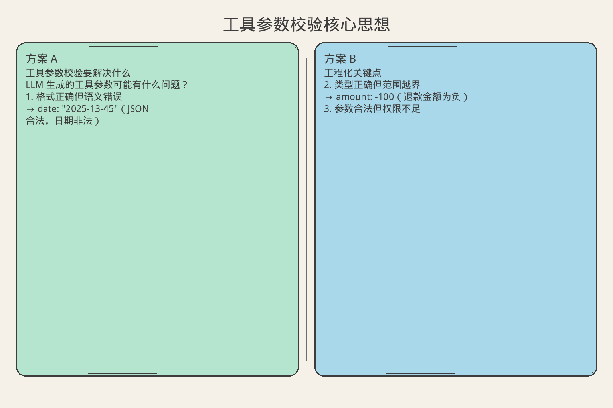
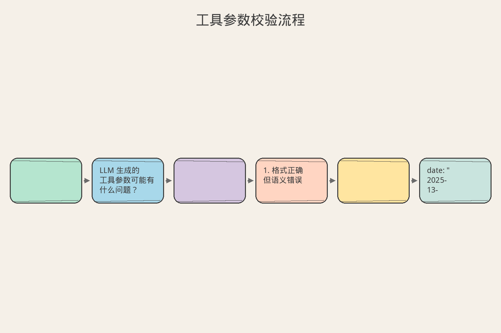
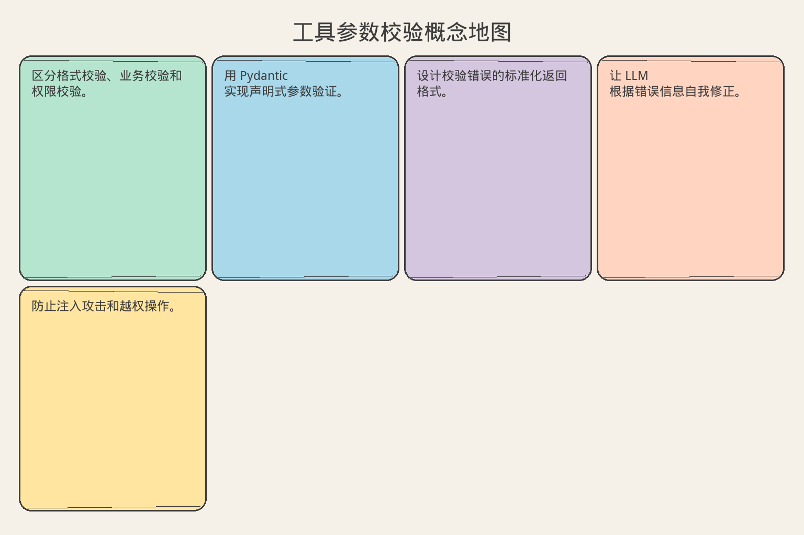

# AI Agent 工程（七）：工具参数校验

> 模型输出通过 JSON 解析，只能说明格式像 JSON；通过 schema，只能说明字段形状正确。真正可执行前，还需要业务、权限和状态校验。

**阅读建议：** 先阅读 [219 Tool Schema 设计](219.tool-schema-design-tutorial.md)，理解 schema 如何定义参数约束。

**环境要求：**
- Python **3.10+**
- 依赖：`pip install pydantic`

---

## 目录

1. [你会学到什么](#你会学到什么)
2. [它解决什么问题](#它解决什么问题)
3. [三层校验模型](#三层校验模型)
4. [最小示例](#最小示例)
5. [工程化版本](#工程化版本)
6. [常见失败模式](#常见失败模式)
7. [什么时候不要这么做](#什么时候不要这么做)
8. [生产环境注意事项](#生产环境注意事项)
9. [如何观测和评测](#如何观测和评测)
10. [和 RAG / 后端 / 前端的关系](#和-rag--后端--前端的关系)
11. [面试怎么讲](#面试怎么讲)
12. [下一步](#下一步)

## 你会学到什么

- 区分格式校验、业务校验和权限校验。
- 用 Pydantic 实现声明式参数验证。
- 设计校验错误的标准化返回格式。
- 让 LLM 根据错误信息自我修正。
- 防止注入攻击和越权操作。

## 它解决什么问题


读下图时，先看「工具参数校验核心思想」建立直觉。


```text
LLM 生成的工具参数可能有什么问题？

1. 格式正确但语义错误
   → date: "2025-13-45"（JSON 合法，日期非法）

2. 类型正确但范围越界
   → amount: -100（退款金额为负）

3. 参数合法但权限不足
   → user_id: "admin"（普通用户查管理员数据）

4. 参数合法但状态不允许
   → cancel_order(已发货的订单)

5. 恶意注入
   → query: "'; DROP TABLE users; --"

仅靠 JSON Schema 只能解决第 1 层
完整校验需要三层防线
```

## 三层校验模型

```text
┌─────────────────────────────────────────────┐
│  Layer 3: 权限 & 状态校验                    │
│  - 调用者是否有权执行此操作？                  │
│  - 目标对象当前状态是否允许此操作？            │
│  - 是否触发审批流程？                         │
├─────────────────────────────────────────────┤
│  Layer 2: 业务规则校验                       │
│  - 参数组合是否合理？                         │
│  - 是否违反业务约束？                         │
│  - 是否超出配额？                            │
├─────────────────────────────────────────────┤
│  Layer 1: 格式 & 类型校验                    │
│  - JSON 结构是否正确？                       │
│  - 字段类型是否匹配？                        │
│  - 必填字段是否存在？                         │
│  - 值是否在允许范围内？                       │
└─────────────────────────────────────────────┘

每层失败的处理策略不同：
  Layer 1 失败 → 返回格式错误，让 LLM 重新生成
  Layer 2 失败 → 返回业务错误，让 LLM 调整策略
  Layer 3 失败 → 返回权限错误，可能需要人工介入
```

## 最小示例


读下图时，先看「工具参数校验流程」建立直觉。


### Layer 1：格式校验

```python
from pydantic import BaseModel, Field, field_validator
from typing import Optional
from datetime import date


class CreateOrderParams(BaseModel):
    """创建订单参数 - 格式校验"""
    product_id: str = Field(
        ...,
        pattern=r"^PROD-\d{6}$",
        description="Product ID, format: PROD-XXXXXX",
    )
    quantity: int = Field(..., ge=1, le=100)
    shipping_date: str = Field(
        ...,
        description="Expected shipping date (YYYY-MM-DD)",
    )
    coupon_code: Optional[str] = Field(
        default=None,
        pattern=r"^[A-Z]{2}\d{4}$",
        description="Coupon code, format: XX0000",
    )

    @field_validator("shipping_date")
    @classmethod
    def validate_date(cls, v: str) -> str:
        """验证日期格式和合理性"""
        try:
            parsed = date.fromisoformat(v)
        except ValueError:
            raise ValueError(f"Invalid date format: {v}. Use YYYY-MM-DD")
        if parsed < date.today():
            raise ValueError("Shipping date cannot be in the past")
        return v


# 测试
try:
    params = CreateOrderParams(
        product_id="PROD-001234",
        quantity=2,
        shipping_date="2025-02-01",
    )
    print("✓ Validation passed:", params.model_dump())
except Exception as e:
    print("✗ Validation failed:", e)
```

### Layer 2：业务规则校验

```python
from dataclasses import dataclass


@dataclass
class ValidationResult:
    """校验结果"""
    valid: bool
    errors: list[str]
    warnings: list[str]


class BusinessValidator:
    """业务规则校验器"""

    def __init__(self):
        self.rules: list[callable] = []

    def rule(self, func):
        """注册业务规则"""
        self.rules.append(func)
        return func

    def validate(self, params: dict, context: dict) -> ValidationResult:
        errors = []
        warnings = []
        for rule_func in self.rules:
            result = rule_func(params, context)
            if result:
                if result.startswith("WARN:"):
                    warnings.append(result[5:])
                else:
                    errors.append(result)
        return ValidationResult(
            valid=len(errors) == 0,
            errors=errors,
            warnings=warnings,
        )


# 注册业务规则
order_validator = BusinessValidator()


@order_validator.rule
def check_stock(params: dict, context: dict) -> str | None:
    """检查库存"""
    product_id = params.get("product_id")
    quantity = params.get("quantity", 1)
    stock = context.get("stock", {}).get(product_id, 0)
    if quantity > stock:
        return f"Insufficient stock: requested {quantity}, available {stock}"
    return None


@order_validator.rule
def check_order_limit(params: dict, context: dict) -> str | None:
    """检查用户订单限制"""
    user_orders_today = context.get("user_orders_today", 0)
    if user_orders_today >= 10:
        return "Daily order limit reached (max 10 orders per day)"
    return None


@order_validator.rule
def check_coupon_validity(params: dict, context: dict) -> str | None:
    """检查优惠券有效性"""
    coupon = params.get("coupon_code")
    if not coupon:
        return None
    valid_coupons = context.get("valid_coupons", [])
    if coupon not in valid_coupons:
        return f"Invalid or expired coupon code: {coupon}"
    return None


@order_validator.rule
def check_amount_sanity(params: dict, context: dict) -> str | None:
    """检查金额合理性"""
    quantity = params.get("quantity", 1)
    unit_price = context.get("unit_price", 0)
    total = quantity * unit_price
    if total > 100000:
        return "WARN: Order amount exceeds 100,000 CNY, may need approval"
    return None
```

### Layer 3：权限校验

```python
from enum import Enum


class Permission(str, Enum):
    CREATE_ORDER = "order:create"
    CANCEL_ORDER = "order:cancel"
    VIEW_ALL_ORDERS = "order:view_all"
    REFUND = "payment:refund"
    ADMIN = "admin:*"


class PermissionValidator:
    """权限校验器"""

    def __init__(self):
        self._role_permissions: dict[str, set[Permission]] = {
            "customer": {
                Permission.CREATE_ORDER,
                Permission.CANCEL_ORDER,
            },
            "support_agent": {
                Permission.CREATE_ORDER,
                Permission.CANCEL_ORDER,
                Permission.VIEW_ALL_ORDERS,
                Permission.REFUND,
            },
            "admin": set(Permission),
        }

    def check(
        self, role: str, required: Permission, target_owner: str | None = None,
        caller_id: str | None = None
    ) -> ValidationResult:
        """检查权限"""
        errors = []

        # 1. 角色权限检查
        perms = self._role_permissions.get(role, set())
        if Permission.ADMIN not in perms and required not in perms:
            errors.append(
                f"Role '{role}' lacks permission '{required.value}'"
            )

        # 2. 资源归属检查（非管理员只能操作自己的资源）
        if target_owner and caller_id:
            if role != "admin" and target_owner != caller_id:
                errors.append(
                    f"Cannot access resource owned by '{target_owner}'"
                )

        return ValidationResult(
            valid=len(errors) == 0,
            errors=errors,
            warnings=[],
        )
```

## 工程化版本

### 统一校验管道

```python
from typing import Any
import time
import traceback


class ValidationError(Exception):
    """校验错误基类"""
    def __init__(self, layer: str, code: str, message: str,
                 suggestion: str = ""):
        self.layer = layer
        self.code = code
        self.message = message
        self.suggestion = suggestion
        super().__init__(message)


class ValidationPipeline:
    """三层校验管道"""

    def __init__(
        self,
        schema_model: type[BaseModel],
        business_validator: BusinessValidator | None = None,
        permission_validator: PermissionValidator | None = None,
    ):
        self.schema_model = schema_model
        self.business_validator = business_validator
        self.permission_validator = permission_validator

    def validate(
        self,
        raw_params: dict,
        context: dict | None = None,
    ) -> tuple[Any, ValidationResult]:
        """
        执行完整校验流程
        返回: (parsed_params, validation_result)
        """
        context = context or {}
        all_errors = []
        all_warnings = []

        # Layer 1: 格式校验
        try:
            parsed = self.schema_model(**raw_params)
        except Exception as e:
            return None, ValidationResult(
                valid=False,
                errors=[f"[Format] {e}"],
                warnings=[],
            )

        # Layer 2: 业务校验
        if self.business_validator:
            result = self.business_validator.validate(
                parsed.model_dump(), context
            )
            all_errors.extend(f"[Business] {e}" for e in result.errors)
            all_warnings.extend(result.warnings)

        # Layer 3: 权限校验
        if self.permission_validator:
            required_perm = context.get("required_permission")
            if required_perm:
                result = self.permission_validator.check(
                    role=context.get("caller_role", "customer"),
                    required=required_perm,
                    target_owner=context.get("resource_owner"),
                    caller_id=context.get("caller_id"),
                )
                all_errors.extend(f"[Permission] {e}" for e in result.errors)

        return parsed, ValidationResult(
            valid=len(all_errors) == 0,
            errors=all_errors,
            warnings=all_warnings,
        )
```

### 校验错误的 LLM 友好格式

```python
class ErrorFormatter:
    """将校验错误格式化为 LLM 可理解的反馈"""

    @staticmethod
    def format_for_llm(result: ValidationResult) -> str:
        """生成 LLM 友好的错误消息"""
        if result.valid:
            return "OK"

        lines = ["Tool call rejected. Please fix the following issues:"]
        lines.append("")

        for i, error in enumerate(result.errors, 1):
            lines.append(f"{i}. {error}")

        if result.warnings:
            lines.append("")
            lines.append("Warnings (non-blocking):")
            for w in result.warnings:
                lines.append(f"  - {w}")

        lines.append("")
        lines.append("Please correct the parameters and try again.")
        return "\n".join(lines)

    @staticmethod
    def format_for_log(result: ValidationResult, tool_name: str,
                       params: dict) -> dict:
        """生成日志格式的错误记录"""
        return {
            "tool": tool_name,
            "valid": result.valid,
            "errors": result.errors,
            "warnings": result.warnings,
            "params_hash": hash(str(sorted(params.items()))),
            "timestamp": time.time(),
        }
```

### 自修正循环

```python
class SelfCorrectingExecutor:
    """带自修正的工具执行器"""

    MAX_RETRIES = 3

    def __init__(self, pipeline: ValidationPipeline):
        self.pipeline = pipeline
        self.formatter = ErrorFormatter()

    async def execute_with_correction(
        self,
        tool_name: str,
        raw_params: dict,
        context: dict,
        llm_call: callable,  # 调用 LLM 的函数
    ) -> dict:
        """执行工具，校验失败时让 LLM 自修正"""
        attempts = []

        for attempt in range(self.MAX_RETRIES):
            # 校验
            parsed, result = self.pipeline.validate(raw_params, context)

            if result.valid:
                return {
                    "status": "success",
                    "params": parsed.model_dump() if parsed else {},
                    "attempts": attempt + 1,
                }

            # 记录失败
            attempts.append({
                "attempt": attempt + 1,
                "params": raw_params,
                "errors": result.errors,
            })

            # 最后一次不再重试
            if attempt == self.MAX_RETRIES - 1:
                break

            # 让 LLM 修正
            error_msg = self.formatter.format_for_llm(result)
            correction_prompt = (
                f"Your previous tool call to '{tool_name}' was rejected.\n"
                f"Original parameters: {raw_params}\n"
                f"Error:\n{error_msg}\n\n"
                f"Please provide corrected parameters as JSON."
            )

            # 调用 LLM 获取修正后的参数
            corrected = await llm_call(correction_prompt)
            raw_params = corrected  # 假设返回 dict

        return {
            "status": "failed",
            "error": "Max correction attempts reached",
            "attempts": attempts,
        }
```

## 常见失败模式

### 1. 校验太严格

```text
症状：
  LLM 反复被拒绝，最终放弃调用

原因：
  正则表达式太严格
  例：要求 "ORD-\d{8}" 但 LLM 生成 "ord-12345678"

解决：
  校验前做 normalize（大小写、空格）
  错误消息中给出正确格式示例
  考虑模糊匹配 + 确认
```

### 2. 错误消息不具体

```text
症状：
  LLM 收到 "Invalid parameters" 后随机修改

原因：
  错误消息没有指出哪个字段、什么问题、怎么修

解决：
  错误消息必须包含：
  - 哪个字段出错
  - 当前值是什么
  - 期望的格式/范围
  - 修正示例
```

### 3. 校验逻辑分散

```text
症状：
  同一个参数在 3 个地方校验，规则不一致

原因：
  格式校验在 handler 里
  业务校验在 service 里
  权限校验在 middleware 里

解决：
  统一校验管道（ValidationPipeline）
  所有规则集中管理
  一处修改，全局生效
```

### 4. 忽略参数组合

```text
症状：
  单个参数都合法，组合起来不合理

原因：
  只校验单字段，不校验字段间关系
  例：start_date > end_date

解决：
  用 Pydantic 的 model_validator 做跨字段校验
  或在 BusinessValidator 中添加组合规则
```

### 5. 没有防注入

```text
症状：
  工具参数被注入恶意内容

原因：
  字符串参数直接拼接到 SQL/命令中

解决：
  所有字符串参数做 sanitize
  使用参数化查询
  限制特殊字符
  对文件路径做 canonicalize + 白名单
```

## 什么时候不要这么做

```text
不需要完整三层校验的场景：

1. 只读查询工具
   → 权限校验可以简化（只要能读就行）
   → 业务校验可以省略

2. 内部调试工具
   → 格式校验即可
   → 不需要防注入（可信环境）

3. 参数由代码生成（非 LLM）
   → 格式校验可以省略（代码保证正确）
   → 只需业务和权限校验

4. 原型阶段
   → 先做 Layer 1
   → 上线前补 Layer 2 和 3
```

## 生产环境注意事项

### 跨字段校验

```python
class DateRangeParams(BaseModel):
    """日期范围参数 - 跨字段校验示例"""
    start_date: str = Field(..., description="Start date (YYYY-MM-DD)")
    end_date: str = Field(..., description="End date (YYYY-MM-DD)")
    max_days: int = Field(default=30, description="Max range in days")

    @field_validator("start_date", "end_date")
    @classmethod
    def validate_date_format(cls, v: str) -> str:
        try:
            date.fromisoformat(v)
        except ValueError:
            raise ValueError(f"Invalid date: {v}. Use YYYY-MM-DD")
        return v

    def model_post_init(self, __context) -> None:
        """跨字段校验"""
        start = date.fromisoformat(self.start_date)
        end = date.fromisoformat(self.end_date)
        if start > end:
            raise ValueError(
                f"start_date ({self.start_date}) must be before "
                f"end_date ({self.end_date})"
            )
        delta = (end - start).days
        if delta > self.max_days:
            raise ValueError(
                f"Date range too large: {delta} days (max {self.max_days})"
            )
```

### 防注入校验

```python
import re


class InjectionGuard:
    """防注入校验器"""

    # SQL 注入模式
    SQL_PATTERNS = [
        re.compile(r"(\b(SELECT|INSERT|UPDATE|DELETE|DROP|UNION)\b)", re.I),
        re.compile(r"(--|;|/\*)"),
        re.compile(r"(\bOR\b\s+\d+\s*=\s*\d+)", re.I),
    ]

    # 命令注入模式
    CMD_PATTERNS = [
        re.compile(r"[;&|`]"),
        re.compile(r"\$\("),
        re.compile(r"(\b(rm|del|format|shutdown|reboot)\b)", re.I),
    ]

    # 路径遍历模式
    PATH_PATTERNS = [
        re.compile(r"\.\./"),
        re.compile(r"\.\.\\"),
        re.compile(r"^/etc/"),
        re.compile(r"^C:\\Windows", re.I),
    ]

    @classmethod
    def check_string(cls, value: str, field_name: str) -> list[str]:
        """检查字符串是否包含注入模式"""
        issues = []

        for pattern in cls.SQL_PATTERNS:
            if pattern.search(value):
                issues.append(
                    f"Field '{field_name}': possible SQL injection detected"
                )
                break

        for pattern in cls.CMD_PATTERNS:
            if pattern.search(value):
                issues.append(
                    f"Field '{field_name}': possible command injection"
                )
                break

        for pattern in cls.PATH_PATTERNS:
            if pattern.search(value):
                issues.append(
                    f"Field '{field_name}': possible path traversal"
                )
                break

        return issues

    @classmethod
    def check_dict(cls, data: dict) -> list[str]:
        """递归检查字典中所有字符串"""
        issues = []
        for key, value in data.items():
            if isinstance(value, str):
                issues.extend(cls.check_string(value, key))
            elif isinstance(value, dict):
                issues.extend(cls.check_dict(value))
            elif isinstance(value, list):
                for i, item in enumerate(value):
                    if isinstance(item, str):
                        issues.extend(
                            cls.check_string(item, f"{key}[{i}]")
                        )
        return issues
```

### 配额和限流校验

```python
class QuotaValidator:
    """配额校验器"""

    def __init__(self):
        self._usage: dict[str, dict[str, int]] = {}
        self._limits: dict[str, dict[str, int]] = {}

    def set_limit(self, role: str, tool_name: str, max_per_day: int):
        if role not in self._limits:
            self._limits[role] = {}
        self._limits[role][tool_name] = max_per_day

    def check(self, role: str, tool_name: str) -> ValidationResult:
        limit = self._limits.get(role, {}).get(tool_name)
        if limit is None:
            return ValidationResult(valid=True, errors=[], warnings=[])

        usage = self._usage.get(role, {}).get(tool_name, 0)
        if usage >= limit:
            return ValidationResult(
                valid=False,
                errors=[
                    f"Daily quota exceeded for '{tool_name}': "
                    f"{usage}/{limit} calls used"
                ],
                warnings=[],
            )

        # 接近限额时警告
        warnings = []
        if usage >= limit * 0.8:
            warnings.append(
                f"Approaching daily quota for '{tool_name}': "
                f"{usage}/{limit}"
            )

        return ValidationResult(valid=True, errors=[], warnings=warnings)

    def record_usage(self, role: str, tool_name: str):
        if role not in self._usage:
            self._usage[role] = {}
        self._usage[role][tool_name] = \
            self._usage[role].get(tool_name, 0) + 1
```

## 如何观测和评测

### 校验指标

```python
@dataclass
class ValidationMetrics:
    """校验指标收集"""
    total_calls: int = 0
    layer1_failures: int = 0
    layer2_failures: int = 0
    layer3_failures: int = 0
    self_correction_success: int = 0
    self_correction_failed: int = 0
    avg_correction_attempts: float = 0.0

    @property
    def pass_rate(self) -> float:
        if self.total_calls == 0:
            return 0.0
        passed = (self.total_calls - self.layer1_failures
                  - self.layer2_failures - self.layer3_failures)
        return passed / self.total_calls

    def summary(self) -> dict:
        return {
            "total_calls": self.total_calls,
            "pass_rate": f"{self.pass_rate:.1%}",
            "layer1_failures": self.layer1_failures,
            "layer2_failures": self.layer2_failures,
            "layer3_failures": self.layer3_failures,
            "correction_success_rate": (
                f"{self.self_correction_success / max(1, self.self_correction_success + self.self_correction_failed):.1%}"
            ),
        }
```

### 校验规则覆盖率

```text
评估校验完整性的检查清单：

□ 所有字符串字段有 maxLength
□ 所有数字字段有 min/max
□ 所有日期字段有格式校验
□ 所有枚举字段用 enum 约束
□ 所有 ID 字段有格式正则
□ 跨字段关系有 model_validator
□ 危险操作有 confirm 参数
□ 字符串参数过 InjectionGuard
□ 文件路径有白名单
□ 金额字段有合理范围
□ 分页参数有上限
□ 权限校验覆盖所有写操作
```

## 和 RAG / 后端 / 前端的关系

```text
参数校验在系统中的位置：

RAG 管道：
  检索工具的 query 参数需要防注入
  top_k 参数需要范围限制（防止拉取过多数据）
  filter 参数需要白名单（防止越权访问）

后端 API：
  Tool 参数校验 ≠ API 参数校验
  Tool 层：面向 LLM，错误消息要 LLM 友好
  API 层：面向前端，错误消息要人类友好
  两层校验独立，不互相依赖

前端展示：
  校验错误可以展示给用户
  让用户知道 Agent 为什么拒绝了操作
  提供手动修正的入口
```

## 面试怎么讲

```text
面试官：你怎么处理 LLM 生成的工具参数？

回答框架（2 分钟）：

"我用三层校验模型：

 Layer 1 - 格式校验：
  用 Pydantic 做类型、范围、格式验证。
  这一层拦截 80% 的错误。

 Layer 2 - 业务校验：
  检查参数组合是否合理、是否违反业务规则。
  例：退款金额不能超过订单金额。

 Layer 3 - 权限校验：
  检查调用者是否有权操作目标资源。
  防止越权和注入攻击。

 关键设计：
 - 错误消息对 LLM 友好，包含修正建议
 - 支持自修正循环（最多 3 次）
 - 所有校验走统一管道，规则集中管理

 实际效果：
 工具调用成功率从 75% 提升到 96%，
 安全事故为零。"

追问 1：LLM 反复修正失败怎么办？
  → 3 次后停止，返回友好错误给用户。
    记录日志，分析是 Schema 设计问题还是 LLM 能力问题。

追问 2：怎么防止注入？
  → 多层防御：正则检测 + 参数化查询 + 白名单。
    所有字符串过 InjectionGuard。
    文件路径 canonicalize 后检查前缀。

追问 3：校验规则怎么维护？
  → 声明式定义（Pydantic + 规则注册器）。
    CI 中跑覆盖率检查。
    新工具上线前必须通过校验审查。
```

## 完整示例：订单取消校验流程

```python
class CancelOrderParams(BaseModel):
    """取消订单参数"""
    order_id: str = Field(
        ...,
        pattern=r"^ORD-\d{8}$",
        description="Order ID to cancel",
    )
    reason: str = Field(
        ...,
        min_length=5,
        max_length=200,
        description="Reason for cancellation",
    )
    confirm: bool = Field(
        ...,
        description="Must be true to confirm",
    )


class CancelOrderValidator:
    """取消订单的完整校验器"""

    def __init__(self):
        self.pipeline = ValidationPipeline(
            schema_model=CancelOrderParams,
            business_validator=self._build_business_rules(),
            permission_validator=PermissionValidator(),
        )

    def _build_business_rules(self) -> BusinessValidator:
        validator = BusinessValidator()

        @validator.rule
        def check_confirm(params: dict, ctx: dict) -> str | None:
            if not params.get("confirm"):
                return "Field 'confirm' must be true to proceed"
            return None

        @validator.rule
        def check_order_status(params: dict, ctx: dict) -> str | None:
            order = ctx.get("order", {})
            status = order.get("status")
            if status == "shipped":
                return (
                    f"Order {params['order_id']} already shipped. "
                    "Cannot cancel. Use 'create_return' instead."
                )
            if status == "delivered":
                return (
                    f"Order {params['order_id']} already delivered. "
                    "Use 'create_refund' instead."
                )
            if status == "cancelled":
                return f"Order {params['order_id']} is already cancelled"
            return None

        @validator.rule
        def check_cancel_window(params: dict, ctx: dict) -> str | None:
            order = ctx.get("order", {})
            created_at = order.get("created_at")
            if created_at:
                hours_since = (time.time() - created_at) / 3600
                if hours_since > 24:
                    return (
                        "Order created more than 24h ago. "
                        "Cancellation requires manual approval."
                    )
            return None

        return validator

    def validate(self, raw_params: dict, context: dict) -> tuple:
        return self.pipeline.validate(raw_params, context)


# 使用示例
async def handle_cancel_order(raw_params: dict, user_context: dict):
    """处理取消订单请求"""
    validator = CancelOrderValidator()

    # 构建上下文
    context = {
        "order": await get_order_from_db(raw_params.get("order_id")),
        "caller_role": user_context["role"],
        "caller_id": user_context["user_id"],
        "resource_owner": user_context["user_id"],
        "required_permission": Permission.CANCEL_ORDER,
    }

    # 执行校验
    parsed, result = validator.validate(raw_params, context)

    if not result.valid:
        # 返回 LLM 友好的错误
        return ErrorFormatter.format_for_llm(result)

    # 校验通过，执行取消
    await cancel_order_in_db(parsed.order_id, parsed.reason)
    return f"Order {parsed.order_id} cancelled successfully"
```

### 校验规则的测试

```python
import pytest


class TestCancelOrderValidation:
    """取消订单校验的测试"""

    def setup_method(self):
        self.validator = CancelOrderValidator()

    def test_valid_cancellation(self):
        """正常取消"""
        params = {
            "order_id": "ORD-20250101",
            "reason": "Changed my mind",
            "confirm": True,
        }
        context = {
            "order": {"status": "pending", "created_at": time.time()},
            "caller_role": "customer",
            "caller_id": "user1",
            "resource_owner": "user1",
            "required_permission": Permission.CANCEL_ORDER,
        }
        _, result = self.validator.validate(params, context)
        assert result.valid

    def test_shipped_order_rejected(self):
        """已发货订单不能取消"""
        params = {
            "order_id": "ORD-20250101",
            "reason": "Too slow",
            "confirm": True,
        }
        context = {
            "order": {"status": "shipped"},
            "caller_role": "customer",
            "caller_id": "user1",
            "resource_owner": "user1",
            "required_permission": Permission.CANCEL_ORDER,
        }
        _, result = self.validator.validate(params, context)
        assert not result.valid
        assert "shipped" in result.errors[0].lower()

    def test_invalid_order_id_format(self):
        """订单 ID 格式错误"""
        params = {
            "order_id": "12345",  # 错误格式
            "reason": "Test",
            "confirm": True,
        }
        _, result = self.validator.validate(params, {})
        assert not result.valid
        assert "Format" in result.errors[0]

    def test_missing_confirm(self):
        """缺少确认参数"""
        params = {
            "order_id": "ORD-20250101",
            "reason": "Test reason",
            "confirm": False,
        }
        context = {
            "order": {"status": "pending", "created_at": time.time()},
            "caller_role": "customer",
            "caller_id": "user1",
            "resource_owner": "user1",
            "required_permission": Permission.CANCEL_ORDER,
        }
        _, result = self.validator.validate(params, context)
        assert not result.valid

    def test_permission_denied(self):
        """权限不足"""
        params = {
            "order_id": "ORD-20250101",
            "reason": "Test reason",
            "confirm": True,
        }
        context = {
            "order": {"status": "pending", "created_at": time.time()},
            "caller_role": "customer",
            "caller_id": "user1",
            "resource_owner": "user2",  # 别人的订单
            "required_permission": Permission.CANCEL_ORDER,
        }
        _, result = self.validator.validate(params, context)
        assert not result.valid
        assert "Permission" in result.errors[0]
```

## 下一步


读下图时，先看「工具参数校验概念地图」建立直觉。


下一篇 [221 工具结果标准化](221.tool-result-normalization-tutorial.md) 会讨论如何将不同工具的返回值统一为 LLM 可理解的标准格式。
