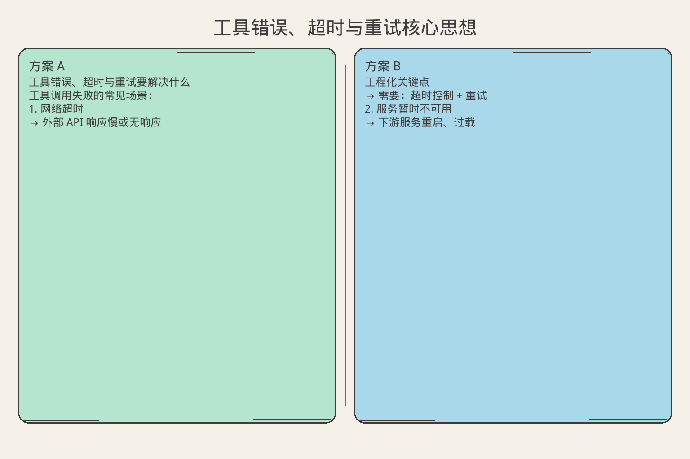
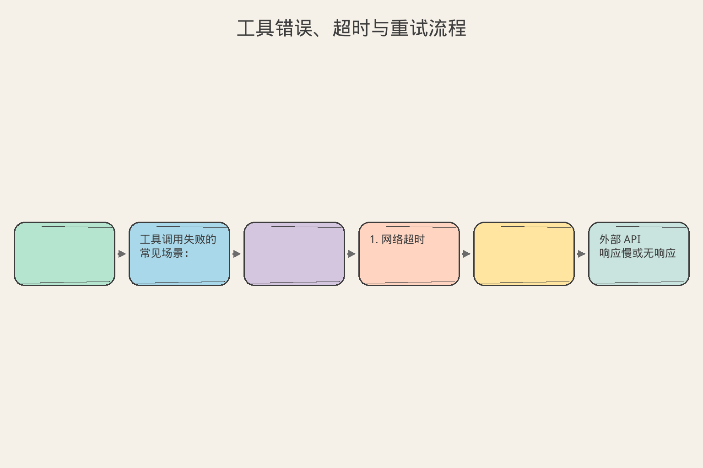

# AI Agent 工程（九）：工具错误、超时与重试

> 工具调用失败不是异常，而是常态。网络抖动、服务降级、参数漂移——Agent 必须像经验丰富的工程师一样处理失败：知道什么时候重试、什么时候降级、什么时候放弃。

**阅读建议：** 先阅读 [221 工具结果标准化](221.tool-result-normalization-tutorial.md)，理解标准错误格式。

**环境要求：**
- Python **3.10+**
- 无需安装第三方库


**档位：** 主线篇（Part 2）
**本文边界：** 前驱篇 [221](221.tool-result-normalization-tutorial.md) 标准返回。本篇超时/退避/熔断/降级。不讲 K8s 网络排障。接续 [223](223.idempotent-agent-tools-tutorial.md)。
**动手路径：** ① 读超时/退避配置 → ② 运行 `demo_retry()` → ③ 模拟慢工具触发熔断

### 核心术语（本篇首次出现）
**Tool Calling**（工具调用）：模型输出结构化函数名与参数。
通俗说：像给助理一张办事清单，写明「去办哪件事、带什么材料」。
**幂等**（Idempotency）：同一请求执行多次与一次效果相同。
通俗说：重复点「提交」不会重复扣款。
**熔断器**（Circuit Breaker）：连续失败后暂时拒绝调用，给下游恢复时间。
通俗说：连续失败后暂时拒绝调用。
---

## 目录

1. [你会学到什么](#你会学到什么)
2. [它解决什么问题](#它解决什么问题)
3. [错误分类体系](#错误分类体系)
4. [最小示例](#最小示例)
5. [工程化版本](#工程化版本)
6. [常见失败模式](#常见失败模式)
7. [什么时候不要这么做](#什么时候不要这么做)
8. [生产环境注意事项](#生产环境注意事项)
9. [如何观测和评测](#如何观测和评测)
10. [和 RAG / 后端 / 前端的关系](#和-rag--后端--前端的关系)
11. [面试怎么讲](#面试怎么讲)
12. [下一步](#下一步)

## 你会学到什么

- 区分可重试错误和不可重试错误。
- 实现指数退避重试策略。
- 设计工具超时和熔断机制。
- 让 Agent 在工具失败时优雅降级。
- 用 Circuit Breaker 防止级联故障。

## 它解决什么问题


读下图时，先看「工具错误、超时与重试核心思想」建立直觉。


对照上图：超时+退避+熔断+降级——工具失败要可恢复，不能把整个 Agent 吊死。

读下图时，先看能力边界与痛点流程——与 §最小示例 代码互补，不是逐步对照。


对照上图：超时、退避、熔断、降级是工具链四件套——没有它们，一次慢调用会拖死整个循环。
```text
工具调用失败的常见场景：

1. 网络超时
   → 外部 API 响应慢或无响应
   → 需要：超时控制 + 重试

2. 服务暂时不可用
   → 下游服务重启、过载
   → 需要：退避重试 + 熔断

3. 参数错误
   → LLM 生成了非法参数
   → 需要：返回错误让 LLM 修正

4. 权限不足
   → 用户无权执行此操作
   → 需要：明确拒绝，不重试

5. 业务规则违反
   → 库存不足、余额不够
   → 需要：告知原因，建议替代方案

没有容错设计时：
  一个工具超时 → 整个 Agent 循环卡死
  一个服务挂了 → 所有请求失败
  重试风暴 → 压垮下游服务
```

## 错误分类体系

```text
错误分类决定处理策略：

┌─────────────────────────────────────────────────────┐
│  可重试 (Retryable)                                  │
│  ├── 超时 (TIMEOUT)          → 指数退避重试          │
│  ├── 限流 (RATE_LIMITED)     → 等待后重试            │
│  ├── 服务不可用 (UNAVAILABLE) → 退避重试 + 熔断      │
│  └── 网络错误 (NETWORK)      → 快速重试 1-2 次       │
├─────────────────────────────────────────────────────┤
│  不可重试 (Non-retryable)                            │
│  ├── 参数错误 (INVALID_INPUT) → 返回给 LLM 修正      │
│  ├── 权限不足 (FORBIDDEN)     → 拒绝 + 告知原因      │
│  ├── 资源不存在 (NOT_FOUND)   → 告知 + 建议替代      │
│  └── 业务冲突 (CONFLICT)      → 告知状态 + 建议      │
├─────────────────────────────────────────────────────┤
│  致命错误 (Fatal)                                    │
│  ├── 配置错误 (MISCONFIGURED) → 停止 + 告警          │
│  └── 内部错误 (INTERNAL)      → 停止 + 记录          │
└─────────────────────────────────────────────────────┘

核心原则：
  可重试 → 自动处理，不打扰 LLM
  不可重试 → 返回给 LLM，让它决策
  致命 → 停止执行，通知人类
```

## 最小示例

**演示什么：** 本节最小可运行切片。**环境：** 见文首。**预期：** 控制台打印 demo 输出。

### 基础重试

```python
import asyncio
import time
from dataclasses import dataclass
from enum import Enum
from typing import Any, Callable


class ErrorCategory(str, Enum):
    RETRYABLE = "retryable"
    NON_RETRYABLE = "non_retryable"
    FATAL = "fatal"


@dataclass
class ToolCallError:
    """工具调用错误"""
    category: ErrorCategory
    code: str
    message: str
    suggestion: str = ""
    retry_after_seconds: float = 0


class RetryPolicy:
    """重试策略"""

    def __init__(
        self,
        max_retries: int = 3,
        base_delay: float = 1.0,
        max_delay: float = 30.0,
        backoff_factor: float = 2.0,
    ):
        self.max_retries = max_retries
        self.base_delay = base_delay
        self.max_delay = max_delay
        self.backoff_factor = backoff_factor

    def get_delay(self, attempt: int) -> float:
        """计算第 N 次重试的等待时间"""
        delay = self.base_delay * (self.backoff_factor ** attempt)
        return min(delay, self.max_delay)

    def should_retry(self, attempt: int, error: ToolCallError) -> bool:
        """判断是否应该重试"""
        if error.category != ErrorCategory.RETRYABLE:
            return False
        return attempt < self.max_retries


async def execute_with_retry(
    func: Callable,
    params: dict,
    policy: RetryPolicy | None = None,
) -> Any:
    """带重试的工具执行"""
    policy = policy or RetryPolicy()
    last_error = None

    for attempt in range(policy.max_retries + 1):
        try:
            result = await func(**params)
            return result
        except TimeoutError as e:
            last_error = ToolCallError(
                category=ErrorCategory.RETRYABLE,
                code="TIMEOUT",
                message=str(e),
                suggestion="The operation timed out. Retrying...",
            )
        except ConnectionError as e:
            last_error = ToolCallError(
                category=ErrorCategory.RETRYABLE,
                code="NETWORK_ERROR",
                message=str(e),
                suggestion="Network issue detected. Retrying...",
            )
        except ValueError as e:
            # 参数错误不重试
            return ToolCallError(
                category=ErrorCategory.NON_RETRYABLE,
                code="INVALID_INPUT",
                message=str(e),
                suggestion="Check parameter format and values",
            )

        # 判断是否重试
        if not policy.should_retry(attempt, last_error):
            break

        delay = policy.get_delay(attempt)
        await asyncio.sleep(delay)

    return last_error
```

### 超时控制

```python
class TimeoutExecutor:
    """带超时的工具执行器"""

    DEFAULT_TIMEOUT = 30.0  # 秒

    def __init__(self):
        self._timeouts: dict[str, float] = {}

    def set_timeout(self, tool_name: str, seconds: float):
        """设置工具超时"""
        self._timeouts[tool_name] = seconds

    async def execute(
        self, tool_name: str, func: Callable, params: dict
    ) -> Any:
        """在超时限制内执行工具"""
        timeout = self._timeouts.get(tool_name, self.DEFAULT_TIMEOUT)

        try:
            result = await asyncio.wait_for(
                func(**params),
                timeout=timeout,
            )
            return result
        except asyncio.TimeoutError:
            raise TimeoutError(
                f"Tool '{tool_name}' exceeded {timeout}s timeout"
            )
```

## 工程化版本

### Circuit Breaker（熔断器）

```python
from enum import Enum
from collections import deque


class CircuitState(str, Enum):
    CLOSED = "closed"        # 正常：请求通过
    OPEN = "open"            # 熔断：请求拒绝
    HALF_OPEN = "half_open"  # 探测：允许少量请求


class CircuitBreaker:
    """熔断器：防止对故障服务的持续调用"""

    def __init__(
        self,
        failure_threshold: int = 5,
        recovery_timeout: float = 60.0,
        half_open_max_calls: int = 3,
    ):
        self.failure_threshold = failure_threshold
        self.recovery_timeout = recovery_timeout
        self.half_open_max_calls = half_open_max_calls

        self._state = CircuitState.CLOSED
        self._failure_count = 0
        self._success_count = 0
        self._last_failure_time: float = 0
        self._half_open_calls = 0
        self._failure_history: deque = deque(maxlen=100)

    @property
    def state(self) -> CircuitState:
        """获取当前状态（自动转换）"""
        if self._state == CircuitState.OPEN:
            # 检查是否到了恢复时间
            if time.time() - self._last_failure_time >= self.recovery_timeout:
                self._state = CircuitState.HALF_OPEN
                self._half_open_calls = 0
                self._success_count = 0
        return self._state

    def can_execute(self) -> bool:
        """是否允许执行"""
        state = self.state
        if state == CircuitState.CLOSED:
            return True
        if state == CircuitState.HALF_OPEN:
            return self._half_open_calls < self.half_open_max_calls
        return False  # OPEN

    def record_success(self):
        """记录成功"""
        if self._state == CircuitState.HALF_OPEN:
            self._success_count += 1
            if self._success_count >= self.half_open_max_calls:
                self._state = CircuitState.CLOSED
                self._failure_count = 0
        else:
            self._failure_count = max(0, self._failure_count - 1)

    def record_failure(self):
        """记录失败"""
        self._failure_count += 1
        self._last_failure_time = time.time()
        self._failure_history.append(time.time())

        if self._state == CircuitState.HALF_OPEN:
            # 探测失败，重新熔断
            self._state = CircuitState.OPEN
        elif self._failure_count >= self.failure_threshold:
            self._state = CircuitState.OPEN

    def get_stats(self) -> dict:
        return {
            "state": self.state.value,
            "failure_count": self._failure_count,
            "last_failure": self._last_failure_time,
            "recent_failures": len(self._failure_history),
        }
```

### 降级策略

```python
class FallbackStrategy:
    """工具降级策略"""

    def __init__(self):
        self._fallbacks: dict[str, list[Callable]] = {}
        self._default_responses: dict[str, Any] = {}

    def register_fallback(self, tool_name: str, fallback: Callable):
        """注册降级方案"""
        if tool_name not in self._fallbacks:
            self._fallbacks[tool_name] = []
        self._fallbacks[tool_name].append(fallback)

    def register_default(self, tool_name: str, default_response: Any):
        """注册默认响应"""
        self._default_responses[tool_name] = default_response

    async def execute_with_fallback(
        self, tool_name: str, func: Callable, params: dict
    ) -> tuple[Any, str]:
        """执行工具，失败时尝试降级"""
        # 1. 尝试主工具
        try:
            result = await func(**params)
            return result, "primary"
        except Exception:
            pass

        # 2. 尝试降级方案
        fallbacks = self._fallbacks.get(tool_name, [])
        for i, fallback in enumerate(fallbacks):
            try:
                result = await fallback(**params)
                return result, f"fallback_{i}"
            except Exception:
                continue

        # 3. 返回默认响应
        if tool_name in self._default_responses:
            return self._default_responses[tool_name], "default"

        # 4. 全部失败
        raise RuntimeError(
            f"Tool '{tool_name}' and all fallbacks failed"
        )
```

### 完整容错执行器

```python
class ResilientToolExecutor:
    """容错工具执行器：超时 + 重试 + 熔断 + 降级"""

    def __init__(self):
        self._tools: dict[str, Callable] = {}
        self._retry_policies: dict[str, RetryPolicy] = {}
        self._breakers: dict[str, CircuitBreaker] = {}
        self._fallbacks = FallbackStrategy()
        self._timeout_executor = TimeoutExecutor()
        self._metrics: dict[str, dict] = {}

    def register(
        self,
        name: str,
        handler: Callable,
        timeout: float = 30.0,
        retry_policy: RetryPolicy | None = None,
        breaker: CircuitBreaker | None = None,
    ):
        self._tools[name] = handler
        self._timeout_executor.set_timeout(name, timeout)
        self._retry_policies[name] = retry_policy or RetryPolicy()
        self._breakers[name] = breaker or CircuitBreaker()
        self._metrics[name] = {
            "calls": 0, "successes": 0, "failures": 0,
            "retries": 0, "fallbacks": 0, "circuit_breaks": 0,
        }

    async def execute(self, tool_name: str, params: dict) -> dict:
        """执行工具（完整容错流程）"""
        self._metrics[tool_name]["calls"] += 1
        breaker = self._breakers[tool_name]
        policy = self._retry_policies[tool_name]
        handler = self._tools[tool_name]

        # 1. 熔断检查
        if not breaker.can_execute():
            self._metrics[tool_name]["circuit_breaks"] += 1
            # 尝试降级
            try:
                result, source = await self._fallbacks.execute_with_fallback(
                    tool_name, handler, params
                )
                self._metrics[tool_name]["fallbacks"] += 1
                return {"success": True, "data": result, "source": source}
            except RuntimeError:
                return {
                    "success": False,
                    "error": {
                        "code": "CIRCUIT_OPEN",
                        "message": f"Tool '{tool_name}' is temporarily unavailable",
                        "suggestion": "Try again in a few minutes",
                    }
                }

        # 2. 带重试的执行
        last_error = None
        for attempt in range(policy.max_retries + 1):
            try:
                result = await self._timeout_executor.execute(
                    tool_name, handler, params
                )
                breaker.record_success()
                self._metrics[tool_name]["successes"] += 1
                return {"success": True, "data": result, "source": "primary"}

            except (TimeoutError, ConnectionError) as e:
                last_error = e
                breaker.record_failure()
                self._metrics[tool_name]["retries"] += 1

                if attempt < policy.max_retries:
                    delay = policy.get_delay(attempt)
                    await asyncio.sleep(delay)

            except ValueError as e:
                # 不可重试错误
                self._metrics[tool_name]["failures"] += 1
                return {
                    "success": False,
                    "error": {
                        "code": "INVALID_INPUT",
                        "message": str(e),
                        "suggestion": "Fix parameters and retry",
                    }
                }

        # 3. 重试耗尽，尝试降级
        self._metrics[tool_name]["failures"] += 1
        try:
            result, source = await self._fallbacks.execute_with_fallback(
                tool_name, handler, params
            )
            self._metrics[tool_name]["fallbacks"] += 1
            return {"success": True, "data": result, "source": source}
        except RuntimeError:
            return {
                "success": False,
                "error": {
                    "code": "ALL_RETRIES_EXHAUSTED",
                    "message": str(last_error),
                    "suggestion": "Service unavailable. Try later.",
                    "retryable": True,
                }
            }

    def get_health_report(self) -> dict:
        """获取所有工具的健康报告"""
        report = {}
        for name in self._tools:
            report[name] = {
                **self._metrics[name],
                "circuit_state": self._breakers[name].state.value,
            }
        return report
```

## 常见失败模式

### 1. 无限重试

```text
症状：
  一个工具持续重试，占用所有资源

原因：
  没有 max_retries 限制
  或重试条件太宽泛

解决：
  必须设置 max_retries（通常 3 次）
  只对 RETRYABLE 类错误重试
  总超时 = 单次超时 × (max_retries + 1)
```

### 2. 重试风暴

```text
症状：
  服务恢复瞬间被大量重试请求压垮

原因：
  所有请求同时重试（没有 jitter）

解决：
  指数退避 + 随机抖动：
  delay = base * 2^attempt + random(0, 1)
  错开重试时间
```

### 3. 熔断不恢复

```text
症状：
  服务已恢复，但熔断器一直 OPEN

原因：
  recovery_timeout 太长
  或 HALF_OPEN 探测请求也失败

解决：
  recovery_timeout 设为 30-60 秒
  HALF_OPEN 允许 3 个探测请求
  探测成功立即关闭熔断
```

### 4. 降级数据过期

```text
症状：
  降级返回了缓存数据，但已过期

原因：
  降级用的缓存没有 TTL

解决：
  降级数据标注 "stale": true
  告知 LLM 数据可能不是最新的
  设置合理 TTL（5-15 分钟）
```

### 5. 超时设置不合理

```text
症状：
  正常操作被超时中断

原因：
  所有工具用同一个超时值
  没有考虑工具的实际耗时

解决：
  按工具类型设置不同超时：
  - 简单查询：5s
  - 复杂搜索：15s
  - 文件处理：60s
  - 外部 API：30s
```

## 什么时候不要这么做

```text
不需要完整容错的场景：

1. 本地计算工具
   → 不依赖网络，不会超时
   → 不需要重试和熔断

2. 幂等性不保证的写操作
   → 重试可能导致重复操作
   → 需要幂等设计（见 223）

3. 实时性要求极高
   → 重试会增加延迟
   → 直接失败 + 降级

4. 开发/测试环境
   → 快速失败比容错更重要
   → 方便发现问题
```

## 生产环境注意事项

### 带抖动的退避

```python
import random


class JitteredRetryPolicy(RetryPolicy):
    """带随机抖动的重试策略"""

    def get_delay(self, attempt: int) -> float:
        """指数退避 + 随机抖动"""
        base_delay = super().get_delay(attempt)
        # Full jitter: random between 0 and base_delay
        jitter = random.uniform(0, base_delay)
        return jitter


class DecorrelatedJitterPolicy(RetryPolicy):
    """去相关抖动（AWS 推荐）"""

    def __init__(self, **kwargs):
        super().__init__(**kwargs)
        self._last_delay = self.base_delay

    def get_delay(self, attempt: int) -> float:
        """去相关抖动：delay = random(base, last_delay * 3)"""
        delay = random.uniform(
            self.base_delay,
            self._last_delay * 3
        )
        delay = min(delay, self.max_delay)
        self._last_delay = delay
        return delay
```

### 超时层次

```python
class TimeoutHierarchy:
    """多层超时控制"""

    def __init__(
        self,
        tool_timeout: float = 30.0,
        retry_total_timeout: float = 90.0,
        agent_step_timeout: float = 120.0,
    ):
        self.tool_timeout = tool_timeout
        self.retry_total_timeout = retry_total_timeout
        self.agent_step_timeout = agent_step_timeout

    async def execute_within_budget(
        self, func: Callable, params: dict, policy: RetryPolicy
    ) -> Any:
        """在总时间预算内执行（含重试）"""
        start = time.time()

        for attempt in range(policy.max_retries + 1):
            elapsed = time.time() - start
            remaining = self.retry_total_timeout - elapsed

            if remaining <= 0:
                raise TimeoutError("Total retry budget exhausted")

            # 单次超时不超过剩余时间
            single_timeout = min(self.tool_timeout, remaining)

            try:
                return await asyncio.wait_for(
                    func(**params), timeout=single_timeout
                )
            except asyncio.TimeoutError:
                if attempt < policy.max_retries:
                    delay = policy.get_delay(attempt)
                    # 等待时间也不能超出预算
                    remaining_after = self.retry_total_timeout - (time.time() - start)
                    if delay > remaining_after:
                        break
                    await asyncio.sleep(delay)

        raise TimeoutError("All retries exhausted within time budget")
```

### 健康检查

```python
class ToolHealthChecker:
    """工具健康检查"""

    def __init__(self):
        self._checkers: dict[str, Callable] = {}

    def register_check(self, tool_name: str, checker: Callable):
        """注册健康检查函数"""
        self._checkers[tool_name] = checker

    async def check_all(self) -> dict[str, bool]:
        """检查所有工具健康状态"""
        results = {}
        for name, checker in self._checkers.items():
            try:
                await asyncio.wait_for(checker(), timeout=5.0)
                results[name] = True
            except Exception:
                results[name] = False
        return results

    async def check_tool(self, tool_name: str) -> bool:
        """检查单个工具"""
        checker = self._checkers.get(tool_name)
        if not checker:
            return True  # 没有检查器默认健康
        try:
            await asyncio.wait_for(checker(), timeout=5.0)
            return True
        except Exception:
            return False
```

## 如何观测和评测

### 容错指标

```text
关键监控指标：

1. 重试率
   - retries / total_calls
   - 正常 < 5%，> 20% 需要排查

2. 熔断触发率
   - circuit_breaks / total_calls
   - 正常 < 1%，> 5% 说明服务不稳定

3. 降级使用率
   - fallbacks / total_calls
   - 正常 < 2%，持续 > 10% 需要修复主路径

4. P99 延迟（含重试）
   - 反映用户实际等待时间
   - 不应超过 agent_step_timeout

5. 错误分类分布
   - retryable vs non_retryable vs fatal
   - 帮助判断是基础设施问题还是代码问题
```

### 告警规则

```text
生产告警建议：

P1（立即处理）：
  - 熔断器 OPEN 超过 5 分钟
  - 致命错误出现
  - 所有降级方案失败

P2（30 分钟内）：
  - 重试率 > 20% 持续 5 分钟
  - 降级使用率 > 10% 持续 10 分钟
  - P99 延迟 > 30s

P3（下个工作日）：
  - 重试率 > 5% 持续 1 小时
  - 单个工具错误率 > 10%
```

## 和 RAG / 后端 / 前端的关系

```text
容错设计在系统中的位置：

RAG 管道：
  向量数据库查询可能超时 → 需要重试
  Embedding API 可能限流 → 需要退避
  检索失败 → 降级为关键词搜索

后端 API：
  工具调用后端服务 → 继承后端的 SLA
  熔断器状态可以共享（Redis）
  降级数据可以来自缓存层

前端展示：
  重试过程对用户透明
  降级时告知用户"数据可能不是最新"
  熔断时展示"服务暂时不可用"
```

## 面试怎么讲

```text
面试官：工具调用失败你怎么处理？

回答框架（2 分钟）：

"我把错误分三类，不同类别不同策略：

 可重试错误（超时、网络、限流）：
  指数退避 + 随机抖动，最多 3 次。
  加熔断器防止对故障服务的持续调用。

 不可重试错误（参数、权限、业务）：
  直接返回给 LLM，附带修正建议。
  让 LLM 决定是修正参数还是换工具。

 致命错误（配置、内部）：
  停止执行，告警通知人类。

 关键设计：
 - 熔断器三态：CLOSED → OPEN → HALF_OPEN
 - 降级策略：备用工具 → 缓存数据 → 默认响应
 - 总时间预算：防止重试占用太多时间

 实际效果：
 工具可用性从 95% 提升到 99.5%，
 级联故障为零。"

追问 1：重试会不会造成重复操作？
  → 写操作需要幂等设计（下一篇 223 的主题）。
    读操作随便重试。

追问 2：熔断器的参数怎么定？
  → failure_threshold: 5 次连续失败触发
    recovery_timeout: 60 秒后探测
    half_open_max_calls: 3 个探测请求
    根据实际 SLA 调整。

追问 3：降级数据怎么保证不太旧？
  → TTL 5-15 分钟。
    标注 stale=true，LLM 知道数据可能过期。
    关键数据不降级，直接报错。
```

## 实战案例：外部 API 工具的容错设计

### 场景：天气查询工具

```python
import aiohttp


class WeatherTool:
    """天气查询工具（外部 API）"""

    API_URL = "https://api.weather.example.com/v1/forecast"
    API_KEY = "sk-xxx"

    async def query(self, city: str, days: int = 3) -> dict:
        """查询天气预报"""
        params = {
            "city": city,
            "days": days,
            "key": self.API_KEY,
        }
        async with aiohttp.ClientSession() as session:
            async with session.get(self.API_URL, params=params) as resp:
                if resp.status == 200:
                    return await resp.json()
                elif resp.status == 429:
                    raise ConnectionError("Rate limited by weather API")
                elif resp.status >= 500:
                    raise ConnectionError(f"Weather API error: {resp.status}")
                else:
                    raise ValueError(f"Invalid request: {resp.status}")


# 注册到容错执行器
def setup_weather_tool(executor: ResilientToolExecutor):
    """配置天气工具的容错策略"""
    weather = WeatherTool()

    executor.register(
        name="get_weather",
        handler=weather.query,
        timeout=10.0,  # 天气 API 应该很快
        retry_policy=JitteredRetryPolicy(
            max_retries=2,
            base_delay=1.0,
            max_delay=10.0,
        ),
        breaker=CircuitBreaker(
            failure_threshold=3,
            recovery_timeout=30.0,
        ),
    )

    # 降级：返回缓存的天气数据
    async def weather_fallback(city: str, days: int = 3) -> dict:
        return {
            "city": city,
            "forecast": "Data temporarily unavailable",
            "stale": True,
            "source": "cache",
        }

    executor._fallbacks.register_fallback("get_weather", weather_fallback)

    # 默认响应
    executor._fallbacks.register_default("get_weather", {
        "city": "unknown",
        "forecast": "Weather service unavailable. Please try later.",
        "stale": True,
        "source": "default",
    })
```

### 场景：数据库工具的容错

```python
class DatabaseTool:
    """数据库查询工具"""

    def __init__(self, connection_string: str):
        self.conn_str = connection_string

    async def query(self, sql: str, params: dict | None = None) -> list[dict]:
        """执行 SQL 查询"""
        # 模拟数据库连接
        import asyncio
        await asyncio.sleep(0.1)  # 模拟网络延迟
        return [{"id": 1, "name": "test"}]


def setup_db_tool(executor: ResilientToolExecutor):
    """配置数据库工具的容错"""
    db = DatabaseTool("postgresql://localhost/mydb")

    executor.register(
        name="query_database",
        handler=db.query,
        timeout=15.0,  # 复杂查询可能较慢
        retry_policy=RetryPolicy(
            max_retries=2,
            base_delay=0.5,  # 数据库重试间隔短
            max_delay=5.0,
        ),
        breaker=CircuitBreaker(
            failure_threshold=5,  # 数据库更稳定，阈值高一些
            recovery_timeout=30.0,
        ),
    )

    # 数据库不降级（数据必须准确）
    # 失败就报错，不用缓存
```

### 容错策略选择指南

```text
不同工具类型的容错配置：

┌──────────────┬────────┬────────┬────────┬────────┐
│ 工具类型     │ 超时   │ 重试   │ 熔断   │ 降级   │
├──────────────┼────────┼────────┼────────┼────────┤
│ 简单查询     │ 5s     │ 2次    │ 3/30s  │ 缓存   │
│ 复杂搜索     │ 15s    │ 2次    │ 5/60s  │ 简化搜索│
│ 外部 API    │ 10-30s │ 3次    │ 3/30s  │ 缓存+标记│
│ 数据库       │ 15s    │ 2次    │ 5/30s  │ 不降级 │
│ 文件处理     │ 60s    │ 1次    │ 3/60s  │ 不降级 │
│ 写操作       │ 30s    │ 0次*   │ 5/60s  │ 不降级 │
└──────────────┴────────┴────────┴────────┴────────┘

* 写操作不自动重试，需要幂等设计（见 223）

决策流程：
1. 工具是否依赖网络？
   - 否 → 不需要重试和熔断
   - 是 → 继续

2. 工具是否幂等？
   - 是 → 可以安全重试
   - 否 → 不重试，或幂等化后重试

3. 是否有备用数据源？
   - 是 → 配置降级
   - 否 → 返回错误

4. 数据新鲜度是否关键？
   - 是 → 降级数据标记 stale
   - 否 → 缓存降级可用
```

## 设计原则总结

```text
工具容错设计 8 条原则：

1. 错误分类先行
   区分 retryable / non-retryable / fatal
   不同类别不同处理策略

2. 重试必须有上限
   最多 3 次，指数退避 + 随机抖动
   防止重试风暴

3. 超时分层设置
   单次工具超时 < 重试总超时 < Agent 步骤超时
   每层都有上限

4. 熔断保护下游
   连续失败 N 次后停止调用
   定时探测恢复

5. 降级有底线
   读操作可以降级为缓存
   写操作不降级，直接报错

6. 幂等是重试的前提
   写操作必须幂等化
   否则不能安全重试

7. 可观测性
   每次重试、熔断、降级都记录
   指标 + 日志 + 告警

8. 失败透明
   对 LLM 透明：告知失败原因和建议
   对用户透明：展示服务状态
```

## 下一步


读下图时，先看「工具错误、超时与重试概念地图」建立直觉。


对照上图：弹性工具链——223 幂等让重试安全。
下一篇 [223 幂等 Agent 工具](223.idempotent-agent-tools-tutorial.md) 会讨论如何设计幂等工具，让重试不会造成副作用。
