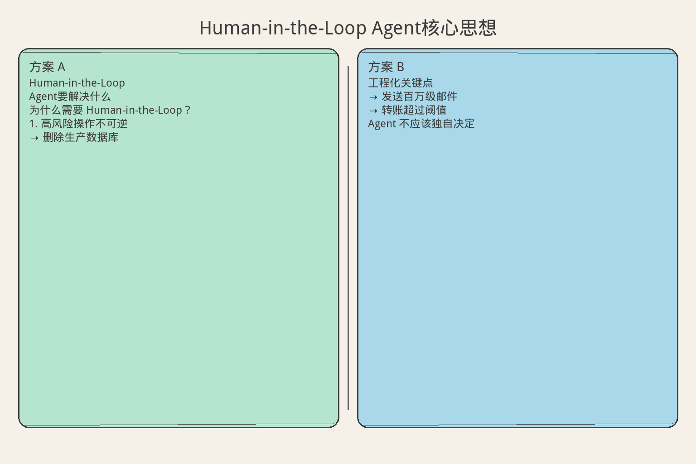
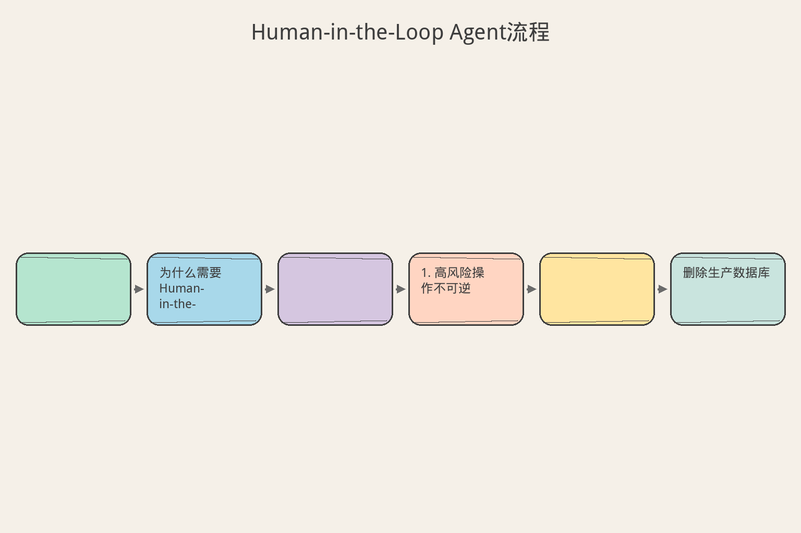
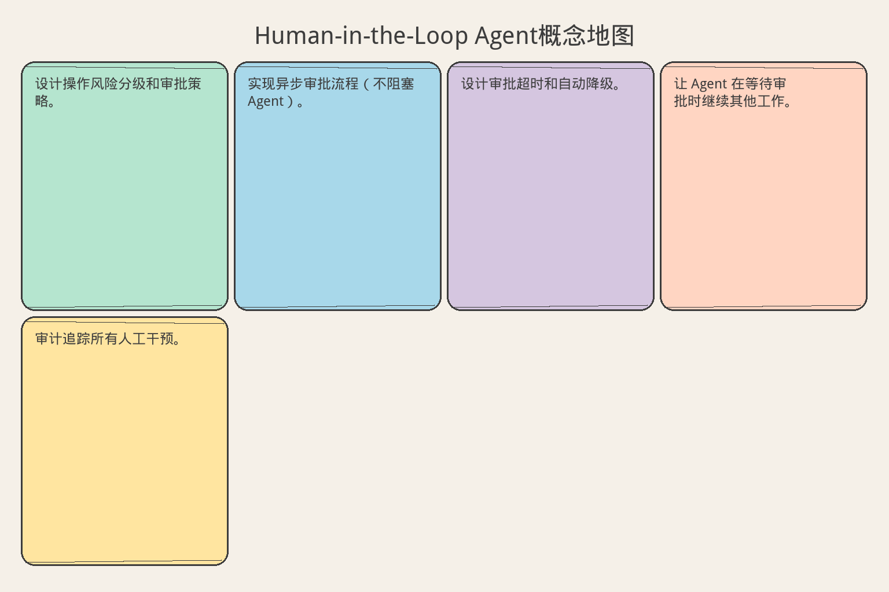

# AI Agent 工程（十一）：Human-in-the-Loop Agent

> 全自动不是目标，安全高效才是。高风险操作需要人类确认，模糊决策需要人类判断，异常情况需要人类兜底。Human-in-the-Loop 不是 Agent 的退步，而是工程化的必要设计。

**阅读建议：** 先阅读 [223 幂等 Agent 工具](223.idempotent-agent-tools-tutorial.md)，理解工具安全执行。

**环境要求：**
- Python **3.10+**
- 无需安装第三方库

---

## 目录

1. [你会学到什么](#你会学到什么)
2. [它解决什么问题](#它解决什么问题)
3. [审批分级模型](#审批分级模型)
4. [最小示例](#最小示例)
5. [工程化版本](#工程化版本)
6. [常见失败模式](#常见失败模式)
7. [什么时候不要这么做](#什么时候不要这么做)
8. [生产环境注意事项](#生产环境注意事项)
9. [如何观测和评测](#如何观测和评测)
10. [和 RAG / 后端 / 前端的关系](#和-rag--后端--前端的关系)
11. [面试怎么讲](#面试怎么讲)
12. [下一步](#下一步)

## 你会学到什么

- 设计操作风险分级和审批策略。
- 实现异步审批流程（不阻塞 Agent）。
- 设计审批超时和自动降级。
- 让 Agent 在等待审批时继续其他工作。
- 审计追踪所有人工干预。

## 它解决什么问题


读下图时，先看「Human-in-the-Loop Agent核心思想」建立直觉。


```text
为什么需要 Human-in-the-Loop？

1. 高风险操作不可逆
   → 删除生产数据库
   → 发送百万级邮件
   → 转账超过阈值
   Agent 不应该独自决定

2. LLM 判断有不确定性
   → 分类置信度 < 80%
   → 多个方案难以取舍
   → 涉及主观判断
   需要人类最终决策

3. 合规要求
   → 金融操作需要双人复核
   → 医疗建议需要医生确认
   → 法律文件需要律师审批

4. 信任建立
   → 用户不信任全自动
   → 关键节点确认增加安全感
   → 逐步放权（从审批到自动）

没有 HITL 时：
  Agent 删了不该删的数据
  Agent 发了不该发的邮件
  Agent 做了不可逆的错误决策
  → 一次事故毁掉所有信任
```

## 审批分级模型

```text
操作风险四级分类：

Level 0 - AUTO（自动执行）
  风险：无
  示例：查询、搜索、计算
  审批：不需要
  延迟：0

Level 1 - CONFIRM（用户确认）
  风险：低
  示例：修改个人信息、订阅通知
  审批：用户点"确认"
  延迟：秒级

Level 2 - APPROVE（管理员审批）
  风险：中
  示例：退款 > 1000元、批量操作
  审批：管理员审批
  延迟：分钟级

Level 3 - COMMITTEE（委员会审批）
  风险：高
  示例：删除数据、大额转账、系统变更
  审批：多人审批
  延迟：小时级

分级依据：
  可逆性：不可逆 → 升级
  影响范围：影响多人 → 升级
  金额：超过阈值 → 升级
  合规：法规要求 → 强制审批
```

## 最小示例


读下图时，先看「Human-in-the-Loop Agent流程」建立直觉。


### 基础审批流程

```python
from dataclasses import dataclass, field
from enum import Enum
from typing import Any, Optional
import time
import asyncio


class RiskLevel(int, Enum):
    AUTO = 0
    CONFIRM = 1
    APPROVE = 2
    COMMITTEE = 3


class ApprovalStatus(str, Enum):
    PENDING = "pending"
    APPROVED = "approved"
    REJECTED = "rejected"
    EXPIRED = "expired"
    AUTO_APPROVED = "auto_approved"


@dataclass
class ApprovalRequest:
    """审批请求"""
    request_id: str
    tool_name: str
    params: dict
    risk_level: RiskLevel
    reason: str
    requested_by: str
    created_at: float = field(default_factory=time.time)
    status: ApprovalStatus = ApprovalStatus.PENDING
    decided_by: Optional[str] = None
    decided_at: Optional[float] = None
    comment: str = ""


class SimpleApprovalGate:
    """简单审批门控"""

    def __init__(self):
        self._pending: dict[str, ApprovalRequest] = {}
        self._history: list[ApprovalRequest] = []

    def requires_approval(self, tool_name: str, params: dict) -> RiskLevel:
        """判断操作的风险等级"""
        # 读操作 → 自动
        if tool_name.startswith(("get_", "search_", "list_", "query_")):
            return RiskLevel.AUTO

        # 危险操作 → 需要审批
        dangerous_tools = {"delete_", "drop_", "remove_", "purge_"}
        if any(tool_name.startswith(d) for d in dangerous_tools):
            return RiskLevel.COMMITTEE

        # 金额相关 → 按金额分级
        amount = params.get("amount", 0)
        if amount > 10000:
            return RiskLevel.COMMITTEE
        if amount > 1000:
            return RiskLevel.APPROVE
        if amount > 0:
            return RiskLevel.CONFIRM

        # 写操作 → 确认
        return RiskLevel.CONFIRM

    async def execute_with_approval(
        self,
        tool_name: str,
        params: dict,
        handler: callable,
        user_id: str,
    ) -> dict:
        """带审批的工具执行"""
        risk = self.requires_approval(tool_name, params)

        # Level 0: 自动执行
        if risk == RiskLevel.AUTO:
            result = await handler(**params)
            return {"status": "executed", "data": result, "approval": "auto"}

        # Level 1+: 需要审批
        request = ApprovalRequest(
            request_id=f"REQ-{int(time.time()*1000)}",
            tool_name=tool_name,
            params=params,
            risk_level=risk,
            reason=f"Tool '{tool_name}' requires {risk.name} approval",
            requested_by=user_id,
        )
        self._pending[request.request_id] = request

        # 等待审批（实际中是异步的）
        return {
            "status": "pending_approval",
            "request_id": request.request_id,
            "risk_level": risk.name,
            "message": f"Waiting for {risk.name} approval",
        }

    def approve(self, request_id: str, approver: str, comment: str = ""):
        """审批通过"""
        if request_id in self._pending:
            req = self._pending[request_id]
            req.status = ApprovalStatus.APPROVED
            req.decided_by = approver
            req.decided_at = time.time()
            req.comment = comment
            self._history.append(req)
            del self._pending[request_id]

    def reject(self, request_id: str, approver: str, comment: str = ""):
        """审批拒绝"""
        if request_id in self._pending:
            req = self._pending[request_id]
            req.status = ApprovalStatus.REJECTED
            req.decided_by = approver
            req.decided_at = time.time()
            req.comment = comment
            self._history.append(req)
            del self._pending[request_id]
```

## 工程化版本

### 异步审批管理器

```python
class AsyncApprovalManager:
    """异步审批管理器：不阻塞 Agent"""

    def __init__(self, timeout_seconds: float = 3600):
        self._pending: dict[str, ApprovalRequest] = {}
        self._callbacks: dict[str, asyncio.Future] = {}
        self._timeout = timeout_seconds
        self._rules: list[ApprovalRule] = []
        self._audit_log: list[dict] = []

    def add_rule(self, rule: "ApprovalRule"):
        """添加审批规则"""
        self._rules.append(rule)

    def evaluate(self, tool_name: str, params: dict,
                 context: dict) -> RiskLevel:
        """评估风险等级"""
        max_level = RiskLevel.AUTO
        for rule in self._rules:
            level = rule.evaluate(tool_name, params, context)
            max_level = max(max_level, level)
        return max_level

    async def submit(
        self, tool_name: str, params: dict, context: dict
    ) -> tuple[ApprovalStatus, Any]:
        """提交审批请求"""
        risk = self.evaluate(tool_name, params, context)

        if risk == RiskLevel.AUTO:
            self._log_audit(tool_name, params, "auto_approved", context)
            return ApprovalStatus.AUTO_APPROVED, None

        # 创建审批请求
        request_id = f"APR-{int(time.time()*1000)}"
        request = ApprovalRequest(
            request_id=request_id,
            tool_name=tool_name,
            params=params,
            risk_level=risk,
            reason=self._generate_reason(tool_name, params, risk),
            requested_by=context.get("user_id", "agent"),
        )
        self._pending[request_id] = request

        # 创建 Future 等待审批
        future: asyncio.Future = asyncio.get_event_loop().create_future()
        self._callbacks[request_id] = future

        # 通知审批人
        await self._notify_approvers(request)

        # 等待审批（带超时）
        try:
            result = await asyncio.wait_for(future, timeout=self._timeout)
            self._log_audit(tool_name, params, result, context)
            return (
                ApprovalStatus.APPROVED if result else ApprovalStatus.REJECTED,
                request_id,
            )
        except asyncio.TimeoutError:
            request.status = ApprovalStatus.EXPIRED
            self._log_audit(tool_name, params, "expired", context)
            return ApprovalStatus.EXPIRED, request_id

    def decide(self, request_id: str, approved: bool,
               approver: str, comment: str = ""):
        """审批决定"""
        if request_id not in self._pending:
            return

        request = self._pending[request_id]
        request.decided_by = approver
        request.decided_at = time.time()
        request.comment = comment

        if approved:
            request.status = ApprovalStatus.APPROVED
        else:
            request.status = ApprovalStatus.REJECTED

        # 解析等待
        if request_id in self._callbacks:
            future = self._callbacks[request_id]
            if not future.done():
                future.set_result(approved)
            del self._callbacks[request_id]

        del self._pending[request_id]

    def _generate_reason(self, tool_name: str, params: dict,
                         risk: RiskLevel) -> str:
        return (
            f"Tool '{tool_name}' classified as {risk.name} risk. "
            f"Parameters: {list(params.keys())}. "
            f"Requires human approval before execution."
        )

    async def _notify_approvers(self, request: ApprovalRequest):
        """通知审批人（实际中发邮件/消息）"""
        pass  # 集成通知系统

    def _log_audit(self, tool_name: str, params: dict,
                   decision: str, context: dict):
        self._audit_log.append({
            "tool": tool_name,
            "params_keys": list(params.keys()),
            "decision": decision,
            "user": context.get("user_id"),
            "timestamp": time.time(),
        })
```

### 审批规则引擎

```python
from abc import ABC, abstractmethod


class ApprovalRule(ABC):
    """审批规则基类"""

    @abstractmethod
    def evaluate(self, tool_name: str, params: dict,
                 context: dict) -> RiskLevel:
        ...


class ToolNameRule(ApprovalRule):
    """基于工具名的规则"""

    def __init__(self, patterns: dict[str, RiskLevel]):
        self.patterns = patterns  # {"delete_*": COMMITTEE, "send_*": APPROVE}

    def evaluate(self, tool_name: str, params: dict,
                 context: dict) -> RiskLevel:
        import fnmatch
        for pattern, level in self.patterns.items():
            if fnmatch.fnmatch(tool_name, pattern):
                return level
        return RiskLevel.AUTO


class AmountRule(ApprovalRule):
    """基于金额的规则"""

    def __init__(self, thresholds: list[tuple[float, RiskLevel]]):
        # [(10000, COMMITTEE), (1000, APPROVE), (0, CONFIRM)]
        self.thresholds = sorted(thresholds, key=lambda x: -x[0])

    def evaluate(self, tool_name: str, params: dict,
                 context: dict) -> RiskLevel:
        amount = params.get("amount", 0)
        for threshold, level in self.thresholds:
            if amount > threshold:
                return level
        return RiskLevel.AUTO


class BulkOperationRule(ApprovalRule):
    """批量操作规则"""

    def __init__(self, max_auto_count: int = 10):
        self.max_auto = max_auto_count

    def evaluate(self, tool_name: str, params: dict,
                 context: dict) -> RiskLevel:
        # 检查批量参数
        count = params.get("count", 1)
        items = params.get("items", [])
        actual_count = max(count, len(items))

        if actual_count > self.max_auto * 10:
            return RiskLevel.COMMITTEE
        if actual_count > self.max_auto:
            return RiskLevel.APPROVE
        return RiskLevel.AUTO


class TimeBasedRule(ApprovalRule):
    """基于时间的规则（非工作时间升级）"""

    def evaluate(self, tool_name: str, params: dict,
                 context: dict) -> RiskLevel:
        import datetime
        now = datetime.datetime.now()
        # 非工作时间（22:00-08:00）写操作升级
        if now.hour >= 22 or now.hour < 8:
            if not tool_name.startswith(("get_", "search_", "list_")):
                return RiskLevel.APPROVE
        return RiskLevel.AUTO
```

### Agent 集成

```python
class HITLAgent:
    """带人工审批的 Agent"""

    def __init__(self):
        self.approval_manager = AsyncApprovalManager(timeout_seconds=300)
        self._setup_rules()
        self._task_queue: list[dict] = []

    def _setup_rules(self):
        """配置审批规则"""
        self.approval_manager.add_rule(ToolNameRule({
            "delete_*": RiskLevel.COMMITTEE,
            "drop_*": RiskLevel.COMMITTEE,
            "send_email_*": RiskLevel.APPROVE,
            "transfer_*": RiskLevel.APPROVE,
            "update_*": RiskLevel.CONFIRM,
            "create_*": RiskLevel.CONFIRM,
        }))
        self.approval_manager.add_rule(AmountRule([
            (10000, RiskLevel.COMMITTEE),
            (1000, RiskLevel.APPROVE),
            (100, RiskLevel.CONFIRM),
        ]))
        self.approval_manager.add_rule(BulkOperationRule(max_auto_count=5))

    async def execute_tool(
        self, tool_name: str, params: dict, context: dict, handler: callable
    ) -> dict:
        """执行工具（带审批）"""
        status, request_id = await self.approval_manager.submit(
            tool_name, params, context
        )

        match status:
            case ApprovalStatus.AUTO_APPROVED:
                result = await handler(**params)
                return {"status": "success", "data": result}

            case ApprovalStatus.APPROVED:
                result = await handler(**params)
                return {
                    "status": "success",
                    "data": result,
                    "approval_id": request_id,
                }

            case ApprovalStatus.REJECTED:
                return {
                    "status": "rejected",
                    "message": "Operation rejected by approver",
                    "approval_id": request_id,
                }

            case ApprovalStatus.EXPIRED:
                return {
                    "status": "expired",
                    "message": "Approval timed out. Operation cancelled.",
                    "approval_id": request_id,
                }

    async def run_with_parallel_tasks(self, tasks: list[dict]):
        """并行执行任务，审批等待时处理其他任务"""
        pending_tasks = list(tasks)
        results = []

        while pending_tasks:
            # 提交所有任务
            coros = []
            for task in pending_tasks:
                coros.append(self.execute_tool(
                    task["tool"], task["params"],
                    task.get("context", {}), task["handler"]
                ))

            # 等待任一完成
            done, pending = await asyncio.wait(
                coros, return_when=asyncio.FIRST_COMPLETED
            )

            for d in done:
                results.append(d.result())

            # 更新待处理列表
            pending_tasks = pending_tasks[len(done):]

        return results
```

## 常见失败模式

### 1. 审批疲劳

```text
症状：
  审批人每次都点"通过"，不看内容

原因：
  审批请求太多
  低风险操作也要审批

解决：
  只让真正需要人类判断的操作走审批
  低风险操作自动通过
  定期审查规则，减少不必要的审批
  目标：审批量 < 总操作量的 5%
```

### 2. 审批阻塞

```text
症状：
  Agent 等待审批时完全卡住

原因：
  同步等待审批结果
  审批人不在线

解决：
  异步审批 + 超时
  等待时 Agent 处理其他任务
  超时后自动降级（拒绝或升级）
  通知渠道多样化（邮件+IM+短信）
```

### 3. 审批绕过

```text
症状：
  危险操作没经过审批就执行了

原因：
  规则不完整
  新工具没配置审批

解决：
  默认拒绝（白名单模式）
  新工具默认需要审批
  定期审计操作日志
  未分类操作自动升级为 APPROVE
```

### 4. 审批上下文不足

```text
症状：
  审批人看不懂请求，随机决定

原因：
  审批请求只有工具名和参数
  没有业务上下文

解决：
  审批请求包含：
  - 为什么要执行（Agent 的推理）
  - 影响范围
  - 风险评估
  - 替代方案
```

## 什么时候不要这么做

```text
不需要 HITL 的场景：

1. 纯读操作
   → 查询、搜索不改变状态
   → 自动执行即可

2. 完全可逆的操作
   → 可以 undo 的操作
   → 自动执行 + 提供撤销

3. 低风险 + 高频操作
   → 每次确认会严重影响体验
   → 自动执行 + 事后审计

4. 已有其他安全机制
   → 沙箱执行
   → 权限隔离
   → 操作可回滚
```

## 生产环境注意事项

### 审批超时策略

```python
class TimeoutStrategy:
    """审批超时策略"""

    STRATEGIES = {
        "reject": "超时自动拒绝",
        "escalate": "超时升级审批人",
        "auto_approve": "超时自动通过（仅低风险）",
        "notify": "超时再次通知",
    }

    def __init__(self, strategy: str = "reject"):
        self.strategy = strategy

    async def handle_timeout(self, request: ApprovalRequest) -> ApprovalStatus:
        match self.strategy:
            case "reject":
                return ApprovalStatus.REJECTED
            case "escalate":
                # 通知更高级别审批人
                return ApprovalStatus.PENDING
            case "auto_approve":
                if request.risk_level <= RiskLevel.CONFIRM:
                    return ApprovalStatus.AUTO_APPROVED
                return ApprovalStatus.REJECTED
            case "notify":
                # 再次通知
                return ApprovalStatus.PENDING
        return ApprovalStatus.REJECTED
```

### 审计日志

```python
class AuditLogger:
    """HITL 审计日志"""

    def __init__(self):
        self._logs: list[dict] = []

    def log_action(self, event: str, details: dict):
        self._logs.append({
            "event": event,
            "timestamp": time.time(),
            **details,
        })

    def log_approval_request(self, request: ApprovalRequest):
        self.log_action("approval_requested", {
            "request_id": request.request_id,
            "tool": request.tool_name,
            "risk_level": request.risk_level.name,
            "requested_by": request.requested_by,
        })

    def log_approval_decision(self, request: ApprovalRequest):
        self.log_action("approval_decided", {
            "request_id": request.request_id,
            "tool": request.tool_name,
            "status": request.status.value,
            "decided_by": request.decided_by,
            "latency_seconds": (
                request.decided_at - request.created_at
                if request.decided_at else None
            ),
            "comment": request.comment,
        })

    def get_report(self) -> dict:
        """生成审计报告"""
        total = len([l for l in self._logs if l["event"] == "approval_requested"])
        approved = len([l for l in self._logs
                       if l["event"] == "approval_decided"
                       and l.get("status") == "approved"])
        rejected = len([l for l in self._logs
                       if l["event"] == "approval_decided"
                       and l.get("status") == "rejected"])
        return {
            "total_requests": total,
            "approved": approved,
            "rejected": rejected,
            "approval_rate": approved / max(1, total),
        }
```

## 如何观测和评测

```text
HITL 关键指标：

1. 审批率
   - 需要审批的操作 / 总操作
   - 目标：< 5%（太高说明规则太严）

2. 审批延迟
   - 从提交到决定的时间
   - P50 < 5分钟，P99 < 1小时

3. 通过率
   - approved / (approved + rejected)
   - > 90% 说明 Agent 决策质量好
   - < 70% 说明 Agent 需要优化

4. 超时率
   - expired / total
   - 目标：< 5%

5. 审批人负载
   - 每个审批人每天处理量
   - 避免单点瓶颈
```

## 和 RAG / 后端 / 前端的关系

```text
HITL 在系统中的位置：

RAG 管道：
  检索结果用于生成审批上下文
  例：审批退款时展示相关订单历史

后端 API：
  审批状态存储在数据库
  审批 API：POST /approvals/{id}/decide
  WebSocket 推送审批通知

前端展示：
  审批队列页面
  一键批准/拒绝
  批量审批
  审批历史查看
```

## 面试怎么讲

```text
面试官：Agent 的高风险操作怎么处理？

回答框架（2 分钟）：

"我设计了四级审批模型：

 Level 0 AUTO：读操作，自动执行。
 Level 1 CONFIRM：低风险写操作，用户确认。
 Level 2 APPROVE：中风险操作，管理员审批。
 Level 3 COMMITTEE：高风险操作，多人审批。

 关键设计：
 - 规则引擎：工具名 + 金额 + 批量 + 时间
 - 异步审批：不阻塞 Agent，等待时处理其他任务
 - 超时策略：默认拒绝，低风险可升级
 - 审计追踪：所有审批决策有日志

 实际效果：
 审批率 3%（不影响效率），
 高风险操作零事故，
 用户信任度显著提升。"

追问 1：审批太多怎么办？
  → 定期审查规则，减少不必要审批。
    用通过率指标：> 95% 通过的规则可以降级。

追问 2：审批人不在线怎么办？
  → 多通道通知（IM + 邮件 + 短信）。
    超时后升级审批人。
    关键操作设置 backup 审批人。

追问 3：怎么逐步放权？
  → 新操作默认需要审批。
    连续 100 次通过后自动降级。
    出事故后立即升级。
```

## 实战案例：客服 Agent 的审批流程

### 场景设计

```text
客服 Agent 操作分级：

AUTO（自动）：
  - 查询订单状态
  - 搜索知识库
  - 查询物流信息
  - 计算退款金额

CONFIRM（用户确认）：
  - 修改收货地址
  - 取消未发货订单
  - 申请小额退款（< 100元）

APPROVE（主管审批）：
  - 大额退款（100-5000元）
  - 发放优惠券
  - 修改订单价格

COMMITTEE（经理审批）：
  - 超大额退款（> 5000元）
  - 永久封禁用户
  - 批量操作（> 50单）
```

### 完整实现

```python
class CustomerServiceHITL:
    """客服 Agent 的 HITL 实现"""

    def __init__(self):
        self.manager = AsyncApprovalManager(timeout_seconds=600)
        self.audit = AuditLogger()
        self._setup_rules()

    def _setup_rules(self):
        # 工具名规则
        self.manager.add_rule(ToolNameRule({
            "get_*": RiskLevel.AUTO,
            "search_*": RiskLevel.AUTO,
            "query_*": RiskLevel.AUTO,
            "calculate_*": RiskLevel.AUTO,
            "update_address_*": RiskLevel.CONFIRM,
            "cancel_order_*": RiskLevel.CONFIRM,
            "refund_*": RiskLevel.APPROVE,  # 默认，金额规则会覆盖
            "ban_user_*": RiskLevel.COMMITTEE,
            "batch_*": RiskLevel.COMMITTEE,
        }))
        # 金额规则
        self.manager.add_rule(AmountRule([
            (5000, RiskLevel.COMMITTEE),
            (100, RiskLevel.APPROVE),
            (0, RiskLevel.CONFIRM),
        ]))

    async def handle_refund(
        self, order_id: str, amount: float, reason: str, context: dict
    ) -> dict:
        """处理退款请求"""
        params = {
            "order_id": order_id,
            "amount": amount,
            "reason": reason,
        }

        # 提交审批
        status, request_id = await self.manager.submit(
            "refund_order", params, context
        )

        self.audit.log_action("refund_attempted", {
            "order_id": order_id,
            "amount": amount,
            "status": status.value,
        })

        match status:
            case ApprovalStatus.AUTO_APPROVED | ApprovalStatus.APPROVED:
                # 执行退款
                result = await self._execute_refund(order_id, amount)
                return {
                    "status": "refunded",
                    "amount": amount,
                    "approval_id": request_id,
                }
            case ApprovalStatus.REJECTED:
                return {
                    "status": "rejected",
                    "message": "Refund rejected by approver",
                    "suggestion": "Contact supervisor for manual handling",
                }
            case ApprovalStatus.EXPIRED:
                return {
                    "status": "timeout",
                    "message": "Approval timed out",
                    "suggestion": "Escalate to supervisor",
                }

    async def _execute_refund(self, order_id: str, amount: float) -> dict:
        """实际执行退款"""
        return {"order_id": order_id, "refunded": amount}

    def get_daily_report(self) -> dict:
        """生成每日 HITL 报告"""
        return self.audit.get_report()
```

### 审批体验优化

```text
审批请求展示模板：

┌─────────────────────────────────────────────┐
│  审批请求 #APR-20250101-001              │
├─────────────────────────────────────────────┤
│  操作：退款                                  │
│  订单：ORD-20250101                          │
│  金额：￥2,500.00                            │
│  原因：商品质量问题，屏幕有裂痕              │
├─────────────────────────────────────────────┤
│  Agent 推理：                                │
│  “用户提供了照片证据，确认屏幕裂痕。      │
│   订单在 7 天无理由退货期内。              │
│   建议全额退款。”                          │
├─────────────────────────────────────────────┤
│  风险评估：中                                │
│  影响范围：单个订单                          │
│  可逆性：不可逆（退款后无法撤回）            │
├─────────────────────────────────────────────┤
│  [✅ 批准]  [❌ 拒绝]  [💬 要求更多信息]  │
└─────────────────────────────────────────────┘

设计要点：
1. 展示 Agent 的推理过程（增加信任）
2. 明确风险评估和影响范围
3. 提供“要求更多信息”选项
4. 一键操作，减少审批摩擦
```

### 逐步放权机制

```python
class TrustLevelManager:
    """信任等级管理：逐步放权"""

    def __init__(self):
        # agent_id -> {tool_name -> consecutive_approvals}
        self._trust_scores: dict[str, dict[str, int]] = {}
        self._threshold = 100  # 连续 100 次通过后降级

    def record_approval(self, agent_id: str, tool_name: str, approved: bool):
        """记录审批结果"""
        if agent_id not in self._trust_scores:
            self._trust_scores[agent_id] = {}

        if approved:
            self._trust_scores[agent_id][tool_name] = \
                self._trust_scores[agent_id].get(tool_name, 0) + 1
        else:
            # 拒绝则重置
            self._trust_scores[agent_id][tool_name] = 0

    def should_downgrade(self, agent_id: str, tool_name: str) -> bool:
        """是否应该降低审批等级"""
        score = self._trust_scores.get(agent_id, {}).get(tool_name, 0)
        return score >= self._threshold

    def reset_on_incident(self, agent_id: str, tool_name: str):
        """事故后重置信任"""
        if agent_id in self._trust_scores:
            self._trust_scores[agent_id][tool_name] = 0
```

## 设计原则总结

```text
HITL 设计 5 条原则：

1. 默认安全
   新工具默认需要审批
   只有证明安全后才放权

2. 异步不阻塞
   审批等待时 Agent 做其他事
   超时后自动处理

3. 上下文充分
   审批人能看到 Agent 的推理
   影响范围和风险评估

4. 审计完整
   所有审批决策有日志
   可追溯、可复盘

5. 动态调整
   通过率 > 95% 的规则降级
   出事故的规则升级
   定期审查规则有效性
```

## 下一步


读下图时，先看「Human-in-the-Loop Agent概念地图」建立直觉。


下一篇 [225 Agent 工具权限边界](225.agent-tool-permission-boundary-tutorial.md) 会讨论如何设计 Agent 的权限系统，确保最小权限原则。
