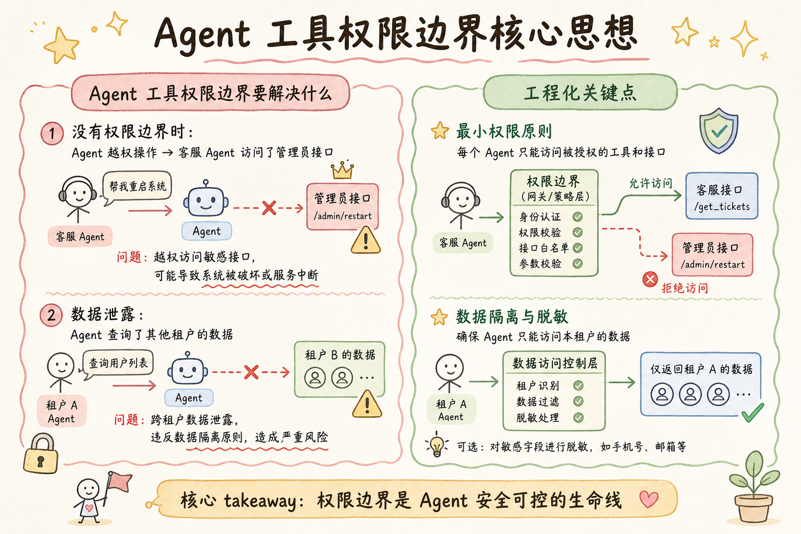
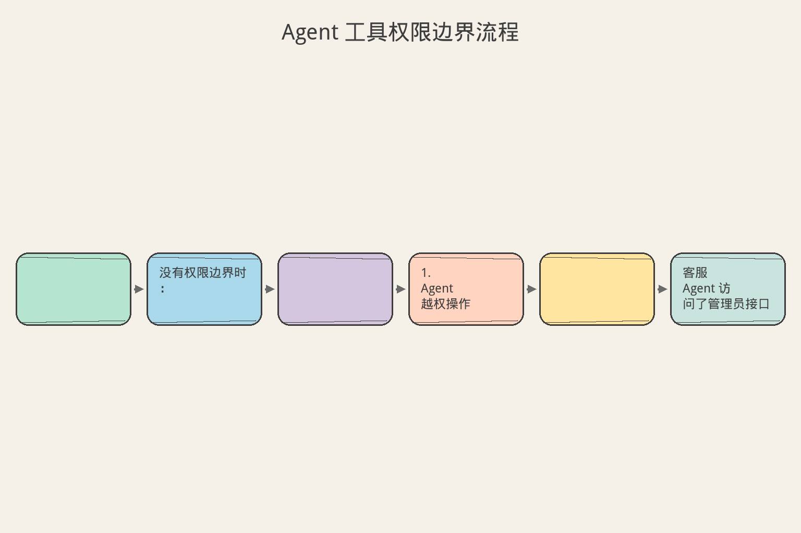
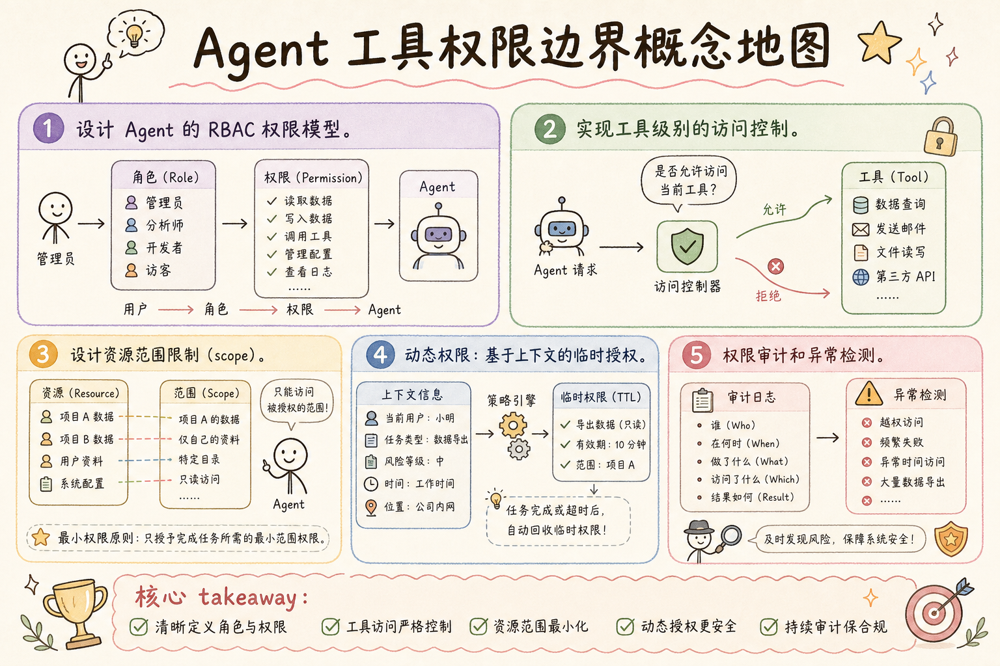

# AI Agent 工程（十二）：Agent 工具权限边界

> Agent 不是超级用户。它应该像一个入职第一天的实习生：只被给予完成当前任务所需的最小权限，每个操作都在边界内，越界立即阻断。

**阅读建议：** 先阅读 [224 Human-in-the-Loop Agent](224.human-in-the-loop-agent-tutorial.md)，理解审批流程。

**环境要求：**
- Python **3.10+**
- 无需安装第三方库


**档位：** 主线篇（Part 2）
**本文边界：** 前驱篇 [224](224.human-in-the-loop-agent-tutorial.md) 人工闸门。本篇 RBAC/ABAC 与最小权限。不讲 IAM 控制台。接续 [226](226.agent-loop-observe-think-act-tutorial.md) 接入 ACT。
**动手路径：** ① 读 RBAC 表 → ② 运行 `demo_permissions()` → ③ 对照 §生产环境注意事项

### 核心术语（本篇首次出现）
**Tool Calling**（工具调用）：模型输出结构化函数名与参数。
通俗说：像给助理一张办事清单，写明「去办哪件事、带什么材料」。
**幂等**（Idempotency）：同一请求执行多次与一次效果相同。
通俗说：重复点「提交」不会重复扣款。
**ABAC**（属性访问控制）：按用户属性+资源属性动态判断，比固定角色更细。
通俗说：按用户属性+资源属性动态判断。
**RBAC**（Role-Based Access Control）：按角色授予工具与资源访问权限
通俗说：职位决定能调什么工具。
---

## 目录

1. [你会学到什么](#你会学到什么)
2. [它解决什么问题](#它解决什么问题)
3. [最小权限原则](#最小权限原则)
4. [最小示例](#最小示例)
5. [工程化版本](#工程化版本)
6. [常见失败模式](#常见失败模式)
7. [什么时候不要这么做](#什么时候不要这么做)
8. [生产环境注意事项](#生产环境注意事项)
9. [如何观测和评测](#如何观测和评测)
10. [和 RAG / 后端 / 前端的关系](#和-rag--后端--前端的关系)
11. [面试怎么讲](#面试怎么讲)
12. [下一步](#下一步)

## 你会学到什么

- 设计 Agent 的 RBAC 权限模型。
- 实现工具级别的访问控制。
- 设计资源范围限制（scope）。
- 动态权限：基于上下文的临时授权。
- 权限审计和异常检测。

## 它解决什么问题


读下图时，先看「Agent 工具权限边界核心思想」建立直觉。


对照上图：最小权限原则——Agent 只能调业务允许的工具，权限检查在 ACT 前。

读下图时，先看能力边界与痛点流程——与 §最小示例 代码互补，不是逐步对照。


对照上图：RBAC/ABAC 决定「谁能调什么」——权限在 ACT 前检查，不是事后审计的补丁。
```text
没有权限边界时：

1. Agent 越权操作
   → 客服 Agent 访问了管理员接口
   → 删除了不该删除的数据

2. 数据泄露
   → Agent 查询了其他租户的数据
   → 返回了敏感字段

3. 权限提升
   → LLM 被 prompt injection 诱导
   → 调用了高权限工具

4. 横向移动
   → 一个 Agent 被攻破
   → 利用其权限访问其他系统

5. 审计困难
   → 不知道 Agent 做了什么
   → 出事后无法追溯

核心原则：
  Agent 的权限 ≤ 调用者的权限
  Agent 的权限 = 完成任务所需的最小集合
  权限随任务开始授予，随任务结束回收
```

## 最小权限原则

```text
权限设计三层模型：

Layer 1: 角色权限（RBAC）
  定义角色能做什么
  例：support_agent 可以 get_order, cancel_order
      不能 delete_user, modify_price

Layer 2: 资源范围（Scope）
  定义角色能访问哪些数据
  例：只能访问自己部门的订单
      只能查询当前租户的数据

Layer 3: 操作约束（Constraint）
  定义操作的限制条件
  例：退款金额 < 5000
      每天最多取消 10 单
      只能操作最近 30 天的数据

三层叠加：
  最终权限 = 角色权限 ∩ 资源范围 ∩ 操作约束
```

## 最小示例

**演示什么：** 本节最小可运行切片。**环境：** 见文首。**预期：** 控制台打印 demo 输出。

### 基础权限检查

```python
from dataclasses import dataclass, field
from enum import Enum
from typing import Optional
import time


class Permission(str, Enum):
    """权限枚举"""
    # 订单
    ORDER_READ = "order:read"
    ORDER_CREATE = "order:create"
    ORDER_CANCEL = "order:cancel"
    ORDER_MODIFY = "order:modify"
    # 用户
    USER_READ = "user:read"
    USER_MODIFY = "user:modify"
    USER_DELETE = "user:delete"
    # 支付
    PAYMENT_READ = "payment:read"
    PAYMENT_REFUND = "payment:refund"
    # 系统
    SYSTEM_CONFIG = "system:config"
    ADMIN = "admin:*"


@dataclass
class AgentIdentity:
    """Agent 身份"""
    agent_id: str
    role: str
    tenant_id: str
    permissions: set[Permission] = field(default_factory=set)
    scopes: dict[str, str] = field(default_factory=dict)
    constraints: dict[str, any] = field(default_factory=dict)


class PermissionChecker:
    """权限检查器"""

    # 角色 → 权限映射
    ROLE_PERMISSIONS: dict[str, set[Permission]] = {
        "customer": {
            Permission.ORDER_READ,
            Permission.ORDER_CREATE,
            Permission.ORDER_CANCEL,
            Permission.PAYMENT_READ,
        },
        "support_agent": {
            Permission.ORDER_READ,
            Permission.ORDER_CREATE,
            Permission.ORDER_CANCEL,
            Permission.ORDER_MODIFY,
            Permission.USER_READ,
            Permission.PAYMENT_READ,
            Permission.PAYMENT_REFUND,
        },
        "admin": set(Permission),
    }

    def check_permission(
        self, identity: AgentIdentity, required: Permission
    ) -> tuple[bool, str]:
        """检查是否有权限"""
        # 管理员通配
        if Permission.ADMIN in identity.permissions:
            return True, "admin wildcard"

        if required not in identity.permissions:
            return False, (
                f"Agent '{identity.agent_id}' (role={identity.role}) "
                f"lacks permission '{required.value}'"
            )
        return True, "granted"

    def check_scope(
        self, identity: AgentIdentity, resource_tenant: str
    ) -> tuple[bool, str]:
        """检查资源范围"""
        if identity.tenant_id != resource_tenant:
            return False, (
                f"Cross-tenant access denied: "
                f"agent tenant={identity.tenant_id}, "
                f"resource tenant={resource_tenant}"
            )
        return True, "in scope"

    def check_constraint(
        self, identity: AgentIdentity, constraint_key: str, value: any
    ) -> tuple[bool, str]:
        """检查操作约束"""
        limit = identity.constraints.get(constraint_key)
        if limit is None:
            return True, "no constraint"

        if isinstance(limit, (int, float)) and isinstance(value, (int, float)):
            if value > limit:
                return False, (
                    f"Constraint violated: {constraint_key}={value} "
                    f"exceeds limit={limit}"
                )
        return True, "within constraint"
```

### 工具权限守卫

```python
class ToolPermissionGuard:
    """工具权限守卫"""

    # 工具 → 所需权限
    TOOL_PERMISSIONS: dict[str, Permission] = {
        "get_order": Permission.ORDER_READ,
        "create_order": Permission.ORDER_CREATE,
        "cancel_order": Permission.ORDER_CANCEL,
        "modify_order": Permission.ORDER_MODIFY,
        "get_user": Permission.USER_READ,
        "delete_user": Permission.USER_DELETE,
        "refund_payment": Permission.PAYMENT_REFUND,
        "system_config": Permission.SYSTEM_CONFIG,
    }

    def __init__(self):
        self.checker = PermissionChecker()
        self._audit_log: list[dict] = []

    def guard(
        self, identity: AgentIdentity, tool_name: str, params: dict
    ) -> tuple[bool, str]:
        """执行前权限检查"""
        # 1. 工具权限检查
        required = self.TOOL_PERMISSIONS.get(tool_name)
        if required is None:
            # 未注册工具默认拒绝
            self._log(identity, tool_name, "DENIED", "unknown tool")
            return False, f"Tool '{tool_name}' not in permission registry"

        ok, msg = self.checker.check_permission(identity, required)
        if not ok:
            self._log(identity, tool_name, "DENIED", msg)
            return False, msg

        # 2. 租户范围检查
        resource_tenant = params.get("tenant_id", identity.tenant_id)
        ok, msg = self.checker.check_scope(identity, resource_tenant)
        if not ok:
            self._log(identity, tool_name, "DENIED", msg)
            return False, msg

        # 3. 约束检查
        amount = params.get("amount")
        if amount is not None:
            ok, msg = self.checker.check_constraint(
                identity, "max_amount", amount
            )
            if not ok:
                self._log(identity, tool_name, "DENIED", msg)
                return False, msg

        self._log(identity, tool_name, "ALLOWED", "all checks passed")
        return True, "allowed"

    def _log(self, identity: AgentIdentity, tool: str,
             decision: str, reason: str):
        self._audit_log.append({
            "agent_id": identity.agent_id,
            "role": identity.role,
            "tool": tool,
            "decision": decision,
            "reason": reason,
            "timestamp": time.time(),
        })
```

## 工程化版本

### 动态权限（临时授权）

```python
@dataclass
class TemporaryGrant:
    """临时权限授予"""
    grant_id: str
    agent_id: str
    permission: Permission
    granted_by: str
    granted_at: float
    expires_at: float
    reason: str
    max_uses: int = 1
    uses_remaining: int = 1


class DynamicPermissionManager:
    """动态权限管理器"""

    def __init__(self):
        self._grants: dict[str, TemporaryGrant] = {}

    def grant(
        self,
        agent_id: str,
        permission: Permission,
        granted_by: str,
        ttl_seconds: float = 3600,
        max_uses: int = 1,
        reason: str = "",
    ) -> str:
        """授予临时权限"""
        grant_id = f"GRANT-{int(time.time()*1000)}"
        self._grants[grant_id] = TemporaryGrant(
            grant_id=grant_id,
            agent_id=agent_id,
            permission=permission,
            granted_by=granted_by,
            granted_at=time.time(),
            expires_at=time.time() + ttl_seconds,
            reason=reason,
            max_uses=max_uses,
            uses_remaining=max_uses,
        )
        return grant_id

    def check(self, agent_id: str, permission: Permission) -> bool:
        """检查是否有临时权限"""
        now = time.time()
        for grant in self._grants.values():
            if (grant.agent_id == agent_id
                    and grant.permission == permission
                    and grant.expires_at > now
                    and grant.uses_remaining > 0):
                return True
        return False

    def consume(self, agent_id: str, permission: Permission) -> bool:
        """使用一次临时权限"""
        now = time.time()
        for grant in self._grants.values():
            if (grant.agent_id == agent_id
                    and grant.permission == permission
                    and grant.expires_at > now
                    and grant.uses_remaining > 0):
                grant.uses_remaining -= 1
                return True
        return False

    def revoke(self, grant_id: str):
        """撤销权限"""
        self._grants.pop(grant_id, None)

    def cleanup_expired(self):
        """清理过期权限"""
        now = time.time()
        expired = [
            gid for gid, g in self._grants.items()
            if g.expires_at <= now or g.uses_remaining <= 0
        ]
        for gid in expired:
            del self._grants[gid]
```

### 权限继承和委托

```python
class PermissionDelegation:
    """权限委托：用户将自己的权限委托给 Agent"""

    def __init__(self):
        self._delegations: dict[str, dict] = {}

    def delegate(
        self,
        user_id: str,
        agent_id: str,
        permissions: set[Permission],
        ttl_seconds: float = 3600,
        constraints: dict | None = None,
    ) -> str:
        """用户委托权限给 Agent"""
        delegation_id = f"DEL-{int(time.time()*1000)}"
        self._delegations[delegation_id] = {
            "user_id": user_id,
            "agent_id": agent_id,
            "permissions": permissions,
            "constraints": constraints or {},
            "expires_at": time.time() + ttl_seconds,
            "created_at": time.time(),
        }
        return delegation_id

    def get_delegated_permissions(
        self, agent_id: str
    ) -> tuple[set[Permission], dict]:
        """获取 Agent 被委托的权限"""
        now = time.time()
        all_perms: set[Permission] = set()
        all_constraints: dict = {}

        for delegation in self._delegations.values():
            if (delegation["agent_id"] == agent_id
                    and delegation["expires_at"] > now):
                all_perms |= delegation["permissions"]
                all_constraints.update(delegation["constraints"])

        return all_perms, all_constraints

    def revoke_all(self, user_id: str):
        """用户撤销所有委托"""
        to_remove = [
            did for did, d in self._delegations.items()
            if d["user_id"] == user_id
        ]
        for did in to_remove:
            del self._delegations[did]
```

### 完整权限执行器

```python
class PermissionAwareExecutor:
    """权限感知的工具执行器"""

    def __init__(self):
        self.guard = ToolPermissionGuard()
        self.dynamic = DynamicPermissionManager()
        self.delegation = PermissionDelegation()
        self._tools: dict[str, callable] = {}

    def register_tool(self, name: str, handler: callable):
        self._tools[name] = handler

    async def execute(
        self,
        identity: AgentIdentity,
        tool_name: str,
        params: dict,
    ) -> dict:
        """带权限检查的工具执行"""
        # 1. 静态权限检查
        allowed, reason = self.guard.guard(identity, tool_name, params)

        # 2. 如果静态权限不足，检查动态权限
        if not allowed:
            required = ToolPermissionGuard.TOOL_PERMISSIONS.get(tool_name)
            if required and self.dynamic.check(identity.agent_id, required):
                self.dynamic.consume(identity.agent_id, required)
                allowed = True
                reason = "dynamic grant"

        # 3. 如果还不够，检查委托权限
        if not allowed:
            delegated_perms, _ = self.delegation.get_delegated_permissions(
                identity.agent_id
            )
            required = ToolPermissionGuard.TOOL_PERMISSIONS.get(tool_name)
            if required and required in delegated_perms:
                allowed = True
                reason = "delegated permission"

        # 4. 最终决定
        if not allowed:
            return {
                "success": False,
                "error": {
                    "code": "PERMISSION_DENIED",
                    "message": reason,
                    "suggestion": "Request permission from administrator",
                }
            }

        # 5. 执行
        handler = self._tools.get(tool_name)
        if not handler:
            return {"success": False, "error": {"code": "TOOL_NOT_FOUND"}}

        try:
            result = await handler(**params)
            return {"success": True, "data": result, "permission": reason}
        except Exception as e:
            return {"success": False, "error": {"code": "EXECUTION_ERROR", "message": str(e)}}
```

## 常见失败模式

### 1. 权限过宽

```text
症状：
  Agent 能访问所有工具和数据

原因：
  图方便给了 admin 权限
  或没有做资源范围限制

解决：
  最小权限原则
  每个 Agent 只有任务所需权限
  资源范围限定到租户/部门
```

### 2. 权限不回收

```text
症状：
  任务结束后 Agent 仍有权限

原因：
  临时权限没有 TTL
  委托权限没有过期时间

解决：
  所有临时权限必须有 TTL
  任务结束主动回收
  定期清理过期权限
```

### 3. Prompt Injection 提权

```text
症状：
  LLM 被诱导调用高权限工具

原因：
  权限检查在 LLM 层
  LLM 可以被 prompt 绕过

解决：
  权限检查在后端（不在 prompt 中）
  工具调用必须经过 PermissionGuard
  LLM 无法绕过权限检查
```

### 4. 权限缓存不一致

```text
症状：
  权限已撤销但 Agent 仍能操作

原因：
  权限信息被缓存
  撤销后缓存未更新

解决：
  权限检查不缓存（或短 TTL）
  撤销操作主动清缓存
  关键操作实时检查
```

## 什么时候不要这么做

```text
不需要复杂权限的场景：

1. 单用户本地 Agent
   → 用户就是管理员
   → 不需要 RBAC

2. 只读 Agent
   → 只有查询权限
   → 简单的 API key 即可

3. 沙箱环境
   → 操作不影响生产
   → 权限隔离由沙箱保证

4. 原型阶段
   → 先跑通流程
   → 上线前补权限
```

## 生产环境注意事项

### 多租户隔离

```python
class TenantIsolation:
    """多租户数据隔离"""

    def __init__(self):
        self._tenant_data: dict[str, dict] = {}

    def filter_by_tenant(
        self, data: list[dict], tenant_id: str, tenant_field: str = "tenant_id"
    ) -> list[dict]:
        """按租户过滤数据"""
        return [item for item in data if item.get(tenant_field) == tenant_id]

    def inject_tenant(self, params: dict, tenant_id: str) -> dict:
        """自动注入租户过滤条件"""
        params = dict(params)
        params["tenant_id"] = tenant_id
        return params

    def validate_access(
        self, identity: AgentIdentity, resource_tenant: str
    ) -> bool:
        """验证跨租户访问"""
        # 只有 admin 可以跨租户
        if identity.role == "admin":
            return True
        return identity.tenant_id == resource_tenant
```

### 权限审计和异常检测

```python
class PermissionAuditor:
    """权限审计和异常检测"""

    def __init__(self):
        self._access_log: list[dict] = []
        self._baseline: dict[str, set[str]] = {}  # agent -> normal tools

    def log_access(self, agent_id: str, tool: str, allowed: bool):
        self._access_log.append({
            "agent_id": agent_id,
            "tool": tool,
            "allowed": allowed,
            "timestamp": time.time(),
        })

    def build_baseline(self):
        """建立正常行为基线"""
        for entry in self._access_log:
            if entry["allowed"]:
                agent = entry["agent_id"]
                if agent not in self._baseline:
                    self._baseline[agent] = set()
                self._baseline[agent].add(entry["tool"])

    def detect_anomalies(self) -> list[dict]:
        """检测异常访问"""
        anomalies = []
        for entry in self._access_log:
            agent = entry["agent_id"]
            tool = entry["tool"]
            baseline = self._baseline.get(agent, set())

            # 首次使用的工具
            if tool not in baseline and entry["allowed"]:
                anomalies.append({
                    "type": "new_tool_access",
                    "agent_id": agent,
                    "tool": tool,
                    "timestamp": entry["timestamp"],
                })

            # 被拒绝的访问
            if not entry["allowed"]:
                anomalies.append({
                    "type": "denied_access",
                    "agent_id": agent,
                    "tool": tool,
                    "timestamp": entry["timestamp"],
                })

        return anomalies
```

## 如何观测和评测

```text
权限系统关键指标：

1. 拒绝率
   - denied / total_requests
   - 正常 < 2%
   - > 10% 说明权限配置有问题

2. 权限使用率
   - 实际使用的权限 / 被授予的权限
   - < 30% 说明权限过宽

3. 临时权限使用率
   - 实际使用 / 被授予
   - 未使用的临时权限应该不授予

4. 异常检测
   - 新工具访问告警
   - 拒绝访问告警
   - 非工作时间访问告警
```

## 和 RAG / 后端 / 前端的关系

```text
权限在系统中的位置：

RAG 管道：
  检索结果按租户过滤
  Agent 只能检索有权访问的文档
  敏感文档需要额外权限

后端 API：
  每个 API 调用带 Agent 身份
  后端独立验证权限（不信任 Agent）
  数据层做行级安全（RLS）

前端展示：
  按权限显示/隐藏功能
  Agent 操作日志对用户可见
  权限申请入口
```

## 面试怎么讲

```text
面试官：Agent 的权限怎么设计？

回答框架（2 分钟）：

"我用三层权限模型：

 Layer 1 RBAC：
  角色定义能做什么。
  support_agent 只能读订单和退款，不能删用户。

 Layer 2 Scope：
  限定能访问哪些数据。
  只能访问自己租户的数据。
  查询自动注入 tenant_id 过滤。

 Layer 3 Constraint：
  操作约束。
  退款金额上限、每日操作次数限制。

 关键设计：
 - 权限检查在后端，LLM 无法绕过
 - 临时权限有 TTL + 使用次数
 - 用户委托模型：用户授权 Agent 代为操作
 - 审计日志 + 异常检测

 实际效果：
 越权操作为零，
 数据泄露为零。"

追问 1：Prompt Injection 怎么防？
  → 权限检查不依赖 LLM。
    所有工具调用必须经过 PermissionGuard。
    即使 LLM 被诱导，后端也会拒绝。

追问 2：权限怎么动态调整？
  → 临时授权：管理员授予，有 TTL。
    委托模型：用户授权 Agent 代为操作。
    任务结束自动回收。

追问 3：多租户怎么隔离？
  → 数据层：行级安全（RLS）。
    应用层：查询自动注入 tenant_id。
    Agent 层：identity 绑定 tenant。
```

## 实战案例：多角色 Agent 权限配置

### 场景：企业 Agent 平台

```python
class EnterprisePermissionConfig:
    """企业 Agent 权限配置"""

    @staticmethod
    def create_support_agent(tenant_id: str) -> AgentIdentity:
        """创建客服 Agent 身份"""
        return AgentIdentity(
            agent_id=f"support-{tenant_id}-001",
            role="support_agent",
            tenant_id=tenant_id,
            permissions={
                Permission.ORDER_READ,
                Permission.ORDER_CREATE,
                Permission.ORDER_CANCEL,
                Permission.USER_READ,
                Permission.PAYMENT_READ,
                Permission.PAYMENT_REFUND,
            },
            scopes={"department": "customer_service"},
            constraints={
                "max_refund_amount": 5000,
                "max_orders_per_day": 100,
                "max_cancel_per_day": 20,
            },
        )

    @staticmethod
    def create_data_analyst(tenant_id: str) -> AgentIdentity:
        """创建数据分析 Agent 身份"""
        return AgentIdentity(
            agent_id=f"analyst-{tenant_id}-001",
            role="data_analyst",
            tenant_id=tenant_id,
            permissions={
                Permission.ORDER_READ,
                Permission.USER_READ,
                Permission.PAYMENT_READ,
            },
            scopes={"department": "analytics"},
            constraints={
                "max_query_rows": 10000,
                "allowed_operations": ["read", "aggregate"],
            },
        )

    @staticmethod
    def create_ops_agent(tenant_id: str) -> AgentIdentity:
        """创建运维 Agent 身份"""
        return AgentIdentity(
            agent_id=f"ops-{tenant_id}-001",
            role="ops_agent",
            tenant_id=tenant_id,
            permissions={
                Permission.SYSTEM_CONFIG,
                Permission.ORDER_READ,
                Permission.USER_READ,
            },
            scopes={"department": "engineering"},
            constraints={
                "allowed_environments": ["staging", "production"],
                "max_restart_per_day": 3,
            },
        )
```

### 权限检查完整流程

```python
async def full_permission_flow():
    """完整权限检查流程示例"""
    # 初始化
    executor = PermissionAwareExecutor()
    config = EnterprisePermissionConfig()

    # 创建客服 Agent
    agent = config.create_support_agent("tenant-abc")

    # 场景 1：正常查询（允许）
    result = await executor.execute(
        agent, "get_order", {"order_id": "ORD-001", "tenant_id": "tenant-abc"}
    )
    assert result["success"] is True

    # 场景 2：跨租户访问（拒绝）
    result = await executor.execute(
        agent, "get_order", {"order_id": "ORD-002", "tenant_id": "tenant-xyz"}
    )
    assert result["success"] is False
    assert "Cross-tenant" in result["error"]["message"]

    # 场景 3：超额退款（拒绝）
    result = await executor.execute(
        agent, "refund_payment", {
            "order_id": "ORD-001",
            "amount": 10000,  # 超过 5000 限制
            "tenant_id": "tenant-abc",
        }
    )
    assert result["success"] is False
    assert "Constraint" in result["error"]["message"]

    # 场景 4：无权限工具（拒绝）
    result = await executor.execute(
        agent, "delete_user", {"user_id": "U001", "tenant_id": "tenant-abc"}
    )
    assert result["success"] is False
    assert "lacks permission" in result["error"]["message"]

    # 场景 5：临时授权（允许）
    executor.dynamic.grant(
        agent_id=agent.agent_id,
        permission=Permission.USER_DELETE,
        granted_by="admin@company.com",
        ttl_seconds=300,
        max_uses=1,
        reason="Emergency: spam account removal",
    )
    result = await executor.execute(
        agent, "delete_user", {"user_id": "SPAM-001", "tenant_id": "tenant-abc"}
    )
    assert result["success"] is True
    assert result["permission"] == "dynamic grant"

    # 场景 6：临时权限已用完（拒绝）
    result = await executor.execute(
        agent, "delete_user", {"user_id": "SPAM-002", "tenant_id": "tenant-abc"}
    )
    assert result["success"] is False
```

### 权限配置最佳实践

```text
权限配置检查清单：

□ 每个 Agent 角色有明确的权限集合
□ 权限只包含任务所需的最小集
□ 所有写操作有金额/次数约束
□ 多租户场景有数据隔离
□ 临时权限有 TTL 和使用次数
□ 未注册工具默认拒绝
□ 权限检查在后端（不在 prompt）
□ 审计日志记录所有访问
□ 异常检测监控越权尝试
□ 定期审查权限使用率
□ 权限撤销实时生效
□ 用户可随时撤销委托

权限审查周期：
  - 每周：检查拒绝率异常
  - 每月：审查权限使用率，回收未使用权限
  - 每季：全面审查角色权限配置
  - 事故后：立即审查相关权限
```

## 设计原则总结

```text
Agent 权限设计 8 条原则：

1. 最小权限
   只给完成任务所需的权限
   不多给一个

2. 后端检查
   权限检查在服务端
   LLM 无法绕过

3. 默认拒绝
   未明确允许的操作一律拒绝
   新工具默认无权限

4. 时效性
   临时权限有 TTL
   任务结束回收权限

5. 范围限制
   数据访问限定租户/部门
   查询自动注入过滤条件

6. 约束叠加
   金额上限、次数限制、时间窗口
   多层约束叠加生效

7. 审计完整
   所有访问记录日志
   允许和拒绝都记录

8. 异常检测
   监控越权尝试
   新工具访问告警
   拒绝率异常告警
```

## 权限模型对比

```text
常见权限模型对比：

┌────────────┬────────────┬────────────┬────────────┐
│ 模型       │ 适用场景   │ 优点       │ 缺点       │
├────────────┼────────────┼────────────┼────────────┤
│ ACL        │ 文件系统   │ 简单直观   │ 难维护     │
│ RBAC       │ 企业应用   │ 管理方便   │ 不够灵活   │
│ ABAC       │ 复杂场景   │ 非常灵活   │ 复杂度高   │
│ ReBAC      │ 社交/协作  │ 关系感知   │ 查询复杂   │
└────────────┴────────────┴────────────┴────────────┘

Agent 场景推荐：RBAC + ABAC 混合
  - RBAC：定义角色基础权限
  - ABAC：动态约束（金额、时间、环境）
  - 委托：用户临时授权

为什么不用纯 RBAC？
  Agent 的操作约束是动态的：
  - 同一工具，金额不同权限不同
  - 同一角色，时间不同权限不同
  - 同一操作，环境不同权限不同
  纯 RBAC 无法表达这些约束
```

---

> **核心要点：** 权限不是“能不能调用”，而是“在什么条件下能调用”。好的权限系统让 Agent 既有能力又有边界。

## 权限检查清单

```text
部署前检查：

□ 每个工具都有明确的权限要求
□ 权限检查在工具执行前（不是后）
□ 拒绝时返回清晰原因（不是静默失败）
□ 权限变更有审计日志
□ 支持紧急撤回（kill switch）
□ 委托权限有过期时间
□ 定期审计权限分配（最小权限原则）
□ 测试权限边界（越权测试）

权限模型选择：
- 简单场景：RBAC（角色 → 工具）
- 复杂场景：RBAC + ABAC（角色 + 条件）
- 企业级：动态权限 + 委托 + 审计
```

## 下一步


读下图时，先看「Agent 工具权限边界概念地图」建立直觉。


对照上图：权限边界收束 Part 2——226 接入 OTA 循环。
下一篇 [226 Agent 循环：观察-思考-行动](226.agent-loop-observe-think-act-tutorial.md) 会深入 Agent 核心循环的设计，理解 Agent 如何感知环境、做出决策、执行行动。
