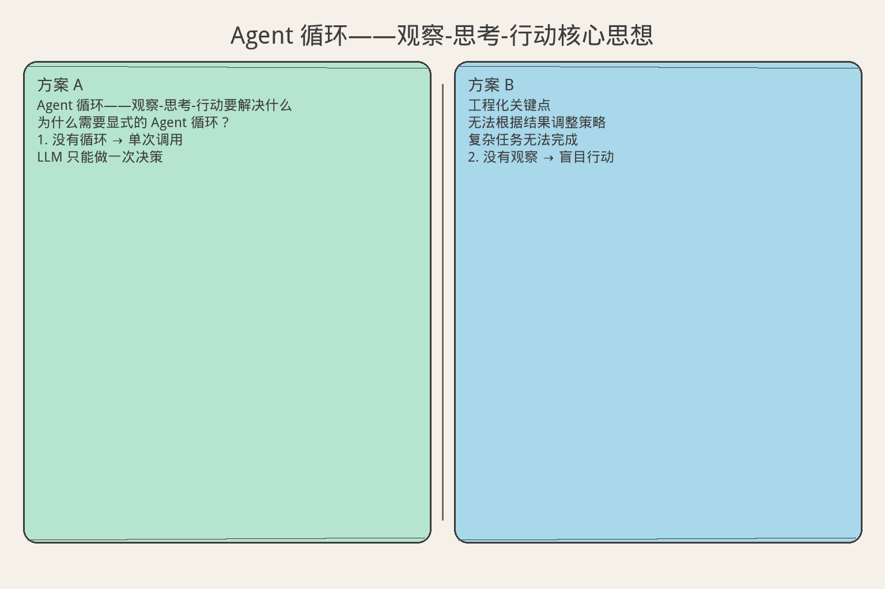
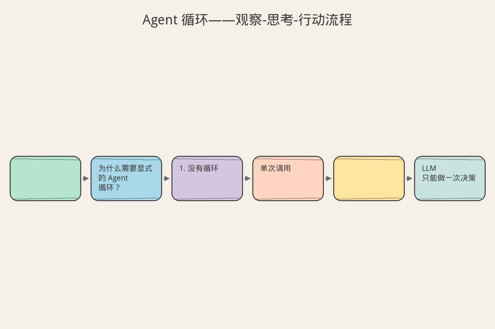
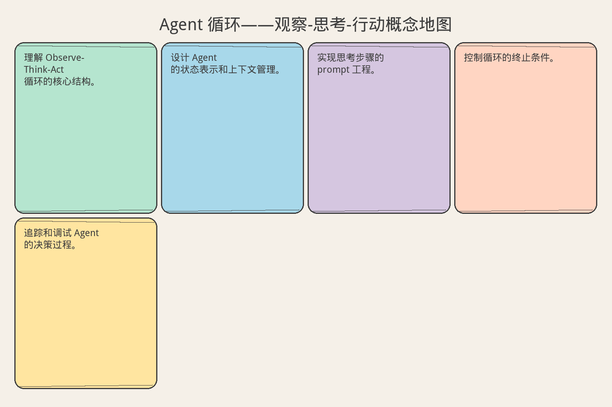

# AI Agent 工程（十三）：Agent 循环——观察-思考-行动

> Agent 的本质是一个循环：感知环境状态，推理下一步行动，执行并观察结果，再推理……直到任务完成或触发停止条件。这个循环的质量决定了 Agent 的能力上限。

**阅读建议：** 先阅读 [225 Agent 工具权限边界](225.agent-tool-permission-boundary-tutorial.md)，理解工具安全执行。

**环境要求：**
- Python **3.10+**
- 无需安装第三方库

---

## 目录

1. [你会学到什么](#你会学到什么)
2. [它解决什么问题](#它解决什么问题)
3. [OTA 循环模型](#ota-循环模型)
4. [最小示例](#最小示例)
5. [工程化版本](#工程化版本)
6. [常见失败模式](#常见失败模式)
7. [什么时候不要这么做](#什么时候不要这么做)
8. [生产环境注意事项](#生产环境注意事项)
9. [如何观测和评测](#如何观测和评测)
10. [和 RAG / 后端 / 前端的关系](#和-rag--后端--前端的关系)
11. [面试怎么讲](#面试怎么讲)
12. [下一步](#下一步)

## 你会学到什么

- 理解 Observe-Think-Act 循环的核心结构。
- 设计 Agent 的状态表示和上下文管理。
- 实现思考步骤的 prompt 工程。
- 控制循环的终止条件。
- 追踪和调试 Agent 的决策过程。

## 它解决什么问题


读下图时，先看「Agent 循环——观察-思考-行动核心思想」建立直觉。


```text
为什么需要显式的 Agent 循环？

1. 没有循环 → 单次调用
   LLM 只能做一次决策
   无法根据结果调整策略
   复杂任务无法完成

2. 没有观察 → 盲目行动
   不知道上一步的结果
   重复相同的错误
   无法收敛到答案

3. 没有思考 → 随机行动
   直接选工具，不推理
   不考虑后果
   效率极低

4. 没有停止 → 无限循环
   不知道什么时候该停
   浪费 token 和时间
   可能产生副作用

OTA 循环 = 感知 + 推理 + 执行 + 终止
  这是所有 Agent 模式的基础
  ReAct、Plan-and-Execute 都是它的变体
```

## OTA 循环模型

```text
┌─────────────────────────────────────────┐
│                                         │
│  ┌───────────┐                          │
│  │  OBSERVE  │ ← 环境状态、工具结果     │
│  └─────┬─────┘                          │
│        ▼                                │
│  ┌───────────┐                          │
│  │   THINK   │ ← 推理、规划、决策       │
│  └─────┬─────┘                          │
│        ▼                                │
│  ┌───────────┐                          │
│  │    ACT    │ ← 执行工具、生成回复     │
│  └─────┬─────┘                          │
│        │                                │
│        ▼                                │
│  ┌───────────┐     ┌──────────┐        │
│  │  EVALUATE │────→│  STOP?   │        │
│  └───────────┘     └──────────┘        │
│        │                  │             │
│        │ No               │ Yes         │
│        └──── 继续循环     └── 输出结果  │
│                                         │
└─────────────────────────────────────────┘

每个阶段的关键设计：
  OBSERVE：收集什么信息？格式是什么？
  THINK：用什么 prompt？输出什么结构？
  ACT：执行什么？怎么处理失败？
  EVALUATE：怎么判断完成？怎么判断该停？
```

## 最小示例


读下图时，先看「Agent 循环——观察-思考-行动流程」建立直觉。


### 最简 Agent 循环

```python
from dataclasses import dataclass, field
from typing import Any, Optional
from enum import Enum
import time


class ActionType(str, Enum):
    TOOL_CALL = "tool_call"
    FINAL_ANSWER = "final_answer"
    ASK_USER = "ask_user"


@dataclass
class Observation:
    """观察：环境状态"""
    content: str
    source: str  # "user", "tool", "system"
    timestamp: float = field(default_factory=time.time)


@dataclass
class Thought:
    """思考：推理过程"""
    reasoning: str
    action_type: ActionType
    tool_name: Optional[str] = None
    tool_params: Optional[dict] = None
    final_answer: Optional[str] = None


@dataclass
class Action:
    """行动：执行结果"""
    action_type: ActionType
    result: Any
    success: bool = True
    error: Optional[str] = None


class MinimalAgentLoop:
    """最简 Agent 循环"""

    def __init__(self, max_steps: int = 10):
        self.max_steps = max_steps
        self.history: list[dict] = []

    async def run(self, user_query: str, llm_call: callable,
                  tool_executor: callable) -> str:
        """运行 Agent 循环"""
        # 初始观察
        observations = [Observation(
            content=user_query, source="user"
        )]

        for step in range(self.max_steps):
            # THINK: 让 LLM 推理
            thought = await self._think(observations, llm_call)
            self.history.append({"step": step, "thought": thought})

            # 判断是否结束
            if thought.action_type == ActionType.FINAL_ANSWER:
                return thought.final_answer

            # ACT: 执行行动
            action = await self._act(thought, tool_executor)
            self.history.append({"step": step, "action": action})

            # OBSERVE: 将结果加入观察
            obs_content = (
                action.result if action.success
                else f"ERROR: {action.error}"
            )
            observations.append(Observation(
                content=str(obs_content),
                source="tool",
            ))

        return "Max steps reached without final answer"

    async def _think(self, observations: list[Observation],
                     llm_call: callable) -> Thought:
        """思考步骤"""
        # 构建 prompt
        context = "\n".join(
            f"[{obs.source}] {obs.content}" for obs in observations
        )
        prompt = (
            f"Based on the following observations, decide the next action.\n\n"
            f"Observations:\n{context}\n\n"
            f"Respond with:\n"
            f"- THOUGHT: your reasoning\n"
            f"- ACTION: tool_call(tool_name, params) or final_answer(text)\n"
        )

        # 调用 LLM（简化）
        response = await llm_call(prompt)

        # 解析响应（简化）
        if "final_answer" in response:
            return Thought(
                reasoning="Task complete",
                action_type=ActionType.FINAL_ANSWER,
                final_answer=response,
            )
        return Thought(
            reasoning="Need more info",
            action_type=ActionType.TOOL_CALL,
            tool_name="search",
            tool_params={"query": observations[-1].content},
        )

    async def _act(self, thought: Thought,
                   tool_executor: callable) -> Action:
        """行动步骤"""
        if thought.action_type == ActionType.TOOL_CALL:
            try:
                result = await tool_executor(
                    thought.tool_name, thought.tool_params
                )
                return Action(
                    action_type=ActionType.TOOL_CALL,
                    result=result,
                    success=True,
                )
            except Exception as e:
                return Action(
                    action_type=ActionType.TOOL_CALL,
                    result=None,
                    success=False,
                    error=str(e),
                )
        return Action(
            action_type=ActionType.FINAL_ANSWER,
            result=thought.final_answer,
        )
```

## 工程化版本

### 结构化 Agent 状态

```python
from dataclasses import dataclass, field
from typing import Any
import json


@dataclass
class AgentState:
    """Agent 完整状态"""
    # 任务信息
    task_id: str
    original_query: str
    current_step: int = 0
    max_steps: int = 15

    # 上下文
    observations: list[Observation] = field(default_factory=list)
    thoughts: list[Thought] = field(default_factory=list)
    actions: list[Action] = field(default_factory=list)

    # 工作记忆
    working_memory: dict[str, Any] = field(default_factory=dict)
    discovered_facts: list[str] = field(default_factory=list)
    pending_questions: list[str] = field(default_factory=list)

    # 状态标记
    is_complete: bool = False
    final_answer: Optional[str] = None
    stop_reason: str = ""

    # 资源使用
    total_tokens: int = 0
    total_tool_calls: int = 0
    total_latency_ms: float = 0

    def add_observation(self, content: str, source: str):
        self.observations.append(Observation(content=content, source=source))

    def add_thought(self, thought: Thought):
        self.thoughts.append(thought)
        self.current_step += 1

    def add_action(self, action: Action):
        self.actions.append(action)
        if action.action_type == ActionType.TOOL_CALL:
            self.total_tool_calls += 1

    def should_stop(self) -> tuple[bool, str]:
        """判断是否应该停止"""
        if self.is_complete:
            return True, "task_complete"
        if self.current_step >= self.max_steps:
            return True, "max_steps_reached"
        if self.total_tokens > 100000:
            return True, "token_budget_exhausted"
        # 检测循环
        if self._detect_loop():
            return True, "loop_detected"
        return False, ""

    def _detect_loop(self) -> bool:
        """检测重复行动（循环）"""
        if len(self.actions) < 4:
            return False
        # 检查最近 3 次行动是否相同
        recent = self.actions[-3:]
        if all(a.action_type == ActionType.TOOL_CALL for a in recent):
            # 简化的循环检测
            return False  # 实际需要比较参数
        return False

    def summary(self) -> str:
        """生成状态摘要"""
        return (
            f"Step {self.current_step}/{self.max_steps} | "
            f"Tools: {self.total_tool_calls} | "
            f"Tokens: {self.total_tokens} | "
            f"Facts: {len(self.discovered_facts)}"
        )
```

### 思考步骤的 Prompt 工程

```python
class ThinkPromptBuilder:
    """构建思考步骤的 prompt"""

    SYSTEM_TEMPLATE = """You are an AI agent solving a task step by step.

Available tools:
{tools_description}

Rules:
1. Think carefully before acting
2. Use tools to gather information
3. When you have enough information, provide the final answer
4. If a tool fails, try an alternative approach
5. Maximum {max_steps} steps allowed

Output format (JSON):
{{
  "thought": "Your reasoning about what to do next",
  "action": "tool_call" | "final_answer",
  "tool_name": "name of tool (if action=tool_call)",
  "tool_params": {{...}},
  "answer": "final answer (if action=final_answer)"
}}"""

    STEP_TEMPLATE = """Task: {task}

Previous steps:
{history}

Current observations:
{observations}

Working memory:
{memory}

What should you do next? Respond in JSON format."""

    def build_system_prompt(self, tools: list[dict], max_steps: int) -> str:
        tools_desc = "\n".join(
            f"- {t['name']}: {t['description']}" for t in tools
        )
        return self.SYSTEM_TEMPLATE.format(
            tools_description=tools_desc,
            max_steps=max_steps,
        )

    def build_step_prompt(self, state: AgentState) -> str:
        history = "\n".join(
            f"Step {i+1}: [{t.action_type.value}] "
            f"{t.reasoning[:100]}"
            for i, t in enumerate(state.thoughts)
        )
        observations = "\n".join(
            f"[{o.source}] {o.content[:200]}"
            for o in state.observations[-5:]  # 最近 5 条
        )
        memory = json.dumps(state.working_memory, ensure_ascii=False, indent=2)

        return self.STEP_TEMPLATE.format(
            task=state.original_query,
            history=history or "(none yet)",
            observations=observations,
            memory=memory,
        )
```

### 完整工程化 Agent

```python
class EngineeredAgent:
    """工程化 Agent"""

    def __init__(
        self,
        tools: dict[str, callable],
        llm_call: callable,
        max_steps: int = 15,
        token_budget: int = 100000,
    ):
        self.tools = tools
        self.llm_call = llm_call
        self.max_steps = max_steps
        self.token_budget = token_budget
        self.prompt_builder = ThinkPromptBuilder()
        self._trace: list[dict] = []

    async def run(self, query: str, context: dict | None = None) -> dict:
        """运行 Agent"""
        state = AgentState(
            task_id=f"task-{int(time.time())}",
            original_query=query,
            max_steps=self.max_steps,
        )
        state.add_observation(query, "user")

        if context:
            state.working_memory.update(context)

        # 主循环
        while True:
            # 检查停止条件
            should_stop, reason = state.should_stop()
            if should_stop:
                state.stop_reason = reason
                break

            # OBSERVE + THINK
            thought = await self._think_step(state)
            state.add_thought(thought)

            # 判断是否完成
            if thought.action_type == ActionType.FINAL_ANSWER:
                state.is_complete = True
                state.final_answer = thought.final_answer
                break

            # ACT
            action = await self._act_step(thought)
            state.add_action(action)

            # OBSERVE（行动结果）
            if action.success:
                state.add_observation(str(action.result), "tool")
                # 更新工作记忆
                self._update_memory(state, action)
            else:
                state.add_observation(f"ERROR: {action.error}", "system")

        return self._build_result(state)

    async def _think_step(self, state: AgentState) -> Thought:
        """思考步骤"""
        prompt = self.prompt_builder.build_step_prompt(state)
        system = self.prompt_builder.build_system_prompt(
            [{"name": n, "description": ""} for n in self.tools],
            self.max_steps,
        )

        response = await self.llm_call(
            messages=[
                {"role": "system", "content": system},
                {"role": "user", "content": prompt},
            ]
        )

        # 解析 JSON 响应
        try:
            data = json.loads(response)
            if data.get("action") == "final_answer":
                return Thought(
                    reasoning=data.get("thought", ""),
                    action_type=ActionType.FINAL_ANSWER,
                    final_answer=data.get("answer", ""),
                )
            return Thought(
                reasoning=data.get("thought", ""),
                action_type=ActionType.TOOL_CALL,
                tool_name=data.get("tool_name"),
                tool_params=data.get("tool_params", {}),
            )
        except json.JSONDecodeError:
            # 解析失败，当作最终回答
            return Thought(
                reasoning="Could not parse structured response",
                action_type=ActionType.FINAL_ANSWER,
                final_answer=response,
            )

    async def _act_step(self, thought: Thought) -> Action:
        """行动步骤"""
        if thought.tool_name not in self.tools:
            return Action(
                action_type=ActionType.TOOL_CALL,
                result=None,
                success=False,
                error=f"Tool '{thought.tool_name}' not found",
            )

        try:
            handler = self.tools[thought.tool_name]
            result = await handler(**(thought.tool_params or {}))
            return Action(
                action_type=ActionType.TOOL_CALL,
                result=result,
                success=True,
            )
        except Exception as e:
            return Action(
                action_type=ActionType.TOOL_CALL,
                result=None,
                success=False,
                error=str(e),
            )

    def _update_memory(self, state: AgentState, action: Action):
        """更新工作记忆"""
        if isinstance(action.result, dict):
            state.working_memory.update(action.result)
        elif isinstance(action.result, str):
            state.discovered_facts.append(action.result[:200])

    def _build_result(self, state: AgentState) -> dict:
        """构建最终结果"""
        return {
            "task_id": state.task_id,
            "success": state.is_complete,
            "answer": state.final_answer,
            "steps": state.current_step,
            "tool_calls": state.total_tool_calls,
            "stop_reason": state.stop_reason,
            "trace": self._trace,
        }
```

## 常见失败模式

### 1. 无限循环

```text
症状：
  Agent 反复调用同一工具，不收敛

原因：
  没有循环检测
  观察信息没有累积
  LLM 没有"记忆"之前的尝试

解决：
  1. 限制最大步数
  2. 检测重复行动
  3. 在 prompt 中展示历史
  4. 连续失败后强制停止
```

### 2. 上下文溢出

```text
症状：
  Agent 后期表现变差，忘记早期信息

原因：
  观察历史太长，超出上下文窗口
  关键信息被截断

解决：
  1. 滑动窗口：只保留最近 N 条
  2. 摘要压缩：定期总结历史
  3. 工作记忆：提取关键事实
  4. 分层：短期 + 长期记忆
```

### 3. 思考太浅

```text
症状：
  Agent 直接选工具，不推理

原因：
  prompt 没有要求推理
  或推理被截断

解决：
  强制 Chain-of-Thought
  要求先输出 reasoning 再输出 action
  用结构化输出保证格式
```

### 4. 观察不充分

```text
症状：
  Agent 缺少关键信息就开始行动

原因：
  没有主动收集信息
  工具结果没有完整传递

解决：
  在 prompt 中鼓励"先观察后行动"
  工具结果完整传递给下一步
  提供"信息是否充分"的自检
```

## 什么时候不要这么做

```text
不需要完整 OTA 循环的场景：

1. 单步任务
   → 一次工具调用就能完成
   → 直接调用，不需要循环

2. 固定 Pipeline
   → 步骤 predetermined
   → 用 workflow，不需要 Agent 循环

3. 实时性要求极高
   → 循环增加延迟
   → 用预计算 + 缓存

4. 简单 Q&A
   → 不需要工具
   → 直接 LLM 回答
```

## 生产环境注意事项

### 循环控制

```python
class LoopController:
    """Agent 循环控制器"""

    def __init__(
        self,
        max_steps: int = 15,
        max_time_seconds: float = 120,
        max_tokens: int = 100000,
        max_consecutive_failures: int = 3,
    ):
        self.max_steps = max_steps
        self.max_time = max_time_seconds
        self.max_tokens = max_tokens
        self.max_failures = max_consecutive_failures
        self._start_time = time.time()
        self._consecutive_failures = 0

    def should_continue(self, state: AgentState) -> tuple[bool, str]:
        """判断是否继续循环"""
        # 步数限制
        if state.current_step >= self.max_steps:
            return False, "max_steps"

        # 时间限制
        if time.time() - self._start_time > self.max_time:
            return False, "timeout"

        # Token 限制
        if state.total_tokens > self.max_tokens:
            return False, "token_budget"

        # 连续失败
        if self._consecutive_failures >= self.max_failures:
            return False, "consecutive_failures"

        return True, "continue"

    def record_result(self, success: bool):
        if success:
            self._consecutive_failures = 0
        else:
            self._consecutive_failures += 1
```

### 追踪和调试

```python
class AgentTracer:
    """Agent 执行追踪器"""

    def __init__(self):
        self._spans: list[dict] = []

    def start_span(self, step: int, phase: str, data: dict):
        self._spans.append({
            "step": step,
            "phase": phase,
            "start_time": time.time(),
            "data": data,
        })

    def end_span(self, step: int, phase: str, result: dict):
        for span in reversed(self._spans):
            if span["step"] == step and span["phase"] == phase:
                span["end_time"] = time.time()
                span["duration_ms"] = (
                    (span["end_time"] - span["start_time"]) * 1000
                )
                span["result"] = result
                break

    def get_trace(self) -> list[dict]:
        return self._spans

    def print_trace(self):
        """打印可读的追踪信息"""
        for span in self._spans:
            indent = "  " * span["step"]
            phase = span["phase"].upper()
            duration = span.get("duration_ms", 0)
            print(f"{indent}[Step {span['step']}] {phase} ({duration:.0f}ms)")
            if "result" in span:
                result_str = str(span["result"])[:100]
                print(f"{indent}  → {result_str}")
```

## 如何观测和评测

```text
Agent 循环关键指标：

1. 完成率
   - 成功完成的任务 / 总任务
   - 目标 > 90%

2. 平均步数
   - 完成任务的平均循环次数
   - 越少越好（效率高）

3. 工具调用成功率
   - 成功的工具调用 / 总调用
   - 目标 > 95%

4. Token 效率
   - 完成任务的 token 数
   - 对比基线

5. 循环检测率
   - 被循环检测终止的任务比例
   - 目标 < 2%
```

## 和 RAG / 后端 / 前端的关系

```text
OTA 循环在系统中的位置：

RAG 管道：
  检索是 Agent 的一个工具
  Agent 循环决定何时检索、检索什么
  检索结果作为 Observation 输入

后端 API：
  工具执行通过后端 API
  循环状态可以持久化（断点恢复）
  长时间循环用后台任务

前端展示：
  实时展示 Agent 的思考和行动
  流式输出中间步骤
  用户可以中途干预
```

## 面试怎么讲

```text
面试官：Agent 的核心循环怎么设计？

回答框架（2 分钟）：

"Agent 的核心是 Observe-Think-Act 循环：

 Observe：收集环境状态
  - 用户输入、工具结果、系统消息
  - 格式化为统一的 Observation

 Think：LLM 推理决策
  - 结构化 prompt 引导推理
  - 输出：reasoning + action
  - 强制 Chain-of-Thought

 Act：执行行动
  - 调用工具或生成最终回答
  - 处理失败和异常

 循环控制：
 - 最大步数（15步）
 - 时间预算（120秒）
 - Token 预算（100K）
 - 循环检测（重复行动）
 - 连续失败检测（3次）

 关键设计：
 - 工作记忆：跨步骤保持关键信息
 - 追踪器：每步记录，支持调试
 - 优雅降级：超限时给出部分答案"

追问 1：怎么防止无限循环？
  → 四重保护：步数限制 + 时间限制 + 循环检测 + 连续失败。
    检测到循环后强制停止，返回当前最佳结果。

追问 2：上下文太长怎么办？
  → 滑动窗口 + 摘要压缩。
    只保留最近 5 条观察。
    关键事实提取到工作记忆。

追问 3：怎么调试 Agent？
  → AgentTracer 记录每步的输入输出。
    可以回放整个决策过程。
    找到推理出错的具体步骤。
```

## 实战案例：研究助手 Agent

### 场景：多步研究任务

```python
class ResearchAgent:
    """研究助手 Agent：多步信息收集 + 综合"""

    def __init__(self, llm_call: callable):
        self.llm_call = llm_call
        self.tools = {
            "search_web": self._search_web,
            "read_article": self._read_article,
            "summarize": self._summarize,
        }
        self.tracer = AgentTracer()

    async def research(self, question: str) -> dict:
        """执行研究任务"""
        state = AgentState(
            task_id=f"research-{int(time.time())}",
            original_query=question,
            max_steps=10,
        )
        state.add_observation(question, "user")
        controller = LoopController(max_steps=10, max_time_seconds=60)

        while True:
            should_continue, reason = controller.should_continue(state)
            if not should_continue:
                state.stop_reason = reason
                break

            # Think
            thought = await self._research_think(state)
            state.add_thought(thought)

            if thought.action_type == ActionType.FINAL_ANSWER:
                state.is_complete = True
                state.final_answer = thought.final_answer
                break

            # Act
            self.tracer.start_span(state.current_step, "act", {
                "tool": thought.tool_name,
            })
            action = await self._execute_tool(thought)
            state.add_action(action)
            controller.record_result(action.success)
            self.tracer.end_span(state.current_step, "act", {
                "success": action.success,
            })

            # Observe
            if action.success:
                state.add_observation(str(action.result)[:500], "tool")
                if isinstance(action.result, str):
                    state.discovered_facts.append(action.result[:200])
            else:
                state.add_observation(f"FAILED: {action.error}", "system")

        return {
            "question": question,
            "answer": state.final_answer,
            "facts_found": len(state.discovered_facts),
            "steps": state.current_step,
            "success": state.is_complete,
        }

    async def _research_think(self, state: AgentState) -> Thought:
        """研究任务的思考逻辑"""
        facts = "\n".join(f"- {f}" for f in state.discovered_facts)
        prompt = (
            f"Research question: {state.original_query}\n\n"
            f"Facts discovered so far:\n{facts or '(none)'}\n\n"
            f"Steps taken: {state.current_step}\n\n"
            f"Decide: search for more info, or provide final answer?\n"
            f"If you have 3+ relevant facts, provide the answer."
        )
        response = await self.llm_call(prompt)

        # 简化解析
        if len(state.discovered_facts) >= 3 or state.current_step >= 8:
            return Thought(
                reasoning="Enough facts collected",
                action_type=ActionType.FINAL_ANSWER,
                final_answer=response,
            )
        return Thought(
            reasoning="Need more information",
            action_type=ActionType.TOOL_CALL,
            tool_name="search_web",
            tool_params={"query": state.original_query},
        )

    async def _execute_tool(self, thought: Thought) -> Action:
        handler = self.tools.get(thought.tool_name)
        if not handler:
            return Action(
                action_type=ActionType.TOOL_CALL,
                result=None, success=False,
                error=f"Unknown tool: {thought.tool_name}",
            )
        try:
            result = await handler(**(thought.tool_params or {}))
            return Action(
                action_type=ActionType.TOOL_CALL,
                result=result, success=True,
            )
        except Exception as e:
            return Action(
                action_type=ActionType.TOOL_CALL,
                result=None, success=False, error=str(e),
            )

    async def _search_web(self, query: str) -> str:
        return f"Search results for '{query}': [result1, result2, result3]"

    async def _read_article(self, url: str) -> str:
        return f"Article content from {url}: ..."

    async def _summarize(self, text: str) -> str:
        return f"Summary: {text[:100]}..."
```

### 循环设计检查清单

```text
Agent 循环设计检查：

□ 最大步数限制（建议 10-20）
□ 时间预算（建议 60-120s）
□ Token 预算（建议 50K-100K）
□ 循环检测（重复行动）
□ 连续失败检测（3 次失败停止）
□ 工作记忆（跨步骤保持信息）
□ 观察窗口（只保留最近 N 条）
□ 结构化输出（JSON 格式）
□ 追踪器（每步记录）
□ 优雅降级（超限返回部分结果）
□ 错误反馈（失败信息传给 LLM）
□ 进度反馈（让用户知道在做什么）
```

---

> **核心要点：** OTA 循环是 Agent 的心跳。观察要全、思考要深、行动要稳。三者缺一不可。

## OTA 循环调优指南

```text
观察阶段调优：
- 信息不足 → 增加观察源（工具结果、用户反馈）
- 信息过载 → 过滤和摘要（只保留相关的）
- 观察延迟 → 异步收集，不阻塞循环

思考阶段调优：
- 决策质量差 → 改进 prompt、加 few-shot
- 决策太慢 → 简化选项、减少工具数
- 循环思考 → 强制停止条件（最大轮次）

行动阶段调优：
- 执行失败 → 重试 + 降级
- 副作用大 → 加确认步骤
- 结果不确定 → 加验证步骤

整体调优：
- 循环次数多 → 检查是否缺少信息或工具
- 总延迟高 → 并行化观察和行动
- token 成本高 → 压缩历史、精简 prompt

常见反模式：
- 只观察不行动（分析瘫痪）
- 只行动不观察（盲目执行）
- 不思考直接行动（缺乏规划）
```

## 下一步


读下图时，先看「Agent 循环——观察-思考-行动概念地图」建立直觉。


下一篇 [227 ReAct Agent 模式](227.react-agent-pattern-tutorial.md) 会在 OTA 循环基础上，深入 ReAct（Reasoning + Acting）的具体实现。
