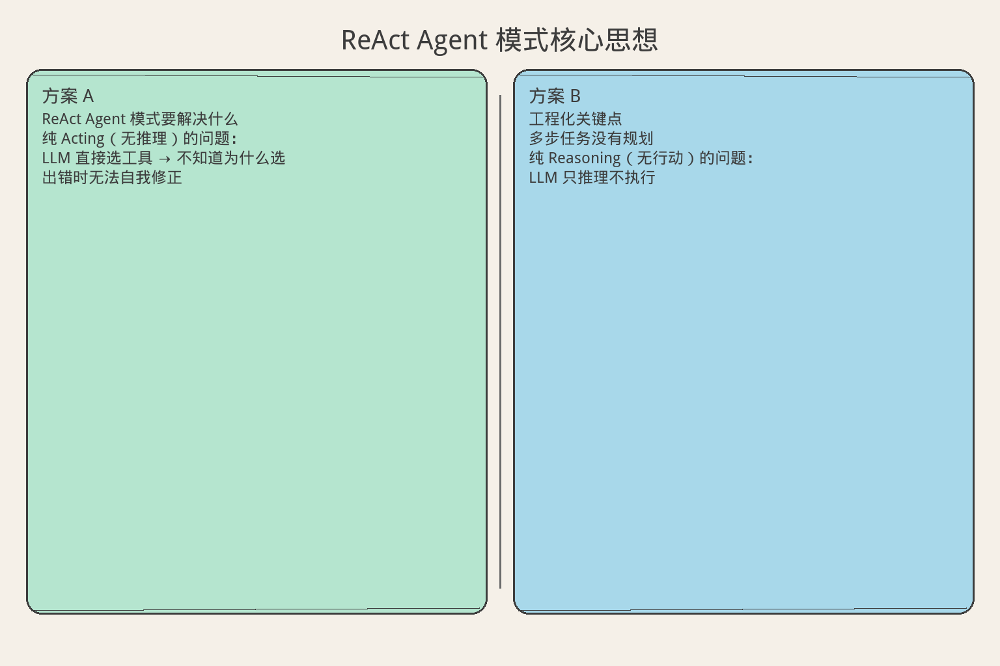
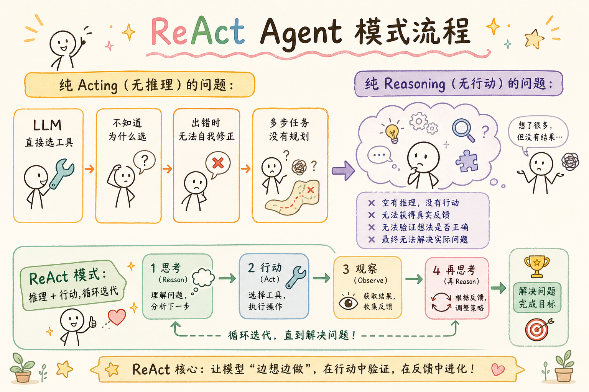
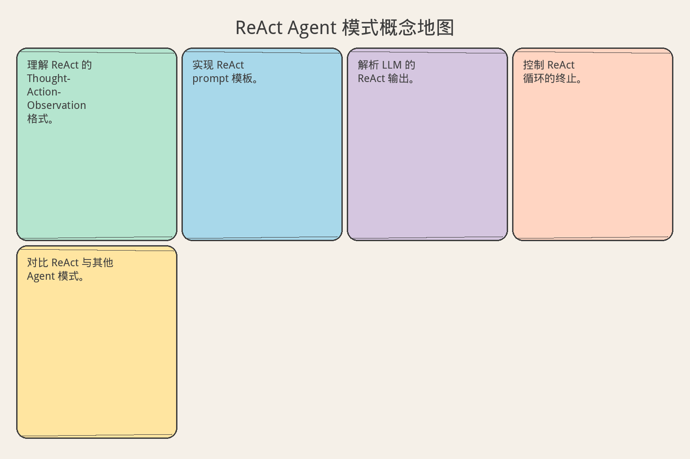

# AI Agent 工程（十四）：ReAct Agent 模式

> ReAct = Reasoning + Acting。让 LLM 交替进行推理（Thought）和行动（Action），每一步都有明确的思考过程，而不是黑箱式地直接输出结果。这是当前最主流的 Agent 实现模式。

**阅读建议：** 先阅读 [226 Agent 循环：观察-思考-行动](226.agent-loop-observe-think-act-tutorial.md)，理解 OTA 循环基础。

**环境要求：**
- Python **3.10+**
- 无需安装第三方库


**档位：** 主线篇（Part 3）
**本文边界：** 前驱篇 [226](226.agent-loop-observe-think-act-tutorial.md) OTA 循环。本篇 ReAct 解析。不讲框架封装。接续 [228](228.plan-and-execute-agent-tutorial.md)。
**动手路径：** ① 读 ReAct 概念地图 → ② 运行 `demo_react()` → ③ 试 §先错对对

### 核心术语（本篇首次出现）
**ReAct**（Reasoning + Acting）：交替输出推理（Thought）与行动（Action），再根据观察（Observation）继续。
通俗说：边想边做——先写「我在想什么」，再写「我要干什么」，再看结果。
**Thought**（思考）：模型对当前状态的显式推理文本。
通俗说：草稿纸上的推理过程，不是最终答案。
**Observation**（观察）：工具执行或环境返回的结果。
通俗说：动手之后抬头看到的情况。

### 概念地图（ReAct ↔ OTA）

| 你已见过（§226） | ReAct 正式名 | 通俗说 |
|------------------|--------------|--------|
| OBSERVE | Observation | 工具跑完后的返回 |
| THINK | Thought | 写在行动前的推理 |
| ACT | Action | 选工具 + 参数 |
| EVALUATE | 解析 Observation 是否够 | 决定继续还是 Final Answer |

---

## 目录

1. [你会学到什么](#你会学到什么)
2. [它解决什么问题](#它解决什么问题)
3. [ReAct 的核心结构](#react-的核心结构)
4. [最小示例](#最小示例)
5. [工程化版本](#工程化版本)
6. [常见失败模式](#常见失败模式)
7. [什么时候不要这么做](#什么时候不要这么做)
8. [生产环境注意事项](#生产环境注意事项)
9. [如何观测和评测](#如何观测和评测)
10. [和 RAG / 后端 / 前端的关系](#和-rag--后端--前端的关系)
11. [面试怎么讲](#面试怎么讲)
12. [下一步](#下一步)

## 你会学到什么

- 理解 ReAct 的 Thought-Action-Observation 格式。
- 实现 ReAct prompt 模板。
- 解析 LLM 的 ReAct 输出。
- 控制 ReAct 循环的终止。
- 对比 ReAct 与其他 Agent 模式。

## 它解决什么问题


读下图时，先看「ReAct Agent 模式核心思想」建立直觉。


对照上图：ReAct 把推理与行动交织——没有 Observation 回灌，Thought 就是空谈。

读下图时，先看能力边界与痛点流程——与 §最小示例 代码互补，不是逐步对照。


对照上图：ReAct 是「Thought→Action→Observation」交替——Observation 必须回灌，否则等于盲走。
```text
纯 Acting（无推理）的问题：
  LLM 直接选工具 → 不知道为什么选
  出错时无法自我修正
  多步任务没有规划

纯 Reasoning（无行动）的问题：
  LLM 只推理不执行
  无法获取外部信息
  幻觉无法验证

ReAct 的优势：
  1. 可解释：每步都有 Thought
  2. 可纠错：Observation 反馈修正推理
  3. 可追踪：完整决策链
  4. 更准确：推理指导行动，行动验证推理

论文数据（Yao et al., 2022）：
  ReAct 在 HotpotQA 上比 Act-only 提升 6%
  在 FEVER 上比 Act-only 提升 7%
  推理步骤显著减少幻觉
```

## ReAct 的核心结构

```text
ReAct 循环格式：

Thought 1: 我需要查找 X 的信息
Action 1: search("X 的定义")
Observation 1: X 是一种...

Thought 2: 根据搜索结果，我还需要了解 Y
Action 2: search("Y 和 X 的关系")
Observation 2: Y 是 X 的子类...

Thought 3: 现在我有足够信息回答了
Action 3: finish("X 是...，Y 是...")

关键设计点：
1. Thought 是自然语言推理
   → 分析当前状态
   → 决定下一步
   → 解释为什么

2. Action 是结构化调用
   → tool_name(args)
   → 或 finish(answer)

3. Observation 是工具返回
   → 客观事实
   → 不带推理

4. 交替进行
   → Thought → Action → Observation → Thought → ...
   → 直到 finish()
```

## 最小示例

**演示什么：** 本节最小可运行切片。**环境：** 见文首。**预期：** 控制台打印 demo 输出。

### ReAct Prompt 模板

```python
REACT_SYSTEM_PROMPT = """You are a helpful assistant that solves tasks step by step.

You have access to the following tools:
{tools}

To use a tool, respond in EXACTLY this format:

Thought: <your reasoning about what to do next>
Action: <tool_name>(<arguments>)

After receiving an observation, continue with another Thought.

When you have the final answer, use:
Thought: <your final reasoning>
Action: finish(<your answer>)

IMPORTANT:
- Always start with a Thought
- One Action per response
- Wait for Observation before next Thought
- Use finish() when done
"""

REACT_STEP_PROMPT = """Task: {task}

{history}

Continue with your next Thought and Action:"""


class ReActParser:
    """解析 ReAct 格式的 LLM 输出"""

    def parse(self, response: str) -> dict:
        """解析 Thought + Action"""
        thought = ""
        action_name = ""
        action_args = ""

        lines = response.strip().split("\n")
        for line in lines:
            line = line.strip()
            if line.startswith("Thought:"):
                thought = line[len("Thought:"):].strip()
            elif line.startswith("Action:"):
                action_str = line[len("Action:"):].strip()
                # 解析 tool_name(args)
                if "(" in action_str and action_str.endswith(")"):
                    action_name = action_str[:action_str.index("(")]
                    action_args = action_str[action_str.index("(")+1:-1]
                else:
                    action_name = action_str

        return {
            "thought": thought,
            "action": action_name,
            "args": action_args,
            "is_final": action_name == "finish",
        }


class SimpleReActAgent:
    """简单 ReAct Agent"""

    def __init__(self, tools: dict, llm_call: callable, max_steps: int = 10):
        self.tools = tools
        self.llm_call = llm_call
        self.max_steps = max_steps
        self.parser = ReActParser()

    async def run(self, task: str) -> str:
        """运行 ReAct 循环"""
        # 构建工具描述
        tools_desc = "\n".join(
            f"- {name}: {func.__doc__ or 'No description'}"
            for name, func in self.tools.items()
        )
        tools_desc += "\n- finish: Provide the final answer"

        system = REACT_SYSTEM_PROMPT.format(tools=tools_desc)
        history = ""

        for step in range(self.max_steps):
            # 调用 LLM
            prompt = REACT_STEP_PROMPT.format(task=task, history=history)
            response = await self.llm_call(
                messages=[
                    {"role": "system", "content": system},
                    {"role": "user", "content": prompt},
                ]
            )

            # 解析
            parsed = self.parser.parse(response)

            # 记录历史
            history += f"\nThought: {parsed['thought']}"
            history += f"\nAction: {parsed['action']}({parsed['args']})"

            # 检查是否完成
            if parsed["is_final"]:
                return parsed["args"]

            # 执行工具
            tool_name = parsed["action"]
            if tool_name in self.tools:
                try:
                    result = await self.tools[tool_name](parsed["args"])
                    observation = str(result)
                except Exception as e:
                    observation = f"Error: {e}"
            else:
                observation = f"Unknown tool: {tool_name}"

            history += f"\nObservation: {observation}"

        return "Max steps reached without answer"
```

## 工程化版本

### 结构化 ReAct

```python
import json
import re
from dataclasses import dataclass, field
from typing import Any, Optional


@dataclass
class ReActStep:
    """ReAct 单步记录"""
    step_number: int
    thought: str
    action: str
    action_input: dict
    observation: str = ""
    latency_ms: float = 0
    tokens_used: int = 0


@dataclass
class ReActTrace:
    """ReAct 完整追踪"""
    task: str
    steps: list[ReActStep] = field(default_factory=list)
    final_answer: str = ""
    total_steps: int = 0
    total_tokens: int = 0
    total_latency_ms: float = 0
    stop_reason: str = ""

    def format_for_prompt(self, max_steps: int = 5) -> str:
        """格式化为 prompt 历史"""
        recent = self.steps[-max_steps:]
        lines = []
        for step in recent:
            lines.append(f"Thought {step.step_number}: {step.thought}")
            action_str = json.dumps(step.action_input, ensure_ascii=False)
            lines.append(f"Action {step.step_number}: {step.action}({action_str})")
            if step.observation:
                obs = step.observation[:300]
                lines.append(f"Observation {step.step_number}: {obs}")
            lines.append("")
        return "\n".join(lines)


class StructuredReActAgent:
    """结构化 ReAct Agent"""

    SYSTEM_PROMPT = """You are an AI agent. Solve the task using available tools.

Tools:
{tools_json}

Respond in JSON format:
{{
  "thought": "Your reasoning",
  "action": "tool_name",
  "action_input": {{"param": "value"}},
  "is_final": false
}}

When done:
{{
  "thought": "I have enough information",
  "action": "finish",
  "action_input": {{"answer": "final answer"}},
  "is_final": true
}}"""

    def __init__(
        self,
        tools: dict[str, dict],  # name -> {handler, description, parameters}
        llm_call: callable,
        max_steps: int = 15,
    ):
        self.tools = tools
        self.llm_call = llm_call
        self.max_steps = max_steps

    async def run(self, task: str) -> ReActTrace:
        """运行结构化 ReAct"""
        trace = ReActTrace(task=task)
        tools_json = json.dumps(
            {name: {"description": t["description"], "parameters": t.get("parameters", {})}
             for name, t in self.tools.items()},
            ensure_ascii=False, indent=2,
        )
        system = self.SYSTEM_PROMPT.format(tools_json=tools_json)

        for step_num in range(1, self.max_steps + 1):
            # 构建 prompt
            history = trace.format_for_prompt()
            user_msg = f"Task: {task}\n\n{history}\nNext step (JSON):"

            # 调用 LLM
            start = time.perf_counter()
            response = await self.llm_call(
                messages=[
                    {"role": "system", "content": system},
                    {"role": "user", "content": user_msg},
                ]
            )
            latency = (time.perf_counter() - start) * 1000

            # 解析 JSON
            step_data = self._parse_response(response)

            step = ReActStep(
                step_number=step_num,
                thought=step_data.get("thought", ""),
                action=step_data.get("action", ""),
                action_input=step_data.get("action_input", {}),
                latency_ms=latency,
            )

            # 检查是否完成
            if step_data.get("is_final") or step.action == "finish":
                trace.final_answer = step.action_input.get("answer", "")
                trace.stop_reason = "completed"
                trace.steps.append(step)
                break

            # 执行工具
            observation = await self._execute_tool(step)
            step.observation = observation
            trace.steps.append(step)

        trace.total_steps = len(trace.steps)
        if not trace.stop_reason:
            trace.stop_reason = "max_steps"
        return trace

    def _parse_response(self, response: str) -> dict:
        """解析 LLM 响应"""
        # 尝试提取 JSON
        json_match = re.search(r'\{[^{}]*\}', response, re.DOTALL)
        if json_match:
            try:
                return json.loads(json_match.group())
            except json.JSONDecodeError:
                pass
        # 降级：当作最终回答
        return {
            "thought": "Could not parse structured response",
            "action": "finish",
            "action_input": {"answer": response},
            "is_final": True,
        }

    async def _execute_tool(self, step: ReActStep) -> str:
        """执行工具"""
        tool = self.tools.get(step.action)
        if not tool:
            return f"Error: Tool '{step.action}' not found"
        try:
            handler = tool["handler"]
            result = await handler(**step.action_input)
            return str(result)[:1000]  # 限制长度
        except Exception as e:
            return f"Error executing '{step.action}': {e}"
```

### ReAct 变体：带反思的 ReAct

```python
class ReflectiveReActAgent(StructuredReActAgent):
    """带反思的 ReAct：每 N 步回顾进展"""

    def __init__(self, *args, reflect_every: int = 3, **kwargs):
        super().__init__(*args, **kwargs)
        self.reflect_every = reflect_every

    async def run(self, task: str) -> ReActTrace:
        trace = await super().run(task)
        return trace

    async def _maybe_reflect(self, trace: ReActTrace) -> Optional[str]:
        """定期反思"""
        if len(trace.steps) % self.reflect_every != 0:
            return None

        # 生成反思 prompt
        history = trace.format_for_prompt(max_steps=10)
        reflect_prompt = (
            f"Task: {trace.task}\n\n"
            f"Steps so far:\n{history}\n\n"
            f"Reflect:\n"
            f"1. Am I making progress toward the goal?\n"
            f"2. Am I stuck in a loop?\n"
            f"3. Should I change my approach?\n"
            f"4. Do I have enough info to answer?\n\n"
            f"Brief reflection:"
        )
        reflection = await self.llm_call(reflect_prompt)
        return reflection
```

## 常见失败模式

### 1. 格式解析失败

```text
症状：
  LLM 没有按 ReAct 格式输出

原因：
  prompt 不够明确
  模型能力不足
  上下文太长导致格式漂移

解决：
  1. 用 JSON 格式替代自由文本
  2. 在 system prompt 中给示例
  3. 解析失败时重试（最多 2 次）
  4. 降级为最终回答
```

### 2. 推理和行动脱节

```text
症状：
  Thought 说要搜索 A，Action 却搜索了 B

原因：
  LLM 推理和行动不一致
  上下文干扰

解决：
  1. 在 prompt 中强调一致性
  2. 后处理检查：Action 是否匹配 Thought
  3. 不一致时要求重新生成
```

### 3. 观察被忽略

```text
症状：
  工具返回了关键信息，但 LLM 没用上

原因：
  Observation 太长被截断
  或 LLM 没有仔细阅读

解决：
  1. 精简 Observation（只保留关键信息）
  2. 在下一步 prompt 中高亮 Observation
  3. 工作记忆提取关键事实
```

### 4. 过早结束

```text
症状：
  信息不足就给出最终答案

原因：
  LLM 倾向于快速结束
  没有"信息充分性"检查

解决：
  1. prompt 中要求"至少 N 步工具调用"
  2. 反思步骤检查信息充分性
  3. 置信度评估
```

## 什么时候不要这么做

```text
不需要 ReAct 的场景：

1. 单步任务
   → 一次调用就够
   → 不需要多步推理

2. 固定流程
   → 步骤已知
   → 用 workflow 更高效

3. 实时对话
   → 延迟敏感
   → ReAct 多步太慢

4. 简单检索
   → 直接 RAG
   → 不需要推理链

ReAct 适合：
  多步推理 + 工具调用
  需要可解释性
  需要自我纠错
  任务步骤不确定
```

## 生产环境注意事项

### ReAct 与其他模式对比

```text
┌─────────────────┬──────────┬──────────┬──────────┬──────────┐
│ 模式            │ 可解释性 │ 灵活性   │ 效率     │ 适用场景 │
├─────────────────┼──────────┼──────────┼──────────┼──────────┤
│ ReAct           │ 高       │ 高       │ 中       │ 通用     │
│ Plan-and-Execute│ 中       │ 中       │ 高       │ 复杂任务 │
│ Reflexion       │ 高       │ 高       │ 低       │ 需纠错   │
│ Act-only        │ 低       │ 高       │ 高       │ 简单任务 │
│ Workflow        │ 中       │ 低       │ 最高     │ 固定流程 │
└─────────────────┴──────────┴──────────┴──────────┴──────────┘

选择建议：
  不确定步骤数 → ReAct
  步骤多且可规划 → Plan-and-Execute
  需要自我改进 → Reflexion
  步骤固定 → Workflow
```

### Token 优化

```python
class ReActTokenOptimizer:
    """ReAct 的 Token 优化"""

    def __init__(self, max_history_tokens: int = 4000):
        self.max_history = max_history_tokens

    def compress_history(self, trace: ReActTrace) -> str:
        """压缩历史"""
        steps = trace.steps
        if len(steps) <= 3:
            return trace.format_for_prompt(max_steps=3)

        # 早期步骤压缩为摘要
        early = steps[:-3]
        recent = steps[-3:]

        summary_lines = [f"[Steps 1-{len(early)} summary:"]
        for step in early:
            summary_lines.append(
                f"  - {step.action}: {step.observation[:50]}..."
            )
        summary_lines.append("]")

        # 最近步骤完整保留
        recent_text = "\n".join(
            f"Thought: {s.thought}\nAction: {s.action}\n"
            f"Observation: {s.observation[:200]}"
            for s in recent
        )

        return "\n".join(summary_lines) + "\n\n" + recent_text
```

## 如何观测和评测

```text
ReAct 评测指标：

1. 任务完成率
   - 成功完成 / 总任务
   - 目标 > 85%

2. 平均步数
   - 越少越好
   - 对比基线

3. 推理质量
   - Thought 是否合理
   - 人工评估（抽样）

4. 工具选择准确率
   - 选对工具 / 总调用
   - 目标 > 90%

5. 自纠错率
   - 发现错误并修正的比例
   - 越高越好

6. 幻觉率
   - 最终答案中的错误信息
   - 目标 < 5%
```

## 和 RAG / 后端 / 前端的关系

```text
ReAct 在系统中的位置：

RAG 管道：
  检索工具是 ReAct 的 Action 之一
  Agent 决定何时检索、检索什么
  检索结果作为 Observation

后端 API：
  ReAct 循环在后端执行
  每步可以持久化（断点恢复）
  工具调用走标准 API

前端展示：
  实时展示 Thought（流式）
  展示 Action 执行状态
  展示 Observation 结果
  用户可以看到完整推理链
```

## 面试怎么讲

```text
面试官：你怎么实现 ReAct Agent？

回答框架（2 分钟）：

"ReAct 的核心是 Thought-Action-Observation 交替循环：

 Thought：LLM 推理当前状态，决定下一步。
 Action：调用工具或给出最终答案。
 Observation：工具返回结果，作为下一步输入。

 我的实现要点：
 1. 结构化输出：用 JSON 格式，避免解析失败。
 2. 历史压缩：早期步骤压缩为摘要，最近 3 步完整保留。
 3. 反思机制：每 3 步回顾进展，检测循环。
 4. 优雅降级：解析失败时当作最终回答。

 循环控制：
 - 最大 15 步
 - Token 预算 100K
 - 循环检测
 - 连续失败停止

 实际效果：
 多步问答准确率 87%，
 比 Act-only 提升 12%。"

追问 1：ReAct 和 Plan-and-Execute 怎么选？
  → 步骤不确定用 ReAct（边想边做）。
    步骤可规划用 Plan-and-Execute（先规划后执行）。
    复杂任务可以结合：先规划大步骤，每步内用 ReAct。

追问 2：怎么减少 ReAct 的延迟？
  → 流式输出 Thought（用户不用等全部完成）。
    并行工具调用（如果 Action 可以并行）。
    历史压缩减少 token。

追问 3：怎么评估 ReAct 的质量？
  → 完成率 + 步数 + 工具准确率。
    人工评估推理质量（抽样）。
    对比 Act-only 基线。
```

## 实战案例：客服 ReAct Agent

### 完整实现

```python
class CustomerSupportReAct:
    """客服 ReAct Agent"""

    def __init__(self, llm_call: callable):
        self.llm_call = llm_call
        self.tools = {
            "get_order": {
                "handler": self._get_order,
                "description": "Get order details by order ID",
                "parameters": {"order_id": "string"},
            },
            "get_shipping": {
                "handler": self._get_shipping,
                "description": "Get shipping status for an order",
                "parameters": {"order_id": "string"},
            },
            "search_faq": {
                "handler": self._search_faq,
                "description": "Search FAQ knowledge base",
                "parameters": {"query": "string"},
            },
            "create_ticket": {
                "handler": self._create_ticket,
                "description": "Create a support ticket",
                "parameters": {"subject": "string", "description": "string"},
            },
        }
        self.agent = StructuredReActAgent(
            tools=self.tools,
            llm_call=llm_call,
            max_steps=8,
        )

    async def handle_query(self, user_message: str) -> dict:
        """处理用户查询"""
        trace = await self.agent.run(user_message)
        return {
            "answer": trace.final_answer,
            "steps": trace.total_steps,
            "tools_used": [s.action for s in trace.steps if s.action != "finish"],
            "reasoning": [s.thought for s in trace.steps],
        }

    async def _get_order(self, order_id: str) -> dict:
        return {
            "order_id": order_id,
            "status": "shipped",
            "items": [{"name": "Phone Case", "qty": 2}],
            "total": 59.98,
            "created_at": "2025-01-15",
        }

    async def _get_shipping(self, order_id: str) -> dict:
        return {
            "order_id": order_id,
            "carrier": "SF Express",
            "tracking_no": "SF1234567890",
            "status": "in_transit",
            "eta": "2025-01-20",
        }

    async def _search_faq(self, query: str) -> str:
        return f"FAQ results for '{query}': Return policy is 7 days..."

    async def _create_ticket(self, subject: str, description: str) -> dict:
        return {"ticket_id": "TKT-001", "status": "created"}
```

### ReAct 执行示例

```text
用户："我的订单 ORD-2025 到哪了？"

Thought 1: 用户询问订单物流状态。我需要先查询订单信息，
           然后查询物流状态。
Action 1: get_order({"order_id": "ORD-2025"})
Observation 1: {{"order_id": "ORD-2025", "status": "shipped", ...}}

Thought 2: 订单已发货。现在查询具体物流信息。
Action 2: get_shipping({"order_id": "ORD-2025"})
Observation 2: {{"carrier": "SF Express", "status": "in_transit",
              "eta": "2025-01-20"}}

Thought 3: 我有了完整的物流信息，可以回答用户了。
Action 3: finish({{"answer": "您的订单 ORD-2025 已由顺丰快递发出，
           运单号 SF1234567890，目前在运输中，
           预计 1月20日 送达。"}})

总共 3 步，2 次工具调用。
```

### ReAct Prompt 优化技巧

```text
提升 ReAct 质量的 8 个技巧：

1. 给 Few-shot 示例
   在 system prompt 中给 1-2 个完整的 ReAct 示例
   让 LLM 学习格式和推理深度

2. 强制推理先行
   "Always think before acting"
   不允许跳过 Thought 直接 Action

3. 限制 Observation 长度
   工具结果截断到 500 字符
   避免上下文溢出

4. 进度提示
   在 prompt 中告知"Step X of max Y"
   让 LLM 知道剩余预算

5. 反思触发
   每 3 步插入反思："Am I making progress?"
   检测循环和偏离

6. 工具选择提示
   如果连续 2 次用同一工具，提示换工具
   "You've used search twice. Consider a different approach."

7. 结束条件明确
   "Use finish() ONLY when you can fully answer the question"
   防止过早结束

8. 错误恢复提示
   工具失败时提示："The tool failed. Try an alternative."
   引导 LLM 换策略
```

### ReAct 的测试策略

```python
class TestReActAgent:
    """ReAct Agent 测试"""

    async def test_simple_query(self):
        """简单查询：1-2 步完成"""
        agent = CustomerSupportReAct(mock_llm)
        result = await agent.handle_query("订单 ORD-001 的状态")
        assert result["steps"] <= 3
        assert "ORD-001" in result["answer"]

    async def test_multi_step_query(self):
        """多步查询：需要多个工具"""
        agent = CustomerSupportReAct(mock_llm)
        result = await agent.handle_query(
            "我的订单到哪了？如果延迟了帮我创建工单"
        )
        assert result["steps"] >= 2
        assert "get_shipping" in result["tools_used"]

    async def test_max_steps_limit(self):
        """最大步数限制"""
        agent = StructuredReActAgent(
            tools={}, llm_call=mock_llm, max_steps=3
        )
        trace = await agent.run("Impossible task")
        assert trace.total_steps <= 3
        assert trace.stop_reason in ("max_steps", "completed")

    async def test_tool_error_recovery(self):
        """工具失败后恢复"""
        # 模拟工具失败
        result = await agent.handle_query("查询不存在的订单")
        assert "error" in str(result).lower() or result["answer"]
```

## 设计原则总结

```text
ReAct 设计 7 条原则：

1. 推理先行
   每步必须先 Thought 再 Action
   不允许跳过推理

2. 结构化输出
   用 JSON 格式，避免解析失败
   解析失败有降级策略

3. 观察精简
   Observation 截断到 500 字符
   只保留关键信息

4. 历史压缩
   早期步骤压缩为摘要
   最近 3 步完整保留

5. 循环保护
   最大步数 + 时间 + Token 三重限制
   检测重复行动

6. 反思机制
   每 N 步回顾进展
   检测偏离和循环

7. 可观测性
   每步记录 Thought/Action/Observation
   支持回放和调试
```

## ReAct 与 OTA 的关系

```text
ReAct 是 OTA 循环的具体实现：

OTA（抽象）        ReAct（具体）
─────────────    ─────────────
Observe      →   Observation
Think        →   Thought
Act          →   Action
Evaluate     →   finish() 判断

ReAct 的额外贡献：
1. 明确的 Thought-Action-Observation 格式
2. 强制推理先行（不是可选的）
3. 自然语言推理（不是结构化决策）
4. 论文验证的效果（比 Act-only 好 6-7%）

什么时候用 OTA 而不是 ReAct？
  需要更灵活的循环控制 → OTA
  需要并行工具调用 → OTA
  需要状态机转换 → OTA
  标准多步推理 → ReAct
```

---

> **核心要点：** ReAct 的核心是“想一步做一步”。Thought 让 Agent 有意识地决策，Action 让决策落地，Observation 让 Agent 知道结果。

## ReAct 设计检查清单

```text
部署前检查：

□ Thought 格式明确（不是自由发挥）
□ Action 只能从已注册工具中选择
□ Observation 有截断（防止超长工具结果）
□ 最大轮次有上限
□ 循环检测（重复 Action 检测）
□ 工具失败时 Observation 包含错误信息
□ 最终答案有明确标记（Final Answer）
□ 支持并行工具调用（可选）

Thought 设计：

好的 Thought：
  “用户问的是订单状态，我需要先查询订单信息。
   我有 search_order 工具可以用。”

坏的 Thought：
  “让我想想...”（没有信息量）
  “我来调用工具”（没有说明为什么）

Thought 应包含：
  1. 当前状态分析
  2. 下一步决策
  3. 选择该工具的原因
```

## ReAct 调优指南

```text
调优步骤：

1. Thought 质量差
   - 加 few-shot 示例
   - 明确 Thought 格式要求
   - 用更强的模型

2. 工具选择错误
   - 优化工具描述（更清晰）
   - 减少工具数量（合并相似工具）
   - 加工具选择约束

3. 循环问题
   - 加循环检测（连续 3 次相同 Action）
   - 在 Observation 中提示“你已经尝试过了”
   - 强制停止

4. Token 消耗高
   - 截断 Observation（只保留关键信息）
   - 压缩历史 Thought
   - 减少最大轮次

5. 延迟高
   - 并行无依赖的 Action
   - 缓存工具结果
   - 用更快的模型

ReAct vs 其他模式：

┌────────────┬──────────────────────────────┐
│ 模式       │ 适用场景                     │
├────────────┼──────────────────────────────┤
│ ReAct      │ 多步推理 + 工具调用           │
│ P&E        │ 步骤可预见的复杂任务         │
│ Reflection │ 需要质量把控的生成任务       │
│ OTA        │ 需要灵活循环控制的场景       │
└────────────┴──────────────────────────────┘

选择建议：
- 不确定用哪个 → 先用 ReAct
- 步骤明确 → P&E
- 质量敏感 → ReAct + Reflection
- 复杂控制流 → OTA

实际经验：
- ReAct 是最通用的模式，80% 场景适用
- 加工具比加 prompt 更有效
- Thought 质量比数量重要
- 3-7 轮是典型范围
- 超过 10 轮说明任务需要分解

记住：ReAct 的价值不是“让 Agent 思考”，
而是“让思考过程可观测、可调试、可改进”。
这是 ReAct 论文的核心贡献。
也是它被广泛采用的原因。
```

## 下一步


读下图时，先看「ReAct Agent 模式概念地图」建立直觉。


对照上图：ReAct 在 OTA 的 THINK/ACT 里落地——228 Plan-and-Execute 是另一种 THINK。
下一篇 [228 Plan-and-Execute Agent](228.plan-and-execute-agent-tutorial.md) 会讨论先规划后执行的 Agent 模式，适合步骤可预见的复杂任务。
