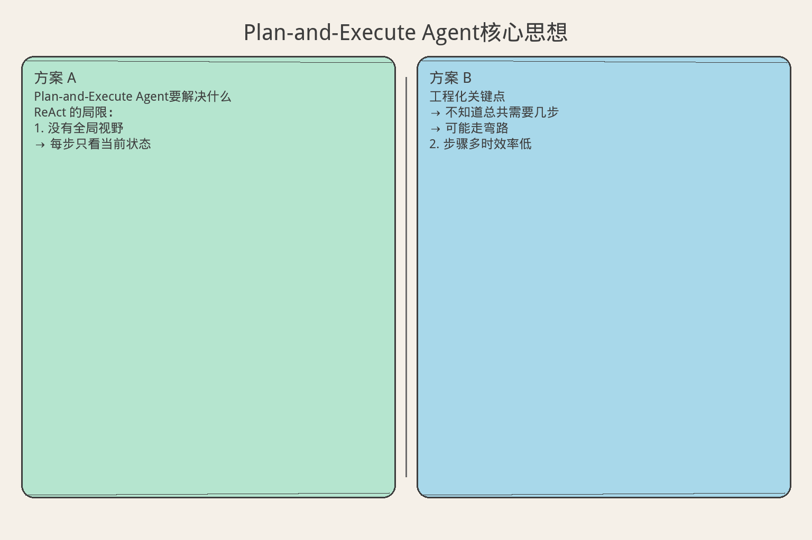
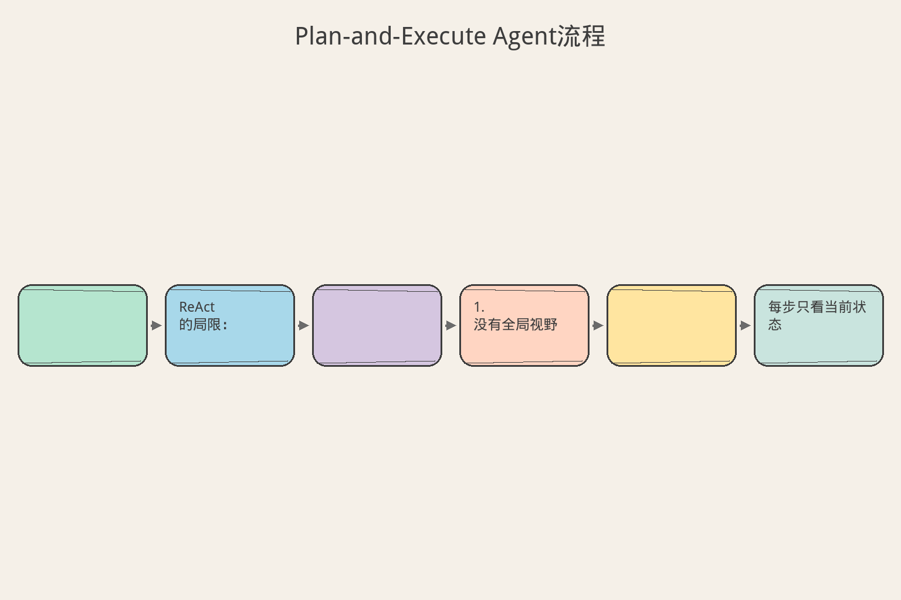
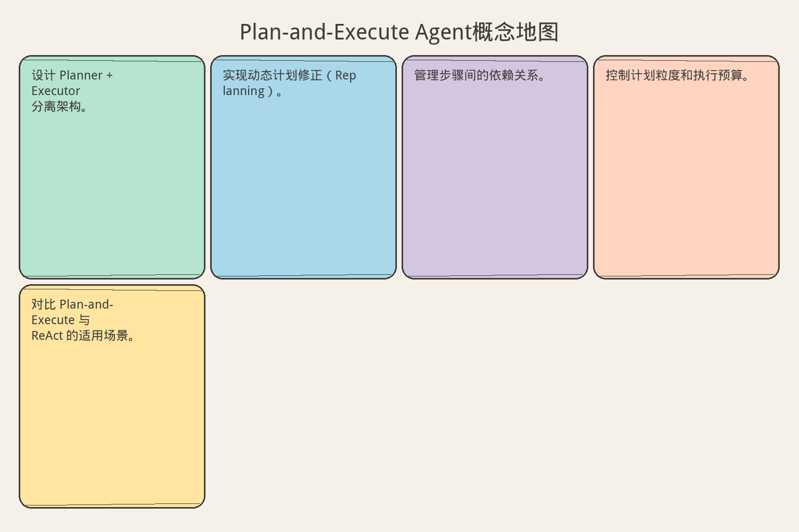

# AI Agent 工程（十五）：Plan-and-Execute Agent

> 先想清楚再动手。Plan-and-Execute 把"规划"和"执行"分离：Planner 生成步骤列表，Executor 逐步执行，执行结果反馈给 Planner 动态调整计划。适合步骤可预见的复杂任务。

**阅读建议：** 先阅读 [227 ReAct Agent 模式](227.react-agent-pattern-tutorial.md)，理解边想边做的模式。

**环境要求：**
- Python **3.10+**
- 无需安装第三方库

---

## 目录

1. [你会学到什么](#你会学到什么)
2. [它解决什么问题](#它解决什么问题)
3. [Plan-and-Execute 架构](#plan-and-execute-架构)
4. [最小示例](#最小示例)
5. [工程化版本](#工程化版本)
6. [常见失败模式](#常见失败模式)
7. [什么时候不要这么做](#什么时候不要这么做)
8. [生产环境注意事项](#生产环境注意事项)
9. [如何观测和评测](#如何观测和评测)
10. [和 RAG / 后端 / 前端的关系](#和-rag--后端--前端的关系)
11. [面试怎么讲](#面试怎么讲)
12. [下一步](#下一步)

## 你会学到什么

- 设计 Planner + Executor 分离架构。
- 实现动态计划修正（Replanning）。
- 管理步骤间的依赖关系。
- 控制计划粒度和执行预算。
- 对比 Plan-and-Execute 与 ReAct 的适用场景。

## 它解决什么问题


读下图时，先看「Plan-and-Execute Agent核心思想」建立直觉。


```text
ReAct 的局限：

1. 没有全局视野
   → 每步只看当前状态
   → 不知道总共需要几步
   → 可能走弯路

2. 步骤多时效率低
   → 每步都要完整推理
   → Token 消耗大
   → 延迟高

3. 难以并行
   → 严格顺序执行
   → 即使步骤间无依赖也不能并行

4. 用户看不到全貌
   → 不知道 Agent 打算做什么
   → 无法提前干预

Plan-and-Execute 的优势：
  1. 全局规划：一次看清所有步骤
  2. 高效执行：步骤间可以并行
  3. 可预期：用户能看到计划
  4. 可修正：执行中发现问题可以 Replan
  5. Token 高效：规划一次，执行时不需要重复推理
```

## Plan-and-Execute 架构

```text
┌─────────────────────────────────────────────────┐
│                  PLANNER                         │
│  输入：任务描述 + 可用工具 + 约束               │
│  输出：步骤列表（含依赖关系）                   │
│  触发：任务开始 / 执行失败 / 新信息             │
└───────────────────────┬─────────────────────────┘
                        │ Plan
                        ▼
┌─────────────────────────────────────────────────┐
│                  EXECUTOR                        │
│  输入：单个步骤 + 上下文                        │
│  输出：步骤结果                                 │
│  能力：调用工具、处理错误、收集结果             │
└───────────────────────┬─────────────────────────┘
                        │ Results
                        ▼
┌─────────────────────────────────────────────────┐
│               MONITOR / REPLANNER               │
│  检查：结果是否符合预期？                       │
│  决策：继续 / 修正计划 / 终止                   │
│  输出：更新后的计划 或 最终结果                 │
└─────────────────────────────────────────────────┘

与 ReAct 的关键区别：
  ReAct：Think → Act → Observe → Think → Act → ...
  P&E：  Plan(all steps) → Execute(step1) → Execute(step2) → ... → Replan(if needed)
```

## 最小示例


读下图时，先看「Plan-and-Execute Agent流程」建立直觉。


### 基础 Plan-and-Execute

```python
from dataclasses import dataclass, field
from typing import Any, Optional
from enum import Enum
import time
import json


class StepStatus(str, Enum):
    PENDING = "pending"
    RUNNING = "running"
    COMPLETED = "completed"
    FAILED = "failed"
    SKIPPED = "skipped"


@dataclass
class PlanStep:
    """计划步骤"""
    step_id: int
    description: str
    tool_name: str
    tool_params: dict
    depends_on: list[int] = field(default_factory=list)
    status: StepStatus = StepStatus.PENDING
    result: Any = None
    error: Optional[str] = None


@dataclass
class Plan:
    """执行计划"""
    task: str
    steps: list[PlanStep] = field(default_factory=list)
    created_at: float = field(default_factory=time.time)
    version: int = 1

    def get_ready_steps(self) -> list[PlanStep]:
        """获取可以执行的步骤（依赖已完成）"""
        ready = []
        completed_ids = {
            s.step_id for s in self.steps
            if s.status == StepStatus.COMPLETED
        }
        for step in self.steps:
            if step.status != StepStatus.PENDING:
                continue
            if all(dep in completed_ids for dep in step.depends_on):
                ready.append(step)
        return ready

    def is_complete(self) -> bool:
        return all(
            s.status in (StepStatus.COMPLETED, StepStatus.SKIPPED)
            for s in self.steps
        )

    def has_failure(self) -> bool:
        return any(s.status == StepStatus.FAILED for s in self.steps)


class SimplePlanExecuteAgent:
    """简单 Plan-and-Execute Agent"""

    def __init__(self, tools: dict, llm_call: callable, max_replans: int = 2):
        self.tools = tools
        self.llm_call = llm_call
        self.max_replans = max_replans

    async def run(self, task: str) -> dict:
        """运行 Plan-and-Execute"""
        # 1. 生成计划
        plan = await self._create_plan(task)

        replans = 0
        while not plan.is_complete() and replans <= self.max_replans:
            # 2. 执行就绪步骤
            ready_steps = plan.get_ready_steps()
            if not ready_steps:
                if plan.has_failure():
                    # 3. 需要 Replan
                    plan = await self._replan(plan)
                    replans += 1
                else:
                    break  # 死锁（不应该发生）
                continue

            for step in ready_steps:
                await self._execute_step(step)

        # 4. 汇总结果
        return self._summarize(plan)

    async def _create_plan(self, task: str) -> Plan:
        """生成计划"""
        tools_desc = ", ".join(self.tools.keys())
        prompt = (
            f"Task: {task}\n"
            f"Available tools: {tools_desc}\n\n"
            f"Create a step-by-step plan. For each step, specify:\n"
            f"- step_id (integer)\n"
            f"- description\n"
            f"- tool_name\n"
            f"- tool_params (dict)\n"
            f"- depends_on (list of step_ids)\n\n"
            f"Respond in JSON array format."
        )
        response = await self.llm_call(prompt)

        # 解析计划
        try:
            steps_data = json.loads(response)
            steps = [
                PlanStep(
                    step_id=s["step_id"],
                    description=s["description"],
                    tool_name=s["tool_name"],
                    tool_params=s.get("tool_params", {}),
                    depends_on=s.get("depends_on", []),
                )
                for s in steps_data
            ]
        except (json.JSONDecodeError, KeyError):
            # 降级：单步计划
            steps = [PlanStep(
                step_id=1,
                description="Execute task directly",
                tool_name=list(self.tools.keys())[0] if self.tools else "finish",
                tool_params={"query": task},
            )]

        return Plan(task=task, steps=steps)

    async def _execute_step(self, step: PlanStep):
        """执行单个步骤"""
        step.status = StepStatus.RUNNING
        handler = self.tools.get(step.tool_name)

        if not handler:
            step.status = StepStatus.FAILED
            step.error = f"Tool '{step.tool_name}' not found"
            return

        try:
            result = await handler(**step.tool_params)
            step.result = result
            step.status = StepStatus.COMPLETED
        except Exception as e:
            step.status = StepStatus.FAILED
            step.error = str(e)

    async def _replan(self, plan: Plan) -> Plan:
        """修正计划"""
        failed_steps = [s for s in plan.steps if s.status == StepStatus.FAILED]
        completed_steps = [s for s in plan.steps if s.status == StepStatus.COMPLETED]

        prompt = (
            f"Original task: {plan.task}\n\n"
            f"Completed steps:\n"
            + "\n".join(f"  - {s.description}: {s.result}" for s in completed_steps)
            + f"\n\nFailed steps:\n"
            + "\n".join(f"  - {s.description}: ERROR {s.error}" for s in failed_steps)
            + f"\n\nCreate a revised plan to complete the task. "
            f"Skip already completed steps. "
            f"Work around failed steps.\n"
            f"Respond in JSON array format."
        )
        response = await self.llm_call(prompt)

        try:
            steps_data = json.loads(response)
            new_steps = [
                PlanStep(
                    step_id=s["step_id"],
                    description=s["description"],
                    tool_name=s["tool_name"],
                    tool_params=s.get("tool_params", {}),
                    depends_on=s.get("depends_on", []),
                )
                for s in steps_data
            ]
            # 保留已完成的步骤
            all_steps = completed_steps + new_steps
            return Plan(task=plan.task, steps=all_steps, version=plan.version + 1)
        except (json.JSONDecodeError, KeyError):
            return plan  # 无法修正，返回原计划

    def _summarize(self, plan: Plan) -> dict:
        """汇总结果"""
        return {
            "task": plan.task,
            "success": plan.is_complete(),
            "total_steps": len(plan.steps),
            "completed": len([s for s in plan.steps if s.status == StepStatus.COMPLETED]),
            "failed": len([s for s in plan.steps if s.status == StepStatus.FAILED]),
            "plan_version": plan.version,
            "results": {
                s.step_id: {"description": s.description, "result": s.result}
                for s in plan.steps if s.status == StepStatus.COMPLETED
            },
        }
```

## 工程化版本

### 并行执行器

```python
import asyncio


class ParallelStepExecutor:
    """并行步骤执行器"""

    def __init__(self, tools: dict, max_parallel: int = 5):
        self.tools = tools
        self.max_parallel = max_parallel

    async def execute_ready_steps(self, plan: Plan) -> list[PlanStep]:
        """并行执行所有就绪步骤"""
        ready = plan.get_ready_steps()
        if not ready:
            return []

        # 限制并发数
        semaphore = asyncio.Semaphore(self.max_parallel)

        async def execute_with_limit(step: PlanStep):
            async with semaphore:
                await self._execute_one(step)

        # 并行执行
        await asyncio.gather(
            *(execute_with_limit(step) for step in ready)
        )
        return ready

    async def _execute_one(self, step: PlanStep):
        """执行单个步骤"""
        step.status = StepStatus.RUNNING
        handler = self.tools.get(step.tool_name)

        if not handler:
            step.status = StepStatus.FAILED
            step.error = f"Tool '{step.tool_name}' not found"
            return

        try:
            result = await handler(**step.tool_params)
            step.result = result
            step.status = StepStatus.COMPLETED
        except Exception as e:
            step.status = StepStatus.FAILED
            step.error = str(e)
```

### 计划验证器

```python
class PlanValidator:
    """计划验证器"""

    def validate(self, plan: Plan) -> list[str]:
        """验证计划的合法性"""
        issues = []

        # 1. 检查步骤 ID 唯一性
        ids = [s.step_id for s in plan.steps]
        if len(ids) != len(set(ids)):
            issues.append("Duplicate step IDs")

        # 2. 检查依赖存在性
        all_ids = set(ids)
        for step in plan.steps:
            for dep in step.depends_on:
                if dep not in all_ids:
                    issues.append(
                        f"Step {step.step_id} depends on non-existent step {dep}"
                    )

        # 3. 检查循环依赖
        if self._has_cycle(plan):
            issues.append("Circular dependency detected")

        # 4. 检查工具存在性
        # (需要传入可用工具列表)

        # 5. 检查计划大小
        if len(plan.steps) > 20:
            issues.append("Plan too large (> 20 steps)")

        return issues

    def _has_cycle(self, plan: Plan) -> bool:
        """检测循环依赖（拓扑排序）"""
        # 构建邻接表
        graph: dict[int, list[int]] = {s.step_id: [] for s in plan.steps}
        in_degree: dict[int, int] = {s.step_id: 0 for s in plan.steps}

        for step in plan.steps:
            for dep in step.depends_on:
                if dep in graph:
                    graph[dep].append(step.step_id)
                    in_degree[step.step_id] += 1

        # BFS 拓扑排序
        queue = [sid for sid, deg in in_degree.items() if deg == 0]
        visited = 0

        while queue:
            node = queue.pop(0)
            visited += 1
            for neighbor in graph[node]:
                in_degree[neighbor] -= 1
                if in_degree[neighbor] == 0:
                    queue.append(neighbor)

        return visited != len(plan.steps)
```

### 完整工程化 Agent

```python
class EngineeredPlanExecuteAgent:
    """工程化 Plan-and-Execute Agent"""

    def __init__(
        self,
        tools: dict,
        llm_call: callable,
        max_steps: int = 15,
        max_replans: int = 2,
        max_parallel: int = 3,
    ):
        self.tools = tools
        self.llm_call = llm_call
        self.max_steps = max_steps
        self.max_replans = max_replans
        self.executor = ParallelStepExecutor(tools, max_parallel)
        self.validator = PlanValidator()
        self._trace: list[dict] = []

    async def run(self, task: str) -> dict:
        """运行完整的 Plan-and-Execute 流程"""
        start_time = time.time()

        # 1. 规划
        plan = await self._plan(task)
        self._trace.append({"phase": "plan", "plan": plan})

        # 2. 验证
        issues = self.validator.validate(plan)
        if issues:
            return {"success": False, "error": f"Invalid plan: {issues}"}

        # 3. 执行循环
        replans = 0
        while not plan.is_complete():
            if plan.has_failure() and replans < self.max_replans:
                plan = await self._replan(plan)
                replans += 1
                self._trace.append({"phase": "replan", "version": plan.version})
                continue

            executed = await self.executor.execute_ready_steps(plan)
            if not executed:
                break  # 无步骤可执行

            self._trace.append({
                "phase": "execute",
                "steps": [s.step_id for s in executed],
            })

        # 4. 汇总
        elapsed = (time.time() - start_time) * 1000
        return {
            "task": task,
            "success": plan.is_complete(),
            "steps_total": len(plan.steps),
            "steps_completed": len([
                s for s in plan.steps if s.status == StepStatus.COMPLETED
            ]),
            "replans": replans,
            "latency_ms": round(elapsed, 2),
            "results": {
                s.step_id: s.result
                for s in plan.steps if s.status == StepStatus.COMPLETED
            },
        }

    async def _plan(self, task: str) -> Plan:
        """生成计划"""
        tools_json = json.dumps(
            {name: func.__doc__ or "" for name, func in self.tools.items()},
            ensure_ascii=False,
        )
        prompt = (
            f"Create an execution plan for:\n{task}\n\n"
            f"Available tools:\n{tools_json}\n\n"
            f"Rules:\n"
            f"- Max {self.max_steps} steps\n"
            f"- Specify dependencies between steps\n"
            f"- Independent steps can run in parallel\n"
            f"- Output JSON array\n"
        )
        response = await self.llm_call(prompt)
        return self._parse_plan(task, response)

    async def _replan(self, plan: Plan) -> Plan:
        """修正计划"""
        completed = [s for s in plan.steps if s.status == StepStatus.COMPLETED]
        failed = [s for s in plan.steps if s.status == StepStatus.FAILED]

        prompt = (
            f"Task: {plan.task}\n\n"
            f"Completed:\n"
            + "\n".join(f"  [{s.step_id}] {s.description} → {s.result}"
                       for s in completed)
            + f"\nFailed:\n"
            + "\n".join(f"  [{s.step_id}] {s.description} → ERROR: {s.error}"
                       for s in failed)
            + f"\n\nRevise the plan. Keep completed steps. "
            f"Fix or work around failures.\n"
        )
        response = await self.llm_call(prompt)
        new_plan = self._parse_plan(plan.task, response)
        new_plan.version = plan.version + 1
        # 保留已完成步骤
        new_plan.steps = completed + new_plan.steps
        return new_plan

    def _parse_plan(self, task: str, response: str) -> Plan:
        """解析计划"""
        try:
            steps_data = json.loads(response)
            steps = [
                PlanStep(
                    step_id=s.get("step_id", i+1),
                    description=s.get("description", ""),
                    tool_name=s.get("tool_name", ""),
                    tool_params=s.get("tool_params", {}),
                    depends_on=s.get("depends_on", []),
                )
                for i, s in enumerate(steps_data)
            ]
        except (json.JSONDecodeError, TypeError):
            steps = [PlanStep(
                step_id=1, description="Direct execution",
                tool_name=list(self.tools.keys())[0] if self.tools else "",
                tool_params={"query": task},
            )]
        return Plan(task=task, steps=steps[:self.max_steps])
```

## 常见失败模式

### 1. 计划太粗

```text
症状：
  步骤描述模糊，执行器不知道怎么做

原因：
  Planner 输出 "处理数据" 而不是具体操作

解决：
  要求计划包含具体工具名和参数
  验证步骤：每步必须有 tool_name
  太粗时要求 Planner 细化
```

### 2. 计划太细

```text
症状：
  20+ 步骤，简单任务过度分解

原因：
  Planner 没有粒度控制

解决：
  限制最大步骤数
  prompt 中说明"合理粒度"
  简单任务 3-5 步即可
```

### 3. 依赖错误

```text
症状：
  步骤执行顺序错误
  或死锁（循环依赖）

原因：
  Planner 没有正确标注依赖

解决：
  PlanValidator 检查循环依赖
  拓扑排序确定执行顺序
  依赖错误时 Replan
```

### 4. Replan 风暴

```text
症状：
  反复 Replan，永远完不成

原因：
  每次 Replan 都失败
  或根本原因没解决

解决：
  限制 Replan 次数（最多 2 次）
  Replan 失败后降级为 ReAct
  记录 Replan 原因，分析根因
```

## 什么时候不要这么做

```text
不需要 Plan-and-Execute 的场景：

1. 步骤不确定
   → 不知道需要几步
   → 用 ReAct（边想边做）

2. 简单任务（1-2 步）
   → 规划开销大于执行
   → 直接调用

3. 强顺序依赖
   → 每步依赖上一步结果
   → 无法并行，P&E 优势消失

4. 实时对话
   → 规划增加延迟
   → 用户等不了

P&E 适合：
  步骤可预见（3-10 步）
  部分步骤可并行
  需要用户预览计划
  复杂多工具任务
```

## 生产环境注意事项

### 计划缓存

```python
class PlanCache:
    """相似任务的计划缓存"""

    def __init__(self):
        self._cache: dict[str, Plan] = {}

    def _make_key(self, task: str) -> str:
        # 简化：用任务前 50 字符做 key
        return task[:50].lower().strip()

    def get(self, task: str) -> Plan | None:
        return self._cache.get(self._make_key(task))

    def put(self, task: str, plan: Plan):
        if plan.is_complete():
            self._cache[self._make_key(task)] = plan
```

### 进度通知

```python
class ProgressNotifier:
    """执行进度通知"""

    def __init__(self, callback: callable = None):
        self.callback = callback

    async def notify(self, plan: Plan, current_step: PlanStep):
        """通知进度"""
        completed = len([s for s in plan.steps if s.status == StepStatus.COMPLETED])
        total = len(plan.steps)
        message = (
            f"Progress: {completed}/{total} steps complete. "
            f"Current: {current_step.description}"
        )
        if self.callback:
            await self.callback(message)
```

## 如何观测和评测

```text
Plan-and-Execute 关键指标：

1. 计划准确率
   - 不需要 Replan 的任务比例
   - 目标 > 80%

2. 并行利用率
   - 并行执行的步骤 / 总步骤
   - 越高越好

3. 步骤效率
   - 实际步骤 / 最优步骤
   - 目标 < 1.5

4. Replan 率
   - 需要 Replan 的任务比例
   - 目标 < 20%

5. 端到端延迟
   - 规划时间 + 执行时间
   - 对比 ReAct
```

## 和 RAG / 后端 / 前端的关系

```text
P&E 在系统中的位置：

RAG 管道：
  检索可以作为计划中的一个步骤
  多个检索可以并行执行
  检索结果影响后续步骤

后端 API：
  计划可以持久化（断点恢复）
  并行步骤用 asyncio.gather
  长时间计划用后台任务

前端展示：
  展示计划步骤列表（让用户预览）
  实时更新每步状态
  用户可以修改计划
  展示并行执行进度
```

## 面试怎么讲

```text
面试官：Plan-and-Execute 和 ReAct 怎么选？

回答框架（2 分钟）：

"核心区别是'先规划后执行' vs '边想边做'：

 Plan-and-Execute：
  Planner 一次生成所有步骤（含依赖）。
  Executor 按拓扑顺序执行，无依赖的步骤并行。
  执行失败时 Replanner 修正计划。

 适合：步骤可预见、可并行、需要用户预览。

 ReAct：
  每步推理一次，执行一次，观察一次。
  下一步取决于上一步结果。

 适合：步骤不确定、强顺序依赖。

 我的选择标准：
 - 能列出 3+ 步骤 → P&E
 - 每步依赖上一步 → ReAct
 - 需要并行 → P&E
 - 需要可解释 → 都可以

 实际中我结合使用：
 大步骤用 P&E 规划，
 每个大步骤内部用 ReAct 执行。"

追问 1：Replan 怎么做？
  → 保留已完成步骤，分析失败原因。
    让 Planner 生成修正计划。
    最多 Replan 2 次，之后降级。

追问 2：并行怎么保证正确性？
  → 依赖关系用 DAG 表示。
    拓扑排序确定执行顺序。
    无依赖的步骤才并行。
    用 semaphore 限制并发数。

追问 3：计划太粗或太细怎么办？
  → 验证器检查：每步必须有具体工具和参数。
    步骤数限制 3-15。
    太粗要求细化，太细要求合并。
```

## 设计原则总结

```text
Plan-and-Execute 设计 6 条原则：

1. 规划与执行分离
   Planner 只负责生成步骤
   Executor 只负责执行
   职责清晰

2. 依赖显式化
   步骤间依赖用 DAG 表示
   拓扑排序确定顺序
   无依赖步骤并行

3. 计划可验证
   循环依赖检测
   工具存在性检查
   步骤数限制

4. Replan 有限
   最多 2 次 Replan
   失败后降级为 ReAct
   不无限重试

5. 进度可见
   用户能看到计划
   实时更新执行状态
   可以中途干预

6. 粒度适中
   3-15 步为宜
   每步有具体工具和参数
   不过粗也不过细
```

## 实战案例：数据分析 Agent

### 场景：多步数据分析任务

```python
class DataAnalysisAgent:
    """数据分析 Agent：Plan-and-Execute 模式"""

    def __init__(self, llm_call: callable):
        self.llm_call = llm_call
        self.tools = {
            "query_database": self._query_db,
            "compute_statistics": self._compute_stats,
            "generate_chart": self._gen_chart,
            "format_report": self._format_report,
        }
        self.agent = EngineeredPlanExecuteAgent(
            tools=self.tools,
            llm_call=llm_call,
            max_steps=8,
            max_parallel=3,
        )

    async def analyze(self, question: str) -> dict:
        """执行数据分析"""
        return await self.agent.run(question)

    async def _query_db(self, sql: str) -> dict:
        return {"rows": [{"month": "Jan", "revenue": 100}], "count": 12}

    async def _compute_stats(self, data: list, metrics: list) -> dict:
        return {"mean": 150, "median": 145, "trend": "increasing"}

    async def _gen_chart(self, data: list, chart_type: str) -> str:
        return "chart_url: https://charts.example.com/abc123"

    async def _format_report(self, sections: list) -> str:
        return "# Monthly Report\n\nRevenue is increasing..."
```

### 执行示例

```text
任务："分析过去 12 个月的收入趋势，生成报告"

Plan (version 1):
  Step 1: query_database(sql="SELECT month, revenue FROM sales")
  Step 2: compute_statistics(data=<step1.result>, metrics=["mean","trend"])
          depends_on: [1]
  Step 3: generate_chart(data=<step1.result>, chart_type="line")
          depends_on: [1]
  Step 4: format_report(sections=[<step2>, <step3>])
          depends_on: [2, 3]

执行顺序：
  Round 1: Step 1 (查询数据)
  Round 2: Step 2 + Step 3 (并行！统计 + 图表)
  Round 3: Step 4 (生成报告)

总共 3 轮，4 步，其中 2 步并行。
比纯顺序执行快 40%。
```

### P&E 与 ReAct 的混合使用

```python
class HybridAgent:
    """混合 Agent：大步骤用 P&E，小步骤用 ReAct"""

    def __init__(self, llm_call: callable, tools: dict):
        self.llm_call = llm_call
        self.tools = tools

    async def run(self, task: str) -> dict:
        """混合执行"""
        # Phase 1: 规划大步骤
        plan = await self._high_level_plan(task)

        results = []
        for step in plan.steps:
            if step.tool_name == "complex_analysis":
                # 复杂步骤用 ReAct
                react_result = await self._react_execute(step)
                results.append(react_result)
            else:
                # 简单步骤直接执行
                handler = self.tools.get(step.tool_name)
                if handler:
                    result = await handler(**step.tool_params)
                    results.append(result)

        return {"results": results}

    async def _high_level_plan(self, task: str) -> Plan:
        """高层规划"""
        # 简化：返回固定计划
        return Plan(task=task, steps=[
            PlanStep(1, "Gather data", "query_database", {"sql": "..."}),
            PlanStep(2, "Analyze", "complex_analysis", {"data": "..."}, [1]),
            PlanStep(3, "Report", "format_report", {"sections": []}, [2]),
        ])

    async def _react_execute(self, step: PlanStep) -> dict:
        """ReAct 执行复杂步骤"""
        # 简化：模拟 ReAct 循环
        return {"analysis": "done", "insights": ["trend up"]}
```

### 计划模板库

```text
常见任务的计划模板：

数据分析：
  1. 查询数据 (query_database)
  2. 清洗数据 (clean_data)        [depends: 1]
  3. 统计分析 (compute_stats)     [depends: 2]
  4. 可视化 (generate_chart)      [depends: 2]
  5. 生成报告 (format_report)     [depends: 3, 4]

文档处理：
  1. 获取文档 (fetch_document)
  2. 提取内容 (extract_text)      [depends: 1]
  3. 摘要 (summarize)             [depends: 2]
  4. 翻译 (translate)             [depends: 2]
  5. 合并输出 (merge_outputs)     [depends: 3, 4]

客服处理：
  1. 查询订单 (get_order)
  2. 查询物流 (get_shipping)      [depends: 1]
  3. 搜索 FAQ (search_faq)        [并行]
  4. 综合回答 (synthesize)        [depends: 2, 3]

模板使用：
  相似任务直接套用模板
  减少规划 Token 消耗
  提高规划准确率
```

---

> **核心要点：** Plan-and-Execute 的核心价值是“先想后做”。规划质量决定执行效果，执行反馈驱动规划修正。

## P&E 模式检查清单

```text
部署前检查：

□ Planner 和 Executor 职责清晰分离
□ 计划支持动态修正（不是死板执行）
□ 每步执行有超时和重试
□ 步骤失败不导致整体崩溃
□ 支持部分结果返回
□ 规划 token 有上限
□ 执行进度可观测
□ 复杂任务有模板加速

调优建议：
- 规划太笼统 → 加 few-shot 示例
- 执行总失败 → 检查工具可用性
- 重规划太多 → 加缓存/模板
- 延迟太高 → 并行无依赖步骤

适用场景：
- 数据分析报告（步骤可预见）
- 多步骤表单填写
- 代码生成 + 测试 + 修复
- 研究调研（搜索 + 阅读 + 总结）

不适用：
- 实时对话（来不及规划）
- 单步任务（规划是浪费）
- 完全不可预见的探索性任务
```

## 下一步


读下图时，先看「Plan-and-Execute Agent概念地图」建立直觉。


下一篇 [229 Reflection Agent 模式](229.reflection-agent-pattern-tutorial.md) 会讨论如何让 Agent 自我反思和改进，提升输出质量。
