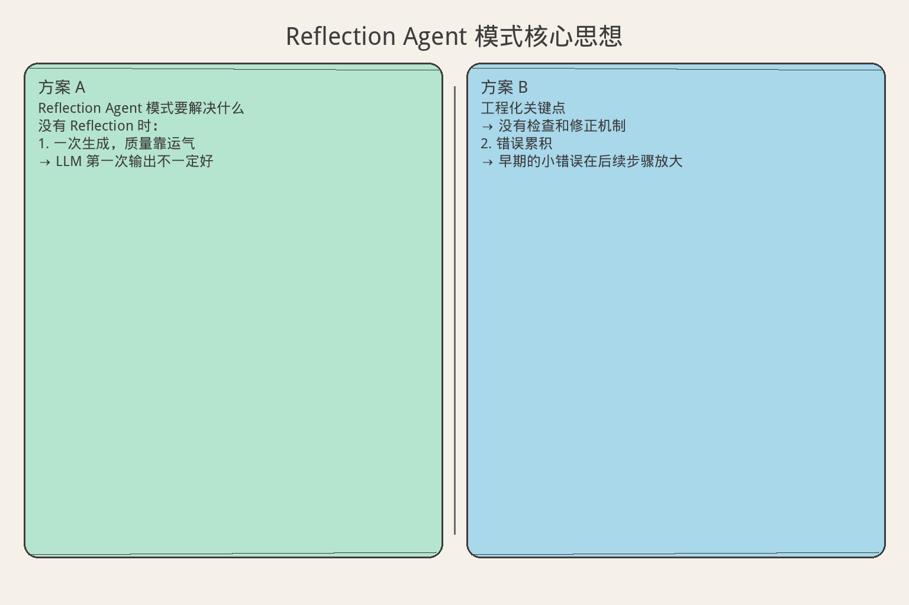
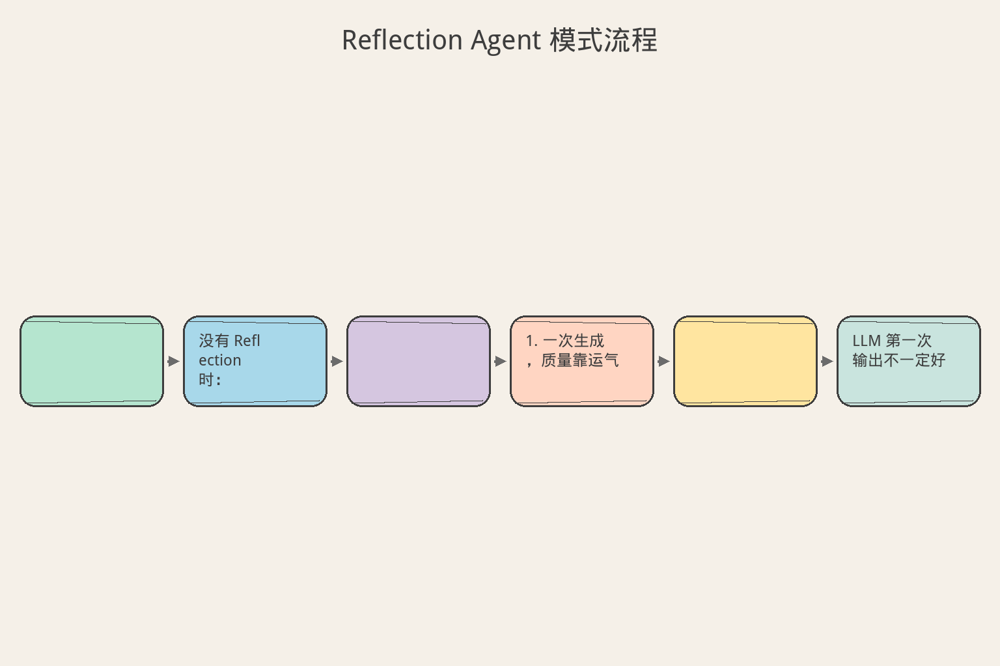
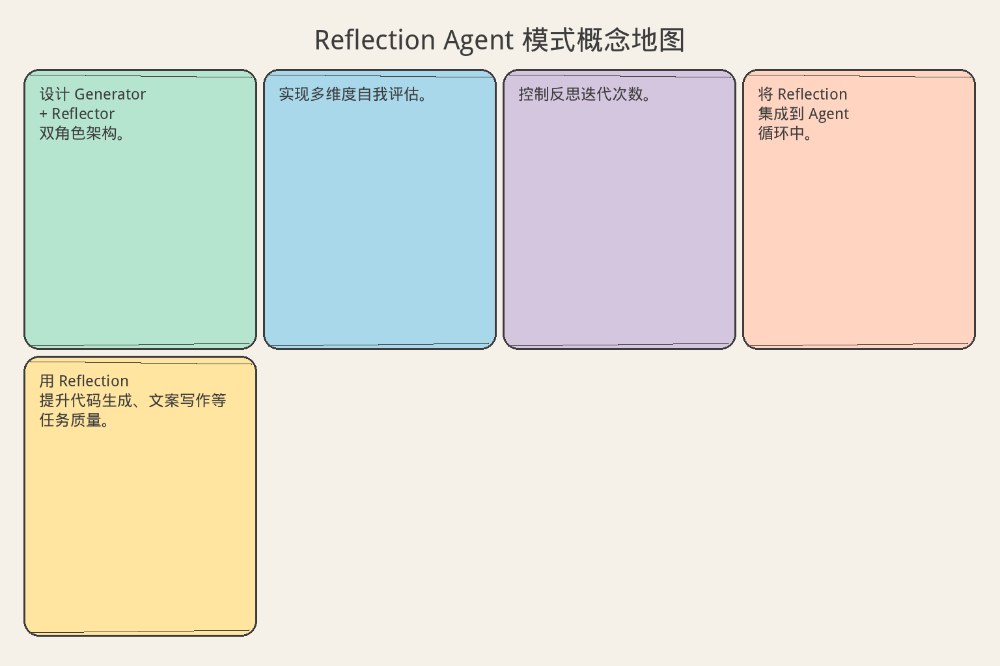

# AI Agent 工程（十六）：Reflection Agent 模式

> 写完不算完，检查一遍才算。Reflection 让 Agent 在生成输出后自我审视：哪里不够好？哪里可以改进？然后修正。这是从"能用"到"好用"的关键一步。

**阅读建议：** 先阅读 [228 Plan-and-Execute Agent](228.plan-and-execute-agent-tutorial.md)，理解规划执行模式。

**环境要求：**
- Python **3.10+**
- 无需安装第三方库

---

## 目录

1. [你会学到什么](#你会学到什么)
2. [它解决什么问题](#它解决什么问题)
3. [Reflection 的核心机制](#reflection-的核心机制)
4. [最小示例](#最小示例)
5. [工程化版本](#工程化版本)
6. [常见失败模式](#常见失败模式)
7. [什么时候不要这么做](#什么时候不要这么做)
8. [生产环境注意事项](#生产环境注意事项)
9. [如何观测和评测](#如何观测和评测)
10. [和 RAG / 后端 / 前端的关系](#和-rag--后端--前端的关系)
11. [面试怎么讲](#面试怎么讲)
12. [下一步](#下一步)

## 你会学到什么

- 设计 Generator + Reflector 双角色架构。
- 实现多维度自我评估。
- 控制反思迭代次数。
- 将 Reflection 集成到 Agent 循环中。
- 用 Reflection 提升代码生成、文案写作等任务质量。

## 它解决什么问题


读下图时，先看「Reflection Agent 模式核心思想」建立直觉。


```text
没有 Reflection 时：

1. 一次生成，质量靠运气
   → LLM 第一次输出不一定好
   → 没有检查和修正机制

2. 错误累积
   → 早期的小错误在后续步骤放大
   → 没有"回头看"的机会

3. 不一致性
   → 长文本前后矛盾
   → 代码风格和命名不统一

4. 遗漏
   → 没有覆盖所有需求点
   → 边界情况没考虑

Reflection 的价值：
  论文数据（Shinn et al., 2023）：
  - 代码生成：+13% pass rate
  - 推理任务：+11% accuracy
  - 关键：自我反馈比外部反馈更高效
```

## Reflection 的核心机制

```text
┌─────────────────────────────────────────────┐
│                                             │
│  ┌───────────┐        ┌───────────┐        │
│  │ GENERATOR │───────→│ OUTPUT v1 │        │
│  └───────────┘        └─────┬─────┘        │
│                             │               │
│                             ▼               │
│                       ┌───────────┐         │
│                       │ REFLECTOR │         │
│                       │ (评估)    │         │
│                       └─────┬─────┘         │
│                             │               │
│                    ┌────────┴────────┐      │
│                    │                 │      │
│                    ▼                 ▼      │
│              ┌──────────┐     ┌──────────┐ │
│              │ 通过     │     │ 需改进   │ │
│              │ (输出)   │     │ (反馈)   │ │
│              └──────────┘     └────┬─────┘ │
│                                   │       │
│                                   ▼       │
│                             ┌───────────┐  │
│                             │ REVISE    │  │
│                             │ (修正)    │  │
│                             └─────┬─────┘  │
│                                   │       │
│                                   └──→ 回到 REFLECTOR
│                                             │
│  最多 N 轮迭代                              │
└─────────────────────────────────────────────┘

关键设计：
1. Generator 和 Reflector 用不同 prompt
   → 避免"自己评自己"的偏见
2. 评估维度明确
   → 不是"好不好"，而是具体维度
3. 反馈可操作
   → 不是"需要改进"，而是"第 3 段缺少示例"
4. 迭代有上限
   → 最多 3 轮，防止无限循环
```

## 最小示例


读下图时，先看「Reflection Agent 模式流程」建立直觉。


### 基础 Reflection 循环

```python
from dataclasses import dataclass, field
from typing import Any, Optional
import time


@dataclass
class ReflectionResult:
    """反思结果"""
    score: float  # 0-10
    passed: bool
    issues: list[str] = field(default_factory=list)
    suggestions: list[str] = field(default_factory=list)
    dimension_scores: dict[str, float] = field(default_factory=dict)


@dataclass
class IterationRecord:
    """迭代记录"""
    iteration: int
    output: str
    reflection: ReflectionResult
    latency_ms: float = 0


class SimpleReflectionAgent:
    """简单 Reflection Agent"""

    def __init__(self, llm_call: callable, max_iterations: int = 3):
        self.llm_call = llm_call
        self.max_iterations = max_iterations
        self.history: list[IterationRecord] = []

    async def generate_with_reflection(
        self, task: str, pass_threshold: float = 7.0
    ) -> str:
        """带反思的生成"""
        output = ""
        feedback = ""

        for iteration in range(self.max_iterations):
            start = time.perf_counter()

            # 1. 生成（或修正）
            if iteration == 0:
                output = await self._generate(task)
            else:
                output = await self._revise(task, output, feedback)

            # 2. 反思
            reflection = await self._reflect(task, output)

            latency = (time.perf_counter() - start) * 1000
            self.history.append(IterationRecord(
                iteration=iteration,
                output=output,
                reflection=reflection,
                latency_ms=latency,
            ))

            # 3. 判断是否通过
            if reflection.passed or reflection.score >= pass_threshold:
                break

            # 4. 准备下一轮反馈
            feedback = self._format_feedback(reflection)

        return output

    async def _generate(self, task: str) -> str:
        """初始生成"""
        prompt = f"Complete the following task:\n\n{task}"
        return await self.llm_call(prompt)

    async def _revise(self, task: str, current: str, feedback: str) -> str:
        """基于反馈修正"""
        prompt = (
            f"Task: {task}\n\n"
            f"Current output:\n{current}\n\n"
            f"Feedback for improvement:\n{feedback}\n\n"
            f"Please revise the output to address the feedback."
        )
        return await self.llm_call(prompt)

    async def _reflect(self, task: str, output: str) -> ReflectionResult:
        """反思评估"""
        prompt = (
            f"You are a quality reviewer.\n\n"
            f"Task: {task}\n\n"
            f"Output to review:\n{output}\n\n"
            f"Evaluate on these dimensions (0-10 each):\n"
            f"1. Completeness: Does it cover all requirements?\n"
            f"2. Accuracy: Is the information correct?\n"
            f"3. Clarity: Is it well-organized and clear?\n"
            f"4. Consistency: Are there contradictions?\n\n"
            f"Respond with:\n"
            f"SCORE: <average score>\n"
            f"ISSUES: <list of specific problems>\n"
            f"SUGGESTIONS: <list of specific improvements>"
        )
        response = await self.llm_call(prompt)
        return self._parse_reflection(response)

    def _parse_reflection(self, response: str) -> ReflectionResult:
        """解析反思结果"""
        score = 7.0  # 默认
        issues = []
        suggestions = []

        for line in response.split("\n"):
            line = line.strip()
            if line.startswith("SCORE:"):
                try:
                    score = float(line.split(":")[1].strip())
                except ValueError:
                    pass
            elif line.startswith("- ") and "ISSUES" in response[:response.index(line)]:
                issues.append(line[2:])
            elif line.startswith("- "):
                suggestions.append(line[2:])

        return ReflectionResult(
            score=score,
            passed=score >= 7.0,
            issues=issues,
            suggestions=suggestions,
        )

    def _format_feedback(self, reflection: ReflectionResult) -> str:
        """格式化反馈"""
        lines = [f"Score: {reflection.score}/10"]
        if reflection.issues:
            lines.append("\nIssues to fix:")
            lines.extend(f"  - {issue}" for issue in reflection.issues)
        if reflection.suggestions:
            lines.append("\nSuggestions:")
            lines.extend(f"  - {s}" for s in reflection.suggestions)
        return "\n".join(lines)
```

## 工程化版本

### 多维度评估器

```python
from abc import ABC, abstractmethod


class EvaluationDimension(ABC):
    """评估维度基类"""

    @property
    @abstractmethod
    def name(self) -> str: ...

    @property
    @abstractmethod
    def prompt(self) -> str: ...

    @abstractmethod
    def evaluate(self, task: str, output: str) -> tuple[float, list[str]]:
        """返回 (score, issues)"""
        ...


class CompletenessDimension(EvaluationDimension):
    """完整性维度"""

    @property
    def name(self) -> str:
        return "completeness"

    @property
    def prompt(self) -> str:
        return "Does the output address ALL requirements in the task?"

    def evaluate(self, task: str, output: str) -> tuple[float, list[str]]:
        # 简化：检查关键词覆盖
        task_keywords = set(task.lower().split())
        output_words = set(output.lower().split())
        coverage = len(task_keywords & output_words) / max(1, len(task_keywords))
        score = min(10, coverage * 12)
        issues = []
        if score < 7:
            missing = task_keywords - output_words
            issues.append(f"Missing concepts: {list(missing)[:5]}")
        return score, issues


class ConsistencyDimension(EvaluationDimension):
    """一致性维度"""

    @property
    def name(self) -> str:
        return "consistency"

    @property
    def prompt(self) -> str:
        return "Are there any contradictions within the output?"

    def evaluate(self, task: str, output: str) -> tuple[float, list[str]]:
        # 简化：检查重复和矛盾
        sentences = output.split(".")
        issues = []
        if len(sentences) > 2:
            # 检查是否有明显重复
            unique = set(s.strip() for s in sentences if s.strip())
            if len(unique) < len(sentences) * 0.7:
                issues.append("Repetitive content detected")
                return 5.0, issues
        return 9.0, []


class MultiDimensionReflector:
    """多维度反思器"""

    def __init__(self, dimensions: list[EvaluationDimension] | None = None):
        self.dimensions = dimensions or [
            CompletenessDimension(),
            ConsistencyDimension(),
        ]

    def evaluate(self, task: str, output: str) -> ReflectionResult:
        """多维度评估"""
        dimension_scores = {}
        all_issues = []

        for dim in self.dimensions:
            score, issues = dim.evaluate(task, output)
            dimension_scores[dim.name] = score
            all_issues.extend(f"[{dim.name}] {i}" for i in issues)

        avg_score = sum(dimension_scores.values()) / len(dimension_scores)

        return ReflectionResult(
            score=avg_score,
            passed=avg_score >= 7.0 and all(s >= 5.0 for s in dimension_scores.values()),
            issues=all_issues,
            dimension_scores=dimension_scores,
        )
```

### 自适应迭代控制

```python
class AdaptiveIterationController:
    """自适应迭代控制"""

    def __init__(
        self,
        max_iterations: int = 3,
        pass_threshold: float = 7.0,
        improvement_threshold: float = 0.5,
    ):
        self.max_iterations = max_iterations
        self.pass_threshold = pass_threshold
        self.improvement_threshold = improvement_threshold
        self._scores: list[float] = []

    def should_continue(self, reflection: ReflectionResult) -> tuple[bool, str]:
        """判断是否继续迭代"""
        self._scores.append(reflection.score)

        # 已通过
        if reflection.passed:
            return False, "passed"

        # 达到最大迭代
        if len(self._scores) >= self.max_iterations:
            return False, "max_iterations"

        # 改进停滞
        if len(self._scores) >= 2:
            improvement = self._scores[-1] - self._scores[-2]
            if improvement < self.improvement_threshold:
                return False, "diminishing_returns"

        return True, "continue"

    def get_best_iteration(self, records: list[IterationRecord]) -> IterationRecord:
        """获取最佳迭代"""
        return max(records, key=lambda r: r.reflection.score)
```

### 完整 Reflection Agent

```python
class EngineeredReflectionAgent:
    """工程化 Reflection Agent"""

    def __init__(
        self,
        llm_call: callable,
        dimensions: list[EvaluationDimension] | None = None,
        max_iterations: int = 3,
        pass_threshold: float = 7.0,
    ):
        self.llm_call = llm_call
        self.reflector = MultiDimensionReflector(dimensions)
        self.controller = AdaptiveIterationController(
            max_iterations=max_iterations,
            pass_threshold=pass_threshold,
        )
        self._trace: list[dict] = []

    async def run(self, task: str) -> dict:
        """运行 Reflection 循环"""
        records: list[IterationRecord] = []
        output = ""
        feedback = ""

        for iteration in range(self.controller.max_iterations):
            start = time.perf_counter()

            # 生成/修正
            if iteration == 0:
                output = await self._generate(task)
            else:
                output = await self._revise(task, output, feedback)

            # 评估
            reflection = self.reflector.evaluate(task, output)

            latency = (time.perf_counter() - start) * 1000
            record = IterationRecord(
                iteration=iteration,
                output=output,
                reflection=reflection,
                latency_ms=latency,
            )
            records.append(record)

            self._trace.append({
                "iteration": iteration,
                "score": reflection.score,
                "issues": reflection.issues,
                "latency_ms": latency,
            })

            # 判断是否继续
            should_continue, reason = self.controller.should_continue(reflection)
            if not should_continue:
                break

            # 准备反馈
            feedback = self._build_feedback(reflection)

        # 选择最佳输出
        best = self.controller.get_best_iteration(records)

        return {
            "output": best.output,
            "score": best.reflection.score,
            "iterations": len(records),
            "dimension_scores": best.reflection.dimension_scores,
            "remaining_issues": best.reflection.issues,
        }

    async def _generate(self, task: str) -> str:
        prompt = (
            f"Complete this task with high quality:\n\n{task}\n\n"
            f"Requirements:\n"
            f"- Be thorough and complete\n"
            f"- Use clear structure\n"
            f"- Include examples where helpful\n"
        )
        return await self.llm_call(prompt)

    async def _revise(self, task: str, current: str, feedback: str) -> str:
        prompt = (
            f"Task: {task}\n\n"
            f"Current output (score needs improvement):\n{current}\n\n"
            f"Specific feedback:\n{feedback}\n\n"
            f"Revise to address ALL feedback points. "
            f"Keep what's good, fix what's not."
        )
        return await self.llm_call(prompt)

    def _build_feedback(self, reflection: ReflectionResult) -> str:
        lines = []
        for dim_name, score in reflection.dimension_scores.items():
            lines.append(f"{dim_name}: {score:.1f}/10")
        if reflection.issues:
            lines.append("\nMust fix:")
            lines.extend(f"  - {i}" for i in reflection.issues)
        return "\n".join(lines)
```

## 常见失败模式

### 1. 自我偏见

```text
症状：
  Reflector 总是给高分，看不出问题

原因：
  Generator 和 Reflector 用相同 prompt/模型
  "自己评自己"天然乐观

解决：
  1. Reflector 用不同 system prompt（严格审稿人角色）
  2. 评估维度具体化（不是"好不好"）
  3. 要求必须找出至少 1 个问题
  4. 可以用不同模型做 Reflector
```

### 2. 过度修正

```text
症状：
  每轮修改引入新问题
  分数不升反降

原因：
  修正时改动太大
  修了 A 坏了 B

解决：
  1. 限制每轮修改范围
  2. "Keep what's good, fix what's not"
  3. 选择最佳迭代（不一定最后一轮最好）
  4. 改进停滞时停止
```

### 3. 反思太浅

```text
症状：
  反馈都是"需要更详细"
  没有具体可操作的改进

原因：
  Reflector prompt 太通用

解决：
  1. 按维度评估（完整性、准确性、清晰度）
  2. 要求指出具体位置（"第 3 段缺少..."）
  3. 要求给出修正示例
```

### 4. 迭代不收敛

```text
症状：
  3 轮后分数没有明显提升

原因：
  任务本身超出能力
  或评估标准不合理

解决：
  1. 改进停滞检测（improvement < 0.5 则停止）
  2. 调整 pass_threshold
  3. 分析是否需要换方法（而非继续迭代）
```

## 什么时候不要这么做

```text
不需要 Reflection 的场景：

1. 简单查询
   → "今天天气" 不需要反思
   → 一次生成就够

2. 延迟敏感
   → 实时对话等不了 3 轮
   → 用单次生成 + 后处理

3. 客观答案
   → 数学计算、数据查询
   → 对就是对，不需要"改进"

4. 已经有外部评估
   → 单元测试验证代码
   → 不需要 LLM 自评

Reflection 适合：
  开放式生成（文案、报告）
  代码生成（没有测试时）
  复杂推理（需要验证）
  多约束任务（容易遗漏）
```

## 生产环境注意事项

### Reflection 与 ReAct 结合

```python
class ReflectiveReActAgent:
    """带反思的 ReAct Agent"""

    def __init__(self, llm_call: callable, tools: dict):
        self.llm_call = llm_call
        self.tools = tools
        self.reflection_agent = EngineeredReflectionAgent(
            llm_call=llm_call, max_iterations=2
        )

    async def run(self, task: str) -> dict:
        """ReAct 执行 + 最终反思"""
        # Phase 1: ReAct 执行
        react_result = await self._react_loop(task)

        # Phase 2: 对最终答案做 Reflection
        if react_result.get("answer"):
            reflection = await self.reflection_agent.run(
                f"Verify this answer to '{task}':\n{react_result['answer']}"
            )
            if reflection["score"] < 6.0:
                # 分数太低，重新执行
                react_result = await self._react_loop(task)

        return react_result

    async def _react_loop(self, task: str) -> dict:
        """简化的 ReAct 循环"""
        return {"answer": f"Answer to: {task}", "steps": 3}
```

### 成本控制

```python
class ReflectionCostController:
    """Reflection 成本控制"""

    def __init__(self, max_tokens_per_task: int = 10000):
        self.max_tokens = max_tokens_per_task
        self._used_tokens = 0

    def can_afford_iteration(self, estimated_tokens: int) -> bool:
        """是否还负担得起一轮迭代"""
        return self._used_tokens + estimated_tokens <= self.max_tokens

    def record_usage(self, tokens: int):
        self._used_tokens += tokens

    def get_remaining_budget(self) -> int:
        return max(0, self.max_tokens - self._used_tokens)
```

## 如何观测和评测

```text
Reflection 关键指标：

1. 质量提升
   - 反思后分数 - 反思前分数
   - 目标：提升 > 1.5 分

2. 迭代效率
   - 平均迭代次数
   - 目标：< 2.5 次

3. 收敛率
   - 最终通过的任务比例
   - 目标 > 85%

4. 改进停滞率
   - 因停滞停止的比例
   - 目标 < 15%

5. Token 开销
   - Reflection 额外消耗的 token
   - 通常增加 50-100%
   - 需要权衡质量 vs 成本
```

## 和 RAG / 后端 / 前端的关系

```text
Reflection 在系统中的位置：

RAG 管道：
  对 RAG 生成的回答做 Reflection
  检查：是否忠实于检索内容？是否有幻觉？
  维度：faithfulness, completeness, relevance

后端 API：
  Reflection 是同步的（增加延迟）
  长任务可以异步：先生成，后台反思
  缓存反思结果（相似任务复用）

前端展示：
  展示"正在优化..."状态
  展示质量分数
  让用户选择"快速回答" vs "高质量回答"
```

## 面试怎么讲

```text
面试官：怎么提升 Agent 输出质量？

回答框架（2 分钟）：

"我用 Reflection 模式：Generator + Reflector 双角色。

 流程：
 1. Generator 生成初始输出
 2. Reflector 按维度评估（完整性、准确性、清晰度、一致性）
 3. 不通过则给出具体反馈
 4. Generator 基于反馈修正
 5. 最多 3 轮，或改进停滞时停止

 关键设计：
 - 多维度评估（不是笼统的'好不好'）
 - 反馈可操作（指出具体位置和修正方向）
 - 自适应停止（改进 < 0.5 分则停止）
 - 选最佳迭代（不一定最后一轮最好）

 实际效果：
 代码生成 pass rate +13%，
 文案质量评分 +1.8 分（10 分制），
 平均 2.1 轮迭代。"

追问 1：怎么避免自我偏见？
  → Reflector 用严格审稿人角色。
    评估维度具体化。
    要求必须找出问题。
    可以用不同模型。

追问 2：成本怎么控制？
  → 设置 token 预算。
    简单任务跳过 Reflection。
    用户可选"快速" vs "高质量"。

追问 3：什么时候不用 Reflection？
  → 简单查询、客观答案、延迟敏感场景。
    有外部验证（测试）时不需要自评。
```

## 设计原则总结

```text
Reflection 设计 6 条原则：

1. 双角色分离
   Generator 和 Reflector 用不同 prompt
   避免自己评自己的偏见

2. 维度具体化
   不用"好不好"，用具体维度
   每个维度独立评分

3. 反馈可操作
   指出具体位置和问题
   给出修正方向

4. 迭代有限
   最多 3 轮
   改进停滞则停止

5. 选最佳输出
   不一定最后一轮最好
   按分数选最佳

6. 成本意识
   Reflection 增加 50-100% token
   简单任务跳过
   设置预算上限
```

## 实战案例：代码生成的 Reflection

### 场景设计

```text
代码生成 Reflection 的评估维度：

1. 正确性 (correctness)
   - 逻辑是否正确？
   - 是否有语法错误？
   - 是否能运行？

2. 风格 (style)
   - 命名是否清晰？
   - 函数是否太长？
   - 是否有注释/docstring？

3. 边界情况 (edge_cases)
   - 空输入处理了吗？
   - 异常情况处理了吗？
   - 类型检查做了吗？

4. 可维护性 (maintainability)
   - 是否模块化？
   - 是否有魔法数字？
   - 是否易于测试？

Reflection 流程：
  Round 1: 生成代码 → 评估（发现缺少错误处理）
  Round 2: 修正 → 评估（发现命名不清晰）
  Round 3: 修正 → 评估（通过，8.2分）

效果：
  没有 Reflection：60% 代码需要人工修改
  有 Reflection：25% 代码需要人工修改
  平均减少 2 轮人工 review
```

### 不同任务的 Reflection 策略

```text
任务类型与 Reflection 配置：

┌────────────┬──────────┬──────────┬──────────┐
│ 任务类型   │ 迭代次数 │ 通过阈值 │ 评估维度 │
├────────────┼──────────┼──────────┼──────────┤
│ 代码生成   │ 3        │ 7.5      │ 4个      │
│ 文案写作   │ 2        │ 7.0      │ 3个      │
│ 数据报告   │ 2        │ 8.0      │ 3个      │
│ 翻译       │ 2        │ 8.0      │ 2个      │
│ 摘要       │ 1        │ 7.0      │ 2个      │
│ 简单问答   │ 0        │ -        │ -        │
└────────────┴──────────┴──────────┴──────────┘

决策规则：
  任务复杂度 > 3 个约束 → 需要 Reflection
  输出长度 > 500 字 → 需要 Reflection
  有明确质量标准 → 需要 Reflection
  简单事实查询 → 不需要
```

### Reflection 的局限性

```text
Reflection 不能解决的问题：

1. 知识缺失
   → LLM 不知道的事实，反思也不知道
   → 需要外部工具（搜索、数据库）

2. 推理能力上限
   → 模型推理能力有限
   → 反思不能突破能力天花板

3. 系统性偏见
   → 模型的系统性错误
   → 自我反思可能强化偏见

4. 评估标准模糊
   → "好"的标准不明确
   → 反思方向不确定

应对策略：
  知识缺失 → 结合 RAG（先检索再生成）
  推理上限 → 结合工具（计算器、代码执行）
  系统偏见 → 外部评估（人工审核）
  标准模糊 → 明确评估维度和标准
```

### Reflection 测试策略

```text
测试 Reflection 效果的方法：

1. A/B 对比
   - 同一任务，有/无 Reflection
   - 对比质量分数
   - 对比人工评估

2. 迭代效果曲线
   - 记录每轮分数
   - 验证是否收敛
   - 验证改进幅度

3. 维度覆盖测试
   - 故意引入某维度问题
   - 验证 Reflector 能否发现
   - 验证修正是否有效

4. 成本效益分析
   - 额外 token 消耗
   - 质量提升幅度
   - ROI = 质量提升 / 额外成本

5. 回归测试
   - 建立 golden set
   - 每次修改后跑回归
   - 确保不退步
```

## Reflection 与其他模式的关系

```text
Reflection 可以与其他模式组合：

Reflection + ReAct：
  ReAct 执行多步任务
  最终答案经过 Reflection 验证
  不通过则重新执行

Reflection + Plan-and-Execute：
  每个步骤执行后做局部 Reflection
  整体完成后做全局 Reflection
  发现问题则 Replan

Reflection + RAG：
  生成回答后检查忠实度
  是否有幻觉？
  是否遗漏检索到的信息？

组合策略：
  简单任务：直接生成
  中等任务：ReAct + 最终 Reflection
  复杂任务：P&E + 每步 Reflection + 全局 Reflection
  关键任务：以上 + 人工审核
```

---

> **核心要点：** Reflection 不是“再生成一次”，而是“带着审视眼光重新看”。好的 Reflection 有明确的评估维度和改进方向。

## Reflection 设计检查清单

```text
部署前检查：

□ 评估维度明确（不是泛泛的“检查一下”）
□ 最大迭代次数有上限（防止无限循环）
□ 每次 Reflection 有具体改进（不是重复）
□ 质量收敛检测（连续两次无改进则停止）
□ Reflection 不引入新错误
□ 成本可控（每次 Reflection 都是 LLM 调用）
□ 简单任务跳过 Reflection

评估维度示例：

代码生成：
  - 正确性：能跑通吗？
  - 完整性：覆盖所有 case 吗？
  - 可读性：命名清晰吗？
  - 性能：有明显瓶颈吗？

文案写作：
  - 准确性：事实正确吗？
  - 完整性：覆盖所有要点吗？
  - 可读性：逻辑通顺吗？
  - 风格：符合目标受众吗？

数据分析：
  - 数据准确性：数字对吗？
  - 结论合理性：推导逻辑对吗？
  - 可视化：图表清晰吗？
  - 可操作性：有具体建议吗？
```

## Reflection 成本分析

```text
成本模型：

无 Reflection：
  1 次生成 = N token

有 Reflection（最多 3 轮）：
  最坏：1 次生成 + 3 次 Reflection + 3 次重新生成 = 7N token
  典型：1 次生成 + 1 次 Reflection + 1 次重新生成 = 3N token
  最好：1 次生成 + 1 次 Reflection（通过）= 1.5N token

优化策略：
- 简单任务不 Reflection（节省 100%）
- 设置质量阈值（达标即停）
- 只 Reflection 关键部分（不是全文）
- 用更小的模型做 Reflection（降低成本）

ROI 判断：
- 错误代价高（代码、医疗、金融）→ 值得 Reflection
- 错误代价低（聊天、建议）→ 可以不用
- 用户会仔细审查 → 值得
- 用户只看一眼 → 可以不用

常见反模式：
- 无限 Reflection（没有停止条件）
- 越改越差（引入新错误）
- 形式化 Reflection（“看起来不错”）
- 成本失控（每轮都 Reflection）

记住：Reflection 是手段不是目的。
目标是“一次做对”，不是“反复修改”。
```

## 下一步


读下图时，先看「Reflection Agent 模式概念地图」建立直觉。


下一篇 [230 任务分解 Agent](230.task-decomposition-agent-tutorial.md) 会讨论如何将复杂任务自动分解为可执行的子任务。
