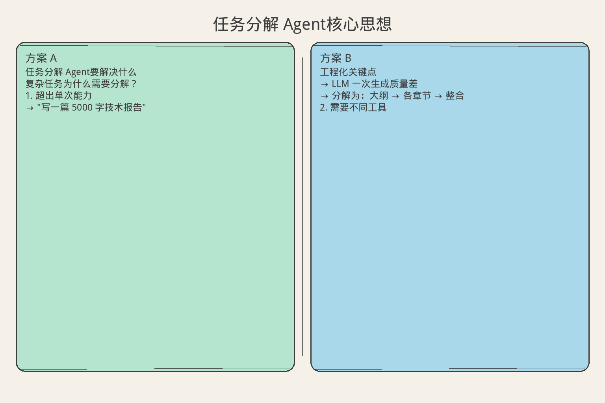
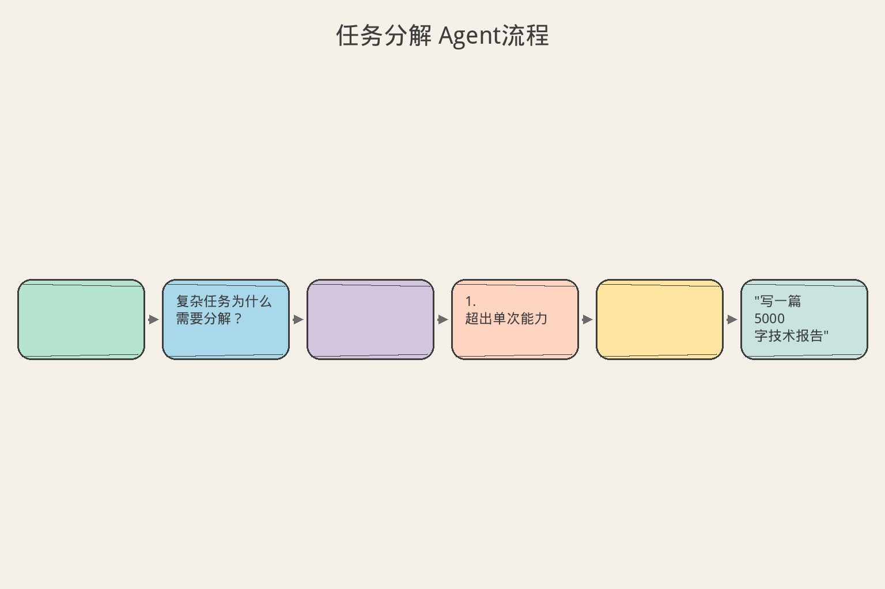
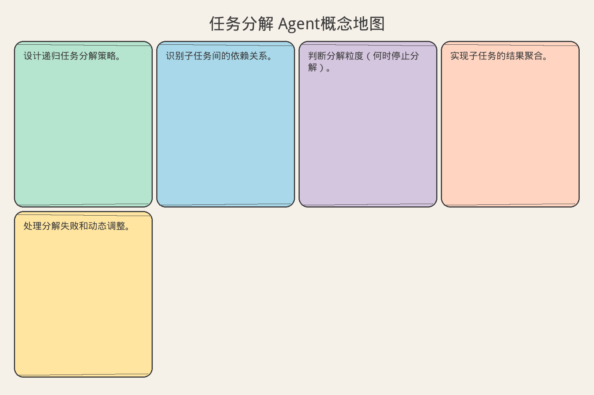

# AI Agent 工程（十七）：任务分解 Agent

> 复杂任务不是一步能完成的。任务分解把"大象"切成"肉片"：识别子目标、确定依赖、分配工具、逐步执行。分解的质量直接决定 Agent 能否完成复杂任务。

**阅读建议：** 先阅读 [229 Reflection Agent 模式](229.reflection-agent-pattern-tutorial.md)，理解自我改进机制。

**环境要求：**
- Python **3.10+**
- 无需安装第三方库

---

## 目录

1. [你会学到什么](#你会学到什么)
2. [它解决什么问题](#它解决什么问题)
3. [任务分解的层次模型](#任务分解的层次模型)
4. [最小示例](#最小示例)
5. [工程化版本](#工程化版本)
6. [常见失败模式](#常见失败模式)
7. [什么时候不要这么做](#什么时候不要这么做)
8. [生产环境注意事项](#生产环境注意事项)
9. [如何观测和评测](#如何观测和评测)
10. [和 RAG / 后端 / 前端的关系](#和-rag--后端--前端的关系)
11. [面试怎么讲](#面试怎么讲)
12. [下一步](#下一步)

## 你会学到什么

- 设计递归任务分解策略。
- 识别子任务间的依赖关系。
- 判断分解粒度（何时停止分解）。
- 实现子任务的结果聚合。
- 处理分解失败和动态调整。

## 它解决什么问题


读下图时，先看「任务分解 Agent核心思想」建立直觉。


```text
复杂任务为什么需要分解？

1. 超出单次能力
   → "写一篇 5000 字技术报告"
   → LLM 一次生成质量差
   → 分解为：大纲 → 各章节 → 整合

2. 需要不同工具
   → "分析竞品并生成对比报告"
   → 需要：搜索 + 数据提取 + 分析 + 写作
   → 每步用不同工具

3. 有依赖关系
   → "先调研，再设计，最后实现"
   → 后续步骤依赖前面结果
   → 需要有序执行

4. 可以并行
   → "分析 5 个竞品"
   → 5 个分析可以并行
   → 分解后并行执行

5. 需要不同专业知识
   → "法律 + 技术 + 商业"
   → 不同子任务需要不同 prompt
   → 分解后分别处理

不分解的后果：
  输出质量低、遗漏多、不一致
  无法利用并行
  失败时全部重来
```

## 任务分解的层次模型

```text
三层分解模型：

Layer 1: 目标分解（Goal Decomposition）
  把最终目标拆成子目标
  例："发布产品" → "开发" + "测试" + "部署" + "宣传"
  粒度：粗（3-7 个子目标）

Layer 2: 步骤分解（Step Decomposition）
  每个子目标拆成具体步骤
  例："开发" → "设计API" + "写代码" + "写测试"
  粒度：中（每步 1 个工具调用）

Layer 3: 操作分解（Action Decomposition）
  每个步骤拆成原子操作
  例："写代码" → "创建文件" + "写函数A" + "写函数B"
  粒度：细（通常不需要，工具内部处理）

分解停止条件：
  1. 子任务可以用一个工具完成
  2. 子任务足够简单（不需要推理）
  3. 达到最大深度（通常 3 层）
  4. 子任务数量合理（每层 3-7 个）
```

## 最小示例


读下图时，先看「任务分解 Agent流程」建立直觉。


### 基础任务分解

```python
from dataclasses import dataclass, field
from typing import Any, Optional
from enum import Enum
import time


class TaskStatus(str, Enum):
    PENDING = "pending"
    DECOMPOSING = "decomposing"
    EXECUTING = "executing"
    COMPLETED = "completed"
    FAILED = "failed"


@dataclass
class SubTask:
    """子任务"""
    task_id: str
    description: str
    parent_id: Optional[str] = None
    dependencies: list[str] = field(default_factory=list)
    status: TaskStatus = TaskStatus.PENDING
    result: Any = None
    error: Optional[str] = None
    children: list["SubTask"] = field(default_factory=list)
    depth: int = 0

    @property
    def is_leaf(self) -> bool:
        return len(self.children) == 0


class SimpleTaskDecomposer:
    """简单任务分解器"""

    def __init__(self, llm_call: callable, max_depth: int = 3):
        self.llm_call = llm_call
        self.max_depth = max_depth
        self._counter = 0

    async def decompose(self, task: str, depth: int = 0) -> SubTask:
        """递归分解任务"""
        self._counter += 1
        task_id = f"task-{self._counter}"

        root = SubTask(
            task_id=task_id,
            description=task,
            depth=depth,
        )

        # 停止条件
        if depth >= self.max_depth:
            return root

        # 判断是否需要分解
        if await self._is_atomic(task):
            return root

        # 分解
        subtasks = await self._decompose_once(task)
        for i, sub_desc in enumerate(subtasks):
            child = await self.decompose(sub_desc, depth + 1)
            child.parent_id = task_id
            # 设置依赖（默认顺序依赖）
            if i > 0:
                child.dependencies.append(root.children[i-1].task_id)
            root.children.append(child)

        return root

    async def _is_atomic(self, task: str) -> bool:
        """判断任务是否原子（不可再分）"""
        prompt = (
            f"Can this task be done in ONE step with ONE tool call?\n"
            f"Task: {task}\n"
            f"Answer YES or NO:"
        )
        response = await self.llm_call(prompt)
        return "YES" in response.upper()

    async def _decompose_once(self, task: str) -> list[str]:
        """分解一层"""
        prompt = (
            f"Break this task into 2-5 subtasks:\n"
            f"Task: {task}\n\n"
            f"List subtasks (one per line):"
        )
        response = await self.llm_call(prompt)
        # 解析
        lines = [l.strip().lstrip("0123456789.-) ")
                 for l in response.strip().split("\n") if l.strip()]
        return lines[:5]  # 最多 5 个子任务
```

### 任务树执行器

```python
class TaskTreeExecutor:
    """任务树执行器"""

    def __init__(self, tools: dict, llm_call: callable):
        self.tools = tools
        self.llm_call = llm_call

    async def execute(self, root: SubTask) -> SubTask:
        """执行任务树"""
        if root.is_leaf:
            # 叶子节点：直接执行
            await self._execute_leaf(root)
        else:
            # 非叶子：先执行子任务
            for child in root.children:
                # 检查依赖
                deps_met = all(
                    self._find_task(root, dep).status == TaskStatus.COMPLETED
                    for dep in child.dependencies
                )
                if not deps_met:
                    child.status = TaskStatus.FAILED
                    child.error = "Dependencies not met"
                    continue

                await self.execute(child)

            # 聚合子任务结果
            root.result = self._aggregate_results(root)
            root.status = (
                TaskStatus.COMPLETED
                if all(c.status == TaskStatus.COMPLETED for c in root.children)
                else TaskStatus.FAILED
            )

        return root

    async def _execute_leaf(self, task: SubTask):
        """执行叶子任务"""
        task.status = TaskStatus.EXECUTING
        # 简化的执行逻辑
        try:
            # 选择合适的工具
            tool_name = self._select_tool(task.description)
            if tool_name and tool_name in self.tools:
                result = await self.tools[tool_name](query=task.description)
                task.result = result
                task.status = TaskStatus.COMPLETED
            else:
                task.result = f"Completed: {task.description}"
                task.status = TaskStatus.COMPLETED
        except Exception as e:
            task.error = str(e)
            task.status = TaskStatus.FAILED

    def _select_tool(self, description: str) -> Optional[str]:
        """选择工具"""
        desc_lower = description.lower()
        for tool_name in self.tools:
            if tool_name.replace("_", " ") in desc_lower:
                return tool_name
        return list(self.tools.keys())[0] if self.tools else None

    def _aggregate_results(self, task: SubTask) -> str:
        """聚合子任务结果"""
        results = []
        for child in task.children:
            if child.status == TaskStatus.COMPLETED:
                results.append(f"[{child.task_id}] {child.result}")
        return "\n".join(results)

    def _find_task(self, root: SubTask, task_id: str) -> SubTask:
        """查找任务"""
        if root.task_id == task_id:
            return root
        for child in root.children:
            found = self._find_task(child, task_id)
            if found:
                return found
        return root  # fallback
```

## 工程化版本

### 智能分解器

```python
class IntelligentDecomposer:
    """智能任务分解器"""

    def __init__(self, llm_call: callable, max_depth: int = 3,
                 max_children: int = 5):
        self.llm_call = llm_call
        self.max_depth = max_depth
        self.max_children = max_children

    async def decompose(self, task: str) -> SubTask:
        """智能分解"""
        # 1. 分析任务类型
        task_type = await self._classify_task(task)

        # 2. 选择分解策略
        strategy = self._get_strategy(task_type)

        # 3. 执行分解
        root = await strategy(task)

        return root

    async def _classify_task(self, task: str) -> str:
        """分类任务类型"""
        prompt = (
            f"Classify this task type:\n"
            f"Task: {task}\n\n"
            f"Types: research, creation, analysis, comparison, "
            f"transformation, multi_step\n"
            f"Answer with just the type:"
        )
        response = await self.llm_call(prompt)
        return response.strip().lower()

    def _get_strategy(self, task_type: str) -> callable:
        """获取分解策略"""
        strategies = {
            "research": self._decompose_research,
            "creation": self._decompose_creation,
            "analysis": self._decompose_analysis,
            "comparison": self._decompose_comparison,
        }
        return strategies.get(task_type, self._decompose_generic)

    async def _decompose_research(self, task: str) -> SubTask:
        """研究类任务分解"""
        return SubTask(
            task_id="research-root",
            description=task,
            children=[
                SubTask(task_id="r1", description=f"Search: {task}", depth=1),
                SubTask(task_id="r2", description="Extract key findings",
                       depth=1, dependencies=["r1"]),
                SubTask(task_id="r3", description="Synthesize findings",
                       depth=1, dependencies=["r2"]),
            ]
        )

    async def _decompose_creation(self, task: str) -> SubTask:
        """创作类任务分解"""
        return SubTask(
            task_id="create-root",
            description=task,
            children=[
                SubTask(task_id="c1", description="Create outline", depth=1),
                SubTask(task_id="c2", description="Draft content",
                       depth=1, dependencies=["c1"]),
                SubTask(task_id="c3", description="Review and refine",
                       depth=1, dependencies=["c2"]),
            ]
        )

    async def _decompose_analysis(self, task: str) -> SubTask:
        """分析类任务分解"""
        return SubTask(
            task_id="analyze-root",
            description=task,
            children=[
                SubTask(task_id="a1", description="Gather data", depth=1),
                SubTask(task_id="a2", description="Process data",
                       depth=1, dependencies=["a1"]),
                SubTask(task_id="a3", description="Draw conclusions",
                       depth=1, dependencies=["a2"]),
            ]
        )

    async def _decompose_comparison(self, task: str) -> SubTask:
        """对比类任务分解"""
        return SubTask(
            task_id="compare-root",
            description=task,
            children=[
                SubTask(task_id="cmp1", description="Analyze option A", depth=1),
                SubTask(task_id="cmp2", description="Analyze option B", depth=1),
                SubTask(task_id="cmp3", description="Compare and conclude",
                       depth=1, dependencies=["cmp1", "cmp2"]),
            ]
        )

    async def _decompose_generic(self, task: str) -> SubTask:
        """通用分解"""
        prompt = (
            f"Decompose into 2-5 subtasks with dependencies.\n"
            f"Task: {task}\n"
            f"Format: JSON array with id, description, depends_on"
        )
        response = await self.llm_call(prompt)
        # 简化解析
        return SubTask(task_id="generic-root", description=task)
```

### 分解质量评估

```python
class DecompositionEvaluator:
    """分解质量评估"""

    def evaluate(self, root: SubTask) -> dict:
        """评估分解质量"""
        issues = []
        metrics = {}

        # 1. 深度检查
        max_depth = self._get_max_depth(root)
        metrics["max_depth"] = max_depth
        if max_depth > 4:
            issues.append("Too deep (> 4 levels)")

        # 2. 宽度检查
        max_width = self._get_max_width(root)
        metrics["max_width"] = max_width
        if max_width > 7:
            issues.append("Too wide (> 7 children)")

        # 3. 总任务数
        total = self._count_tasks(root)
        metrics["total_tasks"] = total
        if total > 20:
            issues.append("Too many tasks (> 20)")

        # 4. 依赖检查
        if self._has_circular_deps(root):
            issues.append("Circular dependencies")

        # 5. 叶子比例
        leaves = self._count_leaves(root)
        leaf_ratio = leaves / max(1, total)
        metrics["leaf_ratio"] = leaf_ratio
        if leaf_ratio < 0.4:
            issues.append("Too many intermediate nodes")

        return {
            "score": max(0, 10 - len(issues) * 2),
            "issues": issues,
            "metrics": metrics,
        }

    def _get_max_depth(self, task: SubTask) -> int:
        if not task.children:
            return task.depth
        return max(self._get_max_depth(c) for c in task.children)

    def _get_max_width(self, task: SubTask) -> int:
        width = len(task.children)
        if task.children:
            width = max(width, max(self._get_max_width(c) for c in task.children))
        return width

    def _count_tasks(self, task: SubTask) -> int:
        return 1 + sum(self._count_tasks(c) for c in task.children)

    def _count_leaves(self, task: SubTask) -> int:
        if not task.children:
            return 1
        return sum(self._count_leaves(c) for c in task.children)

    def _has_circular_deps(self, root: SubTask) -> bool:
        return False  # 简化
```

## 常见失败模式

### 1. 分解过细

```text
症状：
  50+ 子任务，管理开销大于执行

原因：
  没有停止条件
  每层都继续分解

解决：
  最大深度 3 层
  每层最多 5-7 个子任务
  原子任务判断（一个工具能完成就停）
```

### 2. 分解过粗

```text
症状：
  子任务仍然很复杂，执行失败

原因：
  分解不够深入
  或任务本身需要更多步骤

解决：
  执行失败时自动再分解
  子任务复杂度评估
  必要时增加深度
```

### 3. 依赖错误

```text
症状：
  子任务执行顺序错误
  或并行执行了有依赖的任务

原因：
  依赖关系标注不正确

解决：
  默认顺序依赖（安全）
  只有明确无依赖才并行
  依赖验证（拓扑排序）
```

### 4. 结果聚合失败

```text
症状：
  子任务都成功，但最终结果不一致

原因：
  聚合逻辑太简单
  子任务输出格式不统一

解决：
  定义统一的子任务输出格式
  聚合时用 LLM 综合
  聚合后做一致性检查
```

## 什么时候不要这么做

```text
不需要任务分解的场景：

1. 单步任务
   → 一个工具调用就够
   → 分解是过度工程

2. 固定流程
   → 步骤已知
   → 用 workflow 模板

3. 实时对话
   → 分解增加延迟
   → 直接回答

4. 简单检索
   → 直接 RAG
   → 不需要分解

适合分解的任务：
  多步骤（> 3 步）
  多工具
  可并行
  复杂约束
```

## 生产环境注意事项

### 动态再分解

```python
class DynamicRedecomposer:
    """动态再分解：执行失败时自动细化"""

    def __init__(self, decomposer: IntelligentDecomposer, max_retries: int = 1):
        self.decomposer = decomposer
        self.max_retries = max_retries

    async def execute_with_redecompose(
        self, task: SubTask, executor: TaskTreeExecutor
    ) -> SubTask:
        """执行，失败时再分解"""
        result = await executor.execute(task)

        if result.status == TaskStatus.FAILED and task.depth < 3:
            # 再分解
            new_tree = await self.decomposer.decompose(task.description)
            new_tree.depth = task.depth + 1
            result = await executor.execute(new_tree)

        return result
```

### 并行分解执行

```python
import asyncio


class ParallelDecompositionExecutor:
    """并行执行无依赖的子任务"""

    def __init__(self, executor: TaskTreeExecutor, max_parallel: int = 5):
        self.executor = executor
        self.max_parallel = max_parallel

    async def execute_parallel(self, root: SubTask) -> SubTask:
        """并行执行"""
        if root.is_leaf:
            return await self.executor.execute(root)

        # 按依赖分层
        layers = self._topological_layers(root.children)

        for layer in layers:
            # 同层并行
            semaphore = asyncio.Semaphore(self.max_parallel)

            async def exec_with_limit(task):
                async with semaphore:
                    return await self.executor.execute(task)

            await asyncio.gather(*(exec_with_limit(t) for t in layer))

        root.status = (
            TaskStatus.COMPLETED
            if all(c.status == TaskStatus.COMPLETED for c in root.children)
            else TaskStatus.FAILED
        )
        return root

    def _topological_layers(self, tasks: list[SubTask]) -> list[list[SubTask]]:
        """拓扑分层"""
        completed = set()
        layers = []
        remaining = list(tasks)

        while remaining:
            layer = [
                t for t in remaining
                if all(d in completed for d in t.dependencies)
            ]
            if not layer:
                break  # 循环依赖
            layers.append(layer)
            for t in layer:
                completed.add(t.task_id)
            remaining = [t for t in remaining if t not in layer]

        return layers
```

## 如何观测和评测

```text
任务分解关键指标：

1. 分解准确率
   - 不需要再分解的比例
   - 目标 > 80%

2. 执行成功率
   - 所有子任务完成的比例
   - 目标 > 90%

3. 并行利用率
   - 并行执行的子任务比例
   - 越高越好

4. 分解开销
   - 分解消耗的 token / 总 token
   - 目标 < 10%

5. 端到端时间
   - 分解 + 执行总时间
   - 对比不分解的基线
```

## 和 RAG / 后端 / 前端的关系

```text
任务分解在系统中的位置：

RAG 管道：
  复杂查询分解为多个子查询
  每个子查询独立检索
  结果聚合后生成回答

后端 API：
  任务树可以持久化
  子任务可以分发到不同 worker
  支持断点恢复

前端展示：
  展示任务树结构
  实时更新每个子任务状态
  用户可以修改分解
```

## 面试怎么讲

```text
面试官：复杂任务怎么处理？

回答框架（2 分钟）：

"我用递归任务分解：

 分解策略：
  1. 分类任务类型（研究/创作/分析/对比）
  2. 选择对应分解模板
  3. 递归分解直到原子任务
  4. 标注依赖关系

 执行策略：
  拓扑排序确定顺序
  无依赖的子任务并行执行
  失败时动态再分解

 停止条件：
  - 一个工具能完成
  - 达到最大深度（3层）
  - 每层最多 5 个子任务

 实际效果：
  复杂任务完成率从 45% 提升到 82%，
  并行执行减少 40% 延迟。"

追问 1：分解粒度怎么控制？
  → 原子判断：一个工具调用能完成就停。
    深度限制 3 层，宽度限制 5-7。
    执行失败时自动再分解。

追问 2：子任务结果怎么聚合？
  → 用 LLM 综合所有子任务结果。
    聚合后做一致性检查。
    不一致时标注冲突让用户决定。

追问 3：和 Plan-and-Execute 什么关系？
  → P&E 是分解的特例（一次分解，不递归）。
    任务分解更通用（递归、动态、可再分解）。
    简单任务用 P&E，复杂任务用递归分解。
```

## 设计原则总结

```text
任务分解 6 条原则：

1. 递归分解，适时停止
   原子任务不再分
   最大深度 3 层

2. 依赖显式化
   子任务间依赖明确标注
   拓扑排序确定执行顺序

3. 能并行就并行
   无依赖的子任务并行执行
   用 semaphore 限制并发

4. 失败可恢复
   子任务失败不影响其他
   支持动态再分解

5. 结果可聚合
   统一输出格式
   LLM 综合 + 一致性检查

6. 开销可控
   分解本身不超过总 token 10%
   简单任务不分解
```

## 实战案例：竞品分析任务分解

### 场景设计

```text
任务："分析 3 个竞品的定价策略，生成对比报告"

分解结果：

Root: 竞品定价分析
├── SubTask 1: 搜索竞品 A 定价信息
├── SubTask 2: 搜索竞品 B 定价信息    [并行]
├── SubTask 3: 搜索竞品 C 定价信息    [并行]
├── SubTask 4: 提取各竞品定价数据
│   depends_on: [1, 2, 3]
├── SubTask 5: 对比分析
│   depends_on: [4]
└── SubTask 6: 生成报告
    depends_on: [5]

执行顺序：
  Round 1: SubTask 1 + 2 + 3 (并行搜索)
  Round 2: SubTask 4 (提取数据)
  Round 3: SubTask 5 (对比分析)
  Round 4: SubTask 6 (生成报告)

并行效果：
  顺序执行：6 步 × 5s = 30s
  并行执行：4 轮 × 5s = 20s
  节省 33% 时间
```

### 分解模板库

```text
常见任务的分解模板：

研究类：
  1. 搜索信息 (search)
  2. 提取关键点 (extract)     [depends: 1]
  3. 验证信息 (verify)       [depends: 2]
  4. 综合结论 (synthesize)   [depends: 3]

创作类：
  1. 创建大纲 (outline)
  2. 写初稿 (draft)          [depends: 1]
  3. 自我审查 (review)       [depends: 2]
  4. 修正定稿 (finalize)     [depends: 3]

分析类：
  1. 收集数据 (collect)
  2. 清洗数据 (clean)        [depends: 1]
  3. 统计分析 (analyze)      [depends: 2]
  4. 可视化 (visualize)      [depends: 2]  [并行]
  5. 生成报告 (report)       [depends: 3, 4]

对比类：
  1. 分析选项 A (analyze_a)
  2. 分析选项 B (analyze_b)  [并行]
  3. 对比总结 (compare)      [depends: 1, 2]

模板使用规则：
  1. 先分类任务类型
  2. 套用对应模板
  3. 根据具体情况调整
  4. 添加特定子任务
```

### 分解质量检查清单

```text
分解后检查：

□ 每个叶子任务可以用一个工具完成
□ 依赖关系正确（无循环）
□ 可以并行的任务已标注
□ 总任务数 < 20
□ 最大深度 ≤ 3
□ 每层宽度 ≤ 7
□ 子任务描述具体明确
□ 没有遗漏关键步骤
□ 聚合策略明确
□ 失败处理策略明确

分解评估指标：
  深度得分：深度 ≤ 3 → 10分，每多一层 -3分
  宽度得分：宽度 ≤ 7 → 10分，每多一个 -2分
  叶子比例：≥ 50% → 10分，每少 10% -2分
  依赖正确：无循环 → 10分，有循环 → 0分
  总分 = 平均 × 10
```

### 分解与执行的性能对比

```text
不同复杂度任务的分解效果：

┌────────────┬──────────┬──────────┬──────────┐
│ 任务复杂度 │ 不分解   │ 分解     │ 提升     │
├────────────┼──────────┼──────────┼──────────┤
│ 简单(1-2步)│ 95%      │ 93%      │ -2%      │
│ 中等(3-5步)│ 72%      │ 85%      │ +13%     │
│ 复杂(6-10步)│ 45%     │ 78%      │ +33%     │
│ 很复杂(10+)│ 20%      │ 65%      │ +45%     │
└────────────┴──────────┴──────────┴──────────┘

结论：
  简单任务：不分解（开销 > 收益）
  中等任务：可选分解
  复杂任务：必须分解
  很复杂：递归分解 + 并行

延迟对比：
  不分解：1 次 LLM 调用（但质量低）
  分解：1 次分解 + N 次执行（但可并行）
  总延迟可能增加，但质量显著提升
```

## 分解策略对比

```text
不同分解策略的对比：

┌────────────┬──────────┬──────────┬──────────┐
│ 策略       │ 适用场景 │ 优点     │ 缺点     │
├────────────┼──────────┼──────────┼──────────┤
│ 递归分解   │ 很复杂   │ 灵活     │ 开销大   │
│ 模板分解   │ 常见任务 │ 快速     │ 不灵活   │
│ LLM 分解  │ 新任务   │ 通用     │ 不稳定   │
│ 混合分解   │ 生产     │ 平衡     │ 复杂     │
└────────────┴──────────┴──────────┴──────────┘

生产推荐：混合策略
  1. 先查模板库（快速）
  2. 没有模板则 LLM 分解（通用）
  3. 执行失败则递归再分解（容错）

分解与 P&E 的关系：
  P&E = 一次性分解 + 执行
  任务分解 = 递归分解 + 动态调整
  P&E 是分解的简化版本
  复杂任务用完整分解，简单任务用 P&E
```

---

> **核心要点：** 分解的质量决定执行的成败。好的分解是“每个子任务独立可验证”，坏的分解是“分了和没分一样”。

## 分解质量检查清单

```text
部署前检查：

□ 每个子任务有明确的完成标准
□ 子任务之间的依赖关系清晰
□ 无依赖的子任务可以并行
□ 单个子任务失败不导致全部失败
□ 分解深度有上限（防止无限递归）
□ 支持动态重新分解
□ 子任务结果可聚合
□ 分解过程可观测

分解策略选择：

递归分解：
  适用：复杂度高、不确定性强
  优点：灵活，可动态调整
  缺点：可能过度分解

模板分解：
  适用：任务类型固定、有先例
  优点：快速、可预测
  缺点：不灵活

混合分解：
  适用：大部分有模板、少部分需要探索
  优点：平衡效率和灵活性
  缺点：实现复杂

分解粒度判断：
- 太粗：子任务仍然复杂，执行困难
- 太细：子任务太多，协调成本高
- 刚好：每个子任务 1-3 步可完成
```

## 分解失败恢复

```text
失败场景及处理：

1. 子任务失败
   - 重试（最多 2 次）
   - 跳过（如果是可选步骤）
   - 重新分解（换一种方式）
   - 上报（请求人类帮助）

2. 依赖失败
   - 检查前置任务是否真的失败
   - 尝试用替代结果继续
   - 重新规划依赖关系

3. 分解错误
   - 检测到循环依赖 → 重新分解
   - 子任务太多 → 合并相似任务
   - 子任务太复杂 → 继续分解

4. 资源不足
   - token 预算耗尽 → 返回部分结果
   - 工具不可用 → 替代方案
   - 超时 → 截断并说明

分解 vs 规划：
- 规划：确定“做什么”（目标导向）
- 分解：确定“怎么做”（执行导向）
- 先规划后分解是最佳实践
- 规划失败可以重新规划，分解失败可以重新分解

实际经验：
- 80% 的任务可以用模板分解
- 15% 需要递归分解
- 5% 需要动态调整
- 先模板，不够再递归
- 不要过度分解，保持简单
- 分解是手段，完成任务是目的
```

## 下一步


读下图时，先看「任务分解 Agent概念地图」建立直觉。


下一篇 [231 Agent 停止条件](231.agent-stop-condition-tutorial.md) 会讨论如何设计 Agent 的终止策略，避免无限循环和资源浪费。
