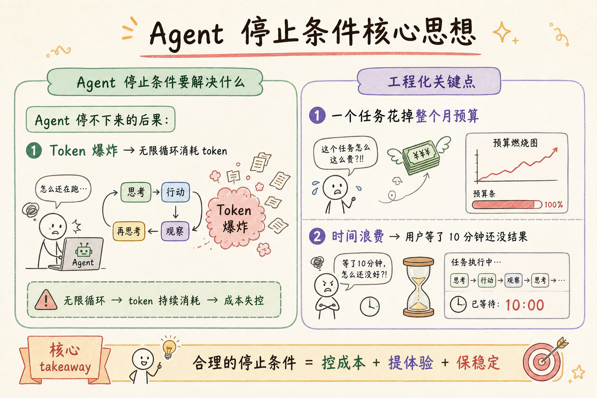
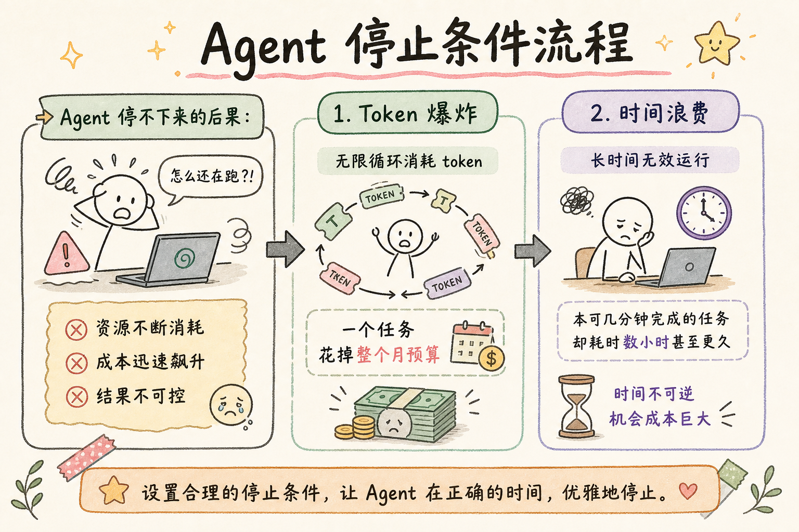
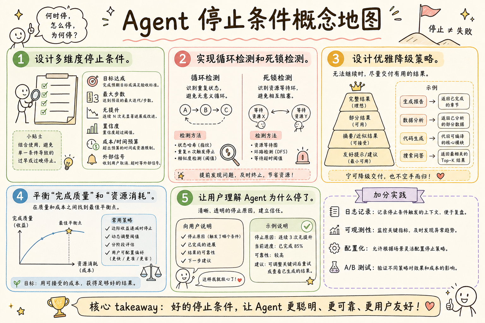

# AI Agent 工程（十八）：Agent 停止条件

> Agent 最危险的不是做错事，而是停不下来。无限循环消耗 token、占用资源、产生副作用。好的停止条件让 Agent 知道什么时候该收手：任务完成、预算耗尽、陷入循环、或者该请求人类帮助。

**阅读建议：** 先阅读 [230 任务分解 Agent](230.task-decomposition-agent-tutorial.md)，理解任务执行流程。

**环境要求：**
- Python **3.10+**
- 无需安装第三方库


**档位：** 主线篇（Part 3）
**本文边界：** 前驱篇 [226–230](226.agent-loop-observe-think-act-tutorial.md) 循环与规划。本篇停止条件与预算。不讲 RL 探索。接续 [232](232.agent-memory-types-tutorial.md)。
**动手路径：** ① 读预算表 → ② 运行 `demo_stop()` → ③ 去掉停止条件观察死循环风险

### 核心术语（本篇首次出现）
**OTA**（Observe-Think-Act）：观察环境→推理→执行行动的循环。
通俗说：看一眼→想一下→动手→再看结果。
**停止条件**（Stop Condition）：决定 Agent 何时退出循环的规则。
通俗说：像跑步机的紧急停止钮。
**完成信号**（Completion Signal）：模型或规则显式声明「任务结束」，避免空转。
通俗说：模型或规则显式声明「任务结束」。
---

## 目录

1. [你会学到什么](#你会学到什么)
2. [它解决什么问题](#它解决什么问题)
3. [停止条件分类](#停止条件分类)
4. [最小示例](#最小示例)
5. [工程化版本](#工程化版本)
6. [常见失败模式](#常见失败模式)
7. [什么时候不要这么做](#什么时候不要这么做)
8. [生产环境注意事项](#生产环境注意事项)
9. [如何观测和评测](#如何观测和评测)
10. [和 RAG / 后端 / 前端的关系](#和-rag--后端--前端的关系)
11. [面试怎么讲](#面试怎么讲)
12. [下一步](#下一步)

## 你会学到什么

- 设计多维度停止条件。
- 实现循环检测和死锁检测。
- 设计优雅降级策略。
- 平衡"完成质量"和"资源消耗"。
- 让用户理解 Agent 为什么停了。

## 它解决什么问题


读下图时，先看「Agent 停止条件核心思想」建立直觉。


对照上图：停止条件=预算+完成信号——没有上限的循环在生产上等于事故。

读下图时，先看能力边界与痛点流程——与 §最小示例 代码互补，不是逐步对照。


对照上图：步数/时间/Token 预算与显式完成信号——没有停止条件的 Agent 是生产事故。
```text
Agent 停不下来的后果：

1. Token 爆炸
   → 无限循环消耗 token
   → 一个任务花掉整个月预算

2. 时间浪费
   → 用户等了 10 分钟还没结果
   → 其实第 2 分钟就该停了

3. 副作用累积
   → 重复调用写操作
   → 发了 100 封相同邮件

4. 资源占用
   → 占住并发槽位
   → 其他请求排队

5. 用户体验差
   → 不知道 Agent 在干什么
   → 不知道什么时候能结束

需要停止条件：
  正常完成 → 任务做完了
  预算耗尽 → 没钱/没时间了
  循环检测 → 在做重复的事
  质量达标 → 够好了，不需要更好
  异常 → 出错了，继续没意义
  人工干预 → 用户喊停
```

## 停止条件分类

```text
六类停止条件：

1. 成功停止（Success Stop）
   → 任务完成，输出最终答案
   → 触发：LLM 输出 finish() / 所有子任务完成

2. 预算停止（Budget Stop）
   → Token / 时间 / 步数超限
   → 触发：计数器达到阈值
   → 处理：返回当前最佳结果

3. 循环停止（Loop Stop）
   → 检测到重复行为
   → 触发：相同行动出现 N 次
   → 处理：强制停止 + 报告

4. 质量停止（Quality Stop）
   → 输出质量达标
   → 触发：评估分数 ≥ 阈值
   → 处理：输出结果

5. 异常停止（Error Stop）
   → 不可恢复的错误
   → 触发：致命错误 / 连续失败
   → 处理：报告错误 + 建议

6. 外部停止（External Stop）
   → 用户取消 / 系统关闭
   → 触发：取消信号
   → 处理：保存状态 + 清理

优先级：
  外部停止 > 异常停止 > 预算停止 > 循环停止 > 质量停止 > 成功停止
```

## 最小示例

**演示什么：** 本节最小可运行切片。**环境：** 见文首。**预期：** 控制台打印 demo 输出。

### 基础停止控制器

```python
from dataclasses import dataclass, field
from enum import Enum
from typing import Any, Optional
import time


class StopReason(str, Enum):
    SUCCESS = "success"
    BUDGET_EXHAUSTED = "budget_exhausted"
    LOOP_DETECTED = "loop_detected"
    QUALITY_MET = "quality_met"
    ERROR = "error"
    USER_CANCELLED = "user_cancelled"
    MAX_STEPS = "max_steps"


@dataclass
class StopDecision:
    """停止决策"""
    should_stop: bool
    reason: StopReason
    message: str
    partial_result: Any = None
    confidence: float = 0.0


class BasicStopController:
    """基础停止控制器"""

    def __init__(
        self,
        max_steps: int = 15,
        max_time_seconds: float = 120,
        max_tokens: int = 100000,
    ):
        self.max_steps = max_steps
        self.max_time = max_time_seconds
        self.max_tokens = max_tokens
        self._start_time = time.time()
        self._step_count = 0
        self._token_count = 0
        self._action_history: list[str] = []

    def check(self, current_output: str = "") -> StopDecision:
        """检查是否应该停止"""
        self._step_count += 1

        # 1. 步数限制
        if self._step_count >= self.max_steps:
            return StopDecision(
                should_stop=True,
                reason=StopReason.MAX_STEPS,
                message=f"Reached max steps ({self.max_steps})",
                partial_result=current_output,
            )

        # 2. 时间限制
        elapsed = time.time() - self._start_time
        if elapsed >= self.max_time:
            return StopDecision(
                should_stop=True,
                reason=StopReason.BUDGET_EXHAUSTED,
                message=f"Time budget exhausted ({elapsed:.0f}s)",
                partial_result=current_output,
            )

        # 3. Token 限制
        if self._token_count >= self.max_tokens:
            return StopDecision(
                should_stop=True,
                reason=StopReason.BUDGET_EXHAUSTED,
                message=f"Token budget exhausted ({self._token_count})",
                partial_result=current_output,
            )

        # 4. 循环检测
        if self._detect_loop():
            return StopDecision(
                should_stop=True,
                reason=StopReason.LOOP_DETECTED,
                message="Repeated actions detected",
                partial_result=current_output,
            )

        return StopDecision(should_stop=False, reason=StopReason.SUCCESS, message="")

    def record_action(self, action: str, tokens: int = 0):
        """记录行动"""
        self._action_history.append(action)
        self._token_count += tokens

    def _detect_loop(self) -> bool:
        """检测循环"""
        if len(self._action_history) < 4:
            return False
        # 检查最近 3 次是否相同
        recent = self._action_history[-3:]
        return len(set(recent)) == 1
```

## 工程化版本

### 多维度停止引擎

```python
class StopConditionEngine:
    """多维度停止引擎"""

    def __init__(self):
        self._conditions: list["StopCondition"] = []
        self._priority_order = [
            StopReason.USER_CANCELLED,
            StopReason.ERROR,
            StopReason.BUDGET_EXHAUSTED,
            StopReason.LOOP_DETECTED,
            StopReason.QUALITY_MET,
            StopReason.SUCCESS,
        ]

    def add_condition(self, condition: "StopCondition"):
        self._conditions.append(condition)

    def evaluate(self, context: "AgentContext") -> StopDecision:
        """评估所有停止条件"""
        decisions = []
        for condition in self._conditions:
            decision = condition.check(context)
            if decision.should_stop:
                decisions.append(decision)

        if not decisions:
            return StopDecision(should_stop=False, reason=StopReason.SUCCESS, message="")

        # 按优先级排序
        decisions.sort(
            key=lambda d: self._priority_order.index(d.reason)
            if d.reason in self._priority_order else 99
        )
        return decisions[0]


class StopCondition:
    """停止条件基类"""

    def check(self, context: "AgentContext") -> StopDecision:
        raise NotImplementedError


@dataclass
class AgentContext:
    """Agent 上下文"""
    step_count: int = 0
    elapsed_seconds: float = 0
    tokens_used: int = 0
    action_history: list[str] = field(default_factory=list)
    consecutive_failures: int = 0
    quality_score: float = 0.0
    is_cancelled: bool = False
    last_error: Optional[str] = None
    current_output: str = ""


class StepLimitCondition(StopCondition):
    """步数限制"""

    def __init__(self, max_steps: int = 15):
        self.max_steps = max_steps

    def check(self, ctx: AgentContext) -> StopDecision:
        if ctx.step_count >= self.max_steps:
            return StopDecision(
                should_stop=True,
                reason=StopReason.MAX_STEPS,
                message=f"Step limit reached ({self.max_steps})",
                partial_result=ctx.current_output,
            )
        return StopDecision(should_stop=False, reason=StopReason.SUCCESS, message="")


class TimeLimitCondition(StopCondition):
    """时间限制"""

    def __init__(self, max_seconds: float = 120):
        self.max_seconds = max_seconds

    def check(self, ctx: AgentContext) -> StopDecision:
        if ctx.elapsed_seconds >= self.max_seconds:
            return StopDecision(
                should_stop=True,
                reason=StopReason.BUDGET_EXHAUSTED,
                message=f"Time limit ({self.max_seconds}s) reached",
                partial_result=ctx.current_output,
            )
        return StopDecision(should_stop=False, reason=StopReason.SUCCESS, message="")


class TokenLimitCondition(StopCondition):
    """Token 限制"""

    def __init__(self, max_tokens: int = 100000):
        self.max_tokens = max_tokens

    def check(self, ctx: AgentContext) -> StopDecision:
        if ctx.tokens_used >= self.max_tokens:
            return StopDecision(
                should_stop=True,
                reason=StopReason.BUDGET_EXHAUSTED,
                message=f"Token budget ({self.max_tokens}) exhausted",
                partial_result=ctx.current_output,
            )
        return StopDecision(should_stop=False, reason=StopReason.SUCCESS, message="")


class LoopDetectionCondition(StopCondition):
    """循环检测"""

    def __init__(self, window: int = 3, threshold: int = 2):
        self.window = window
        self.threshold = threshold

    def check(self, ctx: AgentContext) -> StopDecision:
        if len(ctx.action_history) < self.window:
            return StopDecision(should_stop=False, reason=StopReason.SUCCESS, message="")

        # 检查最近 window 个行动中是否有重复模式
        recent = ctx.action_history[-self.window:]
        unique = len(set(recent))
        if unique <= self.threshold:
            return StopDecision(
                should_stop=True,
                reason=StopReason.LOOP_DETECTED,
                message=f"Loop detected: {recent}",
                partial_result=ctx.current_output,
            )
        return StopDecision(should_stop=False, reason=StopReason.SUCCESS, message="")


class ConsecutiveFailureCondition(StopCondition):
    """连续失败检测"""

    def __init__(self, max_failures: int = 3):
        self.max_failures = max_failures

    def check(self, ctx: AgentContext) -> StopDecision:
        if ctx.consecutive_failures >= self.max_failures:
            return StopDecision(
                should_stop=True,
                reason=StopReason.ERROR,
                message=f"{self.max_failures} consecutive failures: {ctx.last_error}",
                partial_result=ctx.current_output,
            )
        return StopDecision(should_stop=False, reason=StopReason.SUCCESS, message="")


class QualityThresholdCondition(StopCondition):
    """质量达标停止"""

    def __init__(self, threshold: float = 8.0):
        self.threshold = threshold

    def check(self, ctx: AgentContext) -> StopDecision:
        if ctx.quality_score >= self.threshold:
            return StopDecision(
                should_stop=True,
                reason=StopReason.QUALITY_MET,
                message=f"Quality threshold met ({ctx.quality_score:.1f})",
                partial_result=ctx.current_output,
                confidence=ctx.quality_score / 10,
            )
        return StopDecision(should_stop=False, reason=StopReason.SUCCESS, message="")


class CancellationCondition(StopCondition):
    """取消信号"""

    def check(self, ctx: AgentContext) -> StopDecision:
        if ctx.is_cancelled:
            return StopDecision(
                should_stop=True,
                reason=StopReason.USER_CANCELLED,
                message="Cancelled by user",
                partial_result=ctx.current_output,
            )
        return StopDecision(should_stop=False, reason=StopReason.SUCCESS, message="")
```

### 优雅降级

```python
class GracefulDegradation:
    """优雅降级：停止时给出最佳结果"""

    def __init__(self, llm_call: callable):
        self.llm_call = llm_call

    async def degrade(
        self, decision: StopDecision, context: AgentContext
    ) -> dict:
        """根据停止原因生成降级响应"""
        match decision.reason:
            case StopReason.SUCCESS | StopReason.QUALITY_MET:
                return {
                    "status": "completed",
                    "answer": context.current_output,
                    "confidence": decision.confidence,
                }

            case StopReason.BUDGET_EXHAUSTED | StopReason.MAX_STEPS:
                # 用 LLM 总结当前进展
                summary = await self._summarize_progress(context)
                return {
                    "status": "partial",
                    "answer": summary,
                    "note": "Stopped due to resource limits. Partial result.",
                    "progress": f"{context.step_count} steps completed",
                }

            case StopReason.LOOP_DETECTED:
                return {
                    "status": "failed",
                    "answer": None,
                    "error": "Agent got stuck in a loop",
                    "suggestion": "Try rephrasing the task or breaking it down",
                }

            case StopReason.ERROR:
                return {
                    "status": "failed",
                    "answer": None,
                    "error": context.last_error,
                    "suggestion": "Check tool availability and parameters",
                }

            case StopReason.USER_CANCELLED:
                return {
                    "status": "cancelled",
                    "answer": context.current_output or None,
                    "note": "Cancelled by user",
                }

    async def _summarize_progress(self, context: AgentContext) -> str:
        """总结当前进展"""
        prompt = (
            f"The agent was working on a task but ran out of budget.\n"
            f"Steps completed: {context.step_count}\n"
            f"Actions taken: {context.action_history[-5:]}\n"
            f"Current output: {context.current_output[:500]}\n\n"
            f"Summarize what was accomplished and what remains."
        )
        return await self.llm_call(prompt)
```

## 常见失败模式

### 1. 停止太早

```text
症状：
  任务没完成就停了

原因：
  阈值太严格
  或循环检测太敏感

解决：
  1. 合理设置阈值
  2. 循环检测窗口 > 3
  3. 停止前确认"真的完成了吗？"
```

### 2. 停止太晚

```text
症状：
  明显该停了但还在继续

原因：
  没有循环检测
  或预算限制太宽松

解决：
  1. 多重停止条件叠加
  2. 连续失败 3 次必须停
  3. 时间硬限制（不可覆盖）
```

### 3. 停止后没有输出

```text
症状：
  Agent 停了，但用户什么都没得到

原因：
  没有优雅降级
  部分结果被丢弃

解决：
  1. 任何停止都返回部分结果
  2. 说明停在哪里、为什么停
  3. 给出下一步建议
```

### 4. 循环检测误报

```text
症状：
  正常的重复操作被误判为循环

原因：
  检测太简单（只看行动名）

解决：
  1. 比较行动名 + 参数
  2. 允许"相同工具不同参数"
  3. 窗口大小 > 3
```

## 什么时候不要这么做

```text
不需要复杂停止条件的场景：

1. 单步调用
   → 一次就完成
   → 不需要循环控制

2. 有外部超时
   → HTTP 请求超时
   → 系统级保护已足够

3. 批处理任务
   → 离线执行
   → 时间不敏感

4. 有确定性终止
   → 固定步骤 workflow
   → 步骤完成就结束
```

## 生产环境注意事项

### 停止条件配置

```python
def build_production_stop_engine() -> StopConditionEngine:
    """构建生产环境停止引擎"""
    engine = StopConditionEngine()

    # 硬限制（不可覆盖）
    engine.add_condition(StepLimitCondition(max_steps=20))
    engine.add_condition(TimeLimitCondition(max_seconds=180))
    engine.add_condition(TokenLimitCondition(max_tokens=150000))

    # 软限制（可配置）
    engine.add_condition(LoopDetectionCondition(window=4, threshold=2))
    engine.add_condition(ConsecutiveFailureCondition(max_failures=3))

    # 质量停止（可选）
    engine.add_condition(QualityThresholdCondition(threshold=8.5))

    # 取消信号
    engine.add_condition(CancellationCondition())

    return engine
```

### 停止事件通知

```python
class StopEventNotifier:
    """停止事件通知"""

    def __init__(self):
        self._handlers: list[callable] = []

    def on_stop(self, handler: callable):
        self._handlers.append(handler)

    async def notify(self, decision: StopDecision, context: AgentContext):
        event = {
            "reason": decision.reason.value,
            "message": decision.message,
            "steps": context.step_count,
            "tokens": context.tokens_used,
            "elapsed": context.elapsed_seconds,
            "timestamp": time.time(),
        }
        for handler in self._handlers:
            await handler(event)
```

## 如何观测和评测

```text
停止条件关键指标：

1. 正常完成率
   - success / total
   - 目标 > 85%

2. 预算停止率
   - budget_stop / total
   - 目标 < 10%

3. 循环停止率
   - loop_stop / total
   - 目标 < 3%

4. 平均步数
   - 完成任务的平均步数
   - 对比基线

5. 部分结果质量
   - 预算停止时的部分结果质量
   - 用户满意度
```

## 和 RAG / 后端 / 前端的关系

```text
停止条件在系统中的位置：

RAG 管道：
  检索轮数限制（最多 3 轮）
  Token 预算（检索 + 生成）
  质量达标停止（相关性 > 阈值）

后端 API：
  请求超时（HTTP 层）
  并发限制
  取消 API（POST /tasks/{id}/cancel）

前端展示：
  展示停止原因
  展示部分结果
  提供"继续"按钮（增加预算）
  展示进度条
```

## 面试怎么讲

```text
面试官：Agent 什么时候停？

回答框架（2 分钟）：

"我设计了六类停止条件：

 1. 成功停止：任务完成。
 2. 预算停止：Token/时间/步数超限。
 3. 循环停止：检测到重复行为。
 4. 质量停止：评估分数达标。
 5. 异常停止：连续失败或致命错误。
 6. 外部停止：用户取消。

 关键设计：
 - 优先级排序：外部 > 异常 > 预算 > 循环 > 质量 > 成功
 - 优雅降级：任何停止都返回部分结果
 - 循环检测：窗口 4，允许相同工具不同参数
 - 连续失败 3 次强制停止

 实际效果：
  无限循环降为零，
  Token 浪费减少 70%，
  用户满意度提升（有明确停止原因）。"

追问 1：怎么检测循环？
  → 滑动窗口比较行动序列。
    相同行动 + 相同参数出现 2 次 → 循环。
    允许相同工具不同参数（正常探索）。

追问 2：停了之后怎么办？
  → 优雅降级：总结进展 + 返回部分结果。
    告知用户停在哪里、为什么。
    提供"继续"选项（增加预算）。

追问 3：阈值怎么定？
  → 步数：15-20（覆盖 95% 任务）
    时间：120s（用户可接受）
    Token：100K（成本可控）
    根据实际数据调整。
```

## 设计原则总结

```text
停止条件设计 6 条原则：

1. 多重保护
   步数 + 时间 + Token + 循环 + 失败
   任何一条触发都停止

2. 优先级明确
   外部取消最优先
   成功完成最后

3. 优雅降级
   任何停止都有输出
   部分结果 > 没有结果

4. 透明性
   告知用户为什么停
   停在哪里
   下一步建议

5. 可配置
   阈值按场景调整
   硬限制不可覆盖

6. 可观测
   停止事件记录日志
   监控停止原因分布
   异常停止告警
```

## 实战案例：不同场景的停止配置

### 场景 1：客服 Agent

```text
客服 Agent 停止配置：

硬限制：
  max_steps: 10
  max_time: 60s
  max_tokens: 50000

软限制：
  consecutive_failures: 2
  loop_window: 3

特殊规则：
  - 用户等待超过 30s → 先返回部分结果
  - 工具调用失败 → 转人工
  - 用户说"不需要了" → 立即停止

降级策略：
  预算停止 → "我已查询到以下信息...如需更多请继续提问"
  循环停止 → "抱歉，我遇到了问题，转接人工客服"
  错误停止 → "系统暂时不可用，请稍后重试"
```

### 场景 2：研究 Agent

```text
研究 Agent 停止配置：

硬限制：
  max_steps: 20
  max_time: 300s
  max_tokens: 200000

软限制：
  consecutive_failures: 3
  loop_window: 4
  quality_threshold: 7.5

特殊规则：
  - 收集到 5+ 相关事实 → 可以停止
  - 搜索结果重复率 > 80% → 停止搜索
  - 深度 > 3 层 → 停止分解

降级策略：
  预算停止 → 总结已收集的信息，标注"研究未完成"
  质量停止 → 输出当前最佳结果
  循环停止 → 换搜索策略重试一次
```

### 场景 3：代码生成 Agent

```text
代码生成 Agent 停止配置：

硬限制：
  max_steps: 15
  max_time: 180s
  max_tokens: 100000

软限制：
  consecutive_failures: 3
  loop_window: 3

特殊规则：
  - 测试通过 → 立即停止
  - 编译错误连续 3 次 → 停止 + 报告
  - Reflection 分数 > 8 → 停止迭代

降级策略：
  预算停止 → 输出当前代码 + 标注未完成部分
  错误停止 → 输出代码 + 错误信息 + 建议
  循环停止 → 输出最佳版本 + 已知问题
```

### 停止条件调优指南

```text
如何调优停止条件：

1. 收集基线数据
   - 正常运行时的平均步数
   - 正常完成时的 token 消耗
   - 正常完成时的时间

2. 设置初始阈值
   max_steps = P95(步数) × 1.5
   max_time = P95(时间) × 1.5
   max_tokens = P95(token) × 1.5

3. 监控停止原因分布
   - success > 85% → 正常
   - budget > 10% → 阈值太严
   - loop > 5% → 需要优化 Agent
   - error > 5% → 需要修复工具

4. 迭代调整
   - 每周审查停止原因分布
   - 根据数据调整阈值
   - A/B 测试新阈值

5. 分场景配置
   - 不同任务类型不同阈值
   - 简单任务严格，复杂任务宽松
   - 用户可自定义（高级用户）
```

### 停止条件的测试

```text
停止条件测试用例：

1. 正常完成测试
   - 简单任务，验证 success 停止
   - 确认输出完整

2. 步数限制测试
   - 设置 max_steps=3
   - 复杂任务，验证 max_steps 停止
   - 确认有 partial_result

3. 时间限制测试
   - 设置 max_time=1s
   - 慢任务，验证 timeout 停止
   - 确认有降级输出

4. 循环检测测试
   - 模拟重复行动
   - 验证 loop_detected 停止
   - 确认不会误报

5. 连续失败测试
   - 工具连续失败
   - 验证 error 停止
   - 确认有错误信息

6. 取消测试
   - 执行中发送取消信号
   - 验证立即停止
   - 确认状态清理

7. 优先级测试
   - 同时触发多个条件
   - 验证优先级正确
   - 确认返回最高优先级原因
```

---

> **核心要点：** 停止条件不是“失败”，而是“明智地结束”。好的停止条件让 Agent 知道什么时候该收手、怎么收手、收手后怎么办。

## 停止条件设计检查清单

```text
部署前检查：

□ 每类停止条件都有明确定义
□ 优先级清晰（安全 > 预算 > 循环 > 质量 > 成功）
□ 停止后返回有意义的结果（不是空）
□ 停止原因可观测（日志 + 指标）
□ 部分结果可返回（不是全丢）
□ 用户可配置停止参数
□ 测试过所有停止路径

停止后处理：

成功停止：
  - 返回完整结果
  - 记录成功指标
  - 清理临时状态

预算停止：
  - 返回部分结果 + 说明
  - 提示用户“可以维续”
  - 记录已完成进度

循环停止：
  - 返回最佳中间结果
  - 记录循环原因（调试用）
  - 建议用户换一种方式提问

异常停止：
  - 返回错误信息 + 已完成部分
  - 记录异常详情
  - 触发告警

外部停止：
  - 立即停止当前操作
  - 保存状态（可恢复）
  - 确认副作用已处理
```

## 停止条件调优指南

```text
调优步骤：

1. 收集基线数据
   - 平均循环次数
   - 平均 token 消耗
   - 成功率
   - 循环检测触发率

2. 调整阈值
   - max_iterations 太低 → 复杂任务被截断
   - max_iterations 太高 → 浪费 token
   - 建议起点：10-20 次

3. 调整循环检测
   - 太敏感 → 正常重试被误判
   - 太迟钝 → 真循环检测不到
   - 建议：连续 3 次相同操作视为循环

4. 调整质量阈值
   - 太高 → 永远不达标
   - 太低 → 质量差也通过
   - 建议：0.7-0.8

5. 监控和迭代
   - 每周查看停止原因分布
   - 优化高频停止原因
   - A/B 测试不同阈值

常见问题：
- “总是预算停止” → 任务太复杂，需要分解
- “总是循环停止” → 工具不够，或 prompt 有问题
- “从不触发质量停止” → 阈值太低，或评估方法有问题
- “停止后用户不满意” → 部分结果返回不够好
```

## 停止条件与用户体验

```text
用户感知设计：

好的停止体验：
- “我已完成 3/5 步，剩余部分因 token 限制未处理”
- “我尝试了 3 种方案，最佳结果是...”
- “这个任务需要更多工具，建议...”

坏的停止体验：
- 突然中断，没有任何说明
- “我无法完成”（没有原因）
- 返回空结果
- 无限转圈（没有超时）

设计原则：
1. 永远告诉用户为什么停了
2. 永远返回已完成的部分
3. 永远提供下一步建议
4. 永远不要无声失败

停止条件组合示例：

客服 Agent：
  max_iterations=10, budget=5000 tokens
  循环检测=3次, 质量阈值=0.7

研究 Agent：
  max_iterations=20, budget=20000 tokens
  循环检测=5次, 质量阈值=0.8

代码 Agent：
  max_iterations=15, budget=10000 tokens
  循环检测=3次, 质量阈值=0.9（代码要求高）
```

## 下一步


读下图时，先看「Agent 停止条件概念地图」建立直觉。


对照上图：预算与停止——232 起进 Memory 专题。
下一篇 [232 Agent 记忆类型](232.agent-memory-types-tutorial.md) 会讨论 Agent 的记忆系统设计，包括短期记忆、长期记忆和工作记忆。
