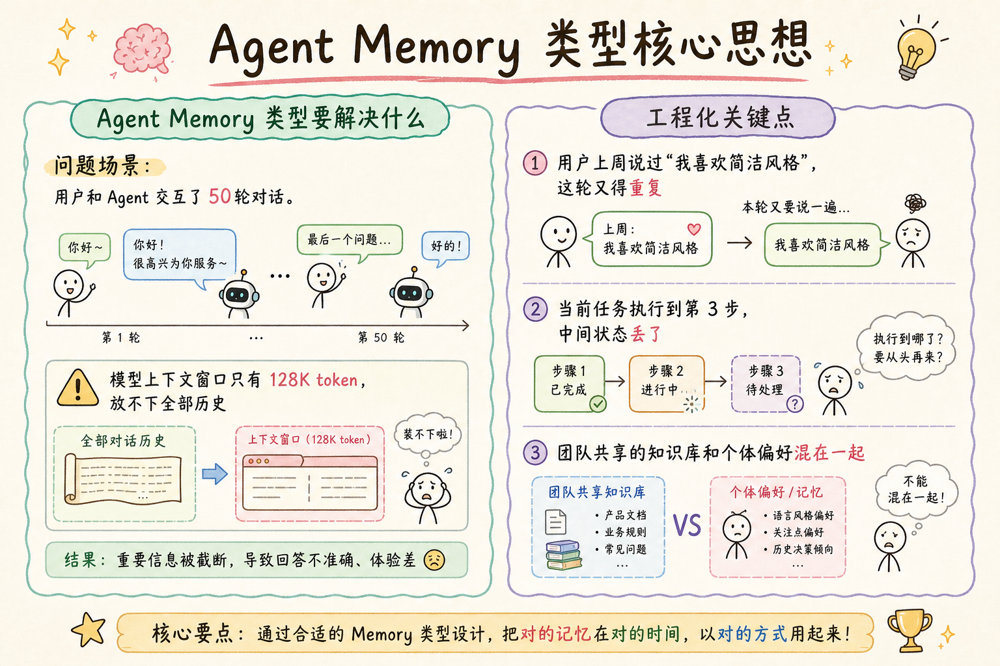
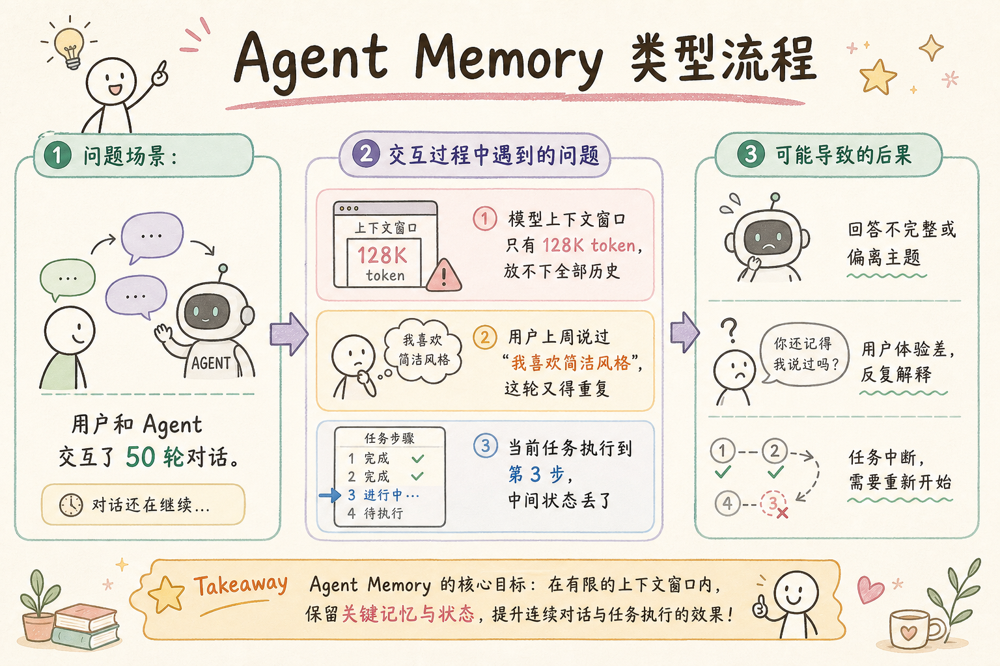
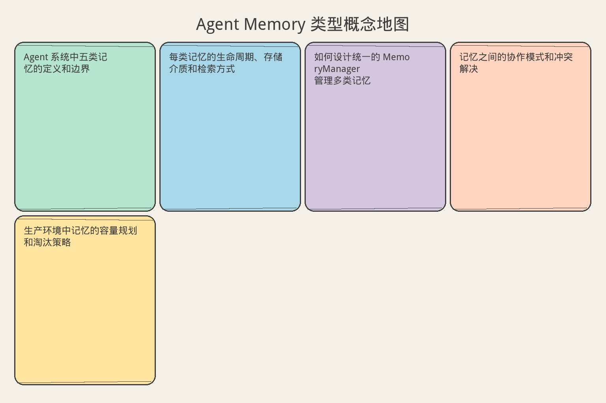

# AI Agent 工程（十九）：Agent Memory 类型

> Agent Memory 不是"把所有聊天记录都塞回上下文"。可靠系统要区分模型上下文、任务状态、短期记忆、长期记忆和组织知识库。每种类型有不同的生命周期、存储方式和检索策略。

**阅读建议：** 先阅读 [231 停止条件](231.agent-stop-condition-tutorial.md)，理解任务状态在循环中的作用。

**环境要求：** Python 3.10+，dataclasses，enum，typing


**档位：** 主线篇（Part 4）
**本文边界：** 前驱篇 [231](231.agent-stop-condition-tutorial.md) 有界循环。本篇五类记忆地图（vs RAG 库）。不讲向量 DDL。接续 [233](233.short-term-agent-memory-tutorial.md)。
**动手路径：** ① 读五类记忆地图 → ② 运行 `demo_memory_types()` → ③ 试 §先错对对

### 要不要读
- **建议读：** 准备设计会话状态或长期记忆前
- **可先跳过：** 仅做无状态 RAG 问答
- **何时回来读：** 需要区分「上下文 / 状态 / 记忆 / 知识库」时

### 概念地图（五类记忆）

| 类型 | 存什么 | 通俗说 | 与 RAG 知识库 |
|------|--------|--------|----------------|
| 工作记忆 | 当前任务中间结果 | 草稿纸 | 不同：不替代文档库 |
| 会话状态 | 本轮对话槽位 | 柜台上的登记表 | 不同 |
| 长期记忆 | 跨会话偏好/事实 | 客户档案 | 不同：主观、可删 |
| 语义记忆 | 抽象经验 | 「这类问题先查订单」 | 可重叠，需权限 |
| 情景记忆（Episodic） | 历史事件轨迹 | 日记 | 用于审计与调试 |

### 核心术语（本篇首次出现）
**短期记忆**（Short-term Memory）：单会话内的上下文与任务状态。
通俗说：柜台上的便签，下班就扔。
**长期记忆**（Long-term Memory）：跨会话保留的用户偏好与事实。
通俗说：客户档案柜。
**工作记忆**（Working Memory）：当前任务草稿纸，任务结束可丢弃。
通俗说：当前任务草稿纸。
---

## 目录

1. [你会学到什么](#你会学到什么)
2. [它解决什么问题](#它解决什么问题)
3. [核心概念：五类记忆](#核心概念五类记忆)
4. [最小示例](#最小示例)
5. [工程化版本](#工程化版本)
6. [记忆生命周期管理](#记忆生命周期管理)
7. [常见失败模式](#常见失败模式)
8. [什么时候不要这么做](#什么时候不要这么做)
9. [生产环境注意事项](#生产环境注意事项)
10. [如何观测和评测](#如何观测和评测)
11. [和 RAG / 后端 / 前端的关系](#和-rag--后端--前端的关系)
12. [面试怎么讲](#面试怎么讲)
13. [下一步](#下一步)

---

## 你会学到什么

- Agent 系统中五类记忆的定义和边界
- 每类记忆的生命周期、存储介质和检索方式
- 如何设计统一的 MemoryManager 管理多类记忆
- 记忆之间的协作模式和冲突解决
- 生产环境中记忆的容量规划和淘汰策略

---

## 它解决什么问题


读下图时，先看「Agent Memory 类型核心思想」建立直觉。


对照上图：五类记忆各管各的抽屉——别把知识库、会话状态与长期偏好混写。

读下图时，先看能力边界与痛点流程——与 §最小示例 代码互补，不是逐步对照。


对照上图：工作记忆/会话状态/长期记忆/知识库不能混为一谈——写错抽屉会污染召回。
```text
问题场景：

用户和 Agent 交互了 50 轮对话。
- 模型上下文窗口只有 128K token，放不下全部历史
- 用户上周说过"我喜欢简洁风格"，这轮又得重复
- 当前任务执行到第 3 步，中间状态丢了
- 团队共享的知识库和个体偏好混在一起

如果不区分记忆类型：
1. 全部塞上下文 → token 爆炸，成本失控
2. 全部存数据库 → 检索慢，噪声大
3. 不存 → 每次从零开始，用户体验差
4. 混着存 → 隐私泄露，权限混乱

正确做法：按生命周期和用途分类，各归其位。
```

---

## 核心概念：五类记忆

```text
Agent 系统的五类记忆：

┌─────────────────────────────────────────────────────────────┐
│  1. 模型上下文 (Model Context)                               │
│     - 当前 prompt 中的内容                                    │
│     - 生命周期：单次 API 调用                                 │
│     - 存储：内存（prompt 字符串）                             │
│     - 容量：受模型窗口限制（4K-128K token）                   │
├─────────────────────────────────────────────────────────────┤
│  2. 任务状态 (Task State)                                    │
│     - 当前任务的执行进度、中间结果                            │
│     - 生命周期：单次任务（分钟到小时）                        │
│     - 存储：内存 / Redis                                     │
│     - 容量：KB 级                                            │
├─────────────────────────────────────────────────────────────┤
│  3. 短期记忆 (Short-term Memory)                             │
│     - 当前会话的对话历史和摘要                                │
│     - 生命周期：单次会话（分钟到天）                          │
│     - 存储：内存 + Redis                                     │
│     - 容量：几十轮对话                                       │
├─────────────────────────────────────────────────────────────┤
│  4. 长期记忆 (Long-term Memory)                              │
│     - 跨会话的用户偏好、历史经验                              │
│     - 生命周期：持久（周到永久）                              │
│     - 存储：数据库 + 向量库                                  │
│     - 容量：MB 级                                            │
├─────────────────────────────────────────────────────────────┤
│  5. 组织知识库 (Organization Knowledge)                      │
│     - 团队共享的文档、规则、最佳实践                          │
│     - 生命周期：持久，版本化管理                              │
│     - 存储：向量库 + 文档库                                  │
│     - 容量：GB 级                                            │
└─────────────────────────────────────────────────────────────┘

关键区分维度：
- 生命周期：从单次调用到永久
- 所有权：模型 / 任务 / 用户 / 组织
- 可变性：只读 / 追加 / 可修改
- 检索方式：全量 / 按 key / 语义搜索
```

---

## 最小示例

**演示什么：** 本节最小可运行切片。**环境：** 见文首。**预期：** 控制台打印 demo 输出。

```python
"""最小示例：五类记忆的基本结构"""
from dataclasses import dataclass, field
from enum import Enum
from typing import Any
from datetime import datetime


class MemoryType(Enum):
    """记忆类型枚举"""
    MODEL_CONTEXT = "model_context"
    TASK_STATE = "task_state"
    SHORT_TERM = "short_term"
    LONG_TERM = "long_term"
    ORG_KNOWLEDGE = "org_knowledge"


@dataclass
class MemoryItem:
    """单条记忆"""
    id: str
    type: MemoryType
    content: str
    created_at: datetime = field(default_factory=datetime.now)
    ttl_seconds: int | None = None  # None 表示永不过期
    metadata: dict[str, Any] = field(default_factory=dict)

    @property
    def is_expired(self) -> bool:
        if self.ttl_seconds is None:
            return False
        age = (datetime.now() - self.created_at).total_seconds()
        return age > self.ttl_seconds


class SimpleMemoryStore:
    """简单记忆存储"""

    def __init__(self):
        self._items: dict[MemoryType, list[MemoryItem]] = {
            t: [] for t in MemoryType
        }

    def add(self, item: MemoryItem) -> None:
        self._items[item.type].append(item)

    def get_by_type(self, memory_type: MemoryType) -> list[MemoryItem]:
        # 过滤过期项
        items = self._items[memory_type]
        valid = [i for i in items if not i.is_expired]
        self._items[memory_type] = valid
        return valid

    def clear_type(self, memory_type: MemoryType) -> int:
        count = len(self._items[memory_type])
        self._items[memory_type] = []
        return count


# 使用示例
store = SimpleMemoryStore()

# 1. 模型上下文：当前 prompt
store.add(MemoryItem(
    id="ctx-001",
    type=MemoryType.MODEL_CONTEXT,
    content="用户问：Python 如何读取 CSV？",
    ttl_seconds=60,  # 一次调用后就没用了
))

# 2. 任务状态：正在执行的任务
store.add(MemoryItem(
    id="task-001",
    type=MemoryType.TASK_STATE,
    content="步骤 2/5：已解析 CSV 头部，正在验证列名",
    ttl_seconds=3600,
))

# 3. 短期记忆：本次会话历史
store.add(MemoryItem(
    id="stm-001",
    type=MemoryType.SHORT_TERM,
    content="用户要求用 pandas 而不是 csv 模块",
    ttl_seconds=86400,
))

# 4. 长期记忆：用户偏好
store.add(MemoryItem(
    id="ltm-001",
    type=MemoryType.LONG_TERM,
    content="用户偏好：代码示例用 type hints，注释用中文",
    ttl_seconds=None,
))

# 5. 组织知识库：团队规范
store.add(MemoryItem(
    id="org-001",
    type=MemoryType.ORG_KNOWLEDGE,
    content="团队规范：所有 API 返回统一用 Result 信封格式",
    ttl_seconds=None,
))

# 检索
for mtype in MemoryType:
    items = store.get_by_type(mtype)
    print(f"{mtype.value}: {len(items)} 条")
```

---

## 工程化版本

```python
"""工程化版本：完整的 MemoryManager"""
from __future__ import annotations

import hashlib
import json
import logging
import time
import uuid
from abc import ABC, abstractmethod
from dataclasses import dataclass, field, asdict
from enum import Enum
from typing import Any, Protocol

logger = logging.getLogger(__name__)


# ─── 数据模型 ───────────────────────────────────────────────

class MemoryType(Enum):
    MODEL_CONTEXT = "model_context"
    TASK_STATE = "task_state"
    SHORT_TERM = "short_term"
    LONG_TERM = "long_term"
    ORG_KNOWLEDGE = "org_knowledge"


class MemoryScope(Enum):
    """记忆可见范围"""
    PRIVATE = "private"       # 仅当前用户
    SESSION = "session"       # 当前会话参与者
    TEAM = "team"             # 团队可见
    GLOBAL = "global"         # 全组织


@dataclass
class MemoryEntry:
    """记忆条目"""
    id: str
    type: MemoryType
    scope: MemoryScope
    owner_id: str            # 用户 ID 或 "system"
    content: str
    embedding: list[float] | None = None
    tags: list[str] = field(default_factory=list)
    importance: float = 0.5  # 0-1 重要度
    access_count: int = 0
    created_at: float = field(default_factory=time.time)
    updated_at: float = field(default_factory=time.time)
    expires_at: float | None = None
    metadata: dict[str, Any] = field(default_factory=dict)

    @property
    def is_expired(self) -> bool:
        if self.expires_at is None:
            return False
        return time.time() > self.expires_at

    def touch(self) -> None:
        """更新访问时间和计数"""
        self.access_count += 1
        self.updated_at = time.time()

    def content_hash(self) -> str:
        return hashlib.sha256(self.content.encode()).hexdigest()[:16]


# ─── 存储后端协议 ───────────────────────────────────────────

class MemoryBackend(Protocol):
    """存储后端接口"""

    def save(self, entry: MemoryEntry) -> None: ...
    def get(self, entry_id: str) -> MemoryEntry | None: ...
    def delete(self, entry_id: str) -> bool: ...
    def query(
        self,
        memory_type: MemoryType | None = None,
        owner_id: str | None = None,
        tags: list[str] | None = None,
        limit: int = 50,
    ) -> list[MemoryEntry]: ...
    def search_similar(
        self,
        embedding: list[float],
        memory_type: MemoryType | None = None,
        top_k: int = 10,
    ) -> list[tuple[MemoryEntry, float]]: ...


# ─── 内存后端实现 ───────────────────────────────────────────

class InMemoryBackend:
    """内存后端（开发/测试用）"""

    def __init__(self):
        self._store: dict[str, MemoryEntry] = {}

    def save(self, entry: MemoryEntry) -> None:
        self._store[entry.id] = entry

    def get(self, entry_id: str) -> MemoryEntry | None:
        return self._store.get(entry_id)

    def delete(self, entry_id: str) -> bool:
        return self._store.pop(entry_id, None) is not None

    def query(
        self,
        memory_type: MemoryType | None = None,
        owner_id: str | None = None,
        tags: list[str] | None = None,
        limit: int = 50,
    ) -> list[MemoryEntry]:
        results = []
        for entry in self._store.values():
            if entry.is_expired:
                continue
            if memory_type and entry.type != memory_type:
                continue
            if owner_id and entry.owner_id != owner_id:
                continue
            if tags and not set(tags).issubset(set(entry.tags)):
                continue
            results.append(entry)
        # 按更新时间倒序
        results.sort(key=lambda e: e.updated_at, reverse=True)
        return results[:limit]

    def search_similar(
        self,
        embedding: list[float],
        memory_type: MemoryType | None = None,
        top_k: int = 10,
    ) -> list[tuple[MemoryEntry, float]]:
        # 简化：余弦相似度
        import math
        results = []
        for entry in self._store.values():
            if entry.is_expired or entry.embedding is None:
                continue
            if memory_type and entry.type != memory_type:
                continue
            sim = self._cosine(embedding, entry.embedding)
            results.append((entry, sim))
        results.sort(key=lambda x: x[1], reverse=True)
        return results[:top_k]

    @staticmethod
    def _cosine(a: list[float], b: list[float]) -> float:
        dot = sum(x * y for x, y in zip(a, b))
        norm_a = math.sqrt(sum(x * x for x in a))
        norm_b = math.sqrt(sum(x * x for x in b))
        if norm_a == 0 or norm_b == 0:
            return 0.0
        return dot / (norm_a * norm_b)


# ─── 淘汰策略 ───────────────────────────────────────────────

class EvictionPolicy(ABC):
    """淘汰策略基类"""

    @abstractmethod
    def select_victims(
        self, entries: list[MemoryEntry], target_count: int
    ) -> list[MemoryEntry]:
        """选出要淘汰的条目"""
        ...


class LRUEviction(EvictionPolicy):
    """最近最少使用"""

    def select_victims(
        self, entries: list[MemoryEntry], target_count: int
    ) -> list[MemoryEntry]:
        if len(entries) <= target_count:
            return []
        sorted_entries = sorted(entries, key=lambda e: e.updated_at)
        return sorted_entries[: len(entries) - target_count]


class ImportanceEviction(EvictionPolicy):
    """按重要度淘汰（低重要度优先）"""

    def select_victims(
        self, entries: list[MemoryEntry], target_count: int
    ) -> list[MemoryEntry]:
        if len(entries) <= target_count:
            return []
        sorted_entries = sorted(entries, key=lambda e: e.importance)
        return sorted_entries[: len(entries) - target_count]


class HybridEviction(EvictionPolicy):
    """混合策略：重要度 × 时间衰减"""

    def __init__(self, decay_rate: float = 0.1):
        self.decay_rate = decay_rate

    def select_victims(
        self, entries: list[MemoryEntry], target_count: int
    ) -> list[MemoryEntry]:
        if len(entries) <= target_count:
            return []
        now = time.time()
        scored = []
        for e in entries:
            age_hours = (now - e.updated_at) / 3600
            decay = 2.718 ** (-self.decay_rate * age_hours)
            score = e.importance * decay * (1 + e.access_count * 0.1)
            scored.append((e, score))
        scored.sort(key=lambda x: x[1])
        return [e for e, _ in scored[: len(entries) - target_count]]


# ─── 容量配置 ───────────────────────────────────────────────

@dataclass
class CapacityConfig:
    """各类型记忆的容量配置"""
    max_model_context: int = 50       # 上下文条目数
    max_task_state: int = 20          # 任务状态条目数
    max_short_term: int = 100         # 短期记忆条目数
    max_long_term: int = 1000         # 长期记忆条目数
    max_org_knowledge: int = 10000    # 组织知识条目数

    def get_max(self, memory_type: MemoryType) -> int:
        mapping = {
            MemoryType.MODEL_CONTEXT: self.max_model_context,
            MemoryType.TASK_STATE: self.max_task_state,
            MemoryType.SHORT_TERM: self.max_short_term,
            MemoryType.LONG_TERM: self.max_long_term,
            MemoryType.ORG_KNOWLEDGE: self.max_org_knowledge,
        }
        return mapping[memory_type]


# ─── 核心管理器 ─────────────────────────────────────────────

class MemoryManager:
    """统一记忆管理器"""

    def __init__(
        self,
        backend: MemoryBackend,
        capacity: CapacityConfig | None = None,
        eviction: EvictionPolicy | None = None,
    ):
        self.backend = backend
        self.capacity = capacity or CapacityConfig()
        self.eviction = eviction or HybridEviction()
        self._stats: dict[str, int] = {
            "writes": 0, "reads": 0, "evictions": 0, "expires": 0
        }

    def write(self, entry: MemoryEntry) -> str:
        """写入记忆"""
        # 去重检查
        existing = self.backend.query(
            memory_type=entry.type,
            owner_id=entry.owner_id,
            limit=1000,
        )
        for e in existing:
            if e.content_hash() == entry.content_hash():
                # 已存在，更新访问时间
                e.touch()
                self.backend.save(e)
                logger.debug(f"记忆已存在，跳过写入: {entry.id}")
                return e.id

        # 容量检查 + 淘汰
        max_count = self.capacity.get_max(entry.type)
        type_entries = self.backend.query(
            memory_type=entry.type,
            owner_id=entry.owner_id,
            limit=max_count + 100,
        )
        if len(type_entries) >= max_count:
            victims = self.eviction.select_victims(type_entries, max_count - 1)
            for v in victims:
                self.backend.delete(v.id)
                self._stats["evictions"] += 1
            logger.info(
                f"淘汰 {len(victims)} 条 {entry.type.value} 记忆"
            )

        self.backend.save(entry)
        self._stats["writes"] += 1
        return entry.id

    def read(
        self,
        memory_type: MemoryType,
        owner_id: str,
        limit: int = 10,
        tags: list[str] | None = None,
    ) -> list[MemoryEntry]:
        """按类型读取记忆"""
        self._stats["reads"] += 1
        entries = self.backend.query(
            memory_type=memory_type,
            owner_id=owner_id,
            tags=tags,
            limit=limit,
        )
        for e in entries:
            e.touch()
            self.backend.save(e)
        return entries

    def search(
        self,
        embedding: list[float],
        owner_id: str,
        memory_types: list[MemoryType] | None = None,
        top_k: int = 5,
    ) -> list[tuple[MemoryEntry, float]]:
        """语义搜索"""
        self._stats["reads"] += 1
        all_results: list[tuple[MemoryEntry, float]] = []
        types = memory_types or [MemoryType.LONG_TERM, MemoryType.ORG_KNOWLEDGE]
        for mtype in types:
            results = self.backend.search_similar(
                embedding, memory_type=mtype, top_k=top_k
            )
            # 过滤权限
            for entry, score in results:
                if self._can_access(entry, owner_id):
                    all_results.append((entry, score))
        all_results.sort(key=lambda x: x[1], reverse=True)
        return all_results[:top_k]

    def _can_access(self, entry: MemoryEntry, requester_id: str) -> bool:
        """权限检查"""
        match entry.scope:
            case MemoryScope.PRIVATE:
                return entry.owner_id == requester_id
            case MemoryScope.SESSION:
                return True  # 简化：会话内都可见
            case MemoryScope.TEAM:
                return True  # 简化：同团队可见
            case MemoryScope.GLOBAL:
                return True

    def cleanup_expired(self) -> int:
        """清理过期记忆"""
        count = 0
        for mtype in MemoryType:
            entries = self.backend.query(memory_type=mtype, limit=10000)
            for e in entries:
                if e.is_expired:
                    self.backend.delete(e.id)
                    count += 1
        self._stats["expires"] += count
        return count

    def get_stats(self) -> dict[str, int]:
        return dict(self._stats)


# ─── 使用示例 ───────────────────────────────────────────────

def demo():
    backend = InMemoryBackend()
    manager = MemoryManager(
        backend=backend,
        capacity=CapacityConfig(max_short_term=5),
        eviction=HybridEviction(decay_rate=0.05),
    )

    user_id = "user-alice"

    # 写入短期记忆
    for i in range(8):
        entry = MemoryEntry(
            id=f"stm-{i:03d}",
            type=MemoryType.SHORT_TERM,
            scope=MemoryScope.PRIVATE,
            owner_id=user_id,
            content=f"对话第 {i+1} 轮的内容",
            importance=0.3 + i * 0.05,
        )
        manager.write(entry)

    # 读取（应该只剩 5 条）
    entries = manager.read(MemoryType.SHORT_TERM, user_id)
    print(f"短期记忆剩余: {len(entries)} 条")

    # 写入长期记忆
    manager.write(MemoryEntry(
        id="ltm-pref-001",
        type=MemoryType.LONG_TERM,
        scope=MemoryScope.PRIVATE,
        owner_id=user_id,
        content="用户偏好简洁回答，不喜欢冗长解释",
        importance=0.9,
        tags=["preference", "style"],
    ))

    print(f"统计: {manager.get_stats()}")


if __name__ == "__main__":
    demo()
```

---

## 记忆生命周期管理

```text
各类记忆的生命周期转换：

模型上下文：
  创建 → 使用（一次 API 调用）→ 销毁
  触发：每次 LLM 调用前组装
  销毁：调用完成后丢弃

任务状态：
  创建 → 活跃 → 暂停 → 恢复 → 完成/失败 → 归档
  触发：任务启动时创建
  归档：任务结束后保留 24h 供调试

短期记忆：
  创建 → 活跃 → 压缩/摘要 → 过期 → 清理
  触发：每轮对话后追加
  压缩：超过 token 预算时触发摘要
  过期：会话结束或 TTL 到期

长期记忆：
  创建 → 候选 → 确认 → 活跃 → 衰减 → 归档/删除
  触发：从短期记忆中提取
  确认：可能需要用户确认
  衰减：长期不访问降低重要度
  删除：用户主动删除或 GDPR 要求

组织知识库：
  创建 → 审核 → 发布 → 更新 → 废弃
  触发：管理员或自动管道写入
  审核：需要人工或自动审核
  版本化：每次更新保留历史版本
```

```python
"""生命周期状态机"""
from enum import Enum
from dataclasses import dataclass
from datetime import datetime


class LifecycleState(Enum):
    CREATED = "created"
    ACTIVE = "active"
    COMPRESSED = "compressed"
    DECAYED = "decayed"
    ARCHIVED = "archived"
    DELETED = "deleted"


@dataclass
class LifecycleTransition:
    from_state: LifecycleState
    to_state: LifecycleState
    trigger: str
    timestamp: datetime


VALID_TRANSITIONS: dict[LifecycleState, list[LifecycleState]] = {
    LifecycleState.CREATED: [LifecycleState.ACTIVE, LifecycleState.DELETED],
    LifecycleState.ACTIVE: [
        LifecycleState.COMPRESSED,
        LifecycleState.DECAYED,
        LifecycleState.ARCHIVED,
        LifecycleState.DELETED,
    ],
    LifecycleState.COMPRESSED: [
        LifecycleState.ACTIVE,
        LifecycleState.ARCHIVED,
        LifecycleState.DELETED,
    ],
    LifecycleState.DECAYED: [
        LifecycleState.ACTIVE,
        LifecycleState.ARCHIVED,
        LifecycleState.DELETED,
    ],
    LifecycleState.ARCHIVED: [LifecycleState.DELETED],
    LifecycleState.DELETED: [],
}


class LifecycleManager:
    """管理记忆生命周期转换"""

    def __init__(self):
        self._history: list[LifecycleTransition] = []

    def transition(
        self, current: LifecycleState, target: LifecycleState, trigger: str
    ) -> bool:
        if target not in VALID_TRANSITIONS.get(current, []):
            return False
        self._history.append(LifecycleTransition(
            from_state=current,
            to_state=target,
            trigger=trigger,
            timestamp=datetime.now(),
        ))
        return True

    def get_history(self) -> list[LifecycleTransition]:
        return list(self._history)
```

---

## 常见失败模式

```text
失败模式 1：记忆类型混淆
━━━━━━━━━━━━━━━━━━━━━━━━
症状：把临时对话内容写入长期记忆
原因：没有明确的写入策略，所有信息一视同仁
后果：长期记忆充满噪声，检索质量下降
修复：
- 明确每类记忆的写入条件
- 长期记忆需要"提取 + 确认"流程
- 定期审计长期记忆质量

失败模式 2：上下文溢出
━━━━━━━━━━━━━━━━━━━━━━━━
症状：模型返回截断或质量下降
原因：把所有记忆都塞进 prompt
后果：重要信息被截断，token 成本飙升
修复：
- 设定各类记忆在 prompt 中的 token 预算
- 按重要度和相关性排序，截断低优先级
- 使用摘要代替原始内容

失败模式 3：记忆冲突
━━━━━━━━━━━━━━━━━━━━━━━━
症状：Agent 行为前后矛盾
原因：旧记忆和新信息冲突，没有更新机制
后果：用户说"我换了新地址"，Agent 还用旧地址
修复：
- 写入时检测语义冲突
- 新信息覆盖旧记忆（带版本历史）
- 冲突时提示用户确认

失败模式 4：权限泄露
━━━━━━━━━━━━━━━━━━━━━━━━
症状：用户 A 看到用户 B 的记忆
原因：检索时没有做权限过滤
后果：隐私事故，合规风险
修复：
- 每条记忆标记 scope 和 owner
- 检索时强制过滤 owner_id
- 审计日志记录所有跨用户访问

失败模式 5：记忆膨胀
━━━━━━━━━━━━━━━━━━━━━━━━
症状：检索延迟增加，存储成本上升
原因：没有淘汰策略，只写不删
后果：向量库查询变慢，冷数据占空间
修复：
- 设置各类型容量上限
- 使用 LRU/重要度淘汰
- 冷数据归档到廉价存储
```

---

## 什么时候不要这么做

```text
不需要完整五类记忆的场景：

1. 单轮问答 Bot
   - 只需要模型上下文
   - 不需要任务状态和短期记忆
   - 加记忆系统反而增加复杂度

2. 固定流程的自动化
   - 流程固定，不需要"记住"什么
   - 用配置而不是记忆
   - 状态用数据库字段即可

3. 原型验证阶段
   - 先用最简单的上下文拼接
   - 验证核心价值后再加记忆
   - 过早优化记忆系统浪费时间

4. 纯检索增强（RAG）
   - 知识库是外部文档，不是"记忆"
   - 用向量库 + 检索即可
   - 不需要记忆生命周期管理

判断标准：
- 是否需要跨轮次保持信息？→ 需要短期记忆
- 是否需要跨会话保持信息？→ 需要长期记忆
- 是否有多步骤任务？→ 需要任务状态
- 是否有团队共享知识？→ 需要组织知识库
```

---

## 生产环境注意事项

```text
存储选型：

模型上下文：
- 不需要持久化
- 在内存中组装 prompt
- 注意 token 计数和截断

任务状态：
- Redis（TTL 自动过期）
- 或内存 + 定期 checkpoint
- 需要支持暂停/恢复

短期记忆：
- Redis（热数据）+ 数据库（冷数据）
- 会话结束后异步归档
- 摘要用 LLM 生成

长期记忆：
- PostgreSQL（结构化元数据）
- 向量库（语义检索）
- 需要加密存储敏感信息

组织知识库：
- 向量库（Milvus/Qdrant/Weaviate）
- 对象存储（原始文档）
- 版本管理（Git-like 或数据库版本字段）

容量规划参考（1000 活跃用户）：
- 模型上下文：不持久化，忽略
- 任务状态：~10MB（Redis）
- 短期记忆：~500MB（Redis + DB）
- 长期记忆：~5GB（DB + 向量库）
- 组织知识库：~50GB（向量库 + 对象存储）
```

---

## 如何观测和评测

```python
"""记忆系统监控指标"""
from dataclasses import dataclass, field
from collections import defaultdict
import time


@dataclass
class MemoryMetrics:
    """记忆系统指标收集"""
    _counters: dict[str, int] = field(default_factory=lambda: defaultdict(int))
    _histograms: dict[str, list[float]] = field(
        default_factory=lambda: defaultdict(list)
    )

    def inc(self, name: str, value: int = 1) -> None:
        self._counters[name] += value

    def observe(self, name: str, value: float) -> None:
        self._histograms[name].append(value)

    def report(self) -> dict:
        result = {"counters": dict(self._counters)}
        for name, values in self._histograms.items():
            if values:
                result[f"{name}_avg"] = sum(values) / len(values)
                result[f"{name}_p95"] = sorted(values)[
                    int(len(values) * 0.95)
                ]
        return result


# 关键指标
KEY_METRICS = """
1. 写入指标
   - memory_writes_total（按类型分）
   - memory_write_dedup_rate（去重命中率）
   - memory_evictions_total（淘汰次数）

2. 读取指标
   - memory_reads_total（按类型分）
   - memory_search_latency_seconds
   - memory_search_relevance_score（相关性得分）

3. 容量指标
   - memory_entries_count（按类型分）
   - memory_storage_bytes
   - memory_utilization_ratio（使用率）

4. 质量指标
   - memory_conflict_rate（冲突率）
   - memory_staleness_hours（平均陈旧时间）
   - memory_user_feedback_score（用户反馈）

5. 告警规则
   - 短期记忆使用率 > 90% → 警告
   - 长期记忆冲突率 > 5% → 警告
   - 检索延迟 P95 > 200ms → 警告
   - 淘汰频率 > 100/min → 容量不足
"""
```

---

## 和 RAG / 后端 / 前端的关系

```text
与 RAG 的关系：
- 组织知识库 ≈ RAG 的文档库
- 长期记忆可以用 RAG 技术检索
- 区别：RAG 是外部知识，记忆是交互产生的

与后端的关系：
- 记忆存储需要持久化后端
- 权限控制依赖后端认证系统
- 淘汰和归档用后台任务

与前端的关系：
- 用户需要看到 Agent "记住了什么"
- 提供记忆管理界面（查看/删除/修正）
- 短期记忆影响对话体验的连贯性
```

---

## 面试怎么讲

```text
面试官问：Agent 的记忆系统怎么设计？

回答框架（2 分钟）：

"我会把 Agent 记忆分成五类：

第一，模型上下文——就是当前 prompt 里的内容，
生命周期最短，一次 API 调用就没了。

第二，任务状态——当前任务的执行进度和中间结果，
存在 Redis 里，任务结束就归档。

第三，短期记忆——当前会话的对话历史和摘要，
用 token 预算控制大小，超了就做摘要压缩。

第四，长期记忆——跨会话的用户偏好和历史经验，
存数据库加向量库，需要写入策略控制质量。

第五，组织知识库——团队共享的文档和规范，
本质上就是 RAG 的知识源。

关键设计点：
- 每类有独立的容量上限和淘汰策略
- 写入要去重和冲突检测
- 检索要做权限过滤
- 用户必须能查看和删除自己的记忆

我踩过的坑：
一开始把所有东西都往长期记忆塞，
结果检索噪声特别大。后来加了写入策略——
只有明确的用户偏好和重要事实才进长期记忆，
其他走短期记忆自动过期。"

追问应对：
Q: 怎么解决记忆冲突？
A: 写入时做语义相似度检测，相似度 > 0.9 的
   视为冲突，新信息覆盖旧记忆但保留版本历史。

Q: 长期记忆怎么做隐私合规？
A: 三件事：加密存储、用户可删除、访问审计。
   GDPR 要求支持"被遗忘权"，删除要级联到
   所有备份和向量索引。
```

---

## 实战案例：客服 Agent 的记忆架构

```python
"""客服 Agent 的五类记忆配置"""
from dataclasses import dataclass


@dataclass
class CustomerServiceMemoryConfig:
    """客服场景记忆配置"""

    # 模型上下文：当前对话 + 检索到的知识
    context_budget_tokens: int = 8000
    context_includes: list[str] = None

    # 任务状态：工单处理进度
    task_ttl_seconds: int = 7200  # 2小时
    task_checkpoint_interval: int = 5  # 每5步保存

    # 短期记忆：本次会话
    short_term_max_turns: int = 30
    short_term_summary_threshold: int = 20  # 超过20轮触发摘要
    short_term_ttl_seconds: int = 86400  # 24小时

    # 长期记忆：用户画像
    long_term_max_entries: int = 200
    long_term_categories: list[str] = None
    long_term_decay_days: int = 90  # 90天不访问则衰减

    # 组织知识库：产品文档 + FAQ
    org_knowledge_top_k: int = 5
    org_knowledge_min_score: float = 0.7

    def __post_init__(self):
        if self.context_includes is None:
            self.context_includes = [
                "system_prompt",
                "user_profile",      # 长期记忆摘要
                "task_state",        # 当前工单状态
                "recent_turns",      # 最近对话
                "retrieved_docs",    # 知识库检索结果
            ]
        if self.long_term_categories is None:
            self.long_term_categories = [
                "preference",        # 偏好（语言、沟通风格）
                "history",           # 历史问题
                "product_info",      # 用户的产品信息
                "sensitivity",       # 敏感度（VIP、投诉倾向）
            ]


# Token 预算分配
TOKEN_BUDGET = """
客服 Agent 上下文 Token 预算（总计 8000）：

┌─────────────────────────────────────────┐
│ System Prompt          │  1000 tokens   │
│ 用户画像（长期记忆）   │   500 tokens   │
│ 任务状态（工单信息）   │   500 tokens   │
│ 最近对话（短期记忆）   │  3000 tokens   │
│ 知识检索（组织知识）   │  2500 tokens   │
│ 预留（模型输出）       │   500 tokens   │
└─────────────────────────────────────────┘

优先级（空间不足时截断顺序）：
1. 最近对话（保留最新 5 轮）
2. 知识检索（保留 top-3）
3. 用户画像（保留最重要 3 条）
4. 任务状态（必须完整保留）
5. System Prompt（必须完整保留）
"""
```

---

## 记忆类型选择决策树

```text
收到一条新信息，应该存到哪里？

                    新信息
                      │
                      ▼
            ┌─── 是当前 prompt 需要的？───┐
            │ YES                          │ NO
            ▼                              ▼
      模型上下文                  ┌─── 是当前任务的进度？───┐
      （不持久化）                │ YES                      │ NO
                                  ▼                          ▼
                            任务状态              ┌─── 只和本次会话有关？───┐
                            （Redis）             │ YES                      │ NO
                                                  ▼                          ▼
                                            短期记忆              ┌─── 是用户个人的？───┐
                                            （Redis+DB）          │ YES                  │ NO
                                                                  ▼                      ▼
                                                            长期记忆              组织知识库
                                                            （DB+向量库）         （向量库）

补充判断：
- 模型上下文：每轮组装，不存储
- 任务状态：有明确的"完成/失败"终点
- 短期记忆：会话结束后价值大幅降低
- 长期记忆：跨会话仍有价值
- 组织知识库：对多个用户有价值
```

---

## 下一步


读下图时，先看「Agent Memory 类型概念地图」建立直觉。


对照上图：五类记忆地图——233 短期、234 长期、235 写入、236 召回。
阅读 [233 短期记忆与会话上下文](233.short-term-agent-memory-tutorial.md)，深入短期记忆的 token 预算控制和摘要压缩策略。
