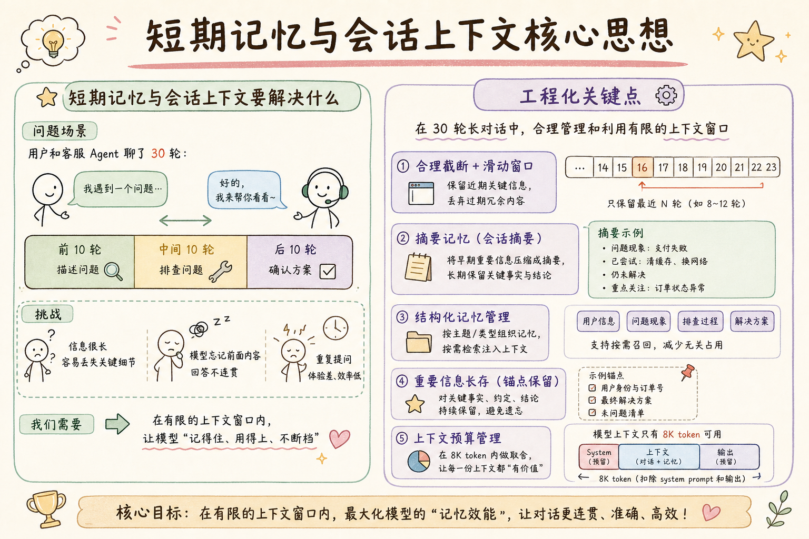
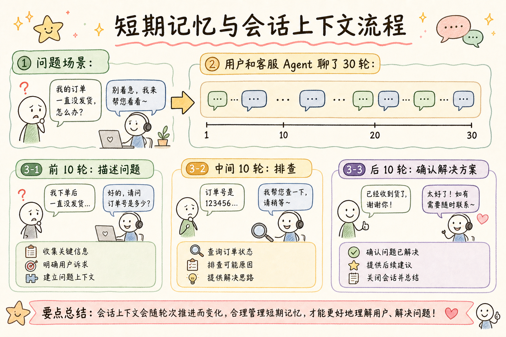
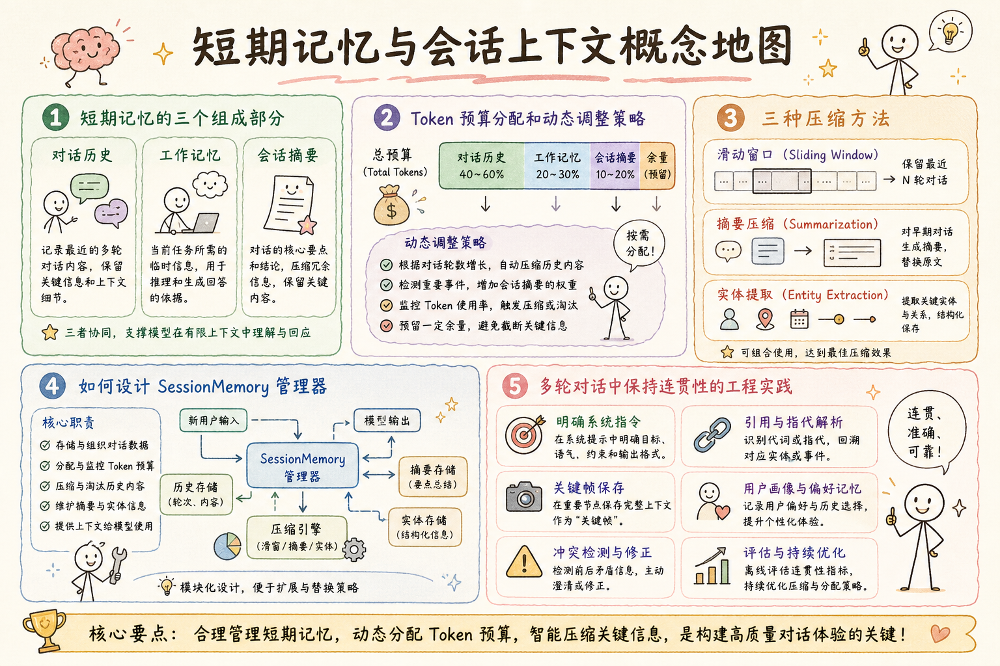

# AI Agent 工程（二十）：短期记忆与会话上下文

> 短期记忆服务于当前会话：保留目标、约束和活跃实体，同时把冗长历史压缩到可控 token 预算。它不是"保存所有聊天记录"，而是"在有限空间里保留最有价值的信息"。

**阅读建议：** 先阅读 [232 Agent Memory 类型](232.agent-memory-types-tutorial.md)，理解五类数据的分类。

**环境要求：** Python 3.10+，dataclasses，enum，typing


**档位：** 主线篇（Part 4）
**本文边界：** 前驱篇 [232](232.agent-memory-types-tutorial.md) 记忆分类。本篇会话状态与工作记忆。不讲浏览器 Storage。接续 [234](234.long-term-agent-memory-tutorial.md)。
**动手路径：** ① 读会话状态设计 → ② 运行 `demo_short_term()` → ③ 试 §先错对对

### 要不要读
- **建议读：** 实现多轮对话、工作记忆管理
- **可先跳过：** 单次问答
- **何时回来读：** 对话丢上下文时
### 核心术语（本篇首次出现）
**短期记忆**（Short-term Memory）：单会话内的上下文与任务状态。
通俗说：柜台上的便签，下班就扔。
**长期记忆**（Long-term Memory）：跨会话保留的用户偏好与事实。
通俗说：客户档案柜。
**会话状态**（Session State）：本轮对话的槽位表，如订单号、当前步骤。
通俗说：本轮对话的槽位表。
---

## 目录

1. [你会学到什么](#你会学到什么)
2. [它解决什么问题](#它解决什么问题)
3. [核心概念](#核心概念)
4. [最小示例](#最小示例)
5. [工程化版本](#工程化版本)
6. [摘要压缩策略](#摘要压缩策略)
7. [常见失败模式](#常见失败模式)
8. [什么时候不要这么做](#什么时候不要这么做)
9. [生产环境注意事项](#生产环境注意事项)
10. [如何观测和评测](#如何观测和评测)
11. [和 RAG / 后端 / 前端的关系](#和-rag--后端--前端的关系)
12. [面试怎么讲](#面试怎么讲)
13. [下一步](#下一步)

---

## 你会学到什么

- 短期记忆的三个组成部分：对话历史、工作记忆、会话摘要
- Token 预算分配和动态调整策略
- 滑动窗口、摘要压缩、实体提取三种压缩方法
- 如何设计 SessionMemory 管理器
- 多轮对话中保持连贯性的工程实践

---

## 它解决什么问题


读下图时，先看「短期记忆与会话上下文核心思想」建立直觉。


对照上图：短期记忆=本轮工作区——槽位、中间结果、最近工具输出，不是永久档案。

读下图时，先看能力边界与痛点流程——与 §最小示例 代码互补，不是逐步对照。


对照上图：短期记忆管本轮槽位与中间结果——不是把所有聊天记录无差别塞回上下文。
```text
问题场景：

用户和客服 Agent 聊了 30 轮：
- 前 10 轮在描述问题
- 中间 10 轮在排查
- 后 10 轮在确认解决方案

模型上下文只有 8K token 可用（扣除 system prompt 和输出）。
30 轮对话原文约 15K token，放不下。

如果全部截断（只保留最近几轮）：
- Agent 忘了用户最初描述的问题
- 用户得重复说一遍
- 体验极差

如果全部保留：
- Token 超限，API 报错
- 或者成本翻倍

正确做法：
- 最近 5 轮保留原文（细节重要）
- 更早的对话压缩成摘要（保留要点）
- 提取关键实体单独存储（结构化）
```

---

## 核心概念

```text
短期记忆的三层结构：

┌─────────────────────────────────────────────────┐
│  Layer 1: 对话缓冲 (Dialogue Buffer)             │
│  - 最近 N 轮的原始对话                           │
│  - 保真度最高，token 消耗最大                    │
│  - 典型：最近 5-10 轮                           │
├─────────────────────────────────────────────────┤
│  Layer 2: 会话摘要 (Session Summary)             │
│  - 更早对话的压缩摘要                            │
│  - 保留关键信息，丢弃细节                        │
│  - 典型：200-500 token                          │
├─────────────────────────────────────────────────┤
│  Layer 3: 工作记忆 (Working Memory)              │
│  - 提取的结构化信息                              │
│  - 用户意图、活跃实体、约束条件                  │
│  - 典型：JSON 格式，100-200 token               │
└─────────────────────────────────────────────────┘

Token 预算分配（以 4000 token 为例）：
- 对话缓冲：2500 token（约 5 轮）
- 会话摘要：800 token
- 工作记忆：400 token
- 预留弹性：300 token

压缩触发条件：
- 对话缓冲超过 token 上限
- 总轮次超过阈值（如 10 轮）
- 用户切换话题（旧对话价值降低）
```

---

## 最小示例

### 先错后对：短期记忆当长期库

```python
# ❌ 每轮对话全量写入「长期记忆」
memory.save(full_chat_transcript)

# ✅ 短期：本轮槽位；长期：经 235 策略提取后的稳定事实
session.update_slot("order_id", value)
```

**演示什么：** 本节最小可运行切片。**环境：** 见文首。**预期：** 控制台打印 demo 输出。

```python
"""最小示例：带摘要的短期记忆"""
from dataclasses import dataclass, field
from typing import Any


@dataclass
class Message:
    role: str  # "user" | "assistant"
    content: str
    turn: int = 0


@dataclass
class WorkingMemory:
    """工作记忆：结构化关键信息"""
    user_intent: str = ""
    active_entities: dict[str, str] = field(default_factory=dict)
    constraints: list[str] = field(default_factory=list)

    def to_prompt(self) -> str:
        parts = []
        if self.user_intent:
            parts.append(f"用户意图: {self.user_intent}")
        if self.active_entities:
            entities = ", ".join(
                f"{k}={v}" for k, v in self.active_entities.items()
            )
            parts.append(f"活跃实体: {entities}")
        if self.constraints:
            parts.append(f"约束: {'; '.join(self.constraints)}")
        return "\n".join(parts)


class SimpleSessionMemory:
    """简单会话记忆"""

    def __init__(self, buffer_size: int = 5):
        self.buffer_size = buffer_size
        self.messages: list[Message] = []
        self.summary: str = ""
        self.working = WorkingMemory()

    def add_message(self, msg: Message) -> None:
        self.messages.append(msg)
        # 超过缓冲大小时，压缩旧消息
        if len(self.messages) > self.buffer_size:
            self._compress()

    def _compress(self) -> None:
        """把最旧的消息压缩到摘要"""
        overflow = self.messages[:-self.buffer_size]
        self.messages = self.messages[-self.buffer_size:]
        # 简单摘要：拼接关键句
        old_summary = self.summary
        new_content = " | ".join(
            f"{m.role}: {m.content[:50]}" for m in overflow
        )
        self.summary = f"{old_summary}\n{new_content}".strip()

    def build_context(self) -> str:
        """组装上下文"""
        parts = []
        if self.working.to_prompt():
            parts.append(f"[工作记忆]\n{self.working.to_prompt()}")
        if self.summary:
            parts.append(f"[历史摘要]\n{self.summary}")
        if self.messages:
            dialogue = "\n".join(
                f"{m.role}: {m.content}" for m in self.messages
            )
            parts.append(f"[最近对话]\n{dialogue}")
        return "\n\n".join(parts)


# 使用
memory = SimpleSessionMemory(buffer_size=3)
for i in range(8):
    memory.add_message(Message(
        role="user" if i % 2 == 0 else "assistant",
        content=f"第 {i+1} 轮对话内容，讨论订单 #{1000+i} 的问题",
        turn=i,
    ))

memory.working.user_intent = "查询订单状态"
memory.working.active_entities = {"order_id": "1007"}

print(memory.build_context())
```

---

## 工程化版本

```python
"""工程化版本：完整的 SessionMemoryManager"""
from __future__ import annotations

import json
import logging
import time
import uuid
from dataclasses import dataclass, field
from enum import Enum
from typing import Any, Callable

logger = logging.getLogger(__name__)


# ─── 数据模型 ───────────────────────────────────────────────

@dataclass
class ChatMessage:
    """聊天消息"""
    id: str = field(default_factory=lambda: uuid.uuid4().hex[:8])
    role: str = "user"
    content: str = ""
    timestamp: float = field(default_factory=time.time)
    token_count: int = 0
    metadata: dict[str, Any] = field(default_factory=dict)


@dataclass
class EntitySlot:
    """实体槽位"""
    name: str
    value: str
    confidence: float = 1.0
    source_turn: int = 0
    updated_at: float = field(default_factory=time.time)


@dataclass
class SessionState:
    """会话状态"""
    session_id: str
    user_id: str
    started_at: float = field(default_factory=time.time)
    current_topic: str = ""
    turn_count: int = 0
    total_tokens: int = 0


# ─── Token 计数器 ───────────────────────────────────────────

class TokenCounter:
    """Token 计数（简化版）"""

    @staticmethod
    def count(text: str) -> int:
        # 简化：中文约 1.5 token/字，英文约 0.75 token/word
        chinese_chars = sum(1 for c in text if '\u4e00' <= c <= '\u9fff')
        other_chars = len(text) - chinese_chars
        return int(chinese_chars * 1.5 + other_chars * 0.3)

    @staticmethod
    def count_messages(messages: list[ChatMessage]) -> int:
        return sum(m.token_count for m in messages)


# ─── 压缩策略 ───────────────────────────────────────────────

class CompressionStrategy(Enum):
    SLIDING_WINDOW = "sliding_window"
    SUMMARIZE = "summarize"
    ENTITY_EXTRACT = "entity_extract"
    HYBRID = "hybrid"


@dataclass
class CompressionConfig:
    """压缩配置"""
    strategy: CompressionStrategy = CompressionStrategy.HYBRID
    max_buffer_tokens: int = 2500
    max_summary_tokens: int = 800
    max_working_tokens: int = 400
    buffer_turns: int = 5          # 保留最近 N 轮原文
    summarize_batch: int = 5       # 每次压缩 N 轮
    entity_types: list[str] = field(default_factory=lambda: [
        "order_id", "product", "date", "amount", "name"
    ])


# ─── 摘要生成器 ─────────────────────────────────────────────

class Summarizer:
    """摘要生成（可替换为 LLM 调用）"""

    def __init__(self, llm_call: Callable[[str], str] | None = None):
        self._llm_call = llm_call

    def summarize(self, messages: list[ChatMessage], existing: str = "") -> str:
        if self._llm_call:
            return self._llm_summarize(messages, existing)
        return self._extractive_summarize(messages, existing)

    def _llm_summarize(
        self, messages: list[ChatMessage], existing: str
    ) -> str:
        dialogue = "\n".join(
            f"{m.role}: {m.content}" for m in messages
        )
        prompt = f"""请将以下对话压缩为简洁摘要，保留关键信息。

已有摘要：
{existing}

新对话：
{dialogue}

要求：
1. 合并到已有摘要中
2. 保留关键事实（订单号、日期、金额等）
3. 丢弃寒暄和重复内容
4. 控制在 200 字以内"""
        return self._llm_call(prompt)

    def _extractive_summarize(
        self, messages: list[ChatMessage], existing: str
    ) -> str:
        """抽取式摘要（不依赖 LLM）"""
        key_sentences = []
        for msg in messages:
            # 启发式：包含数字或关键词的句子
            content = msg.content
            if any(kw in content for kw in ["订单", "退款", "问题", "解决"]):
                key_sentences.append(f"{msg.role}: {content[:80]}")
            elif any(c.isdigit() for c in content):
                key_sentences.append(f"{msg.role}: {content[:80]}")
        new_summary = "; ".join(key_sentences[-5:])
        if existing:
            return f"{existing}; {new_summary}"
        return new_summary


# ─── 实体提取器 ─────────────────────────────────────────────

class EntityExtractor:
    """实体提取（可替换为 NER 模型）"""

    def __init__(self, entity_types: list[str]):
        self.entity_types = entity_types

    def extract(
        self, messages: list[ChatMessage], turn: int
    ) -> list[EntitySlot]:
        """从消息中提取实体"""
        entities = []
        for msg in messages:
            # 简化：基于规则的提取
            content = msg.content
            # 提取订单号
            if "order_id" in self.entity_types:
                import re
                orders = re.findall(r'#(\d{4,})', content)
                for oid in orders:
                    entities.append(EntitySlot(
                        name="order_id",
                        value=oid,
                        confidence=0.9,
                        source_turn=turn,
                    ))
            # 提取金额
            if "amount" in self.entity_types:
                import re
                amounts = re.findall(r'(\d+\.?\d*)\s*元', content)
                for amt in amounts:
                    entities.append(EntitySlot(
                        name="amount",
                        value=amt,
                        confidence=0.8,
                        source_turn=turn,
                    ))
        return entities


# ─── 核心管理器 ─────────────────────────────────────────────

class SessionMemoryManager:
    """会话记忆管理器"""

    def __init__(
        self,
        config: CompressionConfig | None = None,
        summarizer: Summarizer | None = None,
        entity_extractor: EntityExtractor | None = None,
    ):
        self.config = config or CompressionConfig()
        self.summarizer = summarizer or Summarizer()
        self.extractor = entity_extractor or EntityExtractor(
            self.config.entity_types
        )
        self.counter = TokenCounter()

        # 状态
        self._messages: list[ChatMessage] = []
        self._summary: str = ""
        self._entities: dict[str, EntitySlot] = {}
        self._session: SessionState | None = None
        self._stats = {"compressions": 0, "tokens_saved": 0}

    def start_session(self, session_id: str, user_id: str) -> None:
        self._session = SessionState(
            session_id=session_id, user_id=user_id
        )
        self._messages = []
        self._summary = ""
        self._entities = {}

    def add_message(self, role: str, content: str) -> None:
        msg = ChatMessage(
            role=role,
            content=content,
            token_count=self.counter.count(content),
        )
        self._messages.append(msg)

        if self._session:
            self._session.turn_count += 1
            self._session.total_tokens += msg.token_count

        # 提取实体
        new_entities = self.extractor.extract(
            [msg], self._session.turn_count if self._session else 0
        )
        for ent in new_entities:
            self._entities[ent.name] = ent  # 新值覆盖旧值

        # 检查是否需要压缩
        self._maybe_compress()

    def _maybe_compress(self) -> None:
        """检查并执行压缩"""
        buffer_tokens = self.counter.count_messages(self._messages)
        if buffer_tokens <= self.config.max_buffer_tokens:
            if len(self._messages) <= self.config.buffer_turns * 2:
                return

        # 需要压缩
        self._compress()

    def _compress(self) -> None:
        """执行压缩"""
        if len(self._messages) <= self.config.buffer_turns:
            return

        # 分离：保留最近的，压缩更早的
        keep_count = self.config.buffer_turns
        to_compress = self._messages[:-keep_count]
        self._messages = self._messages[-keep_count:]

        # 生成摘要
        old_tokens = self.counter.count_messages(to_compress)
        self._summary = self.summarizer.summarize(to_compress, self._summary)
        new_tokens = self.counter.count(self._summary)

        # 截断摘要（如果太长）
        if new_tokens > self.config.max_summary_tokens:
            # 简单截断
            self._summary = self._summary[:self.config.max_summary_tokens * 2]

        self._stats["compressions"] += 1
        self._stats["tokens_saved"] += max(0, old_tokens - new_tokens)
        logger.info(
            f"压缩 {len(to_compress)} 条消息，"
            f"节省 {old_tokens - new_tokens} tokens"
        )

    def build_context(self, max_tokens: int = 4000) -> str:
        """组装上下文（带 token 预算）"""
        parts: list[tuple[str, str, int]] = []  # (name, content, priority)

        # 1. 工作记忆（最高优先级）
        working = self._build_working_memory()
        if working:
            parts.append(("working", working, 1))

        # 2. 最近对话（高优先级）
        if self._messages:
            dialogue = "\n".join(
                f"{m.role}: {m.content}" for m in self._messages
            )
            parts.append(("dialogue", dialogue, 2))

        # 3. 摘要（中优先级）
        if self._summary:
            parts.append(("summary", self._summary, 3))

        # 按优先级排序，在预算内组装
        parts.sort(key=lambda x: x[2])
        result_parts = []
        used_tokens = 0
        for name, content, _ in parts:
            tokens = self.counter.count(content)
            if used_tokens + tokens > max_tokens:
                # 尝试截断
                remaining = max_tokens - used_tokens
                if remaining > 100:
                    content = content[:remaining * 2]
                    result_parts.append(f"[{name}]\n{content}")
                break
            result_parts.append(f"[{name}]\n{content}")
            used_tokens += tokens

        return "\n\n".join(result_parts)

    def _build_working_memory(self) -> str:
        """构建工作记忆文本"""
        parts = []
        if self._session and self._session.current_topic:
            parts.append(f"当前话题: {self._session.current_topic}")
        if self._entities:
            entity_str = ", ".join(
                f"{k}={v.value}" for k, v in self._entities.items()
            )
            parts.append(f"关键实体: {entity_str}")
        return "\n".join(parts)

    def get_stats(self) -> dict:
        return {
            **self._stats,
            "message_count": len(self._messages),
            "entity_count": len(self._entities),
            "summary_tokens": self.counter.count(self._summary),
            "buffer_tokens": self.counter.count_messages(self._messages),
        }


# ─── 使用示例 ───────────────────────────────────────────────

def demo():
    manager = SessionMemoryManager(
        config=CompressionConfig(
            buffer_turns=3,
            max_buffer_tokens=1500,
        )
    )
    manager.start_session("sess-001", "user-alice")

    # 模拟多轮对话
    conversations = [
        ("user", "你好，我想查一下订单 #20231001 的状态"),
        ("assistant", "好的，我来帮您查询订单 #20231001。"),
        ("user", "这个订单是 10 月 1 日下的，金额 299 元"),
        ("assistant", "查到了，订单 #20231001 目前状态是已发货。"),
        ("user", "什么时候能到？我比较着急"),
        ("assistant", "预计 3 个工作日内送达。"),
        ("user", "太慢了，能不能加急？"),
        ("assistant", "我帮您申请加急配送。"),
        ("user", "好的，谢谢。对了金额能开发票吗？"),
        ("assistant", "可以的，我帮您申请电子发票。"),
    ]

    for role, content in conversations:
        manager.add_message(role, content)

    print("=== 上下文 ===")
    print(manager.build_context(max_tokens=2000))
    print(f"\n=== 统计 ===")
    print(json.dumps(manager.get_stats(), ensure_ascii=False, indent=2))


if __name__ == "__main__":
    demo()
```

---

## 摘要压缩策略

```text
三种压缩策略对比：

1. 滑动窗口 (Sliding Window)
   ━━━━━━━━━━━━━━━━━━━━━━━━━
   原理：只保留最近 N 轮，丢弃更早的
   优点：实现简单，零延迟
   缺点：完全丢失历史信息
   适用：简单问答，不需要历史上下文

2. LLM 摘要 (Summarize)
   ━━━━━━━━━━━━━━━━━━━━━━━━━
   原理：用 LLM 把旧对话压缩成摘要
   优点：保留关键信息，压缩比高
   缺点：额外 LLM 调用（成本和延迟）
   适用：长对话客服、多步骤任务

3. 实体提取 (Entity Extract)
   ━━━━━━━━━━━━━━━━━━━━━━━━━
   原理：提取结构化实体，丢弃自然语言
   优点：极度压缩，检索快
   缺点：丢失上下文和语气
   适用：表单填写、信息查询

4. 混合策略 (Hybrid) ← 推荐
   ━━━━━━━━━━━━━━━━━━━━━━━━━
   原理：最近对话原文 + 更早对话摘要 + 全局实体
   优点：兼顾细节和全局
   缺点：实现复杂
   适用：大多数生产场景

压缩时机选择：
- 被动压缩：token 超限时触发（简单但可能延迟）
- 主动压缩：每 N 轮固定压缩（可预测）
- 语义压缩：话题切换时压缩旧话题（最优但需要话题检测）
```

```python
"""话题切换检测"""
from dataclasses import dataclass


@dataclass
class TopicSegment:
    """话题片段"""
    start_turn: int
    end_turn: int
    topic: str
    messages: list[ChatMessage] = field(default_factory=list)


class TopicDetector:
    """简单话题检测"""

    def __init__(self, similarity_threshold: float = 0.3):
        self.threshold = similarity_threshold
        self._keywords: dict[str, set[str]] = {}

    def detect_shift(self, prev_msg: ChatMessage, curr_msg: ChatMessage) -> bool:
        """检测是否发生话题切换"""
        prev_words = set(prev_msg.content)
        curr_words = set(curr_msg.content)
        if not prev_words or not curr_words:
            return False
        overlap = len(prev_words & curr_words) / min(
            len(prev_words), len(curr_words)
        )
        return overlap < self.threshold

    def segment_conversation(
        self, messages: list[ChatMessage]
    ) -> list[TopicSegment]:
        """将对话分段"""
        if not messages:
            return []
        segments = []
        current = TopicSegment(
            start_turn=0, end_turn=0, topic="初始话题"
        )
        current.messages.append(messages[0])

        for i in range(1, len(messages)):
            if self.detect_shift(messages[i - 1], messages[i]):
                current.end_turn = i - 1
                segments.append(current)
                current = TopicSegment(
                    start_turn=i, end_turn=i, topic=f"话题-{len(segments)+1}"
                )
            current.messages.append(messages[i])

        current.end_turn = len(messages) - 1
        segments.append(current)
        return segments
```

---

## 常见失败模式

```text
失败模式 1：摘要信息丢失
━━━━━━━━━━━━━━━━━━━━━━━━
症状：Agent 忘了用户之前说的关键信息
原因：摘要压缩太激进，关键细节被丢弃
后果：用户重复说，体验差
修复：
- 实体单独提取，不依赖摘要
- 摘要时标记"必须保留"的信息
- 压缩后验证关键实体是否还在

失败模式 2：Token 预算分配不当
━━━━━━━━━━━━━━━━━━━━━━━━
症状：对话缓冲占满空间，没有摘要的位置
原因：没有按比例分配，让某一层无限增长
后果：上下文结构失衡
修复：
- 硬性限制每层的 token 上限
- 超限时先压缩该层
- 监控各层实际使用量

失败模式 3：实体覆盖错误
━━━━━━━━━━━━━━━━━━━━━━━━
症状：用户说"不是那个订单，是另一个"，Agent 还用旧的
原因：实体更新逻辑太简单，直接覆盖
后果：操作错误的对象
修复：
- 实体带置信度和来源轮次
- 冲突时提示用户确认
- 保留实体变更历史

失败模式 4：会话隔离失败
━━━━━━━━━━━━━━━━━━━━━━━━
症状：多个会话的记忆混在一起
原因：session_id 没有正确隔离
后果：信息串台，隐私问题
修复：
- 所有操作绑定 session_id
- 存储层按 session 分区
- 会话结束清理短期记忆

失败模式 5：摘要幻觉
━━━━━━━━━━━━━━━━━━━━━━━━
症状：摘要中出现对话里没有的信息
原因：LLM 摘要时产生幻觉
后果：Agent 基于错误信息行动
修复：
- 摘要后做事实检查
- 关键信息用抽取式而非生成式
- 摘要结果缓存，不反复生成
```

---

## 什么时候不要这么做

```text
不需要复杂短期记忆的场景：

1. 单轮 API 调用
   - 一问一答，没有"会话"概念
   - 直接传完整 prompt 即可

2. 对话不超过 5 轮
   - 全部放上下文就够了
   - 压缩反而可能丢信息

3. 模型窗口足够大
   - 128K 窗口 + 短对话 = 不需要压缩
   - 注意：即使放得下，太长也影响质量

4. 实时性要求极高
   - 摘要需要额外 LLM 调用
   - 如果延迟敏感，用简单截断

判断标准：
- 对话 > 10 轮？→ 需要压缩
- Token 预算 < 对话总量？→ 需要压缩
- 需要跨轮次引用？→ 需要实体提取
- 以上都不是？→ 简单缓冲即可
```

---

## 生产环境注意事项

```text
存储与性能：

1. Redis 存储结构
   - Key: session:{session_id}:messages
   - Type: List (RPUSH/LRANGE)
   - TTL: 24 小时
   - 摘要单独 Key: session:{session_id}:summary

2. 压缩异步化
   - 不要在请求路径中同步调用 LLM 摘要
   - 用后台任务异步压缩
   - 压缩完成前用简单截断兜底

3. 并发安全
   - 同一会话可能并发写入（用户快速发消息）
   - 用 Redis WATCH/MULTI 或分布式锁
   - 消息带序号，防止乱序

4. 会话恢复
   - 用户刷新页面，会话不丢
   - 从 Redis 恢复消息和摘要
   - 工作记忆从实体存储恢复

5. 多设备同步
   - 同一用户多设备打开同一会话
   - 用 WebSocket 推送新消息
   - 摘要和实体是共享的

容量估算（1000 并发会话）：
- 每会话平均 20 条消息 × 200 token = 4000 token
- 摘要 500 token + 实体 200 token
- 总计约 4700 token/会话 ≈ 10KB
- 1000 会话 ≈ 10MB Redis 内存
```

---

## 如何观测和评测

```python
"""短期记忆监控"""
from dataclasses import dataclass, field
from collections import deque


@dataclass
class SessionMemoryMetrics:
    """会话记忆指标"""
    _compression_count: int = 0
    _avg_compression_ratio: deque = field(
        default_factory=lambda: deque(maxlen=100)
    )
    _context_build_latency: deque = field(
        default_factory=lambda: deque(maxlen=100)
    )
    _entity_miss_count: int = 0  # 用户重复提供已有实体
    _summary_hallucination: int = 0

    def record_compression(self, original_tokens: int, compressed_tokens: int):
        self._compression_count += 1
        ratio = compressed_tokens / max(original_tokens, 1)
        self._avg_compression_ratio.append(ratio)

    def report(self) -> dict:
        ratios = list(self._avg_compression_ratio)
        return {
            "compression_count": self._compression_count,
            "avg_compression_ratio": (
                sum(ratios) / len(ratios) if ratios else 0
            ),
            "entity_miss_count": self._entity_miss_count,
        }


# 关键评测指标
EVAL_METRICS = """
1. 信息保留率
   - 压缩前提取关键事实列表
   - 压缩后检查保留了多少
   - 目标：> 90% 关键事实保留

2. 连贯性评分
   - 让 LLM 评估上下文是否连贯
   - 1-5 分打分
   - 目标：平均 > 4 分

3. 用户重复率
   - 统计用户重复提供信息的频率
   - 高重复率 = 记忆系统失败
   - 目标：< 5%

4. Token 效率
   - 有效信息 / 总 token 数
   - 对比无压缩方案的质量差异
   - 目标：用 50% token 达到 90% 质量

5. 延迟影响
   - 压缩增加的额外延迟
   - 上下文组装延迟
   - 目标：P95 < 50ms（不含 LLM 摘要）
"""
```

---

## 和 RAG / 后端 / 前端的关系

```text
与 RAG 的关系：
- 短期记忆中的实体可以作为 RAG 查询的补充
- 例：用户说"那个订单"→ 从工作记忆取 order_id → 查数据库
- 会话摘要可以作为 RAG 的查询上下文

与后端的关系：
- Redis 存储会话数据
- 后台任务做异步摘要
- 会话结束触发归档（短期→长期）

与前端的关系：
- 前端维护 session_id
- 断线重连时恢复会话
- 显示"Agent 记住了什么"（调试用）
- 流式输出时逐步更新工作记忆
```

---

## 面试怎么讲

```text
面试官问：多轮对话的上下文管理怎么做？

回答框架（2 分钟）：

"我把短期记忆分三层：

第一层是对话缓冲，保留最近 5 轮原文，
因为最近的对话细节最重要。

第二层是会话摘要，更早的对话用 LLM 压缩成
200-500 token 的摘要，保留关键事实。

第三层是工作记忆，提取结构化实体——
订单号、金额、日期这些，用 JSON 存储。

组装上下文时按 token 预算分配：
工作记忆 400 + 摘要 800 + 对话 2500，
总共约 4000 token。

压缩触发：对话缓冲超过 token 上限时，
把最旧的 5 轮送去摘要。

我踩过的坑：
一开始用纯截断，结果 Agent 总忘事。
后来加了实体提取，把订单号、金额这些
单独存，即使对话被压缩，关键信息不丢。

另一个坑是 LLM 摘要偶尔产生幻觉，
所以现在关键数据用规则提取，
只有叙述性内容才用 LLM 摘要。"

追问应对：
Q: 摘要的延迟怎么处理？
A: 异步。请求路径中用简单截断兜底，
   后台任务异步生成摘要，下次请求时用新摘要。

Q: 怎么评估记忆系统好不好？
A: 两个指标：用户重复率（< 5%）和
   关键事实保留率（> 90%）。
```

---

## 实战案例：电商客服会话管理

```python
"""电商客服的短期记忆配置"""
from dataclasses import dataclass, field


ECOMMERCE_CONFIG = """
电商客服短期记忆配置：

Token 预算（总计 6000）：
┌─────────────────────────────────────────┐
│ 工作记忆             │   500 tokens     │
│  ├ 用户意图          │                  │
│  ├ 订单实体          │                  │
│  └ 操作约束          │                  │
├─────────────────────────────────────────┤
│ 会话摘要             │  1000 tokens     │
│  ├ 问题描述摘要      │                  │
│  └ 已尝试方案        │                  │
├─────────────────────────────────────────┤
│ 对话缓冲             │  3500 tokens     │
│  └ 最近 8 轮原文     │                  │
├─────────────────────────────────────────┤
│ 预留                 │  1000 tokens     │
└─────────────────────────────────────────┘

实体类型：
- order_id: 订单号（正则 #\\d{8,}）
- product_name: 商品名
- amount: 金额（\\d+\\.?\\d* 元）
- date: 日期
- address: 地址
- phone: 手机号（脱敏存储）

压缩规则：
- 超过 8 轮触发压缩
- 话题切换时立即压缩旧话题
- 摘要必须保留：订单号、金额、用户诉求
- 摘要可以丢弃：寒暄、重复确认、等待语

会话结束处理：
- 提取"用户满意度"信号
- 提取"问题是否解决"
- 有价值的偏好写入长期记忆
- 会话数据保留 7 天后清理
"""
```

---

# 设计原则总结

```text
短期记忆设计的 8 条原则：

1. 分层存储
   - 原文、摘要、实体三层各司其职
   - 不要试图用一种格式存所有信息

2. 预算先行
   - 先定 token 预算，再设计内容
   - 每层有硬性上限，不允许无限增长

3. 渐进压缩
   - 不要一次性压缩所有历史
   - 分批压缩，每批 5 轮，保留过渡信息

4. 实体优先
   - 结构化数据比自然语言更可靠
   - 关键实体用规则提取，不依赖 LLM

5. 可恢复
   - 任何时刻都能从存储恢复完整会话
   - 压缩不丢原始数据（归档保留）

6. 低延迟
   - 上下文组装 < 10ms
   - 摘要生成异步，不阻塞请求

7. 可观测
   - 记录每次压缩的输入输出
   - 监控信息保留率

8. 用户可控
   - 用户能查看 Agent 记住了什么
   - 用户能纠正错误记忆
   - 用户能要求遗忘
```

---

## 下一步


读下图时，先看「短期记忆与会话上下文概念地图」建立直觉。


对照上图：短期记忆在会话内——234 跨会话。
阅读 [234 长期记忆](234.long-term-agent-memory-tutorial.md)，了解跨会话的用户偏好和历史经验如何持久化。
