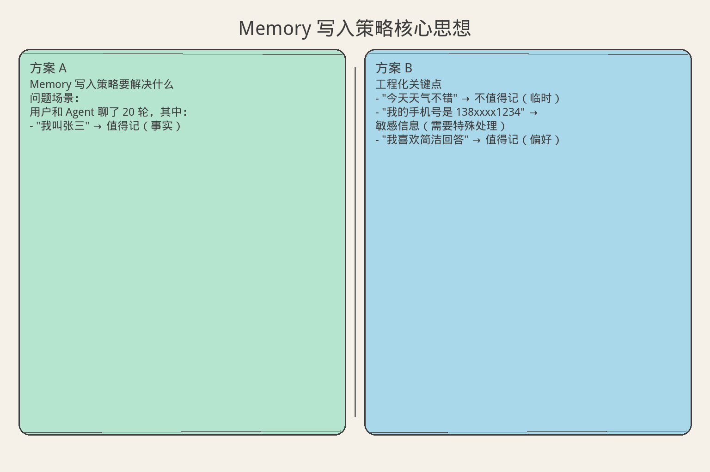
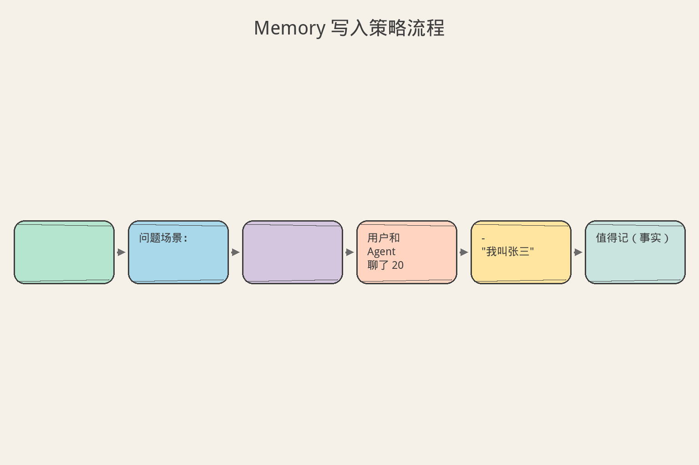
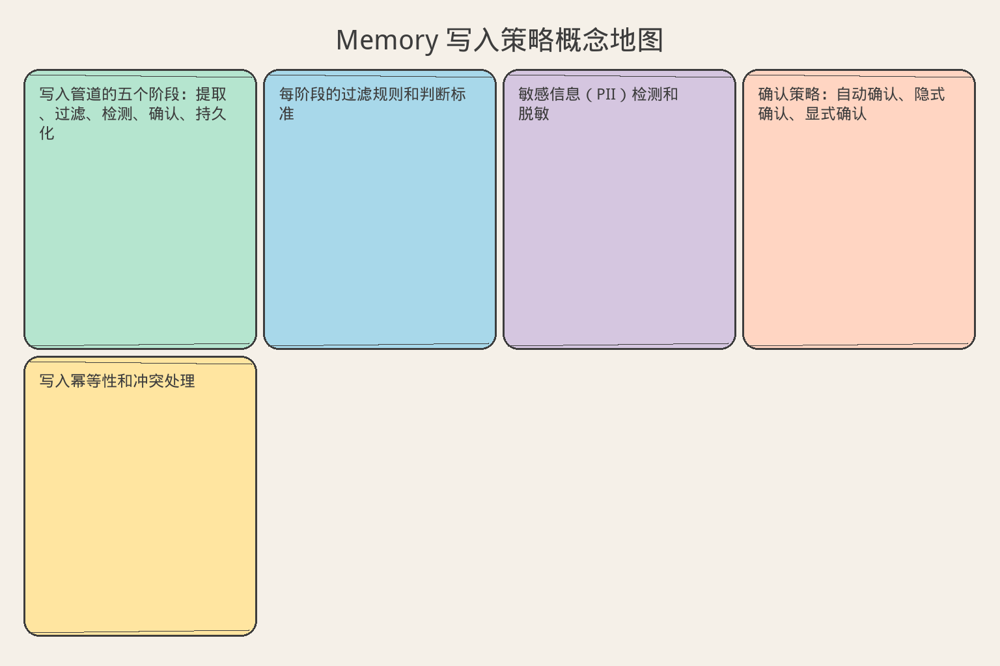

# AI Agent 工程（二十二）：Memory 写入策略

> Memory 写入应是受控管道：先提取候选，再经过规则、敏感检测和用户确认，最后才持久化。不是"对话里说了什么就记什么"，而是"什么值得记、怎么记、谁同意记"。

**阅读建议：** 先阅读 [234 长期记忆](234.long-term-agent-memory-tutorial.md)，理解长期记忆的数据结构。

**环境要求：** Python 3.10+，dataclasses，enum，typing

---

## 目录

1. [你会学到什么](#你会学到什么)
2. [它解决什么问题](#它解决什么问题)
3. [核心概念：写入管道](#核心概念写入管道)
4. [最小示例](#最小示例)
5. [工程化版本](#工程化版本)
6. [敏感信息检测](#敏感信息检测)
7. [常见失败模式](#常见失败模式)
8. [什么时候不要这么做](#什么时候不要这么做)
9. [生产环境注意事项](#生产环境注意事项)
10. [如何观测和评测](#如何观测和评测)
11. [和 RAG / 后端 / 前端的关系](#和-rag--后端--前端的关系)
12. [面试怎么讲](#面试怎么讲)
13. [下一步](#下一步)

---

## 你会学到什么

- 写入管道的五个阶段：提取、过滤、检测、确认、持久化
- 每阶段的过滤规则和判断标准
- 敏感信息（PII）检测和脱敏
- 确认策略：自动确认、隐式确认、显式确认
- 写入幂等性和冲突处理

---

## 它解决什么问题


读下图时，先看「Memory 写入策略核心思想」建立直觉。


```text
问题场景：

用户和 Agent 聊了 20 轮，其中：
- "我叫张三" → 值得记（事实）
- "今天天气不错" → 不值得记（临时）
- "我的手机号是 138xxxx1234" → 敏感信息（需要特殊处理）
- "我喜欢简洁回答" → 值得记（偏好）
- "帮我查一下订单" → 不值得记（一次性请求）
- "我上次说喜欢简洁的" → 重复（去重）

如果没有写入策略：
1. 全记 → 噪声大，检索质量差
2. 不记 → 没有长期记忆
3. 随便记 → 隐私泄露、信息过时

正确做法：
- 管道化处理：每一步都有明确的过滤规则
- 分级确认：不是所有记忆都需要用户点头
- 安全优先：敏感信息要么不记，要么加密
```

---

## 核心概念：写入管道

```text
写入管道五阶段：

┌─────────────────────────────────────────────────────────────┐
│  Stage 1: 提取 (Extraction)                                  │
│  - 从对话中识别潜在记忆                                      │
│  - 方法：LLM / 规则 / NER                                   │
│  - 输出：候选列表（content + category + confidence）         │
├─────────────────────────────────────────────────────────────┤
│  Stage 2: 过滤 (Filtering)                                   │
│  - 去重：和已有记忆对比                                      │
│  - 价值判断：是否跨会话有用                                  │
│  - 稳定性：是临时状态还是持久特征                            │
│  - 输出：过滤后的候选列表                                    │
├─────────────────────────────────────────────────────────────┤
│  Stage 3: 安全检测 (Safety Check)                            │
│  - PII 检测：手机号、身份证、地址                            │
│  - 敏感话题：政治、宗教、健康                                │
│  - 第三方信息：是否涉及他人隐私                              │
│  - 输出：安全标记 + 脱敏版本                                 │
├─────────────────────────────────────────────────────────────┤
│  Stage 4: 确认 (Confirmation)                                │
│  - 自动确认：高置信度 + 非敏感                               │
│  - 隐式确认：使用中用户未否认                                │
│  - 显式确认：敏感信息必须用户同意                            │
│  - 输出：确认状态                                            │
├─────────────────────────────────────────────────────────────┤
│  Stage 5: 持久化 (Persistence)                               │
│  - 生成 embedding                                           │
│  - 写入数据库 + 向量库                                      │
│  - 记录来源和审计日志                                        │
│  - 输出：存储成功的记忆 ID                                   │
└─────────────────────────────────────────────────────────────┘

每阶段的通过率（典型值）：
- 提取：100%（所有潜在记忆）
- 过滤：~40%（大部分不值得记）
- 安全检测：~90%（少数含敏感信息）
- 确认：~80%（部分需要用户确认）
- 持久化：最终约 30% 的候选被存储
```

---

## 最小示例


读下图时，先看「Memory 写入策略流程」建立直觉。


```python
"""最小示例：简单的写入管道"""
from dataclasses import dataclass, field
from enum import Enum
import re


class WriteDecision(Enum):
    ACCEPT = "accept"
    REJECT = "reject"
    NEED_CONFIRM = "need_confirm"
    REDACT = "redact"  # 脱敏后接受


@dataclass
class MemoryCandidate:
    content: str
    category: str
    confidence: float
    source_turn: int = 0


@dataclass
class WriteResult:
    decision: WriteDecision
    candidate: MemoryCandidate
    reason: str = ""
    redacted_content: str | None = None


class SimpleWritePolicy:
    """简单写入策略"""

    # 不值得记的模式
    REJECT_PATTERNS = [
        r"^(你好|谢谢|再见|好的|嗯)",  # 寒暄
        r"(今天|明天|昨天).*(天气|温度)",  # 临时信息
        r"^(帮我|请|麻烦).*(查|看|找)",  # 一次性请求
    ]

    # 敏感信息模式
    PII_PATTERNS = {
        "phone": r"1[3-9]\d{9}",
        "email": r"[\w.-]+@[\w.-]+\.\w+",
        "id_card": r"\d{17}[\dXx]",
    }

    def evaluate(self, candidate: MemoryCandidate) -> WriteResult:
        # Step 1: 价值过滤
        for pattern in self.REJECT_PATTERNS:
            if re.search(pattern, candidate.content):
                return WriteResult(
                    decision=WriteDecision.REJECT,
                    candidate=candidate,
                    reason="不符合长期记忆标准",
                )

        # Step 2: 置信度检查
        if candidate.confidence < 0.4:
            return WriteResult(
                decision=WriteDecision.REJECT,
                candidate=candidate,
                reason="置信度过低",
            )

        # Step 3: PII 检测
        has_pii = False
        redacted = candidate.content
        for pii_type, pattern in self.PII_PATTERNS.items():
            if re.search(pattern, redacted):
                has_pii = True
                redacted = re.sub(pattern, f"[{pii_type}_REDACTED]", redacted)

        if has_pii:
            return WriteResult(
                decision=WriteDecision.REDACT,
                candidate=candidate,
                reason="包含敏感信息，已脱敏",
                redacted_content=redacted,
            )

        # Step 4: 确认策略
        if candidate.confidence >= 0.8:
            return WriteResult(
                decision=WriteDecision.ACCEPT,
                candidate=candidate,
                reason="高置信度，自动接受",
            )
        else:
            return WriteResult(
                decision=WriteDecision.NEED_CONFIRM,
                candidate=candidate,
                reason="中置信度，需要确认",
            )


# 使用
policy = SimpleWritePolicy()

test_cases = [
    MemoryCandidate("我喜欢简洁的回答", "preference", 0.9),
    MemoryCandidate("你好啊", "unknown", 0.3),
    MemoryCandidate("我的手机号是 13812345678", "fact", 0.8),
    MemoryCandidate("我用 Python 和 Go 开发", "fact", 0.7),
]

for tc in test_cases:
    result = policy.evaluate(tc)
    print(f"[{result.decision.value}] {tc.content[:30]} → {result.reason}")
    if result.redacted_content:
        print(f"  脱敏后: {result.redacted_content}")
```

---

## 工程化版本

```python
"""工程化版本：完整的写入管道"""
from __future__ import annotations

import hashlib
import logging
import re
import time
import uuid
from dataclasses import dataclass, field
from enum import Enum
from typing import Any, Callable

logger = logging.getLogger(__name__)


# ─── 数据模型 ───────────────────────────────────────────────

class PipelineStage(Enum):
    EXTRACTION = "extraction"
    FILTERING = "filtering"
    SAFETY = "safety"
    CONFIRMATION = "confirmation"
    PERSISTENCE = "persistence"


class Decision(Enum):
    ACCEPT = "accept"
    REJECT = "reject"
    NEED_CONFIRM = "need_confirm"
    REDACT_ACCEPT = "redact_accept"
    PENDING = "pending"


@dataclass
class Candidate:
    """记忆候选"""
    id: str = field(default_factory=lambda: uuid.uuid4().hex[:12])
    content: str = ""
    category: str = "fact"
    confidence: float = 0.5
    importance: float = 0.5
    source_session: str = ""
    source_turn: int = 0
    tags: list[str] = field(default_factory=list)
    metadata: dict[str, Any] = field(default_factory=dict)


@dataclass
class StageResult:
    """阶段处理结果"""
    candidate: Candidate
    decision: Decision
    stage: PipelineStage
    reason: str = ""
    modified_content: str | None = None
    timestamp: float = field(default_factory=time.time)


@dataclass
class AuditEntry:
    """审计日志"""
    candidate_id: str
    stage: PipelineStage
    decision: Decision
    reason: str
    timestamp: float = field(default_factory=time.time)


# ─── 阶段处理器 ─────────────────────────────────────────────

class StageProcessor:
    """阶段处理器基类"""

    def process(self, candidate: Candidate) -> StageResult:
        raise NotImplementedError


class ExtractionStage(StageProcessor):
    """提取阶段：从对话中识别候选"""

    def __init__(self, llm_call: Callable[[str], str] | None = None):
        self._llm_call = llm_call
        self._patterns = {
            "preference": [
                r"我(喜欢|偏好|习惯|希望|想要)",
                r"请不要|不要给我|别再",
                r"以后都|每次都|总是",
            ],
            "fact": [
                r"我是|我用|我的|我在",
                r"我们(团队|公司|项目)",
                r"(版本|环境|系统)是",
            ],
            "episode": [
                r"(上次|之前|曾经).*(解决|修复|处理)",
                r"(发现|学到|教训)",
            ],
        }

    def extract_from_conversation(
        self, messages: list[dict[str, str]], session_id: str
    ) -> list[Candidate]:
        """从对话中提取候选"""
        candidates = []
        for i, msg in enumerate(messages):
            if msg["role"] != "user":
                continue
            content = msg["content"]
            for category, patterns in self._patterns.items():
                for pattern in patterns:
                    if re.search(pattern, content):
                        candidates.append(Candidate(
                            content=content,
                            category=category,
                            confidence=0.6,
                            importance=self._assess_importance(category),
                            source_session=session_id,
                            source_turn=i,
                        ))
                        break
                else:
                    continue
                break
        return candidates

    def _assess_importance(self, category: str) -> float:
        return {"preference": 0.8, "fact": 0.6, "episode": 0.5}.get(
            category, 0.5
        )

    def process(self, candidate: Candidate) -> StageResult:
        return StageResult(
            candidate=candidate,
            decision=Decision.ACCEPT,
            stage=PipelineStage.EXTRACTION,
        )


class FilteringStage(StageProcessor):
    """过滤阶段：去重 + 价值判断"""

    REJECT_PATTERNS = [
        r"^(你好|嗨|hi|hello|谢谢|感谢|再见|拜拜)",
        r"^(好的|嗯|ok|行|可以|没问题)$",
        r"(今天|明天|昨天|现在).*(天气|温度|几度)",
        r"^(帮我|请|麻烦).*(查一下|看看|找找)",
    ]

    MIN_CONTENT_LENGTH = 5

    def __init__(self, existing_hashes: set[str] | None = None):
        self._existing_hashes = existing_hashes or set()

    def process(self, candidate: Candidate) -> StageResult:
        # 长度检查
        if len(candidate.content.strip()) < self.MIN_CONTENT_LENGTH:
            return StageResult(
                candidate=candidate,
                decision=Decision.REJECT,
                stage=PipelineStage.FILTERING,
                reason="内容过短",
            )

        # 模式匹配
        for pattern in self.REJECT_PATTERNS:
            if re.search(pattern, candidate.content, re.IGNORECASE):
                return StageResult(
                    candidate=candidate,
                    decision=Decision.REJECT,
                    stage=PipelineStage.FILTERING,
                    reason=f"匹配拒绝模式: {pattern}",
                )

        # 去重
        content_hash = hashlib.sha256(
            candidate.content.encode()
        ).hexdigest()[:16]
        if content_hash in self._existing_hashes:
            return StageResult(
                candidate=candidate,
                decision=Decision.REJECT,
                stage=PipelineStage.FILTERING,
                reason="重复内容",
            )

        # 置信度门槛
        if candidate.confidence < 0.3:
            return StageResult(
                candidate=candidate,
                decision=Decision.REJECT,
                stage=PipelineStage.FILTERING,
                reason="置信度过低",
            )

        return StageResult(
            candidate=candidate,
            decision=Decision.ACCEPT,
            stage=PipelineStage.FILTERING,
        )


class SafetyStage(StageProcessor):
    """安全检测阶段"""

    PII_PATTERNS = {
        "phone": (r"1[3-9]\d{9}", "[PHONE]"),
        "email": (r"[\w.-]+@[\w.-]+\.\w{2,}", "[EMAIL]"),
        "id_card": (r"\d{17}[\dXx]", "[ID_CARD]"),
        "bank_card": (r"\d{16,19}", "[BANK_CARD]"),
        "address": (
            r"[\u4e00-\u9fff]{2,}(省|市|区|县|路|街|号|楼|室)",
            "[ADDRESS]"
        ),
    }

    SENSITIVE_TOPICS = [
        "政治", "宗教", "种族", "性别歧视",
        "疾病", "诊断", "用药",
    ]

    def process(self, candidate: Candidate) -> StageResult:
        content = candidate.content
        has_pii = False
        redacted = content

        # PII 检测和脱敏
        for pii_type, (pattern, replacement) in self.PII_PATTERNS.items():
            if re.search(pattern, redacted):
                has_pii = True
                redacted = re.sub(pattern, replacement, redacted)
                candidate.tags.append(f"contains_{pii_type}")

        # 敏感话题检测
        for topic in self.SENSITIVE_TOPICS:
            if topic in content:
                candidate.tags.append(f"sensitive_{topic}")
                return StageResult(
                    candidate=candidate,
                    decision=Decision.REJECT,
                    stage=PipelineStage.SAFETY,
                    reason=f"涉及敏感话题: {topic}",
                )

        if has_pii:
            return StageResult(
                candidate=candidate,
                decision=Decision.REDACT_ACCEPT,
                stage=PipelineStage.SAFETY,
                reason="包含 PII，已脱敏",
                modified_content=redacted,
            )

        return StageResult(
            candidate=candidate,
            decision=Decision.ACCEPT,
            stage=PipelineStage.SAFETY,
        )


class ConfirmationStage(StageProcessor):
    """确认阶段"""

    AUTO_CONFIRM_THRESHOLD = 0.8
    REJECT_THRESHOLD = 0.4

    def process(self, candidate: Candidate) -> StageResult:
        # 包含敏感标签的需要显式确认
        if any(t.startswith("contains_") for t in candidate.tags):
            return StageResult(
                candidate=candidate,
                decision=Decision.NEED_CONFIRM,
                stage=PipelineStage.CONFIRMATION,
                reason="包含脱敏信息，需用户确认",
            )

        # 高置信度自动确认
        if candidate.confidence >= self.AUTO_CONFIRM_THRESHOLD:
            return StageResult(
                candidate=candidate,
                decision=Decision.ACCEPT,
                stage=PipelineStage.CONFIRMATION,
                reason="高置信度，自动确认",
            )

        # 低置信度拒绝
        if candidate.confidence < self.REJECT_THRESHOLD:
            return StageResult(
                candidate=candidate,
                decision=Decision.REJECT,
                stage=PipelineStage.CONFIRMATION,
                reason="置信度不足",
            )

        # 中间地带：等待隐式确认
        return StageResult(
            candidate=candidate,
            decision=Decision.PENDING,
            stage=PipelineStage.CONFIRMATION,
            reason="等待隐式确认",
        )


# ─── 管道编排 ───────────────────────────────────────────────

class WritePipeline:
    """写入管道"""

    def __init__(
        self,
        filtering: FilteringStage | None = None,
        safety: SafetyStage | None = None,
        confirmation: ConfirmationStage | None = None,
        persist_fn: Callable[[Candidate], str] | None = None,
    ):
        self.filtering = filtering or FilteringStage()
        self.safety = safety or SafetyStage()
        self.confirmation = confirmation or ConfirmationStage()
        self._persist = persist_fn or self._default_persist
        self._audit_log: list[AuditEntry] = []
        self._pending: dict[str, Candidate] = {}
        self._stats = {
            "total": 0, "accepted": 0, "rejected": 0,
            "pending": 0, "redacted": 0,
        }

    def process(self, candidate: Candidate) -> StageResult:
        """处理单个候选"""
        self._stats["total"] += 1

        # Stage 2: 过滤
        result = self.filtering.process(candidate)
        self._log_audit(candidate.id, PipelineStage.FILTERING, result)
        if result.decision == Decision.REJECT:
            self._stats["rejected"] += 1
            return result

        # Stage 3: 安全检测
        result = self.safety.process(candidate)
        self._log_audit(candidate.id, PipelineStage.SAFETY, result)
        if result.decision == Decision.REJECT:
            self._stats["rejected"] += 1
            return result
        if result.modified_content:
            candidate.content = result.modified_content
            self._stats["redacted"] += 1

        # Stage 4: 确认
        result = self.confirmation.process(candidate)
        self._log_audit(candidate.id, PipelineStage.CONFIRMATION, result)

        if result.decision == Decision.ACCEPT:
            # Stage 5: 持久化
            self._persist(candidate)
            self._stats["accepted"] += 1
        elif result.decision == Decision.PENDING:
            self._pending[candidate.id] = candidate
            self._stats["pending"] += 1
        elif result.decision == Decision.NEED_CONFIRM:
            self._pending[candidate.id] = candidate
            self._stats["pending"] += 1

        return result

    def confirm_pending(self, candidate_id: str) -> bool:
        """用户确认待确认记忆"""
        candidate = self._pending.pop(candidate_id, None)
        if candidate:
            self._persist(candidate)
            self._stats["accepted"] += 1
            self._stats["pending"] -= 1
            return True
        return False

    def reject_pending(self, candidate_id: str) -> bool:
        """用户拒绝待确认记忆"""
        candidate = self._pending.pop(candidate_id, None)
        if candidate:
            self._stats["rejected"] += 1
            self._stats["pending"] -= 1
            return True
        return False

    def _log_audit(
        self, candidate_id: str, stage: PipelineStage, result: StageResult
    ) -> None:
        self._audit_log.append(AuditEntry(
            candidate_id=candidate_id,
            stage=stage,
            decision=result.decision,
            reason=result.reason,
        ))

    def _default_persist(self, candidate: Candidate) -> str:
        logger.info(f"持久化记忆: {candidate.content[:50]}")
        return candidate.id

    def get_stats(self) -> dict:
        return dict(self._stats)

    def get_audit_log(self) -> list[AuditEntry]:
        return list(self._audit_log)


# ─── 使用示例 ───────────────────────────────────────────────

def demo():
    pipeline = WritePipeline()

    candidates = [
        Candidate(content="我喜欢简洁的回答风格", category="preference", confidence=0.9),
        Candidate(content="你好", category="unknown", confidence=0.3),
        Candidate(content="我的手机号是 13812345678", category="fact", confidence=0.8),
        Candidate(content="我用 Python 3.12 和 FastAPI", category="fact", confidence=0.7),
        Candidate(content="嗯", category="unknown", confidence=0.2),
    ]

    for c in candidates:
        result = pipeline.process(c)
        print(f"[{result.decision.value:12}] {c.content[:30]} | {result.reason}")

    print(f"\n统计: {pipeline.get_stats()}")


if __name__ == "__main__":
    demo()
```

---

## 敏感信息检测

```text
PII 检测策略：

1. 正则匹配（快速，覆盖常见格式）
   - 手机号：1[3-9]\d{9}
   - 邮箱：\w+@\w+\.\w+
   - 身份证：\d{17}[\dXx]
   - 银行卡：\d{16,19}
   - 地址：中文地址模式

2. NER 模型（准确，覆盖变体）
   - spaCy / HuggingFace NER
   - 识别人名、地名、组织名
   - 处理非标准格式

3. LLM 辅助（最灵活，成本最高）
   - 让 LLM 判断是否包含敏感信息
   - 处理隐含信息（"我住在学校附近"）
   - 用于兜底检查

处理策略：
- 直接拒绝：身份证号、银行卡号（风险太高）
- 脱敏存储：手机号、邮箱（替换为占位符）
- 加密存储：地址（AES 加密，需要时解密）
- 提示确认：人名、组织名（可能是他人的）

脱敏规则：
- 手机号：138****5678（保留前3后4）
- 邮箱：z***@example.com
- 地址：[ADDRESS_ENCRYPTED]
- 人名：[PERSON_1]（匿名化）
```

```python
"""PII 检测器"""
import re
from dataclasses import dataclass
from enum import Enum


class PIILevel(Enum):
    HIGH = "high"      # 身份证、银行卡 → 拒绝
    MEDIUM = "medium"  # 手机号、邮箱 → 脱敏
    LOW = "low"        # 人名、地址 → 确认


@dataclass
class PIIMatch:
    pii_type: str
    level: PIILevel
    original: str
    start: int
    end: int


class PIIDetector:
    """PII 检测器"""

    PATTERNS: dict[str, tuple[str, PIILevel]] = {
        "id_card": (r"\d{17}[\dXx]", PIILevel.HIGH),
        "bank_card": (r"\d{16,19}", PIILevel.HIGH),
        "phone": (r"1[3-9]\d{9}", PIILevel.MEDIUM),
        "email": (r"[\w.-]+@[\w.-]+\.\w{2,}", PIILevel.MEDIUM),
        "ip_address": (r"\d{1,3}\.\d{1,3}\.\d{1,3}\.\d{1,3}", PIILevel.MEDIUM),
    }

    def detect(self, text: str) -> list[PIIMatch]:
        matches = []
        for pii_type, (pattern, level) in self.PATTERNS.items():
            for m in re.finditer(pattern, text):
                matches.append(PIIMatch(
                    pii_type=pii_type,
                    level=level,
                    original=m.group(),
                    start=m.start(),
                    end=m.end(),
                ))
        return matches

    def redact(self, text: str) -> tuple[str, list[PIIMatch]]:
        """脱敏处理"""
        matches = self.detect(text)
        result = text
        # 从后往前替换，避免位置偏移
        for match in sorted(matches, key=lambda m: m.start, reverse=True):
            replacement = f"[{match.pii_type.upper()}]"
            result = result[:match.start] + replacement + result[match.end:]
        return result, matches

    def has_high_risk(self, text: str) -> bool:
        """是否包含高风险 PII"""
        return any(
            m.level == PIILevel.HIGH for m in self.detect(text)
        )
```

---

## 常见失败模式

```text
失败模式 1：写入过于激进
━━━━━━━━━━━━━━━━━━━━━━━━
症状：长期记忆充满无用信息
原因：过滤规则太宽松
后果：检索噪声大，token 浪费
修复：
- 提高过滤门槛
- 定期审计记忆质量
- 追踪"记忆被使用"的比例

失败模式 2：写入过于保守
━━━━━━━━━━━━━━━━━━━━━━━━
症状：Agent 该记的没记住
原因：过滤规则太严格
后果：用户体验差，重复表达
修复：
- 降低偏好类的门槛
- 用户主动说"记住这个"时直接写入
- 监控"用户重复表达"的频率

失败模式 3：PII 泄露
━━━━━━━━━━━━━━━━━━━━━━━━
症状：敏感信息被明文存储
原因：安全检测覆盖不全
后果：合规风险，用户信任损失
修复：
- 多层检测：正则 + NER + LLM
- 默认拒绝：不确定的当敏感处理
- 定期审计存储内容

失败模式 4：确认疲劳
━━━━━━━━━━━━━━━━━━━━━━━━
症状：用户被频繁问"要记住这个吗？"
原因：太多记忆需要显式确认
后果：用户烦躁，随便点确认
修复：
- 只有敏感信息需要显式确认
- 其他用隐式确认
- 批量确认而不是逐条

失败模式 5：管道阻塞
━━━━━━━━━━━━━━━━━━━━━━━━
症状：写入延迟影响对话体验
原因：同步执行所有阶段
后果：用户等待时间长
修复：
- 提取和过滤同步（快）
- 安全检测和持久化异步
- 先返回对话，后台写入
```

---

## 什么时候不要这么做

```text
不需要复杂写入管道的场景：

1. 原型阶段
   - 先验证记忆有没有价值
   - 简单 if-else 过滤即可
   - 不需要完整管道

2. 纯偏好记忆
   - 只记用户偏好（5-10 条）
   - 用户显式设置
   - 不需要自动提取

3. 已有用户画像系统
   - CRM / 用户中心已有数据
   - Agent 直接读取
   - 不需要自己记

4. 合规禁止
   - 不允许存储用户对话
   - 不允许建立用户画像
   - 那就不要记

判断标准：
- 记忆来源多样？→ 需要管道
- 有敏感信息风险？→ 需要安全检测
- 需要自动提取？→ 需要确认策略
- 以上都不是？→ 简单写入即可
```

---

## 生产环境注意事项

```text
性能与可靠性：

1. 异步处理
   - 对话响应不等写入完成
   - 用消息队列（Redis Stream / Kafka）
   - 写入失败重试（最多 3 次）

2. 幂等性
   - 同一候选不重复写入
   - 用 content_hash 做幂等键
   - 管道可安全重放

3. 批量处理
   - 会话结束后批量提取
   - 不要每轮都触发管道
   - 减少 LLM 调用次数

4. 监控
   - 每阶段通过率
   - 管道延迟 P95
   - 待确认队列积压
   - PII 检测命中率

5. 回滚
   - 写入后 24h 内可撤回
   - 用户反馈"记错了"立即删除
   - 保留审计日志

容量估算：
- 每会话平均提取 5 个候选
- 过滤后约 2 个进入管道
- 最终约 0.6 个被持久化
- 1000 会话/天 → 600 条新记忆/天
```

---

## 如何观测和评测

```python
"""写入管道监控"""

PIPELINE_METRICS = """
1. 阶段指标
   - extraction_count: 提取候选数
   - filter_pass_rate: 过滤通过率
   - safety_flag_rate: 安全标记率
   - confirm_auto_rate: 自动确认率
   - persist_success_rate: 持久化成功率

2. 质量指标
   - precision: 写入的记忆中有多少是有用的
   - recall: 该记的有多少被记了
   - user_correction_rate: 用户纠正频率
   - pii_miss_rate: PII 漏检率（必须为 0）

3. 效率指标
   - pipeline_latency_p95: 管道延迟
   - llm_calls_per_session: 每会话 LLM 调用数
   - dedup_hit_rate: 去重命中率

4. 告警规则
   - PII 漏检 > 0 → 紧急
   - 过滤通过率 > 80% → 过滤太松
   - 过滤通过率 < 10% → 过滤太严
   - 待确认积压 > 100 → 需要处理
   - 用户纠正率 > 10% → 提取质量差
"""
```

---

## 和 RAG / 后端 / 前端的关系

```text
与 RAG 的关系：
- 写入管道可以复用 RAG 的文本处理
- embedding 生成共用同一模型
- 向量库写入共用同一接口

与后端的关系：
- 管道用消息队列异步执行
- PII 检测可以是独立微服务
- 审计日志写入日志系统
- 确认状态存 Redis

与前端的关系：
- 待确认记忆推送给用户
- "记忆管理"页面显示写入历史
- 用户反馈"记错了"触发删除
- 首次使用同意弹窗
```

---

## 面试怎么讲

```text
面试官问：记忆写入怎么控制质量？

回答框架（2 分钟）：

"我用五阶段管道：提取、过滤、安全检测、确认、持久化。

提取阶段从对话中识别候选——
用规则匹配'我喜欢''我用'这类模式，
或者用 LLM 做更灵活的提取。

过滤阶段去掉不值得记的——
寒暄、一次性请求、太短的、重复的。
典型过滤率 60%，大部分对话不值得记。

安全检测阶段处理 PII——
手机号、身份证用正则检测，
高风险直接拒绝，中风险脱敏后存储。

确认阶段分级——
高置信度自动确认，
中置信度等隐式确认（用了用户没否认），
敏感信息必须显式确认。

最后持久化：生成 embedding，
写数据库和向量库，记审计日志。

关键设计：整个管道异步执行，
不阻塞对话响应。"

追问应对：
Q: PII 检测怎么保证不漏？
A: 三层：正则（快）+ NER（准）+ LLM（兜底）。
   宁可误报不可漏报。定期用标注数据测试。

Q: 怎么评估写入质量？
A: 两个核心指标：
   precision（写入的有多少有用）> 80%
   用户纠正率 < 5%
```

---

## 设计原则总结

```text
写入策略的 6 条原则：

1. 默认不记
   - 只有通过所有检查的才写入
   - 不确定的不记
   - 宁可漏记不可错记

2. 安全优先
   - PII 检测在价值判断之后、确认之前
   - 高风险直接拒绝
   - 不确定是否敏感时当敏感处理

3. 异步不阻塞
   - 写入不影响对话延迟
   - 管道失败不影响用户体验
   - 后台重试

4. 可审计
   - 每阶段决策有日志
   - 可追溯"为什么记了/没记"
   - 支持事后审查

5. 用户可控
   - 用户能查看待确认列表
   - 用户能一键拒绝
   - 用户能要求删除已写入的

6. 幂等安全
   - 重复处理不产生重复记忆
   - 管道可安全重放
   - 用 content_hash 去重
```

---

## 下一步


读下图时，先看「Memory 写入策略概念地图」建立直觉。


阅读 [236 Memory 检索策略](236.memory-retrieval-policy-tutorial.md)，了解如何从大量记忆中高效检索最相关的信息。
