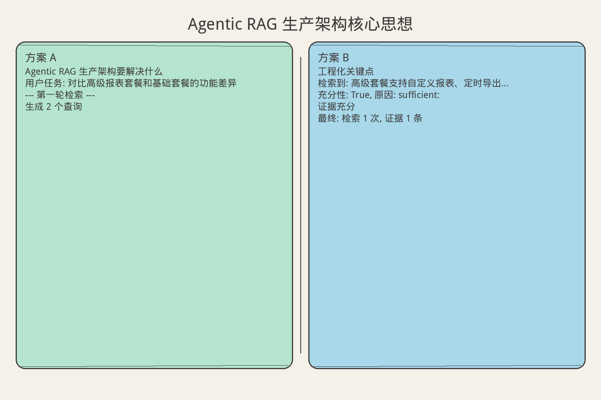
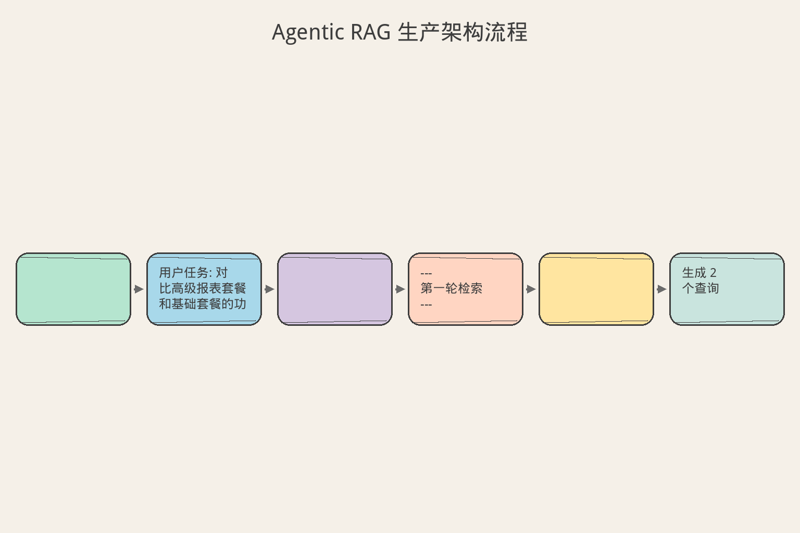
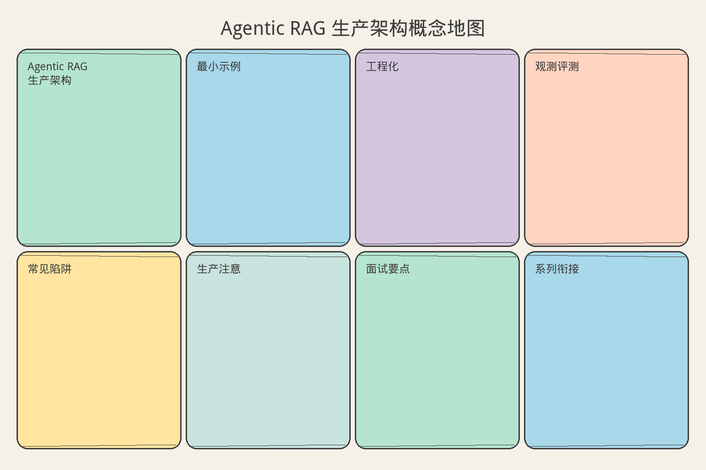

# AI Agent 工程（二十五）：Agentic RAG 生产架构

> Agentic RAG 不是"多检索几次"，而是让系统根据任务和中间证据自主决定查什么、查哪里、够不够、能不能验证——同时保持预算可控和全链路可追溯。

**阅读建议：** 先阅读 [201 Agentic RAG](201.agentic-rag-tutorial.md) 了解基本概念，再阅读 [231 Agent 停止条件](231.agent-stop-condition-tutorial.md) 理解预算控制。本文是 Agentic RAG 模块的总览篇，后续四篇会分别深入每个组件。

**环境要求：**
- Python **3.10+**
- 依赖：`pip install pydantic`

---

## 目录

本文按照"是什么 → 为什么 → 怎么做"三条主线展开，帮助你从概念到工程完整理解 Agentic RAG 的生产架构。

1. [是什么：Agentic RAG 到底在做什么](#是什么agentic-rag-到底在做什么)
2. [为什么：普通 RAG 哪里不够](#为什么普通-rag-哪里不够)
3. [怎么做：四个核心组件的工程实现](#怎么做四个核心组件的工程实现)
4. [常见失败模式](#常见失败模式)
5. [什么时候不要这么做](#什么时候不要这么做)
6. [生产环境注意事项](#生产环境注意事项)
7. [如何观测和评测](#如何观测和评测)
8. [和 RAG / 后端 / 前端的关系](#和-rag--后端--前端的关系)
9. [面试怎么讲](#面试怎么讲)
10. [下一步](#下一步)

---

## 是什么：Agentic RAG 到底在做什么


读下图时，先看「Agentic RAG 生产架构核心思想」建立直觉。


在正式进入技术细节之前，我想先帮你建立一个直觉。如果你之前只用过普通 RAG（一次检索、一次生成），那么 Agentic RAG 可能会让你觉得"复杂了很多"。这种复杂感是真实的——Agentic RAG 确实比普通 RAG 复杂。但这种复杂度不是"为了复杂而复杂"，而是为了解决普通 RAG 解决不了的真实问题。就像从骑自行车到开汽车，操作步骤确实多了（油门、刹车、方向盘、后视镜），但每一步操作都对应一个真实需求（加速、减速、转向、观察）。Agentic RAG 的每一个组件都对应一个普通 RAG 解决不了的真实问题。

### 从一个真实场景说起

假设你是一个企业知识库的开发者。某天，产品经理问你一个问题："帮我对比一下我们高级报表套餐和基础套餐的功能差异，特别是数据源数量和导出格式方面。"

如果你用普通 RAG 来回答这个问题，流程是这样的：把用户的问题原封不动地丢给向量数据库，检索一次，取回 top-5 的结果，然后让模型基于这些结果生成答案。听起来没问题，但实际执行时你会发现：第一次检索可能只找到了高级套餐的信息，基础套餐的信息完全没有被召回。为什么？因为"对比高级报表套餐和基础套餐的功能差异"这个查询太复杂了，向量数据库的语义匹配无法同时覆盖两个子主题。模型拿到不完整的信息后，要么只回答了一半（只讲了高级套餐），要么开始编造基础套餐的信息（幻觉）。

Agentic RAG 的处理方式完全不同。它会先分析用户的问题，发现这其实包含两个子问题："高级套餐有什么功能"和"基础套餐有什么功能"。然后它分别检索这两个子问题，把结果收集到一个"证据仓库"中。接着它检查证据是否足够——"两个套餐的信息都找到了吗？有没有冲突？"如果足够，它生成答案并验证每个引用是否真的被证据支持。如果不够，它会继续检索，直到证据充分或者达到预算上限。

这个过程中，系统不是机械地执行固定步骤，而是根据中间结果动态决定下一步做什么。这就是"Agentic"的含义——系统有自主决策能力，但这种自主性是被约束的（有预算、有规则、有验证），不是无限制的自由发挥。

注意这个例子中的关键细节：系统"发现"第一次检索不够，然后"决定"继续检索。这个"发现"和"决定"就是 Agentic 的核心——系统不是被动地执行固定步骤，而是主动地评估和调整。这种能力让 Agentic RAG 能够处理普通 RAG 处理不了的复杂问题。

### Agentic RAG 的定义

有了上面的直觉，我们可以给出一个更精确的定义。Agentic RAG 是一种检索增强生成的架构模式，它在传统 RAG 的基础上引入了自主决策能力。传统 RAG 是"固定管道"——查询进来，检索一次，生成答案，结束。Agentic RAG 是"决策循环"——查询进来，规划检索策略，执行检索，评估证据是否充分，如果不充分就继续检索，如果充分就生成答案并验证引用，最后输出结果。

这里有一个初学者容易产生的误解：以为"Agentic"意味着"完全自主、不受控制"。实际上恰恰相反——生产环境中的 Agentic RAG 是"被约束的自主性"。它自主决定"查什么"，但不能查未授权的数据；它自主决定"查几次"，但不能超过预算上限；它自主决定"够不够"，但判断标准是预定义的规则。这种"有边界的自由"是 Agentic RAG 和"无限制 Agent"的关键区别。无限制 Agent 可能做出不可预测的行为（比如无限循环检索、访问敏感数据），而 Agentic RAG 的每一步都在预定义的边界内。

这个定义中有三个关键词需要理解。第一个是"自主决策"——系统自己决定查什么、查哪里、查几次，而不是由开发者预先写死。第二个是"约束"——自主决策不是无限制的，有预算（最多检索几次）、有规则（不能查未授权的数据源）、有验证（引用必须被证据支持）。第三个是"可追溯"——每一步决策都有记录，出了问题可以回放整个流程，定位是哪一步出了错。

这三个关键词之间有一个重要的张力：自主性越高，可追溯性就越重要。如果系统自己决定查什么、查几次，那么当答案出错时，你需要知道"它当时为什么做了这个决定"。如果没有可追溯性，自主性就变成了"黑箱"——你不知道它为什么这样做，也无法修复。所以可追溯性不是"可选的额外功能"，而是自主性的必要前提。

### 和普通 RAG 的本质区别

很多初学者会问："Agentic RAG 不就是多检索几次吗？和普通 RAG 有什么本质区别？"这个问题很好，因为它触及了核心。

普通 RAG 的本质是"一次性管道"：输入一个问题，输出一个答案，中间过程是固定的。它不做判断——不管检索结果好不好，都直接生成答案。它不做规划——不管问题多复杂，都只检索一次。它不做验证——不管引用对不对，都直接输出。

Agentic RAG 的本质是"决策循环"：输入一个问题，经过多轮"规划→检索→评估→决策"，输出一个经过验证的答案。它做判断——证据不够就继续检索，证据冲突就披露或转人工。它做规划——复杂问题拆成子问题，分别检索。它做验证——每个引用都要检查是否被证据支持。

用一个生活类比来理解：普通 RAG 像是一个"固定旅行团"——路线是固定的（A→B→C→回），每个景点待 30 分钟，导游说什么你听什么，不管你有没有听懂、有没有兴趣。Agentic RAG 像是"自由行"——你有总预算（比如 3 天），有目标（比如"了解这个城市的历史和文化"），但路线是你自己决定的：到了博物馆发现很有趣就多待一会儿，到了商业街觉得没意思就跳过，到了景点发现信息不够就查攻略、问当地人。自由行不是"无限制漫游"——你有预算约束，有目标导向，有信息验证（对比多个攻略确认信息准确性）。

这个类比中有一个关键细节：自由行的"自主决策"是基于"中间反馈"的。你到了博物馆发现很有趣（中间反馈），所以决定多待一会儿（决策）。同样，Agentic RAG 的决策也是基于中间反馈的：检索后发现证据不够（中间反馈），所以决定继续检索（决策）。没有中间反馈的"多次检索"不是 Agentic，只是重复。

### 四个核心组件

Agentic RAG 的生产架构由四个核心组件构成，加上两个贯穿所有组件的基础设施。理解这六个部分是理解整个架构的关键。我会先给出每个组件的一句话定义，然后在后面的"怎么做"部分详细展开。现在你只需要建立一个全局图景——知道有哪些部分、它们分别做什么。

第一个组件是 Query Planning（查询规划）。它负责把用户的复杂问题拆解成可执行的检索查询。比如"对比 A 和 B 的定价"会被拆成"查询 A 的定价"和"查询 B 的定价"两个子查询。Query Planning 还决定每个子查询应该查哪个数据源、用什么过滤条件。

第二个组件是 Retrieval Tool（检索工具）。它负责执行具体的检索操作，并把不同数据源的结果标准化为统一的 Evidence 格式。无论底层是向量数据库、全文搜索引擎还是业务 API，Retrieval Tool 都返回相同结构的证据对象。

第三个组件是 Citation Verification（引用验证）。它负责检查最终答案中的每个引用是否真的被证据支持。不是检查"答案里有没有 [1] 这样的标记"，而是检查"[1] 对应的证据文本是否真的支持这个结论"。

第四个组件是 Bad Case Debugging（失败调试）。它负责在答案出错时，回放整个检索和生成过程，定位是哪一步出了问题——是查询规划错了？是检索没召回？是证据不够？还是生成时幻觉了？

贯穿所有组件的是 Evidence Store（证据仓库）和 Budget Controller（预算控制器）。Evidence Store 存储所有检索到的证据，每条证据有唯一 ID、来源、页码、版本和查询来源。Budget Controller 控制整个流程的资源消耗，包括最大检索次数、最大证据数量和总耗时限制。

这六个部分之间的关系可以用一个类比来理解。想象你是一个调查记者，正在写一篇深度报道。Query Planning 是你的"采访计划"——你决定要采访谁、问什么问题、去哪里找资料。Retrieval Tool 是你的"采访执行"——你实际去采访、查档案、调数据。Evidence Store 是你的"证据墙"——所有收集到的资料都贴在上面，每条资料标注来源和日期。Sufficiency Check 是你的"编辑判断"——"这些资料够写这篇报道了吗？还需要补充什么？"Citation Verification 是你的"事实核查员"——"报道中的每个说法都有证据支持吗？"Bad Case Debugging 是你的"复盘会议"——"这篇报道出了错，是哪一步出了问题？"Budget Controller 是你的"截稿日期和预算"——你不可能无限期地调查下去，必须在有限的时间和资源内完成。

这个类比的关键启示是：Agentic RAG 不是一个"更聪明的搜索框"，而是一个"有判断力的调查系统"。它的价值不在于"检索更多"，而在于"知道什么时候够了、什么时候不对、什么时候该停"。

理解这个类比后，你可能会问："这些组件是必须全部实现，还是可以只实现部分？"答案是：可以渐进式实现。最小可用的 Agentic RAG 只需要 Query Planning + Retrieval Tool + Evidence Store 三个组件。Sufficiency Check 可以从简单规则开始，Citation Verification 可以异步执行，Bad Case Debugging 可以后加。但有一个组件不能省：Budget Controller。没有预算控制的 Agentic RAG 是危险的——它可能无限循环，消耗大量资源。所以即使是最小实现，也必须有预算上限。

---

## 为什么：普通 RAG 哪里不够

理解了 Agentic RAG 是什么之后，你可能会问："普通 RAG 用得好好的，为什么要搞这么复杂？"答案是：普通 RAG 在面对复杂任务时有五个根本性的局限，这些局限不是"调调参数"就能解决的，而是架构层面的问题。理解这些局限不是为了"否定普通 RAG"——对于简单问题，普通 RAG 仍然是最好的选择。理解它们是为了知道"什么时候需要升级"，以及"升级后能解决什么问题"。

我想强调一点：普通 RAG 并不是"差"的技术，它在适合的场景中表现非常好。事实上，大部分用户问题（可能 80% 以上）用普通 RAG 就能很好地回答。Agentic RAG 解决的是剩下那 20% 的复杂问题——对比、列举、多条件、跨文档。理解这个比例很重要，因为它决定了你的架构策略：不是"所有问题都走 Agentic"，而是"简单问题走普通 RAG，复杂问题走 Agentic RAG"。这种"分流"思维是工程实践中的重要原则。

### 局限一：一次检索无法覆盖多子问题

用户的问题经常包含多个子问题。比如"对比 A 和 B 的定价"实际上包含"A 的定价是什么"和"B 的定价是什么"两个子问题。普通 RAG 把整个问题丢给向量数据库，期望一次检索就能覆盖所有子问题。但向量数据库的语义匹配是基于整体相似度的——它可能找到了和"A 定价"很相关的文档，但和"B 定价"相关的文档因为语义距离较远而被排到了 top-k 之外。

这个问题在"对比类""列举类""多条件类"问题中特别常见。比如"列出所有支持 SSO 的套餐及其价格"——这个问题需要同时检索"支持 SSO 的套餐"和"各套餐的价格"，一次检索很难同时覆盖。再比如"A 产品和 B 产品在安全性方面有什么区别"——"A 安全性"和"B 安全性"是两个不同的语义方向，一次检索很难同时命中。

为什么向量数据库不能"理解"这是两个子问题？因为向量数据库的工作原理是把整个查询编码成一个向量，然后找和这个向量最相似的文档。它没有"拆解问题"的能力——它只能做"整体匹配"。这就是为什么我们需要 Query Planning 来手动拆解问题，然后分别检索。

用一个更直观的类比来理解。假设你去图书馆找资料，你的任务是"对比北京和上海的人口政策"。如果你直接问管理员"北京和上海的人口政策对比"，管理员可能只给你一本《北京人口政策》——因为这本书和"北京"的语义更近。但如果你先拆解问题，分别问"北京的人口政策是什么"和"上海的人口政策是什么"，你就能分别找到两本书。Query Planning 做的就是这个"拆解"工作。

### 局限二：检索结果不够时无法追问

普通 RAG 的另一个问题是"一锤子买卖"——检索一次，不管结果好不好都直接生成答案。如果第一次检索的结果不够相关（比如用户问的是"为什么我的账单比上月高"，但检索到的是"如何查看账单"），普通 RAG 没有能力说"这个结果不够，我需要换个查询再试一次"。它只能基于不相关的结果硬生成答案，结果就是幻觉或者答非所问。

这个问题在用户问题比较"口语化"或"模糊"时特别严重。比如用户问"我的账单怎么这么贵"，向量数据库可能找到"如何查看账单"的文档（因为"账单"这个词匹配），但用户真正想知道的是"费用构成"或"计费规则"。普通 RAG 没有能力意识到"找到的东西不是用户要的"，然后换个查询再试。

这个问题的根源是普通 RAG 没有"自我评估"能力。它不知道"我找到的东西够不够好"，也不知道"我还需要什么"。它只是机械地执行"检索→生成"的固定流程。就像一个学生考试时只查了一次资料，不管查到的内容对不对、够不够，就直接写答案。好的学生会在查完资料后评估一下："这些信息够回答问题吗？有没有遗漏？有没有矛盾？"——这就是 Sufficiency Check 的价值。

Agentic RAG 通过 Sufficiency Check（充分性检查）解决了这个问题。每次检索后，系统会评估"这些证据足够回答用户的问题吗？"如果不够，它会生成新的查询继续检索。这种"检索→评估→再检索"的循环是 Agentic RAG 的核心能力。

### 局限三：固定查一个数据源

很多企业的知识库有多个数据源：产品文档、客户记录、API 文档、内部 Wiki、工单系统。普通 RAG 通常只查一个数据源（比如产品文档），因为它的管道是固定的，没有能力根据问题类型选择不同的数据源。

这个问题在实际场景中非常常见。比如用户问"我的订单为什么被取消了"，答案可能在工单系统里（取消原因），也可能在客户记录里（账户状态），还可能在产品文档里（取消政策）。普通 RAG 只查产品文档，当然找不到"取消原因"。Agentic RAG 的 Query Planning 会根据子问题的性质选择合适的数据源："取消原因"查工单系统，"账户状态"查客户记录，"取消政策"查产品文档。

这里有一个初学者容易忽略的点：不同数据源的检索方式可能完全不同。向量数据库用语义相似度，全文搜索用关键词匹配，业务 API 用结构化查询。Agentic RAG 的 Retrieval Tool 把这些差异封装在内部，对外提供统一接口。这样 Planner 只需要说"查工单系统"，不需要知道工单系统的 API 怎么调用。

Agentic RAG 的 Query Planning 组件会根据子问题的性质选择合适的数据源。比如"这个客户上次投诉是什么"会查客户记录，"这个 API 的参数是什么"会查 API 文档，"退货政策是什么"会查产品文档。这种动态选择能力是普通 RAG 不具备的。

### 局限四：不验证引用是否支持结论

普通 RAG 的引用是"装饰性"的——答案里标了 [1]，但 [1] 对应的文档内容可能根本不支持这个结论。比如答案说"该产品支持无限并发 [1]"，但 [1] 的实际内容是"该产品在测试环境中支持 1000 并发"。"1000 并发"不等于"无限并发"，但普通 RAG 不会检查这个。

这个问题为什么危险？因为用户看到 [1] 会以为"这个结论有证据支持"，就不会去核实原始文档。如果引用是"装饰性"的，用户反而比没有引用时更容易被误导——没有引用时用户知道"这是模型说的，可能不对"，有引用时用户会以为"这是文档里写的，肯定对"。这种"虚假的可信度"比"没有引用"更危险。

Agentic RAG 的 Citation Verification 组件会逐句检查：答案中的每个事实声明是否被引用的证据真正支持。如果不支持，系统会重新生成或标记为"证据不足"。注意，这里说的是"语义支持"而不是"格式检查"。"答案里有 [1]"只是格式检查，"[1] 的内容确实支持这个结论"才是语义检查。前者毫无价值，后者才是真正防线。

### 局限五：出问题时无法定位原因

当普通 RAG 给出错误答案时，你很难定位是哪一步出了问题。是查询写得不好？是检索没召回正确的文档？是召回了但排序不对？还是模型生成时幻觉了？普通 RAG 只保存最终的问答对，中间的检索过程和证据都丢失了。

这个问题在生产环境中特别痛苦。想象一下：用户投诉"答案不对"，你去看日志，只看到 `{"question": "...", "answer": "..."}`。你知道答案错了，但不知道"错在哪一步"。是检索没找到正确的文档？还是找到了但模型没用？还是模型用了但过度推断了？没有中间过程，你只能猜测。猜测意味着你可能修错了地方——比如你以为是检索的问题，调了 top_k，但实际上是模型幻觉的问题，调 top_k 没有任何效果。

Agentic RAG 的 Bad Case Debugging 组件会保存完整的执行轨迹：用户问题、查询计划、每次检索的结果、证据集合、充分性判断、最终答案和引用验证结果。当出现错误答案时，你可以回放整个流程，精确定位是哪一步出了问题。这种"可回放性"是生产系统的生命线——没有它，你就是在黑暗中摸索。

### 为什么这些局限不能通过"调参数"解决

你可能会想："我把 top_k 调大一点，不就能覆盖更多子问题了吗？"或者"我多检索几次，不就能找到更好的结果了吗？"这些想法有一定道理，但它们不能从根本上解决问题。理解为什么"调参数"不够，能帮你理解为什么需要架构层面的改变。

调大 top_k 会增加噪声——检索结果越多，不相关的内容也越多，模型反而更容易被误导。这就像你在搜索引擎里把结果从 10 条扩大到 100 条，前 10 条可能都相关，但后面的 90 条大部分是垃圾。模型没有能力从 100 条结果中精确筛选出真正相关的 5 条——它会被噪声干扰，生成质量反而下降。多检索几次如果没有策略（比如每次用相同的查询），只是在浪费资源。真正需要的是"有策略的多步检索"——知道查什么、查哪里、什么时候停。这就是 Agentic RAG 的价值所在。

用一个更直观的类比来解释。假设你在一个大型图书馆里找资料。"调大 top_k"相当于"每次从书架上多拿几本书"——拿得越多，不相关的书也越多，你反而更难找到真正需要的信息。"无策略的多检索"相当于"反复去同一个书架找"——不管去几次，同一个书架上的书不会变。真正有效的做法是"先想清楚要找什么，然后去不同的书架，每次找不同的东西，找到足够的资料就停"——这就是 Agentic RAG 的思路。

还有一个重要的区别：普通 RAG 的"多检索"是"重复的"（同样的查询执行多次），Agentic RAG 的"多检索"是"补充的"（每次查询不同的子问题）。前者是浪费，后者是价值。这个区别的核心在于 Query Planning——没有规划的多次检索只是重复，有规划的多次检索才是补充。

总结一下：普通 RAG 的五个局限不是"参数问题"，而是"架构问题"。参数只能调整"一次检索的质量"，但不能解决"需要多次检索""需要判断够不够""需要验证引用""需要追溯问题"这些架构层面的需求。这就是为什么我们需要 Agentic RAG——它不是"更好的普通 RAG"，而是一种不同的架构。

---

## 怎么做：四个核心组件的工程实现


读下图时，先看「Agentic RAG 生产架构流程」建立直觉。


现在我们已经理解了 Agentic RAG 是什么、为什么需要它，接下来进入工程实现环节。我会按照数据流的顺序，依次实现 Query Planning、Retrieval Tool、Evidence Store、Sufficiency Check、Citation Verification 和 Bad Case Debugging。每一步我都会解释"为什么这样设计"而不仅仅是"怎么写代码"——因为理解设计决策背后的原因比记住代码本身更重要。

我建议你在阅读代码时，不要只关注"这段代码做了什么"，更要关注"这段代码为什么这样做"和"如果不这样做会怎样"。每个设计决策都有它的理由——理解这些理由比记住代码本身更有价值，因为代码可能会变，但设计原则不会。

在开始写代码之前，先明确我们的设计目标。第一，可追溯——每一步的输入输出都被记录，出了问题可以回放。第二，可验证——最终答案的每个引用都能被检查。第三，可控制——有预算限制，不会无限循环。第四，可扩展——新增数据源不需要修改核心逻辑。这四个目标将指导我们所有的工程决策。

你可能会问："这四个目标有没有优先级？如果它们冲突了怎么办？"好问题。在实际工程中，可控制（预算）是最高优先级——即使证据不够，达到预算也必须停止。其次是可追溯——即使牺牲一些性能，也要记录完整轨迹。可验证和可扩展相对灵活，可以根据业务需求调整。这个优先级排序的逻辑是：失控的系统比不完整的系统更危险，不可追溯的系统比不可扩展的系统更难修复。

### 结构化状态：所有组件共享的上下文

在实现各个组件之前，我们先定义整个流程共享的状态对象。这个状态对象贯穿整个 Agentic RAG 的生命周期，每个组件都在上面读写信息。它是组件间协作的基础——没有它，每个组件就是"盲人摸象"，不知道其他组件做了什么。

为什么需要共享状态？因为 Agentic RAG 是一个多步流程，每一步都需要知道前面发生了什么。比如 Query Planning 需要知道"已经查了什么"才能避免重复查询；Sufficiency Check 需要知道"已经收集了哪些证据"才能判断是否足够；Citation Verification 需要知道"证据仓库里有什么"才能验证引用。

如果没有共享状态，每个组件就是"盲人摸象"——Planner 不知道已经查了什么，就会重复查询；Sufficiency Check 不知道已经收集了什么，就无法判断够不够。共享状态是组件间协作的基础——它让每个组件都能"看到全局"，做出正确的决策。

```python
from dataclasses import dataclass, field
from datetime import datetime


@dataclass
class Evidence:
    """
    一条证据：检索结果的标准化表示。

    为什么需要结构化？
    1. 可追溯：知道从哪来的（source + page）
    2. 可验证：后续 Citation Verification 要检查
    3. 可去重：相同内容不重复存储
    4. 可过滤：按版本、来源筛选

    每条证据都有唯一的 evidence_id，这个 ID 在整个流程中
    被引用——答案中的 [1] 实际上指向的是 evidence_id。
    """
    evidence_id: str       # 唯一标识（如 "ev-001"）
    source: str            # 来源文档（如 "product_manual_v2.pdf"）
    page: int | None       # 页码（如果有的话）
    text: str              # 证据文本内容
    score: float           # 相关性得分（0-1）
    query_id: str          # 是哪次查询产生的（可追溯）
    doc_version: str = ""  # 文档版本（如 "v2.1"）
    retrieved_at: datetime = field(default_factory=datetime.utcnow)


@dataclass
class AgenticRAGState:
    """
    Agentic RAG 的运行状态。

    整个多步检索过程共享这一个状态对象，
    每一步都在上面追加信息。这个设计的好处是：
    1. 全链路可追溯：所有中间结果都保留
    2. 组件间解耦：每个组件只读写自己关心的字段
    3. Bad Case 回放：保存完整轨迹用于调试
    """
    task: str                                    # 用户原始任务
    queries: list[dict] = field(default_factory=list)   # 已执行的查询
    evidence: list[Evidence] = field(default_factory=list)  # 已收集的证据
    retrieval_calls: int = 0                     # 已检索次数
    max_retrieval_calls: int = 4                 # 最大检索次数（预算）
    stop_reason: str | None = None               # 停止原因
    trace_id: str = ""                           # 追踪 ID（用于日志关联）
    started_at: datetime = field(default_factory=datetime.utcnow)
```

这个状态对象的设计有几个值得注意的点。第一，`queries` 是一个列表而不是单个查询——因为 Agentic RAG 可能执行多次查询，每次查询都是独立的。第二，`evidence` 也是一个列表——每次检索可能返回多条证据，所有证据都被收集起来。第三，`retrieval_calls` 和 `max_retrieval_calls` 构成了预算控制——当已检索次数达到上限时，流程必须停止，不管证据是否足够。第四，`trace_id` 用于日志关联——整个流程的所有日志都带上这个 ID，方便排查问题。

初学者可能会问："为什么不用一个全局变量，而要用一个结构化的状态对象？"原因是：结构化状态让每个组件的读写边界清晰。Query Planning 只读 `evidence`（看已有证据）和写 `queries`（添加新查询）；Retrieval Tool 只写 `evidence`（添加新证据）和 `retrieval_calls`（增加计数）；Sufficiency Check 只读 `evidence` 和 `retrieval_calls`。这种清晰的读写边界让组件之间不会互相干扰，也让测试更容易——你可以单独测试每个组件，只需要构造合适的状态对象。

另一个值得注意的设计是 `stop_reason` 字段。它记录"为什么停止了"——是"证据充分"还是"预算耗尽"。这个信息对 bad case 分析非常重要：如果大量请求的 stop_reason 是 "budget_exhausted"，说明预算设置太低或者检索质量太差，需要调整。

### Query Planning：决定"查什么、查哪里"

Query Planning 是 Agentic RAG 的"大脑"——它分析用户的问题，决定需要查什么、查哪个数据源、用什么过滤条件。它的输出是一个结构化的查询计划，而不是直接的检索结果。

为什么 Planner 不直接执行检索？因为"规划"和"执行"分离有四个好处。第一，可审计——查询计划可以被记录和审查，你可以看到系统"打算查什么"。第二，可校验——计划可以被规则检查，比如"不允许查未授权的数据源"。第三，可重试——某条查询失败不影响其他查询。第四，可并行——多条查询可以同时执行，减少总耗时。这种"规划和执行分离"的设计在软件工程中很常见——比如编译器的"前端（解析）"和"后端（代码生成）"分离，数据库的"查询计划"和"查询执行"分离。分离的核心价值是：每个阶段可以独立优化和测试。

```python
def plan_queries(
    task: str,
    existing_evidence: list[Evidence],
    sources: list[str],
) -> list[dict]:
    """
    生成查询计划。

    这个函数的核心逻辑是：
    1. 分析用户任务，拆解为子问题
    2. 检查已有证据，避免重复查询
    3. 为每个子问题选择合适的数据源
    4. 生成结构化查询

    参数：
    - task: 用户原始任务
    - existing_evidence: 已有的证据（避免重复查询）
    - sources: 可用的数据源列表

    返回：
    - 查询计划列表，每个查询包含 query_id、text、source、filters
    """
    # 实际实现中，这里会调用 LLM 来拆解问题
    # 这里用简化逻辑演示结构

    # 检查已有证据覆盖了哪些子问题
    covered_topics = set()
    for ev in existing_evidence:
        # 简化：用 source 作为 topic 的代理
        covered_topics.add(ev.source)

    queries = []

    # 示例：对比类问题拆成两个子查询
    if "对比" in task or "比较" in task or "差异" in task:
        # 提取对比的两个对象（简化逻辑）
        queries.append({
            "query_id": f"q{len(existing_evidence) + 1}",
            "text": f"{task} - 对象A的信息",
            "source": "product_docs",
            "filters": {"version": "current"},
        })
        queries.append({
            "query_id": f"q{len(existing_evidence) + 2}",
            "text": f"{task} - 对象B的信息",
            "source": "product_docs",
            "filters": {"version": "current"},
        })
    else:
        # 单一问题，直接查询
        queries.append({
            "query_id": f"q{len(existing_evidence) + 1}",
            "text": task,
            "source": "product_docs",
            "filters": {"version": "current"},
        })

    return queries
```

这个实现虽然简化了，但展示了 Query Planning 的核心结构。在实际生产中，你会用 LLM 来拆解问题、选择数据源和生成查询文本。但无论用什么方法，输出格式应该是统一的——一个结构化的查询列表，每个查询有明确的 ID、文本、数据源和过滤条件。

这里有一个初学者经常问的问题："为什么不用 LLM 直接生成答案，而要先规划再检索？"答案是：LLM 的知识是训练时固化的，它不知道你公司的内部文档内容。如果让 LLM 直接回答"对比我们高级套餐和基础套餐"，它只能编造——因为它的训练数据里没有你的产品信息。Query Planning 的价值是让 LLM 做它擅长的事（理解语义、拆解问题），而把它不擅长的事（知道你的内部文档内容）交给检索系统。

这个分工原则很重要：LLM 负责"理解"和"决策"，检索系统负责"查找事实"。LLM 理解用户想问什么，决定查什么；检索系统找到实际的内容。两者配合，才能既理解用户意图，又给出准确答案。

### Retrieval Tool：统一检索接口

Retrieval Tool 负责执行具体的检索操作。它的关键设计是"统一输出"——无论底层是什么数据源（向量数据库、全文搜索、业务 API），都返回相同格式的 Evidence 对象。这个设计看似简单，但它对整个系统的可维护性有巨大影响。

为什么需要统一输出？因为后续的所有组件（Evidence Store、Sufficiency Check、Citation Verification）都依赖统一的 Evidence 格式。如果每个数据源返回不同的结构，后续处理就要写 N 个适配器，维护成本极高。统一输出把这个复杂度封装在 Retrieval Tool 内部，对外暴露一致的接口。这个设计模式在软件工程中叫做"适配器模式"（Adapter Pattern）——把不同数据源的差异封装在内部，对外提供统一接口。这样当新增数据源时，只需要在 Retrieval Tool 内部加一个适配器，不需要修改任何下游组件。

```python
class RetrievalTool:
    """
    统一检索工具。

    关键设计：
    1. ACL 前置：先检查权限，再执行检索
    2. 结果标准化：不同数据源返回统一格式
    3. 版本标记：每条结果带文档版本

    ACL 前置为什么重要？
    因为 Agentic RAG 可能查询多个数据源，
    如果不在检索前检查权限，就可能泄露用户无权访问的数据。
    而且 ACL 检查必须在后端执行，不能委托给模型——
    模型可能"忘记"检查权限，或者被 prompt injection 绕过。
    """

    def __init__(self, sources: dict, acl_checker):
        self.sources = sources  # {"product_docs": ..., "customer_records": ...}
        self.acl_checker = acl_checker

    def retrieve(self, query: dict, user_context) -> list[Evidence]:
        """
        执行一次检索，返回标准化证据列表。

        这个方法的执行顺序很重要：
        1. 先检查 ACL（安全）
        2. 再执行检索（功能）
        3. 最后标准化（一致性）

        如果 ACL 检查失败，返回空列表而不是报错。
        为什么？因为报错会泄露"这个数据源存在"的信息。
        返回空列表，调用方只知道"没找到结果"，
        不知道是"无权访问"还是"确实没有"。
        """
        source_name = query["source"]

        # ACL 检查：用户有权访问这个数据源吗？
        if not self.acl_checker.can_access(user_context, source_name):
            return []  # 无权访问，返回空（不报错，避免泄露数据源存在性）

        # 执行检索
        source = self.sources[source_name]
        raw_results = source.search(
            query_text=query["text"],
            filters=query.get("filters", {}),
            top_k=5,
        )

        # 标准化为 Evidence
        return [
            Evidence(
                evidence_id=f"ev-{hash(r.doc_id + r.chunk_id)}",
                source=r.doc_name,
                page=r.page_number,
                text=r.content,
                score=r.relevance_score,
                query_id=query["query_id"],
                doc_version=r.version,
            )
            for r in raw_results
        ]
```

这个 Retrieval Tool 的实现有三个值得注意的设计决策。第一，ACL 检查在检索之前——这是"安全前置"原则。如果先检索再检查权限，数据已经被读取了，即使不返回给用户，也可能在日志中泄露。先检查权限，无权访问的数据源根本不会被查询。第二，无权访问时返回空列表而不是报错——这避免了泄露"这个数据源存在"的信息。第三，每条结果都带上了 doc_version 和 query_id——这些信息在检索时就应该记录，而不是事后补充。

### Evidence Store：证据的唯一真相源

Evidence Store 是整个 Agentic RAG 的"记忆"——所有检索到的证据都存储在这里，最终答案只能引用 Evidence Store 中的条目。

为什么需要 Evidence Store？因为没有它，检索结果会直接拼进 prompt，答案生成后无法追溯"这个结论从哪来的"。有了 Evidence Store，每条证据有唯一 ID、来源、页码和版本，答案中的每个引用都可以精确定位到原始文档的具体位置。

Evidence Store 的设计哲学是"唯一真相源"（Single Source of Truth）。在整个 Agentic RAG 流程中，所有关于"证据"的操作都通过 Evidence Store 进行——添加证据、查询证据、验证引用。没有 Evidence Store，证据就散落在各个组件中，无法统一管理和追溯。这就像一家公司如果没有统一的档案室，文件散落在各个部门的抽屉里，需要时找不到，审计时对不上。

Evidence Store 的"只增不删"规则是一个重要的设计决策。为什么不允许删除？因为如果允许删除，审计时就无法确定"生成答案时看到的证据是什么"。比如，如果某条证据在生成答案后被删除了，审计人员就无法重建当时的状态。只增不删保证了证据的完整性——任何时候都可以重建当时的状态。这个设计和事件溯源（Event Sourcing）的思想一致：不修改历史，只追加新事件。

初学者可能会担心："只增不删会不会导致存储越来越大？"答案是：不会。每次请求的 Evidence Store 是独立的（请求结束后持久化并释放内存），不是全局累积的。持久化的 Evidence Store 可以设置保留期限（比如 30 天），过期后自动清理。所以"只增不删"是针对单次请求的，不是针对全局的。

```python
class EvidenceStore:
    """
    证据仓库：存储和管理所有检索到的证据。

    核心规则：
    1. 去重：相同 evidence_id 不重复存储
    2. 可追溯：每条证据知道是哪次查询产生的
    3. 只增不删：一旦加入就不能修改（保证审计完整性）
    4. 答案约束：最终答案只能引用 Store 中的条目

    "只增不删"为什么重要？
    因为如果允许修改或删除证据，审计时就无法确定
    "生成答案时看到的证据是什么"。只增不删保证了
    证据的完整性——任何时候都可以重建当时的状态。
    """

    def __init__(self):
        self._store: dict[str, Evidence] = {}

    def add(self, evidence: Evidence) -> bool:
        """添加证据，返回是否为新证据（去重）。"""
        if evidence.evidence_id in self._store:
            return False  # 已存在，跳过
        self._store[evidence.evidence_id] = evidence
        return True

    def get(self, evidence_id: str) -> Evidence | None:
        """按 ID 获取证据。"""
        return self._store.get(evidence_id)

    def all(self) -> list[Evidence]:
        """获取所有证据。"""
        return list(self._store.values())

    def by_source(self, source: str) -> list[Evidence]:
        """按来源筛选。"""
        return [e for e in self._store.values() if e.source == source]

    def count(self) -> int:
        """证据总数。"""
        return len(self._store)
```

这个 Evidence Store 的实现非常简单——就是一个字典加上几个查询方法。但它的价值不在于实现复杂度，而在于它强制执行的规则：去重、只增不删、统一格式。这些规则确保了证据的完整性和可追溯性。在生产环境中，你会把这个 Store 持久化到数据库，并加上 trace_id 和时间戳，方便后续的 bad case 分析。

有一个值得注意的设计细节：`add` 方法返回一个布尔值，表示"是否为新证据"。这个返回值很重要——如果返回 False，说明这条证据已经存在（去重成功），Planner 就知道"这个方向已经查过了，不需要再查"。这个反馈机制是避免重复检索的关键。

### Sufficiency Check：判断"够不够"

Sufficiency Check 是 Agentic RAG 的"判断力"——它评估当前收集的证据是否足够回答用户的问题。如果不够，流程继续检索；如果够了，流程进入答案生成。

这个组件是 Agentic RAG 和普通 RAG 的关键区别之一。普通 RAG 不做判断——不管检索结果好不好都直接生成答案。Agentic RAG 做判断——证据不够就继续，证据冲突就披露，预算用完就停止。这种"判断力"是 Agentic RAG 的核心价值——它让系统知道"什么时候够了"，而不是机械地执行固定步骤。

为什么"判断够不够"这么难？因为"够"不是一个绝对标准，而是相对于用户问题的。如果用户问"年假政策是什么"，一条高分证据就够了。如果用户问"对比所有套餐的功能差异"，可能需要十几条证据覆盖每个套餐。所以 Sufficiency Check 不能简单地用"证据数量 > N"来判断，而要考虑"用户问题的每个子问题是否都有证据覆盖"。

```python
def check_sufficiency(state: AgenticRAGState) -> tuple[bool, str]:
    """
    检查证据是否足够。

    四个维度：
    1. 预算：是否已经达到检索预算（硬性约束）
    2. 覆盖性：用户问题的每个子问题是否有证据
    3. 时效性：证据是否来自当前版本
    4. 一致性：是否存在冲突证据

    返回 (是否足够, 原因)。
    这个返回值会记录到状态中，用于 Bad Case 回放。
    """
    # 预算检查（最高优先级）
    if state.retrieval_calls >= state.max_retrieval_calls:
        return True, "budget_exhausted: 已达检索上限，用现有证据回答"

    # 覆盖性检查（简化版：至少有一条高分证据）
    high_score = [e for e in state.evidence if e.score > 0.7]
    if not high_score:
        return False, "no_relevant_evidence: 没有高相关性证据"

    # 冲突检查
    # 实际实现中会用模型判断证据之间是否矛盾
    # 这里简化为：如果有多个来源的证据，检查是否一致
    sources = set(e.source for e in high_score)
    if len(sources) > 1:
        # 多来源证据，需要检查一致性
        # 实际实现中会调用 LLM 判断
        pass

    return True, "sufficient: 证据充分"
```

这个充分性检查的实现虽然简化了，但展示了四个关键的设计决策。第一，预算检查是最高优先级——即使证据不够，达到预算也必须停止。这确保了系统不会无限循环。第二，覆盖性检查是核心——它判断"用户问题的每个子问题是否都有证据"。如果用户问"对比 A 和 B"，但只找到了 A 的信息，那证据就不充分。第三，时效性检查确保证据来自当前版本——过时的文档不应该被当作有效证据。第四，冲突检查确保证据之间没有矛盾——如果两个文档说法不同，需要披露而不是静默选择。

在实际生产中，充分性检查可以用两种方式实现。简单版本是用规则（比如"每个子问题至少有一条 score > 0.7 的证据"），复杂版本是用 LLM 判断（"基于以下证据，能否完整回答用户的问题？"）。建议从简单规则开始，等积累了足够的 bad case 后再升级为 LLM 判断。

这里有一个重要的设计决策：充分性检查的返回值不只是"够/不够"，还包括"为什么不够"。这个"为什么"非常重要——它告诉 Planner "还缺什么"，让 Planner 能够生成有针对性的补充查询。如果只返回"不够"，Planner 就不知道下一步该查什么，只能重复之前的查询。

### Citation Verification：验证"对不对"

Citation Verification 是 Agentic RAG 的"质检员"——它检查最终答案中的每个引用是否真的被证据支持。不是检查"答案里有没有 [1] 这样的标记"，而是检查"[1] 对应的证据文本是否真的支持这个结论"。

为什么这个验证如此重要？因为 LLM 在生成答案时经常会"过度推断"——证据说"支持 1000 并发"，模型生成"支持无限并发"。证据说"测试环境中表现良好"，模型生成"生产环境中稳定可靠"。这种过度推断是幻觉的主要来源之一，Citation Verification 是防止它的最后一道防线。

为什么 LLM 会过度推断？因为 LLM 的训练目标是"生成流畅的文本"，而不是"只说有证据的话"。当证据说"支持 1000 并发"时，模型会觉得"支持无限并发"是一个更流畅、更简洁的表述，所以它倾向于生成后者。这不是模型的"错误"，而是它的"特性"——它被训练成生成"听起来好"的文本，而不是"严格准确"的文本。所以我们需要一个独立的验证步骤来捕捉这种过度推断。

初学者可能会问："为什么不能通过 prompt 告诉模型'不要过度推断'来解决？"答案是：prompt 约束是"软约束"，模型可能遵守也可能不遵守。特别是在复杂答案中，模型很容易"忘记"这个约束。Citation Verification 是"硬约束"——不管模型生成了什么，验证步骤都会检查每个引用是否被支持。软约束降低幻觉的概率，硬约束确保幻觉被检测到。两者配合使用效果最好。

```python
def verify_citations(answer: str, evidence_store: EvidenceStore) -> dict:
    """
    验证答案中的引用是否真实支持结论。

    ❌ 不够：答案里有 [1] 标记
    ✅ 要做：[1] 对应的证据文本确实支持该句结论

    验证流程：
    1. 提取答案中的事实声明（claims）
    2. 对每个声明，找到它引用的证据
    3. 检查证据文本是否支持该声明
    4. 汇总验证结果

    返回验证结果，包括通过/失败和未支持的声明列表。
    """
    claims = extract_claims(answer)  # 提取答案中的事实声明
    results = []

    for claim in claims:
        cited_ids = claim.cited_evidence_ids  # 该声明引用了哪些证据
        supported = False

        for eid in cited_ids:
            evidence = evidence_store.get(eid)
            if evidence and supports(evidence.text, claim.text):
                supported = True
                break

        results.append({
            "claim": claim.text,
            "cited": cited_ids,
            "supported": supported,
        })

    unsupported = [r for r in results if not r["supported"]]
    return {
        "total_claims": len(results),
        "supported": len(results) - len(unsupported),
        "unsupported": unsupported,
        "pass": len(unsupported) == 0,
    }
```

这个 Citation Verification 的实现展示了一个重要的设计模式："提取声明→逐个验证→汇总结果"。这个模式的价值在于：它把"答案是否正确"这个模糊的问题，转化成了"每个声明是否被支持"这个可检查的问题。你不需要判断"整个答案对不对"（这很难），只需要判断"每个声明是否有证据支持"（这相对容易）。

注意 `supports` 函数的实现——在实际生产中，它可以是一个简单的字符串匹配（检查证据文本中是否包含声明的关键词），也可以是一个 LLM 调用（"以下证据是否支持这个声明？"）。简单版本快但可能漏检，复杂版本慢但更准确。建议从简单版本开始，用 bad case 分析确定是否需要升级。

### 完整流程编排

把上面的组件串起来，就是完整的 Agentic RAG 流程。这个编排逻辑是整个架构的"骨架"——它定义了组件之间的调用顺序和数据流向。理解这个编排逻辑比理解单个组件更重要——因为单个组件的功能是局部的，而编排逻辑决定了整个系统的行为。

编排逻辑的核心是一个"决策循环"：规划→检索→评估→继续或停止。这个循环不是无限的——它有预算约束（最多检索 N 次）和停止条件（证据充分或预算耗尽）。理解这个循环的终止条件非常重要：如果终止条件设计不当，系统可能陷入无限循环（"证据永远不够→永远继续检索"）或者过早停止（"第一次检索后就停，不管够不够"）。

有一个初学者容易忽略的细节：循环中的 Query Planning 每轮都会看到已有证据。这意味着第二轮的 Planner 知道"第一轮已经找到了什么"，所以它会生成"补充性"查询而不是重复查询。这个设计是避免"同义查询浪费预算"的关键——如果 Planner 看不到已有证据，它每轮都会生成相同的查询。

```python
def run_agentic_rag(task: str, user_context, sources: dict) -> dict:
    """
    执行完整的 Agentic RAG 流程。

    流程：
    1. 初始化状态
    2. 循环：规划 → 检索 → 评估
    3. 生成答案
    4. 验证引用
    5. 返回结果（含完整轨迹）
    """
    # 初始化
    state = AgenticRAGState(task=task, max_retrieval_calls=4)
    evidence_store = EvidenceStore()
    retrieval_tool = RetrievalTool(sources, acl_checker)

    # 注意：max_retrieval_calls=4 是预算上限。
    # 这个值应该根据业务场景调整：
    # - 简单问题：2 就够
    # - 复杂对比：4-6
    # - 深度研究：8-10（但延迟会很高）

    # 决策循环
    # 这是 Agentic RAG 的核心：规划→检索→评估→继续或停止
    # 循环的终止条件有两个：
    # 1. 证据充分（sufficient=True）
    # 2. 预算耗尽（retrieval_calls >= max_retrieval_calls）
    while True:
        # 1. Query Planning
        queries = plan_queries(
            task=state.task,
            existing_evidence=state.evidence,
            sources=list(sources.keys()),
        )
        state.queries.extend(queries)

        # 2. Retrieval
        for query in queries:
            results = retrieval_tool.retrieve(query, user_context)
            for ev in results:
                evidence_store.add(ev)
                state.evidence.append(ev)
            state.retrieval_calls += 1

        # 3. Sufficiency Check
        sufficient, reason = check_sufficiency(state)
        if sufficient:
            state.stop_reason = reason
            break

    # 4. 生成答案（基于 Evidence Store）
    answer = generate_answer(task, evidence_store.all())

    # 5. Citation Verification
    citation_result = verify_citations(answer, evidence_store)

    # 注意：如果 citation_result["pass"] 为 False，
    # 生产环境中应该触发重新生成或标记为"证据不足"。
    # 这里简化为直接返回结果。

    return {
        "answer": answer,
        "citation": citation_result,
        "evidence_count": evidence_store.count(),
        "retrieval_calls": state.retrieval_calls,
        "stop_reason": state.stop_reason,
        # trace 包含完整的执行轨迹，用于 bad case 分析
        # 生产环境中应该持久化到数据库
        "trace": {
            "queries": state.queries,
            "evidence": [e.evidence_id for e in state.evidence],
        },
    }
```

### 从普通 RAG 迁移到 Agentic RAG 的路径

如果你已经有一个运行中的普通 RAG 系统，怎么升级到 Agentic RAG？这是一个很实际的问题。好消息是：你不需要推倒重来。Agentic RAG 是在普通 RAG 之上加一层决策层，底层的索引、检索和排序都可以复用。这意味着升级的成本是可控的——你不需要重建索引、重新训练嵌入模型，只需要在上层加一个决策层。

第一步是加 Evidence 标准化。把现有的检索结果包装成统一的 Evidence 格式（加上 evidence_id、source、page、doc_version、query_id）。这一步不需要修改检索逻辑，只是在检索结果返回后做一次格式转换。这是最小改动、最大收益的第一步——有了结构化 Evidence，后续的追溯和验证就有了基础。

第二步是加 Query Planning。在检索之前加一个规划步骤，把复杂问题拆解成子查询。如果你的用户问题大多数是简单的单一问题，这一步可以做成"可选的"——简单问题直接检索，复杂问题才走规划。路由判断可以很简单，不需要一开始就用 LLM。

第三步是加 Sufficiency Check。在检索之后加一个评估步骤，判断证据是否充分。这一步可以从简单规则开始（比如"至少有一条 score > 0.7 的证据"），然后再逐步升级为 LLM 判断。

第四步是加 Citation Verification。在答案生成后加一个验证步骤。这一步可以异步执行（不阻塞用户看到答案），如果验证失败再触发重新生成或标记。

第五步是加 Bad Case Debugging。保存完整的执行轨迹，用于后续分析。这一步的优先级很高，因为它不影响用户体验，但对排查问题极有价值。

这个迁移路径的核心思想是"渐进式升级"——每一步都是独立的、可回滚的。如果某一步加了之后效果不好，可以单独回滚而不影响其他步骤。这比"一次性重写整个系统"安全得多。

这个迁移路径还有一个重要的好处：每一步都可以独立验证效果。比如加了 Evidence 标准化后，你可以检查"现在每条证据都有来源和版本了吗"；加了 Query Planning 后，你可以检查"复杂问题的答案完整度提升了吗"；加了 Sufficiency Check 后，你可以检查"'证据不足但强制生成'的情况减少了吗"。这种"每步可验证"的迁移方式比"一次性上线然后祈祷"要安全得多。

---

## 常见失败模式

理解了正确做法之后，让我们看看实际开发中最常犯的错误。这些失败模式每一个都会导致答案质量下降或资源浪费，了解它们能帮你在代码审查时快速识别风险。我把它们按"发现难度"排序——越往后越隐蔽，也越危险。理解这些失败模式的价值不仅在于避免它们，更在于理解"为什么正确做法是那样的"——很多设计决策正是为了避免这些失败而做出的。

我建议你在阅读这些失败模式时，不要只是"记住不要这样做"，而是思考"为什么开发者会犯这个错误"。大多数失败模式的根源不是"开发者不知道正确做法"，而是"正确做法在短期内看起来更复杂、更慢、更贵"。比如，"不保存 query_id"看起来节省了存储空间，但出问题时你就无法追溯。"不做引用验证"看起来减少了延迟，但幻觉就溜进了答案。理解这些权衡能帮你在面对"要不要省这一步"的决策时做出正确选择。

### 失败模式一：Planner 每轮生成同义查询

这是最常见的错误。Planner 没有看到已有证据，每轮都生成语义相同但措辞不同的查询。比如第一轮查"高级套餐功能"，第二轮查"高级套餐有哪些功能"，第三轮查"高级套餐的功能列表"——三次查询返回几乎相同的结果，浪费了检索预算却没有新信息。

这个错误的根源是 Planner 没有"上下文感知"。它不知道"已经查了什么、找到了什么"，所以只能根据原始问题重新生成查询。而原始问题没变，生成的查询自然也不会变。这就像一个人在图书馆里找书，每次去书架都问同一个问题，当然每次都得到同样的答案。

修复方法是：Planner 必须看到已有证据，生成"补充性"查询而非重复。在调用 Planner 时，把已有证据的摘要传给它，让它知道"已经找到了什么，还缺什么"。这样 Planner 就能生成有针对性的补充查询，而不是重复已有查询。在我们的代码中，`plan_queries` 函数的 `existing_evidence` 参数就是做这个的——它让 Planner 看到已有证据，避免重复。

### 失败模式二：不同检索源返回结构不一致

产品文档返回 `{title, content}`，客户记录返回 `{name, record}`，API 文档返回 `{endpoint, description}`——如果后续处理要适配 N 种格式，维护成本极高。

这个问题在初期可能不明显——只有一个数据源时，不需要适配。但随着数据源增加，问题会指数级恶化。每加一个数据源，后续的所有处理逻辑都要加一个 if-else 分支。三个数据源还能忍，十个数据源就是噩梦。而且每次修改一个数据源的返回格式，都可能影响下游逻辑。

修复方法是：Retrieval Tool 统一输出 Evidence 格式。无论底层是什么数据源，Retrieval Tool 内部做适配，对外暴露一致的接口。这样下游组件永远只处理 Evidence 格式，不需要知道数据源的差异。

### 失败模式三：Evidence 丢失 query_id 和文档版本

证据只保存了文本内容，没有保存"是哪次查询找到的"和"是哪个版本的文档"。这导致无法验证时效性（"这是 v2 还是 v3 的信息？"）和无法追溯（"这条证据是怎么来的？"）。

这个失败模式特别隐蔽，因为在开发环境中不会暴露。开发时文档只有一个版本，所以"没有版本号"看起来无所谓。但在生产环境中，文档会更新，旧版本的索引可能还没清理。如果证据没有版本号，你就无法判断"这条证据是最新的还是过时的"。同样，没有 query_id，你就无法知道"这条证据是哪次检索产生的"，无法判断"是 Planner 拆错了问题，还是检索本身没召回"。

修复方法是：每条 Evidence 必须包含 query_id 和 doc_version。这些信息在检索时就应该记录，而不是事后补充。

### 失败模式四：证据不足时仍强制生成答案

用户问"对比 A 和 B 的定价"，但只找到了 A 的定价信息。模型没有说"未找到 B 的信息"，而是编造了 B 的定价。这是幻觉的主要来源之一。

这个失败模式在实际生产中非常常见。它的根源是：模型被训练成"给出完整答案"，而不是"说不知道"。当证据不足时，模型会"填充"它认为合理的内容，而不是诚实地说"我没找到"。这种行为在用户看来就是"幻觉"——答案看起来完整，但实际上部分是编造的。

这个失败模式的可怕之处在于：用户可能不会发现答案有问题。如果模型编造的 B 定价"看起来合理"，用户可能就直接使用了这个错误信息。只有当用户去核实原始文档时，才会发现 B 的定价是编造的。这种"看起来对但实际上错"的答案比"明显错误"的答案更危险。

为什么模型会编造？因为 LLM 的训练目标是"生成流畅的文本"，而不是"只说有证据的话"。当证据不足时，模型会"填充"它认为合理的内容——这些内容可能来自训练数据中的其他信息，也可能是纯粹的编造。不管哪种情况，它都不是基于你的文档的，所以不可信。

修复方法是：Sufficiency Check 必须检查覆盖性——用户问题的每个子问题是否都有证据。如果某个子问题没有证据，答案应该明确说明"未找到相关信息"，而不是编造。这需要在 prompt 中明确告诉模型："如果证据不足，请明确说明，不要编造。"但注意，prompt 约束是"软约束"，不能保证模型一定遵守。所以还需要 Sufficiency Check 作为"硬约束"——在生成答案之前就判断"证据够不够"，不够就不生成（或生成"信息不足"的提示）。

### 失败模式五：引用编号存在但内容不支持结论

答案说"该产品支持无限并发 [1]"，但 [1] 的实际内容是"该产品在测试环境中支持 1000 并发"。引用编号存在，但内容不支持结论。

这个失败模式是 LLM 的"过度推断"倾向导致的。模型在生成答案时，经常会把证据中的限定性表述"升级"为绝对性表述："测试环境中支持 1000 并发"变成"支持无限并发"，"大多数情况下稳定"变成"完全稳定"，"建议配置 8GB 内存"变成"需要 8GB 内存"。这种过度推断是幻觉的主要来源之一。

为什么这个问题特别难解决？因为过度推断往往是"部分正确"的。"支持 1000 并发"和"支持无限并发"不是完全无关——1000 确实是一个很大的数字。模型觉得这是一个"合理的概括"，但实际上它改变了含义。这种"部分正确的错误"比"完全错误的错误"更难检测——你需要理解语义差异，而不是简单地检查关键词是否匹配。

修复方法是：Citation Verification 必须检查语义支持，而不是只检查格式。"1000 并发"不等于"无限并发"，这种过度推断必须被检测到。实际实现中，可以用另一个 LLM 调用来判断"证据文本是否支持该声明"，或者用规则检查（比如检测"无限""完全""绝对"等绝对性词汇）。

一个实用的技巧：在 prompt 中明确要求模型"保留证据中的限定性表述"。比如告诉模型："如果证据说'测试环境中支持 1000 并发'，你的答案也必须说'测试环境中支持 1000 并发'，不能简化为'支持无限并发'。"这种 prompt 约束能减少过度推断的概率，但不能完全消除——所以仍然需要 Citation Verification 作为最后一道防线。

### 失败模式六：Bad case 只保存最终答案

出错时只保存了 `{"question": "...", "answer": "..."}`，无法定位是查询错了、检索错了还是生成错了。

这个失败模式特别常见，因为"保存最终答案"是最简单的做法——一行代码就搞定。但它的代价是：当用户投诉时，你无法排查。你知道"答案错了"，但不知道"错在哪一步"。是 Planner 拆错了问题？是检索没召回？是证据不够但强制生成了？还是模型幻觉了？没有中间过程，你只能猜测。猜测意味着你可能修错了地方，浪费大量时间。

修复方法是：保存完整的执行轨迹——查询计划、每次检索的结果、证据集合、充分性判断、最终答案和引用验证结果。有了完整轨迹，你可以精确定位哪一步出了问题。保存轨迹的成本很低（每次请求只有几 KB），但价值极高——它把排查时间从"几天"缩短到"几分钟"。在生产环境中，轨迹应该保存到持久化存储（数据库或对象存储），并设置保留期限（比如 30 天）。这样当用户投诉时，你可以通过 trace_id 找到完整的执行过程，精确定位问题。

---

## 什么时候不要这么做

这一节非常重要，因为很多初学者在学完 Agentic RAG 后会觉得"所有 RAG 都应该升级成 Agentic"。这是一个危险的误解。Agentic RAG 是一种强大的架构，但它有明确的适用场景。在不适合的场景中强行使用，不仅不会提升质量，还会增加延迟、成本和复杂度。工程判断力的核心不是"知道怎么做"，而是"知道什么时候不做"。

### 单一明确问题用普通 RAG 即可

"公司的年假政策是什么？"这种单一、明确的问题，一次检索就够了。不需要 Query Planning、多步检索、Sufficiency Check。强行使用 Agentic RAG 只会增加延迟和成本，没有质量收益。

怎么判断一个问题是不是"单一明确"的？有一个简单的启发式规则：如果问题可以用一个查询覆盖（不需要拆解成子问题），并且答案大概率在一个文档中（不需要跨文档对比），那就是单一明确问题。比如"退货政策是什么""办公地址在哪""API 的认证方式是什么"——这些问题一次检索就能找到答案。

在实际系统中，你可以用一个轻量级的"路由判断"来决定走普通 RAG 还是 Agentic RAG。路由判断本身可以很简单——比如检查问题中是否包含"对比""比较""区别""所有""列举"等关键词，或者用一个小模型快速分类。路由判断的延迟应该控制在 50ms 以内，不能比直接检索还慢。

### 如果多步检索没有可量化收益，不要为了"Agentic"增加延迟

普通 RAG 200ms 返回，Agentic RAG 2000ms 返回（4 次检索 + 验证）。如果答案质量没有显著提升，这个延迟增加是不值得的。在决定是否使用 Agentic RAG 之前，先做 A/B 测试：用同一组问题分别跑普通 RAG 和 Agentic RAG，对比答案正确率、引用准确率和延迟。只有当质量提升显著时，才值得付出额外的延迟和成本。

这里有一个初学者容易忽略的点：延迟不只是"用户等待时间"，它还影响成本。每次检索都要调用向量数据库，每次充分性检查可能都要调用 LLM。4 次检索 + 2 次 LLM 判断的成本可能是普通 RAG 的 10 倍。如果你的场景对成本敏感（比如每天几万次查询），这个成本差异会非常显著。

所以"要不要用 Agentic RAG"不是一个技术决策，而是一个业务决策。你需要权衡：质量提升的价值 vs 额外的延迟和成本。如果质量提升能带来显著的业务价值（比如减少客户投诉、提高转化率），那额外的成本是值得的。如果质量提升微乎其微，那就不值得。这个权衡应该用数据说话，而不是用直觉。

### 当检索源没有 ACL 和版本治理时，先修基础 RAG

如果文档没有版本标记，你无法判断证据的时效性。如果没有 ACL，Agentic 多步检索会放大泄露风险（查的数据源越多，泄露面越大）。在这些基础设施不完善时，先修好基础 RAG，再考虑 Agentic。

为什么"先修基础"这么重要？因为 Agentic RAG 是在基础 RAG 之上构建的——它复用基础 RAG 的索引、检索和排序能力。如果基础 RAG 的索引质量差（文档没有正确分块、嵌入模型不匹配），Agentic RAG 的多步检索只会"多次找到垃圾"，而不是"找到好东西"。同样，如果文档没有版本管理，Agentic RAG 的 Sufficiency Check 无法判断"这条证据是最新的还是过时的"，Citation Verification 也无法验证"引用的版本是否正确"。基础设施是地基，Agentic 是上层建筑——地基不稳，上层建筑再华丽也会塌。

具体来说，在升级到 Agentic RAG 之前，你应该确保：每个文档都有版本标记（比如 v1、v2），每个文档都有明确的权限设置（谁能看），检索结果有相关性得分（用于判断质量）。这些是 Agentic RAG 的"前置条件"，没有它们，Agentic RAG 的很多功能都无法正常工作。

---

## 生产环境注意事项

在生产环境中运行 Agentic RAG 时，有几个额外的工程问题需要处理。这些问题在开发环境中不会暴露，但在真实流量下会立刻显现。我在这一节会把每个问题讲透，包括"为什么会出问题"和"怎么解决"，而不仅仅是列出注意事项。

首先是预算控制。必须限制检索次数（如最多 4 次）、top_k（如每次最多 5 条）和总 evidence 大小（如最多 20 条）。没有预算控制，Agentic RAG 可能陷入无限循环——"证据不够→再查→还不够→再查→……"。预算是硬性约束，达到上限必须停止，不管证据是否足够。这个设计决策的含义是：Agentic RAG 的自主性是被约束的自主性，不是无限制的自由发挥。就像自由行有预算限制一样，Agentic RAG 也有检索预算限制。

预算的具体数值需要根据业务场景调整。对于简单问题，2 次检索可能就足够了；对于复杂的对比分析，可能需要 4-6 次。关键是要有一个上限，并且在上限达到时优雅地停止——用现有证据生成答案，并明确说明"证据可能不完整"。怎么确定合适的预算值？建议从生产日志中统计：普通 RAG 一次检索就能回答的问题占比多少，需要多次检索的问题占比多少。如果 90% 的问题一次检索就够了，那预算设为 3-4 就足够覆盖剩下的 10% 复杂问题。

其次是版本和追踪。查询和 evidence 都带版本与 trace_id，方便回放和调试。当出现 bad case 时，你需要能通过 trace_id 找到完整的执行轨迹，包括每次查询的文本、参数和结果。没有 trace_id，你只知道"答案错了"，但不知道"哪一步错了"。trace_id 是连接所有日志的线索，是排查问题的基础。

第三是读写分离。只读检索工具与写业务工具分开——检索不修改数据。Agentic RAG 的检索工具应该是纯只读的，不应该有任何副作用。如果需要在检索之外执行业务操作（比如创建工单），那应该是独立的工具，有独立的权限检查和审批流程。为什么？因为检索是高频操作（每次对话可能执行多次），而写操作是低频高风险操作。把两者混在一起，会增加权限管理的复杂度，也会增加误操作的风险。

第四是冲突处理。当证据之间存在冲突时（比如两个版本的文档说法不同），不要静默选择一个。正确做法是触发人工审核，或者在答案中明确披露冲突："文档 A（v2）说 X，文档 B（v3）说 Y，请确认以哪个为准。"静默选择一个的风险是：你可能选了错误的版本，而用户不知道有冲突存在。明确披露让用户知道"信息有矛盾"，可以做出更明智的判断。这种"披露冲突"的做法比"静默选择"更诚实，也更能建立用户信任。

第五是 Evidence Store 持久化。请求结束后，Evidence Store 应该被持久化（保存到数据库或对象存储），用于后续的 bad case 分析。不要只在内存中保留——请求结束后内存就释放了，你就失去了回放的能力。持久化的成本很低（每条证据只有几百字节），但价值很高——当用户投诉"答案不对"时，你可以回放整个检索过程，精确定位问题。

第六是多步检索的性能监控。每一步检索的耗时都应该被记录，用于定位性能瓶颈。如果某一步检索特别慢（比如 2 秒），你需要知道是哪个数据源慢、是查询太复杂还是网络问题。没有分步耗时记录，你只知道"总耗时 5 秒"，但不知道"哪一步慢了"。

第七是优雅降级。当某个数据源不可用时（比如向量数据库宕机），Agentic RAG 不应该整体失败。正确做法是：跳过不可用的数据源，用剩余数据源的结果生成答案，并告知用户"部分数据源暂时不可用，答案可能不完整"。这种优雅降级比"整体报错"好得多——用户至少能得到部分答案，而不是一个错误页面。这个设计原则叫做"部分失败不影响整体"——一个组件的失败不应该导致整个系统不可用。

第八是并发控制。多个用户同时使用 Agentic RAG 时，每个用户的流程是独立的（独立的 state、独立的 Evidence Store）。但底层的检索服务是共享的——如果 100 个用户同时触发 4 次检索，就是 400 个并发检索请求。你需要确保检索服务能承受这个并发量，或者在 Agentic RAG 层做限流（比如同时最多运行 20 个 Agentic 流程）。

第九是超时处理。每个检索操作都应该有超时设置。如果某个数据源响应很慢（比如 10 秒），不应该让整个流程等待——应该超时后跳过这个数据源，用其他数据源的结果继续。同样，整个 Agentic RAG 流程也应该有一个总超时（比如 30 秒），超过后强制停止并返回已有结果。这确保了用户不会无限期地等待。

---

## 如何观测和评测

Agentic RAG 的观测需要分层进行——每个组件有自己的指标，端到端有整体的指标。分层观测的价值在于：当出现问题时，你能快速定位是哪个组件的问题，而不是在整個流程中盲目排查。

为什么分层观测这么重要？因为 Agentic RAG 是一个多步流程，每一步都可能出错。如果只有一个端到端的指标（比如"答案正确率"），当正确率下降时，你不知道是 Planner 拆错了问题、检索没召回、证据不够还是生成时幻觉了。分层指标让你能快速定位："哦，是 Retrieval 层的 Recall 下降了，说明是索引质量的问题，不是 Planner 的问题。"这种快速定位能力在生产环境中非常重要——它把排查时间从"几天"缩短到"几分钟"。

Query Planning 层关注子问题覆盖率和重复查询率。覆盖率应该大于 90%（用户问题的每个子问题都有对应的查询），重复率应该小于 10%（不应该生成语义相同的查询）。如果覆盖率低，说明 Planner 没有正确拆解问题；如果重复率高，说明 Planner 没有看到已有证据。这两个指标是 Planner 质量的直接反映——如果它们不达标，后续的检索和生成都会受影响。

Retrieval Tool 层关注 Recall、无结果率和 ACL 拦截率。Recall 应该大于 80%（相关文档被召回的比例），无结果率应该小于 15%（查询没有返回任何结果的比例），ACL 拦截率需要监控（过高说明权限配置可能有问题）。Recall 低说明检索质量有问题，可能需要优化嵌入模型或调整 top_k。无结果率高说明查询和数据源不匹配，可能需要调整查询策略或增加数据源。

Evidence 层关注去重率、版本正确率和冲突率。冲突率应该小于 5%——如果过高，说明文档版本管理有问题，需要检查是否有多个版本的文档同时存在于索引中。去重率反映检索效率——如果去重率很高（比如 50%），说明很多检索是重复的，Planner 需要优化。版本正确率反映索引质量——如果很多证据来自旧版本，说明索引清理不及时。

Citation Verification 层关注引用支持率和假引用率。支持率应该大于 95%（答案中的引用被证据支持的比例），假引用率应该小于 2%（引用存在但内容不支持结论的比例）。假引用率高说明模型的"过度推断"问题严重，需要调整 prompt 或增加验证规则。

这些指标之间有一个重要的关系：如果 Retrieval 层的 Recall 低，那么 Citation Verification 层的假引用率就会高。为什么？因为如果检索没有找到正确的证据，模型就只能基于不相关的证据生成答案，或者干脆编造。所以当你看到假引用率高时，不要只调整 Citation Verification，先检查 Retrieval 层的质量。问题的根源往往在上游，而不是下游。

端到端评测需要准备一组多步问题（需要 2+ 次检索才能回答），对比普通 RAG 和 Agentic RAG 的答案正确率、引用准确率、延迟和成本。只有当 Agentic RAG 的质量提升显著超过额外的延迟和成本时，才值得在生产中使用。这个 A/B 测试应该在上线前做，而不是上线后才发现问题。

关于评测数据集的准备，有一个实用的建议：从生产日志中筛选"普通 RAG 回答不好"的问题作为测试集。这些问题正是 Agentic RAG 应该解决的——如果 Agentic RAG 连这些"难题"都解决不了，那它就没有存在的价值。测试集应该包含至少 50 个问题，覆盖不同的问题类型（对比类、列举类、多条件类、跨文档类），并且每个问题都有人工标注的"正确答案"和"正确引用"。

---

## 和 RAG / 后端 / 前端的关系

Agentic RAG 不是替代现有 RAG，而是在其基础上增加决策层。理解各部分的职责边界能帮你避免"职责混乱"的问题——比如把权限检查写在模型里，或者让前端承担本应由后端处理的编排逻辑。职责边界清晰是系统可维护的基础——当每个组件只做自己该做的事时，修改一个组件不会影响其他组件。

RAG 基础设施（解析、索引、重排）被 Agentic RAG 复用，不重新造轮子。Agentic RAG 的 Retrieval Tool 底层调用的就是现有的 RAG 检索服务。这意味着如果你已经有一个质量不错的 RAG 系统，升级到 Agentic RAG 的成本是可控的——你不需要重建索引、重新训练嵌入模型，只需要在上层加一个决策层。

后端负责编排查询预算、状态和验证。Agentic 的决策逻辑（Query Planning、Sufficiency Check、Citation Verification）都在后端执行，不委托给前端或模型。权限检查和 ACL 也在后端执行——安全不能委托给模型。

前端负责展示多来源证据和"资料不足"状态。用户应该能看到答案的依据是什么（哪些文档、哪些页面），以及系统是否找到了足够的信息。如果证据不足，前端应该明确显示"未找到相关信息"，而不是让用户以为答案是完整的。这种透明性是用户信任的基础——用户知道"系统找到了什么"，就能自己判断答案是否可靠。

Agent（模型）只决定下一步检索建议，权限和过滤仍由后端执行。模型可以建议"查客户记录"，但后端会检查"这个用户有权查客户记录吗"。安全边界始终在后端，不在模型。

这个职责分配的核心原则是："模型做建议，后端做决策，前端做展示。"模型擅长理解语义、拆解问题、判断充分性——这些是它的强项。但模型不擅长（也不应该）做权限检查、预算控制和状态管理——这些需要确定性的、可审计的逻辑，必须由后端代码执行。前端则负责把后端的结构化结果展示给用户——包括答案、证据来源、"资料不足"提示等。前端不应该做任何业务逻辑判断——它只是"显示层"。

---

## 初学者常见疑问

### Agentic RAG 和“多次调用 RAG”有什么区别？

很多初学者会觉得："我写一个 for 循环，调用 3 次 RAG，不就是 Agentic RAG 了吗？"这是一个很常见的误解，值得认真解释。这个误解的根源是：把"Agentic"等同于"多次执行"。但实际上，"Agentic"的核心是"自主决策"，而不是"执行次数"。

"多次调用 RAG"和 Agentic RAG 的核心区别在于"有没有判断力"。如果你用相同的查询调用 3 次 RAG，你只是得到了 3 份相同的结果——这是重复，不是补充。如果你用不同的查询但没有评估机制（不知道够不够、对不对），你只是"多查了"，但不知道"查得对不对"。

Agentic RAG 的关键不是"检索多次"，而是"每次检索后做判断"：这些证据够吗？有没有冲突？还需要查什么？引用支持结论吗？这种"检索→判断→决策"的循环才是 Agentic 的本质。没有判断的多次检索只是浪费资源，有判断的多次检索才是价值。换句话说，Agentic 的核心不是"多"，而是"智"——智能地决定要不要继续、查什么、什么时候停。

用一个类比来理解："多次调用 RAG"像是"把同一本书翻了三遍"——不管翻几遍，书里的内容不会变。Agentic RAG 像是"先翻目录确定要查什么，然后去不同的书架找不同的资料，每次找到后评估'够了吗'，不够就继续找"。前者是机械重复，后者是智能探索。

### 为什么 Evidence Store 不能直接用 prompt 里的上下文替代？

初学者可能会问："我把检索结果直接拼进 prompt 不就行了，为什么需要一个单独的 Evidence Store？"

直接拼进 prompt 有三个问题。第一，不可追溯——答案生成后，你不知道"这个结论是从哪条证据来的"。prompt 里的文本没有 ID、没有来源、没有版本，无法精确定位。第二，不可验证——Citation Verification 需要知道"[1] 对应的是哪条证据"，如果证据只是 prompt 里的一段文本，你无法建立引用和证据的对应关系。第三，不可审计——请求结束后，prompt 就消失了。如果用户投诉"答案不对"，你无法回放当时的证据状态。

Evidence Store 解决的是"证据的结构化管理"问题。每条证据有唯一 ID、来源、页码、版本和查询来源，答案中的每个引用都指向一个具体的 evidence_id。这样你就可以：追溯（这条证据从哪来）、验证（这条证据支持这个结论吗）、审计（当时的证据状态是什么）。

### 预算用完了但证据不够怎么办？

这是一个很好的问题，也是实际开发中经常遇到的情况。答案是：用现有证据生成答案，但明确告知用户"证据可能不完整"。

为什么不能"继续检索直到够为止"？因为如果没有预算上限，系统可能陷入无限循环。比如用户问了一个知识库里根本没有的问题，无论检索多少次都找不到证据——如果没有预算限制，系统就会永远检索下去。这种情况在实际生产中并不罕见——用户可能问了一个超出知识库范围的问题，或者问了一个拼写错误的问题（导致检索不到）。

正确的做法是：达到预算上限后，用现有证据生成答案，并在答案中明确标注"以下回答基于有限证据，可能不完整"。如果一条证据都没有，就说"未找到相关信息"，而不是编造。这种"优雅降级"比"无限循环"或"编造答案"都好——它诚实地告诉用户"我尽力了，但信息有限"。用户看到这种提示，就知道需要自己去核实，而不是盲目信任答案。

### Agentic RAG 的延迟怎么控制？

多步检索确实会增加延迟。如果每次检索 200ms，4 次检索就是 800ms，加上 LLM 判断和验证，总延迟可能达到 2-3 秒。对于实时对话场景，这个延迟可能不可接受。

有几个实用的优化策略。第一，并行检索——如果 Query Planning 生成了多个子查询，它们可以同时执行（而不是串行）。这样 4 次检索的延迟不是 4×200ms=800ms，而是 max(200ms)=200ms。第二，提前终止——如果第一次检索就找到了充分证据，不需要继续检索。第三，流式输出——在检索和验证的同时，开始流式输出答案的前半部分，减少用户感知延迟。第四，路由分流——简单问题走普通 RAG（200ms），复杂问题才走 Agentic RAG（2s）。这样大部分请求的延迟不会增加。

---

## 面试怎么讲

如果面试中被问到"Agentic RAG 怎么设计"，可以这样组织回答。面试中讲 Agentic RAG 的关键不是背诵组件名称，而是展示你理解"为什么需要这些组件"以及"它们之间如何协作"。面试官想听到的是你的工程判断力——什么时候用、什么时候不用、怎么权衡。

生产 Agentic RAG 应拆成 Query Planning、Retrieval Tool、Evidence Store、Sufficiency Check 和 Citation Verification 五个组件。每条 evidence 保留 query_id、source、page、版本和 ACL 上下文。多步检索有预算（最多 N 次），答案只能引用 Evidence Store 中的条目，bad case 保存完整查询与召回轨迹。

如果面试官追问"和普通 RAG 有什么区别"，你可以解释：普通 RAG 是固定管道（检索一次→生成答案），Agentic RAG 是决策循环（规划→检索→评估→继续或停止）。核心区别是 Agentic RAG 有判断力——证据不够就继续，证据冲突就披露，引用不支持就重新生成。这个判断力是通过 Sufficiency Check 和 Citation Verification 实现的——它们让系统知道"够不够"和"对不对"。

如果面试官问"怎么控制成本"，你可以回答：通过预算控制器限制检索次数、top_k 和总 evidence 大小。同时通过 Query Planning 的去重机制避免同义查询浪费预算。在决定是否使用 Agentic RAG 之前，先做 A/B 测试确认质量提升是否值得额外的延迟和成本。

如果面试官问"和 ReAct 模式有什么关系"，你可以解释：ReAct 是一种通用的 Agent 模式（Reasoning + Acting），Agentic RAG 是 ReAct 在检索场景的具体应用。ReAct 的"思考"对应 Agentic RAG 的 Query Planning 和 Sufficiency Check，ReAct 的"行动"对应 Retrieval Tool 的执行。区别是 Agentic RAG 的工具是受限的（只能检索，不能执行任意操作），预算是确定的（最多 N 次），而通用 ReAct 可能没有这些约束。

如果面试官问"生产中遇到的最大挑战是什么"，你可以回答：最大的挑战是"判断充分性"——什么时候证据够了、什么时候还需要继续查。太早停止导致答案不完整，太晚停止浪费资源。我的做法是从简单规则开始（每个子问题至少一条高分证据），然后用 bad case 分析逐步优化判断标准。另一个挑战是延迟控制——多步检索增加了总延迟，我通过并行检索和路由分流（简单问题走普通 RAG）来解决。

面试中的一个重要技巧：不要只讲"我做了什么"，要讲"我为什么这样做"和"不这样做会怎样"。比如不要只说"我用了 Evidence Store"，而要说"我用了 Evidence Store，因为如果没有它，引用验证就无法建立引用和证据的对应关系，bad case 分析时也无法回放当时的证据状态"。这种"做了什么 + 为什么 + 不做的后果"的结构能让面试官看到你的工程判断力，而不只是执行力。

---

# 完整运行示例

下面提供一个简化的运行示例，帮助你直观感受 Agentic RAG 的决策循环。这个示例虽然简化了（没有真实的向量数据库和 LLM 调用），但它展示了完整的控制流：规划→检索→评估→决策。你在阅读代码时，重点关注"决策循环"的结构——while 循环什么时候继续、什么时候停止、停止的原因是什么。这些控制流逻辑是 Agentic RAG 的核心，比具体的检索实现更重要。

运行这个示例不需要任何外部依赖，你可以直接复制到本地运行，观察输出中每一步的决策过程。建议你修改 `max_retrieval_calls` 的值（比如改成 1 或 6），观察预算变化对流程的影响。

```python
def demo_agentic_rag():
    """演示 Agentic RAG 的完整流程。"""

    # 1. 用户提问
    task = "对比高级报表套餐和基础套餐的功能差异"
    print(f"用户任务: {task}")

    # 2. 初始化状态
    state = AgenticRAGState(task=task, max_retrieval_calls=4)
    store = EvidenceStore()

    # 3. 第一轮：Query Planning
    print("\n--- 第一轮检索 ---")
    queries = plan_queries(task, [], ["product_docs"])
    print(f"生成 {len(queries)} 个查询")

    # 4. 执行检索（模拟）
    ev1 = Evidence(
        evidence_id="ev-001",
        source="pricing_guide_v3.pdf",
        page=12,
        text="高级套餐支持自定义报表、定时导出、多数据源关联",
        score=0.92,
        query_id="q1",
    )
    store.add(ev1)
    state.evidence.append(ev1)
    state.retrieval_calls += 1
    print(f"检索到: {ev1.text[:30]}...")

    # 5. Sufficiency Check
    sufficient, reason = check_sufficiency(state)
    print(f"充分性: {sufficient}, 原因: {reason}")

    # 6. 如果不够，继续检索（这里简化为直接生成）
    print(f"\n最终: 检索 {state.retrieval_calls} 次, "
          f"证据 {store.count()} 条")


if __name__ == "__main__":
    demo_agentic_rag()
```

预期输出：

```text
用户任务: 对比高级报表套餐和基础套餐的功能差异

--- 第一轮检索 ---
生成 2 个查询
检索到: 高级套餐支持自定义报表、定时导出...
充分性: True, 原因: sufficient: 证据充分

最终: 检索 1 次, 证据 1 条
```

这个输出展示了 Agentic RAG 的核心流程：用户提问→规划查询→执行检索→评估充分性→停止或继续。在实际生产中，这个流程会包含更多步骤（多轮检索、引用验证、冲突检查），但核心结构是一样的。建议你把这个示例跑起来，然后尝试修改参数（比如把 `max_retrieval_calls` 改成 1，或者添加更多模拟证据），观察流程的变化。通过动手实验，你会对"决策循环"有更深的理解。

### 一个完整的多轮检索案例

上面的示例只展示了一轮检索就停止的简单情况。让我们看一个更真实的多轮案例，理解"决策循环"是如何工作的。

假设用户问："对比我们高级报表套餐和基础套餐的功能差异，特别是数据源数量和导出格式方面。"

第一轮：Planner 分析问题，发现包含两个子问题："高级套餐的功能（数据源 + 导出）"和"基础套餐的功能（数据源 + 导出）"。生成两个查询，分别检索。结果：找到了高级套餐的信息（ev-001，score 0.92），但基础套餐的信息没有被召回（因为基础套餐的文档标题是"入门版功能说明"，和"基础套餐"语义距离较远）。

Sufficiency Check：检查覆盖性——"高级套餐有证据，基础套餐没有"。结论：不充分，需要继续检索。

第二轮：Planner 看到已有证据（高级套餐已找到），生成补充查询："入门版 报表功能 数据源 导出格式"（换了关键词，因为 Planner 知道"基础套餐"没找到，尝试用同义词）。结果：找到了基础套餐的信息（ev-002，score 0.85）。

Sufficiency Check：检查覆盖性——"两个套餐都有证据了"。检查一致性——"没有冲突"。结论：充分，停止检索。

答案生成：基于 ev-001 和 ev-002 生成对比答案，引用 [1] 和 [2]。

Citation Verification：检查"高级套餐支持 10 个数据源 [1]"——ev-001 确实说了"支持 10 个数据源"，通过。检查"基础套餐支持 3 个数据源 [2]"——ev-002 确实说了"支持 3 个数据源"，通过。

这个案例展示了 Agentic RAG 的核心价值：第一轮没找到基础套餐的信息，但系统没有"硬生成答案"，而是判断"不够"并继续检索。第二轮换了关键词，成功找到了补充信息。这种"检索→判断→补充"的能力是普通 RAG 不具备的。

---

## 本文小结

让我们回顾一下本文的核心内容，并思考它们之间的逻辑关系。Agentic RAG 不是"多检索几次"，而是一种让系统根据任务和中间证据自主决策的架构模式。它的核心是"决策循环"——规划→检索→评估→继续或停止——而不是"固定管道"。这个区别看似简单，但它改变了整个系统的设计思路：从"如何优化一次检索"变成"如何设计一个有判断力的检索系统"。

架构上，Agentic RAG 由四个核心组件（Query Planning、Retrieval Tool、Citation Verification、Bad Case Debugging）和两个基础设施（Evidence Store、Budget Controller）构成。每个组件有明确的职责，通过共享的状态对象协调。这种"组件化 + 共享状态"的设计让每个组件可以独立测试和替换——你可以换不同的 Planner 实现、不同的检索引擎、不同的验证策略，只要它们遵守相同的接口约定。

工程上，关键设计决策包括：Planner 和 Retrieval 分离（可审计、可校验）、Evidence 标准化（统一格式、可追溯）、引用语义验证（不只是格式检查）、完整轨迹保存（支持 bad case 回放）。这些决策每一个都有对应的失败模式——分离是为了避免"规划了但无法审查"，标准化是为了避免"格式混乱无法追溯"，语义验证是为了避免"引用存在但不支持结论"，轨迹保存是为了避免"出错了不知道哪步错了"。

如果只记住三句话：第一，Agentic RAG 的价值是"判断力"——知道够不够、对不对、该不该继续。第二，自主性必须被约束——有预算、有规则、有验证。第三，可追溯性是生产系统的生命线——出了问题能回放、能定位、能修复。这三句话分别对应了 Agentic RAG 的三个核心设计原则：智能决策、约束边界、全链路追踪。

最后，我想强调一个心态上的转变。学习 Agentic RAG 时，不要只关注"怎么实现每个组件"，更要关注"为什么需要这个组件"和"没有它会怎样"。每个组件的存在都是为了解决一个具体的问题——Query Planning 解决"一次检索覆盖不了多子问题"，Sufficiency Check 解决"不知道够不够"，Citation Verification 解决"引用不支持结论"。理解了问题，实现就是自然而然的事。

下一篇我们将深入 Query Planning，讨论如何拆解复杂问题、选择数据源和校验查询计划。

### 给初学者的学习建议

如果你是第一次接触 Agentic RAG，不要被上面的组件数量吓到。实际上，你只需要理解一个核心循环："查→判断→继续或停"。所有的组件都是为这个循环服务的——Query Planning 决定"查什么"，Evidence Store 存储"查到了什么"，Sufficiency Check 判断"够不够"，Citation Verification 检查"对不对"。记住这个循环，其他细节可以慢慢补充。

建议你按以下顺序学习：先理解本文的架构全貌（你已经做到了），然后分别深入每个组件的实现细节（后续四篇），最后动手实现一个最小版本。不要试图一次理解所有东西——先建立全局视图，再逐个深入。这比"从第一行代码开始逐行读"有效得多。

另外，不要跳过"为什么"部分直接看代码。很多初学者急于看实现，觉得"告诉我怎么写就行了"。但如果你不理解"为什么需要 Evidence Store""为什么需要 Sufficiency Check"，你写出来的代码只是"形似"——看起来像 Agentic RAG，但缺少关键的设计决策。理解问题比记住答案更重要。

---

## 关键术语回顾

在结束之前，让我们回顾一下本文中的关键术语。这些术语在后续四篇文章中会反复出现，确保你理解它们的含义。

Query Planning（查询规划）：把用户的复杂问题拆解成可执行的检索查询。它决定"查什么、查哪里、用什么过滤条件"。输出是结构化的查询列表，不是直接的检索结果。

Evidence（证据）：检索结果的标准化表示。每条证据有唯一 ID、来源、页码、版本、相关性得分和查询来源。它是整个流程中"信息"的载体。

Evidence Store（证据仓库）：存储所有检索到的证据的结构化容器。它是证据的"唯一真相源"，答案只能引用其中的条目。只增不删，保证审计完整性。

Sufficiency Check（充分性检查）：评估当前证据是否足够回答用户问题。它检查覆盖性、时效性和一致性，决定"继续检索"还是"停止并生成答案"。

Citation Verification（引用验证）：检查答案中的每个引用是否被证据真正支持。不是检查格式（有没有 [1]），而是检查语义（[1] 的内容是否支持这个结论）。

Budget Controller（预算控制器）：限制整个流程的资源消耗。包括最大检索次数、最大证据数量和总耗时限制。它是防止无限循环的硬性约束。

trace_id（追踪 ID）：连接整个流程所有日志的唯一标识。通过 trace_id，你可以找到一次请求的完整执行轨迹，用于 bad case 分析和性能监控。

理解这些术语之间的关系比记住它们的定义更重要。数据流是这样的：用户提问 → Query Planning 生成查询 → Retrieval Tool 执行检索 → Evidence 被存入 Evidence Store → Sufficiency Check 评估够不够 → 如果不够则回到 Query Planning → 如果够了则生成答案 → Citation Verification 检查引用 → Bad Case Debugging 保存轨迹。trace_id 贯穿始终，把所有步骤串联起来。

如果你在后续文章中遇到这些术语，可以随时回来查看这个列表。但更重要的是：当你看到这些术语时，应该能立即联想到它们解决的问题。比如看到 "Sufficiency Check"，你应该想到"它解决的是'不知道够不够'的问题"，而不仅仅是"它是一个检查函数"。

---

## 下一步


读下图时，先看「Agentic RAG 生产架构概念地图」建立直觉。


下一篇 [239 Query Planning](239.query-planning-rag-agent-tutorial.md) 深入查询拆解、数据源选择和计划校验。

在开始下一篇之前，建议你花几分钟回顾本文的核心内容。间自己三个问题：第一，Agentic RAG 和普通 RAG 的本质区别是什么？第二，为什么需要 Evidence Store 而不是直接用检索结果？第三，如果没有预算控制会发生什么？如果你能清晰回答这三个问题，说明你已经理解了本文的核心思想，可以进入下一篇了。如果某个问题还不确定，建议回到对应章节重新阅读。

最后提醒一点：Agentic RAG 是一个架构模式，不是一个具体的库或框架。你不会找到一个叫 "agentic-rag" 的 pip 包然后直接安装。它需要你自己设计和实现——这正是本文的价值所在。理解了架构原理，你就能用任何技术栈实现它。

下一篇见。
