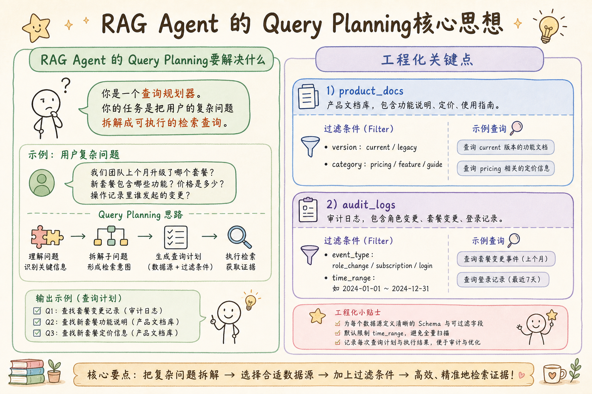
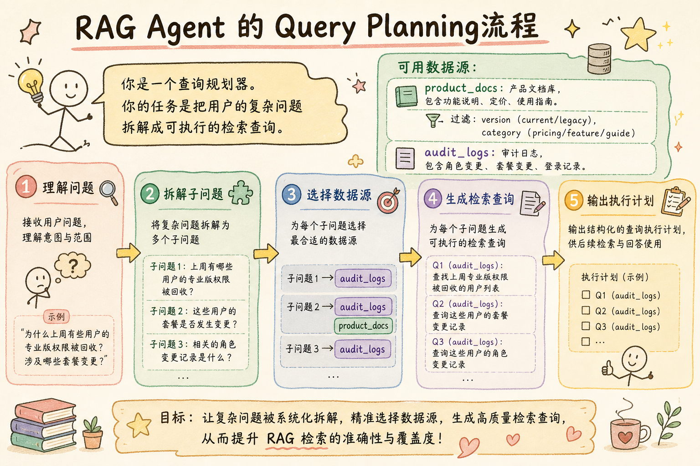
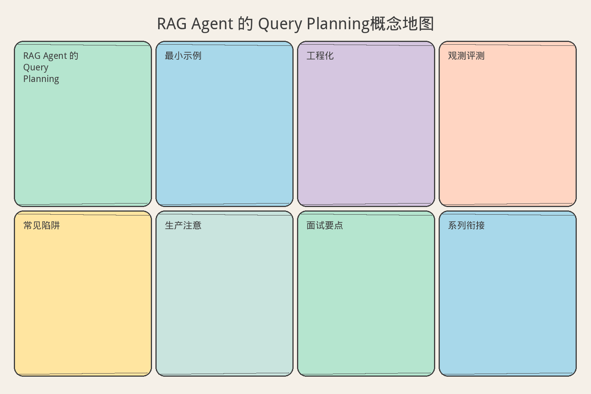

# AI Agent 工程（二十六）：RAG Agent 的 Query Planning

> Query Planning 不是把用户问题改写得更长，而是识别子问题、数据源、过滤条件和证据完成标准。

**阅读建议：** 先阅读 [238 Agentic RAG 架构](238.agentic-rag-architecture-tutorial.md)，理解整体架构中 Query Planning 的位置。


> **系列导读：** [Agent/RAG 工程系列 238–254](../src/posts/ai-ml/agent-rag-series-238-254.md) · [`examples/rag-agent-lab`](../examples/rag-agent-lab/)

**环境要求：**
- Python **3.10+**
- 依赖：`pip install pydantic`

> **博客实践版**（系列链接、动手路径、[examples/rag-agent-lab](../examples/rag-agent-lab/) 可运行代码）：[`239-query-planning-rag-agent.md`](../src/posts/ai-ml/239-query-planning-rag-agent.md)


**档位：** 主线篇（Part 5）
**本文边界：** 前驱篇 [238](238.agentic-rag-architecture-tutorial.md) Query Planning 位。本篇子查询拆解与计划校验。代码 `main.py 239`。接续 [240](240.multi-step-retrieval-agent-tutorial.md)。
**动手路径：** ① 读 Query Planning 直觉 → ② `cd examples/rag-agent-lab && python main.py 239` → ③ 回读 §怎么做

### 核心术语（本篇首次出现）
**Agentic RAG**（自主检索增强）：检索策略由中间证据驱动，非固定管道。
通俗说：侦探根据线索决定下一步查哪里。
**Query Planning**（查询规划）：把复杂问题拆成带数据源、过滤条件与期望证据的多份子查询。
通俗说：像旅行规划师列行程，不是把一句话改写得更长。
**RRF**（Reciprocal Rank Fusion）：多路检索结果按排名倒数加权融合为统一列表。
通俗说：把几份检索榜单合并成一份更稳的总榜。
**Sufficiency Check**（充分性检查）：判断当前证据是否足以回答，不足则继续检索。
通俗说：证据没齐就别急着生成答案。
---

## 目录

本文按照"是什么 → 为什么 → 怎么做"三条主线展开，帮助你从概念到工程完整理解 Query Planning 的设计和实现。

1. [是什么：Query Planning 到底在做什么](#是什么query-planning-到底在做什么)
2. [为什么：不做 Planning 会出什么问题](#为什么不做-planning-会出什么问题)
3. [怎么做：工程实现](#怎么做工程实现)
4. [常见失败模式](#常见失败模式)
5. [什么时候不要这么做](#什么时候不要这么做)
6. [生产环境注意事项](#生产环境注意事项)
7. [如何观测和评测](#如何观测和评测)
8. [和 RAG / 后端 / 前端的关系](#和-rag--后端--前端的关系)
9. [面试怎么讲](#面试怎么讲)
10. [下一步](#下一步)

---

## 你会学到什么

- 理解本篇「是什么/为什么/怎么做」主线。
- 能对照 `examples/rag-agent-lab` 跑通对应 `main.py`。

## 最小示例

**演示什么：** 本节最小可运行切片。**环境：** 见文首。**预期：** 控制台打印 demo 输出。

> 可运行代码见文首「博客实践版」与 lab；下文「怎么做」讲设计。

## 工程化版本

> 见 §怎么做 与博客版综合实战。

## 是什么：Query Planning 到底在做什么


读下图时，先看「RAG Agent 的 Query Planning核心思想」建立直觉。


对照上图：Query Planning 是「旅行规划师」不是「查询改写器」——价值在结构化拆解子问题。
在上一篇中，我们了解了 Agentic RAG 的整体架构——它是一个"决策循环"，而不是"固定管道"。在这个循环中，Query Planning 是第一个环节，也是最关键的环节之一。它决定了"查什么、查哪里、怎么查"——如果这一步做错了，后面的检索、验证和生成都是在错误的基础上进行的。

### 从一个直觉开始

假设你要帮一个朋友准备一次旅行。朋友说："我想去一个好玩的地方。"你会怎么做？

如果你是一个"查询改写器"，你会把这句话改写得更精确："我想去一个有海滩、美食和历史文化的热带旅游城市。"改写之后确实更精确了，但它还是一个单一的需求——你只是把模糊变成了具体。

但如果你是一个"旅行规划师"，你会做完全不同的事情。你会问："你有多少天假期？预算是多少？和谁一起去？喜欢什么类型的活动？"然后你会制定一个行程计划：第一天去海滩，第二天逛博物馆，第三天去美食街。每一天都有明确的目标、地点和预期收获。

Query Planning 做的就是“旅行规划师”的工作，而不是“查询改写器”的工作。它不是把用户的问题“说得更好”，而是把用户的问题“拆成可执行的步骤”。每个步骤都有明确的目标（查什么）、地点（查哪里）和完成标准（期望找到什么）。

这个类比揭示了一个重要的认知：Planning 的价值不在于“让查询更精确”，而在于“让检索有结构”。一个有结构的检索计划，就像一份有结构的行程计划——每一步都知道“去哪里、做什么、期望得到什么”。没有结构的检索，就像没有计划的旅行——你可能到了某个地方，但你不知道是不是你想去的地方。

我想强调一个初学者容易产生的误解：以为 Query Planning 就是“多搜几次”。不是的。“多搜几次”是没有结构的重复，Planning 是有结构的拆解。前者可能搜了 5 次但都是同一个方向（浪费），后者搜 3 次但每次都是不同的子问题（精准覆盖）。区别不在于“搜几次”，而在于“每次搜的是什么”。

这个区别非常重要，因为它决定了你的系统设计思路。如果你以为 Planning 就是“多搜几次”，你可能会设计一个“循环检索”的系统——反复搜索直到找到足够的结果。但这种系统没有“方向感”——它不知道“还缺什么”，只知道“还不够”。正确的 Planning 是“有方向的”——它知道“已经查了什么、还缺什么、下一步查什么”。这种“方向感”是 Planning 的核心价值。

### Query Planning 的定义

有了上面的直觉，我们可以给出一个更精确的定义。Query Planning 是 Agentic RAG 中的第一个决策环节，它接收用户的原始问题，输出一个结构化的"查询计划"。这个计划包含多个子查询，每个子查询指定了检索问题、目标数据源、过滤条件和期望证据。

这里有一个初学者容易混淆的概念：Query Planning 和 Query Rewriting 有什么区别？Query Rewriting（查询改写）是把一个查询变成另一个查询——输入一个，输出一个。它的目标是让查询更精确、更适合向量检索。比如把"那个东西怎么用"改写成"产品 X 的用户操作指南"。Query Planning（查询规划）是把一个问题拆成多个查询——输入一个，输出多个。它的目标是覆盖问题的所有方面。比如把"对比 A 和 B 的定价"拆成"A 的定价是什么"和"B 的定价是什么"两个独立查询。

用一个更直观的类比来理解这个区别。Query Rewriting 像是"把一句话说得更清楚"——你还是只说了一句话，只是说得更好了。Query Planning 像是"列一个清单"——你把一个大任务拆成了多个小任务，每个小任务都有明确的目标。前者改善质量，后者改善覆盖。

### 查询计划的结构

一个完整的查询计划不只是一组搜索词。它是一份结构化的"检索指令"，包含四个关键要素。

第一个要素是检索问题（question）。这是实际发送给向量数据库的查询文本。它应该是一个清晰的、聚焦的问题，而不是用户的原始问题。比如用户问"为什么我的权限变了"，查询计划中的 question 可能是"该客户最近一个月的角色变更记录"——更具体、更适合检索。

第二个要素是目标数据源（source）。不同的问题需要在不同的地方查找。"年假政策"在产品文档里，"角色变更"在审计日志里，"投诉记录"在工单系统里。Query Planning 的一个核心价值就是为每个子问题选择正确的数据源。如果所有查询都打到同一个向量库，很多信息就永远找不到。

第三个要素是过滤条件（filters）。即使选对了数据源，不加过滤条件也可能返回大量不相关的结果。比如查审计日志时，加上 `event_type: "role_change"` 的过滤条件，就能只返回角色变更事件，而不是所有类型的日志。过滤条件是确定性匹配（精确匹配），不是语义匹配——这让它比向量检索更可靠。

第四个要素是期望证据（expected_evidence）。这是最容易被忽略但最重要的要素。它定义了“什么样的结果算找到了”。比如查询“高级报表需要什么套餐”的 expected_evidence 是“套餐与功能映射表”。有了这个标准，后续的 Sufficiency Check 才能判断“找到了没有”。没有 expected_evidence，系统就不知道什么时候该停止检索。

这四个要素之间的关系是这样的：question 决定“搜什么”，source 决定“在哪搜”，filters 决定“怎么筛”，expected_evidence 决定“什么时候停”。缺少任何一个，检索都是“不完整”的。没有 question，不知道搜什么；没有 source，不知道去哪搜；没有 filters，搜到一堆不相关的；没有 expected_evidence，不知道什么时候够。

用一个更直观的类比来理解这四个要素。假设你要去图书馆找资料。question 是“你要找什么主题的书”，source 是“去哪个楼层/区域”，filters 是“只要中文的、只要近 5 年的”，expected_evidence 是“找到一本讲 XX 的书就算完成”。如果你只告诉实习生“去找一本关于高级报表的书”，他可能找回来一本“高级报表设计美学”——完全不是你要的。但如果你说“去三楼产品文档区，找一本包含套餐与功能映射表的书，只要当前版本的”，他就能精确找到你要的。

### 什么时候需要 Planning

并不是所有问题都需要 Query Planning。这是一个重要的认知——Planning 有成本（额外的模型调用、校验步骤、延迟），如果问题很简单，直接检索反而更好。

判断标准是：用户的问题是否包含多个“证据目标”。如果一个问题只需要一条证据就能回答，就不需要 Planning。比如“年假有多少天”——只需要在产品文档中找到年假政策就行了，一个查询足够。但如果一个问题需要多条不同类型的证据，就需要 Planning。比如“对比 A 和 B 的定价”需要两条证据（A 的定价 + B 的定价），“为什么权限变了”需要三条证据（当前权限 + 变更记录 + 套餐规则）。

这个判断本身也可以自动化。在实践中，你可以用一个简单的规则：如果问题中包含“对比”“区别”“和”“与”等连接词，或者包含多个实体名称，就触发 Planning。更高级的做法是用模型判断，但规则优先——规则能覆盖 80% 的情况，而且不增加延迟。

我想强调一个初学者容易犯的错误：过度使用 Planning。有些开发者觉得“Planning 这么强大，所有问题都走 Planning 不就行了？”这是不对的。Planning 的价值在于“解决复杂问题”，而不是“替代简单检索”。对于简单问题，Planning 只会增加延迟和成本，不会改善答案质量。工程的核心是“在正确的地方花正确的成本”。

---

## 为什么：不做 Planning 会出什么问题

理解了 Query Planning 是什么之后，你可能会问："直接搜索不就行了？为什么非要多这一步？"答案是：对于复杂问题，不做 Planning 会导致四个严重的问题。这些问题不是"偶尔发生"，而是"几乎必然发生"——只要用户的问题稍微复杂一点，这些问题就会出现。

### 问题一：覆盖不全

这是最常见的问题。用户的问题包含多个子问题，但单次检索只能覆盖其中一个。比如用户问"客户为什么没有高级报表权限？和上个月相比发生了什么？"这个问题实际上包含三个子问题：当前套餐是否支持高级报表、当前用户角色是否包含权限、上个月套餐或角色是否发生变化。

如果你用原始问题直接搜索，向量数据库会返回和"高级报表权限"语义最接近的文档——大概率是"高级报表功能介绍"。但"角色变更记录"和"套餐变更历史"完全不会被召回，因为它们和"高级报表"的语义距离太远。结果就是：模型只拿到了三分之一的信息，生成的答案必然不完整。

为什么向量数据库不能“理解”这是三个子问题？因为向量检索的工作原理是把整个查询编码成一个向量，然后找最相似的文档。它没有“拆解”能力——它只能做“整体匹配”。一个包含三个子问题的查询，编码成的向量是三个子问题的“平均”，这个“平均”向量可能和任何一个子问题都不太相似。

用一个更直观的类比来理解。假设你去图书馆问管理员：“我想找一本关于北京人口政策、上海人口政策和广州人口政策的对比书。”管理员很可能给你一本《北京人口政策》——因为这本书和“北京”的语义最近。但如果你先拆解问题，分别问“北京的人口政策是什么”“上海的人口政策是什么”“广州的人口政策是什么”，你就能分别找到三本书。Query Planning 做的就是这个“拆解”工作。

这个问题在“对比类”“列举类”“多条件类”问题中特别常见。比如“列出所有支持 SSO 的套餐及其价格”——这个问题需要同时检索“支持 SSO 的套餐”和“各套餐的价格”，一次检索很难同时覆盖。再比如“A 产品和 B 产品在安全性方面有什么区别”——“A 安全性”和“B 安全性”是两个不同的语义方向，一次检索很难同时命中。

### 问题二：数据源错配

很多企业的知识库有多个数据源：产品文档、审计日志、工单系统、客户记录。不同的问题需要在不同的数据源中查找。但如果不做 Planning，所有查询都会打到默认的向量库（通常是产品文档），导致很多信息永远找不到。

比如用户问“我的工单为什么三天了还没人处理”。答案在工单系统里（工单状态、分配记录），不在产品文档里。但如果系统只查产品文档，它可能找到“工单提交指南”——这完全不是用户要的。Planning 的价值在于：它能识别出“这个问题需要查工单系统”，然后生成一个指向正确数据源的查询。

这个问题在实际场景中非常常见。企业知识库通常有多个数据源，每个数据源存储不同类型的信息。产品文档存储“规则和指南”，审计日志存储“操作记录”，工单系统存储“服务请求”。如果系统不知道“什么问题查什么数据源”，它就会“一锅端”——所有查询都打到同一个地方，结果就是“找到的不是要的，要的找不到”。

### 问题三：无法判断"够不够"

没有 Planning，就没有 expected_evidence。没有 expected_evidence，Sufficiency Check 就无法工作。系统不知道"什么样的结果算找到了"，也就不知道"什么时候该停止检索"。这会导致两种极端：要么检索一次就停（证据不够），要么无限检索（不知道什么时候够）。

举个例子。如果查询是“高级报表”，找到 10 条结果后，系统怎么知道“够了”？它不知道。因为“高级报表”太模糊了——找到功能介绍算够吗？找到定价信息算够吗？找到使用教程算够吗？但如果 expected_evidence 是“套餐与功能映射表”，系统就知道：找到映射表 = 够了，没找到 = 需要继续。

这个问题在实际场景中会导致两种极端行为。第一种是“过早停止”：系统检索了一次，找到了一些结果，就直接生成答案。结果答案不完整，因为还有很多方面没有覆盖。第二种是“过度检索”：系统不知道什么时候够，就一直检索，直到达到某个硬性上限（比如 10 次）。这浪费了时间和资源，而且不一定比“精准检索 3 次”效果好。

expected_evidence 的价值在于：它给系统提供了一个“明确的完成标准”。不是“找到一些东西就行”，而是“找到这个具体的东西才算完成”。这种“明确性”是整个决策循环能够正常运转的基础。没有它，系统就像“无头苍蝇”——不知道什么时候该停。

### 问题四：浪费预算

没有 Planning 的另一个问题是“同义重复”。如果系统试图通过“多搜几次”来弥补覆盖不全，它很可能生成多个语义相同的查询。比如“高级报表需要什么套餐”“高级报表的套餐要求是什么”“什么套餐能用高级报表”——这三个查询问的是同一件事，浪费了三次检索预算。Planning 通过去重检查避免这种浪费。

### 这四个问题的根源

回顾上面四个问题，你会发现它们有一个共同的根源：普通 RAG 没有“规划”能力。它不知道“这个问题需要查什么”，所以覆盖不全；它不知道“应该查哪里”，所以数据源错配；它不知道“查到什么算够”，所以无法停止；它不知道“已经查过什么”，所以同义重复。Query Planning 解决的正是这个根源问题——它给系统加上了“规划”能力，让系统知道“要做什么、在哪里做、做到什么程度”。

用一个更直观的类比来总结。普通 RAG 像一个没有经验的实习生，你给他一个任务，他直接开始做，不管三七二十一。Query Planning 像一个有经验的项目经理，他先拆解任务、分配资源、定义完成标准，然后再执行。前者“快但乱”，后者“慢但稳”。在生产环境中，“稳”比“快”重要得多。

我想用一个具体的场景来说明这个区别。假设用户问：“为什么我的高级报表权限没了？”

普通 RAG 的处理：把这个问题直接丢给向量数据库，检索一次，取回 top-5 结果。结果可能是 5 篇“高级报表功能介绍”——完全不是用户要的。模型基于这些不相关的结果生成答案，要么是幻觉，要么是答非所问。

Query Planning 的处理：先拆解问题——“为什么权限没了”需要三类证据：当前权限状态、最近变更记录、套餐规则。然后分别检索：查审计日志获取当前权限，查审计日志加 event_type 过滤获取变更记录，查产品文档获取套餐规则。三类证据都找到后，生成一个有根据的答案：“您的角色在 7 月 15 日从 admin 变更为 viewer，导致高级报表权限被移除。”

区别一目了然：普通 RAG “碰运气”，Query Planning “有策略”。在生产环境中，你不能让用户的答案质量取决于“运气”。

---

## 怎么做：工程实现
### 本节术语速查

| 术语 | 通俗说 |
|------|--------|
| Query Planning | 输出多份子查询计划，每份含数据源与 filters |
| expected_evidence | 定义「什么叫找到了」，供充分性判断 |
| RRF | 多路检索结果按排名融合 |

读下图时，看 Query Planning 五步：理解问题→拆子问题→选数据源→生成检索查询→输出执行计划。



对照上图：每个子问题都要绑定数据源与过滤条件；计划输出的是可执行检索指令，不是改写后的单句。


现在我们已经理解了 Query Planning 是什么、为什么需要它，接下来进入工程实现环节。我会按照数据流的顺序，依次实现查询结构、计划校验、数据源注册、预算控制和决策路由。

### 查询结构：不只是搜索词

让我们从最基础的数据结构开始。一条检索查询不只是一个搜索词——它是一份完整的"检索指令"，包含搜什么、在哪搜、怎么过滤和期望找到什么。

```python
from pydantic import BaseModel, Field
from typing import Literal


class RetrievalQuery(BaseModel):
    """
    一条检索查询。

    不只是"搜索词"，而是完整的检索指令：
    - 搜什么（question）
    - 在哪搜（source）
    - 怎么过滤（filters）
    - 期望找到什么（expected_evidence）

    为什么需要 query_id？
    因为后续的 Evidence 需要记录"我是哪次查询产生的"。
    当 Bad Case 发生时，你可以通过 query_id 追溯到
    "这条证据是哪个查询找到的"，进而判断"查询本身有没有问题"。
    """
    query_id: str  # 唯一标识，用于追踪
    question: str = Field(min_length=3, max_length=200)  # 检索问题
    source: Literal["product_docs", "audit_logs", "tickets"]  # 数据源
    filters: dict = Field(default_factory=dict)  # 元数据过滤
    expected_evidence: str  # 期望的证据类型（完成标准）


class QueryPlan(BaseModel):
    """
    查询计划：一组子查询的集合。

    限制最多 5 条（预算控制）。
    至少 1 条（不能什么都不查）。

    为什么限制最多 5 条？
    因为每条查询都有成本（模型调用 + 向量检索 + 网络延迟）。
    如果允许无限拆分，一个复杂问题可能生成 20 个查询，
    导致延迟爆炸和成本失控。5 条是经验和成本的平衡点。
    """
    queries: list[RetrievalQuery] = Field(min_length=1, max_length=5)
```

这个数据结构的设计有几个值得注意的决策。第一，`source` 使用了 `Literal` 类型而不是 `str`。这意味着模型只能从预定义的数据源中选择，不能凭空生成一个不存在的数据源。这是一个"约束即安全"的设计——通过类型系统限制模型的行为空间。

第二，`expected_evidence` 是必填字段。这不是可选的"锦上添花"，而是整个流程能否正常运转的关键。没有它，Sufficiency Check 就无法判断"找到了没有"，整个决策循环就失去了停止条件。

第三，`filters` 是一个字典而不是固定字段。这是因为不同数据源有不同的过滤维度——产品文档有 `version` 和 `category`，审计日志有 `event_type` 和 `time_range`。用字典可以灵活适配不同数据源的过滤需求。

### Planner 的 prompt 设计

在实际生产中，Planner 的 system prompt 是整个系统的“灵魂”。它决定了模型如何拆解问题、如何选择数据源、如何生成过滤条件。一个好的 prompt 应该包含四个部分。

第一部分是角色定义。告诉模型“你是一个查询规划器，你的任务是把用户的复杂问题拆解成可执行的检索查询”。这看似简单，但它设定了模型的行为边界——它是“规划器”，不是“回答器”。它不应该试图回答问题，而应该生成查询计划。

第二部分是数据源菜单。列出所有可用数据源及其描述。比如：“product_docs：产品文档库，包含功能说明、定价、使用指南。支持过滤：version (current/legacy), category (pricing/feature/guide)”。这是模型做决策的核心依据——没有它，模型就不知道“可以查哪里”。

第三部分是生成规则。告诉模型“每个查询必须包含 question、source、filters 和 expected_evidence”“最多生成 5 条查询”“不要生成重复查询”“如果缺少必要输入，返回 need_user_input”。这些规则是“硬约束”——模型必须遵守。

第四部分是示例。给模型一个完整的输入输出示例，让它知道“正确的输出长什么样”。示例比规则更有效——模型可能忽略规则，但很难忽略示例。

这个 prompt 应该被版本化管理。每次修改都记录“改了什么、为什么改”。当 Bad Case 发生时，你需要知道“当时的 prompt 是什么版本”，才能判断是 prompt 的问题还是模型的问题。

这里给你一个简化版的 Planner prompt 示例，帮助你理解“一个好的 prompt 长什么样”：

```text
你是一个查询规划器。你的任务是把用户的复杂问题拆解成可执行的检索查询。

可用数据源：
- product_docs: 产品文档库，包含功能说明、定价、使用指南。
  过滤: version (current/legacy), category (pricing/feature/guide)
- audit_logs: 审计日志，包含角色变更、套餐变更、登录记录。
  过滤: event_type (role_change/subscription/login), time_range
- tickets: 工单系统，包含客户投诉、技术支持请求。
  过滤: status (open/closed/pending)

规则：
1. 每个查询必须包含 question, source, filters, expected_evidence
2. 最多生成 5 条查询
3. 不要生成重复查询
4. 如果缺少 customer_id，返回 need_user_input

示例：
输入: "为什么我的高级报表权限没了？"
输出: [
  {"question": "高级报表需要什么套餐", "source": "product_docs",
   "filters": {"version": "current"}, "expected_evidence": "套餐与功能映射"},
  {"question": "客户角色最近如何变化", "source": "audit_logs",
   "filters": {"event_type": "role_change"}, "expected_evidence": "角色变更事件"}
]
```

这个 prompt 虽然简化，但包含了所有核心要素：角色定义、数据源菜单、生成规则和示例。在实际生产中，你会根据业务需求进一步细化每个部分。

### 数据源注册表：Planner 的"菜单"

Planner 不能凭空生成数据源名称。它只能从"已注册"的数据源中选择。这个注册表由后端维护，包含了每个数据源的描述和过滤条件 schema。

```python
# 数据源注册表（由后端维护）
REGISTERED_SOURCES = {
    "product_docs": {
        "description": "产品文档库：包含功能说明、定价、使用指南",
        "filters_schema": {
            "version": {"type": "string", "values": ["current", "legacy"]},
            "category": {"type": "string", "values": ["pricing", "feature", "guide"]},
        },
    },
    "audit_logs": {
        "description": "审计日志：包含角色变更、套餐变更、登录记录",
        "filters_schema": {
            "event_type": {"type": "string", "values": ["role_change", "subscription", "login"]},
            "time_range": {"type": "date_range"},
        },
    },
    "tickets": {
        "description": "工单系统：包含客户投诉、技术支持请求",
        "filters_schema": {
            "status": {"type": "string", "values": ["open", "closed", "pending"]},
        },
    },
}
```

为什么不让模型自由生成 source？因为模型可能生成不存在的数据源（比如 `customer_database`），或者生成存在但用户无权访问的数据源（比如 `admin_secrets`）。通过枚举约束，后端可以确保所有查询都指向合法的、用户有权访问的数据源。

这个注册表还有一个重要的作用：它是 Planner 的“菜单”。在 Planner 的 system prompt 中，你会列出所有可用数据源及其描述。模型看到“审计日志：包含角色变更、套餐变更、登录记录”后，就知道“权限变了”这个问题应该查审计日志，而不是产品文档。没有这个菜单，模型就只能猜——而猜错的概率很高。

这里有一个初学者容易忽略的设计细节：数据源的描述文本非常重要。它不是“随便写写”的注释，而是模型做决策的核心依据。模型看到“审计日志：包含角色变更、套餐变更、登录记录”后，就能判断“权限变了”应该查这里。但如果描述写得太模糊（比如只写“日志”），模型就无法判断该不该用这个数据源。所以，数据源描述应该包含“这个数据源里有什么类型的数据”，而不是只写一个名字。

另一个值得注意的设计是：注册表由后端维护，不是由模型维护。这意味着新增数据源时，你需要在后端注册它（加上描述和 filter schema），然后 Planner 才能使用它。这个设计的好处是：数据源的增删改有明确的控制点，不会出现“模型突然开始用一个不存在的数据源”的情况。

### 计划校验：防止无效查询

生成查询计划后，不能直接执行——必须先校验。校验的目的是拦截三类问题：重复查询、无效数据源和无效过滤条件。

```python
def validate_query_plan(plan: QueryPlan) -> None:
    """
    校验查询计划的合法性。

    检查项：
    1. 去重：不允许同义查询（浪费预算）
    2. 数据源合法：必须是已注册的
    3. 过滤器合法：字段和值必须在 schema 中
    4. 预算：不超过最大查询数

    为什么校验在执行之前而不是之后？
    因为执行有成本（网络调用、向量检索）。
    如果执行完才发现查询无效，成本已经花了。
    校验是"零成本拦截"——在花钱之前先检查。
    """
    fingerprints: set[tuple[str, str]] = set()

    for query in plan.queries:
        # 去重检查：(source, normalized_question) 不能重复
        key = (query.source, normalize(query.question))
        if key in fingerprints:
            raise ValueError(f"duplicate_query: {query.question}")
        fingerprints.add(key)

        # 数据源合法性
        if query.source not in REGISTERED_SOURCES:
            raise ValueError(f"unknown_source: {query.source}")

        # 过滤器合法性
        validate_filters(query.source, query.filters)


def normalize(text: str) -> str:
    """
    标准化查询文本（用于去重比较）。

    去除标点、统一小写、去除停用词。
    "高级报表需要什么套餐？" 和 "高级报表需要什么套餐" 视为相同。

    为什么需要 normalize？
    因为模型可能生成语义相同但措辞不同的查询：
    "高级报表需要什么套餐" vs "什么套餐能用高级报表"
    这两个问的是同一件事，不应该占用两次预算。
    """
    import re
    text = text.lower().strip()
    text = re.sub(r'[^\w\s]', '', text)
    return text


def validate_filters(source: str, filters: dict) -> None:
    """
    检查过滤器字段和值是否在 schema 中。

    为什么需要这个校验？
    因为模型可能生成不存在的过滤字段：
    filters={"department": "engineering"}
    但 product_docs 根本没有 department 字段。
    如果不校验，这个过滤条件要么被忽略（返回不相关结果），
    要么导致检索报错（中断整个流程）。
    """
    schema = REGISTERED_SOURCES[source]["filters_schema"]
    for key, value in filters.items():
        if key not in schema:
            raise ValueError(f"invalid_filter_key: {key} for {source}")
        if "values" in schema[key] and value not in schema[key]["values"]:
            raise ValueError(f"invalid_filter_value: {value} for {key}")
```

校验逻辑的设计有一个重要的原则：“快速失败”。如果计划中有任何一条查询不合法，整个计划就被拒绝，而不是“跳过不合法的，执行合法的”。为什么？因为部分执行会导致“不完整的证据”——你以为查了 3 个方面，实际上只查了 2 个，生成的答案必然不完整。与其“不完整”，不如“全部拒绝，重新规划”。

另一个值得注意的设计是：校验是“确定性”的，不是“概率性”的。它不依赖模型判断“这个查询合不合理”，而是用硬规则检查“这个查询在不在允许范围内”。确定性校验的好处是：结果可预测、可重现、可审计。你不会遇到“有时候通过有时候不通过”的诡异情况。

### 先识别缺失输入：不要猜

Query Planning 有一个容易被忽略但极其重要的职责：识别缺失的必要输入。如果用户的问题缺少关键标识（比如 customer_id），Planner 不应该试图通过语义检索"猜到"客户是谁，而应该返回一个澄清请求，让前端去问用户。

```python
def plan_or_clarify(user_question: str, context: dict) -> QueryPlan | dict:
    """
    生成查询计划，或者请求补充信息。

    关键原则：
    - 如果缺少关键标识（如 customer_id），不要猜
    - 返回澄清请求，让前端问用户

    为什么不能猜？
    "张三的权限为什么变了？"
    → 系统里有 50 个张三
    → 语义检索可能找到错误的张三
    → 给出错误答案（隐私事故！）

    这不是"体验不好"的问题，而是"安全事故"的问题。
    返回错误用户的数据 = 数据泄露。
    """
    # 检查必要输入
    required = extract_required_inputs(user_question)
    missing = [r for r in required if r not in context]

    if missing:
        return {
            "action": "need_user_input",
            "missing": missing,
            "clarification": f"请提供以下信息：{', '.join(missing)}",
        }

    # 输入完整，生成查询计划
    return generate_query_plan(user_question, context)
```

为什么“不要猜”这么重要？因为在企业场景中，猜错的成本极高。如果系统把“张三”匹配到了“张三远”，然后返回了张三远的套餐信息和角色变更记录，这不仅是一个错误答案——它是一个隐私事故。用户 A 看到了用户 B 的数据。在法律上，这可能违反数据保护法规。所以，宁可多问一句“请提供客户 ID”，也不能冒险猜测。

这个设计决策背后有一个更深层的原则：在涉及用户数据的系统中，“精确”比“便利”重要。用户可能觉得“多问一句”很麻烦，但如果系统“猜错了”返回了别人的数据，后果比“多问一句”严重得多。这是安全系统的基本思维：宁可误报（多问一次），不可漏报（泄露一次）。

在实践中，如何判断“哪些输入是必要的”？通常，任何涉及特定用户数据的查询都需要精确标识。比如“我的套餐是什么”需要 customer_id，“我的工单状态”需要 ticket_id。但“年假政策是什么”不需要任何标识——因为它不涉及特定用户的数据。这个判断可以用规则实现：如果问题中包含“我的”“该客户”“某个用户”等指代词，就检查是否有对应的 ID。

### 查询预算：防止无限拆分

Query Planning 的另一个关键约束是预算。没有预算限制，一个复杂问题可能被拆成 20 个子查询，导致延迟爆炸和成本失控。

```python
BUDGET = {
    "max_queries": 5,           # 最多 5 个子查询
    "max_per_source": 2,        # 每个 source 最多 2 次
    "max_total_top_k": 30,      # 总 top_k 不超过 30
    "max_retrieval_time_seconds": 5,  # 总检索时间不超过 5 秒
}


def check_budget(plan: QueryPlan) -> None:
    """
    检查计划是否在预算内。

    为什么需要 max_per_source？
    防止对同一数据源反复搜索。如果 5 个查询都指向 product_docs，
    说明 Planner 没有正确识别数据源，或者在"同义重复"。
    """
    if len(plan.queries) > BUDGET["max_queries"]:
        raise ValueError(f"too_many_queries: {len(plan.queries)}")

    source_counts = {}
    for q in plan.queries:
        source_counts[q.source] = source_counts.get(q.source, 0) + 1
        if source_counts[q.source] > BUDGET["max_per_source"]:
            raise ValueError(f"source_overuse: {q.source}")
```

预算不是“惩罚”，而是“保护”。它保护系统不被无限循环拖垮，也保护用户不被过长的等待时间折磨。在实践中，5 个子查询足以覆盖绝大多数复杂问题。如果你发现经常需要超过 5 个查询，那问题可能不在 Planning，而在于问题本身太复杂——这时候应该考虑让用户缩小问题范围。

预算的设计还有一个重要的细节：它是“硬性约束”，不是“软性建议”。这意味着即使 Planner 觉得“还需要再查一次”，如果已经达到预算上限，系统也会强制停止。为什么不能“灵活一点”？因为“灵活”意味着“可能被突破”——如果模型可以“请求额外预算”，它就可能无限请求，预算就形同虚设。硬性约束的价值在于：它给了系统一个“绝对不会超过”的上限。

在实践中，预算参数需要根据业务场景调整。如果你的用户问题大多比较简单，可以把 max_queries 调低到 3。如果你的用户问题非常复杂（比如“对比所有套餐的所有功能”），可以把 max_queries 调高到 8。但无论如何调整，都必须有一个上限——“无上限”等于“没有预算”。

### 决策路由：不是所有问题都需要 Planning

在实际系统中，不是所有用户问题都需要走 Query Planning。有些问题可以直接回答（打招呼、简单计算），有些问题需要澄清（缺少必要输入），只有真正需要检索的复杂问题才走 Planning。

```python
def route_question(question: str, context: dict) -> str:
    """
    判断用户问题应该怎么处理。

    三种路由：
    1. direct_answer: 不需要检索（如打招呼、简单计算）
    2. retrieve: 需要检索（单步或多步）
    3. clarify: 信息不足，需要问用户

    为什么规则优先而不是模型判断？
    因为规则是确定性的、零延迟的、零成本的。
    "你好" 不需要调用模型来判断"这是打招呼"。
    只有规则无法覆盖的情况才交给模型。
    """
    # 规则优先（不用模型判断）
    if is_greeting(question):
        return "direct_answer"

    if is_math(question):
        return "direct_answer"

    # 检查必要输入
    if has_missing_inputs(question, context):
        return "clarify"

    # 需要检索
    return "retrieve"
```

这个路由逻辑看似简单，但它体现了一个重要的工程原则：“能用规则解决的不用模型”。规则是确定性的——“你好”永远是打招呼，“1+1等于几”永远是数学题。用模型判断这些简单情况不仅浪费成本，还引入了不确定性（模型可能把“你好”判断为“需要检索”）。

在实践中，路由规则可以很简单，也可以很复杂。最简单的版本是关键词匹配：如果问题包含“你好”“谢谢”“再见”，就是打招呼；如果包含数字和运算符，就是数学题。更复杂的版本可以用正则表达式或简单的分类器。但核心原则不变：规则能覆盖的，不用模型；规则覆盖不了的，才交给模型。

这个路由逻辑还有一个重要的设计决策：它在 Planning 之前执行。这意味着“打招呼”和“数学题”根本不会进入 Planning 流程——它们被“拦截”了。这比“先 Planning 再判断”更高效，因为 Planning 本身有成本（模型调用）。能在 Planning 之前拦截的，就不要进入 Planning。

### 怎么做的小结

让我们回顾一下“怎么做”部分的五个核心组件。第一，查询结构（RetrievalQuery）定义了“一条查询是什么”——不只是搜索词，而是包含数据源、过滤条件和期望证据的完整指令。第二，数据源注册表（REGISTERED_SOURCES）定义了“可以查哪里”——模型只能从这里选择。第三，计划校验（validate_query_plan）确保“计划合法”——去重、数据源合法、过滤器合法。第四，预算控制（check_budget）确保“不超支”——最多 5 条查询，每个数据源最多 2 次。第五，决策路由（route_question）确保“该不该查”——不是所有问题都需要检索。

这五个组件的顺序很重要：先路由（判断要不要查）→ 再生成计划（拆子问题）→ 再校验（检查合法性）→ 再检查预算（检查资源）→ 最后执行。每一步都是“拦截器”——拦截不合理的请求，只让合理的请求通过。这种“多层拦截”的设计是生产系统的基本安全模式。

---

## 常见失败模式

理解了正确做法之后，让我们看看实际开发中最常犯的错误。这些失败模式每一个都会导致答案质量下降或资源浪费。理解它们的价值不仅在于“避免犯错”，更在于理解“为什么正确做法是那样的”——很多设计决策正是为了避免这些失败而做出的。

我建议你在阅读这些失败模式时，不要只是“记住不要这样做”，而是思考“为什么开发者会犯这个错误”。大多数失败模式的根源不是“开发者不知道正确做法”，而是“正确做法在短期内看起来更复杂、更慢、更贵”。比如，“不保存 query_id”看起来节省了存储空间，但出问题时你就无法追溯。“不做引用验证”看起来减少了延迟，但幻觉就溜进了答案。理解这些权衡能帮你在面对“要不要省这一步”的决策时做出正确选择。

### 把同义 query 当成不同子问题

这是最常见的错误。模型生成了三个查询，看起来措辞不同，但问的是同一件事。比如“高级报表需要什么套餐”“高级报表的套餐要求是什么”“什么套餐能用高级报表”——这三个查询问的是完全相同的事情，浪费了三次检索预算。修复方法是对查询文本做 normalize 后去重。

为什么模型会犯这个错误？因为模型的语言能力让它能够“用不同的方式说同一件事”，但它没有“去重”意识。它觉得“高级报表需要什么套餐”和“什么套餐能用高级报表”是两个不同的查询——因为措辞不同。但从检索的角度，它们会返回相同的结果。这就是为什么我们需要 normalize + 去重——用确定性代码弥补模型的“不自觉”。

### Planner 生成无效 metadata filter

模型可能生成不存在的过滤字段。比如给 product_docs 加上 `department: "engineering"` 的过滤条件——但 product_docs 根本没有 department 字段。如果不校验，这个过滤条件要么被忽略（返回不相关结果），要么导致检索报错。修复方法是后端强制校验所有过滤条件。

这个失败模式的根源是：模型不知道“每个数据源支持什么过滤条件”。它可能从训练数据中“学到”了 department 这个字段，但你的 product_docs 根本没有这个字段。这就是为什么 filter schema 必须由后端提供，而不是由模型“自由发挥”。模型的“创造力”在这里是危险的——它可能“创造”出不存在的字段。

### 所有查询都打到同一个向量库

模型可能不知道有其他数据源可用。如果 Planner 的 system prompt 中没有列出所有数据源，模型就只能用它“知道”的那个——通常是产品文档。结果就是：用户问“权限为什么变了”，所有查询都打到产品文档，永远找不到审计日志中的变更记录。修复方法是在 Planner 的 prompt 中明确列出所有可用数据源及其描述。

这个失败模式特别隐蔽，因为它“看起来正常工作”——查询确实执行了，结果确实返回了，答案确实生成了。但答案是错的，因为“查的地方不对”。这种“静默失败”比“报错”更危险——报错至少知道出了问题，静默失败让你以为“一切正常”。

### 没有 expected_evidence，无法判断是否完成

如果查询只有“高级报表”两个字，没有 expected_evidence，Sufficiency Check 就无法工作。系统不知道“找到什么算够了”，也就不知道什么时候该停止。修复方法是强制要求每个查询都有 expected_evidence。

这个失败模式的根源是：开发者觉得 expected_evidence “太麻烦”“没必要”。他们觉得“搜到结果就行了，还要定义‘什么算找到了’？”但问题是：如果不定义“什么算找到了”，系统就不知道“什么时候停”。这就像让实习生“去查一下高级报表的资料”，但不告诉他“查到什么算完成”。他可能查了一条就回来（不够），也可能查了一整天还在查（不知道什么时候停）。

### 缺 customer_id 时用相似名称猜测

用户说“李明的套餐是什么”，系统里有 50 个李明。如果 Planner 试图通过语义检索“找到”正确的李明，它很可能找到错误的人。修复方法是：缺少关键标识时，返回澄清请求，让用户提供精确的 ID。

这个失败模式的后果特别严重，因为它不只是“答案错了”，而是“隐私事故”。如果系统把“李明”匹配到了“李明远”，然后返回了李明远的套餐信息和角色变更记录，用户 A 就看到了用户 B 的数据。这在法律上可能违反数据保护法规。所以，“不要猜”不是“体验建议”，而是“安全红线”。

### 查询计划包含写操作

模型可能生成“修改套餐”“更新角色”这样的操作。但 Query Planning 只能生成只读检索——它不负责“做事”，只负责“查信息”。写操作属于另一个模块（Tool-Augmented RAG），有独立的权限和审批流程。修复方法是后端校验：只允许 retrieve 动作。

这个失败模式的根源是：模型没有“职责边界”意识。它觉得“用户问为什么权限变了，那我就帮他改回来”。但这是危险的——写操作需要权限检查、审批流程、审计日志，这些都不是 Query Planning 能处理的。所以，后端必须强制检查：计划中只能包含 retrieve 动作，任何写操作都会被拒绝。

### 这些失败模式的共同根源

回顾上面六个失败模式，你会发现它们有一个共同的根源：过度信任模型的输出。模型可能生成重复查询、无效数据源、无效过滤条件、缺少 expected_evidence、猜测用户身份、包含写操作——这些都是“模型不可控”的表现。正确的做法是：模型生成计划，后端校验计划，只有通过校验的计划才能执行。这种“模型提议 + 后端强制”的模式是整个 Agentic RAG 的核心安全机制。

用一个类比来理解。模型像一个实习生，它可以提出建议，但不能直接执行。后端像一个主管，它审核实习生的建议，只批准合理的部分。实习生可能提出“我们去客户数据库里查一下”——但这个数据库不存在，或者你没有权限。主管会说“不行，只能用这三个数据源”。这种“提议 + 审核”的分工是生产系统的基本安全模式。

---

## 什么时候不要这么做

### 问题单一、已知数据源时直接检索

如果用户问"年假政策是什么"，答案一定在产品文档里，一个查询就够了。这时候走 Planning 是过度工程——额外的模型调用和校验步骤增加了延迟和成本，但没有带来任何收益。判断标准很简单：如果问题只有一个证据目标，且数据源明确，就直接检索。

### 用户输入缺失时优先澄清

如果缺少 customer_id，不要生成更多查询试图"找到"客户。直接问用户。生成 5 个查询来"搜索"一个没有 ID 的客户，不仅浪费预算，还有隐私风险（可能找到错误的人）。

### 数据源无法提供目标证据时不要反复改写

如果审计日志里根本没有套餐变更记录，不管你怎么改写查询都找不到。这时候正确的做法是告知用户“该数据源不包含套餐变更历史”，而不是让 Planner 反复改写查询重试 5 次。

### 实时性要求极高时不要 Planning

如果用户在一个实时聊天场景中，期望 200ms 内得到响应，Planning 的 500ms-2s 延迟就不可接受了。这种情况下，用预计算的“问题模板 → 查询模板”映射来替代实时 Planning。用户的问题匹配到模板后，直接套用预计算的查询计划，跳过模型调用。这样延迟可以控制在 50ms 以内。代价是覆盖率降低（只能处理模板覆盖的问题类型），但对于高频问题（占 80% 流量），模板就足够了。

这个“不要”背后的原则是：Planning 的价值和延迟之间有权衡。如果延迟预算充足（比如用户可以等 3 秒），Planning 的价值很大。如果延迟预算紧张（比如用户只能等 500ms），Planning 就需要被简化或跳过。工程的核心不是“用最好的技术”，而是“在约束内做最优的选择”。

### 这个“不要”背后的思维模式

上面三个“不要”背后有一个共同的思维模式：不要试图用“更多努力”来解决“方向错误”的问题。如果问题简单，更多努力（Planning）是浪费。如果缺少输入，更多努力（搜索）是危险。如果数据源没有目标数据，更多努力（改写）是徒劳。工程的核心不是“做得更多”，而是“做得正确”。

用一个类比来理解。如果你要去北京，但买了一张去上海的票，“更努力地找”不会帮你到北京——你需要的是“换一张票”。同样，如果数据源里没有你要的信息，“更努力地搜”不会帮你找到——你需要的是“告诉用户没有”。这种“知道什么时候该停”的判断力，是工程师和“只会写代码的人”的核心区别。

还有一个常见的“不要”场景：当用户的问题已经足够具体时，不要拆解。比如用户问“客户 C-001 在 2024 年 3 月 15 日的角色变更记录”，这个问题已经包含了所有必要的信息（谁、什么时间、什么事件），不需要拆解，直接构造一个精确查询就行。Planning 的价值在于“把模糊变清晰”，如果用户已经说得很清晰了，Planning 就是多余的。

最后一个“不要”：不要在 Planning 阶段做答案生成。有些开发者会让 Planner 在拆解问题的同时“顺便回答”用户的问题。这是职责混乱。Planner 的职责是“规划检索”，不是“生成答案”。如果 Planner 开始生成答案，它就没有动力去生成高质量的查询计划了——因为它觉得“我已经回答了，不需要查了”。保持职责分离：Planner 只规划，Retriever 只检索，Generator 只生成。

---

## 生产环境注意事项

在生产环境中运行 Query Planning 时，有几个额外的工程问题需要处理。

首先是数据源权限。不是所有用户都能访问所有数据源。普通用户可能只能查产品文档，不能查审计日志。Planner 生成计划后，后端需要根据用户权限过滤掉无权访问的数据源。这个过滤不能放在 Planner 里（模型不可信），必须在后端强制执行。

其次是计划版本追踪。每次生成的查询计划应该记录 `planner_version`——是哪个版本的 Planner 生成的。当 Bad Case 发生时，你需要知道"这个计划是用什么逻辑生成的"，才能判断是 Planner 的问题还是检索的问题。

第三是日期和 ID 的确定性过滤。对于日期范围、租户 ID 和资源 ID，应该使用确定性过滤（精确匹配），而不是语义匹配。语义匹配可能把"2024年1月"匹配到"2024年2月"——差一个月，但完全不是用户要的。确定性过滤不会有这个问题。

第四是计划变更追踪。如果 Planner 第一次生成了 3 条查询，后来因为证据不足又生成了第 4 条，这个“变更”应该被记录。为什么从 3 条变成 4 条？是因为第一轮检索没找到？还是因为 Sufficiency Check 判断不够？这些信息对 Bad Case 分析极有价值。

第五是 Planner 的 prompt 管理。Planner 的 system prompt 包含了数据源描述、filter schema 和生成规则。这个 prompt 应该被版本化管理——每次修改都记录“改了什么、为什么改”。当 Bad Case 发生时，你需要知道“当时的 prompt 是什么版本”，才能判断是 prompt 的问题还是模型的问题。在实践中，我建议把 prompt 版本号和计划一起保存，这样任何时候都能回溯“这个计划是用什么 prompt 生成的”。

第六是多租户场景下的数据源隔离。如果你的系统服务多个租户（客户），每个租户可能有不同的数据源。租户 A 可能有“产品文档 + 审计日志”，租户 B 可能有“产品文档 + 工单系统”。Planner 的“菜单”应该根据租户动态生成——只列出该租户有权访问的数据源。这不仅是安全问题，也是体验问题——如果 Planner 生成了一个指向租户无权访问的数据源的查询，用户会看到“无权访问”的错误，体验很差。

---

## 如何观测和评测

Query Planning 的评测不能只看"最终答案对不对"——答案错了可能是检索的问题、生成的问题，不一定是 Planning 的问题。你需要单独评测 Planning 的质量。

核心指标包括：子问题覆盖率（用户问题的每个方面是否都有对应查询，健康值 > 90%）、无效数据源率（生成的 source 不在注册表中的比例，健康值 < 5%）、重复查询率（normalize 后重复的查询比例，健康值 < 10%）、filter 合法率（过滤器通过校验的比例，健康值 > 95%）、单任务平均查询数（平均生成几条查询，健康值 2-3 条）。

Bad Case Debugging 时，应该按照“Planning → Retrieval → Generation”的顺序排查。先看查询计划是否正确覆盖了所有子问题，再看检索是否找到了正确的证据，最后看生成是否正确使用了证据。如果 Planning 就错了（比如漏掉了一个子问题），后面的步骤做得再好也没用。

这里我想强调一个初学者容易犯的错误：只看最终答案，不看中间过程。如果答案错了，你的第一反应不应该是“模型生成得不好”，而应该是“查询计划对不对”。很多时候，答案错误的根源不在生成，而在 Planning——查询没覆盖到、数据源选错了、过滤条件不对。如果你跳过 Planning 直接调生成，你永远找不到真正的问题。

在实际操作中，我建议你建立一个“Planning 质量看板”，展示以下信息：每天的平均查询数、重复查询率、无效数据源率、filter 校验失败率。如果某天重复查询率突然从 5% 跳到 30%，说明 Planner 的 prompt 可能被改坏了，或者模型版本升级后行为变了。这种监控能帮你在用户投诉之前就发现问题。

另外，我建议你定期做“Planning 审计”：随机抽取 100 个查询计划，人工检查它们的质量。检查项包括：子问题是否完整覆盖、数据源是否选择正确、过滤条件是否合理、expected_evidence 是否明确。这种人工审计能发现自动指标发现不了的问题——比如“查询计划看起来合法，但实际上没有意义”。

最后，不要忽略“延迟分布”。如果某个查询的 Planning 时间突然从 200ms 变成 2s，可能是模型服务出了问题，或者 prompt 变得太长了。延迟异常往往是问题的早期信号。

---

## 和 RAG / 后端 / 前端的关系

Query Planning 不是孤立存在的，它和系统的其他部分有明确的交互边界。

RAG 层提供数据源能力和 filter schema——这是 Planner 的"菜单"。没有这个菜单，Planner 就不知道有哪些数据源可用、每个数据源支持什么过滤条件。RAG 层还负责实际的检索执行——Planner 只生成计划，不执行检索。

后端负责校验计划和执行预算。Planner 生成的计划必须经过后端校验（数据源合法、过滤器合法、预算内）才能执行。后端还负责权限过滤——根据用户角色过滤掉无权访问的数据源。

前端在输入不足时展示澄清问题。当 Planner 返回 `need_user_input` 时，前端需要把缺失的字段展示给用户，让用户补充信息后重新提交。

Citation Verification 使用 query_id 追踪证据来源。每条证据都记录了“我是哪次查询产生的”，这个 query_id 来自 Planning 阶段。通过 query_id，你可以追溯“这条证据是哪个查询找到的”，进而判断“查询本身有没有问题”。

理解这些交互边界的重要性在于：它帮你避免“职责混乱”的问题。比如，你不应该把校验逻辑写在 Planner 里（应该在后端），也不应该把检索执行写在 Planner 里（应该在 RAG 层）。每个组件只做自己的事，通过明确的接口交互。这种“职责分离”的设计让每个组件可以独立测试和替换——你可以换不同的 Planner 实现、不同的检索引擎、不同的校验策略，只要它们遵守相同的接口约定。

这种设计还有一个实践好处：它让“渐进式开发”成为可能。你可以先实现一个简单的 Planner（只有拆解功能，没有数据源路由），先上线验证价值。然后再加数据源路由、再加过滤条件、再加预算控制。每一步都是“在已有接口上加功能”，而不是“推倒重来”。如果你的 Planner 和 Retriever 紧耦合，这种渐进式开发就不可能——因为每次改 Planner 都要同时改 Retriever。

前端与 Planning 的交互也值得多说几句。当 Planning 返回“需要澄清”时，前端不应该只是显示一个文本框让用户输入。更好的做法是：显示一个结构化的表单，明确告诉用户“请提供客户 ID”“请指定时间范围”。这样用户就知道“系统需要什么”，而不是“系统说了一句话但我不知道它要什么”。结构化澄清的体验比自由文本好得多——因为用户不需要“猜”系统想要什么格式的输入。

---

## 本文小结

让我们回顾一下本文的核心内容。Query Planning 是 Agentic RAG 的第一个决策环节，它解决的核心问题是“复杂问题需要多次检索，但每次检索必须有明确的目标和完成标准”。它的输出不是一个搜索词，而是一份结构化的“检索计划”——包含子问题、数据源、过滤条件和期望证据。

从工程角度，Query Planning 的核心设计决策包括：数据源枚举约束（防止模型生成无效数据源）、过滤器 schema 校验（防止无效过滤条件）、预算控制（防止无限拆分）、缺失输入检测（防止猜测用户身份）、去重检查（防止同义重复浪费预算）。这些决策每一个都有对应的失败模式——理解失败模式能帮你理解“为什么正确做法是那样的”。

从实践角度，本文还讨论了 Planning 与多轮对话的结合（指代消解 + 增量 Planning）、不同行业场景的应用（金融、医疗、法律）、测试策略（结构合法性 + 覆盖率 + 回归 + 边界）、以及性能优化（规则路由 + 计划缓存 + 并行执行）。这些内容覆盖了从“理解概念”到“生产落地”的完整路径。

如果只记住三句话：第一，Planning 的价值是“结构化覆盖”，不是“多搜几次”。第二，模型提议、后端强制——模型生成计划，后端校验计划，只有通过校验的才能执行。第三，expected_evidence 是决策循环的“停止条件”——没有它，系统不知道什么时候该停。

这三句话分别对应了 Planning 的三个核心问题：“为什么要做”“怎么保证安全”“怎么知道做完了”。如果你在任何时候对 Planning 的设计感到困惑，回到这三个问题，答案就会清晰。

---

## 常见疑问 Q&A

**Q: Query Planning 和 Query Rewriting 可以同时使用吗？**

可以，而且推荐这么做。它们解决的是不同的问题。Planning 解决“拆成几个子问题”，Rewriting 解决“每个子问题怎么说得更适合检索”。典型流程是：先 Planning 拆成 3 个子问题，然后对每个子问题做 Rewriting（比如补充同义词、调整表述）。Planning 是“横向扩展”，Rewriting 是“纵向深化”。两者结合，覆盖率和检索质量都能提升。

**Q: 如果模型生成的计划不合理怎么办？**

这是必然会发生的。模型不是 100% 可靠的，它会生成不合理的计划。工程上的做法是“模型提议，后端强制”。模型生成计划后，后端做三层校验：结构校验（字段是否完整）、逻辑校验（数据源是否存在、过滤器是否合法）、业务校验（是否超预算、是否有重复）。只有通过所有校验的计划才能执行。校验失败的，可以重试一次（给模型反馈“哪里错了”），或者降级为直接检索。

**Q: Planning 会增加多少延迟？**

典型增加 500ms-2s（一次模型调用）。对于简单问题，通过规则路由跳过 Planning，零额外延迟。对于复杂问题，Planning 增加的延迟通常被“并行检索”抵消——没有 Planning 时你可能需要串行搜索 3 次，有 Planning 后可以并行搜索 3 次，总延迟反而可能降低。

**Q: 如何判断一个问题是否需要 Planning？**

三个信号：包含多个实体（“A 和 B”）、包含多个证据目标（“为什么”“对比”）、需要多个数据源（“权限”+“套餐”）。规则优先：用关键词匹配（“对比”“区别”“和”“与”）能覆盖 80% 的情况。规则不能判断的，用轻量级模型做二分类（需要/不需要）。

**Q: Planning 生成的查询数应该限制在多少？**

建议最多 5 条。超过 5 条通常意味着过度拆解——要么子问题之间有重叠，要么拆解粒度太细。实践中，大多数复杂问题 2-3 条查询就够了。如果你发现经常需要 5 条以上，可能是数据源设计有问题（信息分散在太多地方），而不是 Planning 的问题。

**Q: 如何处理 Planning 和检索之间的依赖？**

大多数情况下，子查询之间是独立的，可以并行执行。但有时存在依赖：比如“先查到客户的套餐，再查该套餐包含的功能”。这种情况下，第二条查询依赖第一条的结果。工程上用 DAG（有向无环图）表达依赖关系，无依赖的并行执行，有依赖的串行等待。但要注意：依赖链越长，总延迟越高。如果可能，尽量设计成无依赖的并行查询。

---

## 面试怎么讲

> Query Planning 输出子问题、数据源、过滤条件和 expected_evidence。source 和 filter 都来自后端 schema，计划要去重、限数量并检查缺失输入。只有证据目标不同才拆查询；问题单一时直接普通 RAG。

面试时，建议你用一个具体例子来说明。比如：“用户问‘为什么我的权限变了’，我会把它拆成三个子查询：当前权限是什么（查审计日志）、最近有没有角色变更（查审计日志加 event_type 过滤）、套餐规则是什么（查产品文档）。每个查询都有 expected_evidence，比如‘带时间戳的角色变更事件’。这样 Sufficiency Check 就能判断‘三个方面的证据都找到了吗’。”

面试官可能会追问：“为什么不直接用原始问题搜索？”你可以这样回答：“因为向量检索是基于整体语义相似度的，它没有‘拆解问题’的能力。一个包含三个子问题的查询，编码成的向量是三个子问题的‘平均’，这个平均向量可能和任何一个子问题都不太相似。所以必须手动拆解，分别检索。”

面试官还可能问：“如何防止模型生成无效查询？”你可以回答：“三层防护：第一，类型约束——source 用 Literal 枚举，模型只能从预定义列表中选择；第二，后端校验——过滤器字段和值必须在 schema 中；第三，预算控制——最多 5 条查询，每个数据源最多 2 次。这三层确保即使模型‘发挥失常’，也不会产生破坏性后果。”

面试官可能还会问：“Planning 和 RAG 的评估怎么做？”你可以回答：“我单独评估 Planning 质量，不只看最终答案。核心指标有三个：子问题覆盖率（每个方面是否都有对应查询）、数据源准确率（选对数据源的比例）、无效查询率（校验失败的比例）。另外我会做回归测试——收集真实问题和优质计划，每次改 prompt 后跑一遍，确保没有退化。”

如果面试官问“你踩过什么坑”，你可以说：“一开始我把所有问题都走 Planning，结果简单问题的延迟翻倍了，用户投诉‘变慢了’。后来加了规则路由——只有包含多个实体或连接词的问题才触发 Planning，简单问题直接检索。延迟问题解决了，Planning 的价值也保留了。”这种“先犯错再修复”的故事比“我一开始就做对了”更有说服力——因为它展示了你的工程判断力。

---

## 完整运行示例

```python
def demo_query_planning():
    """演示 Query Planning 的完整流程。"""

    # 1. 用户提问
    user_question = "客户为什么没有高级报表权限？和上个月相比发生了什么？"
    context = {"customer_id": "C-001"}

    # 2. 路由判断
    route = route_question(user_question, context)
    print(f"路由: {route}")  # → "retrieve"

    # 3. 生成查询计划
    plan = QueryPlan(queries=[
        RetrievalQuery(
            query_id="q1",
            question="高级报表需要什么套餐？",
            source="product_docs",
            filters={"version": "current"},
            expected_evidence="套餐与功能映射",
        ),
        RetrievalQuery(
            query_id="q2",
            question="客户角色最近一个月如何变化？",
            source="audit_logs",
            filters={"event_type": "role_change"},
            expected_evidence="带时间的角色变更事件",
        ),
        RetrievalQuery(
            query_id="q3",
            question="该客户当前套餐是什么？",
            source="audit_logs",
            filters={"event_type": "subscription"},
            expected_evidence="当前生效的套餐记录",
        ),
    ])

    # 4. 校验计划
    validate_query_plan(plan)
    check_budget(plan)
    print(f"计划校验通过，共 {len(plan.queries)} 条查询")

    # 5. 执行检索（由 Retrieval Tool 负责）
    for query in plan.queries:
        print(f"  执行: [{query.source}] {query.question}")
        # results = retrieval_tool.retrieve(query, context)
        # evidence_store.add_batch(results)


if __name__ == "__main__":
    demo_query_planning()
```

预期输出：

```text
路由: retrieve
计划校验通过，共 3 条查询
  执行: [product_docs] 高级报表需要什么套餐？
  执行: [audit_logs] 客户角色最近一个月如何变化？
  执行: [audit_logs] 该客户当前套餐是什么？
```

这个示例展示了 Query Planning 的核心流程：用户提问→路由判断→生成计划→校验→执行。在实际生产中，“生成计划”这一步会调用 LLM，LLM 根据 system prompt 中的数据源描述和 filter schema 来生成结构化的查询计划。

注意示例中的几个关键设计。第一，context 中包含了 customer_id——这意味着“必要输入检查”通过了，不需要澄清。如果 context 中没有 customer_id，plan_or_clarify 会返回 need_user_input，而不是生成计划。第二，每条查询都有 expected_evidence——这是后续 Sufficiency Check 的“完成标准”。第三，校验在执行之前——如果计划不合法，就不会执行，避免了“无效检索”的成本。

建议你把这个示例跑起来，然后尝试修改参数（比如把 source 改成一个不存在的数据源，或者添加一个重复查询），观察校验如何拦截。通过动手实验，你会对“多层拦截”有更深的理解。

### 一个完整的多轮案例

上面的示例只展示了一轮 Planning 的简单情况。让我们看一个更真实的多轮案例，理解“决策循环”是如何工作的。

假设用户问：“对比我们高级报表套餐和基础套餐的功能差异，特别是数据源数量和导出格式方面。”

第一轮：Planner 分析问题，发现包含两个子问题：“高级套餐的功能（数据源 + 导出）”和“基础套餐的功能（数据源 + 导出）”。生成两个查询，分别检索。结果：找到了高级套餐的信息（ev-001，score 0.92），但基础套餐的信息没有被召回（因为基础套餐的文档标题是“入门版功能说明”，和“基础套餐”语义距离较远）。

Sufficiency Check：检查覆盖性——“高级套餐有证据，基础套餐没有”。结论：不充分，需要继续检索。

第二轮：Planner 看到已有证据（高级套餐已找到），生成补充查询：“入门版 报表功能 数据源 导出格式”（换了关键词，因为 Planner 知道“基础套餐”没找到，尝试用同义词）。结果：找到了基础套餐的信息（ev-002，score 0.85）。

Sufficiency Check：检查覆盖性——“两个套餐都有证据了”。检查一致性——“没有冲突”。结论：充分，停止检索。

这个案例展示了 Query Planning 的核心价值：第一轮没找到基础套餐的信息，但系统没有“硬生成答案”，而是判断“不够”并继续检索。第二轮换了关键词，成功找到了补充信息。这种“检索→判断→补充”的能力是普通 RAG 不具备的。

注意第二轮 Planning 和第一轮的区别：第二轮的 Planner 知道“已经查了什么”和“找到了什么”，所以它能生成“补充性”的查询，而不是重复第一轮的查询。这就是“共享状态”的价值——Planner 不是“盲人摸象”，它能看到全局。

---

## 初学者常见疑问

### Query Planning 和 Query Rewriting 到底有什么区别？

这是初学者最容易混淆的概念。简单来说：Rewriting 改善质量，Planning 改善覆盖。Rewriting 是把一个查询变成更好的查询（一对一），Planning 是把一个问题拆成多个查询（一对多）。Rewriting 适合"问题清晰但表述模糊"的情况（比如"那个东西怎么用"→"产品 X 操作指南"），Planning 适合"问题本身包含多个子问题"的情况（比如"对比 A 和 B"→"A 是什么"+"B 是什么"）。

在实践中，两者可以组合使用：先 Planning 拆成多个子查询，再对每个子查询做 Rewriting 让它更适合向量检索。但顺序不能反——先 Rewriting 再 Planning 没有意义，因为 Rewriting 后的查询还是一个整体，Planning 仍然需要拆。

### 为什么 expected_evidence 这么重要？

因为它是整个决策循环的"停止条件"。没有 expected_evidence，系统就不知道"什么时候够了"。想象一下：你让一个实习生去查资料，但没告诉他"查到什么算完成"。他要么查了一条就回来（不够），要么查了一整天还在查（不知道什么时候停）。expected_evidence 就是你给实习生的"完成标准"——"找到套餐与功能映射表就回来"。

### 为什么不能所有问题都走 Planning？

因为 Planning 有成本。每次 Planning 需要一次模型调用（生成计划）+ 一次校验（规则检查）。对于简单问题（“年假多少天”），这个成本完全没有必要——直接搜一次就行了。过度使用 Planning 会增加延迟（多了一次模型调用）和成本（多了 token 消耗），但不会改善答案质量。工程的核心是“在正确的地方花正确的成本”。

### 如何判断一个问题是否需要 Planning？

初学者常问：“我怎么知道一个问题是否需要 Planning？”这里给你一个简单的判断框架。问自己三个问题：第一，这个问题是否包含多个实体（比如“A 和 B”“所有套餐”）？第二，这个问题是否需要不同类型的证据（比如“政策 + 记录”）？第三，这个问题是否需要查多个数据源？如果任何一个答案是“是”，就需要 Planning。如果所有答案都是“否”，直接检索就行。

举个例子。“年假政策是什么”——一个实体、一种证据、一个数据源——不需要 Planning。“对比 A 和 B 的定价”——两个实体、两种证据、可能两个数据源——需要 Planning。“为什么我的权限变了”——一个实体但需要三种证据（当前权限 + 变更记录 + 规则）——需要 Planning。

### Planner 生成的计划是“固定”的吗？

不是。查询计划是“动态”的——它可以根据中间结果调整。第一轮 Planner 生成了 3 条查询，执行后 Sufficiency Check 说“不够”，第二轮 Planner 会看到“已经查了什么、找到了什么、还缺什么”，然后生成补充查询。这种“动态规划”是 Agentic RAG 的核心能力——它不是“一次性规划”，而是“迭代规划”。

但“动态”不等于“无限制”。每轮规划都受预算约束——总查询数不能超过 5，总时间不能超过 5 秒。如果达到预算上限仍然不够，系统会停止检索，用现有证据生成答案，并在答案中标注“证据可能不完整”。这比“无限循环检索”安全得多。

### Planning 需要多少训练数据？

初学者常问：“我需要准备多少训练数据才能做好 Planning？”答案是：Planning 不需要“训练数据”，它需要的是“示例”和“规则”。你不需要微调模型，只需要在 prompt 中给 2-3 个 few-shot 示例，再加上后端的规则校验。这是 Planning 的一个巨大优势——它的启动成本很低。你不需要标注 1000 条数据，只需要写 3 个示例和 5 条规则，就能跑起来。然后随着生产数据的积累，逐步添加更多示例和规则。这种“低启动成本 + 渐进式完善”的模式，让 Planning 非常适合快速验证。

### Query Planning 和“多步检索”是什么关系？

Query Planning 是“规划”，多步检索是“执行”。Planning 决定“查什么、查哪里”，多步检索决定“怎么查、什么顺序”。在简单场景中，Planning 生成的多个查询可以并行执行（互不依赖）。但在复杂场景中，后续查询可能依赖前一步的结果——比如“先查客户 ID，再用 ID 查订单”。这就是下一篇“多步检索”要讨论的内容。

### 如果模型生成的计划不好怎么办？

初学者常问：“如果模型生成的计划不好，我是不是要换一个更好的模型？”答案是：不一定。很多时候，计划不好不是模型的问题，而是 prompt 的问题。如果 prompt 中没有列出数据源描述，模型就不知道“可以查哪里”；如果 prompt 中没有示例，模型就不知道“正确的输出长什么样”。所以，第一步是优化 prompt，而不是换模型。

如果优化 prompt 后仍然不好，可以考虑两个方向。第一，加规则约束。比如强制要求“每个查询必须有 expected_evidence”“最多 5 条查询”。这些规则不依赖模型“自觉”，而是由后端强制执行。第二，换模型。不同的模型在“结构化输出”方面的能力不同。有些模型擅长生成 JSON，有些不擅长。如果你的 Planner 需要输出结构化 JSON，选择一个擅长这个的模型会事半功倍。

---

## 不同行业场景中的 Query Planning

Query Planning 的价值在不同行业场景中体现得很不一样。让我用几个具体场景来说明。

在金融客服场景中，用户的问题往往涉及多个系统的交叉。比如“为什么我的信用卡额度被降低了”，这个问题需要查询：风控系统的评分变更记录、账户系统的额度调整历史、产品系统的额度规则。三个数据源、三种不同类型的证据。没有 Planning，单次检索只能找到其中一个。而且金融场景对准确性要求极高——如果回答错了，可能导致客户投诉甚至监管问题。Planning 的“结构化覆盖”在这里不是“锦上添花”，而是“必需品”。

在医疗问诊场景中，患者说“我最近头疼、失眠、还有点火气”。这个问题需要分别检索：头疼的可能原因、失眠的可能原因、火气的可能原因、以及三者之间的关联。Planning 可以拆成四个子查询，每个都有明确的数据源（症状知识库、药物相互作用库）和期望证据。医疗场景的特殊性在于：不能漏诊。如果因为检索不全而漏掉了一个可能的病因，后果可能很严重。Planning 的“覆盖率保证”在这里是安全网。

在法律研究场景中，律师问“这个案件涉及哪些法律条款和先例”。Planning 需要拆解为：检索相关法条（数据源：法律法规库）、检索类似判例（数据源：判例库）、检索学术观点（数据源：学术论文库）。每个数据源的检索逻辑完全不同——法条用精确匹配（条款号），判例用相似度匹配（案情相似），论文用主题检索。Planning 的“数据源路由”在这里发挥了最大价值。

这些场景的共同特点是：证据分散在多个系统，且每个系统的检索方式不同。Planning 的核心价值就是“为每个子问题选择正确的检索方式”。如果你的所有数据都在一个向量库里，Planning 的价值就小得多。但现实是，企业数据几乎总是分散的——这就是为什么 Planning 在企业级 RAG 中特别重要。

另一个观察是：不同行业对 Planning 的“容错度”不同。金融和医疗容错度低（错了后果严重），需要更严格的校验和更多的人工审核。内部工具容错度高（错了可以重来），可以用更激进的策略。设计 Planning 系统时，必须考虑“错了会怎样”——这决定了你需要多少层防护。

还有一个实践经验值得分享：Planning 的设计不是“一次性完成”的，而是“持续迭代”的。上线后你会发现很多“意料之外”的问题类型——用户的问题总是比你想象的更多样。比如你以为“对比类”问题只需要拆成两个子查询，但实际上用户可能问“对比 A、B、C、D 四个产品”——这就需要拆成四个。或者你以为“权限问题”只需要查三个数据源，但实际上还需要查“组织架构”和“审批流程”。这些“意外”只能通过生产数据发现，然后逐步添加到你的规则库和示例库中。Planning 系统是一个“活的系统”，不是一个“写完就不动”的系统。

---

## 关键术语回顾

在结束之前，让我们回顾一下本文中的关键术语。这些术语在后续文章中会反复出现，确保你理解它们的含义。

Query Planning（查询规划）：把用户的复杂问题拆解成可执行的检索查询。它决定“查什么、查哪里、用什么过滤条件”。输出是结构化的查询列表，不是直接的检索结果。

RetrievalQuery（检索查询）：一条完整的检索指令，包含 question、source、filters 和 expected_evidence。它不只是一个搜索词，而是“搜什么 + 在哪搜 + 怎么筛 + 期望找到什么”。

REGISTERED_SOURCES（数据源注册表）：后端维护的数据源列表，包含每个数据源的描述和 filter schema。Planner 只能从这里选择数据源，不能凭空生成。

expected_evidence（期望证据）：定义“什么样的结果算找到了”。它是 Sufficiency Check 的“完成标准”——没有它，系统不知道什么时候该停止检索。

validate_query_plan（计划校验）：检查查询计划的合法性。包括去重、数据源合法、过滤器合法。校验在执行之前，是“零成本拦截”。

check_budget（预算控制）：检查计划是否在资源限制内。最多 5 条查询，每个数据源最多 2 次。防止无限拆分和成本失控。

route_question（决策路由）：判断用户问题应该怎么处理。三种路由：direct_answer、retrieve、clarify。规则优先，模型兑底。

need_user_input（澄清请求）：当缺少必要输入时，Planner 返回的“请用户补充信息”的请求。不是“猜”，而是“问”。

Sufficiency Check（充分性检查）：检索完成后的判断步骤。它检查“所有子问题的 expected_evidence 是否都找到了”。如果都找到了，停止检索；如果没有，生成补充查询继续检索。它是决策循环的“判断器”。

Evidence Store（证据存储）：存储所有检索结果的共享状态。每轮 Planning 都能看到“已经找到了什么”，从而生成“补充性”的查询而不是重复查询。它是多轮检索的“记忆”。

这些术语之间的关系是这样的：用户提问 → route_question 判断是否需要检索 → Planner 生成 RetrievalQuery 列表 → validate 校验 → 执行检索 → 结果存入 Evidence Store → Sufficiency Check 判断是否充分 → 不充分则回到 Planner 生成补充查询。这个循环就是 Agentic RAG 的核心流程，而 Query Planning 是这个循环的“起点”和“方向指引”。

---

## 给初学者的学习建议

如果你是第一次接触 Query Planning，不要被上面的组件数量吓到。实际上，你只需要理解一个核心思想：“复杂问题需要拆解，拆解后的每个部分都需要明确的目标和完成标准”。所有的组件都是为这个思想服务的——RetrievalQuery 定义“每个部分长什么样”，REGISTERED_SOURCES 定义“可以去哪里找”，validate 确保“拆解合理”，budget 确保“不过度拆解”。

建议你按以下顺序学习：先理解本文的核心思想（你已经做到了），然后动手实现一个最小版本（只有 RetrievalQuery 和 validate），再逐步添加数据源注册、预算控制和决策路由。不要试图一次实现所有东西——先跑通核心流程，再逐步完善。

另外，不要跳过“为什么”部分直接看代码。很多初学者急于看实现，觉得“告诉我怎么写就行了”。但如果你不理解“为什么需要 expected_evidence”“为什么不能猜用户身份”，你写出来的代码只是“形似”——看起来像 Query Planning，但缺少关键的设计决策。理解问题比记住答案更重要。

最后，建议你找一个真实场景来练习。比如你正在使用的某个 SaaS 产品，想想它的客服系统会收到什么样的问题。哪些问题需要 Planning？哪些不需要？如果需要，你会怎么拆？数据源有哪些？每个子查询的 expected_evidence 是什么？这种“对着真实场景思考”的练习比看十篇文章都有用。因为 Planning 的设计不是“背下来的”，而是“想出来的”——你需要理解“用户真正需要什么信息”，然后才能设计出正确的查询计划。

还有一个建议：不要追求“完美的 Planning”。在实践中，80% 正确的 Planning 比 100% 正确的“不 Planning”好得多。很多初学者觉得“如果 Planning 不能保证 100% 正确，那还不如不做”。这是错误的思维。Planning 的价值不是“保证正确”，而是“提高覆盖率”。即使 Planning 只覆盖了 80% 的子问题，也比单次检索的 30% 覆盖率高得多。先做到 80%，再逐步优化到 95%——这是工程思维。

---

## Query Planning 与多轮对话的结合

在实际产品中，用户的问题往往不是一次性说清楚的。他们可能先问“我的权限是什么”，得到答案后追问“为什么变了”，再追问“怎么恢复”。这是一个多轮对话场景，Query Planning 需要和对话历史结合。

在多轮对话中，Planning 面临一个独特的挑战：指代消解。用户说“为什么变了”，这里的“变了”指的是什么？如果你只看当前这句话，完全无法生成有意义的查询计划。你必须结合对话历史，理解“变了”指的是“权限变了”，然后才能生成“查询权限变更记录”的计划。

工程上的做法是：在 Planning 之前加一个“指代消解”步骤。把当前问题和对话历史一起传给模型，让它先输出一个“完整的、自包含的问题”，然后再对这个完整问题做 Planning。比如把“为什么变了”消解为“客户 C-001 的高级报表权限为什么发生了变化”。这个步骤很轻量，但效果显著。

另一个多轮场景是“增量 Planning”。用户第一轮问了“我的套餐是什么”，系统已经检索到了套餐信息。第二轮用户追问“那我能用高级报表吗”。这时不需要重新查询套餐——上一轮已经有了。Planning 应该只生成“增量查询”：查“当前套餐包含的功能列表”，而不是重新查套餐 + 查功能。

增量 Planning 的实现需要一个“证据存储”（Evidence Store）。每次检索的结果都存入 Evidence Store，下次 Planning 时先检查“已有哪些证据”，然后只生成“还缺什么”的查询。这就像一个研究员不会每次都从头开始查资料——他会先看看自己已经收集了什么，然后只去补充缺少的部分。

这个设计还有一个好处：它让系统能够“记住”之前的检索结果，避免重复检索。如果用户连续问了三个问题，每个问题都需要“套餐信息”，没有 Evidence Store 的系统会查三次套餐，有的系统只查一次。这不仅节省成本，也减少延迟。

---

## 演进路径：从简单到复杂

Query Planning 不需要一步到位。在实际项目中，我建议按以下路径演进：

第一阶段：规则拆解。不用模型，纯规则。如果问题包含“和”“与”“对比”，就按连接词拆分。比如“A 和 B 的价格”拆成“A 的价格”和“B 的价格”。这个阶段零成本、零延迟，能覆盖 30% 的复杂问题。

第二阶段：模型拆解。用 LLM 生成查询计划，但数据源固定（只有一个向量库），没有过滤条件。这个阶段的核心价值是“拆解子问题”，而不是“路由数据源”。能覆盖 60% 的复杂问题。

第三阶段：多数据源 + 过滤。添加数据源注册表和过滤条件。Planner 不仅拆解问题，还为每个子问题选择正确的数据源和过滤条件。能覆盖 85% 的复杂问题。

第四阶段：完整管道。加上预算控制、缺失输入检测、计划校验、Evidence Store、增量 Planning。这是生产级别的完整实现。

每个阶段都有即时价值，不需要等到第四阶段才能上线。第一阶段就能改善“对比类”问题的回答质量，第二阶段就能改善所有多子问题的覆盖率。这种渐进式演进让你能快速验证价值，再决定是否继续投入。

---

## Prompt 设计：让模型生成高质量计划

Query Planning 的核心是一次模型调用：给用户问题和数据源列表，让模型输出结构化的查询计划。这个 prompt 的设计直接决定了 Planning 的质量。让我分享几个关键的 prompt 设计原则。

第一个原则是“给模型一个角色”。不要只是说“请拆解这个问题”，而是说“你是一个检索规划专家，你的任务是把用户问题拆解为可执行的检索计划”。角色设定让模型进入“规划模式”，而不是“回答模式”。没有角色设定的模型可能会直接回答问题，而不是拆解问题。

第二个原则是“明确输出格式”。不要说“请输出查询计划”，而是给出精确的 JSON schema：“每条查询必须包含 query_id、question、source、filters、expected_evidence 五个字段”。模型在没有格式约束时，输出会非常不稳定——有时是列表，有时是段落，有时缺少字段。明确的 schema 让输出可解析、可校验。

第三个原则是“给示例”。Few-shot 示例是提升 Planning 质量最有效的手段。给 2-3 个“问题 → 计划”的示例，模型就能学会“拆解的粒度”和“数据源的选择”。没有示例的模型往往拆解得太粗（只拆成 2 个）或太细（拆成 10 个），示例能让它找到“刚刚好”的粒度。

第四个原则是“约束数据源”。在 prompt 中明确列出可用的数据源及其描述，并强调“只能从以下数据源中选择，不能生成未列出的数据源”。没有这个约束，模型可能会“幻觉”出不存在的数据源，比如“user_database”或“knowledge_graph”。这些幻觉数据源会导致后续检索失败。

第五个原则是“强调 expected_evidence”。在 prompt 中特别强调：“每条查询必须包含 expected_evidence，描述‘什么样的结果算找到了’。不能留空，不能写‘相关信息’这种模糊描述。”expected_evidence 是最容易被模型忽略的字段，但它是后续 Sufficiency Check 的基础。没有它，系统就不知道什么时候停止检索。

一个常见的错误是在 prompt 中说“请尽可能多地拆解子问题”。这会导致过度拆解——一个简单问题被拆成 7-8 个子查询，每个都很浅。正确的说法是“拆解为必要的最少子问题，每个子问题必须对应不同的证据目标”。强调“最少”和“不同证据目标”，避免重复和过度拆解。

另一个常见错误是没有给模型“退路”。如果问题很简单，不需要拆解，模型应该能输出“不需要 Planning，直接检索”。如果 prompt 中没有这个选项，模型会“强行拆解”——把“年假有多少天”拆成“年假的定义”和“年假的天数规定”，完全没有必要。给模型一个“不拆解”的选项，让它只在真正需要时才拆解。

---

## 实战案例：SaaS 客服系统的 Query Planning

让我们用一个完整的实战案例来串联前面所有概念。假设你在构建一个 SaaS 产品的智能客服系统，用户是客户成功经理，他们的问题通常是这样的：“客户 A 说他们无法使用高级报表功能，请帮我查一下原因。”

这个问题看似简单，实际上包含多个证据目标。首先，你需要知道客户 A 当前的套餐是什么，因为不同套餐包含不同功能。其次，你需要知道客户 A 的用户角色是什么，因为即使套餐支持，角色没有权限也不行。第三，你需要知道最近是否有变更，因为客户说“以前能用”，说明可能发生了变化。

一个没有 Planning 的系统会直接用原始问题去搜索，大概率找到“高级报表功能介绍”这类文档——完全不是我们需要的。而一个有 Planning 的系统会生成三条查询：第一条去“订阅数据库”查当前套餐，第二条去“权限系统”查角色配置，第三条去“审计日志”查近期变更。每条查询都有明确的数据源、过滤条件和期望证据。

这个案例揭示了一个重要的工程原则：Query Planning 的价值和问题的“证据分散度”成正比。如果所有证据都在同一个地方（比如都在产品文档里），Planning 的价值就小。但如果证据分散在多个系统（订阅系统、权限系统、审计日志），Planning 就是不可或缺的。在 SaaS 客服场景中，证据几乎总是分散的——这就是为什么 Planning 在这个场景中特别有价值。

另一个实战经验是：Planning 的质量很大程度上取决于“数据源描述”的质量。如果你的数据源注册表只写了“订阅数据库”四个字，模型很难判断“套餐信息”应该去那里查。但如果你写了“订阅数据库：包含客户套餐、订阅状态、功能开通记录、套餐变更历史”，模型就能精确匹配。数据源描述就像图书馆的楼层指引——指引越清晰，找书越快。

---

## 测试策略：如何验证 Planning 质量

Query Planning 的测试比普通单元测试更复杂，因为 Planning 的输出是“非确定性的”——同一个问题，模型可能生成不同但都合理的查询计划。这意味着你不能简单地断言“输出必须等于某个固定值”。

第一种测试是“结构合法性测试”。这类测试不关心具体内容，只关心结构是否合法。比如：每条查询的 source 是否在注册表中？filters 是否符合该数据源的 schema？计划中的查询数是否超过预算？这类测试是确定性的，可以用普通断言。

第二种测试是“覆盖率测试”。给定一个问题和一组“必须覆盖的子问题”，检查生成的计划是否覆盖了所有子问题。比如“对比 A 和 B 的定价”必须覆盖“A 定价”和“B 定价”两个子问题。这类测试需要人工标注“金标准子问题”，但判断逻辑可以用语义相似度自动化。

第三种测试是“回归测试”。收集生产中的真实问题和对应的优质计划，作为回归测试集。每次修改 Planner 的 prompt 或逻辑后，跑一遍回归集，确保没有退化。这是最重要的测试——因为 Planning 的质量很难用单一指标衡量，但“比之前差”是可以检测的。

第四种测试是“边界测试”。专门测试异常情况：空问题、超长问题、无意义问题、注入攻击。确保 Planner 不会崩溃，也不会生成危险的查询（比如访问未授权的数据源）。

在实践中，我建议用“评估矩阵”来综合衡量 Planning 质量。矩阵的行是测试问题，列是评估维度（覆盖率、数据源准确性、过滤条件合理性、预算合规），每个格子是 0-1 的得分。定期跑这个矩阵，跟踪总分的变化趋势。如果总分下降，说明最近的修改引入了退化。

---

## 性能与成本考量

Query Planning 不是免费的。每次 Planning 都需要一次模型调用，典型延迟 500ms-2s，典型成本 0.001-0.005 美元。对于简单问题，这个成本是浪费的。因此，工程上需要“智能路由”——只对复杂问题触发 Planning。

路由策略的设计思路是这样的：首先用规则快速判断。如果问题包含“对比”“区别”“为什么”“和”等连接词，或者包含多个实体名称，就触发 Planning。规则能覆盖 80% 的情况，而且零延迟。规则不能判断的，再用模型判断——但用一个轻量级模型（比如 GPT-4o-mini），只回答“是/否”，不做完整 Planning。

另一个成本优化是“计划缓存”。很多用户会问类似的问题，比如“客户 X 为什么没有 Y 功能”。这类问题的 Planning 结构是相同的（查套餐 + 查权限 + 查变更），只是具体参数不同。你可以缓存“问题模板 → 计划模板”的映射，遇到相似问题时直接套用模板，只填充参数，跳过模型调用。

延迟优化方面，Planning 生成的多条查询之间如果没有依赖关系，应该并行执行。比如“查套餐”和“查权限”是独立的，可以同时发起。只有当后续查询依赖前一步结果时（比如“先查到套餐，再查该套餐包含的功能”），才需要串行。并行执行可以把总延迟从“所有查询之和”降低到“最慢查询的延迟”。

---

## Query Planning 的局限性与未来方向

Query Planning 不是万能的。理解它的局限性，能帮你避免“过度依赖”和“错误期待”。

第一个局限：Planning 的质量取决于模型对“数据源”的理解。如果数据源描述写得不好，模型就无法正确路由。比如你只写了“审计日志”四个字，模型不知道审计日志里有什么、能查什么。但如果你写了“审计日志：记录所有用户操作，包括角色变更、套餐变更、登录记录、权限调整，支持按 event_type、user_id、时间范围过滤”，模型就能精确匹配。这意味着：Planning 的质量上限不是由模型决定的，而是由你的“数据源描述质量”决定的。

第二个局限：Planning 无法解决“数据源里没有”的问题。如果用户问“我的订单什么时候发货”，但你的数据源里根本没有订单系统，Planning 再怎么拆解也找不到答案。Planning 解决的是“有数据但找不到”的问题，不是“没有数据”的问题。对于后者，你需要的是“扩展数据源”，而不是“优化 Planning”。

第三个局限：Planning 对“模糊问题”的效果有限。如果用户问“帮我看看我的情况”，这个问题太模糊了，Planning 无法拆解——因为它不知道“情况”指的是什么。这种情况下，正确的做法是“澄清”（问用户“您想了解哪方面的情况？”），而不是 Planning。Planning 的前提是“问题足够清晰，可以拆解”，如果问题本身就不清晰，Planning 也无能为力。

未来方向上，Query Planning 正在向“自适应规划”演进。当前的 Planning 是“一次性生成完整计划”，未来的 Planning 可能是“边执行边调整”——每执行一步，根据结果动态调整下一步计划。这种“自适应”模式更适合不确定性高的场景——你无法在一开始就知道“应该查什么”，只能在查的过程中逐步发现“还需要查什么”。这正是下一篇“多步检索”要讨论的核心问题。

另一个未来方向是“Planning 的可解释性”。当前的 Planning 只输出“查询计划”，但不解释“为什么这样拆”。未来，Planner 可能同时输出“拆解理由”——比如“我把这个问题拆成三个子查询，因为用户问了三个不同的方面”。这种可解释性对用户信任和问题调试都很有价值。当用户看到“系统为什么这样查”时，他们更容易信任结果；当开发者调试 Bad Case 时，他们能更快定位“是拆解逻辑错了还是检索错了”。

--

## 延伸阅读与关联知识

如果你想进一步深入 Query Planning 的工程实践，以下几个方向值得探索。第一是"计划评估的自动化"——如何在不依赖人工标注的情况下，自动判断一个查询计划的质量。目前的做法是用另一个模型做"评审"（LLM-as-Judge），让它检查计划是否覆盖了用户问题的所有方面。第二是"Planning 与 Agent Memory 的结合"——如果系统记住了用户之前的查询偏好（比如"这个用户总是问权限相关的问题"），Planning 可以更有针对性地选择数据源和过滤条件。第三是"多语言 Planning"——当用户用中文提问但数据源是英文文档时，Planner 需要决定"用中文搜还是用英文搜"，这涉及跨语言检索的策略选择。

这些方向都不是"必须现在就做"的，但它们代表了 Query Planning 从"能用"到"好用"的演进路径。在你掌握了本文的基础实现之后，可以根据实际业务需求选择性地深入。

最后，我想强调一个学习建议：不要只"读"本文，要"做"本文。把文中的代码示例跑起来，然后尝试修改——比如加一个新的数据源、改一下过滤条件的 schema、或者尝试用不同的 prompt 看看 Planning 质量的变化。只有动手做过，你才能真正理解"为什么这个设计是必要的"。很多设计决策（比如"后端强制校验"）在你只读代码时觉得"多此一举"，但当你亲眼看到模型生成了一个不存在的数据源时，你就会理解它的价值。

---

## 博客版补充

博客实践版 [`239-query-planning-rag-agent.md`](../src/posts/ai-ml/239-query-planning-rag-agent.md) 提供：学习目标、动手路径、系列衔接与可运行代码。

```bash
cd examples/rag-agent-lab && pip install -r requirements.txt
# export OPENAI_API_KEY=sk-...
python main.py 239
```

---

## 下一步


读下图时，先看「RAG Agent 的 Query Planning概念地图」建立直觉。


对照上图：Planning→检索→证据——240 多步检索加深。
下一篇 [240 多步检索](240.multi-step-retrieval-agent-tutorial.md) 会让后续查询引用前一步 evidence，而不是简单并行搜索。多步检索是 Query Planning 的自然延伸——Planning 解决的是"一次性规划"，多步检索解决的是"边查边调整"。

当你的问题复杂到无法在一开始就规划好所有查询时，多步检索就是必要的。比如"这个客户为什么被降级了"——你需要先查到"当前等级"，然后才能查"等级变更规则"，最后才能查"触发降级的具体事件"。每一步都依赖前一步的结果。让我们一起进入这个更动态的检索模式。
