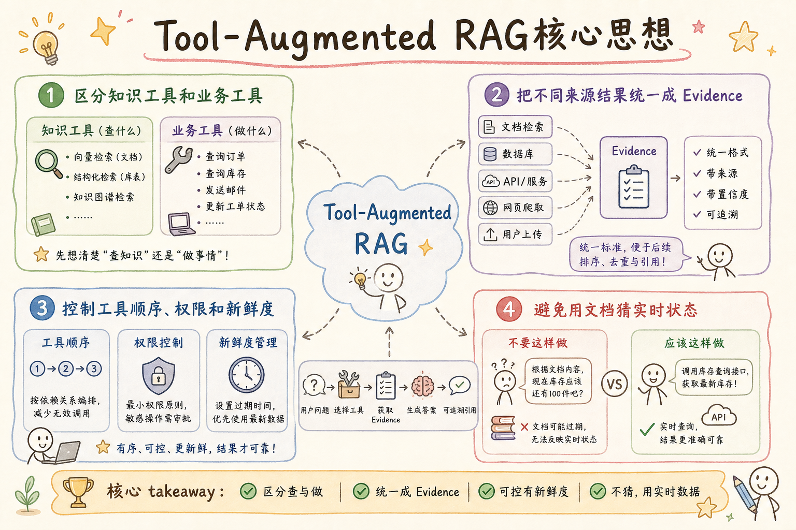
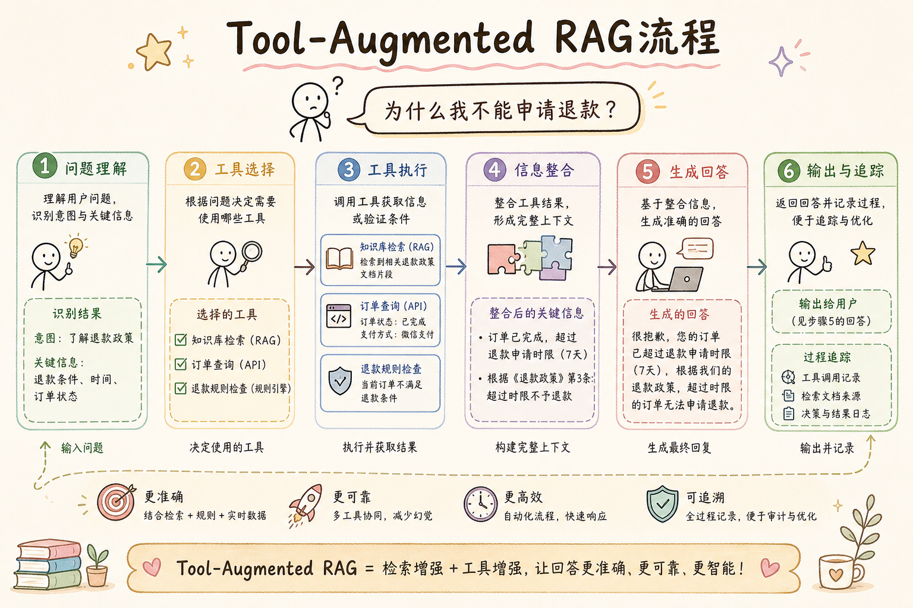
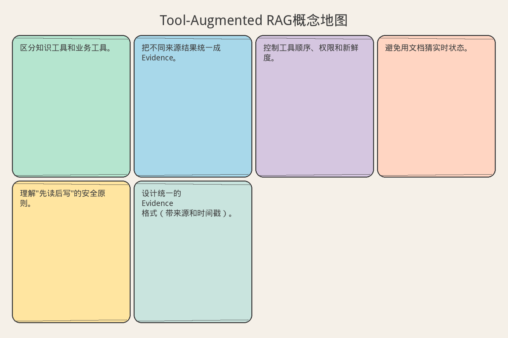

# AI Agent 工程（二十八）：Tool-Augmented RAG

> 文档告诉系统"规则是什么"，业务工具告诉系统"当前发生了什么"。Tool-Augmented RAG 把静态知识证据和实时业务状态组合起来。

**阅读建议：** 先阅读 [240 多步检索](240.multi-step-retrieval-agent-tutorial.md)，理解多步检索的状态管理。


> **系列导读：** [Agent/RAG 工程系列 238–254](../src/posts/ai-ml/agent-rag-series-238-254.md) · [`examples/rag-agent-lab`](../examples/rag-agent-lab/)

**环境要求：**
- Python **3.10+**
- 依赖：`pip install pydantic`

> **博客实践版**（系列链接、动手路径、[examples/rag-agent-lab](../examples/rag-agent-lab/) 可运行代码）：[`241-tool-augmented-rag.md`](../src/posts/ai-ml/241-tool-augmented-rag.md)


**档位：** 主线篇（Part 5）
**本文边界：** 前驱篇 [218–225](218.tool-calling-basics-tutorial.md) 工具 + [239–240](239.query-planning-rag-agent-tutorial.md) 检索。本篇 tool-augmented RAG。不讲 Multi-Agent。代码 `main.py 241`。接续 [242](242.rag-agent-citation-verification-tutorial.md)。
**动手路径：** ① 读 tool 循环 → ② `python main.py 241` → ③ 对照 §权限与预算

### 核心术语（本篇首次出现）
**Agentic RAG**（自主检索增强）：检索策略由中间证据驱动，非固定管道。
通俗说：侦探根据线索决定下一步查哪里。
**tool_calls**（工具调用列表）：模型一次可请求多个工具，执行后再回灌结果。
通俗说：模型一次可点多个工具按钮。
**检索工具**（Retrieval Tool）：把向量库/API 查询封装成与普通工具同形的函数。
通俗说：把查库封装成和普通工具一样的函数。
**工具循环**（Tool Loop）：生成→执行 tool→再生成，直到不再请求工具。
通俗说：调工具→看结果→再想→再调，直到够用。
---

## 目录

1. [你会学到什么](#你会学到什么)
2. [它解决什么问题](#它解决什么问题)
3. [核心概念：知识 vs 状态 vs 动作](#核心概念知识-vs-状态-vs-动作)
4. [最小示例](#最小示例)
5. [工程化版本](#工程化版本)
6. [常见失败模式](#常见失败模式)
7. [什么时候不要这么做](#什么时候不要这么做)
8. [生产环境注意事项](#生产环境注意事项)
9. [如何观测和评测](#如何观测和评测)
10. [和 RAG / 后端 / 前端的关系](#和-rag--后端--前端的关系)
11. [面试怎么讲](#面试怎么讲)
12. [下一步](#下一步)

## 你会学到什么

- 区分知识工具和业务工具。
- 把不同来源结果统一成 Evidence。
- 控制工具顺序、权限和新鲜度。
- 避免用文档猜实时状态。
- 理解"先读后写"的安全原则。
- 设计统一的 Evidence 格式（带来源和时间戳）。

## 它解决什么问题


读下图时，先看「Tool-Augmented RAG核心思想」建立直觉。


对照上图：Tool-Augmented RAG 把检索与业务 API 放进同一 tool 循环——仍受预算约束。

读下图时，先看能力边界与痛点流程——与 §最小示例 代码互补，不是逐步对照。


对照上图：检索与 tool_calls 在同一决策环——模型既能查库也能调业务 API，但要有预算。
### 一个需要多种信息源的问题

用户问：

```text
"为什么我不能申请退款？"
```

要回答这个问题，需要三种不同来源的信息：

| 来源 | 提供什么 | 工具类型 |
|---|---|---|
| RAG（制度文档） | 退款制度和适用条件 | Knowledge Tool |
| 订单系统 | 订单金额、支付状态、可退余额 | State Tool |
| 工单系统 | 是否存在处理中的退款工单 | State Tool |

**只查制度**：知道"7 天内可退"，但不知道用户的订单是几天前的。
**只查订单**：知道"订单是 10 天前的"，但不知道退款规则是什么。
**组合起来**：才能回答"您的订单已超过 7 天退款期限"。

### 为什么不能只用 RAG

```text
❌ 用 RAG 猜实时状态：
   文档: "订单通常 3-5 天发货"
   模型: "您的订单可能已经发货了"  ← 猜测！不是事实！

✅ 用业务工具查实时状态：
   get_order("ORD-1001") → {"status": "shipped", "shipped_at": "2026-07-20"}
   模型: "您的订单已于 7 月 20 日发货"  ← 事实
```

完整链路保持：**Query Planning、Retrieval Tool、Citation Verification、Bad Case Debugging**，业务工具作为额外 Evidence Provider。

## 核心概念：知识 vs 状态 vs 动作

### 类比：医院看病

| 类型 | 医院类比 | Agent 对应 | 特点 |
|---|---|---|---|
| Knowledge | 医学教科书 | RAG 文档检索 | 静态、有版本、可引用 |
| State | 化验报告 | 业务系统查询 | 实时、有时间戳、会变化 |
| Action | 开刀手术 | 业务系统写入 | 不可逆、需审批、要幂等 |

医生（Agent）看病的过程：
1. 查教科书了解病症（Knowledge）
2. 看化验单了解当前状况（State）
3. 制定治疗方案并征求患者同意（Action + Human-in-the-loop）

医生不会只看教科书就说"你得了 XX 病"——必须结合化验结果。

### 三种工具的安全等级

```text
Knowledge Tool（只读，安全）
  → 查文档、查制度
  → 风险低：最多查到不相关内容

State Tool（只读，中等）
  → 查订单、查余额
  → 风险中：可能泄露敏感数据（需要权限控制）

Action Tool（写入，高危）
  → 创建退款、修改订单
  → 风险高：不可逆操作（需要审批 + 幂等）
```

**Agentic RAG 优先接 Knowledge 和 State Tool；Action Tool 需要 Human-in-the-loop。**

## 最小示例

**演示什么：** 本节最小可运行切片。**环境：** 见文首。**预期：** 控制台打印 demo 输出。

### 统一 Evidence 结构

```python
from dataclasses import dataclass
from typing import Literal


@dataclass(frozen=True)
class Evidence:
    """
    统一证据结构：不管是文档还是业务数据，都用同一个格式。
    
    为什么统一？
    1. 后续 Citation Verification 不需要区分来源
    2. 答案生成时可以统一引用
    3. Bad Case Debugging 可以统一回放
    
    关键字段：
    - kind: 区分"文档知识"和"实时状态"
    - observed_at: 什么时候获取的（实时数据必须带）
    """
    evidence_id: str                              # 唯一标识
    kind: Literal["document", "business_state"]   # 证据类型
    source: str                                   # 来源（如 "policy_docs" 或 "order_service"）
    content: dict                                 # 证据内容
    observed_at: str                              # 获取时间（ISO 格式）


def collect_refund_evidence(order_id: str) -> list[Evidence]:
    """
    收集退款相关的所有证据。
    
    组合三种来源：
    1. 退款制度（Knowledge）
    2. 订单状态（State）
    3. 相关工单（State）
    """
    # Knowledge Tool: 查退款制度
    policy = search_refund_policy(order_id)

    # State Tool: 查订单状态
    order = get_order(order_id)

    # State Tool: 查相关工单
    tickets = list_refund_tickets(order_id)

    # 统一返回
    return [*policy, order, *tickets]
```

### 使用示例

```python
evidence_list = collect_refund_evidence("ORD-1001")

for ev in evidence_list:
    print(f"[{ev.kind}] {ev.source}: {ev.content}")

# 输出：
# [document] policy_docs: {"rule": "7天内可无理由退款", "version": "v3.2"}
# [business_state] order_service: {"status": "paid", "days_since_order": 10}
# [business_state] ticket_service: {"open_tickets": 0}
```

## 工程化版本

### 工具分类与注册

| 类型 | 示例 | 特点 | 安全要求 |
|---|---|---|---|
| Knowledge Tool | search_policy | 文档版本、引用、ACL | 用户权限过滤 |
| State Tool | get_order | 实时性、资源权限 | 用户 + 租户权限 |
| Action Tool | create_refund | 写入、幂等、审批 | Human-in-the-loop |

```python
class ToolRegistry:
    """
    工具注册表：管理所有可用工具及其类型。
    
    Agent 只能调用已注册的工具，
    且 Action Tool 必须经过审批流程。
    """

    def __init__(self):
        self._tools: dict[str, dict] = {}

    def register(self, name: str, kind: str, handler, requires_approval: bool = False):
        """注册一个工具。"""
        self._tools[name] = {
            "kind": kind,  # "knowledge" | "state" | "action"
            "handler": handler,
            "requires_approval": requires_approval,
        }

    def call(self, name: str, params: dict, user_context) -> Evidence:
        """调用工具并返回统一 Evidence。"""
        tool = self._tools[name]

        # Action Tool 需要审批
        if tool["requires_approval"]:
            approval = request_human_approval(name, params, user_context)
            if not approval.approved:
                raise PermissionError(f"action_denied: {name}")

        # 执行
        result = tool["handler"](params, user_context)

        # 包装为统一 Evidence
        return Evidence(
            evidence_id=f"{name}:{params.get('id', 'unknown')}:{result.version}",
            kind="document" if tool["kind"] == "knowledge" else "business_state",
            source=name,
            content=result.data,
            observed_at=result.timestamp,
        )
```

### 统一 Evidence 格式

```json
{
  "evidence_id": "order:ORD-1001:v17",
  "kind": "business_state",
  "source": "order_service",
  "content": {
    "status": "paid",
    "refundable_balance": "0.00",
    "days_since_order": 10
  },
  "observed_at": "2026-07-22T12:00:00+08:00"
}
```

**实时状态必须带 observed_at 或 resource_version，避免缓存旧值。**

```text
为什么 observed_at 很重要？

场景：
T1 (12:00): 查订单 → status="paid", refundable=100
T2 (12:05): 用户在其他渠道申请了退款
T3 (12:10): Agent 用 T1 的数据回答"您可以退款 100 元"
→ 错误！实际可退余额已经变了

如果带 observed_at：
Agent: "截至 12:00，您的可退余额为 100 元（数据可能已变化）"
```

### 先读后写原则

```text
正确顺序：
查制度 → 查订单 → 生成建议 → 人工确认 → 执行动作

❌ 错误：
模型: "根据制度，应该退款" → 直接调用 create_refund
→ 没有人工确认！没有重新验证订单状态！
```

```python
def handle_refund_request(order_id: str, user_context) -> dict:
    """
    处理退款请求：先读后写。
    
    步骤：
    1. 读制度（Knowledge）
    2. 读订单（State）
    3. 判断是否符合条件
    4. 生成建议（不执行）
    5. 等待人工确认
    6. 确认后重新读取状态（防止并发变化）
    7. 执行退款（Action）
    """
    # 步骤 1-2：收集证据
    evidence = collect_refund_evidence(order_id)

    # 步骤 3：判断
    policy = find_policy(evidence)
    order = find_order(evidence)
    eligible = check_eligibility(policy, order)

    if not eligible:
        return {"action": "reject", "reason": policy.rule}

    # 步骤 4：生成建议（不执行！）
    suggestion = {
        "action": "refund",
        "amount": order.refundable_balance,
        "reason": f"符合 {policy.rule}",
        "evidence_ids": [e.evidence_id for e in evidence],
    }

    # 步骤 5：等待人工确认
    return {"action": "pending_approval", "suggestion": suggestion}
```

### 新鲜度控制

```python
def is_fresh(evidence: Evidence, max_age_seconds: int = 300) -> bool:
    """
    检查证据是否足够新鲜。
    
    实时状态（business_state）的有效期很短（如 5 分钟）。
    文档知识（document）的有效期可以很长（如 24 小时）。
    
    过期的证据需要重新获取。
    """
    from datetime import datetime, timezone

    observed = datetime.fromisoformat(evidence.observed_at)
    now = datetime.now(timezone.utc)
    age = (now - observed).total_seconds()

    if evidence.kind == "business_state":
        return age < max_age_seconds  # 实时数据：5 分钟
    else:
        return age < 86400  # 文档：24 小时
```

## 常见失败模式

### 1. 用 RAG 文档推测实时订单状态

```text
文档: "标准配送通常 3-5 天到达"
❌ 模型: "您的包裹预计 3-5 天到达"（用文档猜）
✅ 应该: 调用 logistics_tool.get_status(order_id) 获取实时物流状态
```

### 2. 业务工具结果没有 observed_at

```python
# ❌ 没有时间戳
{"status": "paid", "balance": 100}
# 不知道这是什么时候的数据

# ✅ 有时间戳
{"status": "paid", "balance": 100, "observed_at": "2026-07-22T12:00:00Z"}
```

### 3. 文档 Evidence 和业务 Evidence 混成无来源文本

```text
❌ 拼成一段文本：
   "退款规则是 7 天内。您的订单是 10 天前的。"
   → 不知道哪句来自文档，哪句来自订单系统

✅ 保持结构化：
   Evidence 1: {kind: "document", source: "policy", content: "7天内可退"}
   Evidence 2: {kind: "business_state", source: "order", content: "10天前"}
```

### 4. 查询工具使用系统超级权限

```python
# ❌ 用系统账号查所有订单
def get_order(order_id):
    return db.query(f"SELECT * FROM orders WHERE id='{order_id}'")
    # 任何用户都能查任何订单！

# ✅ 继承用户权限
def get_order(order_id, user_context):
    if not acl.can_access(user_context, "order", order_id):
        raise PermissionError("order_not_accessible")
    return db.query(...)
```

### 5. Planner 同时触发互相依赖的读写工具

```text
❌ 并行执行：
   Thread 1: get_order("ORD-001") → balance=100
   Thread 2: create_refund("ORD-001", amount=100)
   → 竞态条件！

✅ 顺序执行：
   先 get_order → 确认 balance → 人工确认 → 再 create_refund
```

### 6. 答案引用制度，但关键结论来自未展示的业务状态

```text
答案: "根据退款制度 [1]，您不符合退款条件。"
[1]: "7天内可无理由退款"
但实际原因是：订单已有处理中的退款工单（这个信息没展示）
→ 用户困惑："我明明在 7 天内啊？"
```

## 什么时候不要这么做

**只需实时结构化数据时直接调用 API，不需要 RAG。**

```text
"我的订单状态是什么？" → 直接调 get_order，不需要查制度文档
```

**只需解释制度时普通 RAG 足够。**

```text
"退款政策是什么？" → 普通 RAG 查文档即可，不需要查订单
```

**业务工具权限和幂等还没准备好时，不接写工具。**

```text
如果 create_refund 没有幂等保护：
→ Agent 重试可能创建多个退款
→ 先修好工具，再接入 Agent
```

## 生产环境注意事项

- 所有工具继承用户和租户权限（不用超级账号）。
- 文档 Evidence 带 version，业务 Evidence 带 observed_at。
- 写动作执行前重新读取关键状态（防止并发变化）。
- 不把完整业务对象放入模型（只传必要字段，减少 token 和泄露风险）。
- 证据冲突时优先使用明确版本和时间规则（不靠相似度）。
- State Tool 的结果缓存时间很短（或不缓存）。
- Action Tool 必须有幂等键和审批流程。
- 工具调用超时独立设置（Knowledge 2s，State 3s，Action 5s）。

## 如何观测和评测

分别评测每个环节：

| 环节 | 评测内容 | 指标 |
|---|---|---|
| Query Planning | 是否选择正确 Evidence Provider | 工具选择准确率 |
| Retrieval Tool | 是否找到相关制度 | Recall |
| State Tool | 是否返回当前资源版本 | 新鲜度（observed_at 延迟） |
| Citation Verification | 是否区分文档和业务证据 | 引用分类准确率 |
| Bad Case Debugging | 是否能定位旧缓存、错权限或错制度 | 根因定位率 |

端到端测试：

```python
def test_tool_augmented_rag():
    """测试：退款问题需要组合制度和订单状态。"""
    answer = agent.answer("为什么我不能申请退款？", order_id="ORD-1001")

    # 答案应该包含制度引用
    assert "7天" in answer.text or "退款期限" in answer.text

    # 答案应该包含订单状态
    assert "10天" in answer.text or "已超过" in answer.text

    # 证据应该有两种类型
    kinds = {e.kind for e in answer.evidence}
    assert "document" in kinds
    assert "business_state" in kinds
```

## 和 RAG / 后端 / 前端的关系

- RAG 提供规则证据（Knowledge Tool 的底层）。
- 后端业务工具提供实时状态并执行权限（State Tool 和 Action Tool）。
- 前端同时展示政策引用和订单状态摘要（用户看到两种来源）。
- Agent 负责组合，不负责创造缺失事实（缺什么说什么缺）。

## 面试怎么讲

> Tool-Augmented RAG 把文档知识和实时业务状态统一成带身份的 Evidence。Knowledge Tool 返回文档版本和引用，State Tool 返回 resource_version 或 observed_at，Action Tool 单独走幂等和审批。最终答案区分规则依据和实时状态，不能用 RAG 猜业务数据。

## 初学者常见疑问

### 为什么不能用 RAG 回答业务状态问题？

初学者常问："我把订单数据也放进向量库，不就能用 RAG 查了吗？"

```text
问题：
  订单状态是实时变化的！
  向量库中的是"昨天"的状态（索引有延迟）
  用户问"我的订单到哪了" → 需要实时数据

  RAG 适合：不常变的规则（退货政策、FAQ）
  工具适合：实时状态（订单、余额、物流）

类比：
  RAG = 间"退货政策是什么"（查员工手册）
  工具 = 问"我的订单到哪了"（查物流系统）
  你不会去员工手册里查物流信息！
```

### 三种工具怎么区分？

```text
Knowledge Tool（知识工具）：
  查规则、政策、FAQ
  → 返回文档片段 + 版本 + 引用
  → 例："退货政策是 7 天无理由"

State Tool（状态工具）：
  查实时业务数据（只读）
  → 返回当前值 + 时间戳
  → 例："订单 ORD-001 已发货，预计明天到"

Action Tool（动作工具）：
  执行写操作（有副作用）
  → 需要幂等 + 审批 + 审计
  → 例："申请退款""修改地址"

简单记：
  Knowledge = 查规则（不变）
  State = 查现状（实时）
  Action = 做事情（危险）
```

## 博客版补充

博客实践版 [`241-tool-augmented-rag.md`](../src/posts/ai-ml/241-tool-augmented-rag.md) 含安全沙箱说明与 LangChain 集成修正。可运行代码：`examples/rag-agent-lab/` → `python main.py 241`。

## 下一步


读下图时，先看「Tool-Augmented RAG概念地图」建立直觉。


对照上图：检索+工具双环——242 引用验证。
下一篇 [242 引用验证](242.rag-agent-citation-verification-tutorial.md) 会验证答案中的每个关键事实是否真正被 Evidence 支持。
