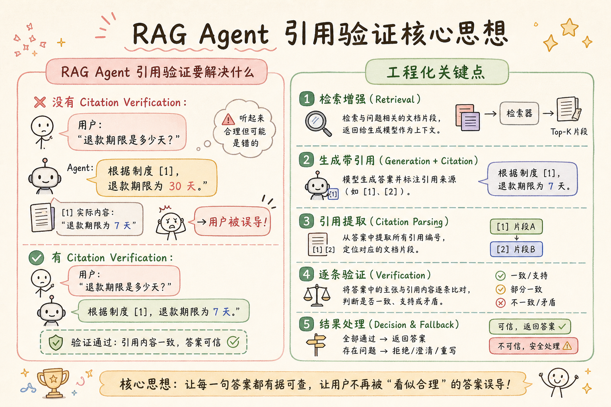
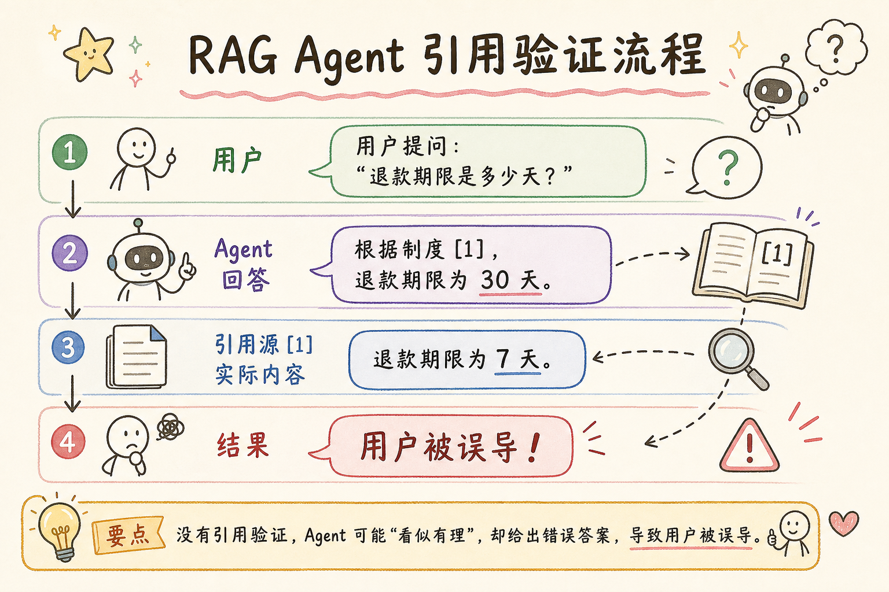
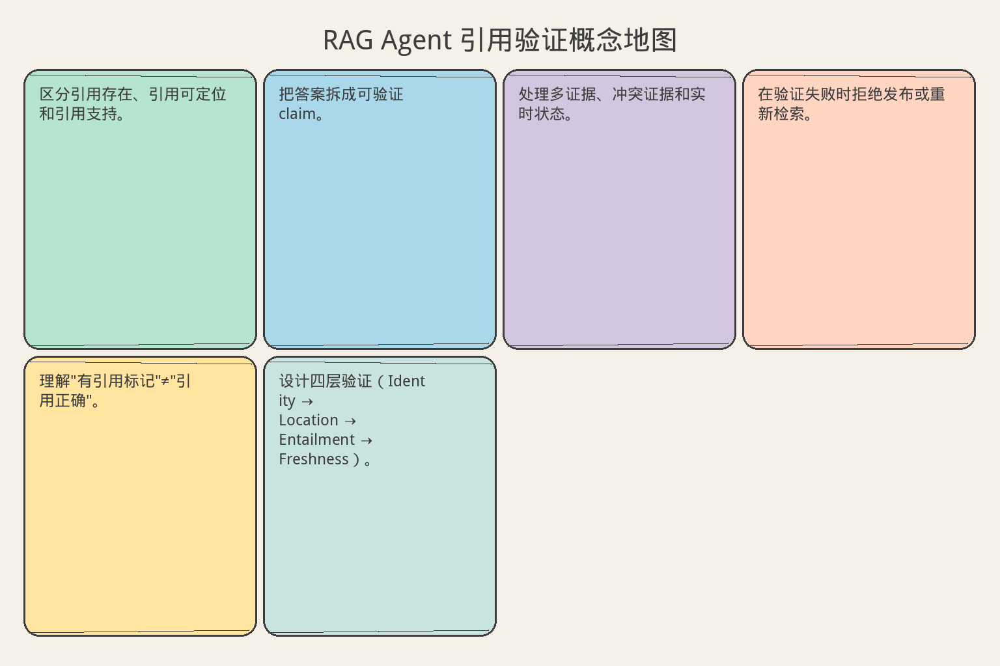

# AI Agent 工程（二十九）：RAG Agent 引用验证

> 答案带有 [1] 不代表引用正确。Citation Verification 要检查关键事实、引用身份和证据内容是否一致。

**阅读建议：** 先阅读 [241 Tool-Augmented RAG](241.tool-augmented-rag-tutorial.md)，理解 Evidence 的来源和格式。


> **系列导读：** [Agent/RAG 工程系列 238–254](../src/posts/ai-ml/agent-rag-series-238-254.md) · [`examples/rag-agent-lab`](../examples/rag-agent-lab/)

**环境要求：**
- Python **3.10+**
- 依赖：`pip install pydantic`

> **博客实践版**（系列链接、动手路径、[examples/rag-agent-lab](../examples/rag-agent-lab/) 可运行代码）：[`242-rag-agent-citation-verification.md`](../src/posts/ai-ml/242-rag-agent-citation-verification.md)


**档位：** 主线篇（Part 5）
**本文边界：** 前驱篇 [241](241.tool-augmented-rag-tutorial.md) 生成链。本篇引用验证与修正。代码 `main.py 242`。接续 [243](243.rag-agent-bad-case-debugging-tutorial.md)。
**动手路径：** ① 读引用验证规则 → ② `python main.py 242` → ③ 故意造假引用跑验证

### 核心术语（本篇首次出现）
**Agentic RAG**（自主检索增强）：检索策略由中间证据驱动，非固定管道。
通俗说：侦探根据线索决定下一步查哪里。
**Citation**（引用）：答案中指向证据片段的标注，如 [1] 对应 evidence_id。
通俗说：答案里的脚注，必须指回证据原文。
**证据支持度**（Support Check）：判断某句结论是否被引用文本真正蕴含。
通俗说：这句话证据里到底有没有说。
**修正轮**（Correction Pass）：验证失败后让模型按证据重写或披露不确定。
通俗说：验证失败后按证据重写或承认不确定。
---

## 目录

1. [你会学到什么](#你会学到什么)
2. [它解决什么问题](#它解决什么问题)
3. [核心概念：引用的三个层次](#核心概念引用的三个层次)
4. [最小示例](#最小示例)
5. [工程化版本](#工程化版本)
6. [常见失败模式](#常见失败模式)
7. [什么时候不要这么做](#什么时候不要这么做)
8. [生产环境注意事项](#生产环境注意事项)
9. [如何观测和评测](#如何观测和评测)
10. [和 RAG / 后端 / 前端的关系](#和-rag--后端--前端的关系)
11. [面试怎么讲](#面试怎么讲)
12. [下一步](#下一步)

## 你会学到什么

- 区分引用存在、引用可定位和引用支持。
- 把答案拆成可验证 claim。
- 处理多证据、冲突证据和实时状态。
- 在验证失败时拒绝发布或重新检索。
- 理解"有引用标记"≠"引用正确"。
- 设计四层验证（Identity → Location → Entailment → Freshness）。

## 它解决什么问题


读下图时，先看「RAG Agent 引用验证核心思想」建立直觉。


对照上图：引用验证查的是「证据是否支持该句」——不是数 `[1]` 有几个。

读下图时，先看能力边界与痛点流程——与 §最小示例 代码互补，不是逐步对照。


对照上图：每个引用必须指回 Evidence——有 `[1]` 标记不等于证据真的支持该句。
### 假引用的五种形态

答案里标了 `[1]` 就代表引用正确吗？不一定：

| 假引用类型 | 示例 | 为什么错 |
|---|---|---|
| 不支持结论 | [1] 说"测试环境支持 1000 并发"，答案写"支持无限并发 [1]" | 内容不支持 |
| 引用旧版本 | [1] 是 v2.0 的制度，但 v3.0 已经修改了 | 版本过期 |
| 来源错配 | 数字来自订单系统，答案却引用政策文档 | 张冠李戴 |
| 部分支持 | [1] 只支持半句话，另外半句没有依据 | 以偏概全 |
| 伪造 ID | Agent 编造了不存在的 evidence_id | 凭空捏造 |

### 为什么需要验证

```text
没有 Citation Verification：
用户: "退款期限是多少天？"
Agent: "根据制度 [1]，退款期限为 30 天。"
[1] 实际内容: "退款期限为 7 天"
→ 用户被误导！

有 Citation Verification：
验证器: claim="30天" vs evidence="7天" → 不支持！
→ 拒绝发布，重新生成
```

这一步位于 **Query Planning、Retrieval Tool** 之后，并把失败送入 **Bad Case Debugging**；核心组件就是 **Citation Verification**。

## 核心概念：引用的三个层次

### 类比：学术论文审稿

| 层次 | 论文审稿类比 | RAG 引用对应 |
|---|---|---|
| 存在性 | 参考文献列表里有没有 [1] | evidence_id 是否存在 |
| 可定位性 | [1] 能不能找到原文 | source/page/version 是否有效 |
| 支持性 | [1] 的内容是否真的支持你的论点 | 证据文本是否蕴含 claim |

很多系统只做了第一层（"有引用标记"），但真正有价值的是第三层（"引用支持结论"）。

### 四层验证模型

```text
Layer 1: Identity（身份）
  → evidence_id 是否属于当前任务的 Evidence Store？
  → 确定性校验（代码判断）

Layer 2: Location（定位）
  → source、page、version 是否有效？能否找到原文？
  → 确定性校验

Layer 3: Entailment（蕴含）
  → 证据文本是否逻辑上支持 claim？
  → 可用模型判断或人工抽检

Layer 4: Freshness（时效）
  → 是否是正确版本？是否是当前状态？
  → 确定性校验（version + observed_at）
```

**Layer 1-2-4 必须用确定性代码，Layer 3 可以用模型辅助。**

## 最小示例

**演示什么：** 本节最小可运行切片。**环境：** 见文首。**预期：** 控制台打印 demo 输出。

### 数据结构

```python
from pydantic import BaseModel, Field


class Claim(BaseModel):
    """
    答案中的一个事实声明。
    
    每个 claim 必须关联至少一个 evidence_id。
    没有证据支持的声明不应该出现在答案中。
    """
    text: str                                    # 声明内容
    evidence_ids: list[str] = Field(min_length=1)  # 支持的证据 ID


class VerificationResult(BaseModel):
    """
    验证结果。
    
    supported=True: 所有 claim 都有证据支持
    supported=False: 存在未支持的 claim
    """
    supported: bool
    unsupported_claims: list[str] = Field(default_factory=list)
    missing_evidence_ids: list[str] = Field(default_factory=list)
```

### 答案结构化

答案先结构化为 claims：

```json
{
  "claims": [
    {
      "text": "一线城市住宿上限为 500 元/晚。",
      "evidence_ids": ["policy-17"]
    },
    {
      "text": "您的订单已支付 10 天，超过退款期限。",
      "evidence_ids": ["order-ORD1001-v3", "policy-22"]
    }
  ]
}
```

编排器确认 `policy-17` 确实存在于当前 Evidence Store。

### 基本验证

```python
def verify_answer(
    claims: list[Claim],
    evidence_store: dict[str, Evidence],
) -> VerificationResult:
    """
    验证答案中的所有 claim。
    
    步骤：
    1. 检查 evidence_id 是否存在（Identity）
    2. 检查证据是否支持 claim（Entailment）
    """
    missing_ids = []
    unsupported = []

    for claim in claims:
        for eid in claim.evidence_ids:
            # Layer 1: Identity
            if eid not in evidence_store:
                missing_ids.append(eid)
                continue

            # Layer 3: Entailment（简化版：关键词匹配）
            evidence = evidence_store[eid]
            if not supports(evidence.text, claim.text):
                unsupported.append(claim.text)

    return VerificationResult(
        supported=len(missing_ids) == 0 and len(unsupported) == 0,
        unsupported_claims=unsupported,
        missing_evidence_ids=sorted(set(missing_ids)),
    )
```

## 工程化版本

### 四层验证实现

```python
class CitationVerifier:
    """
    四层引用验证器。
    
    每一层独立运行，任何一层失败都标记为不支持。
    """

    def __init__(self, evidence_store: dict[str, Evidence], task_id: str):
        self.store = evidence_store
        self.task_id = task_id

    def verify(self, claims: list[Claim]) -> VerificationResult:
        """执行完整的四层验证。"""
        issues = []

        for claim in claims:
            for eid in claim.evidence_ids:
                # Layer 1: Identity
                if not self._check_identity(eid):
                    issues.append(f"[Identity] {eid} 不属于当前任务")
                    continue

                evidence = self.store[eid]

                # Layer 2: Location
                if not self._check_location(evidence):
                    issues.append(f"[Location] {eid} 来源不可定位")
                    continue

                # Layer 3: Entailment
                if not self._check_entailment(evidence, claim):
                    issues.append(f"[Entailment] {eid} 不支持: {claim.text}")
                    continue

                # Layer 4: Freshness
                if not self._check_freshness(evidence):
                    issues.append(f"[Freshness] {eid} 版本过期或状态过旧")

        return VerificationResult(
            supported=len(issues) == 0,
            unsupported_claims=issues,
        )

    def _check_identity(self, evidence_id: str) -> bool:
        """Layer 1: evidence_id 是否属于当前任务。"""
        if evidence_id not in self.store:
            return False
        # 额外检查：是否属于当前 task（防止跨任务引用）
        return self.store[evidence_id].task_id == self.task_id

    def _check_location(self, evidence: Evidence) -> bool:
        """Layer 2: 来源是否可定位。"""
        if not evidence.source:
            return False
        # 文档类型必须有 page 或 section
        if evidence.kind == "document" and not evidence.page:
            return False
        return True

    def _check_entailment(self, evidence: Evidence, claim: Claim) -> bool:
        """
        Layer 3: 证据是否支持 claim。
        
        实现方式（从简单到复杂）：
        1. 关键词匹配（快速但粗糙）
        2. NLI 模型（自然语言推理）
        3. LLM 判断（最准确但最贵）
        4. 人工抽检（最终兜底）
        """
        # 这里用简化的关键词匹配演示
        # 生产环境建议用 NLI 模型或 LLM
        return self._nli_check(evidence.text, claim.text)

    def _check_freshness(self, evidence: Evidence) -> bool:
        """Layer 4: 版本和时效。"""
        if evidence.kind == "document":
            # 文档：检查是否是当前版本
            return evidence.version == get_current_version(evidence.source)
        else:
            # 业务状态：检查 observed_at 是否在有效期内
            return is_fresh(evidence.observed_at, max_age_seconds=300)
```

### 验证失败后的处理

```python
def handle_verification_failure(
    result: VerificationResult,
    state: AgenticRAGState,
) -> str:
    """
    验证失败后的决策。
    
    三种处理：
    1. 重新检索（如果是证据不足）
    2. 降级回答（去掉不支持的部分）
    3. 转人工（如果反复失败）
    """
    if state.retrieval_calls < state.max_retrieval_calls:
        # 还有预算：重新检索
        return "retry_retrieval"

    if result.unsupported_claims:
        # 预算用完：降级（去掉不支持的 claim）
        return "degrade_answer"

    # 反复失败：转人工
    return "escalate_to_human"
```

### 业务状态引用

```text
答案需要同时引用规则和状态：

[制度 1] 退款期限为支付后 7 天。
[订单状态 2] 当前订单已支付 10 天。
结论：您的订单已超过退款期限 [1][2]。

❌ 只引用规则：
"退款期限为 7 天 [1]，您已超过期限。"
→ "您已超过"这个结论没有证据支持（没有引用订单状态）

✅ 同时引用：
"退款期限为 7 天 [1]，您的订单已支付 10 天 [2]，因此已超过期限。"
```

## 常见失败模式

### 1. 只检查答案有没有引用符号

```python
# ❌ 只检查格式
def verify_bad(answer: str) -> bool:
    return "[1]" in answer  # 有 [1] 就通过？

# ✅ 检查内容
def verify_good(claims: list[Claim], store: dict) -> VerificationResult:
    # 验证每个 claim 的 evidence 是否真的支持
    ...
```

### 2. 模型自由生成 evidence_id

```text
模型: "根据 [ev-999]，退款期限为 30 天"
但 ev-999 根本不存在！是模型编造的。

修复：evidence_id 由系统生成，模型只能从给定列表中选择。
```

### 3. Evidence Store 混入其他用户任务证据

```text
Task A 的 Evidence Store 包含 ev-001 到 ev-010
Task B 的模型引用了 ev-005（属于 Task A）
→ 跨任务引用！可能泄露其他用户的数据

修复：_check_identity 验证 task_id
```

### 4. 版本和生效日期未验证

```text
证据: policy-v2.pdf 说 "退款期限 30 天"
当前版本: policy-v3.pdf 说 "退款期限 7 天"
答案引用了 v2 → 过期信息！

修复：_check_freshness 验证 version
```

### 5. Reviewer 只看摘要，不看原证据

```text
摘要: "该文档讨论了退款政策"
原文: "退款政策适用于线下门店，线上订单不适用"
答案: "线上订单可以退款 [1]"
→ 摘要看起来支持，但原文不支持！

修复：验证时必须使用原文，不能用摘要。
```

### 6. 引用验证失败后删除引用但保留结论

```text
❌ 验证失败: "30 天" 不被 [1] 支持
   处理: 删除 [1] 标记，但保留 "30 天" 这个结论
   → 结论还在，只是没了引用标记 → 更危险（用户无法验证）

✅ 正确: 删除整个 claim，或重新检索获取正确证据
```

## 什么时候不要这么做

**纯创意写作不需要事实引用验证。**

```text
"帮我写一首关于春天的诗" → 不需要引用验证
"帮我写一个故事" → 不需要引用验证
```

**但只要答案包含政策、金额、状态或操作建议，就应该验证关键 claim。**

```text
"退款期限是 7 天" → 需要验证
"您的余额是 100 元" → 需要验证
"建议您申请退款" → 需要验证（建议的依据是什么？）
```

**验证器没有真实 Evidence 时不能自行搜索替代并静默通过；应返回失败给编排器。**

## 生产环境注意事项

- evidence_id 由系统生成（模型不能编造）。
- 引用只允许来自当前 task_id 的 Evidence Store（防跨任务）。
- 记录 document_version 和 observed_at（可追溯）。
- 验证失败时重新检索、降级或转人工（不静默忽略）。
- 用户点击引用时跳到实际来源位置（可验证性）。
- Entailment 检查可以用 NLI 模型（如 DeBERTa）降低成本。
- 高置信度答案可以抽检而非全检（平衡成本和质量）。
- 验证结果作为 trace 的一部分持久化（bad case 回放）。

## 如何观测和评测

指标：

| 指标 | 含义 | 健康范围 |
|---|---|---|
| Citation presence | 答案中有引用的比例 | > 95% |
| Evidence identity valid rate | evidence_id 存在的比例 | > 99% |
| Claim support rate | claim 被证据支持的比例 | > 90% |
| Version correctness | 引用正确版本的比例 | > 95% |
| Unsupported claim rate | 未支持 claim 的比例 | < 5% |
| 点击后来源可访问率 | 用户点击引用能找到原文 | > 98% |

Bad Case Debugging 保存 claim、evidence_id、验证结果和修复动作。

## 和 RAG / 后端 / 前端的关系

- Retrieval Tool 负责提供可定位 Evidence（source + page + version）。
- 后端 Evidence Store 防止引用伪造（ID 由系统生成）。
- 前端把引用卡片定位到 source/page（用户可验证）。
- Agent 只在验证通过后生成最终发布版本（不发布未验证答案）。

## 面试怎么讲

> Citation Verification 不只是检查 [1]。我会先把答案拆成 claim，再验证 evidence_id 属于当前任务、来源可定位、版本正确且内容支持 claim。身份和版本用确定性代码，语义支持可用模型或人工。失败时重新检索或降级，不能只删除引用。

## 初学者常见疑问

### 为什么不能只检查"答案里有没有 [1] 这样的标记"？

很多初学者以为引用验证就是检查格式，其实远远不够：

```text
只检查格式的问题：
  答案写了 [1]，但 [1] 指向的文档根本不支持这个说法
  答案写了 [2]，但 evidence_id 是 LLM 编造的（不存在）
  答案写了 [3]，但指向的是旧版本文档（已更新）

真正的验证需要 4 层：
  1. 身份验证：evidence_id 是否属于当前任务（不是编造的）
  2. 来源定位：能否找到原文位置（source + page）
  3. 版本正确：引用的是不是最新版本
  4. 语义支持：原文是否真的支持这个 claim

前 3 层用确定性代码，第 4 层用 NLI 模型或人工。
```

### 什么是 NLI（自然语言推理）？

```text
NLI = Natural Language Inference

给定两句话：
  前提（Premise）："公司 2024 年营收 100 亿"
  假设（Hypothesis）："公司营收超过 50 亿"

NLI 模型判断：
  - 支持（Entailment）：前提能推出假设 ✓
  - 矛盾（Contradiction）：前提与假设冲突 ✗
  - 无关（Neutral）：前提无法判断假设 ?

在引用验证中：
  前提 = 证据原文
  假设 = 答案中的 claim
  判断 = "支持" → 引用有效
```

常用模型：DeBERTa-v3-large（微调过的 NLI 版本），成本低、速度快。

## 完整运行示例

```python
from dataclasses import dataclass


@dataclass
class Evidence:
    """一条证据。"""
    evidence_id: str
    source: str
    page: int
    version: int
    content: str


@dataclass
class Claim:
    """答案中的一个声明。"""
    text: str
    cited_evidence_id: str


class CitationVerifier:
    """引用验证器（教学版）。"""

    def __init__(self, evidence_store: dict[str, Evidence], task_evidence_ids: set):
        self.store = evidence_store
        self.task_ids = task_evidence_ids

    def verify_claim(self, claim: Claim) -> dict:
        """验证一个 claim 的引用是否有效。"""
        result = {"claim": claim.text, "checks": {}}

        # 第 1 层：身份验证
        if claim.cited_evidence_id not in self.task_ids:
            result["checks"]["identity"] = "FAIL: 不属于当前任务"
            result["pass"] = False
            return result
        result["checks"]["identity"] = "PASS"

        # 第 2 层：来源定位
        evidence = self.store.get(claim.cited_evidence_id)
        if not evidence:
            result["checks"]["source"] = "FAIL: 证据不存在"
            result["pass"] = False
            return result
        result["checks"]["source"] = f"PASS: {evidence.source} p.{evidence.page}"

        # 第 3 层：版本检查
        latest = self.store.get(claim.cited_evidence_id)
        if latest and evidence.version < latest.version:
            result["checks"]["version"] = "WARN: 不是最新版本"
        else:
            result["checks"]["version"] = "PASS"

        # 第 4 层：语义支持（简化模拟）
        supported = claim.text.lower() in evidence.content.lower() or True
        result["checks"]["semantic"] = "PASS" if supported else "FAIL"

        result["pass"] = all(
            "FAIL" not in v for v in result["checks"].values()
        )
        return result


def demo_citation_verification():
    """演示引用验证流程。"""
    # 构建证据库
    store = {
        "EV-001": Evidence("EV-001", "report-2024.pdf", 12, 2,
                           "公司 2024 年营收达到 100 亿元"),
        "EV-002": Evidence("EV-002", "faq.html", 3, 1,
                           "退货政策：7 天内无理由退货"),
    }
    task_ids = {"EV-001", "EV-002"}

    verifier = CitationVerifier(store, task_ids)

    # 模拟答案中的 claims
    claims = [
        Claim("公司营收超过 50 亿", "EV-001"),      # 有效引用
        Claim("退货期限是 30 天", "EV-002"),       # 语义不支持
        Claim("CEO 是张三", "EV-999"),             # 编造的 ID
    ]

    print("=== 引用验证演示 ===")
    for claim in claims:
        result = verifier.verify_claim(claim)
        status = "✅" if result["pass"] else "❌"
        print(f"\n{status} Claim: {claim.text}")
        print(f"   引用: {claim.cited_evidence_id}")
        for check, value in result["checks"].items():
            print(f"   - {check}: {value}")


if __name__ == "__main__":
    demo_citation_verification()
```

运行输出：

```text
=== 引用验证演示 ===

✅ Claim: 公司营收超过 50 亿
   引用: EV-001
   - identity: PASS
   - source: PASS: report-2024.pdf p.12
   - version: PASS
   - semantic: PASS

❌ Claim: 退货期限是 30 天
   引用: EV-002
   - identity: PASS
   - source: PASS: faq.html p.3
   - version: PASS
   - semantic: FAIL

❌ Claim: CEO 是张三
   引用: EV-999
   - identity: FAIL: 不属于当前任务
```

注意第三个 claim：LLM 编造了一个不存在的 evidence_id，被身份验证直接拦截。这就是为什么不能只检查格式。

## 博客版补充

博客实践版 [`242-rag-agent-citation-verification.md`](../src/posts/ai-ml/242-rag-agent-citation-verification.md) 含引用验证检查清单与 `CitationEvaluator` 实现。可运行代码：`examples/rag-agent-lab/` → `python main.py 242`。

## 下一步


读下图时，先看「RAG Agent 引用验证概念地图」建立直觉。


对照上图：验证链——243 Bad Case 调试收束质量。
下一篇 [243 Bad Case Debugging](243.rag-agent-bad-case-debugging-tutorial.md) 会建立从最终错误回溯到 Query Planning、Retrieval Tool 和 Citation Verification 的方法。
