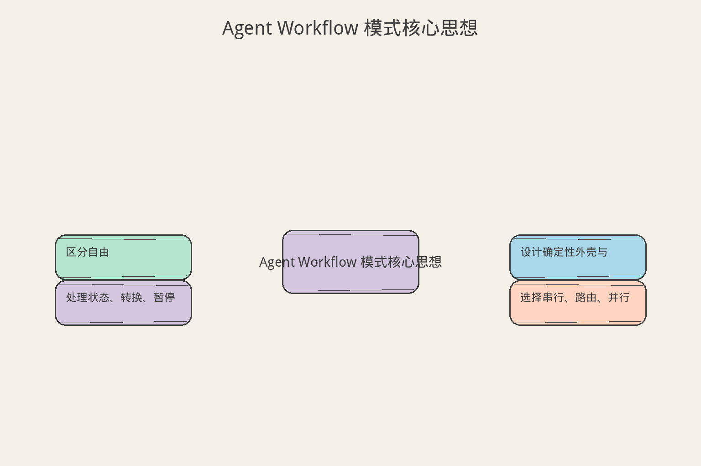
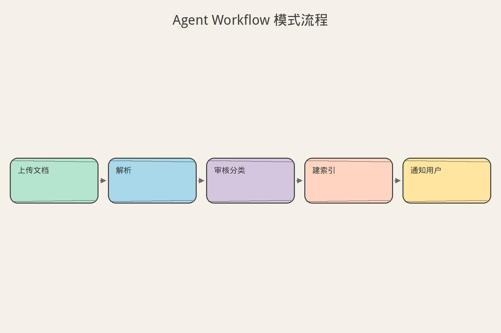
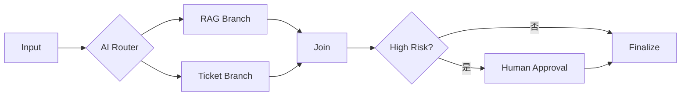
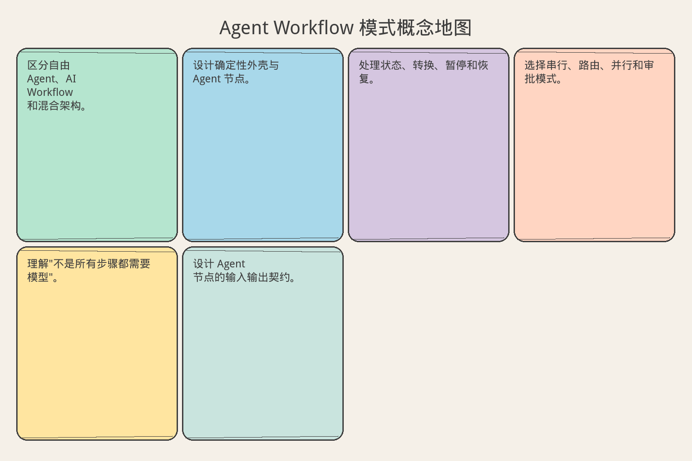

# AI Agent 工程（三十一）：Agent Workflow 模式

> 生产 Agent 通常不是一个无限自主循环，而是被放进确定性 Workflow：只有少数节点使用模型，其他节点由状态机、工具和人工确认控制。

**阅读建议：** 先阅读 [215 Agent vs RAG vs Workflow](215.agent-vs-rag-vs-workflow-tutorial.md)，理解三者的区别。

**环境要求：**
- Python **3.10+**
- 依赖：`pip install pydantic`

> **博客实践版**（系列链接、动手路径）：[`244-agent-workflow-patterns.md`](../src/posts/ai-ml/244-agent-workflow-patterns.md)

---

## 目录

1. [你会学到什么](#你会学到什么)
2. [它解决什么问题](#它解决什么问题)
3. [核心概念：确定性外壳 + Agent 节点](#核心概念确定性外壳--agent-节点)
4. [最小示例](#最小示例)
5. [工程化版本](#工程化版本)
6. [常见失败模式](#常见失败模式)
7. [什么时候不要这么做](#什么时候不要这么做)
8. [生产环境注意事项](#生产环境注意事项)
9. [如何观测和评测](#如何观测和评测)
10. [和 RAG / 后端 / 前端的关系](#和-rag--后端--前端的关系)
11. [面试怎么讲](#面试怎么讲)
12. [下一步](#下一步)

## 你会学到什么

- 区分自由 Agent、AI Workflow 和混合架构。
- 设计确定性外壳与 Agent 节点。
- 处理状态、转换、暂停和恢复。
- 选择串行、路由、并行和审批模式。
- 理解"不是所有步骤都需要模型"。
- 设计 Agent 节点的输入输出契约。

## 它解决什么问题


读下图时，先看「Agent Workflow 模式核心思想」建立直觉。


### 企业任务的本质

企业任务往往既有确定步骤，也有语义判断：

```text
上传文档 → 解析 → 审核分类 → 建索引 → 通知用户
```

- 解析：确定性（调用解析器）
- 建索引：确定性（调用索引服务）
- 通知用户：确定性（发邮件/消息）
- **审核分类**：需要语义判断（模型）

让模型每次重新规划整个流程没有必要——90% 的步骤是固定的。

### 三种架构对比

| 架构 | 做法 | 适用场景 | 风险 |
|---|---|---|---|
| 自由 Agent | 模型决定所有步骤 | 探索性任务 | 不可控 |
| 纯 Workflow | 所有步骤固定 | 完全确定性流程 | 无法处理语义 |
| **混合架构** | 确定性外壳 + 少数 Agent 节点 | 企业生产 | 平衡可控和灵活 |

本模块统一术语：**State、Transition、Checkpoint、Resume、Human Approval**。

## 核心概念：确定性外壳 + Agent 节点

### 类比：工厂流水线

| 工厂 | Agent Workflow |
|---|---|
| 流水线骨架（传送带、工位） | 确定性外壳（State + Transition） |
| 质检员（需要判断） | Agent 节点（需要模型） |
| 固定机械臂（不需要判断） | 确定性节点（代码逻辑） |
| 主管审批（高风险操作） | Human Gate |

工厂不会让质检员决定"今天生产什么、怎么组装、发什么货"——这些是流水线设计好的。质检员只负责"这个产品合不合格"这一个判断。

### 为什么不让模型规划一切

```text
❌ 全交给模型：
   Prompt: "请处理用户上传的文档"
   模型: "我先解析...然后分类...然后索引...然后通知..."
   → 每次都要花 token 规划
   → 可能漏步骤
   → 可能改变顺序
   → 不可审计

✅ 确定性外壳：
   Workflow: 解析 → 分类 → 索引 → 通知（固定）
   只有"分类"这一步用模型
   → 省 token
   → 不会漏步骤
   → 顺序固定
   → 可审计
```

## 最小示例


读下图时，先看「Agent Workflow 模式流程」建立直觉。


### 状态定义

```python
from dataclasses import dataclass
from typing import Literal


Status = Literal[
    "created",              # 刚创建
    "classifying",          # 正在分类（Agent 节点）
    "indexing",             # 正在建索引（确定性节点）
    "waiting_for_approval", # 等待人工审批
    "completed",            # 完成
    "failed",               # 失败
]


@dataclass
class WorkflowState:
    """
    Workflow 状态：结构化、可持久化。
    
    关键设计：
    - status 是枚举（不是自由文本）
    - 每个字段有明确含义
    - 可以序列化为 JSON 存储
    """
    task_id: str
    status: Status
    document_id: str
    category: str | None = None    # Agent 节点的输出
    error: str | None = None       # 失败原因
```

### 状态转换

```python
def next_step(state: WorkflowState) -> WorkflowState:
    """
    确定性的状态转换逻辑。
    
    注意：这里没有模型调用！
    转换规则是代码写死的。
    模型只在 "classifying" 阶段被调用。
    """
    if state.status == "created":
        state.status = "classifying"
    elif state.status == "classifying" and state.category:
        state.status = "indexing"
    elif state.status == "indexing":
        state.status = "completed"
    return state
```

模型只参与 category 决策，不决定索引和通知顺序。

### 使用示例

```python
# 创建 workflow
state = WorkflowState(
    task_id="WF-001",
    status="created",
    document_id="doc-abc",
)

# 执行
state = next_step(state)  # → classifying
# 这里调用模型分类
state.category = classify_document(state.document_id)  # Agent 节点
state = next_step(state)  # → indexing
state = next_step(state)  # → completed

print(state.status)  # → "completed"
```

## 工程化版本

### 四种常用模式

| 模式 | 适合场景 | 示例 |
|---|---|---|
| Sequential | 固定顺序处理 | 解析→分类→索引→通知 |
| Router | 根据语义选择有限分支 | 问题分类→走不同处理线 |
| Parallel Read | 并行查询多个只读来源 | 同时查文档+订单+工单 |
| Human Gate | 高风险动作前暂停 | 退款>1000 需主管审批 |



### Agent 节点契约

每个 Agent 节点有明确输入、输出、工具和预算：

```json
{
  "node": "classify_request",
  "allowed_tools": [],
  "max_steps": 1,
  "output_schema": {
    "category": "billing | product | security",
    "confidence": "0..1"
  }
}
```

**为什么需要契约？**

```text
没有契约：
  Agent 节点可能调用任何工具、执行任何步骤、返回任何格式
  → 后续节点无法处理

有契约：
  输入：document_text (string, max 5000 chars)
  输出：{category: enum, confidence: float}
  工具：无（纯分类，不需要工具）
  预算：1 步（一次模型调用）
  → 后续节点知道期望什么格式
```

### Workflow 引擎

```python
class WorkflowEngine:
    """
    简单的 Workflow 引擎。
    
    职责：
    1. 按顺序执行节点
    2. 每个节点完成后保存 Checkpoint
    3. 失败时从 Checkpoint 恢复
    4. Human Gate 时暂停等待
    """

    def __init__(self, nodes: list[dict], checkpoint_store):
        self.nodes = nodes
        self.checkpoint_store = checkpoint_store

    def run(self, state: WorkflowState) -> WorkflowState:
        """执行 workflow，从当前状态继续。"""
        while state.status not in ("completed", "failed", "waiting_for_approval"):
            current_node = self._get_current_node(state.status)

            try:
                # 执行节点
                state = current_node["handler"](state)

                # 保存 checkpoint
                self.checkpoint_store.save(state)

                # 转换到下一状态
                state = self._transition(state)

            except Exception as e:
                state.status = "failed"
                state.error = str(e)
                self.checkpoint_store.save(state)
                break

        return state

    def resume(self, task_id: str) -> WorkflowState:
        """从 checkpoint 恢复执行。"""
        state = self.checkpoint_store.load(task_id)
        if state is None:
            raise ValueError(f"no_checkpoint: {task_id}")
        return self.run(state)
```

### Human Gate 实现

```python
def human_gate_node(state: WorkflowState) -> WorkflowState:
    """
    人工审批节点。
    
    高风险操作（如大额退款）需要人工确认。
    暂停 workflow，等待审批结果。
    
    关键：审批绑定不可变参数。
    审批通过后不能修改退款金额。
    """
    # 检查是否需要审批
    if state.refund_amount > 1000:
        state.status = "waiting_for_approval"
        # 保存待审批的参数（不可变）
        state.approval_params = {
            "amount": state.refund_amount,
            "reason": state.refund_reason,
            "order_id": state.order_id,
        }
        # 通知审批人
        notify_approver(state)
    else:
        # 低风险，直接通过
        state.status = "approved"

    return state
```

## 常见失败模式

### 1. 把整个 Workflow 塞进一个 Agent prompt

```text
❌ Prompt: "你是文档处理助手。请执行以下步骤：
   1. 解析文档
   2. 分类
   3. 建索引
   4. 通知用户
   请一步步执行。"

问题：
- 模型可能跳过步骤
- 模型可能改变顺序
- 每次都要花 token "规划"
- 不可审计
```

### 2. State 只有自由文本，无法做 Transition

```python
# ❌ 自由文本状态
state = {"notes": "文档已经分类完了，接下来要索引"}
# 无法用代码判断当前在哪一步

# ✅ 结构化状态
state = WorkflowState(status="indexing", category="billing")
# 代码可以精确判断和转换
```

### 3. 失败后从头重跑所有节点

```text
步骤 1-4 成功，步骤 5 失败
❌ 从步骤 1 重新开始（浪费）
✅ 从步骤 5 的 checkpoint 恢复
```

### 4. 并行执行共享写资源

```text
❌ 并行节点 A 和 B 都写同一个数据库记录
   → 竞态条件

✅ 并行只做只读操作，写操作在 Join 之后串行执行
```

### 5. Human Approval 后重新生成参数

```text
审批人批准了"退款 500 元"
❌ 审批通过后，模型重新生成参数 → "退款 800 元"
✅ 审批通过后，使用审批时绑定的不可变参数
```

### 6. Workflow 版本升级后旧任务无法 Resume

```text
v1: created → classifying → indexing → completed
v2: created → classifying → reviewing → indexing → completed

旧任务在 v1 的 "classifying" 暂停了
升级后用 v2 恢复 → 找不到 "classifying" 的下一步
→ 需要版本兼容处理
```

## 什么时候不要这么做

**极简单的单次问答不需要 Workflow。**

```text
"今天天气怎么样？" → 直接回答，不需要状态机
```

**流程完全动态、无法定义任何稳定节点时，可先做只读 Agent PoC，但仍需要停止条件。**

```text
探索性研究任务 → 可以用自由 Agent
但也要有预算限制和停止条件
```

**不要把"用图框架"误认为已经获得可靠执行；持久化和幂等仍需实现。**

```text
LangGraph 画了漂亮的图 ≠ 生产可靠
还需要：checkpoint、幂等、超时、重试、监控
```

## 生产环境注意事项

- State 使用结构化 schema 和 version（不是自由文本）。
- 每个 Transition 都有允许来源和目标（不允许任意跳转）。
- 节点完成后保存 Checkpoint（支持断点恢复）。
- Resume 读取原 Workflow 版本（版本兼容）。
- 写节点使用幂等键（重试不重复执行）。
- Human Approval 绑定不可变参数（审批后不能改）。
- 节点超时独立设置（Agent 节点可能比确定性节点慢）。
- Workflow 定义变更需要版本管理（不能直接改）。

## 如何观测和评测

指标：

| 指标 | 含义 | 健康范围 |
|---|---|---|
| 各节点成功率 | 每个节点的成功比例 | > 99% |
| 各节点 P95 延迟 | 每个节点的耗时 | Agent < 5s，确定性 < 500ms |
| Transition 失败率 | 状态转换失败的比例 | < 0.1% |
| Checkpoint 写入失败 | 保存失败的比例 | < 0.01% |
| Resume 成功率 | 恢复执行的成功比例 | > 99% |
| Human Approval 等待时间 | 审批等待时长 | < 24h |
| Agent 节点增益 | 相比规则节点的准确率提升 | > 10% |

## 和 RAG / 后端 / 前端的关系

- RAG 作为只读节点或工具（Workflow 中的一个检索步骤）。
- 后端 Workflow 管理 State 和 Transition（核心逻辑在后端）。
- 前端展示节点进度、等待和失败（用户看到"正在分类..."）。
- Agent 节点只处理语义不确定性（分类、摘要、判断）。

## 面试怎么讲

> 生产 Agent 常用确定性 Workflow 包裹模型节点。State 和 Transition 由后端定义，Agent 节点有明确输入输出、工具白名单和预算；节点后写 Checkpoint，Human Approval 时暂停，Resume 使用原版本和批准参数。固定流程不让模型重复规划。

## 初学者常见疑问

### Workflow 和 Agent 自由规划有什么区别？

这是初学者最容易混淆的概念：

```text
Agent 自由规划：
  LLM 自己决定下一步做什么
  → 灵活，但不可控
  → 适合探索性任务（研究、开放问答）

确定性 Workflow：
  开发者预定义步骤顺序，LLM 只在特定节点内工作
  → 可控，可预测，可审计
  → 适合生产流程（审批、客服、数据处理）

类比：
  自由规划 = 让实习生自己决定怎么做
  Workflow = 给实习生一份 SOP，他只在每一步里发挥
```

生产环境大多数场景用 Workflow，因为你需要可预测性和可审计性。

### 为什么 Agent 节点要有工具白名单？

```text
没有白名单：
  Agent 节点可能调用任何工具
  → 分类节点突然调用了 delete_user
  → 摘要节点突然调用了 send_email
  → 不可控、不可审计

有白名单：
  分类节点只能用 [classify, search_kb]
  摘要节点只能用 [extract, summarize]
  → 每个节点的权限边界清晰
  → 出问题能快速定位
```

这就是"最小权限原则"在 Agent 工程中的应用。

## 完整运行示例

```python
from enum import Enum


class NodeStatus(Enum):
    PENDING = "pending"
    RUNNING = "running"
    DONE = "done"
    FAILED = "failed"


class SimpleWorkflow:
    """教学用的确定性 Workflow 引擎。"""

    def __init__(self, workflow_id: str, nodes: list[str]):
        self.workflow_id = workflow_id
        self.nodes = nodes
        self.state: dict[str, NodeStatus] = {
            n: NodeStatus.PENDING for n in nodes
        }
        self.results: dict[str, str] = {}

    def execute_node(self, node_name: str) -> str:
        """模拟执行一个节点。"""
        # 实际生产中，这里可能是：
        # - 确定性节点：规则引擎、数据库查询
        # - Agent 节点：LLM 调用（有工具白名单和预算）
        return f"{node_name}_result"

    def run(self) -> None:
        """按顺序执行所有节点。"""
        print(f"=== Workflow [{self.workflow_id}] 开始 ===")

        for node in self.nodes:
            self.state[node] = NodeStatus.RUNNING
            print(f"  → 执行节点: {node}")

            try:
                result = self.execute_node(node)
                self.results[node] = result
                self.state[node] = NodeStatus.DONE
                print(f"    ✓ 完成: {result}")
            except Exception as e:
                self.state[node] = NodeStatus.FAILED
                print(f"    ✗ 失败: {e}")
                break  # 失败后停止（不继续后续节点）

        # 打印最终状态
        print(f"\n最终状态:")
        for node, status in self.state.items():
            icon = "✓" if status == NodeStatus.DONE else "○"
            print(f"  {icon} {node}: {status.value}")


def demo_workflow():
    """演示一个客服工单处理 Workflow。"""
    workflow = SimpleWorkflow(
        workflow_id="WF-ticket-001",
        nodes=[
            "validate_input",       # 确定性：校验输入格式
            "classify_intent",      # Agent 节点：意图分类
            "search_knowledge",     # 确定性：检索知识库
            "generate_response",    # Agent 节点：生成回复
            "quality_check",        # 确定性：质量检查
        ],
    )
    workflow.run()


if __name__ == "__main__":
    demo_workflow()
```

运行输出：

```text
=== Workflow [WF-ticket-001] 开始 ===
  → 执行节点: validate_input
    ✓ 完成: validate_input_result
  → 执行节点: classify_intent
    ✓ 完成: classify_intent_result
  → 执行节点: search_knowledge
    ✓ 完成: search_knowledge_result
  → 执行节点: generate_response
    ✓ 完成: generate_response_result
  → 执行节点: quality_check
    ✓ 完成: quality_check_result

最终状态:
  ✓ validate_input: done
  ✓ classify_intent: done
  ✓ search_knowledge: done
  ✓ generate_response: done
  ✓ quality_check: done
```

注意：节点顺序是开发者预定义的，不是 LLM 自己决定的。Agent 节点（classify_intent、generate_response）只在各自的"格子"里工作。

## 博客版补充

博客实践版 [`244-agent-workflow-patterns.md`](../src/posts/ai-ml/244-agent-workflow-patterns.md) 含 7 种模式完整代码、决策树与组合实战（代码审查 Agent）。

## 下一步


读下图时，先看「Agent Workflow 模式概念地图」建立直觉。


下一篇 [245 状态机 Agent](245.state-machine-agent-tutorial.md) 会把状态和转换规则设计得更严格。
