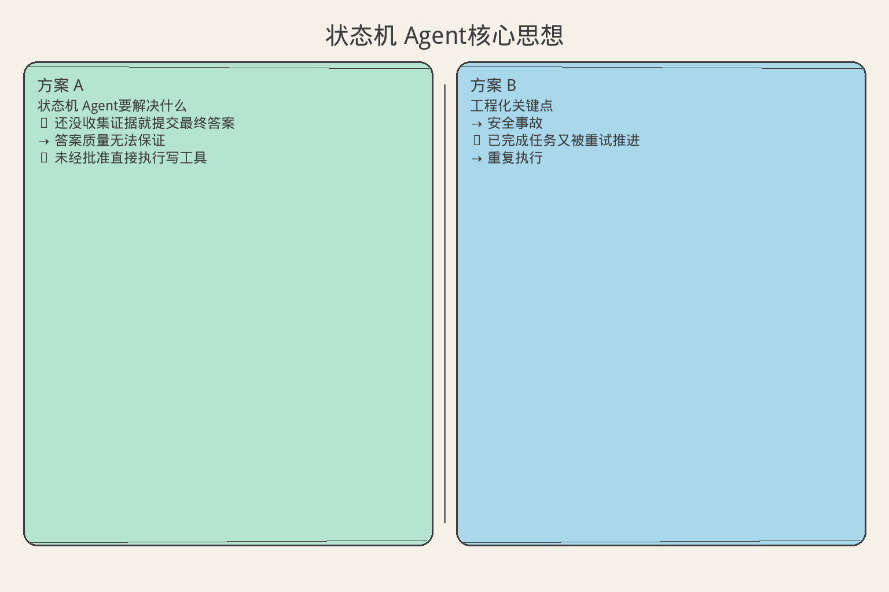
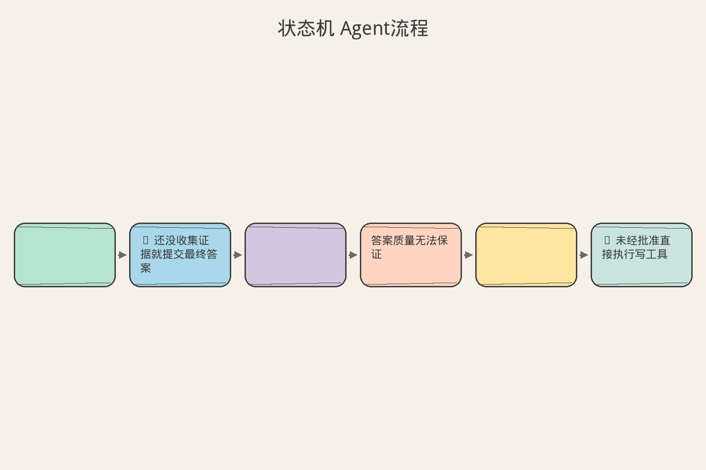

# AI Agent 工程（三十二）：状态机 Agent

> 状态机把"现在能做什么"变成确定性规则。模型可以建议事件，但只有合法 Transition 才能推进任务。

**阅读建议：** 先阅读 [244 Agent Workflow 模式](244.agent-workflow-patterns-tutorial.md)，理解 Workflow 中状态管理的位置。

**环境要求：**
- Python **3.10+**
- 依赖：`pip install pydantic`

> **博客实践版**（系列链接、动手路径）：[`245-state-machine-agent.md`](../src/posts/ai-ml/245-state-machine-agent.md)

---

## 目录

1. [你会学到什么](#你会学到什么)
2. [它解决什么问题](#它解决什么问题)
3. [核心概念：状态机 vs 自由控制流](#核心概念状态机-vs-自由控制流)
4. [最小示例](#最小示例)
5. [工程化版本](#工程化版本)
6. [常见失败模式](#常见失败模式)
7. [什么时候不要这么做](#什么时候不要这么做)
8. [生产环境注意事项](#生产环境注意事项)
9. [如何观测和评测](#如何观测和评测)
10. [和 RAG / 后端 / 前端的关系](#和-rag--后端--前端的关系)
11. [面试怎么讲](#面试怎么讲)
12. [下一步](#下一步)

## 你会学到什么

- 设计任务 State 与事件。
- 建立 Transition 白名单和守卫条件。
- 防止非法跳转和并发覆盖。
- 用状态机承载审批和恢复。
- 理解"模型建议事件，后端决定转换"。
- 使用乐观锁防止并发冲突。

## 它解决什么问题


读下图时，先看「状态机 Agent核心思想」建立直觉。


### 没有状态机时的混乱

没有状态机时，Agent 可能：

```text
❌ 还没收集证据就提交最终答案
   → 答案质量无法保证

❌ 未经批准直接执行写工具
   → 安全事故

❌ 已完成任务又被重试推进
   → 重复执行

❌ 两个 worker 同时执行下一步
   → 竞态条件
```

### 状态机解决什么

```text
状态机的核心价值：

1. 约束：不是任何事都能在任何时候做
   → "completed 状态不能再接收事件"

2. 可见：当前在哪一步，能做什么
   → "当前是 waiting_approval，只能 approve 或 cancel"

3. 可审计：每次转换都有记录
   → "什么时候从 running 变成 completed 的？谁触发的？"

4. 可恢复：知道当前状态就能继续
   → "进程重启后，读取状态，从断点继续"
```

统一术语：**State、Transition、Checkpoint、Resume、Human Approval**。

## 核心概念：状态机 vs 自由控制流

### 类比：交通信号灯

| 特征 | 自由控制流 | 状态机 |
|---|---|---|
| 类比 | 没有信号灯的路口 | 有信号灯的路口 |
| 规则 | "谁胆子大谁先走" | "红灯停、绿灯行" |
| 冲突 | 随时可能撞车 | 按规则不会冲突 |
| 可预测 | 不知道下一步 | 知道当前能做什么 |

状态机就是给 Agent 任务装上"信号灯"——不是任何时候都能做任何事。

### 模型与状态机的关系

```text
❌ 模型直接控制状态：
   模型: "我觉得任务完成了" → state = "completed"
   → 模型可能判断错误

✅ 模型建议事件，后端决定转换：
   模型: "我建议标记为完成"（提出 GoalVerified 事件）
   后端: 检查 Guard（证据够吗？引用验证了吗？）
   → Guard 通过 → 转换到 completed
   → Guard 不通过 → 拒绝转换，继续 running
```

**模型是"建议者"，状态机是"决策者"。**

## 最小示例


读下图时，先看「状态机 Agent流程」建立直觉。


### 状态和转换定义

```python
from enum import StrEnum


class State(StrEnum):
    """
    任务状态枚举。
    
    设计原则：
    - 使用业务含义（不是技术步骤）
    - 终态（completed/failed/cancelled）不能再转换
    - 状态数量控制在 5-8 个
    """
    CREATED = "created"                    # 刚创建
    RUNNING = "running"                    # 执行中
    WAITING_APPROVAL = "waiting_approval"  # 等待审批
    COMPLETED = "completed"                # 完成（终态）
    FAILED = "failed"                      # 失败（终态）
    CANCELLED = "cancelled"                # 取消（终态）


# 转换白名单：从某状态只能到哪些状态
ALLOWED_TRANSITIONS = {
    State.CREATED: {State.RUNNING, State.CANCELLED},
    State.RUNNING: {
        State.WAITING_APPROVAL,
        State.COMPLETED,
        State.FAILED,
        State.CANCELLED,
    },
    State.WAITING_APPROVAL: {
        State.RUNNING,      # 审批通过，继续执行
        State.CANCELLED,    # 审批拒绝，取消
    },
    # 终态：不能转换到任何状态
    State.COMPLETED: set(),
    State.FAILED: set(),
    State.CANCELLED: set(),
}


def transition(current: State, target: State) -> State:
    """
    执行状态转换。
    
    只允许白名单中的转换。
    非法转换直接报错（不是静默忽略）。
    """
    if target not in ALLOWED_TRANSITIONS[current]:
        raise ValueError(f"illegal_transition:{current}->{target}")
    return target
```

### 使用示例

```python
# 正常流程
state = State.CREATED
state = transition(state, State.RUNNING)       # ✓ 合法
state = transition(state, State.COMPLETED)     # ✓ 合法

# 非法操作
state = State.COMPLETED
try:
    transition(state, State.RUNNING)           # ✗ 终态不能转换
except ValueError as e:
    print(e)  # → "illegal_transition:completed->running"

# 跳步
state = State.CREATED
try:
    transition(state, State.COMPLETED)         # ✗ 不能跳过 RUNNING
except ValueError as e:
    print(e)  # → "illegal_transition:created->completed"
```

## 工程化版本

### 事件驱动 Transition

```text
事件 → 转换：

TaskCreated           → created → running
HighRiskActionProposed → running → waiting_approval
ApprovalGranted       → waiting_approval → running
ApprovalDenied        → waiting_approval → cancelled
GoalVerified          → running → completed
ErrorOccurred         → running → failed
UserCancelled         → (any non-terminal) → cancelled
```

模型不能直接写 `state=completed`，只能提出 `GoalVerified` 候选，由后端检查产物。

```python
class Event(StrEnum):
    """事件枚举：触发状态转换的原因。"""
    TASK_CREATED = "task_created"
    HIGH_RISK_PROPOSED = "high_risk_proposed"
    APPROVAL_GRANTED = "approval_granted"
    APPROVAL_DENIED = "approval_denied"
    GOAL_VERIFIED = "goal_verified"
    ERROR_OCCURRED = "error_occurred"
    USER_CANCELLED = "user_cancelled"


# 事件 → (当前状态, 目标状态) 的映射
EVENT_TRANSITIONS = {
    Event.TASK_CREATED: (State.CREATED, State.RUNNING),
    Event.HIGH_RISK_PROPOSED: (State.RUNNING, State.WAITING_APPROVAL),
    Event.APPROVAL_GRANTED: (State.WAITING_APPROVAL, State.RUNNING),
    Event.APPROVAL_DENIED: (State.WAITING_APPROVAL, State.CANCELLED),
    Event.GOAL_VERIFIED: (State.RUNNING, State.COMPLETED),
    Event.ERROR_OCCURRED: (State.RUNNING, State.FAILED),
}


def apply_event(current: State, event: Event) -> State:
    """
    应用事件，执行状态转换。
    
    模型只能提出事件，这个函数由后端调用。
    """
    if event == Event.USER_CANCELLED:
        # 取消可以从任何非终态触发
        if current in (State.COMPLETED, State.FAILED, State.CANCELLED):
            raise ValueError("cannot_cancel_terminal")
        return State.CANCELLED

    expected_from, target = EVENT_TRANSITIONS[event]
    if current != expected_from:
        raise ValueError(f"event_not_applicable:{event} in {current}")

    return transition(current, target)
```

### Guard（守卫条件）

```python
def can_complete(task: AgentTask) -> bool:
    """
    Guard：转换到 completed 之前必须满足的条件。
    
    即使模型提出了 GoalVerified 事件，
    如果 Guard 不通过，转换也不会发生。
    """
    return (
        task.required_outputs_present      # 必要输出都存在
        and task.citations_verified        # 引用已验证
        and task.pending_approval is None  # 没有待审批项
    )


def apply_event_with_guard(task: AgentTask, event: Event) -> State:
    """带 Guard 的事件应用。"""
    # 先检查 Guard
    if event == Event.GOAL_VERIFIED and not can_complete(task):
        raise ValueError("guard_failed: cannot complete")

    # Guard 通过，执行转换
    return apply_event(task.state, event)
```

### 乐观锁

```sql
UPDATE agent_task
SET state = :new_state, version = version + 1
WHERE task_id = :task_id
  AND version = :expected_version;
```

更新行数为 0 表示其他 worker 已推进，当前执行者必须停止并重新加载。

```python
def transition_with_lock(task_id: str, new_state: State, expected_version: int) -> bool:
    """
    带乐观锁的状态转换。
    
    为什么需要？
    两个 worker 可能同时尝试推进同一个任务。
    乐观锁确保只有一个成功。
    
    返回 True 表示转换成功，False 表示冲突。
    """
    rows_affected = db.execute(
        """
        UPDATE agent_task
        SET state = :new_state, version = version + 1
        WHERE task_id = :task_id AND version = :expected_version
        """,
        {"new_state": new_state, "task_id": task_id, "expected_version": expected_version},
    )

    if rows_affected == 0:
        # 冲突：其他 worker 已经推进了
        return False

    return True
```

### 子状态

不要为每个工具创建全局状态。工具调用细节放在 step status，任务只保留业务级状态：

```python
# ❌ 全局状态过于细粒度
class BadState(StrEnum):
    CALLING_TOOL_A = "calling_tool_a"
    TOOL_A_RETURNED = "tool_a_returned"
    CALLING_TOOL_B = "calling_tool_b"
    # ... 每加一个工具就要加状态

# ✅ 业务级状态 + 步骤级状态
class TaskState(StrEnum):
    RUNNING = "running"  # 任务级：只知道"在执行中"

class StepState(StrEnum):
    PENDING = "pending"
    EXECUTING = "executing"
    DONE = "done"
    FAILED = "failed"

# 任务状态是 RUNNING，具体哪个工具在跑看 step_status
```

## 常见失败模式

### 1. State 名称描述技术步骤而非业务阶段

```text
❌ parsing_document, calling_api, writing_db
   → 太细粒度，每改一个工具就要改状态机

✅ created, running, waiting_approval, completed
   → 业务级，不随技术实现变化
```

### 2. 任意状态都能跳 completed

```text
❌ ALLOWED_TRANSITIONS = {
       "created": {"completed"},  # 刚创建就能完成？
       "running": {"completed"},
   }

✅ 必须经过 Guard 检查才能到 completed
```

### 3. 没有 Guard

```text
模型: "GoalVerified"
❌ 直接转换到 completed（不检查证据够不够）
✅ 先检查 can_complete()，通过才转换
```

### 4. 状态更新和副作用不一致

```text
状态改成 completed 了，但通知邮件没发出去
→ 用户不知道任务完成了

修复：状态更新和事件发布在同一个事务中（outbox 模式）
```

### 5. Resume 后重复消费旧事件

```text
进程重启后，从消息队列重新读取事件
→ 同一个 GoalVerified 事件被处理两次
→ 需要事件去重（幂等消费）
```

### 6. Human Approval 被记录为普通聊天消息

```text
❌ 审批结果是一条聊天消息："好的，我批准了"
   → 无法用代码判断是否已审批

✅ 审批是正式的状态转换事件：ApprovalGranted
   → 有明确的时间戳、审批人、参数
```

## 什么时候不要这么做

**只有一个同步步骤的操作不需要复杂状态机。**

```text
"翻译这句话" → 直接调用模型，不需要状态机
```

**不要把每个 if 都升级成状态；只建模需要持久化、恢复、审计的生命周期阶段。**

```text
❌ if parsing: ... elif indexing: ... elif notifying: ...
   每个都做成状态 → 过度设计

✅ 只有需要"暂停-恢复"或"人工介入"的节点才需要状态
```

## 生产环境注意事项

- State 和事件使用稳定枚举（不能是自由文本）。
- Transition 在后端集中校验（不信任客户端或模型）。
- 状态更新、outbox 事件和业务副作用保持一致性。
- 每个 Checkpoint 保存 state_version（支持乐观锁）。
- Resume 前重新加载最新版本（不用内存中的旧版本）。
- Human Approval 是正式状态，不是 prompt 文本。
- 终态（completed/failed/cancelled）拒绝一切事件。
- 状态变更日志保留（审计需要）。

## 如何观测和评测

监控：

| 指标 | 含义 | 告警条件 |
|---|---|---|
| 各 State 任务数 | 当前分布 | waiting_approval > 100 |
| 非法 Transition 次数 | 被拒绝的转换 | > 0（说明有 bug） |
| 状态停留时间 | 在某状态多久 | running > 1h |
| 乐观锁冲突 | 并发冲突次数 | 频繁 → 需要调整 |
| waiting_approval 超时 | 审批等待过久 | > 24h |
| completed 后仍收到事件 | 终态后还有事件 | > 0（说明有 bug） |

## 和 RAG / 后端 / 前端的关系

- RAG 结果更新 evidence，不直接改变最终 State（检索不决定完成）。
- 后端状态机是权威（所有转换由后端校验）。
- 前端根据 State 渲染进度和可用操作（如 waiting_approval 时显示审批按钮）。
- Resume 从 Checkpoint 和 State 恢复，不重放聊天猜状态。

## 面试怎么讲

> 模型只能提出事件，后端状态机校验 Transition 和 Guard。任务使用业务级 State，工具步骤有自己的 step status。状态更新带 version 做乐观锁，并通过 outbox 保证事件一致性。Human Approval 是 waiting 状态，批准后 Resume 而不是重新规划参数。

## 初学者常见疑问

### 状态机和 if-else 有什么区别？

初学者可能觉得"我用 if-else 也能控制流程，为什么需要状态机？"

```text
if-else 的问题：
  状态多了之后，if-else 变成"意大利面条"代码
  很难回答："从状态 X 能到哪些状态？"
  很容易漏掉某个分支（bug）
  新人看不懂（没有全局视图）

状态机的优势：
  所有合法转换明确定义（一张表就能看全）
  非法转换自动拒绝（不用写防御代码）
  可以画图（可视化流程）
  新人 5 分钟就能理解整个流程

类比：
  if-else = 口头约定"红灯停绿灯行"
  状态机 = 写成交通法规 + 违章自动罚款
```

### 什么是"乐观锁"？

```text
场景：两个 worker 同时处理同一个任务

没有锁：
  Worker A 读取 state=running (version=5)
  Worker B 读取 state=running (version=5)
  Worker A 写入 state=completed (version=6)
  Worker B 写入 state=failed (version=6)  ← 覆盖了 A 的结果！

乐观锁：
  Worker A 读取 state=running (version=5)
  Worker B 读取 state=running (version=5)
  Worker A 写入: UPDATE ... SET version=6 WHERE version=5  ✓
  Worker B 写入: UPDATE ... SET version=6 WHERE version=5  ✗ (0 rows)
  → Worker B 发现冲突，重新加载最新状态

"乐观"的含义：先假设不会冲突，写入时再检查。
比悲观锁（先加锁再操作）性能更好。
```

## 完整运行示例

```python
from enum import Enum


class TaskState(Enum):
    CREATED = "created"
    RUNNING = "running"
    WAITING_APPROVAL = "waiting_approval"
    COMPLETED = "completed"
    FAILED = "failed"
    CANCELLED = "cancelled"


# 合法转换表（状态机的核心）
TRANSITIONS: dict[TaskState, set[TaskState]] = {
    TaskState.CREATED: {TaskState.RUNNING, TaskState.CANCELLED},
    TaskState.RUNNING: {TaskState.WAITING_APPROVAL, TaskState.COMPLETED,
                        TaskState.FAILED, TaskState.CANCELLED},
    TaskState.WAITING_APPROVAL: {TaskState.RUNNING, TaskState.CANCELLED},
    TaskState.COMPLETED: set(),   # 终态：不能转换
    TaskState.FAILED: set(),      # 终态
    TaskState.CANCELLED: set(),   # 终态
}


class StateMachine:
    """教学用的状态机。"""

    def __init__(self, task_id: str):
        self.task_id = task_id
        self.state = TaskState.CREATED
        self.version = 1
        self.history: list[str] = ["created"]

    def transition(self, target: TaskState) -> bool:
        """尝试状态转换。"""
        allowed = TRANSITIONS.get(self.state, set())

        if target not in allowed:
            print(f"  [拒绝] {self.state.value} → {target.value} 不合法")
            return False

        old = self.state
        self.state = target
        self.version += 1
        self.history.append(target.value)
        print(f"  [转换] {old.value} → {target.value} (v{self.version})")
        return True


def demo_state_machine():
    """演示状态机的核心价值。"""
    sm = StateMachine("TASK-SM-01")

    print("=== 状态机演示 ===")
    print(f"初始状态: {sm.state.value}")

    # 正常流程
    print("\n--- 正常流程 ---")
    sm.transition(TaskState.RUNNING)
    sm.transition(TaskState.WAITING_APPROVAL)
    sm.transition(TaskState.RUNNING)       # 审批通过，继续执行
    sm.transition(TaskState.COMPLETED)

    # 非法转换
    print("\n--- 非法转换（终态后不能操作） ---")
    sm.transition(TaskState.RUNNING)       # 拒绝！
    sm.transition(TaskState.CANCELLED)     # 拒绝！

    print(f"\n最终状态: {sm.state.value} (v{sm.version})")
    print(f"历史: {' → '.join(sm.history)}")


if __name__ == "__main__":
    demo_state_machine()
```

运行输出：

```text
=== 状态机演示 ===
初始状态: created

--- 正常流程 ---
  [转换] created → running (v2)
  [转换] running → waiting_approval (v3)
  [转换] waiting_approval → running (v4)
  [转换] running → completed (v5)

--- 非法转换（终态后不能操作） ---
  [拒绝] completed → running 不合法
  [拒绝] completed → cancelled 不合法

最终状态: completed (v5)
历史: created → running → waiting_approval → running → completed
```

注意：终态（completed）后任何转换都被拒绝——这就是状态机比 if-else 更安全的原因。

## 博客版补充

博客实践版 [`245-state-machine-agent.md`](../src/posts/ai-ml/245-state-machine-agent.md) 含转换条件/on_enter 钩子说明、RAG 状态机与客服工单实战。

## 下一步


读下图时，先看「状态机 Agent概念地图」建立直觉。


下一篇 [246 Checkpoint 与 Resume](246.agent-checkpoint-resume-tutorial.md) 会保存足够状态，让任务在进程重启和人工等待后可靠恢复。
