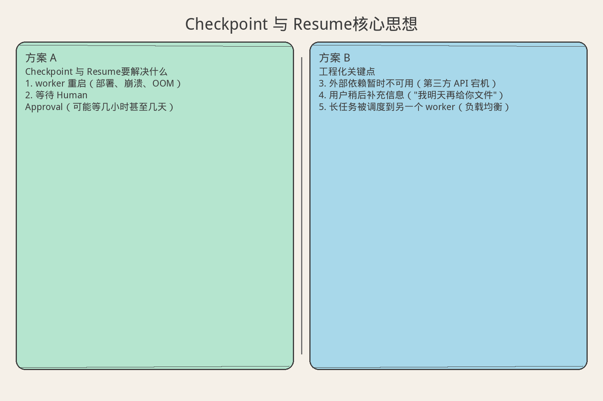
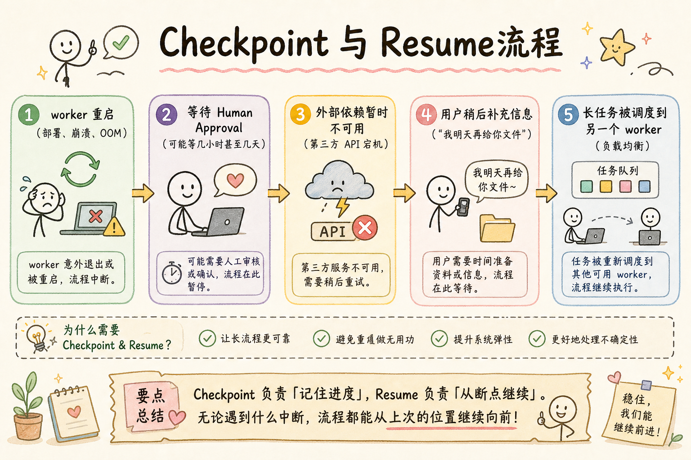
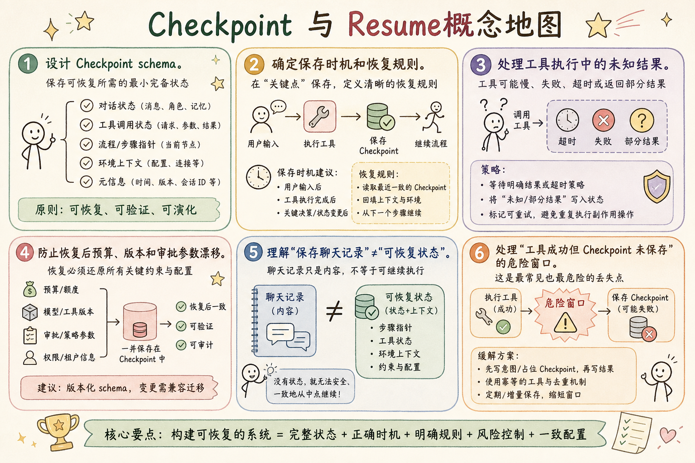

# AI Agent 工程（三十三）：Checkpoint 与 Resume

> Checkpoint 的目标不是保存一份聊天记录，而是保存能安全恢复执行的最小完整状态。

**阅读建议：** 先阅读 [245 状态机 Agent](245.state-machine-agent-tutorial.md)，理解状态转换和乐观锁。


> **系列导读：** [Agent/RAG 工程系列 238–254](../src/posts/ai-ml/agent-rag-series-238-254.md) · [`examples/rag-agent-lab`](../examples/rag-agent-lab/)

**环境要求：**
- Python **3.10+**
- 依赖：`pip install pydantic`

> **博客实践版**（系列链接、动手路径）：[`246-agent-checkpoint-resume.md`](../src/posts/ai-ml/246-agent-checkpoint-resume.md)


**档位：** 收束篇（Part 6）
**本文边界：** 前驱篇 [245](245.state-machine-agent-tutorial.md) 长流程 FSM。本篇 checkpoint save/load。不讲跨机房容灾。接续 [247](247.durable-agent-execution-tutorial.md)。
**动手路径：** ① 读 checkpoint 字段 → ② 运行 `demo_checkpoint()` → ③ 对照 §旧写法表

### 核心术语（本篇首次出现）
**Checkpoint**（检查点）：持久化 Agent 中间状态以便恢复。
通俗说：游戏存档点。
**状态机**（State Machine）：用有限状态与转移约束 Agent 行为。
通俗说：红绿灯，不能随意乱跳。
**恢复点**（Resume Point）：从 checkpoint 继续执行时的步骤与预算快照。
通俗说：读档后从哪一步接着干。
---

## 目录

1. [你会学到什么](#你会学到什么)
2. [它解决什么问题](#它解决什么问题)
3. [核心概念：最小完整状态](#核心概念最小完整状态)
4. [最小示例](#最小示例)
5. [工程化版本](#工程化版本)
6. [常见失败模式](#常见失败模式)
7. [什么时候不要这么做](#什么时候不要这么做)
8. [生产环境注意事项](#生产环境注意事项)
9. [如何观测和评测](#如何观测和评测)
10. [和 RAG / 后端 / 前端的关系](#和-rag--后端--前端的关系)
11. [面试怎么讲](#面试怎么讲)
12. [下一步](#下一步)

## 你会学到什么

- 设计 Checkpoint schema。
- 确定保存时机和恢复规则。
- 处理工具执行中的未知结果。
- 防止恢复后预算、版本和审批参数漂移。
- 理解"保存聊天记录"≠"可恢复状态"。
- 处理"工具成功但 Checkpoint 未保存"的危险窗口。

## 它解决什么问题


读下图时，先看「Checkpoint 与 Resume核心思想」建立直觉。


对照上图：Checkpoint 是游戏存档——要能恢复步骤、预算与工具结果，不只存聊天。

读下图时，先看能力边界与痛点流程——与 §最小示例 代码互补，不是逐步对照。


对照上图：Checkpoint 保存步骤/预算/工具结果——只存聊天记录无法恢复执行位置。
### 任务暂停的五种原因

任务可能因这些原因暂停：

```text
1. worker 重启（部署、崩溃、OOM）
2. 等待 Human Approval（可能等几小时甚至几天）
3. 外部依赖暂时不可用（第三方 API 宕机）
4. 用户稍后补充信息（"我明天再给你文件"）
5. 长任务被调度到另一个 worker（负载均衡）
```

### 没有 Checkpoint 的后果

```text
场景：Agent 执行到第 3 步（共 5 步），worker 崩溃重启

没有 Checkpoint：
→ 从头开始（第 1 步重新执行）
→ 浪费前 3 步的计算和 API 调用
→ 如果第 2 步是写操作（如创建订单），可能重复创建！

有 Checkpoint：
→ 从第 3 步继续
→ 前 2 步的结果已保存
→ 写操作有幂等键，不会重复
```

统一术语：**State、Transition、Checkpoint、Resume、Human Approval**。

## 核心概念：最小完整状态

### 类比：游戏存档

| 游戏存档 | Agent Checkpoint |
|---|---|
| 保存角色位置、血量、装备 | 保存任务状态、证据、工具结果 |
| 不保存整个游戏世界 | 不保存整个聊天记录 |
| 读档后从存档点继续 | Resume 后从 Checkpoint 继续 |
| 存档损坏 → 无法读档 | Checkpoint 不完整 → 无法安全恢复 |

**关键：存档要"刚好够"——太少恢复不了，太多浪费空间。**

### 聊天记录 vs 结构化 Checkpoint

```text
❌ 只保存聊天记录：
   messages = [
       {"role": "user", "content": "帮我处理退款"},
       {"role": "assistant", "content": "好的，我先查订单..."},
       {"role": "tool", "content": "{order: ...}"},
   ]
   问题：
   - 不知道当前在哪一步
   - 不知道预算还剩多少
   - 不知道哪些工具已经调用过
   - 模型可能从聊天记录"猜"出错误状态

✅ 结构化 Checkpoint：
   {
       "state": "running",
       "current_step": 3,
       "remaining_budget": 2,
       "completed_tools": {"get_order": {...}},
       "evidence_ids": ["ev-001", "ev-002"],
   }
   → 精确、可验证、不依赖模型解读
```

## 最小示例

**演示什么：** 本节最小可运行切片。**环境：** 见文首。**预期：** 控制台打印 demo 输出。

### Checkpoint 结构

```python
from pydantic import BaseModel, Field


class Checkpoint(BaseModel):
    """
    Checkpoint：能安全恢复执行的最小完整状态。
    
    设计原则：
    1. 结构化（不是自由文本）
    2. 最小化（只保存恢复必需的）
    3. 带版本（支持兼容性检查）
    4. 可序列化（能存到数据库）
    """
    task_id: str                    # 任务标识
    state: str                      # 当前状态
    state_version: int              # 状态版本（乐观锁）
    workflow_version: str           # Workflow 版本（兼容性）
    current_step: int               # 当前步骤
    remaining_steps: int            # 剩余预算
    evidence_ids: list[str] = Field(default_factory=list)  # 已收集证据
    completed_tool_calls: dict[str, dict] = Field(default_factory=dict)  # 已完成工具
    pending_approval_id: str | None = None  # 待审批 ID
```

### Resume 逻辑

```python
def resume(task_id: str) -> AgentTask:
    """
    从 Checkpoint 恢复执行。
    
    恢复前的检查：
    1. Workflow 版本兼容吗？
    2. 有没有其他 worker 已经在执行？
    3. 任务有没有被取消？
    4. 审批有没有过期？
    """
    # 加载最新 Checkpoint
    checkpoint = checkpoint_store.latest(task_id)

    # 检查 Workflow 版本兼容性
    verify_workflow_compatibility(checkpoint.workflow_version)

    # 检查是否有活跃 worker（防止重复执行）
    verify_no_active_worker(task_id, checkpoint.state_version)

    # 从 Checkpoint 重建任务
    return AgentTask.from_checkpoint(checkpoint)
```

## 工程化版本

### 保存时机

至少在这些边界保存：

```text
1. 工具调用成功后        ← 记录结果，避免重复调用
2. 高风险工具执行前      ← 如果执行中崩溃，知道"准备执行"但"未确认成功"
3. 进入 waiting_for_approval 前  ← 审批可能等很久
4. 完成一个计划步骤后    ← 步骤级别的进度
5. 转后台任务前          ← 前台 → 后台的交接点
```

```python
class CheckpointManager:
    """Checkpoint 管理器：在正确的时机保存状态。"""

    def __init__(self, store):
        self.store = store

    def save_after_tool(self, task: AgentTask, tool_name: str, result: dict):
        """工具调用成功后保存。"""
        task.completed_tool_calls[tool_name] = {
            "result_summary": summarize(result),
            "idempotency_key": task.current_idempotency_key,
        }
        self.store.save(task.to_checkpoint())

    def save_before_risky_tool(self, task: AgentTask, tool_name: str):
        """高风险工具执行前保存。"""
        task.pending_risky_tool = tool_name
        self.store.save(task.to_checkpoint())

    def save_before_approval(self, task: AgentTask, approval_id: str):
        """进入审批等待前保存。"""
        task.pending_approval_id = approval_id
        task.state = "waiting_approval"
        self.store.save(task.to_checkpoint())
```

### 保存什么

```text
✅ 必须保存：
- 目标和用户上下文引用（task_id, user_id）
- State / Transition 版本
- 当前步骤与剩余预算
- Evidence IDs（不是内容，内容从 Store 重载）
- 工具调用 ID、幂等键和结果摘要
- Pending Human Approval ID
- 模型、prompt、tool、policy 版本

❌ 不保存：
- Secret（API key 等）→ 只保存引用
- 大工具结果（如 10MB 的文件内容）→ 只保存引用
- 完整聊天记录 → 不是恢复的依据
```

### 工具执行边界：最危险的窗口

```text
时间线：
T1: 调用 create_order(...)
T2: 外部系统返回成功（订单已创建！）
T3: 准备保存 Checkpoint...
T4: 💥 进程崩溃！Checkpoint 未保存！

恢复后：
→ Checkpoint 中没有 create_order 的记录
→ 如果直接重新调用 → 重复创建订单！
```

**解决方案：幂等键**

```python
def execute_tool_with_idempotency(task: AgentTask, tool_name: str, params: dict):
    """
    带幂等保护的工具执行。
    
    即使 Checkpoint 丢失，幂等键也能防止重复执行。
    """
    # 生成幂等键（基于 task_id + tool_name + params）
    idempotency_key = f"{task.task_id}:{tool_name}:{hash_params(params)}"

    # 先检查：这个操作是否已经执行过？
    existing = external_system.check_idempotency(idempotency_key)
    if existing:
        # 已经执行过了，直接返回之前的结果
        return existing.result

    # 未执行过，执行并记录幂等键
    result = external_system.execute(tool_name, params, idempotency_key=idempotency_key)
    return result
```

### Workflow 版本兼容

```python
def verify_workflow_compatibility(checkpoint_version: str) -> None:
    """
    检查 Checkpoint 的 Workflow 版本是否与当前兼容。
    
    原则：旧任务默认使用原 workflow_version Resume。
    若必须迁移，提供显式 state migration。
    不要直接用新流程解释旧状态。
    """
    current_version = get_current_workflow_version()

    if checkpoint_version == current_version:
        return  # 完全兼容

    # 检查是否有迁移路径
    migration = get_migration(checkpoint_version, current_version)
    if migration is None:
        raise ValueError(
            f"no_migration: {checkpoint_version} → {current_version}"
        )

    # 执行迁移
    migration.apply()
```

### Lease 机制

```python
def acquire_lease(task_id: str, worker_id: str, ttl_seconds: int = 300) -> bool:
    """
    获取任务的执行租约。
    
    为什么需要？
    防止多个 worker 同时 Resume 同一个任务。
    
    租约有 TTL：如果 worker 崩溃，租约过期后其他 worker 可以接管。
    """
    acquired = lease_store.try_acquire(
        key=f"task:{task_id}",
        owner=worker_id,
        ttl=ttl_seconds,
    )
    return acquired


def resume_with_lease(task_id: str, worker_id: str) -> AgentTask | None:
    """带租约的 Resume。"""
    if not acquire_lease(task_id, worker_id):
        return None  # 其他 worker 已经在处理

    try:
        task = resume(task_id)
        return task
    except Exception:
        release_lease(task_id, worker_id)
        raise
```


### 旧方案 ↔ 检查点（收束对照）

| 旧写法 | 检查点写法 | 何时用 |
|--------|------------|--------|
| 内存里跑完即丢 | `save_checkpoint` / `load_checkpoint` | 长任务、进程可能重启 |
| 全靠重跑 | 从最近 checkpoint 恢复 | 人工中断、部署滚动 |
| 无状态 HTTP | 后台 job + 检查点 ID | 248 后台任务 |

可运行：`examples/rag-agent-lab` 文内 demo 或博客版 `demo_checkpoint`。

## 常见失败模式

### 1. Checkpoint 只保存消息

```text
❌ checkpoint = {"messages": [...聊天记录...]}
   → 无法确定当前步骤、预算、已完成工具

✅ checkpoint = {"state": "running", "step": 3, "budget": 2, ...}
```

### 2. 恢复时重置 max_steps

```text
原始预算：10 步，已用 7 步
❌ Resume 后：预算重置为 10 步
   → 可能无限循环

✅ Resume 后：预算保持为 3 步（10 - 7）
```

### 3. 工具成功但未记录幂等键

```text
create_order 成功了，但 Checkpoint 中没有记录
→ Resume 后不知道已经创建过
→ 重复创建
```

### 4. Human Approval 参数不在 Checkpoint

```text
审批人批准了"退款 500 元"
但 Checkpoint 中没有保存审批参数
→ Resume 后模型重新生成参数 → "退款 800 元"
```

### 5. 新版本删除旧状态字段

```text
v1 Checkpoint: {"state": "running", "category": "billing"}
v2 代码: 不再认识 "category" 字段
→ Resume 失败或丢失信息
```

### 6. 多个 worker 同时 Resume

```text
Worker A: Resume task-001 → 开始执行第 4 步
Worker B: Resume task-001 → 也开始执行第 4 步
→ 重复执行！

修复：Lease 机制，只有一个 worker 能获取执行权
```

## 什么时候不要这么做

**短小、无副作用、可安全从头重算的请求不需要持久化 Checkpoint。**

```text
"翻译这句话" → 失败了重新来就行，不需要 Checkpoint
"处理 100 个文档" → 需要 Checkpoint（不能从头来）
```

**不要保存整个模型上下文作为唯一恢复来源；它缺乏结构化一致性。**

```text
❌ 把整个 messages 数组存下来，Resume 时让模型"接着聊"
✅ 保存结构化状态，Resume 时用代码逻辑继续
```

## 生产环境注意事项

- Checkpoint 写入幂等并带 state_version。
- 使用 lease 或锁避免重复 worker。
- Resume 前检查取消和过期状态。
- Approval 过期后不能继续执行（如审批 7 天有效）。
- 预算、工具版本和权限上下文不自动刷新（用 Checkpoint 时的值）。
- 敏感字段加密或只保存引用。
- Checkpoint 存储使用事务（不能写一半）。
- 定期清理已完成任务的 Checkpoint（释放空间）。

## 如何观测和评测

指标：

| 指标 | 含义 | 健康范围 |
|---|---|---|
| Checkpoint 写入成功率 | 保存成功的比例 | > 99.9% |
| Checkpoint 写入延迟 | 保存耗时 | < 50ms |
| Resume 成功率 | 恢复成功的比例 | > 99% |
| 重复工具调用数 | 幂等拦截的次数 | 越低越好 |
| 旧 workflow 兼容失败 | 版本不兼容的次数 | 0 |
| 多 worker 冲突 | 租约冲突次数 | 极低 |
| waiting 状态持续时间 | 等待审批的时长 | < 24h |

故障演练：在每个工具调用前后强制终止 worker，验证恢复不会重复副作用。

## 和 RAG / 后端 / 前端的关系

- Evidence 保存 ID，RAG 内容从 Evidence Store 重载（不在 Checkpoint 中存内容）。
- 后端实现 Checkpoint、锁和迁移（核心基础设施）。
- 前端使用 task_id 查询当前 State（展示进度）。
- Human Approval 完成后发布 Resume 事件（触发恢复）。

## 面试怎么讲

> Checkpoint 保存结构化 State、版本、预算、Evidence IDs、已完成工具调用和 pending approval，不是只存聊天。写工具使用幂等键覆盖"执行成功但 checkpoint 未保存"的窗口。Resume 使用原 workflow_version，先获取 lease 并检查状态版本、取消和审批有效性。

## 初学者常见疑问

### Checkpoint 和数据库事务有什么区别？

初学者常问："我已经有数据库事务了，为什么还需要 Checkpoint？"

```text
数据库事务：
  保证"一组操作要么全做，要么全不做"
  → 微观层面：一次数据库写入的原子性
  → 例：转账时扣款和加款必须同时成功

Checkpoint：
  保证"一个长任务可以从中间步骤恢复"
  → 宏观层面：跨多个步骤、多个服务的进度保存
  → 例：Agent 执行到第 3 步崩溃，从第 3 步继续

类比：
  事务 = 写一个字时不能写一半（笔画原子性）
  Checkpoint = 写文章时保存草稿（段落进度）
```

两者不矛盾：Checkpoint 的写入本身应该用事务保证原子性。

### 为什么不能只保存聊天记录？

很多初学者第一反应是"把对话历史存下来不就行了？"

```text
只保存聊天记录的问题：
1. 不知道执行到哪一步了（没有 current_step）
2. 不知道哪些工具已经调用过（会重复调用）
3. 不知道剩余预算（可能超支）
4. 不知道审批状态（可能重复请求审批）
5. LLM 可能从聊天记录中"理解"出不同的下一步（不确定性）

Checkpoint 保存的是"结构化状态"：
{
  "current_step": 3,
  "completed_tools": ["search", "extract"],
  "remaining_budget": {"tokens": 5000, "tool_calls": 2},
  "pending_approval": {"id": "APR-1", "expires": "..."},
  "evidence_ids": ["EV-1", "EV-2"]
}
→ 恢复时精确知道该做什么，不依赖 LLM 重新"理解"
```

### Resume 后工具版本变了怎么办？

这是一个很实际的问题：任务等待审批 3 天，期间工具代码更新了。

```text
策略：
1. Checkpoint 中记录 workflow_version
2. Resume 时使用原始版本（不用新版本）
3. 如果原始版本已下线 → 拒绝恢复 + 告警
4. 新版本只对新任务生效

这就是为什么 Checkpoint 要存 workflow_version：
  确保恢复后的行为与暂停前一致
```

## 完整运行示例

```python
import json
from datetime import datetime, timezone


class CheckpointStore:
    """教学用的内存 Checkpoint 存储。"""

    def __init__(self):
        self.store: dict[str, dict] = {}

    def save(self, task_id: str, checkpoint: dict) -> None:
        """保存 Checkpoint（生产环境用数据库 + 事务）。"""
        checkpoint["saved_at"] = datetime.now(timezone.utc).isoformat()
        self.store[task_id] = checkpoint
        print(f"  [Checkpoint] 已保存: step={checkpoint['current_step']}")

    def load(self, task_id: str) -> dict | None:
        """加载 Checkpoint。"""
        return self.store.get(task_id)


def simulate_agent_with_checkpoint():
    """模拟 Agent 执行到一半崩溃，然后从 Checkpoint 恢复。"""
    store = CheckpointStore()
    task_id = "TASK-CKPT-01"

    # === 第一次执行（模拟在第 3 步崩溃） ===
    print("=== 第一次执行（模拟崩溃） ===")
    completed_tools = []

    for step in range(1, 6):
        print(f"  执行步骤 {step}...")
        completed_tools.append(f"tool_{step}")

        # 每步完成后保存 Checkpoint
        store.save(task_id, {
            "current_step": step,
            "completed_tools": completed_tools.copy(),
            "workflow_version": "v1.2",
            "remaining_budget": {"tokens": 8000 - step * 1000},
        })

        if step == 3:
            print("  💥 Worker 崩溃！进程终止。")
            break

    # === 恢复执行 ===
    print("\n=== 从 Checkpoint 恢复 ===")
    ckpt = store.load(task_id)
    print(f"  加载 Checkpoint: step={ckpt['current_step']}, "
          f"tools={ckpt['completed_tools']}")

    # 从下一步继续
    start_step = ckpt["current_step"] + 1
    completed_tools = ckpt["completed_tools"]

    for step in range(start_step, 6):
        # 幂等检查：已完成的工具不再调用
        tool_name = f"tool_{step}"
        if tool_name in completed_tools:
            print(f"  [跳过] {tool_name} 已完成")
            continue

        print(f"  执行步骤 {step}...")
        completed_tools.append(tool_name)
        store.save(task_id, {
            "current_step": step,
            "completed_tools": completed_tools.copy(),
            "workflow_version": ckpt["workflow_version"],
            "remaining_budget": {"tokens": 8000 - step * 1000},
        })

    print(f"\n✅ 任务完成！共执行 {len(completed_tools)} 个工具。")
    print(f"   工具列表: {completed_tools}")


if __name__ == "__main__":
    simulate_agent_with_checkpoint()
```

运行输出：

```text
=== 第一次执行（模拟崩溃） ===
  执行步骤 1...
  [Checkpoint] 已保存: step=1
  执行步骤 2...
  [Checkpoint] 已保存: step=2
  执行步骤 3...
  [Checkpoint] 已保存: step=3
  💥 Worker 崩溃！进程终止。

=== 从 Checkpoint 恢复 ===
  加载 Checkpoint: step=3, tools=['tool_1', 'tool_2', 'tool_3']
  执行步骤 4...
  [Checkpoint] 已保存: step=4
  执行步骤 5...
  [Checkpoint] 已保存: step=5

✅ 任务完成！共执行 5 个工具。
   工具列表: ['tool_1', 'tool_2', 'tool_3', 'tool_4', 'tool_5']
```

注意：步骤 1-3 没有被重复执行——这就是 Checkpoint + 幂等的价值。

## 博客版补充

博客实践版 [`246-agent-checkpoint-resume.md`](../src/posts/ai-ml/246-agent-checkpoint-resume.md) 含 TTL、事件溯源对比与 LangGraph 检查点集成。

## 下一步


读下图时，先看「Checkpoint 与 Resume概念地图」建立直觉。


对照上图：手动 checkpoint——247 平台化持久执行。
下一篇 [247 Durable Execution](247.durable-agent-execution-tutorial.md) 会把 Checkpoint、重试、事件和副作用组合成可靠长任务。
