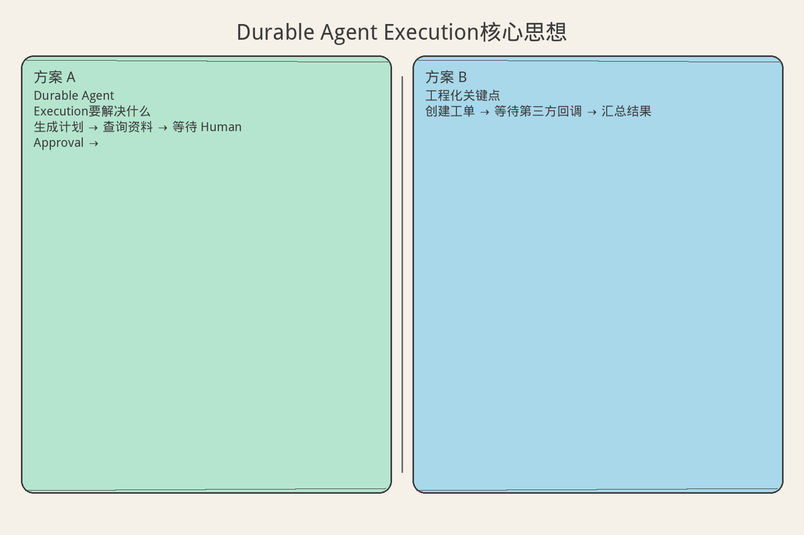
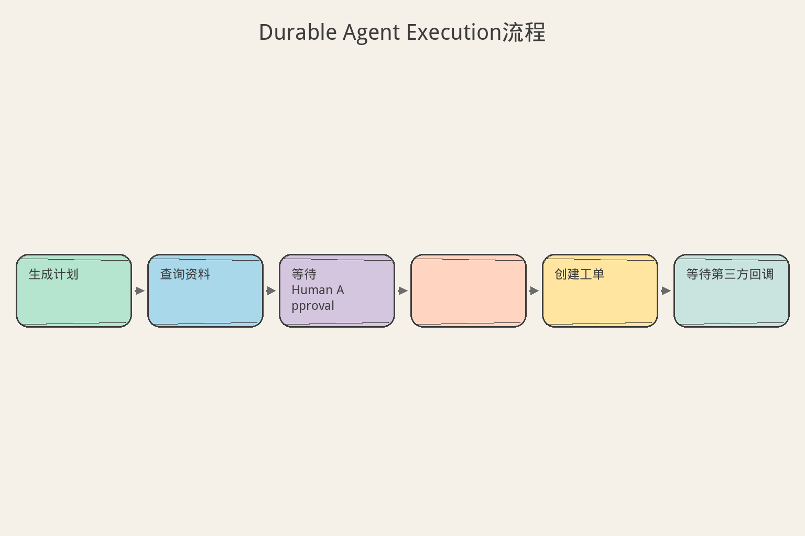
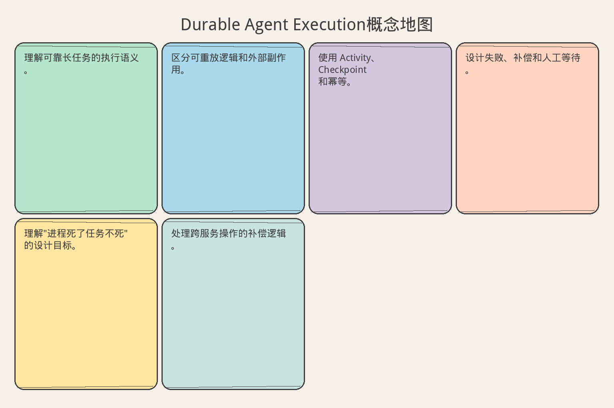

# AI Agent 工程（三十四）：Durable Agent Execution

> Durable Execution 让 Agent 在超时、重启、重试、人工等待和依赖故障后仍能从正确位置继续，而不是依赖一个长时间存活的进程。

**阅读建议：** 先阅读 [246 Checkpoint 与 Resume](246.agent-checkpoint-resume-tutorial.md)，理解状态保存和恢复。

**环境要求：**
- Python **3.10+**
- 依赖：`pip install pydantic`

> **博客实践版**（系列链接、动手路径）：[`247-durable-agent-execution.md`](../src/posts/ai-ml/247-durable-agent-execution.md)

---

## 目录

1. [你会学到什么](#你会学到什么)
2. [它解决什么问题](#它解决什么问题)
3. [核心概念：可重放逻辑与副作用分离](#核心概念可重放逻辑与副作用分离)
4. [最小示例](#最小示例)
5. [工程化版本](#工程化版本)
6. [常见失败模式](#常见失败模式)
7. [什么时候不要这么做](#什么时候不要这么做)
8. [生产环境注意事项](#生产环境注意事项)
9. [如何观测和评测](#如何观测和评测)
10. [和 RAG / 后端 / 前端的关系](#和-rag--后端--前端的关系)
11. [面试怎么讲](#面试怎么讲)
12. [下一步](#下一步)

## 你会学到什么

- 理解可靠长任务的执行语义。
- 区分可重放逻辑和外部副作用。
- 使用 Activity、Checkpoint 和幂等。
- 设计失败、补偿和人工等待。
- 理解"进程死了任务不死"的设计目标。
- 处理跨服务操作的补偿逻辑。

## 它解决什么问题


读下图时，先看「Durable Agent Execution核心思想」建立直觉。


### 长任务的挑战

长任务可能持续数分钟或数天。同步进程无法可靠承载：

```text
生成计划 → 查询资料 → 等待 Human Approval →
创建工单 → 等待第三方回调 → 汇总结果
```

这个流程中：
- "等待 Human Approval"可能等 2 天
- "等待第三方回调"可能等 30 分钟
- 任何一步都可能失败需要重试
- 服务器可能在这期间重启

### 为什么不能用普通进程

```text
❌ 普通进程：
   async def handle_task():
       plan = await generate_plan()
       evidence = await retrieve()
       approval = await wait_for_approval()  # 等 2 天？？？
       # 进程不可能活 2 天！
       # 如果中途重启，前面的工作全丢了！

✅ Durable Execution：
   每一步的结果都持久化
   进程重启后从持久化状态恢复
   "等待"不占进程资源
```

统一术语：**State、Transition、Checkpoint、Resume、Human Approval**。

## 核心概念：可重放逻辑与副作用分离

### 类比：录像回放

| 概念 | 录像类比 | Durable Execution |
|---|---|---|
| 可重放逻辑 | 录像带（可以反复播放） | 流程决策（if/else、循环） |
| 副作用 | 录像中记录的"真实事件" | HTTP 调用、数据库写入 |
| 重放 | 重新播放录像 | 进程重启后重新执行流程逻辑 |
| 幂等 | "这集已经看过了，跳过" | "这个 API 已经调过了，用缓存结果" |

**核心思想：流程逻辑可以安全重放，副作用通过幂等保护不会重复执行。**

### 什么放在流程里，什么放在 Activity 里

```text
流程逻辑（可重放，确定性）：
- if proposal.risk == "critical": 等待审批
- for query in plan.queries: 检索
- 决定下一步做什么

Activity（副作用，需要保护）：
- HTTP 调用（检索、模型调用）
- 数据库写入（创建工单）
- 发送通知（邮件、消息）
- 等待外部事件（审批、回调）
```

## 最小示例


读下图时，先看「Durable Agent Execution流程」建立直觉。


### 持久化流程

```python
async def durable_flow(task: AgentTask) -> AgentResult:
    """
    持久化执行流程。
    
    关键设计：
    1. 每个 activity 有独立的重试策略
    2. 写操作有幂等键
    3. 等待不占 worker
    4. 流程状态由运行时持久化
    """
    # Activity 1: 检索证据（可重试）
    evidence = await activity(
        "retrieve_evidence",
        task.query,
        retry_policy={"max_attempts": 3},
    )

    # Activity 2: 生成方案（可重试）
    proposal = await activity("build_proposal", evidence)

    # 流程决策：是否需要审批？
    if proposal.risk == "critical":
        # 等待事件：不占 worker，可以等几天
        approval = await wait_for_event(
            event="approval.decided",
            key=task.task_id,
            timeout="24h",
        )
        if not approval.approved:
            return AgentResult.rejected()

    # Activity 3: 执行动作（幂等）
    result = await activity(
        "execute_action",
        proposal,
        idempotency_key=task.task_id,  # 防止重复执行
    )

    return AgentResult.completed(result)
```

`activity` 代表可重试的外部操作，流程状态由持久化运行时恢复。

### 使用示例

```python
# 启动一个持久化任务
task = AgentTask(task_id="TASK-001", query="处理客户退款")
result = await durable_flow(task)

# 即使中途服务器重启：
# 1. 运行时检测到 TASK-001 未完成
# 2. 从 Checkpoint 恢复
# 3. 重放流程逻辑
# 4. 已完成的 Activity 用缓存结果（不重复执行）
# 5. 从断点继续
```

## 工程化版本

### 可重放逻辑与副作用分离

流程决策应尽量确定；HTTP、数据库写入、模型调用放入 Activity。

```python
# ❌ 副作用混在流程逻辑中
async def bad_flow():
    result = await http_get("https://api.example.com/data")  # 副作用！
    if result.status == "ok":
        await db_write(result.data)  # 副作用！
    # 重放时会重复调用 HTTP 和数据库！

# ✅ 副作用封装为 Activity
async def good_flow():
    result = await activity("fetch_data", url="https://api.example.com/data")
    if result.status == "ok":  # 这是确定性逻辑，可以安全重放
        await activity("save_data", data=result.data, idempotency_key="save-001")
```

### Activity 契约

每个 Activity 必须有完整的契约：

```python
@dataclass
class ActivityContract:
    """
    Activity 契约：定义一个外部操作的所有约束。
    """
    name: str                    # 活动名称
    input_schema: dict           # 输入格式
    output_schema: dict          # 输出格式
    timeout_seconds: int         # 超时时间
    retry_policy: RetryPolicy    # 重试策略
    idempotency: bool            # 是否支持幂等
    error_classification: dict   # 错误分类（可重试 vs 不可重试）
    trace_enabled: bool = True   # 是否记录 trace
```

```text
Activity 契约清单：
✓ 明确输入输出（schema）
✓ 独立超时（不是全局超时）
✓ 重试策略（指数退避 + 最大次数）
✓ 幂等键（写操作必须）
✓ 错误分类（网络错误可重试，权限错误不可重试）
✓ 可观测 trace（每次调用有记录）
```

### 补偿（Compensation）

跨服务操作无法使用单数据库事务时，定义补偿动作：

```python
async def flow_with_compensation(task: AgentTask):
    """
    带补偿的流程。
    
    如果后续步骤失败，撤销前面已执行的副作用。
    类似 Saga 模式。
    """
    compensations = []  # 补偿动作栈

    try:
        # 步骤 1: 创建临时资源
        resource = await activity("create_temp_resource", task.params)
        compensations.append(lambda: activity("delete_resource", resource.id))

        # 步骤 2: 审核
        review = await activity("review_resource", resource.id)
        if not review.approved:
            raise ReviewFailedError("审核未通过")

        # 步骤 3: 正式发布
        await activity("publish_resource", resource.id)

    except Exception as e:
        # 执行补偿（逆序）
        for compensate in reversed(compensations):
            await compensate()  # 补偿也要幂等！
        raise


# 补偿示例：
# 创建临时资源成功
#   → 后续审核失败
#   → 删除临时资源或标记 cancelled
```

**补偿也要幂等**：补偿可能因为网络问题重试，不能重复删除。

### Human Approval 是持久化等待

```python
async def wait_for_approval(task_id: str, params: dict) -> ApprovalResult:
    """
    等待人工审批。
    
    关键设计：
    1. 等待期间不占 worker（释放资源）
    2. 审批参数不可变（绑定到 Checkpoint）
    3. 有超时（不能无限等）
    4. Approval Event 到达后 Resume 原 State
    """
    # 保存审批请求（持久化）
    approval_request = {
        "task_id": task_id,
        "params": params,  # 不可变！
        "created_at": now(),
        "timeout": "24h",
    }
    approval_store.save(approval_request)

    # 通知审批人
    notify_approver(approval_request)

    # 等待事件（不占 worker）
    # 运行时在这里"挂起"流程，释放 worker
    event = await wait_for_event(
        event="approval.decided",
        key=task_id,
        timeout="24h",
    )

    # 验证审批有效性
    if event.approved_by is None:
        raise ValueError("approval_missing_identity")

    return ApprovalResult(
        approved=event.approved,
        approved_by=event.approved_by,
        params=params,  # 使用原始参数，不是审批人可能修改的
    )
```

### 错误分类

```python
class ErrorCategory(StrEnum):
    """错误分类：决定是否重试。"""
    TRANSIENT = "transient"      # 暂时性（网络超时）→ 重试
    PERMANENT = "permanent"      # 永久性（权限不足）→ 不重试
    UNKNOWN = "unknown"          # 未知 → 有限重试后告警


def classify_error(error: Exception) -> ErrorCategory:
    """分类错误，决定是否重试。"""
    if isinstance(error, (TimeoutError, ConnectionError)):
        return ErrorCategory.TRANSIENT
    if isinstance(error, PermissionError):
        return ErrorCategory.PERMANENT
    return ErrorCategory.UNKNOWN
```

## 常见失败模式

### 1. 用 while + sleep 模拟数天等待

```python
# ❌ 占着 worker 等
while not approved:
    await asyncio.sleep(60)  # 每分钟检查一次
    # worker 被占用 2 天！其他任务无法执行！

# ✅ 持久化等待
await wait_for_event("approval.decided", timeout="48h")
# worker 立即释放，事件到达时 Resume
```

### 2. 重放流程时再次执行外部副作用

```text
进程重启 → 重放流程逻辑
→ 又调用了 create_order API
→ 重复创建订单！

修复：Activity 有幂等键，重放时返回缓存结果
```

### 3. Activity 没有幂等

```text
execute_action 没有幂等键
→ 重试时重复执行
→ 数据不一致
```

### 4. 所有错误都自动重试

```text
权限不足 → 重试 3 次 → 还是权限不足 → 浪费时间和资源
应该：权限错误 → 立即失败 → 告警
```

### 5. 补偿失败没有告警

```text
创建资源成功 → 审核失败 → 尝试删除资源 → 删除也失败了！
→ 资源泄漏（孤儿资源）
→ 如果没有告警，没人知道
```

### 6. Workflow 版本升级破坏旧执行历史

```text
v1 流程: A → B → C
v2 流程: A → B → D → C

正在执行 v1 的任务（已到 B）
升级后用 v2 恢复 → 期望 D，但历史中没有 D
→ 恢复失败
```

## 什么时候不要这么做

**几十毫秒完成、可安全重算的请求不需要 Durable Execution。**

```text
"翻译这句话" → 失败了重新来就行
不需要 Checkpoint、Activity、补偿
```

**不要为了使用工作流平台把简单 CRUD 拆成大量 Activity。**

```text
❌ 创建用户：
   Activity 1: 验证输入
   Activity 2: 检查重复
   Activity 3: 写入数据库
   Activity 4: 发送欢迎邮件
   → 过度设计

✅ 简单 CRUD 用普通 API + 后台任务即可
```

**如果业务没有长等待、跨服务副作用或恢复需求，普通后台任务足够。**

## 生产环境注意事项

- State 与 Transition 可序列化（JSON）。
- Activity 输入避免超大对象（传 ID，不传内容）。
- Checkpoint 加密敏感字段。
- Resume 使用原 workflow version。
- Human Approval 事件校验身份和版本。
- 设置任务整体保留和超时策略（如 30 天后清理）。
- 补偿动作有独立的告警和监控。
- Activity 的超时和重试策略可配置（不是硬编码）。

## 如何观测和评测

指标：

| 指标 | 含义 | 健康范围 |
|---|---|---|
| 流程完成时间 | 端到端耗时 | 取决于业务 |
| Activity 重试率 | 需要重试的比例 | < 10% |
| Activity 失败率 | 最终失败的比例 | < 1% |
| Checkpoint/Resume 成功率 | 恢复成功的比例 | > 99% |
| 补偿触发次数 | 需要补偿的频率 | 极低 |
| 补偿成功率 | 补偿成功的比例 | > 99% |
| 等待 Approval 时长 | 审批等待时间 | < 24h |
| 卡住流程数量 | 长时间无进展的流程 | 0 |

## 和 RAG / 后端 / 前端的关系

- RAG 检索和模型调用作为 Activity（有超时和重试）。
- 后端工作流运行时保存执行历史（如 Temporal、自研）。
- 前端订阅 State 变化（展示进度）。
- Approval UI 发送带版本的外部事件（触发 Resume）。

## 面试怎么讲

> Durable Execution 把决策流程和外部副作用分离。模型、HTTP 和数据库动作放入有超时、重试和幂等的 Activity；State、Transition 和 Checkpoint 持久化。Human Approval 是不占 worker 的等待事件，Resume 使用原版本。跨服务副作用定义幂等补偿。

## 初学者常见疑问

### Durable Execution 和普通重试有什么区别？

```text
普通重试：
  函数失败 → 重新调用整个函数
  → 前面的步骤也重新执行（浪费）
  → 如果前面有副作用（发邮件）→ 重复发送！

Durable Execution：
  每个步骤（Activity）独立记录结果
  失败 → 只重试失败的那个 Activity
  → 前面已完成的步骤不重复
  → 副作用有幂等键保护

类比：
  普通重试 = 考试时一道题不会，整张卷子重做
  Durable = 只重做不会的那道题，已做完的不用重做
```

### 什么是"补偿"（Compensation）？

初学者对"补偿"这个概念可能比较陌生：

```text
场景：Agent 执行了 3 个步骤：
  1. 创建订单 ✓
  2. 扣款 ✓
  3. 发货 ✗（失败）

问题：步骤 1、2 已经执行了，怎么办？

补偿 = "反向操作"：
  补偿步骤 2：退款
  补偿步骤 1：取消订单

注意：补偿也必须是幂等的！
  退款可能重试 → 不能退两次
  用 compensation_id 去重
```

这就是为什么我们说"跨服务副作用定义幂等补偿"——每个写操作都要提前想好"如果后面失败了，怎么撤销"。

### Temporal 是什么？我必须用它吗？

```text
Temporal 是一个开源的 Durable Execution 框架：
- 自动保存执行历史
- 自动重试和超时
- 支持 Human Approval 等待
- 支持补偿（Saga）

你必须用它吗？不是。
- 小项目：自己用数据库 + Checkpoint 实现
- 中型项目：用 Celery + 状态机
- 大型项目：用 Temporal / Cadence

本文教的是"原理"，不是"某个工具的使用方法"。
理解了原理，用什么工具都能上手。
```

## 完整运行示例

```python
import time


class DurableWorkflow:
    """教学用的 Durable Execution 引擎。"""

    def __init__(self, workflow_id: str):
        self.workflow_id = workflow_id
        self.history: list[dict] = []  # 执行历史（生产环境持久化）

    def execute_activity(self, name: str, func, max_retries: int = 3):
        """
        执行一个 Activity（带重试和幂等）。
        
        关键设计：
        1. 先检查历史：已完成的不重复执行
        2. 失败后重试（只重试当前 Activity）
        3. 成功后记录到历史
        """
        # 幂等检查：已完成的不重复执行
        for record in self.history:
            if record["activity"] == name and record["status"] == "done":
                print(f"  [跳过] {name} 已完成（幂等）")
                return record["result"]

        # 执行（带重试）
        for attempt in range(1, max_retries + 1):
            try:
                print(f"  [执行] {name} (尝试 {attempt}/{max_retries})")
                result = func()
                # 记录到历史
                self.history.append({
                    "activity": name,
                    "status": "done",
                    "result": result,
                })
                return result
            except Exception as e:
                print(f"    ✗ 失败: {e}")
                if attempt == max_retries:
                    self.history.append({
                        "activity": name,
                        "status": "failed",
                        "error": str(e),
                    })
                    raise
                time.sleep(0.1)  # 模拟退避


def demo_durable_execution():
    """演示 Durable Execution 的核心价值。"""
    wf = DurableWorkflow("WF-order-001")
    call_count = {"ship": 0}

    def create_order():
        return "ORDER-123"

    def charge_payment():
        return "PAY-456"

    def ship_order():
        call_count["ship"] += 1
        if call_count["ship"] <= 2:
            raise RuntimeError("物流服务超时")
        return "SHIP-789"

    print("=== Durable Execution 演示 ===")
    print("\n--- 正常执行 ---")
    order = wf.execute_activity("create_order", create_order)
    payment = wf.execute_activity("charge_payment", charge_payment)

    print("\n--- 发货（前 2 次会失败，第 3 次成功） ---")
    shipment = wf.execute_activity("ship_order", ship_order)

    print(f"\n✅ 完成: order={order}, payment={payment}, ship={shipment}")

    # 模拟崩溃后恢复：重新执行整个流程
    print("\n--- 模拟崩溃后 Resume（重新调用整个流程） ---")
    wf.execute_activity("create_order", create_order)   # 跳过
    wf.execute_activity("charge_payment", charge_payment)  # 跳过
    wf.execute_activity("ship_order", ship_order)       # 跳过
    print("\n✅ Resume 完成：没有重复执行任何 Activity！")


if __name__ == "__main__":
    demo_durable_execution()
```

运行输出：

```text
=== Durable Execution 演示 ===

--- 正常执行 ---
  [执行] create_order (尝试 1/3)
  [执行] charge_payment (尝试 1/3)

--- 发货（前 2 次会失败，第 3 次成功） ---
  [执行] ship_order (尝试 1/3)
    ✗ 失败: 物流服务超时
  [执行] ship_order (尝试 2/3)
    ✗ 失败: 物流服务超时
  [执行] ship_order (尝试 3/3)

✅ 完成: order=ORDER-123, payment=PAY-456, ship=SHIP-789

--- 模拟崩溃后 Resume（重新调用整个流程） ---
  [跳过] create_order 已完成（幂等）
  [跳过] charge_payment 已完成（幂等）
  [跳过] ship_order 已完成（幂等）

✅ Resume 完成：没有重复执行任何 Activity！
```

这就是 Durable Execution 的核心价值：崩溃后恢复不会重复副作用，失败的 Activity 自动重试。

## 博客版补充

博客实践版 [`247-durable-agent-execution.md`](../src/posts/ai-ml/247-durable-agent-execution.md) 含 Docker 最小可运行路径、Signal/Replay 白话与 Temporal 术语表。

## 下一步


读下图时，先看「Durable Agent Execution概念地图」建立直觉。


下一篇 [248 Agent 后台任务](248.agent-background-job-tutorial.md) 会设计 API、队列、worker 和进度事件。
