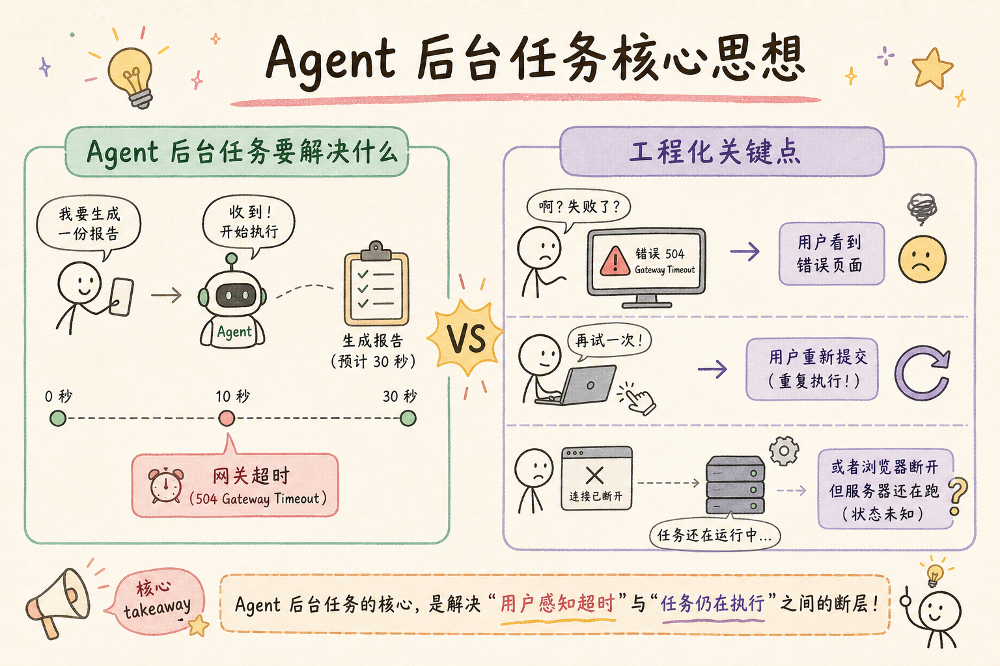
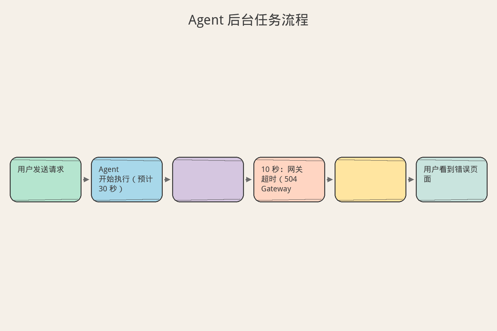
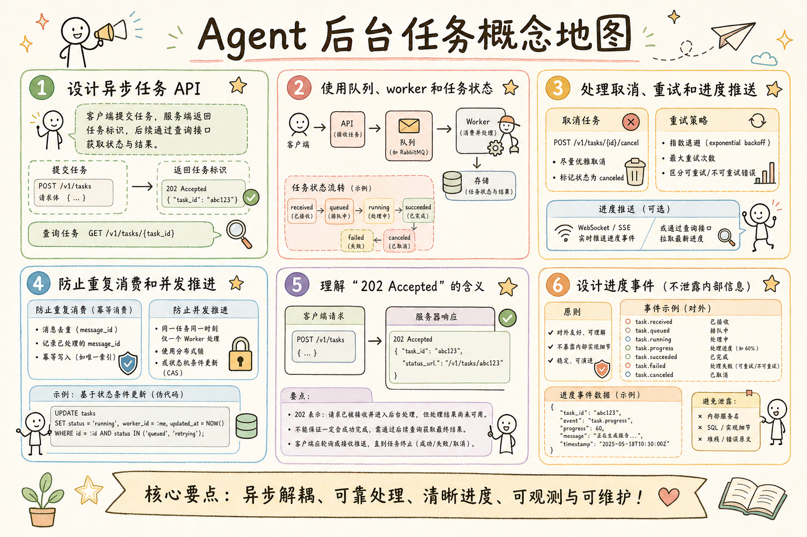

# AI Agent 工程（三十五）：Agent 后台任务

> 当 Agent 超过普通 HTTP 延迟预算，就应该返回 task_id，把执行交给后台 worker，并通过事件报告进度。

**阅读建议：** 先阅读 [247 Durable Execution](247.durable-agent-execution-tutorial.md)，理解持久化执行的概念。


> **系列导读：** [Agent/RAG 工程系列 238–254](../src/posts/ai-ml/agent-rag-series-238-254.md) · [`examples/rag-agent-lab`](../examples/rag-agent-lab/)

**环境要求：**
- Python **3.10+**
- 依赖：`pip install fastapi pydantic`

> **博客实践版**（系列链接、动手路径）：[`248-agent-background-job.md`](../src/posts/ai-ml/248-agent-background-job.md)


**档位：** 主线篇（Part 6）
**本文边界：** 前驱篇 [247](247.durable-agent-execution-tutorial.md) 可靠执行。本篇后台 Worker 与进度推送。不讲 MQ 集群。接续 [249](249.agent-event-driven-architecture-tutorial.md)。
**动手路径：** ① 读后台任务模型 → ② 运行 `demo_background()` → ③ 对照进度推送输出

### 核心术语（本篇首次出现）
**Checkpoint**（检查点）：持久化 Agent 中间状态以便恢复。
通俗说：游戏存档点。
**状态机**（State Machine）：用有限状态与转移约束 Agent 行为。
通俗说：红绿灯，不能随意乱跳。
**Job**（后台任务）：异步执行的长 Agent，用 job_id 查询进度。
通俗说：异步执行的长 Agent。
---

## 目录

1. [你会学到什么](#你会学到什么)
2. [它解决什么问题](#它解决什么问题)
3. [核心概念：异步任务模式](#核心概念异步任务模式)
4. [最小示例](#最小示例)
5. [工程化版本](#工程化版本)
6. [常见失败模式](#常见失败模式)
7. [什么时候不要这么做](#什么时候不要这么做)
8. [生产环境注意事项](#生产环境注意事项)
9. [如何观测和评测](#如何观测和评测)
10. [和 RAG / 后端 / 前端的关系](#和-rag--后端--前端的关系)
11. [面试怎么讲](#面试怎么讲)
12. [下一步](#下一步)

## 你会学到什么

- 设计异步任务 API。
- 使用队列、worker 和任务状态。
- 处理取消、重试和进度推送。
- 防止重复消费和并发推进。
- 理解"202 Accepted"的含义。
- 设计进度事件（不泄露内部信息）。

## 它解决什么问题


读下图时，先看「Agent 后台任务核心思想」建立直觉。


对照上图：后台任务+进度推送——长 Agent 不能绑在 HTTP 请求线程上。

读下图时，先看能力边界与痛点流程——与 §最小示例 代码互补，不是逐步对照。


对照上图：长任务进后台 Worker——同步 HTTP 扛不住数小时的人工等待与重试。
### 同步 Agent 的问题

长 Agent 同步运行会导致：

```text
用户发送请求 → Agent 开始执行（预计 30 秒）
→ 10 秒：网关超时（504 Gateway Timeout）
→ 用户看到错误页面
→ 用户重新提交（重复执行！）
→ 或者浏览器断开，但服务器还在跑（状态未知）
```

| 问题 | 原因 | 后果 |
|---|---|---|
| 网关超时 | HTTP 有超时限制（通常 30s） | 用户看到错误 |
| 状态未知 | 浏览器断开后不知道任务怎样了 | 用户焦虑 |
| 重复提交 | 用户以为失败了，再点一次 | 重复执行 |
| 进度丢失 | worker 重启，内存中的进度没了 | 从头开始 |
| 无法等待审批 | 同步请求不能等 2 天 | 流程卡死 |

### 异步任务模式

```text
✅ 正确做法：
用户发送请求 → 服务器返回 202 + task_id（立即）
→ 后台 worker 执行任务
→ 前端轮询或 SSE 获取进度
→ 任务完成后通知用户
```

统一术语：**State、Transition、Checkpoint、Resume、Human Approval**。

## 核心概念：异步任务模式

### 类比：餐厅点餐

| 同步模式 | 异步模式 |
|---|---|
| 你站在厨房门口等厨师做完 | 你点完餐拿到号码牌，坐回座位 |
| 厨师做了 30 分钟，你站了 30 分钟 | 厨师做好了叫号，你去取 |
| 你走了就不知道做没做完 | 号码牌在，随时可以查进度 |
| 你不耐烦又点了一次（重复） | 一个号码只做一次 |

**task_id 就是你的"号码牌"。**

### 202 Accepted 的含义

```text
HTTP 200: "请求成功，这是结果"
HTTP 202: "请求已接受，但还没处理完"

202 告诉客户端：
1. 你的请求我收到了（不会丢）
2. 正在处理中（还没完成）
3. 用这个 URL 查进度（status_url）
```

## 最小示例

### 先错后对：同步 HTTP 跑长任务

```text
❌ POST /agent/run 阻塞 30 分钟等人工审批
✅ 202 接受任务 + job_id，Worker 后台跑，SSE/WebSocket 推进度（本篇）
```

### 先错对对：同步 HTTP 跑长任务

```text
❌ POST /agent/run 阻塞 30 分钟等人工审批
✅ 202 接受任务 + job_id，Worker 后台跑，SSE/WebSocket 推进度（本篇）
```

**演示什么：** 本节最小可运行切片。**环境：** 见文首。**预期：** 控制台打印 demo 输出。

### 创建任务 API

```python
from fastapi import FastAPI, status

app = FastAPI()


@app.post("/agent/tasks", status_code=status.HTTP_202_ACCEPTED)
async def create_task(request: CreateAgentTask) -> dict:
    """
    创建 Agent 任务。
    
    返回 202：表示"已接受，正在处理"。
    不等待任务完成，立即返回 task_id。
    """
    # 创建任务记录
    task = task_service.create(request)

    # 发布到队列（由 worker 异步执行）
    queue.publish("agent.task.created", {"task_id": task.id})

    # 立即返回（不等执行完）
    return {
        "task_id": task.id,
        "status": task.status,  # "created"
        "status_url": f"/agent/tasks/{task.id}",
    }
```

### 查询进度

```json
{
  "task_id": "TASK-901",
  "state": "running",
  "current_step": 3,
  "total_steps": 5,
  "message": "正在验证引用"
}
```

### 使用示例

```python
# 前端调用
response = await fetch("/agent/tasks", {
    method: "POST",
    body: JSON.stringify({query: "分析这份报告"}),
})
# → 202 Accepted
# → {"task_id": "TASK-901", "status_url": "/agent/tasks/TASK-901"}

# 轮询进度
while True:
    status = await fetch("/agent/tasks/TASK-901")
    if status.state == "completed":
        show_result(status.result)
        break
    elif status.state == "failed":
        show_error(status.error)
        break
    else:
        show_progress(status.message)  # "正在验证引用"
        await sleep(2)
```

## 工程化版本

### API 设计

```text
POST /agent/tasks                              ← 创建任务
GET  /agent/tasks/{task_id}                    ← 查询状态
POST /agent/tasks/{task_id}/cancel             ← 取消任务
GET  /agent/tasks/{task_id}/events             ← SSE 进度流
POST /agent/tasks/{task_id}/approvals/{id}     ← 提交审批结果
```

### Worker 执行

```python
def process_task(task_id: str) -> None:
    """
    Worker 处理一个任务。
    
    流程：
    1. 获取 lease（防止并发）
    2. 加载 Checkpoint（从哪里继续）
    3. 推进一步或有限步骤
    4. 保存 Checkpoint
    5. 发布进度事件
    6. 释放 lease
    """
    with task_lease(task_id, ttl_seconds=30):
        # 加载状态
        state = checkpoint_store.load(task_id)

        # 检查是否已取消
        if state.is_cancelled:
            return

        # 推进
        state = orchestrator.advance(state)

        # 保存
        checkpoint_store.save(state)

        # 发布进度
        publish_state_event(state)
```

### 进度事件

只发布用户可理解摘要：

```json
{
  "event": "step.completed",
  "task_id": "TASK-901",
  "step": 3,
  "total_steps": 5,
  "label": "引用验证完成"
}
```

**不要通过 SSE 暴露完整工具参数或敏感 observation。**

```text
❌ 暴露内部信息：
{"event": "tool.called", "tool": "search_policy", "params": {"query": "..."}, "result": {...}}

✅ 只暴露用户可理解的：
{"event": "step.completed", "label": "政策检索完成"}
```

### 取消机制

```python
@app.post("/agent/tasks/{task_id}/cancel")
async def cancel_task(task_id: str) -> dict:
    """
    取消任务。
    
    取消不是"立即停止"，而是"标记取消 + 通知 worker"。
    正在执行的工具调用会完成后检查取消标志。
    """
    # 标记取消
    task_service.mark_cancelled(task_id)

    # 通知 worker（如果正在运行）
    cancel_signal.publish(task_id)

    return {"task_id": task_id, "status": "cancelling"}
```

### 幂等创建

```python
@app.post("/agent/tasks", status_code=status.HTTP_202_ACCEPTED)
async def create_task(request: CreateAgentTask) -> dict:
    """带幂等键的任务创建。"""
    # 客户端提供幂等键（防止重复提交）
    idempotency_key = request.idempotency_key or request.query

    # 检查是否已存在
    existing = task_service.find_by_idempotency_key(idempotency_key)
    if existing:
        # 已存在，返回同一个 task（不重复创建）
        return {"task_id": existing.id, "status": existing.status}

    # 创建新任务
    task = task_service.create(request, idempotency_key=idempotency_key)
    queue.publish("agent.task.created", {"task_id": task.id})
    return {"task_id": task.id, "status": task.status}
```

## 常见失败模式

### 1. API 返回 200 但任务尚未完成

```text
❌ 返回 200 + 空结果（用户以为完成了但什么都没有）
✅ 返回 202 + task_id（明确告知"正在处理"）
```

### 2. 队列重复投递导致两个 worker 执行

```text
队列保证"至少一次"投递
→ 同一个任务可能被投递两次
→ 两个 worker 同时执行
→ 重复副作用！

修复：lease 机制 + 幂等
```

### 3. 前端断开就取消任务

```text
❌ 用户关闭浏览器 → 服务器取消任务
   → 用户只是关了页面，不是要取消！

✅ 前端断开 ≠ 取消
   取消必须通过显式 API（POST /cancel）
```

### 4. cancel 只改状态，不通知正在运行的工具

```text
标记 cancelled 了，但工具还在执行（如 30 秒的 HTTP 调用）
→ 工具完成后又写入了数据
→ "取消了但副作用还在"

修复：cancel 信号传播到 Activity 层
```

### 5. Checkpoint 保存失败仍确认队列消息

```text
消息确认了（从队列删除）
但 Checkpoint 没保存成功
→ 任务状态丢失！

修复：先保存 Checkpoint，再确认消息
```

### 6. 进度事件包含内部推理或敏感数据

```text
❌ {"event": "thinking", "content": "用户可能是管理员..."}
✅ {"event": "step.completed", "label": "权限检查完成"}
```

## 什么时候不要这么做

**任务能在稳定低延迟内完成时同步接口更简单。**

```text
"翻译这句话"（200ms）→ 同步返回即可
"分析 100 页文档"（30s）→ 异步任务
```

**不要用队列掩盖没有停止条件的 Agent；后台无限循环仍然是故障。**

```text
❌ Agent 没有停止条件 → 放到后台 → 后台无限循环
✅ 先修好停止条件，再考虑同步/异步
```

## 生产环境注意事项

- 创建任务使用客户端幂等键（防重复提交）。
- 队列按至少一次投递设计，consumer 幂等。
- lease 防止并发推进（同一时间只有一个 worker）。
- State Transition 后再确认消息（先保存再 ACK）。
- cancel 与 Activity 协作（传播取消信号）。
- waiting_for_approval 不重复入队（审批由事件触发 Resume）。
- 进度事件有 rate limit（不要每 10ms 发一次）。
- 任务有最大执行时间（超时自动失败）。

## 如何观测和评测

指标：

| 指标 | 含义 | 健康范围 |
|---|---|---|
| 队列等待时间 | 任务在队列中等多久 | < 5s |
| worker 执行时间 | 任务执行耗时 | 取决于业务 |
| 各 State 任务数 | 当前分布 | running 不堆积 |
| 重复消费拦截 | 幂等拦截次数 | 极低 |
| cancel 响应时间 | 取消到停止的延迟 | < 5s |
| Checkpoint/Resume 成功率 | 恢复成功率 | > 99% |
| Approval 等待时间 | 审批等待时长 | < 24h |

## 完整运行示例

```python
import asyncio


async def demo_background_task():
    """演示完整的后台任务生命周期。"""

    # 1. 创建任务
    response = await client.post("/agent/tasks", json={
        "query": "分析这份 50 页的报告并生成摘要",
        "idempotency_key": "req-abc-123",
    })
    assert response.status_code == 202
    task_id = response.json()["task_id"]
    print(f"任务已创建: {task_id}")  # → TASK-901

    # 2. 轮询进度
    for _ in range(10):
        status = await client.get(f"/agent/tasks/{task_id}")
        data = status.json()
        print(f"  状态: {data['state']}, 步骤: {data['current_step']}/5")
        # → 状态: running, 步骤: 1/5
        # → 状态: running, 步骤: 2/5
        # → 状态: running, 步骤: 3/5

        if data["state"] in ("completed", "failed"):
            break
        await asyncio.sleep(2)

    # 3. 获取结果
    final = await client.get(f"/agent/tasks/{task_id}")
    print(f"最终状态: {final.json()['state']}")  # → completed

    # 4. 重复提交（幂等）
    response2 = await client.post("/agent/tasks", json={
        "query": "分析这份 50 页的报告并生成摘要",
        "idempotency_key": "req-abc-123",  # 相同的幂等键
    })
    assert response2.json()["task_id"] == task_id  # 返回同一个任务
    print("幂等验证通过：重复提交返回同一任务")


async def demo_cancel():
    """演示取消任务。"""
    # 创建任务
    response = await client.post("/agent/tasks", json={"query": "长时间分析"})
    task_id = response.json()["task_id"]

    # 等 2 秒后取消
    await asyncio.sleep(2)
    cancel_response = await client.post(f"/agent/tasks/{task_id}/cancel")
    print(f"取消状态: {cancel_response.json()['status']}")  # → cancelling

    # 确认最终状态
    await asyncio.sleep(1)
    final = await client.get(f"/agent/tasks/{task_id}")
    print(f"最终状态: {final.json()['state']}")  # → cancelled

if __name__ == "__main__":
    import asyncio
    asyncio.run(demo_cancel())
```

### 前端 SSE 进度展示

```javascript
// 前端使用 SSE 接收进度
const eventSource = new EventSource(`/agent/tasks/${taskId}/events`);

eventSource.onmessage = (event) => {
  const data = JSON.parse(event.data);

  switch (data.event) {
    case 'step.completed':
      updateProgress(data.step, data.total_steps, data.label);
      break;
    case 'task.completed':
      showResult(data.result);
      eventSource.close();
      break;
    case 'task.failed':
      showError(data.error);
      eventSource.close();
      break;
  }
};

// 注意：关闭页面不等于取消任务！
// 取消必须调用 POST /agent/tasks/{id}/cancel
```

## 和 RAG / 后端 / 前端的关系

- RAG 长检索和批量分析由 worker 执行（不在 API 请求中）。
- 后端提供 task API 和事件（核心基础设施）。
- 前端用 SSE 或轮询展示进度（用户看到"正在处理..."）。
- Human Approval 后发布 Resume 事件（触发 worker 继续）。

## 面试怎么讲

> 长 Agent 返回 202 和 task_id，通过队列驱动 worker。worker 获取 lease、加载 Checkpoint、推进 State、保存后发布事件。队列按至少一次投递设计，所以创建、消费和工具都要幂等。前端断线不等于取消，取消通过显式 API 传播。

## 初学者常见疑问

### 为什么关闭页面不等于取消任务？

初学者常觉得"我关了浏览器，任务应该停止了吧？"

```text
关闭页面只是断开了 SSE 连接（前端不再接收进度）
但后台 worker 还在跑！

类比：
  你在餐厅点了餐，然后离开餐厅
  → 厨房不会因为你走了就停止做菜
  → 你必须打电话说"取消订单"才会停

所以：
  关闭页面 = 不再看进度（但任务继续）
  取消任务 = 调用 POST /tasks/{id}/cancel（显式操作）

为什么这样设计？
  因为任务可能已经执行了一半（有副作用）
  不能因为用户关了页面就丢弃已完成的工作
```

### 为什么队列要"至少一次投递"？

```text
三种投递语义：
  最多一次：可能丢消息（不可接受）
  恰好一次：理想但很难实现
  至少一次：可能重复，但不丢（实际选择）

至少一次的问题：
  同一个任务可能被投递两次
  → worker A 和 worker B 同时拿到同一个任务
  → 如果不做幂等，就会执行两次！

解决方案：
  1. worker 获取 lease（只有一个能拿到）
  2. 工具调用用幂等键（重复调用不产生副作用）
  3. 任务创建用 idempotency_key（重复提交返回同一个 task_id）
```

# Worker 池管理

### 为什么需要 Worker 池

单个 worker 处理所有任务会有问题：

```text
问题 1：一个慢任务阻塞所有后续任务
  任务 A（预计 60 秒）正在执行
  任务 B、C、D 排队等待
  → 用户体验极差

问题 2：无法利用多核 CPU
  Agent 的 LLM 调用是 I/O 密集
  但解析、向量计算是 CPU 密集
  单 worker 无法并行

问题 3：故障隔离差
  一个任务 OOM → 整个 worker 崩溃
  所有进行中的任务都丢失
```

### Worker 池实现

```python
import asyncio
from dataclasses import dataclass, field
from typing import Callable, Awaitable


@dataclass
class WorkerPool:
    """管理一组并发 worker 协程。"""

    queue: asyncio.Queue
    handler: Callable  # async def handler(task) -> None
    max_workers: int = 4
    _workers: list = field(default_factory=list)
    _running: bool = False

    async def start(self):
        """启动所有 worker。"""
        self._running = True
        for i in range(self.max_workers):
            worker = asyncio.create_task(self._worker_loop(i))
            self._workers.append(worker)
        print(f"Worker 池已启动: {self.max_workers} 个 worker")

    async def stop(self):
        """优雅关闭：等待当前任务完成。"""
        self._running = False
        # 发送毒丸（poison pill）让 worker 退出
        for _ in self._workers:
            await self.queue.put(None)
        await asyncio.gather(*self._workers, return_exceptions=True)
        print("Worker 池已关闭")

    async def _worker_loop(self, worker_id: int):
        """单个 worker 的主循环。"""
        while self._running:
            task = await self.queue.get()
            if task is None:  # 毒丸
                self.queue.task_done()
                break
            try:
                await self.handler(task)
            except Exception as e:
                print(f"[Worker-{worker_id}] 任务失败: {e}")
            finally:
                self.queue.task_done()


# 使用示例
async def process_agent_task(task: dict):
    """处理单个 Agent 任务。"""
    print(f"  处理任务: {task['task_id']}")
    await asyncio.sleep(2)  # 模拟 Agent 执行
    print(f"  完成: {task['task_id']}")


async def demo_worker_pool():
    queue = asyncio.Queue(maxsize=100)
    pool = WorkerPool(queue=queue, handler=process_agent_task, max_workers=3)
    await pool.start()

    # 提交 10 个任务
    for i in range(10):
        await queue.put({"task_id": f"TASK-{i:03d}"})

    await queue.join()  # 等待所有任务完成
    await pool.stop()

if __name__ == "__main__":
    import asyncio
    asyncio.run(demo_worker_pool())
```

### 动态扩缩容

```python
@dataclass
class AutoScalingPool:
    """根据队列深度自动调整 worker 数量。"""

    queue: asyncio.Queue
    handler: Callable
    min_workers: int = 2
    max_workers: int = 10
    scale_up_threshold: int = 5   # 队列积压 > 5 时扩容
    scale_down_threshold: int = 1  # 队列积压 < 1 时缩容
    check_interval: float = 5.0  # 每 5 秒检查一次
    _active_workers: int = 0
    _workers: list = field(default_factory=list)

    async def monitor_loop(self):
        """监控循环：定期检查是否需要扩缩容。"""
        while True:
            await asyncio.sleep(self.check_interval)
            pending = self.queue.qsize()

            if pending > self.scale_up_threshold:
                if self._active_workers < self.max_workers:
                    await self._add_worker()
                    print(f"  扩容 → {self._active_workers} workers")
            elif pending < self.scale_down_threshold:
                if self._active_workers > self.min_workers:
                    await self._remove_worker()
                    print(f"  缩容 → {self._active_workers} workers")

    async def _add_worker(self):
        worker = asyncio.create_task(self._worker_loop())
        self._workers.append(worker)
        self._active_workers += 1

    async def _remove_worker(self):
        # 发送毒丸让最闲的 worker 退出
        await self.queue.put(None)
        self._active_workers -= 1

    async def _worker_loop(self):
        while True:
            task = await self.queue.get()
            if task is None:
                self.queue.task_done()
                break
            try:
                await self.handler(task)
            finally:
                self.queue.task_done()
```

## 任务取消机制

### 取消的难点

Agent 任务不是简单的函数调用，取消很复杂：

```text
取消时机：
  1. 任务还在队列中 → 简单：直接移除
  2. 任务正在执行 LLM 调用 → 中等：取消 HTTP 请求
  3. 任务正在写数据库 → 困难：需要回滚
  4. 任务已经调用外部 API → 极难：无法撤销

策略：
  协作式取消（cooperative cancellation）
  → 在每个步骤之间检查取消标志
  → 如果已取消，清理并退出
```

### 实现协作式取消

```python
import asyncio
from enum import Enum


class TaskState(str, Enum):
    PENDING = "pending"
    RUNNING = "running"
    CANCELLING = "cancelling"  # 取消请求已发出
    CANCELLED = "cancelled"
    COMPLETED = "completed"
    FAILED = "failed"


class CancellableAgentTask:
    """支持取消的 Agent 任务。"""

    def __init__(self, task_id: str):
        self.task_id = task_id
        self.state = TaskState.PENDING
        self._cancel_event = asyncio.Event()
        self._current_step = 0
        self._total_steps = 5

    def request_cancel(self):
        """外部调用：请求取消。"""
        if self.state == TaskState.RUNNING:
            self.state = TaskState.CANCELLING
            self._cancel_event.set()
            print(f"  [{self.task_id}] 取消请求已发出")

    def _check_cancelled(self):
        """在每个步骤之间调用。"""
        if self._cancel_event.is_set():
            self.state = TaskState.CANCELLED
            raise asyncio.CancelledError(f"任务 {self.task_id} 已取消")

    async def execute(self):
        """执行 Agent 任务（支持取消）。"""
        self.state = TaskState.RUNNING
        steps = [
            "解析用户意图",
            "检索相关文档",
            "调用 LLM 生成",
            "验证输出质量",
            "写入结果",
        ]

        try:
            for i, step_name in enumerate(steps):
                self._check_cancelled()  # ← 关键：每步前检查
                self._current_step = i + 1
                print(f"  [{self.task_id}] 步骤 {i+1}/{len(steps)}: {step_name}")
                await asyncio.sleep(1)  # 模拟耗时操作

            self.state = TaskState.COMPLETED
            print(f"  [{self.task_id}] 完成")

        except asyncio.CancelledError:
            # 清理工作
            print(f"  [{self.task_id}] 已取消，执行清理...")
            await self._cleanup()
            raise

    async def _cleanup(self):
        """取消后的清理逻辑。"""
        # 删除中间文件、回滚部分写入等
        pass


# 演示
async def demo_cancellation():
    task = CancellableAgentTask("TASK-100")

    # 并发：执行 + 2秒后取消
    exec_future = asyncio.create_task(task.execute())
    await asyncio.sleep(2.5)
    task.request_cancel()

    try:
        await exec_future
    except asyncio.CancelledError:
        print(f"  最终状态: {task.state}")  # → cancelled

if __name__ == "__main__":
    import asyncio
    asyncio.run(demo_cancellation())
```

### 取消 API 端点

```python
from fastapi import FastAPI, HTTPException

app = FastAPI()
active_tasks: dict[str, CancellableAgentTask] = {}


@app.post("/agent/tasks/{task_id}/cancel")
async def cancel_task(task_id: str):
    """取消一个正在执行的任务。"""
    task = active_tasks.get(task_id)
    if not task:
        raise HTTPException(404, "任务不存在")

    if task.state not in (TaskState.PENDING, TaskState.RUNNING):
        raise HTTPException(
            409,
            f"任务状态为 {task.state}，无法取消"
        )

    task.request_cancel()
    return {"task_id": task_id, "state": "cancelling"}
```

## 进度事件设计

### 进度事件结构

```python
from dataclasses import dataclass
from datetime import datetime, timezone


@dataclass
class ProgressEvent:
    """任务进度事件（推送给前端）。"""

    task_id: str
    event_type: str       # progress | step_complete | error | done
    current_step: int
    total_steps: int
    message: str          # 用户可读的描述
    timestamp: str = ""

    def __post_init__(self):
        if not self.timestamp:
            self.timestamp = datetime.now(timezone.utc).isoformat()

    def to_dict(self) -> dict:
        return {
            "task_id": self.task_id,
            "type": self.event_type,
            "progress": {
                "current": self.current_step,
                "total": self.total_steps,
                "percent": round(self.current_step / self.total_steps * 100),
            },
            "message": self.message,
            "timestamp": self.timestamp,
        }


# 事件发布器
class ProgressPublisher:
    """将进度事件推送给订阅者。"""

    def __init__(self):
        self._subscribers: dict[str, list[asyncio.Queue]] = {}

    def subscribe(self, task_id: str) -> asyncio.Queue:
        """订阅某个任务的进度。"""
        q = asyncio.Queue()
        self._subscribers.setdefault(task_id, []).append(q)
        return q

    def unsubscribe(self, task_id: str, q: asyncio.Queue):
        """取消订阅。"""
        subs = self._subscribers.get(task_id, [])
        if q in subs:
            subs.remove(q)

    async def publish(self, event: ProgressEvent):
        """发布事件给所有订阅者。"""
        for q in self._subscribers.get(event.task_id, []):
            await q.put(event)


# SSE 端点
from fastapi.responses import StreamingResponse
import json


@app.get("/agent/tasks/{task_id}/events")
async def task_events(task_id: str):
    """SSE 端点：实时推送任务进度。"""
    publisher = app.state.progress_publisher
    q = publisher.subscribe(task_id)

    async def event_stream():
        try:
            while True:
                event: ProgressEvent = await asyncio.wait_for(q.get(), timeout=30)
                yield f"data: {json.dumps(event.to_dict())}\n\n"
                if event.event_type in ("done", "error"):
                    break
        except asyncio.TimeoutError:
            yield "data: {\"type\": \"heartbeat\"}\n\n"
        finally:
            publisher.unsubscribe(task_id, q)

    return StreamingResponse(
        event_stream(),
        media_type="text/event-stream",
        headers={"Cache-Control": "no-cache"},
    )
```

### 进度信息的安全边界

```text
可以告诉用户的：
  ✓ 当前步骤编号和总步骤数
  ✓ 步骤的通用描述（"正在检索文档"）
  ✓ 预计剩余时间（粗略）
  ✓ 错误类型（"检索超时"）

不能告诉用户的：
  ✗ 内部 prompt 内容
  ✗ 具体调用了哪个模型
  ✗ 内部工具名称和参数
  ✗ 其他用户的任务信息
  ✗ 系统内部错误堆栈
```

## 监控与告警

### 关键指标

```python
from dataclasses import dataclass, field
from collections import deque
import time


@dataclass
class TaskMetrics:
    """后台任务的关键监控指标。"""

    # 计数器
    total_created: int = 0
    total_completed: int = 0
    total_failed: int = 0
    total_cancelled: int = 0

    # 队列指标
    queue_depth: int = 0
    max_queue_depth: int = 0

    # 延迟指标（秒）
    wait_times: deque = field(default_factory=lambda: deque(maxlen=1000))
    execution_times: deque = field(default_factory=lambda: deque(maxlen=1000))

    # Worker 指标
    active_workers: int = 0
    idle_workers: int = 0

    def record_created(self):
        self.total_created += 1

    def record_completed(self, wait_time: float, exec_time: float):
        self.total_completed += 1
        self.wait_times.append(wait_time)
        self.execution_times.append(exec_time)

    def record_failed(self):
        self.total_failed += 1

    @property
    def success_rate(self) -> float:
        total = self.total_completed + self.total_failed
        if total == 0:
            return 1.0
        return self.total_completed / total

    @property
    def avg_wait_time(self) -> float:
        if not self.wait_times:
            return 0.0
        return sum(self.wait_times) / len(self.wait_times)

    @property
    def p95_execution_time(self) -> float:
        if not self.execution_times:
            return 0.0
        sorted_times = sorted(self.execution_times)
        idx = int(len(sorted_times) * 0.95)
        return sorted_times[min(idx, len(sorted_times) - 1)]

    def snapshot(self) -> dict:
        """生成监控快照（用于 Prometheus / 日志）。"""
        return {
            "tasks_created_total": self.total_created,
            "tasks_completed_total": self.total_completed,
            "tasks_failed_total": self.total_failed,
            "tasks_cancelled_total": self.total_cancelled,
            "queue_depth": self.queue_depth,
            "success_rate": round(self.success_rate, 4),
            "avg_wait_seconds": round(self.avg_wait_time, 2),
            "p95_exec_seconds": round(self.p95_execution_time, 2),
            "active_workers": self.active_workers,
        }
```

### 告警规则

```text
告警规则（Prometheus AlertManager 风格）：

1. 队列积压告警
   条件：queue_depth > 50 持续 2 分钟
   含义：worker 处理不过来
   动作：自动扩容 / 通知运维

2. 成功率下降告警
   条件：success_rate < 0.95 持续 5 分钟
   含义：可能有系统性故障
   动作：检查 LLM API 状态、检查依赖服务

3. 等待时间过长告警
   条件：avg_wait_seconds > 30
   含义：用户等待太久
   动作：增加 worker / 降低任务复杂度

4. Worker 全部空闲告警
   条件：idle_workers == total_workers 且 queue_depth > 0
   含义：worker 没有正确消费队列（bug）
   动作：立即排查
```

## 完整生产示例

### 整合所有组件

```python
import asyncio
import uuid
from datetime import datetime, timezone
from fastapi import FastAPI, HTTPException
from pydantic import BaseModel


# === 数据模型 ===

class CreateTaskRequest(BaseModel):
    query: str
    idempotency_key: str | None = None


class TaskRecord:
    def __init__(self, task_id: str, query: str):
        self.task_id = task_id
        self.query = query
        self.state = TaskState.PENDING
        self.current_step = 0
        self.total_steps = 5
        self.result: str | None = None
        self.error: str | None = None
        self.created_at = datetime.now(timezone.utc)
        self.started_at: datetime | None = None
        self.finished_at: datetime | None = None

    def to_dict(self) -> dict:
        return {
            "task_id": self.task_id,
            "state": self.state.value,
            "current_step": self.current_step,
            "total_steps": self.total_steps,
            "result": self.result,
            "error": self.error,
            "created_at": self.created_at.isoformat(),
        }


# === 应用初始化 ===

app = FastAPI(title="Agent Background Job Service")
task_store: dict[str, TaskRecord] = {}
idempotency_map: dict[str, str] = {}  # key → task_id
task_queue: asyncio.Queue = asyncio.Queue(maxsize=200)
metrics = TaskMetrics()


# === Worker 逻辑 ===

async def agent_worker(worker_id: int):
    """后台 worker：从队列取任务并执行。"""
    while True:
        task_id = await task_queue.get()
        if task_id is None:
            task_queue.task_done()
            break

        record = task_store[task_id]
        record.state = TaskState.RUNNING
        record.started_at = datetime.now(timezone.utc)
        metrics.active_workers += 1

        try:
            # 模拟 Agent 多步执行
            steps = ["意图解析", "文档检索", "LLM 生成", "质量验证", "结果存储"]
            for i, step in enumerate(steps):
                if record.state == TaskState.CANCELLING:
                    record.state = TaskState.CANCELLED
                    break
                record.current_step = i + 1
                await asyncio.sleep(0.5)  # 模拟耗时

            if record.state == TaskState.RUNNING:
                record.state = TaskState.COMPLETED
                record.result = f"针对「{record.query}」的分析结果..."
                metrics.record_completed(
                    wait_time=(record.started_at - record.created_at).total_seconds(),
                    exec_time=2.5,
                )

        except Exception as e:
            record.state = TaskState.FAILED
            record.error = str(e)
            metrics.record_failed()

        finally:
            record.finished_at = datetime.now(timezone.utc)
            metrics.active_workers -= 1
            task_queue.task_done()


# === API 端点 ===

@app.on_event("startup")
async def startup():
    for i in range(4):
        asyncio.create_task(agent_worker(i))


@app.post("/tasks", status_code=202)
async def create_task(req: CreateTaskRequest):
    # 幂等检查
    if req.idempotency_key:
        existing = idempotency_map.get(req.idempotency_key)
        if existing:
            return {"task_id": existing, "deduplicated": True}

    task_id = f"TASK-{uuid.uuid4().hex[:8].upper()}"
    record = TaskRecord(task_id=task_id, query=req.query)
    task_store[task_id] = record
    metrics.record_created()

    if req.idempotency_key:
        idempotency_map[req.idempotency_key] = task_id

    await task_queue.put(task_id)
    metrics.queue_depth = task_queue.qsize()

    return {"task_id": task_id, "state": "pending"}


@app.get("/tasks/{task_id}")
async def get_task(task_id: str):
    record = task_store.get(task_id)
    if not record:
        raise HTTPException(404, "任务不存在")
    return record.to_dict()


@app.get("/metrics")
async def get_metrics():
    return metrics.snapshot()
```

### 客户端轮询模式

```python
import httpx
import asyncio


async def submit_and_wait(query: str, timeout: float = 60):
    """提交任务并等待完成（带超时）。"""
    async with httpx.AsyncClient(base_url="http://localhost:8000") as client:
        # 提交
        resp = await client.post("/tasks", json={
            "query": query,
            "idempotency_key": f"key-{uuid.uuid4().hex[:6]}",
        })
        task_id = resp.json()["task_id"]
        print(f"已提交: {task_id}")

        # 轮询（指数退避）
        interval = 1.0
        elapsed = 0.0
        while elapsed < timeout:
            await asyncio.sleep(interval)
            elapsed += interval

            status = await client.get(f"/tasks/{task_id}")
            data = status.json()
            state = data["state"]
            print(f"  [{elapsed:.0f}s] 状态={state}, 步骤={data['current_step']}/{data['total_steps']}")

            if state == "completed":
                return data["result"]
            elif state in ("failed", "cancelled"):
                raise RuntimeError(f"任务 {state}: {data.get('error')}")

            # 指数退避（最大 5 秒）
            interval = min(interval * 1.5, 5.0)

        raise TimeoutError(f"任务 {task_id} 超时")
```

## 博客版补充

博客实践版 [`248-agent-background-job.md`](../src/posts/ai-ml/248-agent-background-job.md) 含内存最小示例、FastAPI + Celery 集成与前端 WebSocket Hook。

## 下一步


读下图时，先看「Agent 后台任务概念地图」建立直觉。


对照上图：后台任务——249 事件总线。
下一篇 [249 事件驱动 Agent](249.agent-event-driven-architecture-tutorial.md) 会把任务、审批、工具回调和状态变化连接起来。
