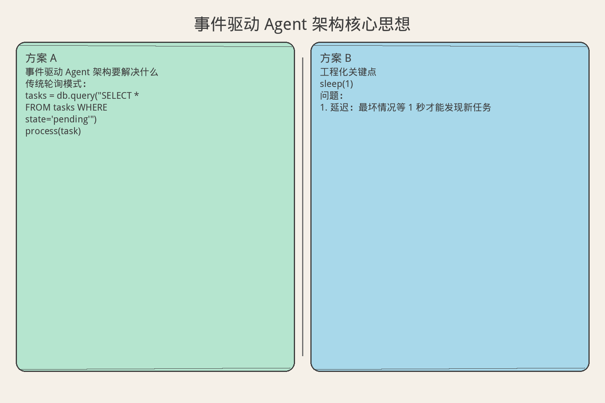
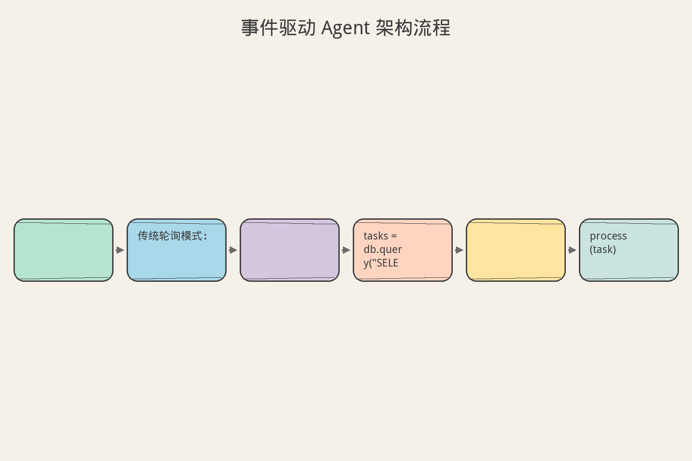
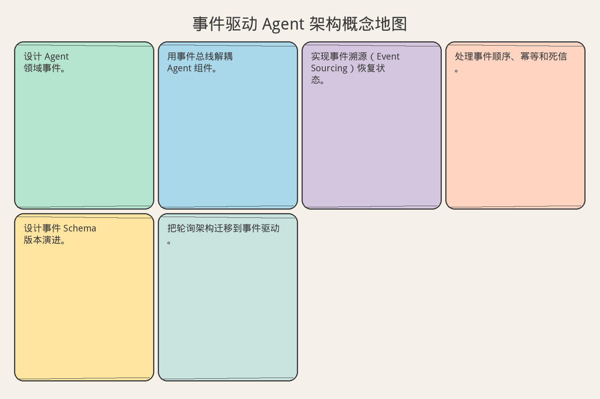

# AI Agent 工程（三十六）：事件驱动 Agent 架构

> 事件让 Agent 与业务系统解耦：任务创建、工具完成、审批决定和超时都通过稳定事件推进状态，而不是依赖一个进程持续轮询。

**阅读建议：** 先阅读 [248 Agent 后台任务](248.agent-background-job-tutorial.md)，理解异步任务和 worker 模式。

**环境要求：**
- Python **3.10+**
- 依赖：`pip install pydantic`

---

## 目录

1. [你会学到什么](#你会学到什么)
2. [它解决什么问题](#它解决什么问题)
3. [核心概念：事件驱动 vs 轮询](#核心概念事件驱动-vs-轮询)
4. [最小示例](#最小示例)
5. [工程化版本](#工程化版本)
6. [常见失败模式](#常见失败模式)
7. [什么时候不要这么做](#什么时候不要这么做)
8. [生产环境注意事项](#生产环境注意事项)
9. [如何观测和评测](#如何观测和评测)
10. [和 RAG / 后端 / 前端的关系](#和-rag--后端--前端的关系)
11. [面试怎么讲](#面试怎么讲)
12. [下一步](#下一步)

## 你会学到什么

- 设计 Agent 领域事件。
- 用事件总线解耦 Agent 组件。
- 实现事件溯源（Event Sourcing）恢复状态。
- 处理事件顺序、幂等和死信。
- 设计事件 Schema 版本演进。
- 把轮询架构迁移到事件驱动。

## 它解决什么问题


读下图时，先看「事件驱动 Agent 架构核心思想」建立直觉。


### 轮询架构的痛点

```text
传统轮询模式：
  while True:
      tasks = db.query("SELECT * FROM tasks WHERE state='pending'")
      for task in tasks:
          process(task)
      sleep(1)

问题：
  1. 延迟：最坏情况等 1 秒才能发现新任务
  2. 资源浪费：99% 的查询返回空结果
  3. 耦合：所有逻辑都在一个循环里
  4. 扩展难：多实例会重复处理
  5. 不可追溯：没有历史记录
```

### 事件驱动的解法

```text
事件驱动模式：
  任务创建 → 发布 TaskCreated 事件
  → 订阅者 A：分配 worker
  → 订阅者 B：记录审计日志
  → 订阅者 C：通知用户

优势：
  1. 实时：事件发布后立即触发
  2. 解耦：新增订阅者不改原有代码
  3. 可追溯：事件流就是完整历史
  4. 可扩展：多个消费者并行处理
  5. 可回放：重放事件恢复状态
```

## 核心概念：事件驱动 vs 轮询

### 对比表

```text
维度          轮询              事件驱动
─────────────────────────────────────────────
延迟          取决于轮询间隔     毫秒级
资源消耗      持续消耗           按需消耗
耦合度        高（知道谁处理）   低（只管发事件）
可追溯性      需要额外日志       事件流即历史
扩展性        需要分布式锁       天然支持多消费者
复杂度        低（起步）         中（需要事件总线）
适用场景      简单定时任务       复杂 Agent 工作流
```

### Agent 中的典型事件

```text
生命周期事件：
  TaskSubmitted      用户提交任务
  TaskAssigned       分配给 worker
  TaskStarted        开始执行
  TaskProgressed     步骤推进
  TaskCompleted      执行完成
  TaskFailed         执行失败
  TaskCancelled      用户取消

工具事件：
  ToolCallRequested  请求调用工具
  ToolCallSucceeded  工具调用成功
  ToolCallFailed     工具调用失败
  ToolCallRetried    工具调用重试

审批事件：
  ApprovalRequested  需要人工审批
  ApprovalGranted    审批通过
  ApprovalDenied     审批拒绝
  ApprovalTimeout    审批超时

系统事件：
  WorkerHealthy      worker 健康检查
  WorkerOverloaded   worker 过载
  QueueBacklogged    队列积压
```

## 最小示例


读下图时，先看「事件驱动 Agent 架构流程」建立直觉。


### 内存事件总线

```python
import asyncio
from dataclasses import dataclass, field
from datetime import datetime, timezone
from typing import Any, Callable, Awaitable
from collections import defaultdict


@dataclass(frozen=True)
class Event:
    """所有事件的基类。"""
    event_id: str
    event_type: str
    timestamp: str
    payload: dict = field(default_factory=dict)

    @staticmethod
    def create(event_type: str, payload: dict) -> "Event":
        import uuid
        return Event(
            event_id=uuid.uuid4().hex[:12],
            event_type=event_type,
            timestamp=datetime.now(timezone.utc).isoformat(),
            payload=payload,
        )


class EventBus:
    """简单的内存事件总线。"""

    def __init__(self):
        self._handlers: dict[str, list[Callable]] = defaultdict(list)
        self._history: list[Event] = []

    def subscribe(self, event_type: str, handler: Callable[[Event], Awaitable[None]]):
        """订阅某类事件。"""
        self._handlers[event_type].append(handler)

    async def publish(self, event: Event):
        """发布事件给所有订阅者。"""
        self._history.append(event)
        handlers = self._handlers.get(event.event_type, [])
        for handler in handlers:
            try:
                await handler(event)
            except Exception as e:
                print(f"  [ERROR] 处理 {event.event_type} 失败: {e}")

    @property
    def history(self) -> list[Event]:
        return list(self._history)


# 使用示例
async def demo_basic_event_bus():
    bus = EventBus()

    # 订阅者 1：日志记录
    async def log_handler(event: Event):
        print(f"  [LOG] {event.event_type}: {event.payload}")

    # 订阅者 2：状态更新
    async def state_handler(event: Event):
        if event.event_type == "task_completed":
            print(f"  [STATE] 任务 {event.payload['task_id']} 完成！")

    bus.subscribe("task_created", log_handler)
    bus.subscribe("task_completed", log_handler)
    bus.subscribe("task_completed", state_handler)

    # 发布事件
    await bus.publish(Event.create("task_created", {"task_id": "T-001", "query": "分析数据"}))
    await bus.publish(Event.create("task_completed", {"task_id": "T-001", "result": "摘要..."}))

    print(f"\n  事件历史: {len(bus.history)} 条")
```

### 运行结果

```text
  [LOG] task_created: {'task_id': 'T-001', 'query': '分析数据'}
  [LOG] task_completed: {'task_id': 'T-001', 'result': '摘要...'}
  [STATE] 任务 T-001 完成！

  事件历史: 2 条
```

## 工程化版本

### 带中间件的事件总线

```python
import asyncio
import uuid
from dataclasses import dataclass, field
from datetime import datetime, timezone
from typing import Callable, Awaitable
from collections import defaultdict
from enum import Enum


class EventType(str, Enum):
    TASK_SUBMITTED = "task.submitted"
    TASK_ASSIGNED = "task.assigned"
    TASK_STARTED = "task.started"
    TASK_PROGRESS = "task.progress"
    TASK_COMPLETED = "task.completed"
    TASK_FAILED = "task.failed"
    TOOL_CALL_REQUESTED = "tool.call.requested"
    TOOL_CALL_SUCCEEDED = "tool.call.succeeded"
    TOOL_CALL_FAILED = "tool.call.failed"
    APPROVAL_REQUESTED = "approval.requested"
    APPROVAL_GRANTED = "approval.granted"
    APPROVAL_DENIED = "approval.denied"


@dataclass(frozen=True)
class DomainEvent:
    """领域事件（不可变）。"""
    event_id: str
    event_type: EventType
    aggregate_id: str  # 关联的实体 ID（如 task_id）
    timestamp: str
    payload: dict
    metadata: dict = field(default_factory=dict)

    @staticmethod
    def new(event_type: EventType, aggregate_id: str, payload: dict, **meta) -> "DomainEvent":
        return DomainEvent(
            event_id=uuid.uuid4().hex,
            event_type=event_type,
            aggregate_id=aggregate_id,
            timestamp=datetime.now(timezone.utc).isoformat(),
            payload=payload,
            metadata=meta,
        )


# 中间件类型
Middleware = Callable[["DomainEvent", Callable], Awaitable[None]]


class ProductionEventBus:
    """生产级事件总线：支持中间件、错误隔离、事件存储。"""

    def __init__(self):
        self._handlers: dict[EventType, list[Callable]] = defaultdict(list)
        self._middlewares: list[Middleware] = []
        self._event_store: list[DomainEvent] = []
        self._dead_letter: list[tuple[DomainEvent, str]] = []
        self._processed_ids: set[str] = set()  # 幂等去重

    def use(self, middleware: Middleware):
        """注册中间件。"""
        self._middlewares.append(middleware)

    def on(self, event_type: EventType, handler: Callable[[DomainEvent], Awaitable[None]]):
        """订阅事件。"""
        self._handlers[event_type].append(handler)

    async def emit(self, event: DomainEvent):
        """发布事件（经过中间件链）。"""
        # 幂等检查
        if event.event_id in self._processed_ids:
            print(f"  [SKIP] 重复事件: {event.event_id}")
            return
        self._processed_ids.add(event.event_id)

        # 存储
        self._event_store.append(event)

        # 构建中间件链
        async def core(e: DomainEvent):
            handlers = self._handlers.get(e.event_type, [])
            for handler in handlers:
                try:
                    await handler(e)
                except Exception as ex:
                    self._dead_letter.append((e, str(ex)))
                    print(f"  [DLQ] {e.event_type} → {ex}")

        chain = core
        for mw in reversed(self._middlewares):
            prev = chain
            async def make_chain(mw=mw, prev=prev):
                async def next_fn(e):
                    await mw(e, prev)
                return next_fn
            chain = await make_chain()

        await chain(event)

    def replay(self, aggregate_id: str) -> list[DomainEvent]:
        """回放某个实体的所有事件。"""
        return [e for e in self._event_store if e.aggregate_id == aggregate_id]

    @property
    def dead_letters(self) -> list[tuple[DomainEvent, str]]:
        return list(self._dead_letter)


# 中间件示例
async def logging_middleware(event: DomainEvent, next_fn: Callable):
    print(f"  [MW:LOG] {event.event_type.value} | {event.aggregate_id}")
    await next_fn(event)


async def metrics_middleware(event: DomainEvent, next_fn: Callable):
    import time
    start = time.perf_counter()
    await next_fn(event)
    elapsed = (time.perf_counter() - start) * 1000
    print(f"  [MW:METRIC] {event.event_type.value} 耗时 {elapsed:.1f}ms")
```

### Agent 任务聚合（Event Sourcing）

```python
class TaskAggregate:
    """任务聚合根：通过事件重建状态。"""

    def __init__(self, task_id: str):
        self.task_id = task_id
        self.state = "unknown"
        self.query = ""
        self.current_step = 0
        self.total_steps = 0
        self.result: str | None = None
        self.error: str | None = None
        self._pending_events: list[DomainEvent] = []

    def apply(self, event: DomainEvent):
        """应用事件，更新状态（纯函数，无副作用）。"""
        match event.event_type:
            case EventType.TASK_SUBMITTED:
                self.state = "pending"
                self.query = event.payload.get("query", "")
                self.total_steps = event.payload.get("total_steps", 5)
            case EventType.TASK_ASSIGNED:
                self.state = "assigned"
            case EventType.TASK_STARTED:
                self.state = "running"
            case EventType.TASK_PROGRESS:
                self.current_step = event.payload.get("step", self.current_step)
            case EventType.TASK_COMPLETED:
                self.state = "completed"
                self.result = event.payload.get("result")
            case EventType.TASK_FAILED:
                self.state = "failed"
                self.error = event.payload.get("error")

    @staticmethod
    def rebuild(task_id: str, events: list[DomainEvent]) -> "TaskAggregate":
        """从事件流重建聚合状态。"""
        agg = TaskAggregate(task_id)
        for event in events:
            agg.apply(event)
        return agg

    def __repr__(self):
        return (f"Task({self.task_id}, state={self.state}, "
                f"step={self.current_step}/{self.total_steps})")


# 演示事件溯源
async def demo_event_sourcing():
    bus = ProductionEventBus()
    bus.use(logging_middleware)

    task_id = "TASK-ES-001"

    # 发布一系列事件
    events = [
        DomainEvent.new(EventType.TASK_SUBMITTED, task_id, {"query": "分析销售数据", "total_steps": 4}),
        DomainEvent.new(EventType.TASK_ASSIGNED, task_id, {"worker": "w-01"}),
        DomainEvent.new(EventType.TASK_STARTED, task_id, {}),
        DomainEvent.new(EventType.TASK_PROGRESS, task_id, {"step": 1}),
        DomainEvent.new(EventType.TASK_PROGRESS, task_id, {"step": 2}),
        DomainEvent.new(EventType.TASK_PROGRESS, task_id, {"step": 3}),
        DomainEvent.new(EventType.TASK_PROGRESS, task_id, {"step": 4}),
        DomainEvent.new(EventType.TASK_COMPLETED, task_id, {"result": "Q3 销售增长 15%"}),
    ]

    for event in events:
        await bus.emit(event)

    # 从事件流重建状态
    history = bus.replay(task_id)
    task = TaskAggregate.rebuild(task_id, history)
    print(f"\n  重建结果: {task}")
    # → Task(TASK-ES-001, state=completed, step=4/4)
```

## 常见失败模式

### 1. 事件丢失

```text
场景：
  发布事件后、订阅者处理前，进程崩溃

后果：
  任务永远停在 pending 状态

解决：
  1. Outbox 模式：事件先写数据库，再异步投递
  2. 事件持久化：写入 Kafka / Redis Stream
  3. 补偿扫描：定时扫描"卡住"的任务
```

```python
class OutboxPublisher:
    """Outbox 模式：保证事件不丢。"""

    def __init__(self):
        self._outbox: list[DomainEvent] = []  # 模拟数据库表
        self._bus: ProductionEventBus | None = None

    def set_bus(self, bus: ProductionEventBus):
        self._bus = bus

    def save_with_event(self, task_data: dict, event: DomainEvent):
        """在同一个事务中保存数据和事件。"""
        # 实际中：BEGIN TRANSACTION
        #   INSERT INTO tasks ...
        #   INSERT INTO outbox ...
        # COMMIT
        self._outbox.append(event)
        print(f"  [OUTBOX] 事件已写入: {event.event_type.value}")

    async def flush(self):
        """后台线程：把 outbox 中的事件投递到总线。"""
        while self._outbox:
            event = self._outbox.pop(0)
            if self._bus:
                await self._bus.emit(event)
            print(f"  [OUTBOX] 已投递: {event.event_id}")
```

### 2. 事件乱序

```text
场景：
  TaskCompleted 先于 TaskProgress(step=4) 到达

后果：
  状态被错误覆盖

解决：
  1. 版本号：每个事件带 version，只接受递增的
  2. 分区有序：同一 task_id 的事件路由到同一分区
  3. 幂等 apply：apply 函数能处理乱序
```

```python
class OrderedTaskAggregate(TaskAggregate):
    """带版本检查的任务聚合。"""

    def __init__(self, task_id: str):
        super().__init__(task_id)
        self._version = 0

    def apply(self, event: DomainEvent):
        event_version = event.metadata.get("version", 0)
        if event_version <= self._version:
            print(f"  [SKIP] 旧版本事件: v{event_version} <= v{self._version}")
            return
        self._version = event_version
        super().apply(event)
```

### 3. 重复消费

```text
场景：
  网络超时 → 消费者没 ACK → 消息重新投递

后果：
  同一个工具被调用两次（如重复发邮件）

解决：
  1. 事件 ID 去重（已实现：_processed_ids）
  2. 工具调用幂等键
  3. 数据库唯一约束
```

### 4. 死信堆积

```text
场景：
  某个 handler 持续报错（如依赖服务不可用）

后果：
  死信队列无限增长，占用内存

解决：
  1. 死信队列设上限
  2. 自动重试（指数退避，最多 3 次）
  3. 告警：死信数量 > 阈值时通知
  4. 人工处理入口
```

## 什么时候不要这么做

```text
不适合事件驱动的场景：

1. 简单的请求-响应
   用户问一个问题 → Agent 回答
   延迟 < 2 秒，不需要事件

2. 强一致性要求
   转账：A 扣钱和 B 加钱必须原子
   事件驱动是最终一致性，不适合

3. 团队不熟悉
   事件驱动调试困难（分布式追踪）
   如果团队只有 1-2 人，轮询更简单

4. 事件量极小
   每天只有 10 个任务
   轮询完全够用，不需要引入复杂度
```

## 生产环境注意事项

### 事件 Schema 版本演进

```python
from dataclasses import dataclass


@dataclass
class SchemaRegistry:
    """事件 Schema 注册表（版本管理）。"""

    _schemas: dict[str, dict] = None

    def __post_init__(self):
        self._schemas = {
            "task.completed": {
                "v1": {"required": ["task_id", "result"]},
                "v2": {"required": ["task_id", "result", "duration_ms", "tokens_used"]},
            },
            "tool.call.requested": {
                "v1": {"required": ["tool_name", "parameters"]},
                "v2": {"required": ["tool_name", "parameters", "timeout_ms", "idempotency_key"]},
            },
        }

    def validate(self, event_type: str, version: str, payload: dict) -> bool:
        schema = self._schemas.get(event_type, {}).get(version)
        if not schema:
            return False
        return all(k in payload for k in schema["required"])

    def migrate_v1_to_v2(self, event_type: str, payload: dict) -> dict:
        """将 v1 事件升级为 v2（向后兼容）。"""
        if event_type == "task.completed":
            payload.setdefault("duration_ms", 0)
            payload.setdefault("tokens_used", 0)
        elif event_type == "tool.call.requested":
            payload.setdefault("timeout_ms", 30000)
            payload.setdefault("idempotency_key", "")
        return payload
```

### 事件分区与顺序保证

```text
Kafka 分区策略：
  key = task_id
  → 同一个 task 的所有事件进入同一个 partition
  → partition 内有序
  → 不同 task 之间可以并行

Redis Stream 策略：
  每个 task 一个 stream：events:{task_id}
  → 天然有序
  → 消费者组实现多消费者

选择建议：
  事件量 < 1000/s → Redis Stream（简单）
  事件量 > 1000/s → Kafka（吞吐）
  需要长期存储 → Kafka + 对象存储归档
```

### 背压处理

```python
class BackpressureGuard:
    """背压保护：防止消费者被淹没。"""

    def __init__(self, max_pending: int = 100, drain_threshold: int = 20):
        self.max_pending = max_pending
        self.drain_threshold = drain_threshold
        self._pending = 0
        self._paused = False

    def can_accept(self) -> bool:
        return self._pending < self.max_pending

    def on_received(self):
        self._pending += 1
        if self._pending >= self.max_pending:
            self._paused = True
            print("  [BACKPRESSURE] 暂停消费，等待排空...")

    def on_processed(self):
        self._pending -= 1
        if self._paused and self._pending <= self.drain_threshold:
            self._paused = False
            print("  [BACKPRESSURE] 恢复消费")

    @property
    def is_paused(self) -> bool:
        return self._paused
```

## 如何观测和评测

### 事件追踪

```python
class EventTracer:
    """分布式事件追踪。"""

    def __init__(self):
        self._traces: dict[str, list[dict]] = defaultdict(list)

    def trace(self, event: DomainEvent, handler_name: str, duration_ms: float, success: bool):
        self._traces[event.aggregate_id].append({
            "event_id": event.event_id,
            "event_type": event.event_type.value,
            "handler": handler_name,
            "duration_ms": round(duration_ms, 2),
            "success": success,
            "timestamp": event.timestamp,
        })

    def get_trace(self, aggregate_id: str) -> list[dict]:
        """获取某个实体的完整事件链。"""
        return self._traces.get(aggregate_id, [])

    def summary(self) -> dict:
        """全局统计。"""
        total_events = sum(len(v) for v in self._traces.values())
        failed = sum(
            1 for traces in self._traces.values()
            for t in traces if not t["success"]
        )
        return {
            "total_traces": len(self._traces),
            "total_events": total_events,
            "failed_events": failed,
            "success_rate": round((total_events - failed) / max(total_events, 1), 4),
        }
```

### 评测指标

```text
事件驱动系统评测：

1. 端到端延迟
   从 TaskSubmitted 到 TaskCompleted 的时间
   目标：P95 < 30s（取决于 Agent 复杂度）

2. 事件投递成功率
   成功投递 / 总发布数
   目标：> 99.9%

3. 死信率
   进入死信队列 / 总事件数
   目标：< 0.1%

4. 消费者 lag
   未消费事件数
   目标：< 100（实时系统）

5. 状态重建正确性
   回放事件后状态 == 实际状态
   目标：100%（否则有 bug）
```

## 和 RAG / 后端 / 前端的关系

```text
与 RAG 的关系：
  检索完成 → 发布 RetrievalCompleted 事件
  → 触发 LLM 生成（解耦检索和生成）
  → 检索失败 → 发布事件 → 触发降级策略

与后端的关系：
  事件总线是微服务通信的骨架
  API Gateway → 发布事件 → 各服务订阅
  替代同步 RPC，提高系统弹性

与前端的关系：
  后端事件 → WebSocket/SSE → 前端实时更新
  用户看到：任务进度条、步骤动画、完成通知
  不需要前端轮询
```

## 面试怎么讲

```text
问：你的 Agent 系统怎么处理异步通信？

答（30 秒版）：
  我们用事件驱动架构。
  Agent 的每个状态变化都发布领域事件（TaskSubmitted、ToolCallSucceeded 等）。
  事件总线负责路由，订阅者各自处理（状态更新、日志、通知）。
  用 Event Sourcing 做状态恢复：不存最终状态，存事件流，回放重建。
  好处是解耦、可追溯、可扩展。

追问 1：事件丢了怎么办？
  → Outbox 模式：事件和业务数据在同一个事务写入数据库，
    后台进程异步投递到消息队列。投递成功后标记已发送。

追问 2：事件乱序怎么办？
  → 同一 aggregate 的事件路由到同一分区（Kafka key = task_id）。
    聚合根 apply 时检查版本号，拒绝旧版本。

追问 3：和直接调用有什么区别？
  → 直接调用是同步耦合：A 调 B，B 挂了 A 也挂。
    事件是异步解耦：A 发事件，B 暂时挂了没关系，
    恢复后从队列继续消费。系统是最终一致的。
```

## 完整示例：事件驱动 Agent 编排

```python
async def demo_full_event_driven_agent():
    """完整演示：事件驱动的 Agent 任务编排。"""

    bus = ProductionEventBus()
    bus.use(logging_middleware)

    # 注册处理器
    task_states: dict[str, TaskAggregate] = {}

    async def on_submitted(event: DomainEvent):
        task = TaskAggregate(event.aggregate_id)
        task.apply(event)
        task_states[event.aggregate_id] = task
        # 自动触发分配
        await bus.emit(DomainEvent.new(
            EventType.TASK_ASSIGNED, event.aggregate_id,
            {"worker": "auto-assign"}
        ))

    async def on_assigned(event: DomainEvent):
        task_states[event.aggregate_id].apply(event)
        # 自动触发开始
        await bus.emit(DomainEvent.new(
            EventType.TASK_STARTED, event.aggregate_id, {}
        ))

    async def on_completed(event: DomainEvent):
        task_states[event.aggregate_id].apply(event)
        print(f"  ✓ 任务完成: {event.payload.get('result', '')[:30]}")

    bus.on(EventType.TASK_SUBMITTED, on_submitted)
    bus.on(EventType.TASK_ASSIGNED, on_assigned)
    bus.on(EventType.TASK_STARTED, lambda e: task_states[e.aggregate_id].apply(e))
    bus.on(EventType.TASK_PROGRESS, lambda e: task_states[e.aggregate_id].apply(e))
    bus.on(EventType.TASK_COMPLETED, on_completed)

    # 提交任务
    task_id = "TASK-FULL-001"
    await bus.emit(DomainEvent.new(
        EventType.TASK_SUBMITTED, task_id,
        {"query": "生成本季度销售报告", "total_steps": 3}
    ))

    # 模拟进度
    for step in range(1, 4):
        await bus.emit(DomainEvent.new(
            EventType.TASK_PROGRESS, task_id, {"step": step}
        ))

    # 完成
    await bus.emit(DomainEvent.new(
        EventType.TASK_COMPLETED, task_id,
        {"result": "Q3 销售额同比增长 15%，环比增长 8%"}
    ))

    # 验证状态
    final = task_states[task_id]
    print(f"\n  最终状态: {final}")
    print(f"  事件总数: {len(bus.replay(task_id))}")


# 运行
# asyncio.run(demo_full_event_driven_agent())
```

## 事件驱动系统的测试策略

### 单元测试：聚合根

```python
import pytest


def test_task_aggregate_happy_path():
    """测试正常流程的事件应用。"""
    task = TaskAggregate("T-TEST")

    task.apply(DomainEvent.new(EventType.TASK_SUBMITTED, "T-TEST", {"query": "测试", "total_steps": 3}))
    assert task.state == "pending"
    assert task.query == "测试"

    task.apply(DomainEvent.new(EventType.TASK_STARTED, "T-TEST", {}))
    assert task.state == "running"

    task.apply(DomainEvent.new(EventType.TASK_PROGRESS, "T-TEST", {"step": 2}))
    assert task.current_step == 2

    task.apply(DomainEvent.new(EventType.TASK_COMPLETED, "T-TEST", {"result": "完成"}))
    assert task.state == "completed"
    assert task.result == "完成"


def test_task_aggregate_failure():
    """测试失败路径。"""
    task = TaskAggregate("T-FAIL")
    task.apply(DomainEvent.new(EventType.TASK_SUBMITTED, "T-FAIL", {"query": "x", "total_steps": 2}))
    task.apply(DomainEvent.new(EventType.TASK_STARTED, "T-FAIL", {}))
    task.apply(DomainEvent.new(EventType.TASK_FAILED, "T-FAIL", {"error": "LLM 超时"}))

    assert task.state == "failed"
    assert task.error == "LLM 超时"


def test_event_sourcing_rebuild():
    """测试从事件流重建状态。"""
    events = [
        DomainEvent.new(EventType.TASK_SUBMITTED, "T-R", {"query": "重建", "total_steps": 2}),
        DomainEvent.new(EventType.TASK_STARTED, "T-R", {}),
        DomainEvent.new(EventType.TASK_PROGRESS, "T-R", {"step": 1}),
        DomainEvent.new(EventType.TASK_PROGRESS, "T-R", {"step": 2}),
        DomainEvent.new(EventType.TASK_COMPLETED, "T-R", {"result": "ok"}),
    ]
    task = TaskAggregate.rebuild("T-R", events)
    assert task.state == "completed"
    assert task.current_step == 2
```

### 集成测试：事件总线

```python
@pytest.mark.asyncio
async def test_event_bus_pub_sub():
    """测试事件总线的发布-订阅。"""
    bus = ProductionEventBus()
    received = []

    async def handler(event: DomainEvent):
        received.append(event)

    bus.on(EventType.TASK_SUBMITTED, handler)
    await bus.emit(DomainEvent.new(EventType.TASK_SUBMITTED, "T-1", {"query": "hi"}))

    assert len(received) == 1
    assert received[0].payload["query"] == "hi"


@pytest.mark.asyncio
async def test_event_bus_idempotency():
    """测试幂等：同一事件不重复处理。"""
    bus = ProductionEventBus()
    count = 0

    async def counter(event: DomainEvent):
        nonlocal count
        count += 1

    bus.on(EventType.TASK_STARTED, counter)
    event = DomainEvent.new(EventType.TASK_STARTED, "T-2", {})

    await bus.emit(event)
    await bus.emit(event)  # 重复发布

    assert count == 1  # 只处理一次


@pytest.mark.asyncio
async def test_dead_letter_on_handler_error():
    """测试 handler 报错进入死信。"""
    bus = ProductionEventBus()

    async def bad_handler(event: DomainEvent):
        raise ValueError("模拟故障")

    bus.on(EventType.TOOL_CALL_FAILED, bad_handler)
    await bus.emit(DomainEvent.new(EventType.TOOL_CALL_FAILED, "T-3", {"tool": "search"}))

    assert len(bus.dead_letters) == 1
    assert "模拟故障" in bus.dead_letters[0][1]
```

### 契约测试：事件 Schema

```python
def test_event_schema_v2_backward_compatible():
    """测试 v2 Schema 向后兼容 v1。"""
    registry = SchemaRegistry()

    # v1 事件
    v1_payload = {"task_id": "T-1", "result": "ok"}
    assert registry.validate("task.completed", "v1", v1_payload)

    # v1 事件升级为 v2
    v2_payload = registry.migrate_v1_to_v2("task.completed", v1_payload.copy())
    assert registry.validate("task.completed", "v2", v2_payload)
    assert v2_payload["duration_ms"] == 0  # 默认值
    assert v2_payload["tokens_used"] == 0


def test_event_schema_validation_rejects_incomplete():
    """测试不完整事件被拒绝。"""
    registry = SchemaRegistry()
    incomplete = {"task_id": "T-1"}  # 缺少 result
    assert not registry.validate("task.completed", "v1", incomplete)
```

## 从轮询迁移到事件驱动

### 迁移步骤

```text
第一步：识别事件
  列出系统中所有"状态变化"
  每个变化 = 一个事件
  例：任务创建、步骤完成、工具调用、审批决定

第二步：引入事件总线（不删旧代码）
  在现有代码中"顺便"发布事件
  旧轮询逻辑继续运行（双写）
  新订阅者开始消费事件

第三步：验证一致性
  对比：轮询结果 vs 事件驱动结果
  运行 1-2 周，确认无差异

第四步：关闭轮询
  确认事件驱动稳定后
  删除轮询代码
  保留事件总线

第五步：优化
  引入 Outbox 模式保证不丢
  引入分区保证顺序
  引入死信队列处理异常
```

### 迁移中的兼容层

```python
class PollingToEventAdapter:
    """兼容层：把轮询结果转换为事件。"""

    def __init__(self, bus: ProductionEventBus):
        self._bus = bus
        self._seen_states: dict[str, str] = {}  # task_id → last_state

    async def on_poll_result(self, tasks: list[dict]):
        """每次轮询后调用：检测状态变化并发布事件。"""
        for task in tasks:
            task_id = task["task_id"]
            new_state = task["state"]
            old_state = self._seen_states.get(task_id)

            if old_state != new_state:
                event_type = self._state_to_event(new_state)
                if event_type:
                    await self._bus.emit(DomainEvent.new(
                        event_type, task_id, task
                    ))
                self._seen_states[task_id] = new_state

    def _state_to_event(self, state: str) -> EventType | None:
        mapping = {
            "pending": EventType.TASK_SUBMITTED,
            "running": EventType.TASK_STARTED,
            "completed": EventType.TASK_COMPLETED,
            "failed": EventType.TASK_FAILED,
        }
        return mapping.get(state)
```

## 下一步


读下图时，先看「事件驱动 Agent 架构概念地图」建立直觉。


下一篇 [250 构建知识库 Agent](250.build-knowledge-base-agent-tutorial.md) 会综合运用事件驱动、后台任务和 Agent 循环，构建一个完整的知识库管理 Agent。
