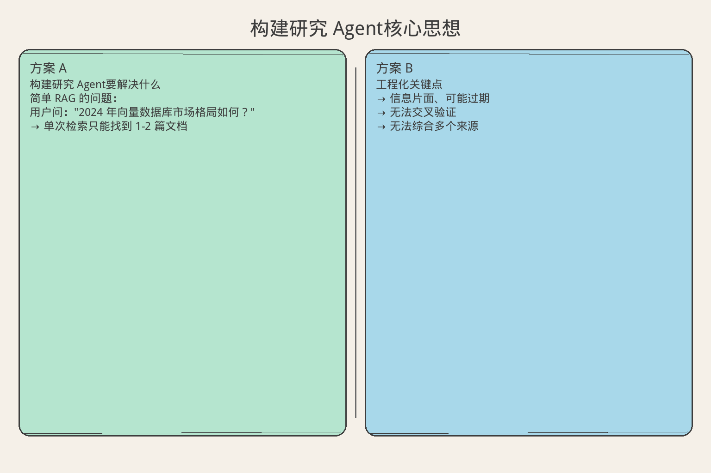
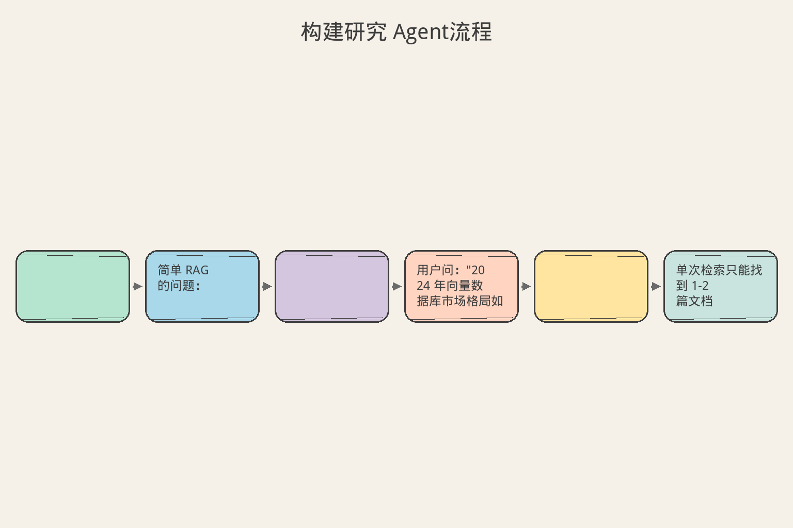
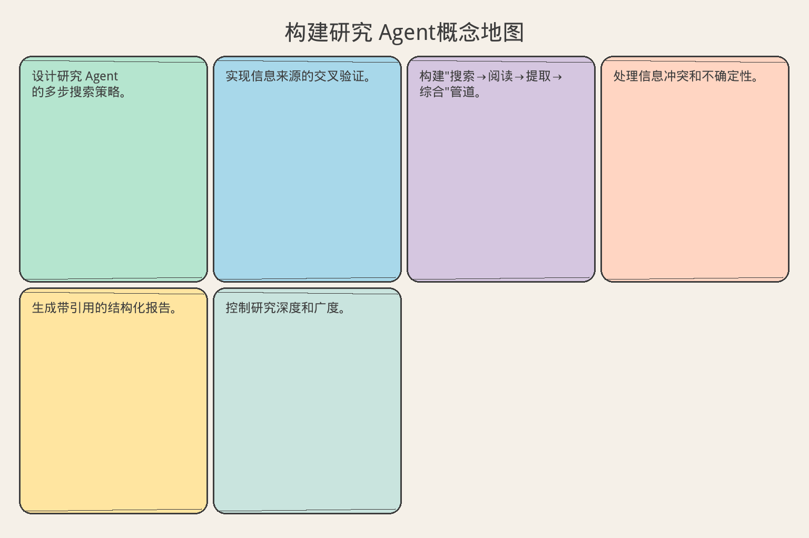

# AI Agent 工程（三十八）：构建研究 Agent

> 研究 Agent 能自主规划搜索策略、阅读多个来源、交叉验证信息、综合成结构化报告——而不是简单地"搜一下然后总结"。

**阅读建议：** 先阅读 [250 知识库 Agent](250.build-knowledge-base-agent-tutorial.md)，理解 Agent 工具设计和生命周期管理。

**环境要求：**
- Python **3.10+**
- 依赖：`pip install pydantic`

---

## 目录

1. [你会学到什么](#你会学到什么)
2. [它解决什么问题](#它解决什么问题)
3. [核心概念：研究 Agent 的工作流](#核心概念研究-agent-的工作流)
4. [最小示例](#最小示例)
5. [工程化版本](#工程化版本)
6. [常见失败模式](#常见失败模式)
7. [什么时候不要这么做](#什么时候不要这么做)
8. [生产环境注意事项](#生产环境注意事项)
9. [如何观测和评测](#如何观测和评测)
10. [和 RAG / 后端 / 前端的关系](#和-rag--后端--前端的关系)
11. [面试怎么讲](#面试怎么讲)
12. [下一步](#下一步)

## 你会学到什么

- 设计研究 Agent 的多步搜索策略。
- 实现信息来源的交叉验证。
- 构建"搜索→阅读→提取→综合"管道。
- 处理信息冲突和不确定性。
- 生成带引用的结构化报告。
- 控制研究深度和广度。

## 它解决什么问题


读下图时，先看「构建研究 Agent核心思想」建立直觉。


### 单次搜索的局限

```text
简单 RAG 的问题：
  用户问："2024 年向量数据库市场格局如何？"
  → 单次检索只能找到 1-2 篇文档
  → 信息片面、可能过期
  → 无法交叉验证
  → 无法综合多个来源

研究 Agent 的解法：
  1. 分解问题 → 多个子查询
  2. 多轮搜索 → 覆盖不同角度
  3. 阅读摘要 → 提取关键信息
  4. 交叉验证 → 标记冲突
  5. 综合报告 → 带引用、带置信度
```

### 研究 Agent vs 普通 RAG

```text
维度          普通 RAG          研究 Agent
─────────────────────────────────────────────
搜索次数      1 次              多次（5-20）
信息来源      单一向量库        多源（网页、论文、内部文档）
验证          无                交叉验证
输出          一段回答          结构化报告
耗时          < 3 秒            30 秒 - 5 分钟
适用场景      简单问答          深度研究、调研报告
```

## 核心概念：研究 Agent 的工作流

### 五阶段模型

```text
阶段 1：规划（Plan）
  输入：用户的研究问题
  输出：搜索计划（子问题列表、搜索策略）
  决策：需要搜几轮？用什么关键词？

阶段 2：搜索（Search）
  输入：子查询
  输出：候选文档列表
  工具：web_search, internal_search, paper_search

阶段 3：阅读（Read）
  输入：候选文档
  输出：关键信息提取
  决策：哪些文档值得深读？

阶段 4：验证（Verify）
  输入：提取的信息
  输出：验证结果（一致/冲突/不确定）
  决策：冲突时相信谁？

阶段 5：综合（Synthesize）
  输入：验证后的信息
  输出：结构化报告
  格式：带引用、带置信度、带局限性说明
```

## 最小示例


读下图时，先看「构建研究 Agent流程」建立直觉。


### 研究 Agent 核心

```python
from dataclasses import dataclass, field
from enum import Enum
from typing import Any
import uuid


class ResearchPhase(str, Enum):
    PLANNING = "planning"
    SEARCHING = "searching"
    READING = "reading"
    VERIFYING = "verifying"
    SYNTHESIZING = "synthesizing"
    DONE = "done"


@dataclass
class SearchPlan:
    """研究计划。"""
    original_question: str
    sub_queries: list[str]
    max_sources: int = 10
    strategy: str = "breadth_first"  # breadth_first | depth_first


@dataclass
class Source:
    """信息来源。"""
    source_id: str
    title: str
    url: str
    content: str
    relevance: float = 0.0  # 0-1
    credibility: float = 0.5  # 0-1


@dataclass
class Finding:
    """研究发现。"""
    claim: str
    source_ids: list[str]
    confidence: float  # 0-1
    conflicting: bool = False


@dataclass
class ResearchReport:
    """研究报告。"""
    question: str
    summary: str
    findings: list[Finding]
    sources_used: list[Source]
    limitations: list[str]
    confidence_overall: float


class ResearchAgent:
    """研究型 Agent（最小版本）。"""

    def __init__(self):
        self.phase = ResearchPhase.PLANNING
        self.sources: list[Source] = []
        self.findings: list[Finding] = []
        self.log: list[str] = []

    def plan(self, question: str) -> SearchPlan:
        """阶段 1：规划搜索策略。"""
        self.phase = ResearchPhase.PLANNING
        # 模拟 LLM 分解问题
        sub_queries = self._decompose_question(question)
        plan = SearchPlan(
            original_question=question,
            sub_queries=sub_queries,
            max_sources=8,
        )
        self._log(f"规划完成: {len(sub_queries)} 个子查询")
        return plan

    def search(self, plan: SearchPlan) -> list[Source]:
        """阶段 2：执行多轮搜索。"""
        self.phase = ResearchPhase.SEARCHING
        all_sources = []

        for i, query in enumerate(plan.sub_queries):
            results = self._mock_search(query)
            all_sources.extend(results)
            self._log(f"搜索 [{i+1}/{len(plan.sub_queries)}]: '{query}' → {len(results)} 条")

        # 去重 + 排序
        seen_urls = set()
        unique = []
        for s in all_sources:
            if s.url not in seen_urls:
                seen_urls.add(s.url)
                unique.append(s)

        unique.sort(key=lambda s: s.relevance, reverse=True)
        self.sources = unique[:plan.max_sources]
        self._log(f"搜索完成: {len(self.sources)} 个有效来源")
        return self.sources

    def read_and_extract(self, sources: list[Source]) -> list[Finding]:
        """阶段 3：阅读并提取关键信息。"""
        self.phase = ResearchPhase.READING
        findings = []

        for source in sources:
            # 模拟 LLM 提取关键声明
            claims = self._extract_claims(source)
            for claim in claims:
                findings.append(Finding(
                    claim=claim,
                    source_ids=[source.source_id],
                    confidence=source.credibility * source.relevance,
                ))

        self.findings = findings
        self._log(f"提取完成: {len(findings)} 条发现")
        return findings

    def verify(self, findings: list[Finding]) -> list[Finding]:
        """阶段 4：交叉验证。"""
        self.phase = ResearchPhase.VERIFYING

        # 按相似度分组（简化：按关键词）
        verified = []
        for finding in findings:
            # 检查是否有其他来源支持
            support_count = sum(
                1 for f in findings
                if f != finding and self._is_similar(f.claim, finding.claim)
            )
            if support_count > 0:
                finding.confidence = min(finding.confidence + 0.2, 1.0)
            else:
                finding.confidence *= 0.7  # 单一来源降低置信度

            verified.append(finding)

        self._log(f"验证完成: {len(verified)} 条")
        return verified

    def synthesize(self, question: str, findings: list[Finding]) -> ResearchReport:
        """阶段 5：综合报告。"""
        self.phase = ResearchPhase.SYNTHESIZING

        # 按置信度排序
        sorted_findings = sorted(findings, key=lambda f: f.confidence, reverse=True)

        # 生成摘要
        top_findings = sorted_findings[:5]
        summary = f"针对「{question}」的研究发现：\n"
        for i, f in enumerate(top_findings, 1):
            summary += f"  {i}. {f.claim}（置信度: {f.confidence:.0%}）\n"

        # 局限性
        limitations = []
        low_conf = [f for f in findings if f.confidence < 0.5]
        if low_conf:
            limitations.append(f"{len(low_conf)} 条发现置信度较低，需进一步验证")
        if len(self.sources) < 3:
            limitations.append("信息来源较少，结论可能不够全面")

        overall_conf = sum(f.confidence for f in findings) / max(len(findings), 1)

        report = ResearchReport(
            question=question,
            summary=summary,
            findings=sorted_findings,
            sources_used=self.sources,
            limitations=limitations,
            confidence_overall=round(overall_conf, 3),
        )

        self.phase = ResearchPhase.DONE
        self._log("报告生成完成")
        return report

    # === 内部方法 ===

    def _decompose_question(self, question: str) -> list[str]:
        """模拟 LLM 分解问题。"""
        # 实际中调用 LLM
        return [
            question,
            question + " 最新进展",
            question + " 主要挑战",
            question + " 市场数据",
        ]

    def _mock_search(self, query: str) -> list[Source]:
        """模拟搜索结果。"""
        import random
        n = random.randint(2, 4)
        sources = []
        for i in range(n):
            sid = f"SRC-{uuid.uuid4().hex[:6]}"
            sources.append(Source(
                source_id=sid,
                title=f"关于「{query[:10]}」的文章 {i+1}",
                url=f"https://example.com/{sid}",
                content=f"这是关于 {query} 的详细内容...",
                relevance=random.uniform(0.5, 0.95),
                credibility=random.uniform(0.4, 0.9),
            ))
        return sources

    def _extract_claims(self, source: Source) -> list[str]:
        """模拟从文档中提取关键声明。"""
        return [f"来源「{source.title}」指出：相关内容具有重要价值"]

    def _is_similar(self, a: str, b: str) -> bool:
        """简化的相似度判断。"""
        words_a = set(a)
        words_b = set(b)
        overlap = len(words_a & words_b) / max(len(words_a | words_b), 1)
        return overlap > 0.6

    def _log(self, msg: str):
        self.log.append(msg)

    def run(self, question: str) -> ResearchReport:
        """执行完整研究流程。"""
        plan = self.plan(question)
        sources = self.search(plan)
        findings = self.read_and_extract(sources)
        verified = self.verify(findings)
        return self.synthesize(question, verified)


# 演示
def demo_research_agent():
    agent = ResearchAgent()
    report = agent.run("2024 年向量数据库市场格局")

    print(f"  问题: {report.question}")
    print(f"  整体置信度: {report.confidence_overall:.0%}")
    print(f"  发现数: {len(report.findings)}")
    print(f"  来源数: {len(report.sources_used)}")
    print(f"  局限性: {report.limitations}")
    print(f"  执行日志: {len(agent.log)} 步")
```

## 工程化版本

### 带深度控制的研究策略

```python
from dataclasses import dataclass
from enum import Enum


class ResearchDepth(str, Enum):
    QUICK = "quick"       # 快速：2-3 轮搜索，5 个来源
    STANDARD = "standard" # 标准：4-6 轮搜索，10 个来源
    DEEP = "deep"         # 深度：8-12 轮搜索，20 个来源


@dataclass
class ResearchConfig:
    """研究配置。"""
    depth: ResearchDepth = ResearchDepth.STANDARD
    max_iterations: int = 10
    min_sources: int = 3
    max_sources: int = 15
    confidence_threshold: float = 0.6
    enable_cross_validation: bool = True
    enable_follow_up: bool = True  # 是否追问

    @staticmethod
    def from_depth(depth: ResearchDepth) -> "ResearchConfig":
        presets = {
            ResearchDepth.QUICK: {"max_iterations": 3, "max_sources": 5, "enable_follow_up": False},
            ResearchDepth.STANDARD: {"max_iterations": 6, "max_sources": 10},
            ResearchDepth.DEEP: {"max_iterations": 12, "max_sources": 20, "confidence_threshold": 0.7},
        }
        params = presets.get(depth, {})
        return ResearchConfig(depth=depth, **params)


class AdaptiveResearchAgent(ResearchAgent):
    """自适应研究 Agent：根据信息充分度决定是否继续搜索。"""

    def __init__(self, config: ResearchConfig | None = None):
        super().__init__()
        self.config = config or ResearchConfig()
        self._iteration = 0
        self._coverage_score = 0.0

    def run_adaptive(self, question: str) -> ResearchReport:
        """自适应研究：不够就继续搜。"""
        plan = self.plan(question)
        all_findings: list[Finding] = []

        for self._iteration in range(self.config.max_iterations):
            # 搜索
            sources = self.search(plan)
            if not sources:
                self._log(f"迭代 {self._iteration+1}: 无新来源，停止")
                break

            # 提取
            findings = self.read_and_extract(sources)
            all_findings.extend(findings)

            # 评估覆盖度
            self._coverage_score = self._assess_coverage(all_findings, question)
            self._log(f"迭代 {self._iteration+1}: 覆盖度 {self._coverage_score:.0%}")

            # 够了就停
            if self._coverage_score >= self.config.confidence_threshold:
                self._log("覆盖度达标，停止搜索")
                break

            # 生成追问查询
            if self.config.enable_follow_up:
                follow_ups = self._generate_follow_ups(all_findings, question)
                plan.sub_queries = follow_ups

        # 验证 + 综合
        if self.config.enable_cross_validation:
            all_findings = self.verify(all_findings)

        return self.synthesize(question, all_findings)

    def _assess_coverage(self, findings: list[Finding], question: str) -> float:
        """评估当前信息覆盖度。"""
        if not findings:
            return 0.0
        avg_confidence = sum(f.confidence for f in findings) / len(findings)
        source_diversity = len(set(
            sid for f in findings for sid in f.source_ids
        )) / max(self.config.max_sources, 1)
        return min(avg_confidence * 0.6 + source_diversity * 0.4, 1.0)

    def _generate_follow_ups(self, findings: list[Finding], question: str) -> list[str]:
        """生成追问查询（填补信息空白）。"""
        # 实际中用 LLM 分析缺少什么信息
        return [
            f"{question} 反面观点",
            f"{question} 2024 最新数据",
        ]
```

### 来源可信度评估

```python
@dataclass
class CredibilitySignals:
    """来源可信度信号。"""
    domain_authority: float = 0.5    # 域名权威度
    author_verified: bool = False     # 作者是否认证
    publication_date: str = ""        # 发布日期
    citations: int = 0               # 被引用次数
    is_peer_reviewed: bool = False    # 是否同行评审
    bias_indicators: list[str] = field(default_factory=list)


class CredibilityAssessor:
    """来源可信度评估器。"""

    # 已知高可信域名
    TRUSTED_DOMAINS = {
        "arxiv.org": 0.85,
        "ieee.org": 0.9,
        "acm.org": 0.9,
        "nature.com": 0.95,
        "github.com": 0.7,
        "stackoverflow.com": 0.75,
    }

    def assess(self, source: Source, signals: CredibilitySignals | None = None) -> float:
        """综合评估可信度（0-1）。"""
        score = 0.5  # 基础分

        # 域名权威度
        domain = self._extract_domain(source.url)
        if domain in self.TRUSTED_DOMAINS:
            score = self.TRUSTED_DOMAINS[domain]

        if signals:
            # 同行评审加分
            if signals.is_peer_reviewed:
                score += 0.15
            # 被引用次数
            if signals.citations > 100:
                score += 0.1
            elif signals.citations > 10:
                score += 0.05
            # 作者认证
            if signals.author_verified:
                score += 0.05
            # 偏见指标减分
            score -= len(signals.bias_indicators) * 0.1

        return max(0.0, min(1.0, score))

    def _extract_domain(self, url: str) -> str:
        """提取域名。"""
        try:
            from urllib.parse import urlparse
            return urlparse(url).netloc.replace("www.", "")
        except Exception:
            return ""
```

### 信息冲突处理

```python
@dataclass
class ConflictGroup:
    """冲突信息组。"""
    topic: str
    claims: list[Finding]  # 互相矛盾的声明
    resolution: str = ""   # 解决方式
    resolved: bool = False


class ConflictResolver:
    """信息冲突解决器。"""

    def detect_conflicts(self, findings: list[Finding]) -> list[ConflictGroup]:
        """检测冲突（简化：基于关键词匹配）。"""
        conflicts = []
        # 实际中用 LLM 判断语义矛盾
        # 这里简化演示
        return conflicts

    def resolve(self, conflict: ConflictGroup, sources: dict[str, Source]) -> ConflictGroup:
        """解决冲突。"""
        # 策略 1：多数来源支持的观点胜出
        claim_support = {}
        for finding in conflict.claims:
            key = finding.claim[:50]
            support = len(finding.source_ids)
            # 加权：高可信来源权重更大
            weighted = sum(
                sources.get(sid, Source("", "", "", "")).credibility
                for sid in finding.source_ids
            )
            claim_support[key] = weighted

        if claim_support:
            winner = max(claim_support, key=claim_support.get)
            conflict.resolution = f"多数高可信来源支持: {winner}"
            conflict.resolved = True

        return conflict

    def mark_uncertain(self, conflict: ConflictGroup) -> Finding:
        """无法解决时标记为不确定。"""
        return Finding(
            claim=f"[存在争议] {conflict.topic}",
            source_ids=[sid for f in conflict.claims for sid in f.source_ids],
            confidence=0.3,
            conflicting=True,
        )
```

## 常见失败模式

### 1. 搜索发散（越搜越远）

```text
原因：
  追问查询偏离原始问题

后果：
  收集了大量无关信息，报告跑题

解决：
  1. 每轮追问前检查：和原始问题的相关度
  2. 设置最大偏离度阈值
  3. 保留原始问题作为"锚点"
```

### 2. 来源同质化

```text
原因：
  所有搜索结果来自同一个网站

后果：
  看似多个来源，实际是同一个观点

解决：
  1. 域名去重：同一域名最多取 2 条
  2. 强制多样性：至少 3 个不同域名
  3. 混合搜索源：网页 + 论文 + 内部文档
```

### 3. 过度自信

```text
原因：
  所有来源都说同一件事（但可能是互相引用）

后果：
  置信度虚高

解决：
  1. 追溯引用链：A 引用 B，B 引用 C → 实际只有 1 个原始来源
  2. 区分"独立来源"和"转述来源"
  3. 独立来源数量 < 2 时，置信度上限 0.7
```

### 4. 信息过期

```text
原因：
  搜索到 2 年前的文章，内容已过时

后果：
  报告包含过期信息

解决：
  1. 优先最近 1 年的来源
  2. 标记发布日期
  3. 对比新旧信息，有冲突时以新为准
```

## 什么时候不要这么做

```text
不需要研究 Agent 的场景：

1. 简单事实查询
   "Python 的 list 怎么排序？" → 直接 RAG 即可

2. 实时性要求极高
   研究需要 30 秒以上，如果用户等不了就别用

3. 答案在单一文档中
   不需要多源综合的场景

4. 内部知识为主
   答案都在公司知识库里，不需要外部搜索
```

## 生产环境注意事项

### 速率限制和成本

```text
研究 Agent 的成本控制：

搜索 API 调用：
  每次研究 5-20 次搜索
  每次搜索 $0.005-0.01
  单次研究搜索成本：$0.025-0.2

LLM 调用：
  规划：1 次（~500 tokens）
  提取：每个来源 1 次（~1000 tokens）
  综合：1 次（~2000 tokens）
  单次研究 LLM 成本：$0.05-0.3

总成本：$0.1-0.5 / 次研究

控制策略：
  1. 缓存：相同问题 24 小时内复用结果
  2. 深度限制：默认 STANDARD，用户可选 QUICK
  3. 并发限制：同时最多 5 个研究任务
  4. 预算上限：单次研究最多 $1
```

### 结果缓存

```python
import hashlib
import time


class ResearchCache:
    """研究结果缓存。"""

    def __init__(self, ttl_seconds: int = 86400):
        self._cache: dict[str, tuple[float, ResearchReport]] = {}
        self.ttl = ttl_seconds

    def _key(self, question: str) -> str:
        return hashlib.sha256(question.encode()).hexdigest()[:16]

    def get(self, question: str) -> ResearchReport | None:
        key = self._key(question)
        if key in self._cache:
            ts, report = self._cache[key]
            if time.time() - ts < self.ttl:
                return report
            del self._cache[key]
        return None

    def put(self, question: str, report: ResearchReport):
        self._cache[self._key(question)] = (time.time(), report)

    def invalidate(self, question: str):
        self._cache.pop(self._key(question), None)
```

## 如何观测和评测

### 研究质量评测

```text
评测维度：

1. 覆盖度（Coverage）
   报告是否覆盖了问题的所有方面？
   评测：人工标注"必须覆盖的点"，检查命中率

2. 准确性（Accuracy）
   报告中的声明是否正确？
   评测：抽样人工验证

3. 引用质量（Citation Quality）
   引用是否真的支持对应声明？
   评测：点击引用链接，检查上下文

4. 平衡性（Balance）
   是否呈现了不同观点？
   评测：检查是否有"反面观点"部分

5. 时效性（Freshness）
   来源是否足够新？
   评测：来源发布日期的中位数
```

### 执行效率指标

```text
效率指标：

1. 研究耗时
   从开始到报告生成的时间
   目标：QUICK < 15s, STANDARD < 60s, DEEP < 180s

2. 搜索效率
   有效来源 / 总搜索结果
   目标：> 40%

3. 信息利用率
   报告中使用的发现 / 总提取的发现
   目标：> 60%

4. 迭代次数
   实际搜索轮数
   目标：不超过 max_iterations 的 80%
```

## 和 RAG / 后端 / 前端的关系

```text
与 RAG 的关系：
  研究 Agent 是 RAG 的"增强版"
  普通 RAG：一次检索 → 一次生成
  研究 Agent：多次检索 → 验证 → 综合
  可以复用 RAG 的向量库作为内部搜索源

与后端的关系：
  研究任务是长时间运行的后台任务（参考 248）
  通过 SSE 推送研究进度
  结果缓存减少重复计算

与前端的关系：
  展示研究进度（正在搜索第 3/6 轮）
  展示来源列表（可点击跳转）
  报告中的引用可展开查看原文
  置信度用颜色标注（绿/黄/红）
```

## 面试怎么讲

```text
问：你怎么设计一个研究型 Agent？

答（30 秒版）：
  我设计了五阶段研究管道：规划、搜索、阅读、验证、综合。
  规划阶段用 LLM 把大问题分解为子查询。
  搜索阶段多轮执行，覆盖不同角度。
  阅读阶段提取关键声明。
  验证阶段交叉对比，标记冲突。
  综合阶段生成带引用和置信度的报告。
  用自适应策略控制深度：信息够了就停，不够就追问。

追问 1：怎么判断"信息够了"？
  → 覆盖度评分：综合置信度 × 0.6 + 来源多样性 × 0.4。
    超过阈值（如 0.7）就停止。

追问 2：信息冲突怎么处理？
  → 加权投票：高可信来源权重更大。
    如果无法解决，标记为"存在争议"，降低置信度。

追问 3：成本怎么控制？
  → 三档深度（Quick/Standard/Deep）。
    结果缓存 24 小时。单次预算上限 $1。
```

## 完整示例：研究 Agent 工作流

```python
def demo_full_research_workflow():
    """完整演示：自适应研究 Agent。"""

    config = ResearchConfig.from_depth(ResearchDepth.STANDARD)
    agent = AdaptiveResearchAgent(config)
    cache = ResearchCache(ttl_seconds=3600)

    question = "2024 年向量数据库市场格局如何？"

    # 检查缓存
    cached = cache.get(question)
    if cached:
        print(f"  命中缓存，直接返回")
        return cached

    # 执行研究
    print(f"  开始研究: {question}")
    print(f"  深度: {config.depth.value}, 最大迭代: {config.max_iterations}")

    report = agent.run_adaptive(question)

    # 缓存结果
    cache.put(question, report)

    # 输出报告
    print(f"\n  === 研究报告 ===")
    print(f"  问题: {report.question}")
    print(f"  整体置信度: {report.confidence_overall:.0%}")
    print(f"  发现数: {len(report.findings)}")
    print(f"  来源数: {len(report.sources_used)}")
    print(f"  局限性: {report.limitations}")
    print(f"\n  执行日志:")
    for entry in agent.log:
        print(f"    {entry}")

    return report


# demo_full_research_workflow()
```

### 多源搜索器

```python
from abc import ABC, abstractmethod


class SearchProvider(ABC):
    """搜索提供者基类。"""

    @abstractmethod
    def search(self, query: str, max_results: int = 5) -> list[Source]:
        ...

    @property
    @abstractmethod
    def name(self) -> str:
        ...


class WebSearchProvider(SearchProvider):
    """网页搜索。"""

    @property
    def name(self) -> str:
        return "web"

    def search(self, query: str, max_results: int = 5) -> list[Source]:
        # 实际中调用 SerpAPI / Bing API
        import random
        return [
            Source(
                source_id=f"WEB-{uuid.uuid4().hex[:6]}",
                title=f"网页结果: {query[:15]}",
                url=f"https://blog.example.com/{uuid.uuid4().hex[:8]}",
                content=f"关于 {query} 的详细分析...",
                relevance=random.uniform(0.5, 0.9),
                credibility=random.uniform(0.4, 0.8),
            )
            for _ in range(min(max_results, 3))
        ]


class AcademicSearchProvider(SearchProvider):
    """学术论文搜索。"""

    @property
    def name(self) -> str:
        return "academic"

    def search(self, query: str, max_results: int = 5) -> list[Source]:
        # 实际中调用 Semantic Scholar / arXiv API
        import random
        return [
            Source(
                source_id=f"PAPER-{uuid.uuid4().hex[:6]}",
                title=f"[Paper] {query[:15]} 研究",
                url=f"https://arxiv.org/abs/{random.randint(2301,2412)}.{random.randint(1000,9999)}",
                content=f"本文研究了 {query} 的核心问题...",
                relevance=random.uniform(0.6, 0.95),
                credibility=random.uniform(0.7, 0.95),
            )
            for _ in range(min(max_results, 2))
        ]


class InternalKBSearchProvider(SearchProvider):
    """内部知识库搜索。"""

    @property
    def name(self) -> str:
        return "internal"

    def search(self, query: str, max_results: int = 5) -> list[Source]:
        # 实际中调用向量库
        import random
        return [
            Source(
                source_id=f"KB-{uuid.uuid4().hex[:6]}",
                title=f"内部文档: {query[:15]}",
                url=f"internal://docs/{uuid.uuid4().hex[:8]}",
                content=f"公司内部关于 {query} 的实践经验...",
                relevance=random.uniform(0.7, 0.95),
                credibility=0.85,  # 内部文档可信度高
            )
            for _ in range(min(max_results, 2))
        ]


class MultiSourceSearcher:
    """多源搜索器：并行搜索多个提供者。"""

    def __init__(self):
        self.providers: list[SearchProvider] = [
            WebSearchProvider(),
            AcademicSearchProvider(),
            InternalKBSearchProvider(),
        ]

    def search_all(self, query: str, max_per_source: int = 3) -> list[Source]:
        """从所有源搜索并合并。"""
        all_results = []
        for provider in self.providers:
            results = provider.search(query, max_per_source)
            all_results.extend(results)
        return all_results

    def search_diverse(self, query: str, total: int = 6) -> list[Source]:
        """保证多样性的搜索：每个源至少 1 条。"""
        results = []
        per_source = max(1, total // len(self.providers))

        for provider in self.providers:
            source_results = provider.search(query, per_source)
            results.extend(source_results)

        # 按相关度排序，取 top-N
        results.sort(key=lambda s: s.relevance, reverse=True)
        return results[:total]
```

### 报告格式化器

```python
class ReportFormatter:
    """研究报告格式化。"""

    def to_markdown(self, report: ResearchReport) -> str:
        """生成 Markdown 格式报告。"""
        lines = [
            f"# 研究报告：{report.question}",
            "",
            f"> 整体置信度：{report.confidence_overall:.0%}",
            "",
            "## 摘要",
            "",
            report.summary,
            "",
            "## 主要发现",
            "",
        ]

        for i, finding in enumerate(report.findings[:10], 1):
            conf_icon = "🟢" if finding.confidence >= 0.7 else "🟡" if finding.confidence >= 0.4 else "🔴"
            conflict_mark = " ⚠️冲突" if finding.conflicting else ""
            lines.append(f"{i}. {conf_icon} {finding.claim}{conflict_mark}")
            lines.append(f"   - 置信度: {finding.confidence:.0%} | 来源: {', '.join(finding.source_ids[:3])}")
            lines.append("")

        lines.extend([
            "## 参考来源",
            "",
        ])
        for src in report.sources_used:
            lines.append(f"- [{src.title}]({src.url}) (可信度: {src.credibility:.0%})")

        if report.limitations:
            lines.extend(["", "## 局限性", ""])
            for lim in report.limitations:
                lines.append(f"- {lim}")

        return "\n".join(lines)

    def to_json(self, report: ResearchReport) -> dict:
        """生成 JSON 格式（用于 API 响应）。"""
        return {
            "question": report.question,
            "confidence": report.confidence_overall,
            "summary": report.summary,
            "findings": [
                {
                    "claim": f.claim,
                    "confidence": f.confidence,
                    "sources": f.source_ids,
                    "conflicting": f.conflicting,
                }
                for f in report.findings
            ],
            "sources": [
                {"id": s.source_id, "title": s.title, "url": s.url}
                for s in report.sources_used
            ],
            "limitations": report.limitations,
        }
```

## 下一步


读下图时，先看「构建研究 Agent概念地图」建立直觉。


下一篇 [252 构建客服 Agent](252.build-customer-support-agent-tutorial.md) 会设计一个能理解意图、查询订单、执行操作、适时转人工的客服 Agent。
