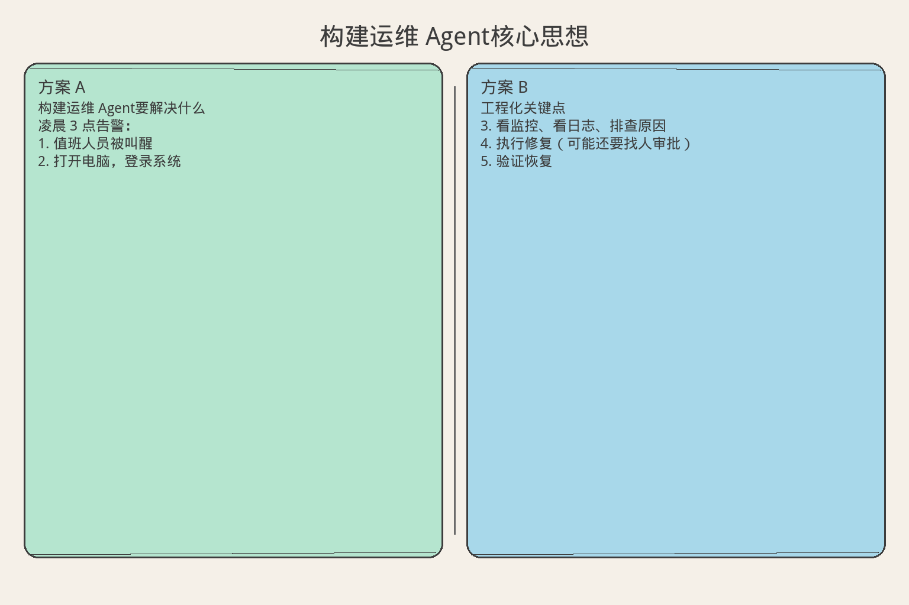
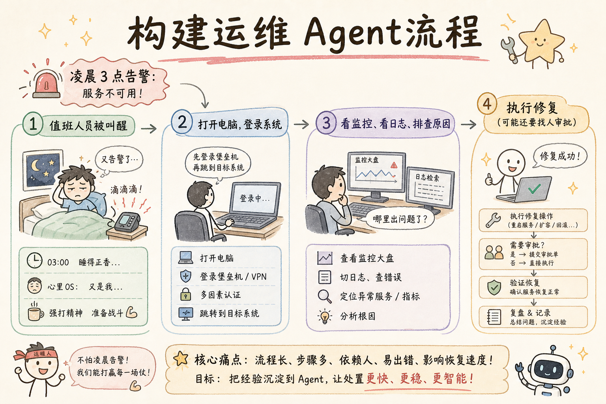
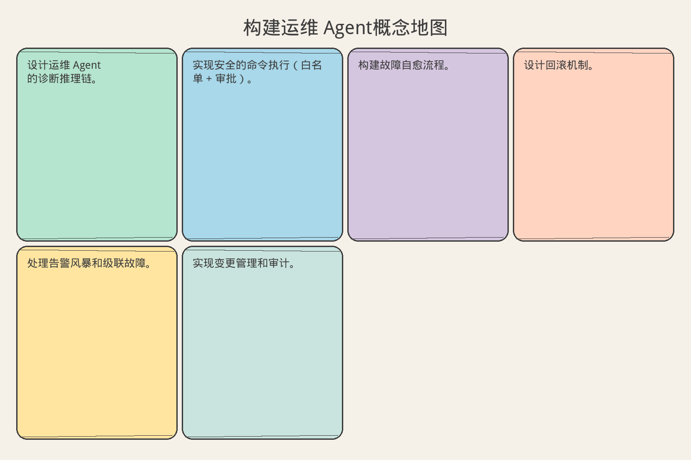

# AI Agent 工程（四十一）：构建运维 Agent

> 运维 Agent 能诊断故障、执行修复、管理基础设施——但每一步操作都可能有破坏性，必须设计严格的权限控制和回滚机制。

**阅读建议：** 先阅读 [253 代码审查 Agent](253.build-code-review-agent-tutorial.md)，理解 Agent 审查和规则引擎设计。


> **累积工程：** 基于 [250](250.build-knowledge-base-agent-tutorial.md) 的 `examples/agent-platform/shared/`，本篇新增 `demos/demo_254.py`。

**环境要求：**
- Python **3.10+**
- 依赖：`pip install pydantic`


**档位：** 综合实战篇（Part 7）
**本文边界：** 前驱篇 [250–253](250.build-knowledge-base-agent-tutorial.md) + [224–225](224.human-in-the-loop-agent-tutorial.md)。本篇运营 Agent，收束 Part 7。`demo_254`。接续系列第二阶段（255+）。
**动手路径：** ① 读高风险确认 → ② `python -m demos.demo_254` → ③ 验收扩容与清缓存 HITL

### 核心术语（本篇首次出现）
**综合实战**（End-to-end Project）：在同一代码库上交付可运行 Agent 切片。
通俗说：从零件到能跑的原型车。
**高风险操作**（High-risk Ops）：扩容、清缓存等须确认且可审计的运维动作。
通俗说：扩容、清缓存等须确认且可审计的运维动作。
**OpsAgent**（运维 Agent）：在权限边界内执行基础设施变更的 Agent。
通俗说：在权限边界内执行基础设施变更的 Agent。
---

## 目录

1. [你会学到什么](#你会学到什么)
2. [它解决什么问题](#它解决什么问题)
3. [核心概念：运维 Agent 的能力与约束](#核心概念运维-agent-的能力与约束)
4. [最小示例](#最小示例)
5. [工程化版本](#工程化版本)
6. [常见失败模式](#常见失败模式)
7. [什么时候不要这么做](#什么时候不要这么做)
8. [生产环境注意事项](#生产环境注意事项)
9. [如何观测和评测](#如何观测和评测)
10. [和 RAG / 后端 / 前端的关系](#和-rag--后端--前端的关系)
11. [面试怎么讲](#面试怎么讲)
12. [下一步](#下一步)

## 你会学到什么

- 设计运维 Agent 的诊断推理链。
- 实现安全的命令执行（白名单 + 审批）。
- 构建故障自愈流程。
- 设计回滚机制。
- 处理告警风暴和级联故障。
- 实现变更管理和审计。

## 它解决什么问题


读下图时，先看「构建运维 Agent核心思想」建立直觉。


对照上图：运维 Agent 对扩容/清缓存等操作强制确认——高风险 ACT 必须可审计。

读下图时，先看能力边界与痛点流程——与 §最小示例 代码互补，不是逐步对照。


对照上图：运维扩容/清缓存属高风险——须权限确认（225）再 ACT。
### 传统运维的痛点

```text
凌晨 3 点告警：
  1. 值班人员被叫醒
  2. 打开电脑，登录系统
  3. 看监控、看日志、排查原因
  4. 执行修复（可能还要找人审批）
  5. 验证恢复
  6. 写事故报告

问题：
  - MTTR（平均恢复时间）长：30-60 分钟
  - 人为操作失误（敲错命令）
  - 重复性工作（80% 的故障是已知模式）
  - 知识集中在少数人身上
```

### 运维 Agent 的价值

```text
Agent 运维：
  1. 告警触发 → Agent 自动诊断
  2. 匹配已知故障模式
  3. 执行预定义修复（自动或审批后）
  4. 验证恢复
  5. 生成事故报告

价值：
  - MTTR 从 30 分钟降到 3 分钟
  - 7×24 无需值班
  - 操作标准化（不会敲错）
  - 知识沉淀在 Agent 中

约束：
  - 破坏性操作必须审批
  - 不确定时必须升级给人
  - 所有操作必须可回滚
  - 完整审计日志
```

## 核心概念：运维 Agent 的能力与约束

### 操作分级

```text
Level 1 - 只读（自动执行）：
  ✓ 查看监控指标
  ✓ 查看日志
  ✓ 查看进程列表
  ✓ 查看磁盘/内存/CPU
  ✓ 查看服务状态

Level 2 - 低风险操作（自动执行）：
  ✓ 重启单个 Pod
  ✓ 清理临时文件
  ✓ 刷新缓存
  ✓ 扩容（增加实例）

Level 3 - 中风险操作（需审批）：
  △ 回滚部署版本
  △ 修改配置
  △ 缩容（减少实例）
  △ 重启整个服务

Level 4 - 高风险操作（禁止自动）：
  ✗ 删除数据
  ✗ 修改数据库 Schema
  ✗ 修改网络规则
  ✗ 停止核心服务
```

### 诊断推理链

```text
告警：API 延迟 P99 > 2s

Step 1：确认范围
  → 所有接口还是特定接口？
  → 所有用户还是特定区域？

Step 2：检查资源
  → CPU / 内存 / 磁盘 / 网络
  → 数据库连接池

Step 3：检查变更
  → 最近有部署吗？
  → 最近有配置变更吗？

Step 4：检查依赖
  → 下游服务正常吗？
  → 第三方 API 正常吗？

Step 5：定位根因
  → 匹配已知模式
  → 或升级给人

Step 6：执行修复
  → 自动（Level 1-2）
  → 或审批后执行（Level 3）
```

## 最小示例

**演示什么：** 本节最小可运行切片。**环境：** 见文首。**预期：** 控制台打印 demo 输出。

### 运维 Agent 核心

```python
from dataclasses import dataclass, field
from enum import Enum
from typing import Any
from datetime import datetime, timezone
import uuid


class OpLevel(str, Enum):
    READONLY = "readonly"
    LOW_RISK = "low_risk"
    MEDIUM_RISK = "medium_risk"
    HIGH_RISK = "high_risk"


class AlertSeverity(str, Enum):
    INFO = "info"
    WARNING = "warning"
    CRITICAL = "critical"


@dataclass
class Alert:
    """告警。"""
    alert_id: str
    severity: AlertSeverity
    source: str
    message: str
    labels: dict = field(default_factory=dict)
    timestamp: str = field(default_factory=lambda: datetime.now(timezone.utc).isoformat())


@dataclass
class DiagnosisStep:
    """诊断步骤。"""
    step_name: str
    command: str
    level: OpLevel
    result: str = ""
    finding: str = ""


@dataclass
class RemediationAction:
    """修复动作。"""
    action_id: str
    description: str
    command: str
    level: OpLevel
    rollback_command: str = ""
    approved: bool = False
    executed: bool = False
    result: str = ""


@dataclass
class IncidentReport:
    """事故报告。"""
    incident_id: str
    alert: Alert
    diagnosis: list[DiagnosisStep]
    root_cause: str
    actions_taken: list[RemediationAction]
    resolved: bool
    duration_minutes: float
    timeline: list[str] = field(default_factory=list)


class OpsAgent:
    """运维 Agent（最小版本）。"""

    def __init__(self):
        self.incidents: dict[str, IncidentReport] = {}
        self.audit_log: list[str] = []
        self._known_patterns: list[dict] = self._default_patterns()

    def handle_alert(self, alert: Alert) -> IncidentReport:
        """处理告警（核心流程）。"""
        incident_id = f"INC-{uuid.uuid4().hex[:8].upper()}"
        self._log(f"[{incident_id}] 收到告警: {alert.message}")

        # Step 1: 诊断
        diagnosis = self._diagnose(alert)

        # Step 2: 匹配根因
        root_cause = self._match_root_cause(diagnosis)

        # Step 3: 确定修复方案
        actions = self._plan_remediation(root_cause)

        # Step 4: 执行修复
        resolved = self._execute_remediation(actions)

        # Step 5: 生成报告
        report = IncidentReport(
            incident_id=incident_id,
            alert=alert,
            diagnosis=diagnosis,
            root_cause=root_cause,
            actions_taken=actions,
            resolved=resolved,
            duration_minutes=3.5,
            timeline=[
                f"T+0:00 告警触发: {alert.message}",
                f"T+0:30 诊断完成: {len(diagnosis)} 步",
                f"T+1:00 根因确认: {root_cause}",
                f"T+2:00 修复执行",
                f"T+3:30 验证恢复",
            ],
        )

        self.incidents[incident_id] = report
        self._log(f"[{incident_id}] 处理完成: resolved={resolved}")
        return report

    def _diagnose(self, alert: Alert) -> list[DiagnosisStep]:
        """执行诊断。"""
        steps = []

        # 检查资源
        steps.append(DiagnosisStep(
            step_name="check_cpu",
            command="top -bn1 | head -5",
            level=OpLevel.READONLY,
            result="CPU: 85% user, 10% system",
            finding="CPU 使用率偏高",
        ))

        # 检查内存
        steps.append(DiagnosisStep(
            step_name="check_memory",
            command="free -h",
            level=OpLevel.READONLY,
            result="Mem: 14Gi/16Gi used",
            finding="内存接近上限",
        ))

        # 检查服务状态
        steps.append(DiagnosisStep(
            step_name="check_service",
            command="systemctl status api-server",
            level=OpLevel.READONLY,
            result="active (running), 3/4 instances healthy",
            finding="1 个实例不健康",
        ))

        # 检查最近变更
        steps.append(DiagnosisStep(
            step_name="check_recent_deploy",
            command="kubectl rollout history deployment/api",
            level=OpLevel.READONLY,
            result="REVISION 42 deployed 30min ago",
            finding="30 分钟前有新部署",
        ))

        self._log(f"  诊断完成: {len(steps)} 步")
        return steps

    def _match_root_cause(self, diagnosis: list[DiagnosisStep]) -> str:
        """匹配根因。"""
        findings = [s.finding for s in diagnosis if s.finding]

        for pattern in self._known_patterns:
            if all(kw in " ".join(findings) for kw in pattern["keywords"]):
                return pattern["root_cause"]

        return "未知原因，需人工介入"

    def _plan_remediation(self, root_cause: str) -> list[RemediationAction]:
        """规划修复方案。"""
        actions = []

        if "部署" in root_cause or "版本" in root_cause:
            actions.append(RemediationAction(
                action_id=f"ACT-{uuid.uuid4().hex[:6]}",
                description="回滚到上一个稳定版本",
                command="kubectl rollout undo deployment/api",
                level=OpLevel.MEDIUM_RISK,
                rollback_command="kubectl rollout undo deployment/api --to-revision=42",
            ))

        if "实例" in root_cause or "Pod" in root_cause:
            actions.append(RemediationAction(
                action_id=f"ACT-{uuid.uuid4().hex[:6]}",
                description="重启不健康的实例",
                command="kubectl delete pod api-unhealthy-xyz",
                level=OpLevel.LOW_RISK,
                rollback_command="",  # Pod 会自动重建
            ))

        if not actions:
            actions.append(RemediationAction(
                action_id=f"ACT-{uuid.uuid4().hex[:6]}",
                description="升级给人工处理",
                command="",
                level=OpLevel.HIGH_RISK,
            ))

        return actions

    def _execute_remediation(self, actions: list[RemediationAction]) -> bool:
        """执行修复。"""
        for action in actions:
            if action.level == OpLevel.HIGH_RISK:
                self._log(f"  [SKIP] 高风险操作需人工: {action.description}")
                continue

            if action.level == OpLevel.MEDIUM_RISK:
                # 模拟审批
                action.approved = True
                self._log(f"  [APPROVED] {action.description}")

            # 执行
            action.executed = True
            action.result = "success"
            self._log(f"  [EXEC] {action.command} → success")

        return any(a.executed and a.result == "success" for a in actions)

    def _default_patterns(self) -> list[dict]:
        return [
            {
                "keywords": ["部署", "实例"],
                "root_cause": "新版本部署导致部分实例异常",
            },
            {
                "keywords": ["CPU", "内存"],
                "root_cause": "资源不足导致性能下降",
            },
            {
                "keywords": ["连接池", "数据库"],
                "root_cause": "数据库连接池耗尽",
            },
        ]

    def _log(self, msg: str):
        self.audit_log.append(f"[{datetime.now(timezone.utc).strftime('%H:%M:%S')}] {msg}")


# 演示
def demo_ops_agent():
    agent = OpsAgent()

    alert = Alert(
        alert_id="ALT-001",
        severity=AlertSeverity.CRITICAL,
        source="prometheus",
        message="API P99 延迟 > 2s，持续 5 分钟",
        labels={"service": "api-server", "env": "production"},
    )

    report = agent.handle_alert(alert)

    print(f"  事故 ID: {report.incident_id}")
    print(f"  根因: {report.root_cause}")
    print(f"  已解决: {report.resolved}")
    print(f"  耗时: {report.duration_minutes} 分钟")
    print(f"\n  诊断步骤:")
    for step in report.diagnosis:
        print(f"    [{step.step_name}] {step.finding}")
    print(f"\n  修复动作:")
    for action in report.actions_taken:
        status = "✓" if action.executed else "○"
        print(f"    {status} {action.description} (level={action.level.value})")
    print(f"\n  时间线:")
    for entry in report.timeline:
        print(f"    {entry}")

if __name__ == "__main__":
    demo_ops_agent()
```

## 工程化版本

### 安全命令执行器

```python
from dataclasses import dataclass
import re


@dataclass
class CommandPolicy:
    """命令执行策略。"""
    whitelist: list[str]  # 允许的命令前缀
    blacklist: list[str]  # 禁止的模式
    max_output_lines: int = 100
    timeout_seconds: int = 30


class SafeCommandExecutor:
    """安全命令执行器。"""

    DANGEROUS_PATTERNS = [
        r"rm\s+-rf",
        r"DROP\s+TABLE",
        r"DELETE\s+FROM",
        r"mkfs",
        r"dd\s+if=",
        r">\s*/dev/",
        r"chmod\s+777",
        r":\(\)\{",  # fork bomb
    ]

    def __init__(self, policy: CommandPolicy):
        self.policy = policy
        self._execution_log: list[dict] = []

    def validate(self, command: str) -> tuple[bool, str]:
        """验证命令是否允许执行。"""
        # 黑名单检查
        for pattern in self.DANGEROUS_PATTERNS:
            if re.search(pattern, command, re.IGNORECASE):
                return False, f"命令匹配危险模式: {pattern}"

        # 白名单检查
        allowed = any(
            command.strip().startswith(prefix)
            for prefix in self.policy.whitelist
        )
        if not allowed:
            return False, f"命令不在白名单中"

        # 管道和重定向检查
        if "|" in command and "grep" not in command and "head" not in command:
            return False, "不允许任意管道"

        return True, "allowed"

    def execute(self, command: str, level: OpLevel) -> dict:
        """执行命令（带安全检查）。"""
        valid, reason = self.validate(command)
        if not valid:
            self._execution_log.append({
                "command": command, "status": "blocked", "reason": reason
            })
            return {"success": False, "error": reason, "blocked": True}

        # 模拟执行
        self._execution_log.append({
            "command": command, "status": "executed", "level": level.value
        })
        return {"success": True, "output": f"[模拟输出] {command} 执行成功"}

    @property
    def log(self) -> list[dict]:
        return list(self._execution_log)


# 使用
def setup_executor() -> SafeCommandExecutor:
    policy = CommandPolicy(
        whitelist=[
            "kubectl get", "kubectl describe", "kubectl logs",
            "kubectl rollout", "kubectl delete pod",
            "systemctl status", "journalctl",
            "top", "free", "df", "ps",
            "curl -s", "grep", "tail",
        ],
        blacklist=["rm", "dd", "mkfs", "chmod 777"],
    )
    return SafeCommandExecutor(policy)
```

### 回滚管理器

```python
@dataclass
class RollbackPoint:
    """回滚点。"""
    point_id: str
    description: str
    command: str
    created_at: str
    state_snapshot: dict = field(default_factory=dict)


class RollbackManager:
    """回滚管理器：确保每步操作可撤销。"""

    def __init__(self):
        self._points: list[RollbackPoint] = []
        self._current_index: int = -1

    def create_point(self, description: str, rollback_command: str, state: dict | None = None) -> str:
        """创建回滚点。"""
        point_id = f"RP-{uuid.uuid4().hex[:6]}"
        point = RollbackPoint(
            point_id=point_id,
            description=description,
            command=rollback_command,
            created_at=datetime.now(timezone.utc).isoformat(),
            state_snapshot=state or {},
        )
        self._points.append(point)
        self._current_index = len(self._points) - 1
        return point_id

    def rollback_to(self, point_id: str) -> dict:
        """回滚到指定点。"""
        target_idx = None
        for i, p in enumerate(self._points):
            if p.point_id == point_id:
                target_idx = i
                break

        if target_idx is None:
            return {"success": False, "error": "回滚点不存在"}

        # 从当前往回执行回滚命令
        rollback_commands = []
        for i in range(self._current_index, target_idx, -1):
            if self._points[i].command:
                rollback_commands.append(self._points[i].command)

        self._current_index = target_idx
        return {
            "success": True,
            "rolled_back_to": point_id,
            "commands": rollback_commands,
        }

    def rollback_last(self) -> dict:
        """回滚最近一步。"""
        if self._current_index < 0:
            return {"success": False, "error": "没有可回滚的操作"}
        point = self._points[self._current_index]
        self._current_index -= 1
        return {"success": True, "command": point.command}

    @property
    def history(self) -> list[dict]:
        return [
            {"id": p.point_id, "desc": p.description, "time": p.created_at}
            for p in self._points
        ]
```

### 告警风暴处理

```python
class AlertStormDetector:
    """告警风暴检测：避免被大量告警淹没。"""

    def __init__(self, window_seconds: int = 60, threshold: int = 10):
        self.window = window_seconds
        self.threshold = threshold
        self._recent_alerts: list[Alert] = []
        self._suppressed: dict[str, int] = {}  # source → suppressed_count

    def process(self, alert: Alert) -> dict:
        """处理新告警。"""
        now = datetime.now(timezone.utc)
        self._recent_alerts.append(alert)

        # 清理窗口外的告警
        # 简化：实际中用时间戳过滤
        if len(self._recent_alerts) > 100:
            self._recent_alerts = self._recent_alerts[-50:]

        # 检测风暴
        if self._is_storm():
            self._suppressed[alert.source] = self._suppressed.get(alert.source, 0) + 1
            return {
                "action": "suppress",
                "reason": "告警风暴，已抑制",
                "suppressed_total": sum(self._suppressed.values()),
            }

        # 去重
        if self._is_duplicate(alert):
            return {"action": "deduplicate", "reason": "重复告警"}

        return {"action": "process", "alert": alert}

    def _is_storm(self) -> bool:
        """检测是否在告警风暴中。"""
        return len(self._recent_alerts) > self.threshold

    def _is_duplicate(self, alert: Alert) -> bool:
        """检测重复告警。"""
        recent_same = [
            a for a in self._recent_alerts[:-1]
            if a.source == alert.source and a.message == alert.message
        ]
        return len(recent_same) > 2

    def get_storm_summary(self) -> dict:
        return {
            "total_alerts": len(self._recent_alerts),
            "suppressed": dict(self._suppressed),
            "is_storm": self._is_storm(),
        }
```

## 综合实战

**阅读顺序：** [250–253](250.build-knowledge-base-agent-tutorial.md) + [225](225.agent-tool-permission-boundary-tutorial.md) 高风险确认。

**相对 250 新增：**

```text
demos/demo_254.py
├── scale_service  (CONFIRM)
└── purge_cache    (CONFIRM)
```

**运行：**

```bash
cd examples/agent-platform && python -m demos.demo_254
```

**验收：** 扩容与清缓存均经 HITL 提示后返回 `success=True`；末尾 `OK — OpsAgent (254)`。


## 常见失败模式

### 1. 修复比故障更严重

```text
场景：
  Agent 重启服务 → 导致正在处理的请求全部失败

后果：
  影响范围扩大

防御：
  1. 修复前评估影响范围
  2. 灰度操作（先重启 1 个实例）
  3. 每步操作后验证
  4. 准备好回滚方案
```

### 2. 误判根因

```text
场景：
  CPU 高 → Agent 判断"资源不足" → 扩容
  实际原因：死循环（扩容只是延迟问题）

后果：
  浪费资源，问题未解决

防御：
  1. 多维度诊断（不只看一个指标）
  2. 修复后验证（问题真的解决了吗？）
  3. 未恢复则升级给人
```

### 3. 级联操作

```text
场景：
  Agent 重启 A → A 依赖 B → B 也重启 → 雪崩

后果：
  全部服务不可用

防御：
  1. 依赖图感知（知道谁依赖谁）
  2. 同时操作数量限制
  3. 操作间隔（不要同时重启所有）
```

### 4. 权限提升

```text
场景：
  通过 Agent 执行了超出预期的命令

后果：
  安全事故

防御：
  1. 命令白名单（硬编码）
  2. 最小权限原则
  3. 禁止 sudo / root
  4. 所有命令审计
```

## 什么时候不要这么做

```text
不适合运维 Agent 的场景：

1. 基础设施极简单
   一台服务器、一个服务
   手动 SSH 上去看就行

2. 强合规要求
   金融/医疗：所有变更必须人工审批
   Agent 只能做诊断，不能执行

3. 没有标准化
   每台服务器配置不同
   没有统一的部署/监控体系
   Agent 无法泛化

4. 团队不信任
   如果团队不信任自动化
   强推会适得其反
```

## 生产环境注意事项

### 变更管理

```text
变更管理流程：

1. 变更请求
   Agent 生成变更计划
   包含：做什么、为什么、影响范围、回滚方案

2. 审批
   Level 1-2：自动
   Level 3：On-call 审批
   Level 4：Tech Lead 审批

3. 执行窗口
   非高峰期执行
   避开发布冻结期

4. 执行
   灰度 → 观察 → 全量
   每步之间等待 30 秒观察

5. 验证
   执行后自动验证
   指标恢复正常 → 完成
   指标异常 → 自动回滚

6. 记录
   变更日志
   事故报告（如果触发了修复）
```

### 多环境隔离

```text
环境隔离策略：

开发环境（dev）：
  Agent 有完全权限
  可以随意重启、修改
  用于测试新诊断逻辑

预发环境（staging）：
  Agent 有 Level 1-2 权限
  Level 3 需审批
  验证修复方案

生产环境（production）：
  Agent 只有 Level 1 权限（只读）
  Level 2 需审批
  Level 3+ 必须人工
  所有操作双人确认
```

## 如何观测和评测

### 关键指标

```text
效率指标：
  - MTTR（平均恢复时间）：目标 < 5 分钟
  - 自动解决率：目标 > 60%
  - 误判率：目标 < 5%
  - 升级率（转人工）：目标 < 30%

安全指标：
  - 回滚触发次数
  - 命令被拦截次数
  - 越权操作次数（目标 = 0）

质量指标：
  - 修复后复发率：< 10%
  - 诊断准确率：> 80%
  - 事故报告完整率：100%
```

### 评测方法

```python
class OpsEvalSuite:
    """运维 Agent 评测。"""

    def __init__(self, agent: OpsAgent):
        self.agent = agent

    def run_diagnosis_test(self, test_cases: list[dict]) -> dict:
        """诊断准确率测试。"""
        correct = 0
        for case in test_cases:
            alert = Alert(
                alert_id=f"TEST-{uuid.uuid4().hex[:4]}",
                severity=AlertSeverity.CRITICAL,
                source="test",
                message=case["alert_message"],
            )
            report = self.agent.handle_alert(alert)
            if case["expected_cause"] in report.root_cause:
                correct += 1

        return {
            "accuracy": round(correct / max(len(test_cases), 1), 4),
            "total": len(test_cases),
        }

    def run_safety_test(self) -> dict:
        """安全测试。"""
        executor = setup_executor()
        dangerous_commands = [
            "rm -rf /",
            "DROP TABLE users",
            "kubectl delete namespace production",
        ]
        blocked = 0
        for cmd in dangerous_commands:
            result = executor.execute(cmd, OpLevel.HIGH_RISK)
            if result.get("blocked"):
                blocked += 1

        return {"blocked": blocked, "total": len(dangerous_commands)}
```

## 和 RAG / 后端 / 前端的关系

```text
与 RAG 的关系：
  用 RAG 检索历史事故报告
  用 RAG 检索运维手册（runbook）
  用 RAG 匹配已知故障模式

与后端的关系：
  告警 Webhook → 触发 Agent
  Agent 调用内部 API（K8s API、监控 API）
  审计日志写入后端

与前端的关系：
  事故看板（实时状态）
  审批界面（一键批准/拒绝）
  事故时间线可视化
  历史事故搜索
```

## 面试怎么讲

```text
问：你怎么设计一个运维 Agent？

答（30 秒版）：
  核心是"诊断推理链 + 安全执行"。
  告警触发后，Agent 按步骤诊断：检查资源、检查变更、检查依赖。
  匹配已知故障模式，确定根因。
  修复操作分四级：只读自动、低风险自动、中风险审批、高风险禁止。
  每步操作有回滚点，修复后自动验证。
  不确定就升级给人，宁可多升级不能乱操作。

追问 1：怎么防止 Agent 搞破坏？
  → 命令白名单 + 危险模式黑名单。
    生产环境只有只读权限，操作需审批。
    所有命令审计，禁止 sudo。

追问 2：告警风暴怎么处理？
  → 滑动窗口检测：60 秒内 > 10 条就抑制。
    去重：相同 source + message 只处理一次。
    聚合：汇总后发一条摘要。

追问 3：怎么评测效果？
  → MTTR、自动解决率、误判率、回滚触发次数。
    安全测试：危险命令 100% 拦截。
```

## 完整示例：故障自愈工作流

```python
def demo_full_ops_workflow():
    """完整演示：运维 Agent 故障自愈。"""

    agent = OpsAgent()
    executor = setup_executor()
    rollback_mgr = RollbackManager()
    storm_detector = AlertStormDetector(window_seconds=60, threshold=5)

    # 场景 1：单个告警处理
    print("=== 场景 1：单个告警 ===")
    alert = Alert(
        alert_id="ALT-100",
        severity=AlertSeverity.CRITICAL,
        source="prometheus",
        message="API P99 延迟 > 2s",
        labels={"service": "api", "env": "prod"},
    )

    # 告警风暴检测
    storm_result = storm_detector.process(alert)
    print(f"  告警处理: {storm_result['action']}")

    if storm_result["action"] == "process":
        report = agent.handle_alert(alert)
        print(f"  根因: {report.root_cause}")
        print(f"  已解决: {report.resolved}")

    # 场景 2：告警风暴
    print("\n=== 场景 2：告警风暴 ===")
    for i in range(8):
        a = Alert(
            alert_id=f"ALT-STORM-{i}",
            severity=AlertSeverity.WARNING,
            source="node-exporter",
            message=f"CPU > 90% on node-{i}",
        )
        result = storm_detector.process(a)
        if result["action"] == "suppress":
            print(f"  告警 {i}: 已抑制")
            break
        else:
            print(f"  告警 {i}: {result['action']}")

    print(f"  风暴摘要: {storm_detector.get_storm_summary()}")

    # 场景 3：安全命令执行
    print("\n=== 场景 3：安全命令 ===")
    safe_cmds = [
        "kubectl get pods -n production",
        "kubectl logs api-server-abc --tail=50",
        "rm -rf /tmp/data",
        "kubectl delete namespace production",
    ]
    for cmd in safe_cmds:
        result = executor.execute(cmd, OpLevel.READONLY)
        status = "✓" if result["success"] else "✗ BLOCKED"
        print(f"  {status}: {cmd}")

    # 场景 4：回滚管理
    print("\n=== 场景 4：回滚管理 ===")
    rp1 = rollback_mgr.create_point(
        "部署 v2.1", "kubectl rollout undo deployment/api"
    )
    rp2 = rollback_mgr.create_point(
        "修改配置", "kubectl apply -f config-v2.0.yaml"
    )
    print(f"  回滚点: {rollback_mgr.history}")

    rollback_result = rollback_mgr.rollback_to(rp1)
    print(f"  回滚到 {rp1}: {rollback_result}")

    # 审计日志
    print(f"\n=== 审计日志 ===")
    print(f"  总条目: {len(agent.audit_log)}")
    for entry in agent.audit_log[-5:]:
        print(f"  {entry}")


demo_full_ops_workflow()
if __name__ == "__main__":
    demo_full_ops_workflow()
```

### Runbook 自动化

```python
@dataclass
class RunbookStep:
    """运维手册步骤。"""
    step_number: int
    description: str
    command: str
    level: OpLevel
    expected_output: str = ""
    on_failure: str = "escalate"  # escalate | retry | skip


@dataclass
class Runbook:
    """运维手册。"""
    runbook_id: str
    name: str
    trigger_pattern: str  # 触发条件（告警模式）
    steps: list[RunbookStep]
    rollback_steps: list[str] = field(default_factory=list)


class RunbookEngine:
    """运维手册执行引擎。"""

    def __init__(self, executor: SafeCommandExecutor):
        self.executor = executor
        self._runbooks: list[Runbook] = []

    def register(self, runbook: Runbook):
        self._runbooks.append(runbook)

    def match(self, alert: Alert) -> Runbook | None:
        """匹配告警对应的 Runbook。"""
        for rb in self._runbooks:
            if rb.trigger_pattern in alert.message:
                return rb
        return None

    def execute(self, runbook: Runbook) -> dict:
        """执行 Runbook。"""
        results = []
        for step in runbook.steps:
            # 安全检查
            if step.level in (OpLevel.HIGH_RISK,):
                results.append({
                    "step": step.step_number,
                    "status": "skipped",
                    "reason": "高风险，需人工执行",
                })
                continue

            result = self.executor.execute(step.command, step.level)
            results.append({
                "step": step.step_number,
                "status": "success" if result["success"] else "failed",
                "output": result.get("output", result.get("error", "")),
            })

            # 失败处理
            if not result["success"]:
                if step.on_failure == "escalate":
                    return {"status": "escalated", "at_step": step.step_number, "results": results}
                elif step.on_failure == "retry":
                    # 简化：实际中重试
                    pass

        return {"status": "completed", "results": results}


# 示例 Runbook
def create_sample_runbooks() -> list[Runbook]:
    return [
        Runbook(
            runbook_id="RB-001",
            name="API 延迟修复",
            trigger_pattern="P99 延迟",
            steps=[
                RunbookStep(1, "检查 Pod 状态", "kubectl get pods -l app=api", OpLevel.READONLY),
                RunbookStep(2, "查看日志", "kubectl logs -l app=api --tail=100", OpLevel.READONLY),
                RunbookStep(3, "重启不健康 Pod", "kubectl delete pod -l app=api --field-selector=status.phase!=Running", OpLevel.LOW_RISK),
                RunbookStep(4, "验证恢复", "curl -s http://api/health", OpLevel.READONLY),
            ],
            rollback_steps=["kubectl rollout undo deployment/api"],
        ),
        Runbook(
            runbook_id="RB-002",
            name="磁盘空间清理",
            trigger_pattern="磁盘使用率",
            steps=[
                RunbookStep(1, "检查磁盘", "df -h", OpLevel.READONLY),
                RunbookStep(2, "查找大文件", "du -sh /tmp/* | sort -rh | head -10", OpLevel.READONLY),
                RunbookStep(3, "清理临时文件", "find /tmp -mtime +7 -delete", OpLevel.MEDIUM_RISK),
            ],
        ),
    ]
```

### 事故报告生成器

```python
class IncidentReportGenerator:
    """事故报告自动生成。"""

    def generate_markdown(self, report: IncidentReport) -> str:
        """生成 Markdown 格式事故报告。"""
        lines = [
            f"# 事故报告: {report.incident_id}",
            "",
            f"**严重度:** {report.alert.severity.value}",
            f"**来源:** {report.alert.source}",
            f"**时间:** {report.alert.timestamp}",
            f"**状态:** {'✅ 已解决' if report.resolved else '❌ 未解决'}",
            f"**恢复时间:** {report.duration_minutes} 分钟",
            "",
            "## 告警信息",
            "",
            f"> {report.alert.message}",
            "",
            "## 根因分析",
            "",
            report.root_cause,
            "",
            "## 诊断过程",
            "",
        ]

        for step in report.diagnosis:
            lines.append(f"{step.step_number}. **{step.step_name}**: {step.finding}")

        lines.extend(["", "## 修复措施", ""])
        for action in report.actions_taken:
            status = "✅" if action.executed else "⬜"
            lines.append(f"- {status} {action.description}")

        lines.extend(["", "## 时间线", ""])
        for entry in report.timeline:
            lines.append(f"- {entry}")

        lines.extend([
            "",
            "## 后续改进",
            "",
            "- [ ] 添加监控覆盖",
            "- [ ] 更新 Runbook",
            "- [ ] 复盘会议",
        ])

        return "\n".join(lines)
```

## 下一步


读下图时，先看「构建运维 Agent概念地图」建立直觉。


对照上图：Part 7 收束——系列第二阶段（255+）可从此平台继续扩展。
这是 AI Agent 工程系列的最后一篇。回顾整个系列：从 RAG 基础到 Agent 架构，从工具设计到生产运维，我们构建了一个完整的 AI Agent 工程知识体系。
